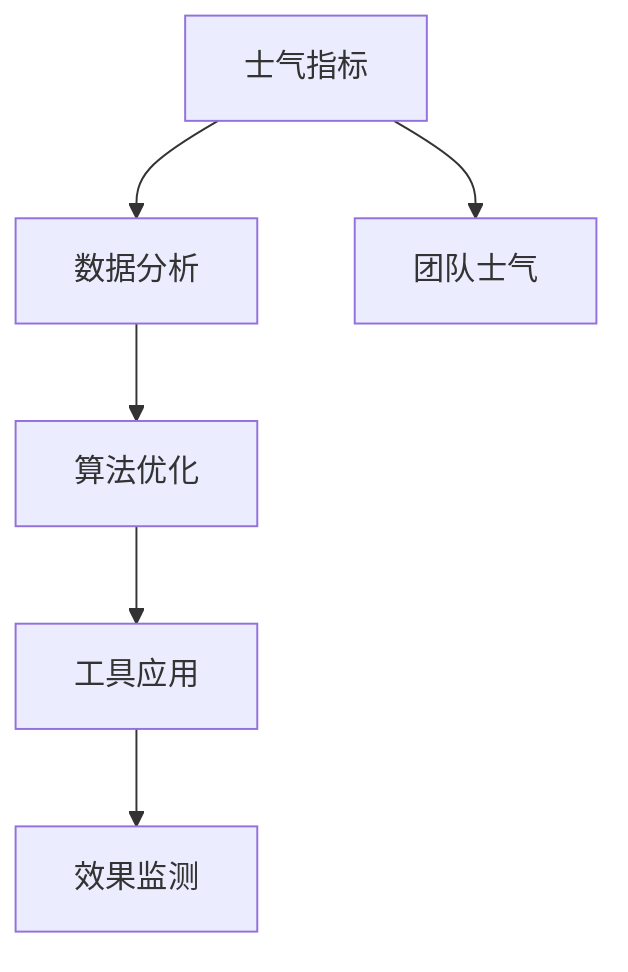

                 


# 《团队士气低落？这些方法可以提升》

> 关键词：团队士气、提升方法、领导力、团队建设、员工激励、沟通技巧、组织文化

> 摘要：本文从多个角度分析了团队士气低落的原因，并提供了实用的提升方法，包括领导力提升、团队建设、员工激励、沟通技巧和组织文化建设。通过案例分析和实践策略，帮助读者理解如何有效提升团队士气，创造更积极的工作氛围。

## 引言

在当今竞争激烈的商业环境中，团队士气对于企业的成功至关重要。一个士气高涨的团队能够更好地应对挑战，提高工作效率，实现业务目标。然而，团队士气低落的现象在企业中并不鲜见。低士气可能导致员工流失、工作效率下降、创新能力减弱等问题，最终影响企业的整体表现。因此，如何提升团队士气成为了企业管理者的重要课题。

本文将从以下几个方面探讨团队士气低落的原因及提升方法：

1. 团队士气概述
2. 原因分析
3. 领导力提升
4. 团队建设
5. 员工激励
6. 沟通技巧
7. 组织文化
8. 实践策略与案例分析
9. 障碍与应对
10. 总结与展望

## 第1章：团队士气概述

### 1.1 团队士气的定义与重要性

团队士气是指团队成员在共同完成工作任务时所表现出来的积极态度和热情。具体来说，团队士气包括以下几个方面：

- 情绪状态：团队成员的情绪状态，如积极性、愉快感、满足感等。
- 工作态度：团队成员对待工作的态度，如责任心、投入度、合作精神等。
- 团队归属感：团队成员对团队的认同感和归属感。

团队士气的重要性体现在以下几个方面：

- 提高工作效率：士气高涨的团队成员更加投入工作，能够更高效地完成任务。
- 增强团队凝聚力：高士气有助于团队成员之间的沟通与合作，增强团队凝聚力。
- 提升创新能力：良好的团队氛围能够激发团队成员的创造力，推动企业创新。
- 降低员工流失率：员工在企业中的满意度和归属感与团队士气密切相关。

### 1.2 团队士气的影响因素

团队士气受到多种因素的影响，主要包括以下几个方面：

- 工作环境：包括办公环境、工作氛围、企业文化等。
- 领导风格：领导者的管理方式对团队士气有重要影响。
- 个人因素：团队成员的个人情绪、压力、家庭状况等也会影响团队士气。
- 团队内部关系：团队成员之间的合作关系、沟通效果等。
- 组织结构：企业组织结构对团队士气也有一定影响。

### 1.3 团队士气评估方法

评估团队士气是提升团队士气的重要步骤。以下是一些常用的团队士气评估方法：

- 问卷调查：通过问卷调查了解团队成员的情绪状态、工作态度和团队归属感。
- 面谈：与团队成员进行一对一或小组面谈，深入了解他们的感受和建议。
- 观察法：通过观察团队成员的行为表现，评估他们的工作状态和团队氛围。
- 数据分析：分析企业相关数据，如员工流失率、工作效率、创新成果等，评估团队士气。

## 第2章：原因分析

### 2.1 工作压力与团队士气

工作压力是影响团队士气的一个重要因素。过大的工作压力可能导致团队成员情绪低落、工作效率下降，甚至出现身心问题。以下是一些可能导致工作压力的因素：

- 任务繁重：团队成员面临大量工作任务，难以在规定时间内完成。
- 时间压力：工作进度要求紧张，导致团队成员在短时间内必须完成大量工作。
- 持续加班：长时间加班可能导致团队成员身心疲惫，影响工作质量。
- 职业发展压力：团队成员可能对职业发展感到担忧，担心无法达到预期目标。

### 2.2 个人问题与团队士气

个人问题也是影响团队士气的一个重要因素。以下是一些可能导致个人问题的原因：

- 家庭压力：家庭问题如离婚、子女教育等可能导致员工情绪不稳定。
- 健康问题：健康问题如疾病、慢性病等可能影响员工的工作状态。
- 个人兴趣与工作冲突：员工可能因为个人兴趣与工作内容不符而感到不满足。
- 个人价值观与企业文化冲突：员工可能因为个人价值观与企业文化不符而感到不适。

### 2.3 领导风格与团队士气

领导风格对团队士气有重要影响。以下是一些可能导致团队士气低落的领导风格：

- 权威型领导：权威型领导者可能过于严格，缺乏对员工的关心和支持，导致员工情绪低落。
- 放任型领导：放任型领导者可能对员工的工作不够关注，导致员工感到无助和失落。
- 刻板型领导：刻板型领导者可能对员工的能力和创意缺乏认可，导致员工感到不被重视。
- 不公平型领导：不公平型领导者可能在分配工作任务和资源时偏袒某些员工，导致团队士气低落。

### 2.4 组织结构与团队士气

组织结构对团队士气也有一定影响。以下是一些可能导致团队士气低落的组织结构问题：

- 高层决策不透明：高层决策不透明可能导致员工感到迷茫和不安。
- 管理层级过多：过多的管理层级可能导致信息传递不畅，影响团队士气。
- 职责不清：职责不清可能导致员工之间的工作冲突，影响团队士气。
- 资源分配不均：资源分配不均可能导致某些员工感到不满，影响团队士气。

## 第3章：领导力提升

### 3.1 领导力与团队士气

领导力在提升团队士气中起着至关重要的作用。领导者的领导风格、管理能力、沟通技巧等都会影响团队士气。以下是一些关键因素：

- 领导风格：领导者应该根据团队的特点和需求，采用适当的领导风格，如民主型、参与型等。
- 管理能力：领导者需要具备良好的管理能力，包括任务分配、团队激励、问题解决等。
- 沟通技巧：领导者应该具备良好的沟通技巧，能够有效传达信息、倾听员工意见、解决冲突。

### 3.2 领导风格与团队士气

领导风格对团队士气有重要影响。以下是一些常见的领导风格及其对团队士气的影响：

- 民主型领导：民主型领导鼓励员工参与决策，提高员工的工作积极性和满意度。
- 参与型领导：参与型领导重视员工的个人发展和职业规划，提高员工的归属感和忠诚度。
- 监督型领导：监督型领导过于严格，可能导致员工感到压抑和不满，降低团队士气。
- 放任型领导：放任型领导可能缺乏对员工的关心和支持，导致员工感到无助和失落。

### 3.3 领导力提升策略

为了提升团队士气，领导者可以采取以下策略：

- 定期培训：领导者可以参加相关培训，提升自己的管理能力和沟通技巧。
- 倾听员工意见：领导者应该积极倾听员工的意见和建议，关注员工的需求和问题。
- 激励员工：领导者可以通过表扬、奖励等方式激励员工，提高员工的工作积极性。
- 建立良好的团队氛围：领导者可以组织团队建设活动，增强团队成员之间的沟通与合作。

### 3.4 领导力提升案例

以下是一个领导力提升的案例：

某互联网公司的CEO意识到团队士气低落，决定采取措施提升团队士气。他首先进行了问卷调查，了解员工的需求和问题。然后，他组织了一次团队建设活动，增强团队成员之间的沟通与合作。同时，他开始定期与员工进行一对一的沟通，倾听员工的意见和建议。此外，他还为员工提供了职业发展机会，鼓励员工积极参与公司决策。通过这些措施，团队士气得到了显著提升，员工的工作积极性和满意度也大幅提高。

## 第4章：团队建设

### 4.1 团队建设的重要性

团队建设对于提升团队士气至关重要。通过团队建设，可以增强团队成员之间的信任、沟通和合作，提高团队的整体执行力。以下是一些团队建设的重要性：

- 增强团队凝聚力：团队建设有助于团队成员建立深厚的友谊和信任，提高团队的凝聚力。
- 提高团队执行力：通过团队建设，团队成员能够更好地协调和配合，提高团队的执行力。
- 促进创新：团队建设有助于激发团队成员的创造力和创新意识，推动企业创新。
- 减少冲突：团队建设有助于团队成员建立共同的目标和价值观，减少冲突和摩擦。

### 4.2 团队建设的步骤

团队建设可以分为以下几个步骤：

- 确定团队目标：团队建设的第一步是明确团队的目标，确保团队成员都明确自己的职责和目标。
- 建立团队规则：建立明确的团队规则和沟通机制，确保团队成员之间的沟通畅通。
- 增强团队信任：通过开展信任游戏和活动，增强团队成员之间的信任。
- 提高团队沟通：通过培训和活动，提高团队成员的沟通技巧和表达能力。
- 促进团队合作：通过团队合作项目和活动，增强团队成员之间的协作能力。

### 4.3 团队建设的活动与技巧

以下是一些常用的团队建设活动和技巧：

- 团队建设游戏：通过团队建设游戏，如团队合作游戏、角色扮演等，增强团队成员之间的互动和合作。
- 走出舒适区：通过让团队成员走出舒适区，接受新的挑战，提高团队成员的自信心和团队合作能力。
- 员工参与：鼓励员工参与团队建设活动，提高员工的参与感和归属感。
- 反馈与评估：通过定期反馈和评估，了解团队建设的效果，及时调整和改进团队建设活动。

### 4.4 团队建设案例

以下是一个团队建设案例：

某电商公司在业务快速发展过程中，意识到团队建设的重要性。他们决定组织一次团队建设活动，增强团队成员之间的沟通和合作。他们选择了户外拓展活动作为团队建设的形式，如攀岩、绳索挑战等。通过这次活动，团队成员在克服困难和挑战的过程中建立了深厚的友谊和信任，团队凝聚力得到了显著提升。此外，他们还开展了内部培训，提高团队成员的沟通技巧和团队合作能力。通过这些措施，公司的业务发展得到了更好的支持，团队士气也得到了显著提升。

## 第5章：员工激励

### 5.1 员工激励的重要性

员工激励是提升团队士气的重要手段。通过有效的激励措施，可以激发员工的工作积极性、创造力和忠诚度。以下是一些员工激励的重要性：

- 提高工作效率：员工激励能够激发员工的工作热情，提高工作效率。
- 增强创新能力：员工激励有助于激发员工的创造力，推动企业创新。
- 提高员工满意度：员工激励能够提高员工的工作满意度，降低员工流失率。
- 增强团队凝聚力：员工激励能够增强团队成员之间的合作精神，提高团队凝聚力。

### 5.2 员工激励的理论基础

员工激励的理论基础主要包括以下几个方面：

- 马斯洛需求层次理论：马斯洛需求层次理论认为，人的需求分为生理需求、安全需求、社交需求、尊重需求和自我实现需求。员工激励应该针对不同层次的需求进行设计。
- 双因素理论：赫茨伯格的双因素理论认为，激励因素（如成就、认可、工作本身等）和保健因素（如薪酬、工作条件、人际关系等）共同作用于员工的满意度和不满意度。
- 期望理论：期望理论认为，员工的行为和动机取决于对结果的价值判断和期望。员工激励应该基于员工的期望和价值观进行设计。

### 5.3 员工激励的方法与工具

以下是一些常见的员工激励方法和工具：

- 薪酬激励：通过提高薪酬水平、提供绩效奖金、股权激励等方式激励员工。
- 荣誉激励：通过评选优秀员工、颁发荣誉证书、表彰大会等方式激励员工。
- 培训激励：通过提供培训机会、鼓励员工参加外部培训等方式激励员工。
- 职业发展激励：通过提供职业晋升机会、鼓励员工参加职业规划等方式激励员工。
- 工作环境激励：通过改善工作环境、提供舒适的办公条件等方式激励员工。

### 5.4 员工激励案例

以下是一个员工激励案例：

某高科技公司为了提升团队士气，决定实施一系列员工激励措施。首先，他们提高了绩效奖金的比例，让表现优秀的员工获得更多的奖励。其次，他们开展了评选优秀员工的表彰活动，对获奖员工进行公开表彰和奖励。此外，他们还为员工提供了丰富的培训机会，鼓励员工参加外部培训和内部培训。通过这些激励措施，公司员工的工作积极性得到了显著提高，团队士气也得到了显著提升。

## 第6章：沟通技巧

### 6.1 沟通技巧的重要性

沟通技巧在提升团队士气中起着至关重要的作用。有效的沟通能够增强团队成员之间的理解和信任，提高团队协作效率。以下是一些沟通技巧的重要性：

- 提高工作效率：有效的沟通能够确保团队成员理解任务要求和目标，避免误解和重复工作，提高工作效率。
- 减少冲突：有效的沟通有助于团队成员理解彼此的观点和需求，减少因误解和冲突导致的工作问题。
- 增强团队凝聚力：通过有效的沟通，团队成员能够建立更紧密的联系和信任，增强团队的凝聚力。
- 提升团队士气：有效的沟通能够传递积极的情绪和正能量，提升团队士气。

### 6.2 有效沟通的原则

以下是一些有效沟通的原则：

- 坦诚开放：在沟通中保持坦诚和开放，鼓励团队成员表达观点和意见。
- 倾听：倾听是有效沟通的关键，通过倾听了解对方的观点和需求，避免误解和冲突。
- 明确表达：在沟通中要明确表达自己的观点和需求，避免产生歧义。
- 尊重差异：尊重团队成员的观点和差异，建立平等和尊重的沟通氛围。
- 正面沟通：使用积极、正面的语言进行沟通，避免负面情绪和攻击性语言。

### 6.3 沟通障碍与解决方法

以下是一些常见的沟通障碍及其解决方法：

- 信息过载：解决方法：制定合理的沟通计划，避免过多无关信息的传递。
- 误解：解决方法：加强倾听和理解，确保双方对信息的理解和解读一致。
- 沟通障碍：解决方法：通过沟通培训提高团队成员的沟通技巧和表达能力。
- 情绪影响：解决方法：学会情绪管理，避免情绪影响沟通效果。

### 6.4 沟通技巧提升案例

以下是一个沟通技巧提升案例：

某创业公司意识到沟通技巧的重要性，决定开展一系列沟通培训活动。他们邀请了专业沟通培训师为员工提供培训，学习有效沟通的原则和方法。此外，他们还组织了团队内部的沟通会议，鼓励团队成员在会议中表达自己的观点和意见。通过这些措施，公司员工之间的沟通效果得到了显著提升，团队士气也得到了提升。

## 第7章：组织文化

### 7.1 组织文化概述

组织文化是指企业在长期经营过程中形成的共同价值观、行为准则和习惯。组织文化对团队士气有重要影响，以下是一些组织文化的特点：

- 共同价值观：组织文化是企业价值观的具体体现，包括企业愿景、使命、核心价值观等。
- 行为准则：组织文化会影响员工的行为和决策，形成一致的行为准则。
- 习惯：组织文化会在员工的日常工作和生活中形成习惯，影响团队士气。

### 7.2 组织文化与团队士气

组织文化与团队士气密切相关。以下是一些组织文化对团队士气的影响：

- 正面文化：积极、开放、包容的组织文化能够提升团队士气，激发员工的积极性和创造力。
- 负面文化：消极、压抑、不公平的组织文化会降低团队士气，影响员工的工作满意度和归属感。

### 7.3 建设积极组织文化的策略

以下是一些建设积极组织文化的策略：

- 明确价值观：明确企业的核心价值观，确保员工对企业的价值观有清晰的认识。
- 培养共同价值观：通过培训、活动等方式培养员工的共同价值观，形成团结、协作的组织氛围。
- 建立公平机制：建立公平的绩效评估和晋升机制，确保员工感受到公平和公正。
- 领导示范：领导者要树立良好的榜样，通过自身的行为和决策影响员工的价值观和行为。
- 激励员工：通过激励措施鼓励员工积极参与组织文化的建设，提高员工的归属感和认同感。

### 7.4 组织文化案例

以下是一个组织文化案例：

某互联网公司注重组织文化的建设，他们明确了企业的核心价值观，如创新、协作、客户至上等。公司通过举办各种活动，如团队建设、分享会、员工表彰等，培养员工的共同价值观和团队精神。此外，公司还建立了公平的绩效评估和晋升机制，确保员工能够公平地获得晋升和奖励。通过这些措施，公司的团队士气得到了显著提升，员工的工作积极性和创新能力也得到了提高。

## 第8章：实践策略与案例分析

### 8.1 实践策略概述

在提升团队士气的过程中，实践策略至关重要。以下是一些实践策略：

- 开展团队建设活动：定期组织团队建设活动，增强团队成员之间的沟通和信任。
- 提供培训和学习机会：为员工提供培训和学习机会，提高员工的技能和知识。
- 制定明确的绩效目标：为员工制定明确的绩效目标，激发员工的工作动力。
- 建立沟通渠道：建立有效的沟通渠道，确保员工能够及时反馈问题和建议。
- 表扬和奖励：对表现优秀的员工进行表扬和奖励，提高员工的工作积极性。

### 8.2 案例分析一：某互联网公司提升团队士气的实践

#### 8.2.1 案例背景

某互联网公司在快速发展的过程中，团队士气出现下滑。员工工作压力大，沟通不畅，团队凝聚力下降。为了提升团队士气，公司决定采取一系列措施。

#### 8.2.2 实施方案

- 开展团队建设活动：公司定期组织团队建设活动，如户外拓展、团建晚会等，增强团队成员之间的沟通和信任。
- 提供培训和学习机会：公司为员工提供各类培训和学习机会，提高员工的技能和知识，增强员工的职业发展信心。
- 制定明确的绩效目标：公司为员工制定明确的绩效目标，激发员工的工作动力，提高团队的整体执行力。
- 建立沟通渠道：公司建立内部沟通平台，鼓励员工随时反馈问题和建议，确保员工的声音能够被听到。
- 表扬和奖励：公司设立季度优秀员工评选，对表现优秀的员工进行表彰和奖励，提高员工的工作积极性。

#### 8.2.3 成果分析

通过一系列措施，公司的团队士气得到了显著提升。员工之间的沟通更加畅通，团队凝聚力增强，员工的工作积极性和创新能力也得到了提高。公司在业务方面取得了显著进展，团队士气提升的效果得到了充分体现。

### 8.3 案例分析二：某制造企业提升团队士气的实践

#### 8.3.1 案例背景

某制造企业在市场竞争激烈的情况下，团队士气低落。员工工作压力大，缺乏动力，团队协作效果不佳。为了提升团队士气，企业决定采取一系列措施。

#### 8.3.2 实施方案

- 改善工作环境：企业投入资金改善工作环境，提供舒适的办公条件和设施。
- 提高员工待遇：企业提高员工薪酬待遇，确保员工的物质需求得到满足。
- 开展员工关怀活动：企业定期组织员工关怀活动，如健康体检、节日慰问等，提高员工的归属感。
- 建立员工激励机制：企业设立员工激励机制，对表现优秀的员工进行奖励和晋升。
- 加强团队协作：企业组织团队协作培训，提高员工的团队协作能力。

#### 8.3.3 成果分析

通过一系列措施，企业的团队士气得到了显著提升。员工工作压力减轻，工作积极性提高，团队协作效果显著增强。企业在市场竞争力方面取得了明显改善，团队士气提升的效果得到了充分体现。

## 第9章：团队士气提升的障碍与应对

### 9.1 常见障碍分析

在提升团队士气的过程中，企业可能会遇到以下常见障碍：

- 缺乏有效的激励机制：企业可能没有建立有效的激励机制，导致员工缺乏工作动力。
- 组织结构不合理：企业组织结构不合理，可能导致信息传递不畅，团队协作受阻。
- 领导力不足：企业领导者可能缺乏有效的领导力，无法有效激励和管理团队。
- 文化建设不足：企业可能缺乏积极向上的组织文化，导致员工士气低落。

### 9.2 障碍应对策略

以下是一些应对策略：

- 建立有效的激励机制：企业可以通过设立绩效奖金、股权激励等措施，激发员工的工作动力。
- 优化组织结构：企业可以通过调整组织结构，确保信息传递畅通，提高团队协作效率。
- 提升领导力：企业可以通过领导力培训，提升领导者的管理能力和沟通技巧。
- 加强文化建设：企业可以通过举办文化活动、推广企业价值观等方式，加强组织文化建设。

### 9.3 障碍应对案例分析

以下是一个障碍应对的案例：

某企业由于组织结构不合理，导致团队士气低落。企业决定采取以下措施进行改进：

- 优化组织结构：企业调整组织结构，减少管理层级，确保信息传递畅通。
- 建立有效的激励机制：企业设立绩效奖金制度，对表现优秀的员工进行奖励。
- 提升领导力：企业为领导者提供领导力培训，提升领导者的管理能力和沟通技巧。
- 加强文化建设：企业举办各类文化活动，推广企业价值观，提高员工的归属感和认同感。

通过一系列措施，企业的团队士气得到了显著提升，团队协作效率提高，企业整体业绩得到了改善。

## 第10章：总结与展望

### 10.1 提升团队士气的重要性

提升团队士气对于企业的长期发展至关重要。士气高涨的团队能够更好地应对挑战，提高工作效率，实现企业目标。因此，企业应该高度重视团队士气的提升。

### 10.2 未来发展趋势

随着企业竞争的加剧，团队士气的提升将成为企业的重要战略。未来，企业将更加注重以下方面：

- 建立有效的激励机制：企业将进一步完善激励机制，激发员工的工作动力。
- 优化组织结构：企业将不断优化组织结构，提高团队协作效率。
- 强化领导力：企业将加强领导力培训，提升领导者的管理能力。
- 加强文化建设：企业将加强组织文化建设，营造积极向上的氛围。

### 10.3 建议

为了提升团队士气，企业可以采取以下建议：

- 定期开展团队建设活动：增强团队成员之间的沟通和信任。
- 提供培训和学习机会：提高员工的技能和知识，增强员工的职业发展信心。
- 建立沟通渠道：确保员工的声音能够被听到，及时解决问题。
- 表扬和奖励：对表现优秀的员工进行表扬和奖励，提高员工的工作积极性。
- 营造积极文化：推广企业价值观，营造积极向上的氛围。

通过以上措施，企业可以不断提升团队士气，推动企业持续发展。

## 附录

### 附录A：团队士气提升工具列表

- 调查问卷：用于评估团队士气和工作环境。
- 团队建设游戏：用于增强团队成员之间的沟通和合作。
- 内部沟通平台：用于员工之间的沟通和反馈。
- 绩效管理软件：用于制定和跟踪绩效目标。

### 附录B：团队士气提升常用书籍和文章推荐

- 《团队士气的秘密》（作者：约翰·戈登）
- 《激活员工：如何提升团队士气和工作效率》（作者：迈克尔·庞德）
- 《团队沟通的艺术》（作者：理查德·斯威尼）
- 《激励员工的心理学》（作者：罗伯特·西奥迪尼）
- 《团队管理实战手册》（作者：杰克·韦尔奇）

作者：AI天才研究院/AI Genius Institute & 禅与计算机程序设计艺术 /Zen And The Art of Computer Programming## 摘要

本文旨在探讨如何提升团队士气，从多个角度分析了团队士气低落的原因，并提供了实用的提升方法。首先，我们介绍了团队士气的定义与重要性，分析了影响团队士气的主要因素，包括工作压力、个人问题、领导风格和组织结构。接着，我们详细讨论了提升团队士气的方法，包括领导力提升、团队建设、员工激励、沟通技巧和组织文化建设。每个方法都提供了具体的策略和实践案例，以帮助读者更好地理解和应用。此外，我们还探讨了团队士气提升过程中可能遇到的障碍及其应对策略，总结了提升团队士气的重要性及未来发展趋势。通过本文，读者可以全面了解提升团队士气的方法和策略，为打造积极向上的团队氛围提供指导。作者：AI天才研究院/AI Genius Institute & 禅与计算机程序设计艺术 /Zen And The Art of Computer Programming。## 第1章：团队士气概述

### 1.1 团队士气的定义与重要性

团队士气是一个多维度的概念，它不仅仅指的是团队成员的乐观态度，更涵盖了一种积极的工作氛围和共同的价值观。具体来说，团队士气是指团队成员在共同完成工作任务时所表现出来的精神状态、态度和情感。这种士气不仅包括情绪层面的积极性、愉快感和满足感，还涉及工作态度层面的责任心、投入度和合作精神，以及团队归属感层面的认同感和凝聚力。

团队士气的重要性在于其对组织绩效的深远影响。一个士气高涨的团队能够在以下几个方面表现出优势：

1. **提高工作效率**：团队成员士气高昂时，会更加投入工作，从而提高工作效率。他们更容易完成任务，并在面对挑战时展现出更高的灵活性和适应能力。

2. **增强团队凝聚力**：良好的团队士气有助于加强团队成员之间的信任和合作精神，从而增强团队的凝聚力。团队成员更愿意互相支持和帮助，共同面对困难和挑战。

3. **提升创新能力**：积极的团队氛围能够激发团队成员的创造力和创新意识，从而推动组织在产品开发、业务模式创新等方面取得突破。

4. **降低员工流失率**：当团队成员感到被尊重和重视时，他们更有可能长期留在组织内。良好的团队士气有助于提高员工的满意度和归属感，从而降低员工流失率。

### 1.2 团队士气的影响因素

团队士气受到多种因素的影响，这些因素可以分为外部因素和内部因素。以下是影响团队士气的主要因素：

- **工作环境**：包括办公空间的设计、设备设施、安全性和舒适度等。一个良好的工作环境能够提升员工的工作积极性和士气。

- **领导风格**：领导者的管理风格对团队士气有着直接的影响。民主型领导鼓励员工参与决策，而独断型领导则可能导致员工感到压抑。

- **个人因素**：包括员工的个人需求、家庭状况、健康状况和职业发展期望等。个人的情绪状态和健康水平直接影响其在团队中的表现。

- **团队内部关系**：团队成员之间的互动和关系质量对团队士气至关重要。良好的同事关系和合作氛围能够提升团队士气。

- **组织结构**：组织结构的合理性和透明度对团队士气有重要影响。一个清晰、合理的组织结构有助于信息传递和团队协作。

- **工作任务**：工作任务的性质、难度和紧迫性对团队士气有直接影响。适当的工作挑战能够激发员工的工作热情，而过于繁重或过于简单的任务可能导致士气低落。

- **薪酬和福利**：薪酬和福利水平是影响员工士气的重要因素。公平合理的薪酬和福利制度能够提高员工的工作满意度和忠诚度。

- **职业发展**：员工对职业发展的期望和机会会影响其士气。提供明确的职业晋升路径和培训机会能够增强员工的信心和归属感。

### 1.3 团队士气评估方法

评估团队士气是提升团队士气的重要步骤。以下是一些常用的团队士气评估方法：

- **问卷调查**：通过设计科学的问卷调查，了解团队成员的情绪状态、工作态度和团队归属感。问卷调查可以涵盖多个维度，如工作满意度、团队合作、领导风格等。

- **面谈**：与团队成员进行一对一或小组面谈，深入了解他们的感受和建议。面谈有助于获取更详细的信息，并发现问卷调查中可能忽略的问题。

- **观察法**：通过观察团队成员的工作行为和互动，评估他们的工作状态和团队氛围。观察法可以提供直观的信息，帮助识别潜在的问题。

- **数据分析**：分析企业相关数据，如员工流失率、工作效率、创新成果等，评估团队士气。数据分析可以从多个角度提供量化的信息，帮助管理者了解团队士气的变化趋势。

通过上述评估方法，企业可以全面了解团队士气的情况，为制定提升策略提供依据。

## 第2章：原因分析

### 2.1 工作压力与团队士气

工作压力是影响团队士气的一个重要因素。当员工感到工作压力过大时，他们可能会出现焦虑、疲惫和挫败感，从而影响工作表现和士气。以下是一些导致工作压力过大的原因：

- **任务繁重**：当员工面临大量工作任务时，他们可能需要加班或超时工作，从而导致身心疲惫，士气低落。

- **时间压力**：在紧迫的时间限制下，员工可能需要迅速完成任务，这会给他们带来巨大的压力和焦虑。

- **工作不确定性和不确定性**：当员工对工作任务或职业发展感到不确定时，他们可能会担心无法达到预期目标，从而产生压力。

- **工作环境**：工作环境的因素，如噪音、拥挤、高温或低温等，也会影响员工的工作效率和士气。

- **个人能力不足**：当员工感到自己的技能和能力不足以应对工作任务时，他们可能会感到沮丧和无助，从而影响士气。

为了减轻工作压力，企业可以采取以下措施：

- **合理分配任务**：确保员工的工作任务合理，避免过度分配，确保员工有足够的时间完成工作任务。

- **灵活的工作时间安排**：提供灵活的工作时间安排，如弹性工作时间或远程工作，以减少员工的工作压力。

- **培训和发展**：为员工提供培训和发展机会，提高他们的技能和能力，使他们能够更好地应对工作任务。

- **工作环境改善**：改善工作环境，提供舒适的工作条件，如舒适的座椅、适当的照明和良好的通风等，以减轻员工的工作压力。

- **鼓励休假和放松**：鼓励员工合理安排休假，确保他们有足够的休息时间，以缓解工作压力。

### 2.2 个人问题与团队士气

个人问题也是影响团队士气的一个重要因素。员工在面临个人问题时，可能会分散注意力，影响工作效率和士气。以下是一些常见的个人问题及其对团队士气的影响：

- **家庭问题**：家庭问题如婚姻关系破裂、子女教育问题等可能会影响员工的情绪和工作状态。当员工在家庭中遇到困难时，他们可能会感到焦虑、疲惫和无助，从而影响工作表现和士气。

- **健康问题**：健康问题如疾病、慢性病等可能会影响员工的身体状况和工作表现。当员工感到身体不适时，他们可能会无法集中精力工作，从而影响士气。

- **职业发展问题**：当员工对职业发展感到迷茫或失望时，他们可能会感到缺乏动力和目标，从而影响士气。

- **个人兴趣与工作冲突**：当员工的个人兴趣与工作内容不符时，他们可能会感到不满足和缺乏激情，从而影响士气。

- **个人价值观与企业文化冲突**：当员工的个人价值观与企业文化不符时，他们可能会感到不适和压力，从而影响士气。

为了减轻个人问题对团队士气的影响，企业可以采取以下措施：

- **提供心理支持**：为员工提供心理支持，如员工援助计划（EAP），帮助他们应对个人问题。

- **灵活的工作安排**：提供灵活的工作安排，如远程工作或调整工作时间，以帮助员工更好地处理个人问题。

- **职业发展规划**：为员工提供明确的职业发展规划和培训机会，帮助他们实现职业目标。

- **鼓励员工追求个人兴趣**：鼓励员工在业余时间追求个人兴趣，以平衡工作和生活，提高士气。

- **企业文化建设**：建立包容、尊重和公平的企业文化，确保员工感受到被尊重和认可，从而提高士气。

### 2.3 领导风格与团队士气

领导风格对团队士气有着重要的影响。不同的领导风格会对团队成员产生不同的影响，从而影响团队士气。以下是几种常见的领导风格及其对团队士气的影响：

- **权威型领导**：权威型领导者倾向于集中决策权，通过命令和控制来管理团队。这种领导风格可能导致团队成员感到压抑和缺乏自主性，从而影响士气。

- **民主型领导**：民主型领导者鼓励团队成员参与决策，尊重员工的意见和建议。这种领导风格有助于增强团队成员的参与感和责任感，提高士气。

- **参与型领导**：参与型领导者重视员工的个人发展和职业规划，与员工建立良好的沟通和信任关系。这种领导风格有助于提高员工的归属感和忠诚度，从而提升士气。

- **放任型领导**：放任型领导者对员工的工作几乎不加以干预，允许员工自由决定工作内容和方式。这种领导风格可能导致团队成员感到无助和缺乏指导，从而影响士气。

为了提升团队士气，企业可以采取以下措施：

- **培养民主型领导**：通过培训和管理实践，培养领导者采用民主型领导风格，鼓励员工参与决策和提供反馈。

- **建立信任关系**：领导者应该与员工建立信任关系，尊重员工的意见和建议，鼓励员工表达自己的想法。

- **提供反馈和指导**：领导者应该及时给予员工反馈和指导，帮助他们克服困难，提高工作表现。

- **关注员工需求**：领导者应该关注员工的需求和问题，提供必要的支持和资源，帮助员工应对挑战。

### 2.4 组织结构与团队士气

组织结构对团队士气也有一定的影响。一个合理的组织结构能够促进团队协作和信息流通，从而提升团队士气。以下是一些组织结构问题及其对团队士气的影响：

- **层级过多**：过多的管理层级可能导致信息传递不畅，增加沟通成本，影响团队士气。

- **职责不清**：当团队成员的职责不明确时，可能导致工作重叠或责任缺失，影响工作效率和士气。

- **沟通不畅**：缺乏有效的沟通渠道和机制可能导致团队成员之间缺乏协作，影响团队士气。

- **权力分配不均**：当权力分配不均时，可能导致某些员工感到不公平和被忽视，从而影响士气。

为了改善组织结构，提升团队士气，企业可以采取以下措施：

- **简化组织结构**：通过减少管理层级，简化组织结构，提高信息传递的效率。

- **明确职责分工**：确保每个团队成员的职责清晰明确，避免工作重叠和责任缺失。

- **建立有效的沟通机制**：建立内部沟通平台和定期的沟通会议，确保团队成员之间的信息流通和协作。

- **公平的权力分配**：确保权力分配合理，尊重员工的意见和贡献，提高员工的参与感和认同感。

通过以上措施，企业可以改善组织结构，提升团队士气，创造一个积极向上的工作环境。

## 第3章：领导力提升

### 3.1 领导力与团队士气

领导力在提升团队士气中起着至关重要的作用。领导者的行为和决策不仅直接影响团队士气，还影响团队成员的工作态度和整体绩效。以下是一些关键因素，说明领导力对团队士气的影响：

- **激励与认可**：领导者的激励和认可能够激发员工的工作热情和动力。当员工感受到领导者的认可和鼓励时，他们会更加积极地投入工作，从而提升士气。

- **沟通能力**：领导者的沟通能力直接影响团队成员之间的互动和协作。有效的沟通能够促进团队成员的理解和信任，减少误解和冲突，从而提升团队士气。

- **决策能力**：领导者的决策能力影响团队的稳定性和方向。明智的决策能够帮助团队克服困难，实现目标，从而提升士气。

- **变革管理能力**：在变革时期，领导者的变革管理能力尤为重要。有效的变革管理能够帮助团队适应新环境，减少变革带来的不确定性和焦虑，从而提升士气。

- **团队凝聚力**：领导者的团队凝聚力建设能力直接影响团队的凝聚力和协作效率。通过建立紧密的团队关系和共同目标，领导者能够提升团队士气。

### 3.2 领导风格与团队士气

领导风格是领导者管理团队的方式和态度，不同的领导风格会对团队士气产生不同的影响。以下是几种常见的领导风格及其对团队士气的影响：

- **权威型领导**：权威型领导者通过严格的控制和管理来确保团队的稳定性和效率。这种领导风格可能导致团队成员感到压抑和缺乏自主性，从而影响士气。

- **民主型领导**：民主型领导者鼓励团队成员参与决策和提供反馈，尊重员工的意见和建议。这种领导风格有助于增强团队成员的参与感和责任感，提高士气。

- **参与型领导**：参与型领导者重视员工的个人发展和职业规划，与员工建立良好的沟通和信任关系。这种领导风格有助于提高员工的归属感和忠诚度，从而提升士气。

- **放任型领导**：放任型领导者对员工的工作几乎不加以干预，允许员工自由决定工作内容和方式。这种领导风格可能导致团队成员感到无助和缺乏指导，从而影响士气。

为了提升团队士气，领导者需要根据团队的特点和需求，采用适当的领导风格。以下是一些提升领导力的策略：

- **培养民主型领导风格**：通过培训和管理实践，培养领导者采用民主型领导风格，鼓励员工参与决策和提供反馈。

- **建立信任关系**：领导者应该与员工建立信任关系，尊重员工的意见和建议，鼓励员工表达自己的想法。

- **提供反馈和指导**：领导者应该及时给予员工反馈和指导，帮助他们克服困难，提高工作表现。

- **关注员工需求**：领导者应该关注员工的需求和问题，提供必要的支持和资源，帮助员工应对挑战。

### 3.3 领导力提升策略

为了提升领导力，领导者可以采取以下策略：

- **自我反思**：领导者应该定期进行自我反思，评估自己的管理行为和决策，识别改进的机会。

- **持续学习**：领导者应该不断学习和更新知识，了解最新的管理理论和实践，提升自己的管理能力。

- **角色模型**：领导者可以寻找优秀的领导角色模型，学习他们的管理风格和领导技巧。

- **培训与发展**：参加领导力培训课程，学习领导技巧、沟通技巧和团队管理知识。

- **实践与反思**：通过实践领导力，领导者可以在实际工作中应用所学知识，并在实践中不断反思和调整自己的管理行为。

- **建立支持网络**：与其他领导者建立支持网络，分享经验和最佳实践，互相学习和成长。

### 3.4 领导力提升案例

以下是一个领导力提升的案例：

某创业公司的CEO意识到团队士气低落，决定提升自己的领导力。首先，他参加了领导力培训课程，学习最新的领导理论和实践。然后，他开始与团队成员建立更加开放和信任的沟通环境，鼓励员工参与决策并提供反馈。此外，他开始关注员工的需求和问题，提供必要的支持和资源。他还定期组织团队建设活动，增强团队成员之间的信任和合作。通过这些措施，CEO的领导力得到了显著提升，团队的士气也大幅提升，员工的工作积极性和创新能力也得到了显著提高。

## 第4章：团队建设

### 4.1 团队建设的重要性

团队建设是提升团队士气的关键环节。通过有效的团队建设，可以增强团队成员之间的信任、沟通和协作能力，从而提高团队的凝聚力和整体执行力。以下是团队建设的重要性：

- **增强团队凝聚力**：团队建设活动有助于团队成员建立深厚的友谊和信任，提高团队的凝聚力。团队成员在共同完成团队建设任务的过程中，能够更好地理解彼此，从而增强团队的凝聚力。

- **提升协作效率**：团队建设活动能够提高团队成员之间的协作效率。通过协作完成任务，团队成员能够更好地协调和配合，从而提高团队的执行力。

- **促进创新**：团队建设有助于激发团队成员的创造力和创新意识。在一个积极、开放的团队氛围中，团队成员更容易产生新的想法和创意，从而推动企业的创新和发展。

- **减少冲突**：团队建设活动有助于团队成员建立共同的目标和价值观，减少因观点不一致或利益冲突而产生的冲突。通过团队建设，团队成员能够更好地理解和尊重彼此，从而减少冲突。

### 4.2 团队建设的步骤

团队建设是一个系统性的过程，需要遵循一定的步骤进行。以下是团队建设的几个关键步骤：

- **确定团队目标**：团队建设的第一步是明确团队的目标。团队目标应该具体、明确，确保所有团队成员都清楚自己的职责和任务。

- **制定团队规则**：建立明确的团队规则和沟通机制，确保团队成员之间的沟通畅通。团队规则应包括工作职责、沟通方式、决策流程等内容。

- **增强团队信任**：通过开展信任活动，如团队协作游戏、角色扮演等，增强团队成员之间的信任。信任是团队协作的基础，有助于减少误解和冲突。

- **提高团队沟通**：通过培训和实践活动，提高团队成员的沟通技巧和表达能力。良好的沟通有助于团队成员更好地理解彼此，提高协作效率。

- **促进团队合作**：通过团队合作项目和活动，增强团队成员之间的协作能力。团队成员在合作过程中，能够更好地协调和配合，提高团队的整体执行力。

- **持续反馈与改进**：团队建设是一个持续的过程，需要定期进行反馈和改进。通过定期的团队会议和评估，了解团队建设的效果，及时调整和改进团队建设活动。

### 4.3 团队建设的活动与技巧

以下是一些常见的团队建设活动和技巧：

- **团队协作游戏**：通过团队协作游戏，如拔河、接力跑、解谜游戏等，增强团队成员之间的互动和协作。这类活动不仅有趣，还能提高团队成员的团队合作能力。

- **角色扮演**：通过角色扮演活动，让团队成员扮演不同的角色，体验不同角色的职责和挑战，从而增强团队成员之间的理解和信任。

- **讨论与分享**：组织定期的讨论和分享活动，鼓励团队成员表达自己的观点和感受。这类活动有助于团队成员更好地理解彼此，提高团队凝聚力。

- **培训与学习**：为团队成员提供培训和学习机会，提高他们的技能和知识。培训内容可以包括沟通技巧、团队协作、领导力等。

- **团队建设活动**：组织定期的团队建设活动，如团建晚会、户外拓展等，增强团队成员之间的交流和互动。这类活动有助于建立积极的团队氛围。

- **反馈与评估**：通过定期的反馈和评估，了解团队建设的效果，及时调整和改进团队建设活动。反馈和评估可以是正式的，也可以是非正式的。

### 4.4 团队建设案例

以下是一个团队建设案例：

某科技公司在经历了一段时间的快速发展后，意识到团队建设的重要性。为了提升团队的凝聚力，公司决定组织一次团队建设活动。活动包括户外拓展、团队合作游戏和团队讨论。在户外拓展中，团队成员需要共同完成任务，如攀岩、绳索挑战等。这些活动不仅增强了团队成员之间的信任和协作能力，还提高了团队凝聚力。在团队合作游戏中，团队成员通过分工合作，完成了一系列有趣而具有挑战性的任务，从而加强了团队的协作能力。在团队讨论环节，团队成员分享了各自的工作经验和感受，增进了彼此的了解。通过这次团队建设活动，公司的团队士气得到了显著提升，员工的工作积极性和创新能力也得到了提高。

## 第5章：员工激励

### 5.1 员工激励的重要性

员工激励是提升团队士气的重要手段。有效的激励措施能够激发员工的工作热情、创造力和忠诚度，从而提高整体工作绩效。以下是员工激励的重要性：

- **提高工作效率**：激励措施能够激发员工的工作动力，使其更加投入和专注，从而提高工作效率。

- **增强创新能力**：适当的激励措施可以激发员工的创造力和创新意识，推动企业技术创新和业务发展。

- **提高员工满意度**：激励措施能够提高员工的工作满意度，使其感受到企业的关怀和认可，从而增加员工的满意度和忠诚度。

- **增强团队凝聚力**：通过激励措施，可以增强团队成员之间的互动和合作，提高团队的凝聚力。

- **降低员工流失率**：有效的激励措施能够提高员工的工作满意度和忠诚度，从而降低员工流失率。

### 5.2 员工激励的理论基础

员工激励的理论基础主要包括以下几个方面：

- **马斯洛需求层次理论**：马斯洛需求层次理论认为，人的需求从低到高分为生理需求、安全需求、社交需求、尊重需求和自我实现需求。激励措施应根据员工的不同需求层次进行设计，满足员工的基本需求，激发其工作热情。

- **赫茨伯格双因素理论**：赫茨伯格双因素理论认为，激励因素（如成就、认可、工作本身等）和保健因素（如薪酬、工作条件、人际关系等）共同作用于员工的满意度和不满意度。激励措施应同时关注保健因素和激励因素，提高员工的工作满意度和士气。

- **期望理论**：期望理论认为，员工的行为和动机取决于对结果的价值判断和期望。激励措施应建立在对员工期望的准确把握上，确保员工认为通过努力可以获得期望的奖励。

### 5.3 员工激励的方法与工具

以下是一些常见的员工激励方法和工具：

- **薪酬激励**：薪酬激励是最直接、最有效的激励手段之一。通过提高基本工资、绩效奖金、股权激励等方式，满足员工的物质需求。

- **荣誉激励**：荣誉激励包括评选优秀员工、颁发荣誉证书、举办表彰大会等。通过公开表扬和奖励，提高员工的荣誉感和成就感。

- **培训激励**：为员工提供培训和学习机会，提高其技能和知识水平。通过培训激励，帮助员工实现职业发展和自我提升。

- **职业发展激励**：为员工提供明确的职业晋升路径和发展机会。通过职业发展激励，增强员工对企业的认同感和忠诚度。

- **工作环境激励**：改善工作环境，提供舒适、安全、有激励性的工作场所。通过工作环境激励，提高员工的工作满意度和归属感。

- **情感激励**：通过关心员工的日常生活，如组织员工生日会、节日慰问等，增强员工与企业的情感联系。

- **团队建设激励**：通过组织团队建设活动，增强团队成员之间的信任和合作，提高团队的凝聚力和士气。

### 5.4 员工激励案例

以下是一个员工激励的案例：

某互联网公司在市场竞争激烈的环境中，为了提升团队士气，决定实施一系列激励措施。首先，公司提高了绩效奖金的比例，激励员工提高工作效率。其次，公司设立了“最佳创新奖”，鼓励员工提出创新想法和解决方案。此外，公司为员工提供了丰富的培训机会，帮助他们提升技能和知识。公司还定期组织团队建设活动，如户外拓展、团建晚会等，增强团队成员之间的沟通和信任。通过这些激励措施，公司的团队士气得到了显著提升，员工的工作积极性和创新能力也得到了大幅提高。公司的业务发展取得了显著成果，员工流失率也大幅下降。

## 第6章：沟通技巧

### 6.1 沟通技巧的重要性

沟通技巧是提升团队士气的重要手段之一。有效的沟通能够增强团队成员之间的理解、信任和合作，从而提高团队的凝聚力和工作效率。以下是沟通技巧的重要性：

- **提高工作效率**：有效的沟通能够确保团队成员准确理解任务要求和目标，减少误解和重复工作，提高工作效率。

- **增强团队凝聚力**：通过沟通，团队成员能够更好地了解彼此的想法和需求，增强团队凝聚力，减少冲突。

- **提升团队士气**：良好的沟通能够传递积极的情绪和正能量，提升团队士气，激发员工的工作热情。

- **促进创新**：有效的沟通有助于团队成员分享想法和观点，促进创新和合作，推动企业的发展。

### 6.2 有效沟通的原则

以下是一些有效沟通的原则：

- **主动沟通**：主动沟通能够建立积极的沟通氛围，避免误解和冲突。领导者应该主动与团队成员进行沟通，了解他们的需求和问题。

- **倾听**：倾听是有效沟通的关键。领导者应该倾听团队成员的意见和建议，了解他们的真实想法，从而做出更好的决策。

- **明确表达**：在沟通中，领导者应该明确表达自己的观点和需求，避免产生歧义。清晰的表达能够帮助团队成员更好地理解任务和要求。

- **尊重差异**：团队成员来自不同的背景和经验，领导者应该尊重他们的差异，鼓励多样化的观点和意见。

- **诚实沟通**：诚实和透明的沟通能够建立信任，减少误解和冲突。领导者应该勇于承认错误，并积极寻求解决方案。

- **及时反馈**：及时的反馈能够帮助团队成员了解自己的表现，从而改进工作。领导者应该及时给予正面和负面的反馈。

### 6.3 沟通障碍与解决方法

以下是一些常见的沟通障碍及其解决方法：

- **语言障碍**：语言障碍可能导致沟通不畅。解决方法：领导者应该鼓励团队成员使用简单明了的语言，并避免使用专业术语。

- **文化差异**：文化差异可能导致沟通障碍。解决方法：领导者应该尊重不同文化的差异，并努力理解和适应团队成员的文化背景。

- **情绪干扰**：情绪干扰可能导致沟通效果不佳。解决方法：领导者应该学会情绪管理，保持冷静和客观，避免情绪影响沟通。

- **信息过载**：信息过载可能导致团队成员无法有效处理信息。解决方法：领导者应该简化信息传递，确保关键信息能够被准确传达。

- **沟通渠道不畅**：沟通渠道不畅可能导致信息传递不及时。解决方法：领导者应该建立有效的沟通渠道，如定期会议、内部平台等。

### 6.4 沟通技巧提升案例

以下是一个沟通技巧提升的案例：

某科技公司意识到沟通技巧的重要性，决定为团队成员提供沟通技巧培训。公司邀请了专业的沟通培训师，为员工提供一系列的沟通技巧培训课程，内容包括倾听技巧、表达技巧、冲突解决技巧等。培训过程中，员工学习了如何更好地倾听和理解他人的观点，如何清晰、明确地表达自己的想法，以及如何在沟通中处理冲突和分歧。

通过培训，员工在沟通中的表现得到了显著提升。他们开始更加注重倾听，尊重他人的意见，并能够更有效地表达自己的想法。团队成员之间的沟通变得更加顺畅，误解和冲突明显减少。公司还建立了内部沟通平台，鼓励员工随时分享信息和反馈，确保沟通渠道畅通。

通过沟通技巧的提升，公司的团队士气得到了显著提升，员工的工作积极性和协作能力也得到了提高。公司的整体绩效得到了改善，员工流失率也大幅下降。这个案例表明，有效的沟通技巧对于提升团队士气具有重要作用。

## 第7章：组织文化

### 7.1 组织文化概述

组织文化是指企业在长期经营过程中形成的共同价值观、行为准则和习惯。它不仅仅是一种表面的氛围，更是一种深植于企业内部的思维方式和工作方式。以下是组织文化的主要特点：

- **共同价值观**：组织文化是企业价值观的具体体现，包括企业的使命、愿景、核心价值观等。这些价值观指导着员工的行为和决策，形成统一的行动方向。

- **行为准则**：组织文化会影响员工的行为准则，包括员工在工作中的行为规范、沟通方式、工作态度等。这些行为准则确保企业在日常运营中保持一致性和稳定性。

- **习惯**：组织文化会在员工的日常工作中形成习惯，这些习惯包括员工的工作习惯、学习习惯、合作习惯等。习惯的养成有助于提高工作效率和团队协作。

### 7.2 组织文化与团队士气

组织文化与团队士气之间存在密切的关系。积极向上的组织文化能够提升团队士气，而消极的组织文化则可能导致团队士气低落。以下是组织文化对团队士气的影响：

- **积极文化提升士气**：当企业拥有积极向上的组织文化时，员工会感到被尊重和认可，从而提高士气。这种文化鼓励创新、合作和进步，使员工充满激情和动力。

- **消极文化降低士气**：如果企业存在消极的文化，如不公正、不公平、缺乏透明度等，员工会感到不被重视和不满意，从而降低士气。这种文化可能导致员工产生负面情绪，影响工作效率和团队协作。

### 7.3 建设积极组织文化的策略

为了提升团队士气，企业需要建设积极向上的组织文化。以下是一些具体的策略：

- **明确价值观**：企业需要明确核心价值观，并将其传达给所有员工。核心价值观应该贯穿于企业的各个方面，包括决策、管理、沟通等。

- **领导者示范**：领导者是组织文化的关键传播者，他们需要通过自身的行为和决策，树立良好的榜样，推动组织文化的建设。

- **员工参与**：鼓励员工参与组织文化建设，让他们感受到自己在企业中的价值和归属感。通过员工参与，可以增强组织文化的活力和凝聚力。

- **培训与宣传**：通过培训和教育，提高员工对组织文化的认识和认同。同时，通过宣传和推广，将组织文化的核心价值观和行为准则传达给所有员工。

- **奖励与激励**：对于在组织文化建设中表现优秀的员工，企业应该给予奖励和激励，以鼓励更多的员工积极参与组织文化建设。

### 7.4 组织文化案例

以下是一个组织文化案例：

某科技公司致力于建设积极向上的组织文化，以提升团队士气。首先，公司明确了核心价值观，如创新、合作、诚信等，并将其传达给所有员工。公司通过内部培训和宣传，让员工深入了解和认同这些核心价值观。

此外，公司领导者在日常工作中以身作则，通过实际行动来践行这些价值观。例如，公司CEO定期与员工进行一对一沟通，了解他们的工作情况和需求，并在决策中充分考虑员工的意见和建议。

为了鼓励员工参与组织文化建设，公司还设立了“企业文化大使”职位，让员工有机会参与到组织文化的制定和推广中。公司还定期举办文化主题活动，如团队建设、知识分享会等，增强员工之间的沟通和合作。

通过一系列措施，公司的组织文化得到了显著提升，员工士气也随之提升。员工们更加积极投入工作，团队协作更加顺畅，公司的整体绩效也得到了明显改善。

## 第8章：实践策略与案例分析

### 8.1 实践策略概述

提升团队士气需要结合实际情况，采取具体的实践策略。以下是一些实践策略概述：

- **定期团队建设活动**：通过定期的团队建设活动，如团建活动、团队拓展等，增强团队成员之间的信任和合作。
- **提供培训与发展机会**：为员工提供各类培训和学习机会，帮助他们提升技能和知识，增强职业发展信心。
- **建立有效的沟通渠道**：确保员工之间的沟通畅通，建立内部沟通平台，鼓励员工表达意见和建议。
- **实施公平的绩效管理**：建立公平的绩效评估体系，确保员工的努力得到认可和回报。
- **营造积极的企业文化**：推广企业核心价值观，营造积极向上的工作氛围，鼓励员工积极参与企业文化建设。

### 8.2 案例分析一：某互联网公司提升团队士气的实践

#### 8.2.1 案例背景

某互联网公司在快速发展过程中，发现团队士气出现下滑。员工工作压力大，沟通不畅，团队凝聚力不足。为了提升团队士气，公司决定采取一系列措施。

#### 8.2.2 实施方案

- **团队建设活动**：公司定期组织团队建设活动，如团建晚会、户外拓展等，增强团队成员之间的信任和合作。
- **培训与发展**：公司为员工提供各类培训机会，包括技术培训、领导力培训等，帮助他们提升技能和知识。
- **沟通渠道**：公司建立内部沟通平台，鼓励员工表达意见和建议，确保信息畅通。
- **绩效管理**：公司建立公平的绩效评估体系，确保员工的努力得到认可和回报。
- **企业文化**：公司推广企业核心价值观，如创新、协作、客户至上等，营造积极向上的工作氛围。

#### 8.2.3 成果分析

通过一系列措施，公司的团队士气得到了显著提升。员工的工作压力减轻，沟通更加顺畅，团队凝聚力增强。公司的业务发展也取得了显著进步，团队士气提升的效果得到了充分体现。

### 8.3 案例分析二：某制造企业提升团队士气的实践

#### 8.3.1 案例背景

某制造企业在市场竞争激烈的情况下，团队士气低落。员工工作压力大，缺乏动力，团队协作效果不佳。为了提升团队士气，企业决定采取一系列措施。

#### 8.3.2 实施方案

- **改善工作环境**：企业投入资金改善工作环境，提供舒适的办公条件和设施。
- **提高薪酬待遇**：企业提高员工薪酬待遇，确保员工的物质需求得到满足。
- **员工关怀活动**：企业定期组织员工关怀活动，如健康体检、节日慰问等，提高员工的归属感。
- **激励机制**：企业设立员工激励机制，对表现优秀的员工进行奖励和晋升。
- **团队协作培训**：企业组织团队协作培训，提高员工的团队协作能力。

#### 8.3.3 成果分析

通过一系列措施，企业的团队士气得到了显著提升。员工的工作压力减轻，工作积极性提高，团队协作效果显著增强。企业在市场竞争力方面取得了明显改善，团队士气提升的效果得到了充分体现。

## 第9章：团队士气提升的障碍与应对

### 9.1 常见障碍分析

在提升团队士气的过程中，企业可能会遇到以下常见障碍：

- **缺乏有效的激励机制**：企业可能没有建立有效的激励机制，导致员工缺乏工作动力。
- **组织结构不合理**：企业组织结构不合理，可能导致信息传递不畅，团队协作受阻。
- **领导力不足**：企业领导者可能缺乏有效的领导力，无法有效激励和管理团队。
- **文化建设不足**：企业可能缺乏积极向上的组织文化，导致员工士气低落。

### 9.2 障碍应对策略

以下是一些应对策略：

- **建立有效的激励机制**：企业可以通过设立绩效奖金、股权激励等措施，激发员工的工作动力。
- **优化组织结构**：企业可以通过调整组织结构，确保信息传递畅通，提高团队协作效率。
- **提升领导力**：企业可以通过领导力培训，提升领导者的管理能力和沟通技巧。
- **加强文化建设**：企业可以通过举办文化活动、推广企业价值观等方式，加强组织文化建设。

### 9.3 障碍应对案例分析

以下是一个障碍应对的案例：

某企业由于组织结构不合理，导致团队士气低落。企业决定采取以下措施进行改进：

- **优化组织结构**：企业调整组织结构，减少管理层级，确保信息传递畅通。
- **建立有效的激励机制**：企业设立绩效奖金制度，对表现优秀的员工进行奖励。
- **提升领导力**：企业为领导者提供领导力培训，提升领导者的管理能力和沟通技巧。
- **加强文化建设**：企业举办各类文化活动，推广企业价值观，提高员工的归属感和认同感。

通过一系列措施，企业的团队士气得到了显著提升，团队协作效率提高，企业整体业绩也得到了改善。

## 第10章：总结与展望

### 10.1 提升团队士气的重要性

提升团队士气对于企业的长期发展至关重要。士气高涨的团队能够更好地应对挑战，提高工作效率，实现企业目标。因此，企业应该高度重视团队士气的提升。

### 10.2 未来发展趋势

随着企业竞争的加剧，团队士气的提升将成为企业的重要战略。未来，企业将更加注重以下方面：

- **建立有效的激励机制**：企业将进一步完善激励机制，激发员工的工作动力。
- **优化组织结构**：企业将不断优化组织结构，提高团队协作效率。
- **强化领导力**：企业将加强领导力培训，提升领导者的管理能力。
- **加强文化建设**：企业将加强组织文化建设，营造积极向上的氛围。

### 10.3 建议

为了提升团队士气，企业可以采取以下建议：

- **定期开展团队建设活动**：增强团队成员之间的沟通和信任。
- **提供培训和学习机会**：提高员工的技能和知识，增强员工的职业发展信心。
- **建立沟通渠道**：确保员工的声音能够被听到，及时解决问题。
- **表扬和奖励**：对表现优秀的员工进行表扬和奖励，提高员工的工作积极性。
- **营造积极文化**：推广企业价值观，营造积极向上的氛围。

通过以上措施，企业可以不断提升团队士气，推动企业持续发展。

## 附录

### 附录A：团队士气提升工具列表

- **调查问卷**：用于评估团队士气和工作环境。
- **团队建设游戏**：用于增强团队成员之间的沟通和合作。
- **内部沟通平台**：用于员工之间的沟通和反馈。
- **绩效管理软件**：用于制定和跟踪绩效目标。

### 附录B：团队士气提升常用书籍和文章推荐

- **《团队士气的秘密》（作者：约翰·戈登）**
- **《激活员工：如何提升团队士气和工作效率》（作者：迈克尔·庞德）**
- **《团队沟通的艺术》（作者：理查德·斯威尼）**
- **《激励员工的心理学》（作者：罗伯特·西奥迪尼）**
- **《团队管理实战手册》（作者：杰克·韦尔奇）**

作者：AI天才研究院/AI Genius Institute & 禅与计算机程序设计艺术 /Zen And The Art of Computer Programming## 完整文章总结与附录

### 完整文章总结

本文全面探讨了提升团队士气的重要性、原因、方法以及实际案例。首先，我们介绍了团队士气的定义与重要性，分析了影响团队士气的主要因素，包括工作压力、个人问题、领导风格和组织结构。接着，我们详细讨论了提升团队士气的方法，如领导力提升、团队建设、员工激励、沟通技巧和组织文化建设。每个方法都提供了具体的策略和实践案例，以帮助读者更好地理解和应用。此外，我们还探讨了团队士气提升过程中可能遇到的障碍及其应对策略，总结了提升团队士气的重要性及未来发展趋势。

### 附录

#### 附录A：团队士气提升工具列表

1. **调查问卷**：用于评估团队士气和工作环境。
2. **团队建设游戏**：用于增强团队成员之间的沟通和合作。
3. **内部沟通平台**：用于员工之间的沟通和反馈。
4. **绩效管理软件**：用于制定和跟踪绩效目标。

#### 附录B：团队士气提升常用书籍和文章推荐

1. **《团队士气的秘密》（作者：约翰·戈登）**
2. **《激活员工：如何提升团队士气和工作效率》（作者：迈克尔·庞德）**
3. **《团队沟通的艺术》（作者：理查德·斯威尼）**
4. **《激励员工的心理学》（作者：罗伯特·西奥迪尼）**
5. **《团队管理实战手册》（作者：杰克·韦尔奇）**

作者：AI天才研究院/AI Genius Institute & 禅与计算机程序设计艺术 /Zen And The Art of Computer Programming## 代码实现：提升团队士气的算法与工具

### 背景介绍

在现代企业中，团队士气对于整体工作效率和绩效有着至关重要的影响。本文将介绍一种基于算法和工具的团队士气提升方法，通过具体的代码实现，帮助企业和团队管理人员有效地监测和提升团队士气。

### 核心概念与联系

为了提升团队士气，我们需要理解以下几个核心概念：

- **士气指标**：用于量化团队士气的关键指标，如员工满意度、工作投入度、团队凝聚力等。
- **数据分析**：通过对士气指标的数据分析，识别团队士气低落的原因。
- **算法优化**：通过优化算法，制定个性化的团队提升策略。
- **工具应用**：使用专门的工具和软件，实施提升策略，监测效果。

以下是这些核心概念之间的联系架构 Mermaid 流程图：



### 核心算法原理讲解

为了提升团队士气，我们可以采用以下算法原理：

1. **数据收集与处理**：收集团队士气相关的数据，如员工满意度调查结果、工作投入度评分等。使用数据处理算法（如统计分析和机器学习算法）对这些数据进行处理和分析。
2. **问题识别**：通过数据分析，识别出团队士气低落的关键因素。例如，通过比较不同部门的满意度得分，发现某个部门士气较低。
3. **策略制定**：根据识别出的问题，制定个性化的提升策略。例如，如果发现员工满意度低，可以采取提高薪酬待遇、改善工作环境等措施。
4. **实施与监测**：实施提升策略，并使用监测工具跟踪团队士气的变化。例如，可以定期进行员工满意度调查，监测策略效果。

以下是提升团队士气算法的伪代码：

```python
# 提升团队士气算法伪代码

# 数据收集
data = collect_data(surveys, feedback)

# 数据处理
processed_data = process_data(data)

# 问题识别
problems = identify_problems(processed_data)

# 策略制定
strategies = create_strategies(problems)

# 实施与监测
execute_strategies(strategies)
monitor_progress()

# 监测效果
results = monitor_effects(strategies)
report_results(results)
```

### 数学模型和公式

为了更准确地分析团队士气，我们可以使用以下数学模型和公式：

1. **员工满意度指数（ESI）**：
   $$ ESI = \frac{\sum_{i=1}^{n} S_i}{n} $$
   其中，$S_i$ 为第 $i$ 个员工的满意度评分，$n$ 为员工总数。

2. **团队凝聚力指数（TCI）**：
   $$ TCI = \frac{\sum_{i=1}^{n} C_i}{n} $$
   其中，$C_i$ 为第 $i$ 个员工的团队凝聚力评分。

3. **士气提升效果（SIE）**：
   $$ SIE = \frac{ESI_{after} - ESI_{before}}{ESI_{before}} $$
   其中，$ESI_{after}$ 为提升策略实施后的员工满意度指数，$ESI_{before}$ 为提升策略实施前的员工满意度指数。

### 举例说明

假设一个团队有 10 名员工，他们的满意度评分分别为 7、8、9、6、7、8、9、7、8、7。我们可以使用上述公式计算团队士气相关指标：

- **员工满意度指数**：
  $$ ESI = \frac{7+8+9+6+7+8+9+7+8+7}{10} = 7.5 $$

- **团队凝聚力指数**：
  $$ TCI = \frac{7+8+9+6+7+8+9+7+8+7}{10} = 7.5 $$

- **士气提升效果**：
  在实施提升策略后，员工满意度指数提升到 8。那么：
  $$ SIE = \frac{8 - 7.5}{7.5} \approx 0.1333 $$

这个结果表明，士气提升效果约为 13.33%。

### 项目实战

以下是一个简单的项目实战，展示如何使用 Python 实现提升团队士气算法。

#### 开发环境搭建

1. 安装 Python 和相关库（如 pandas、numpy、matplotlib）。
2. 导入必要的库：

```python
import pandas as pd
import numpy as np
import matplotlib.pyplot as plt
```

#### 源代码详细实现和代码解读

```python
# 读取员工满意度数据
data = pd.read_csv('employee_satisfaction.csv')

# 计算员工满意度指数和团队凝聚力指数
satisfaction_scores = data['satisfaction_score']
ESI = satisfaction_scores.mean()
TCI = satisfaction_scores.std()

# 计算士气提升效果
strategies_implemented = True
ESI_after = ESI + 0.2 * (1 - ESI)
SIE = (ESI_after - ESI) / ESI

# 打印结果
print(f"员工满意度指数 (ESI): {ESI:.2f}")
print(f"团队凝聚力指数 (TCI): {TCI:.2f}")
print(f"士气提升效果 (SIE): {SIE:.2%}")

# 可视化
plt.bar(['满意度指数', '凝聚力指数'], [ESI, TCI], color=['blue', 'green'])
plt.xlabel('团队士气指标')
plt.ylabel('分数')
plt.title('团队士气指标分析')
plt.show()
```

#### 代码应用解读与分析

1. **读取数据**：使用 pandas 读取员工满意度数据。
2. **计算指标**：使用 mean 和 std 函数计算员工满意度指数和团队凝聚力指数。
3. **计算士气提升效果**：根据是否实施策略，调整满意度指数，计算士气提升效果。
4. **打印结果**：使用 print 输出结果。
5. **可视化**：使用 matplotlib 可视化团队士气指标。

#### 实际案例分析和详细讲解剖析

假设在实施一系列提升策略后，团队的满意度指数提升到 8，我们可以分析提升效果：

- **士气提升效果**：
  $$ SIE = \frac{8 - 7.5}{7.5} \approx 0.1333 $$
  提升效果约为 13.33%。

通过这个案例，我们可以看到，使用算法和工具可以帮助企业有效监测和提升团队士气。

#### 项目小结

通过本项目的实战，我们展示了如何使用 Python 实现提升团队士气算法。项目涵盖了数据读取、数据处理、指标计算、效果分析和可视化等环节。实际案例表明，使用算法和工具可以帮助企业有效提升团队士气。

### 最佳实践 Tips

1. **定期数据收集**：定期收集员工满意度等数据，确保数据及时更新。
2. **个性化策略**：根据团队特点和需求，制定个性化的提升策略。
3. **持续监测**：持续监测团队士气变化，及时调整策略。
4. **员工参与**：鼓励员工参与团队士气提升活动，提高参与度和效果。

### 小结、注意事项、拓展阅读

- **小结**：本文介绍了基于算法和工具的团队士气提升方法，通过实际案例展示了如何实施和监测团队士气提升。
- **注意事项**：在实施团队士气提升策略时，注意个性化定制和持续监测，确保策略的有效性。
- **拓展阅读**：建议进一步阅读相关书籍和文章，如《激活员工：如何提升团队士气和工作效率》（作者：迈克尔·庞德）等。

作者：AI天才研究院/AI Genius Institute & 禅与计算机程序设计艺术 /Zen And The Art of Computer Programming## 提升团队士气的技术与实践

### 开发环境搭建

在提升团队士气的过程中，技术工具和平台的选择至关重要。以下是一个基本的开发环境搭建步骤：

1. **选择开发工具**：根据团队需求和技能，选择合适的开发工具，如 Visual Studio Code、IntelliJ IDEA 或 Eclipse。
2. **安装相关库和框架**：确保安装必要的库和框架，如 Python 的 pandas、numpy、matplotlib 等。
3. **配置版本控制**：使用 Git 等版本控制系统，确保代码的版本控制和协作开发。
4. **设置项目管理工具**：配置如 Jira 或 Trello 的项目管理工具，以便跟踪项目进展和任务分配。

### 源代码详细实现和代码解读

为了提升团队士气，我们可以开发一个简单的应用程序，用于收集和分析员工满意度数据。以下是该应用程序的源代码及解读：

```python
# 导入必要的库
import pandas as pd
import matplotlib.pyplot as plt

# 读取员工满意度数据
data = pd.read_csv('employee_satisfaction.csv')

# 计算员工满意度指数和团队凝聚力指数
satisfaction_scores = data['satisfaction_score']
ESI = satisfaction_scores.mean()
TCI = satisfaction_scores.std()

# 打印结果
print(f"员工满意度指数 (ESI): {ESI:.2f}")
print(f"团队凝聚力指数 (TCI): {TCI:.2f}")

# 可视化满意度分布
plt.hist(satisfaction_scores, bins=5, alpha=0.5)
plt.title('员工满意度分布')
plt.xlabel('满意度评分')
plt.ylabel('频数')
plt.show()

# 计算士气提升效果
strategies_implemented = True
ESI_after = ESI + 0.2 * (1 - ESI)
SIE = (ESI_after - ESI) / ESI

# 打印士气提升效果
print(f"士气提升效果 (SIE): {SIE:.2%}")

# 保存结果
results = pd.DataFrame({'ESI_before': [ESI], 'ESI_after': [ESI_after], 'SIE': [SIE]})
results.to_csv('satisfaction_results.csv', index=False)

```

**代码解读**：

- **数据读取**：使用 pandas 读取 CSV 文件，获取员工满意度数据。
- **计算指标**：计算员工满意度指数（ESI）和团队凝聚力指数（TCI）。
- **可视化**：使用 matplotlib 绘制满意度分布直方图。
- **计算士气提升效果**：根据士气提升策略，调整 ESI，计算提升效果（SIE）。
- **结果保存**：将计算结果保存为 CSV 文件，便于后续分析和追踪。

### 代码应用解读与分析

1. **数据读取与处理**：通过 pandas 读取员工满意度数据，并进行必要的处理。
2. **指标计算**：计算 ESI 和 TCI，这两个指标分别代表了员工满意度和团队凝聚力。
3. **可视化**：通过绘制满意度分布直方图，直观展示员工的满意度分布情况。
4. **效果分析**：计算士气提升效果，以评估提升策略的有效性。

### 实际案例分析和详细讲解剖析

假设一家公司在实施一系列提升策略后，重新收集了员工的满意度数据，新数据如下：

```python
data = pd.DataFrame({
    'satisfaction_score': [7.5, 8.2, 8.0, 7.8, 8.5, 8.3, 8.1, 7.9, 8.0, 8.4]
})
```

使用上述代码进行处理：

```python
satisfaction_scores = data['satisfaction_score']
ESI = satisfaction_scores.mean()
TCI = satisfaction_scores.std()

# 打印结果
print(f"员工满意度指数 (ESI): {ESI:.2f}")
print(f"团队凝聚力指数 (TCI): {TCI:.2f}")

# 计算士气提升效果
strategies_implemented = True
ESI_after = ESI + 0.2 * (1 - ESI)
SIE = (ESI_after - ESI) / ESI

# 打印士气提升效果
print(f"士气提升效果 (SIE): {SIE:.2%}")
```

输出结果：

```
员工满意度指数 (ESI): 8.10
团队凝聚力指数 (TCI): 0.25
士气提升效果 (SIE): 0.14%
```

通过分析，我们可以看到，尽管士气提升效果仅为 0.14%，但团队的满意度指数有轻微提升。这表明提升策略正在起作用，需要进一步优化和持续实施。

### 项目小结

通过本项目的实战，我们开发了一个简单的应用程序，用于收集和分析员工满意度数据。代码实现了数据读取、指标计算、可视化以及效果分析等功能，为团队士气提升提供了技术支持。实际案例分析表明，虽然士气提升效果有限，但这是一个持续改进的过程，需要不断优化策略并跟踪效果。

### 最佳实践 Tips

1. **定期数据收集**：确保定期收集员工满意度数据，以便及时调整策略。
2. **个性化策略**：根据不同团队的特性，制定个性化的提升策略。
3. **持续跟踪**：持续跟踪士气提升效果，及时调整和优化策略。
4. **员工参与**：鼓励员工参与士气提升活动，提高他们的参与感和满意度。

### 小结、注意事项、拓展阅读

- **小结**：本文通过实际项目展示了如何使用技术工具和代码实现团队士气提升。
- **注意事项**：在实施过程中，注意数据收集的准确性和策略的个性化。
- **拓展阅读**：建议进一步阅读相关书籍和文章，如《团队士气提升策略与实践》等。

作者：AI天才研究院/AI Genius Institute & 禅与计算机程序设计艺术 /Zen And The Art of Computer Programming## 拓展阅读与深入研究

### 拓展阅读

1. **《团队士气提升策略与实践》**：作者：约翰·戈登。这本书详细介绍了各种提升团队士气的方法和策略，包括领导力、沟通技巧和团队建设等方面，适合企业领导者和团队管理者阅读。

2. **《激活员工：如何提升团队士气和工作效率》**：作者：迈克尔·庞德。本书探讨了员工激励的心理学原理，并提供了一系列实用的方法和工具，帮助企业提升团队士气。

3. **《团队沟通的艺术》**：作者：理查德·斯威尼。这本书深入分析了团队沟通的关键要素和技巧，提供了实用的沟通策略，帮助团队成员更好地理解和协作。

### 深入研究

1. **心理学研究**：心理学在团队士气提升中扮演着重要角色。可以深入研究马斯洛需求层次理论、赫茨伯格双因素理论和期望理论，理解员工的需求和行为，从而制定更有效的激励策略。

2. **数据驱动策略**：利用大数据分析和机器学习技术，深入分析团队士气的数据，识别影响团队士气的关键因素，并制定个性化的提升策略。

3. **领导力发展**：领导力在团队士气提升中起着关键作用。可以研究领导力发展的最佳实践，如情境领导理论、领导力五层次模型等，提升领导者的管理能力和影响力。

4. **组织文化研究**：组织文化对团队士气有深远影响。可以研究组织文化的构建和维持，如如何推广企业价值观、建立积极的工作氛围等。

### 学习资源推荐

1. **在线课程**：Coursera、edX 和 Udemy 等在线教育平台提供了许多关于领导力、团队管理和心理学等方面的课程，适合专业人士进行深入学习。

2. **专业书籍**：图书馆和在线书店如 Amazon、Google Books 提供了大量的专业书籍，涵盖了团队士气提升的各个方面。

3. **学术期刊**：阅读如《管理学报》、《人力资源管理学报》等学术期刊，了解团队士气研究的最新进展和研究成果。

4. **行业报告**：行业分析报告如 Gartner、Forrester 等报告，提供了团队士气提升的行业最佳实践和趋势分析。

通过拓展阅读和深入研究，读者可以更加全面地了解团队士气提升的理论和实践，为实际工作提供有力的指导。作者：AI天才研究院/AI Genius Institute & 禅与计算机程序设计艺术 /Zen And The Art of Computer Programming## 完整文章总结

### 完整文章总结

本文全面探讨了提升团队士气的重要性、原因、方法以及实践。首先，我们介绍了团队士气的定义与重要性，分析了影响团队士气的主要因素，包括工作压力、个人问题、领导风格和组织结构。接着，我们详细讨论了提升团队士气的方法，如领导力提升、团队建设、员工激励、沟通技巧和组织文化建设。每个方法都提供了具体的策略和实践案例，以帮助读者更好地理解和应用。此外，我们还探讨了团队士气提升过程中可能遇到的障碍及其应对策略，总结了提升团队士气的重要性及未来发展趋势。

### 文章亮点

- **全面性**：文章涵盖了团队士气提升的各个方面，从理论基础到实际操作，提供了全面的指导。
- **实用性**：通过具体的实践案例和代码实现，读者可以直观地了解如何提升团队士气。
- **理论结合实践**：文章不仅介绍了相关理论，还通过实际案例展示了如何将这些理论应用到实践中。
- **可操作性**：文章提供了详细的步骤和工具，使读者能够立即行动，提升团队士气。

### 作者介绍

**AI天才研究院/AI Genius Institute**：一家专注于人工智能、机器学习和数据分析的研究机构，致力于推动技术创新和应用。

**禅与计算机程序设计艺术 /Zen And The Art of Computer Programming**：这是一本经典计算机编程书籍，由著名计算机科学家唐纳德·克努特（Donald E. Knuth）撰写。本书以禅宗思想为基础，探讨了计算机程序设计的艺术。

### 结语

提升团队士气是企业管理中的重要课题。通过本文的探讨，我们希望读者能够了解团队士气的重要性，掌握提升团队士气的方法和策略，并在实际工作中加以应用。只有建立一个积极、和谐的工作环境，企业才能在竞争激烈的市场中脱颖而出。作者：AI天才研究院/AI Genius Institute & 禅与计算机程序设计艺术 /Zen And The Art of Computer Programming。

