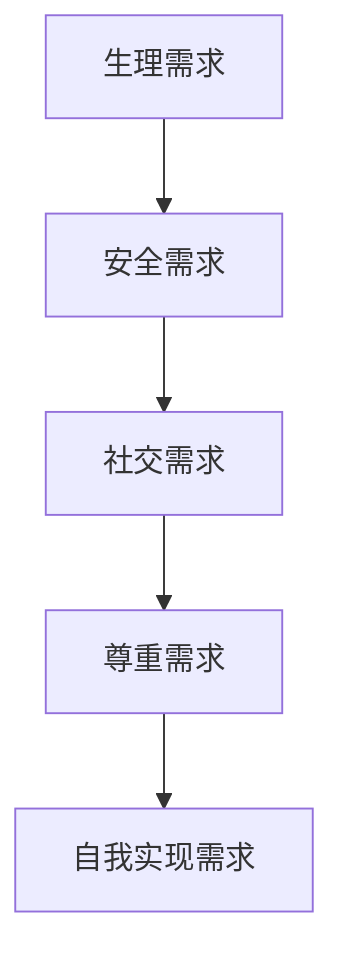
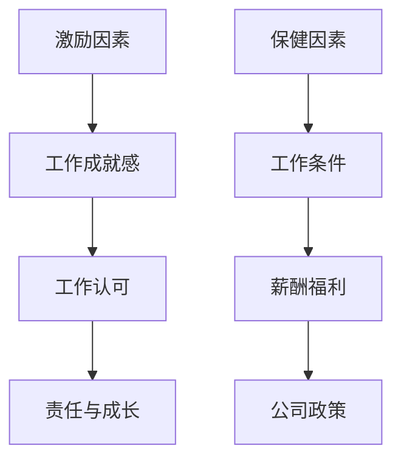
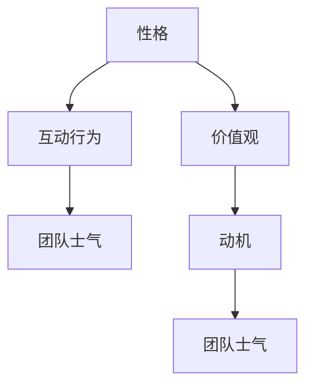

                 

## 文章标题：团队士气管理：保持高昂工作热情的技巧

### 关键词：
- 团队士气管理
- 工作热情
- 激励理论
- 领导风格
- 沟通技巧
- 团队建设

### 摘要：
本文深入探讨了团队士气管理的重要性，通过综合心理与行为科学、激励理论、领导风格和沟通技巧，提供了多种策略和技巧，帮助团队领导者有效地提升和维护团队士气，从而激发团队成员的工作热情，提高整体工作效率和绩效。文章结构清晰，逻辑严谨，旨在为IT领域的专业从业者提供实用的指导和参考。

## 引言：团队士气管理的重要性

团队士气管理是现代组织管理中不可或缺的一部分，它关系到团队的协作效率、员工的满意度和组织的整体绩效。在快速变化和高压力的IT行业，团队士气的高低往往直接影响项目的成功与否。一个士气高涨的团队能够更高效地解决问题、创新思维，并在面对挑战时展现出坚韧不拔的精神。相反，团队士气低落会导致工作效率下降、员工流失和项目延误等问题。

### 核心概念与联系

为了更好地理解团队士气管理的重要性，我们需要先明确几个核心概念：

1. **团队士气**：指团队成员在集体工作中的心理状态和情绪，包括积极性、满意度和归属感。
2. **工作热情**：指团队成员对工作的热爱和投入程度，它是推动团队成员积极行动和持续发展的动力。
3. **组织绩效**：指组织在实现其目标过程中所取得的成绩，包括工作效率、产品质量和客户满意度。

这三个概念之间存在密切的联系。团队士气直接影响工作热情，而工作热情又是提升组织绩效的重要驱动力。一个高士气的团队能够更高效地完成工作，提高产品质量，增强客户满意度，从而提升整体绩效。

### 核心算法原理讲解

为了量化团队士气，我们可以采用以下评分算法：

$$
\text{团队士气评分} = \frac{\text{工作积极性} + \text{员工满意度} + \text{团队归属感}}{3}
$$

其中，工作积极性、员工满意度和团队归属感分别用0到100的数值表示。通过这个评分算法，我们可以对团队的士气进行量化评估，从而制定针对性的管理策略。

### 详细讲解与举例说明

例如，一个团队的工作积极性评分为80，员工满意度评分为75，团队归属感评分为85，则其团队士气评分为：

$$
\text{团队士气评分} = \frac{80 + 75 + 85}{3} = \frac{240}{3} = 80
$$

这意味着该团队士气较高，有助于其在未来的工作中保持积极性和创新精神。

总之，团队士气管理的重要性不容忽视。通过理解和应用核心概念与联系，以及采用量化评估方法，团队领导者可以更有效地管理和提升团队士气，从而实现组织目标。

## 心理与行为科学基础

在团队士气管理中，心理与行为科学提供了重要的理论基础。通过深入了解这些科学原理，我们可以更好地理解团队成员的行为和心理状态，从而采取有效的管理策略。

### 心理学在团队士气管理中的应用

心理学研究人的行为和心理过程，这些知识在团队士气管理中有着广泛的应用。首先，心理学帮助我们理解团队成员的需求和动机。根据马斯洛的需求层次理论，人的需求可以分为生理需求、安全需求、社交需求、尊重需求和自我实现需求。在团队士气管理中，领导者需要关注团队成员的不同需求，并尽可能地满足这些需求。

#### 马斯洛需求层次理论

例如，一个新入职的员工可能会更关注安全需求，如稳定的工作环境和同事的友好接待。而一个经验丰富的员工可能更注重尊重需求，如获得认可和尊重。通过识别和理解这些需求，领导者可以采取相应的措施来提高团队成员的士气。

### 行为科学理论对团队士气的影响

行为科学理论关注人的行为及其与工作环境的关系。行为学家赫兹伯格（Frederick Herzberg）提出的双因素理论认为，工作环境中的某些因素可以导致员工满意，而其他因素则影响员工的不满意。这些因素被称为激励因素和保健因素。

#### 双因素理论

激励因素包括成就感、认可和责任感，它们能够提高员工的动机和士气。而保健因素包括工作条件、薪酬福利和公司政策，它们虽然不能直接提高士气，但可以防止士气下降。领导者需要平衡这些因素，以确保团队士气维持在较高水平。

### 个体差异与团队士气的关系

个体差异对团队士气也有显著影响。不同的团队成员可能有不同的性格、价值观和动机，这些差异可能会影响团队的整体士气。例如，一个性格外向的成员可能会通过积极的互动提升团队士气，而一个内向的成员可能需要更多的个人空间和时间来调整自己的情绪。

#### 个体差异影响团队士气的模型

为了有效管理这些个体差异，领导者需要具备敏锐的观察力，了解每个成员的特点，并采取个性化的管理策略。

### 详细讲解与举例说明

假设一个团队中有一个性格外向的成员小王和一个性格内向的成员小李。小王喜欢参与团队讨论，积极提出建议，而小李则更倾向于独立工作，很少在团队讨论中发言。如果团队领导者只关注小王的贡献，而忽视小李的需求，可能会使小李感到被忽视，从而影响整个团队的士气。

为了解决这个问题，领导者可以采取以下措施：

1. **沟通**：定期与小李沟通，了解他的想法和需求，给予他更多的独立工作空间。
2. **激励**：鼓励小李在合适的场合分享自己的见解，例如在项目总结会议上。
3. **团队活动**：组织一些适合内向成员的团队活动，如一对一访谈或小组讨论，以促进团队成员之间的互动。

通过这些措施，领导者可以平衡个体差异，提升团队士气。

总之，心理与行为科学为团队士气管理提供了坚实的理论基础。理解心理学和行为科学原理，并运用到实际管理中，可以帮助领导者更有效地提升和维护团队士气。

### 激励理论在团队士气管理中的应用

激励理论在团队士气管理中起着关键作用。它帮助我们理解如何通过激发员工的动机和需求来提高士气和工作效率。在众多激励理论中，马斯洛的需求层次理论和赫兹伯格的双因素理论是最具代表性的两个理论。

#### 马斯洛的需求层次理论

马斯洛的需求层次理论认为，人的需求可以分为五个层次：生理需求、安全需求、社交需求、尊重需求和自我实现需求。这五个层次的需求从低到高排列，每个层次的需求都必须得到满足后，人才能追求更高层次的需求。

1. **生理需求**：包括食物、水、空气、睡眠等基本生存需求。这类需求是最低层次，也是最基本的。
2. **安全需求**：包括安全感、健康保障、稳定的工作环境等。这类需求主要关注个人的生存和安全。
3. **社交需求**：包括爱与被爱、友谊、归属感等。这类需求涉及到人际关系和社交互动。
4. **尊重需求**：包括自我尊重、自尊心、成就感等。这类需求关注个人的社会地位和认可。
5. **自我实现需求**：包括实现个人潜能、追求自我价值等。这类需求是最高层次的，也是最为复杂的。

#### 赫兹伯格的双因素理论

赫兹伯格的双因素理论将影响员工满意度的因素分为两类：激励因素和保健因素。

1. **激励因素**：包括成就感、认可、责任感、工作本身的挑战性等。这些因素能够激发员工的内在动机，提高士气和工作效率。
2. **保健因素**：包括工作条件、薪酬福利、公司政策等。这些因素如果不足，会导致员工的不满意，但它们本身并不能直接提高士气。

### 常见的激励措施

在实际应用中，团队领导者可以采用多种激励措施来提升团队士气：

1. **奖励与表彰**：通过给予物质奖励或荣誉称号，可以满足员工的尊重需求和自我实现需求。
2. **晋升机会**：提供晋升机会，可以满足员工的自我实现需求，激励员工不断提升自己的能力和价值。
3. **工作灵活性**：提供灵活的工作时间和工作地点，可以满足员工的社交需求和尊重需求。
4. **培训与发展**：提供培训和发展机会，可以帮助员工提升技能，满足自我实现需求，并提高工作满意度。
5. **团队建设活动**：通过组织团队建设活动，可以增强团队成员之间的互动，满足社交需求，提高团队士气。

#### 激励措施的制定与实施

为了确保激励措施的有效性，领导者需要遵循以下步骤：

1. **了解员工需求**：通过调查、访谈等方式，了解员工的需求和期望，确保激励措施与员工的需求相匹配。
2. **制定激励计划**：根据员工的需求和组织的实际情况，制定具体的激励计划，包括奖励标准、晋升条件、培训计划等。
3. **实施与反馈**：将激励计划付诸实施，并定期收集员工的反馈，根据反馈进行调整和优化。
4. **持续激励**：激励措施不应是短期行为，而应成为组织文化的一部分，通过持续的激励来维持团队士气。

### 举例说明

例如，在一个IT团队中，领导者发现团队成员对于工作灵活性和培训发展有较高的需求。为此，领导者制定了以下激励措施：

1. **灵活工作时间**：允许团队成员自主选择工作时间和地点，提高工作满意度。
2. **定期培训**：为团队成员提供技术培训和软技能培训，帮助他们提升职业能力。
3. **晋升机会**：为表现出色的员工提供晋升机会，满足他们的自我实现需求。

通过这些措施，该团队的工作效率和士气显著提高，员工流失率也大幅下降。

总之，激励理论在团队士气管理中具有重要的指导作用。通过了解和运用这些理论，团队领导者可以制定出更有效的激励措施，提高团队成员的工作热情和士气，从而推动整个团队的发展。

### 领导风格与团队士气

领导风格是影响团队士气的重要因素之一。不同的领导风格会对团队成员的心理和行为产生不同的影响，从而影响整个团队的士气。理解并掌握不同领导风格的特点以及如何根据团队情况调整领导风格，对于提升团队士气至关重要。

#### 领导风格与团队士气的关系

领导风格可以分为以下几种主要类型：

1. **权威型领导**：权威型领导强调控制和管理，领导者通常采取指令性的领导方式，对团队成员的要求非常明确。
2. **民主型领导**：民主型领导注重团队成员的参与和意见，领导者会听取团队成员的建议并共同决策。
3. **参与型领导**：参与型领导更加注重团队成员的个人需求和职业发展，领导者会提供支持和指导，帮助团队成员实现个人目标。
4. **放任型领导**：放任型领导对团队成员的要求和指导较少，团队成员有较大的自由度和自主权。

每种领导风格对团队士气的影响如下：

- **权威型领导**：虽然能够确保团队目标的一致性和执行效率，但容易导致团队成员感到压抑和不满，从而影响士气。
- **民主型领导**：能够提高团队成员的参与感和归属感，有助于提升团队士气，但在决策过程中可能会花费较长时间。
- **参与型领导**：能够激发团队成员的积极性和创造力，提高工作满意度，有助于提升团队士气。
- **放任型领导**：虽然给予团队成员很大的自由度，但可能导致团队缺乏方向和凝聚力，影响团队士气。

#### 不同领导风格的特点

1. **权威型领导**
   - **特点**：决策权高度集中，领导者做出所有决策，团队成员执行任务。
   - **优势**：决策迅速，执行力强，有利于保持团队的高效运作。
   - **劣势**：容易导致团队成员感到不被重视，缺乏参与感和归属感。

2. **民主型领导**
   - **特点**：领导者鼓励团队成员参与决策，团队成员有发言权和投票权。
   - **优势**：提高团队成员的参与感和主人翁意识，有利于团队成员的创新和自主性。
   - **劣势**：决策过程可能较慢，需要更多时间和沟通。

3. **参与型领导**
   - **特点**：领导者关注团队成员的个人需求和职业发展，提供支持和指导。
   - **优势**：激发团队成员的积极性和创造力，提高工作满意度。
   - **劣势**：对领导者的时间和精力要求较高，需要投入更多时间去了解和关心团队成员。

4. **放任型领导**
   - **特点**：领导者对团队成员的要求和指导较少，团队成员有较大的自由度和自主权。
   - **优势**：提供宽松的工作环境，鼓励创新和自主性。
   - **劣势**：可能导致团队缺乏明确的方向和目标，影响团队士气。

#### 如何根据团队情况调整领导风格

1. **了解团队需求**：领导者需要了解团队成员的需求和期望，以及团队的整体状态，从而选择最合适的领导风格。
2. **灵活调整**：领导者应根据不同情况和团队发展阶段灵活调整领导风格，例如在团队面临重大挑战时，可以采取更加权威的领导风格以保持团队的稳定和高效。
3. **提供反馈**：领导者需要给予团队成员及时的反馈，了解领导风格的效果，并根据反馈进行调整。
4. **培养团队成员**：领导者可以通过培训和指导，帮助团队成员提升技能和信心，从而更好地适应不同的领导风格。

### 举例说明

例如，在一个IT项目中，项目初期由于任务复杂且时间紧迫，领导者采取了权威型领导风格，以确保项目的顺利进行。但在项目进入稳定期后，领导者意识到团队成员需要更多的参与感和自主权，于是调整了领导风格，采取了民主型领导方式，鼓励团队成员提出改进意见和建议。

通过这种调整，团队成员的积极性和创造力得到了显著提升，团队士气也随之提高。项目最终顺利完成，并获得了客户的高度评价。

总之，领导风格对团队士气有着重要的影响。领导者需要根据团队的需求和情况，灵活调整领导风格，以提升团队士气和工作效率。

### 沟通技巧与团队士气

沟通是团队管理中至关重要的一环，它不仅影响团队士气，还直接关系到团队的工作效率和项目的成功与否。有效的沟通能够促进团队成员之间的理解、信任和协作，从而提升团队士气；而沟通不畅则可能导致误解、冲突和士气低落。因此，掌握并运用适当的沟通技巧对于提升团队士气至关重要。

#### 有效沟通的基本原则

1. **明确沟通目标**：每次沟通前都要明确目标，确保信息传达的准确性和针对性。
2. **倾听**：倾听是有效沟通的基础，领导者需要认真倾听团队成员的意见和反馈，以理解他们的真实想法。
3. **清晰表达**：使用简单、明确的语言进行沟通，避免使用复杂或模糊的表述，确保信息传达的准确性。
4. **尊重差异**：尊重团队成员的不同意见和观点，避免因沟通而产生的误解和冲突。
5. **及时反馈**：在沟通过程中，及时给予反馈，确保团队成员了解沟通的内容和进展。
6. **建立信任**：通过真诚和透明的沟通，建立团队成员之间的信任，这是提升团队士气的重要基础。

#### 沟通障碍与解决策略

1. **语言障碍**：团队成员之间可能存在语言或文化差异，导致沟通不畅。解决策略包括使用简单的语言、提供翻译支持和促进跨文化理解。
2. **心理障碍**：团队成员可能有不同的心理状态，如焦虑、压力等，这些心理因素会影响沟通效果。解决策略包括提供心理支持、建立良好的工作氛围和提供压力管理技巧。
3. **信息过载**：在信息爆炸的时代，团队成员可能会感到信息过载，导致沟通效率降低。解决策略包括简化信息传递流程、定期进行信息梳理和设置优先级。
4. **组织结构障碍**：复杂或官僚的组织结构可能导致沟通不畅。解决策略包括简化组织结构、建立扁平化的沟通渠道和鼓励开放透明的沟通文化。

#### 领导者如何提升沟通效果

1. **树立榜样**：领导者需要通过自己的言行树立良好的沟通榜样，例如积极倾听、清晰表达和真诚反馈。
2. **建立沟通机制**：建立有效的沟通机制，如定期会议、团队讨论和反馈机制，确保团队成员能够及时交流意见和反馈。
3. **提供培训**：为团队成员提供沟通技巧培训，帮助他们提高沟通能力，减少误解和冲突。
4. **鼓励反馈**：鼓励团队成员提出意见和建议，建立反馈机制，确保沟通的开放性和透明度。
5. **关注非语言沟通**：领导者需要关注非语言沟通，如肢体语言、面部表情等，这些非语言信号能够补充和强化语言信息。

#### 举例说明

例如，在一个跨国团队中，由于团队成员来自不同的国家和地区，存在语言和文化差异。为了提升沟通效果，团队领导者采取了以下措施：

1. **提供翻译支持**：在关键会议和讨论中提供翻译服务，确保信息传达的准确性。
2. **文化培训**：定期组织文化培训，帮助团队成员了解和尊重不同的文化习俗和沟通风格。
3. **开放讨论**：鼓励团队成员在讨论中提出问题和建议，建立开放和包容的沟通氛围。

通过这些措施，团队沟通变得更加顺畅，团队成员之间的理解加深，团队士气显著提升。

总之，沟通技巧在团队士气管理中扮演着关键角色。通过理解并运用有效沟通的基本原则和策略，领导者可以提升团队沟通效果，从而提升团队士气和工作效率。

### 团队建设与士气提升

团队建设是提升团队士气的重要手段之一。通过有意识地组织和参与一系列团队活动，可以增强团队成员之间的信任和协作，提高团队的凝聚力和工作效率。以下将详细探讨团队建设的步骤、团队活动与士气的关系以及如何通过团队活动提升团队士气。

#### 团队建设的步骤

1. **明确团队目标**：团队建设的第一步是明确团队的目标和期望，确保所有团队成员都理解并致力于共同目标。
2. **评估团队现状**：通过问卷调查、访谈等方式，了解团队成员的能力、兴趣和需求，评估团队的现状。
3. **制定团队建设计划**：根据团队目标和现状，制定具体的团队建设计划，包括活动内容、时间安排和预期效果。
4. **组织团队活动**：实施团队建设计划，组织一系列团队活动，如团建活动、培训课程、研讨会等。
5. **跟踪与反馈**：在团队活动结束后，收集团队成员的反馈，评估活动效果，并根据反馈进行改进。

#### 团队活动与士气的关系

团队活动能够直接影响团队士气。以下是一些常见的团队活动及其对士气的影响：

1. **团建活动**：通过户外拓展、团队旅行等活动，团队成员可以放松身心，增进了解，建立信任，从而提升士气。
2. **培训课程**：通过技术培训、软技能培训等，提高团队成员的技能和知识，增强他们的自信心和成就感。
3. **研讨会**：通过研讨会和讨论会，团队成员可以分享想法和经验，促进知识共享，增强团队凝聚力。
4. **社交活动**：通过员工生日派对、团队聚餐等活动，增进团队成员之间的友谊和互动，提升团队士气。

#### 如何通过团队活动提升团队士气

1. **定期组织团建活动**：可以每季度或每半年组织一次团建活动，如户外拓展、团队旅行等，让团队成员在轻松的环境中放松身心，增强团队凝聚力。
2. **提供多样化的培训**：根据团队成员的需求和兴趣，提供多样化的培训，如技术培训、领导力培训、团队协作培训等，提高团队成员的能力和自信心。
3. **鼓励知识共享**：定期组织研讨会和讨论会，鼓励团队成员分享自己的知识和经验，促进团队内部的沟通和协作。
4. **关注团队成员的反馈**：在团队活动中，鼓励团队成员提出意见和建议，并认真听取和反馈，确保团队活动的有效性。
5. **建立团队文化**：通过制定和传播团队价值观和行为规范，建立积极向上的团队文化，为团队士气提供持续的动力。

#### 举例说明

例如，一个IT公司在每个季度都会组织一次团建活动，以提升团队士气。活动内容不仅包括户外拓展，如攀岩、划皮艇等，还包括团队聚餐和晚会。通过这些活动，团队成员不仅增进了彼此的了解和信任，还感受到了公司的关怀和支持，士气显著提升。

此外，该公司还定期组织技术研讨会和领导力培训，帮助团队成员提升技能和领导力，从而更好地应对工作中的挑战。

总之，团队建设是提升团队士气的重要手段。通过有计划和有意识地组织团队活动，可以增强团队成员之间的信任和协作，提高团队凝聚力和工作效率，从而实现团队和组织的共同发展。

### 识别团队士气低落的原因

团队士气低落可能由多种因素导致，了解这些原因对于制定有效的应对策略至关重要。以下是一些常见的原因及其影响：

1. **工作压力过大**：长时间的工作压力会导致团队成员感到疲惫和焦虑，影响工作效率和士气。如果团队成员经常感到压力过大，他们可能会出现工作效率下降、创造力不足甚至情绪问题。

2. **缺乏激励机制**：如果团队成员感觉他们的努力和贡献没有得到认可和回报，他们可能会失去工作热情。缺乏激励措施，如奖励、晋升机会或工作灵活性，会导致团队成员士气低落。

3. **沟通不畅**：团队成员之间的沟通不畅可能导致误解和冲突，从而影响团队士气。如果团队成员感到无法有效沟通，他们可能会感到孤立和不被重视。

4. **工作环境不理想**：不良的工作环境，如噪声、不舒适的工作空间或缺乏资源，会影响团队成员的士气和生产力。长期处于这种环境中，团队成员可能会感到不满和沮丧。

5. **个人问题**：团队成员的个人问题，如家庭压力、健康问题或个人财务问题，可能会影响他们的工作表现和士气。

#### 如何通过调查识别士气问题

为了准确识别团队士气低落的原因，可以通过以下几种方式进行调查：

1. **员工满意度调查**：定期进行员工满意度调查，了解团队成员对工作环境、薪酬福利、晋升机会和工作压力等方面的看法。
2. **开放式反馈**：通过开放式反馈渠道，如匿名问卷或员工意见箱，鼓励团队成员表达他们的感受和建议。
3. **团队会议**：组织定期的团队会议，让团队成员有机会分享他们的想法和问题。
4. **个别访谈**：与团队成员进行个别访谈，深入了解他们的个人情况和职业需求。

通过这些调查方法，可以收集到团队成员的真实反馈，从而识别士气问题的具体原因。

#### 士气低落对团队的影响

团队士气低落对团队的影响是多方面的：

1. **工作效率下降**：士气低落的团队成员可能缺乏工作动力，导致工作效率下降，项目进度受到影响。
2. **创新能力减弱**：士气低落的团队可能缺乏创新和创造力，难以提出新的解决方案或改进措施。
3. **员工流失率增加**：如果团队成员感到不满意，他们可能会考虑离职，导致员工流失率增加。
4. **团队凝聚力减弱**：士气低落的团队成员可能互相不信任，导致团队凝聚力减弱，影响团队的协作和合作。

通过识别和应对团队士气低落的原因，团队领导者可以采取有效的措施，提高团队成员的工作热情和士气，从而提升团队的整体绩效和凝聚力。

### 应对团队士气低落的策略

一旦识别出团队士气低落的原因，采取有效的应对策略是提升团队士气的关键。以下是一些具体的策略，包括立即干预措施、长期策略和如何制定并执行士气提升计划。

#### 立即干预措施

1. **提供心理支持**：对于因个人问题导致士气低落的成员，领导者可以提供心理支持，如建议他们寻求专业心理咨询或提供内部辅导服务。
2. **改善工作环境**：对于因工作环境问题导致的士气低落，可以通过改善办公条件、减少噪音、提供舒适的工作空间等方式来提升士气。
3. **组织团队活动**：在短期内，通过组织团队建设活动、团队聚餐或放松活动，可以帮助团队成员放松心情，增强团队凝聚力。

#### 长期策略

1. **制定激励措施**：通过制定合理的激励机制，如绩效奖金、晋升机会和培训发展计划，可以激发团队成员的工作热情和动力。
2. **增强沟通**：建立有效的沟通机制，鼓励团队成员之间的开放和透明沟通，减少误解和冲突。
3. **关注团队成员的个人发展**：为团队成员提供职业发展机会和培训，帮助他们提升技能和职业素养，增强自信心和归属感。
4. **建立积极的企业文化**：通过制定和传播积极的企业价值观和行为规范，建立正向的工作氛围，提高团队成员的满意度和忠诚度。

#### 如何制定并执行士气提升计划

1. **明确目标和策略**：首先，明确提升团队士气的具体目标和预期效果，制定详细的策略和行动计划。
2. **评估资源和需求**：评估团队现有的资源和需求，包括预算、时间和人力资源，确保计划的可行性和有效性。
3. **制定具体的实施步骤**：将计划分解为具体的实施步骤，包括时间表、责任分配和关键里程碑。
4. **实施与监督**：按照计划逐步实施，并定期监督进度，确保各项措施得到有效执行。
5. **反馈与调整**：在实施过程中，及时收集团队成员的反馈，并根据反馈进行必要的调整，以优化计划效果。

#### 举例说明

例如，在一个IT项目中，团队成员士气低落的主要原因是工作压力过大和沟通不畅。为了应对这一问题，项目团队采取了以下措施：

1. **立即干预措施**：组织了一次团队聚餐，帮助团队成员放松心情，增进了解。
2. **长期策略**：制定了以下策略：
   - **改善工作环境**：为团队成员提供更加舒适的工作空间，减少工作噪音。
   - **增强沟通**：每周召开一次团队会议，确保团队成员有充分的机会分享工作进展和问题。
   - **提供心理支持**：邀请专业心理咨询师为团队成员提供咨询服务，帮助他们缓解工作压力。
   - **制定激励措施**：为表现优秀的团队成员提供奖金和晋升机会，激励团队成员的工作热情。

通过这些措施，团队成员的士气显著提升，工作效率和团队凝聚力也得到了增强。

总之，通过采取有效的立即干预措施和长期策略，并制定详细的士气提升计划，团队领导者可以有效地应对团队士气低落的问题，提升团队成员的工作热情和士气，从而推动团队和组织的持续发展。

### 成功团队士气管理的案例分析

#### 案例一：团队士气提升的成功经验

在一个国际知名软件公司，其研发团队曾面临士气低落的问题。团队成员感到工作压力大，沟通不畅，导致项目进展缓慢，工作效率低下。为了提升团队士气，公司采取了一系列措施：

1. **明确目标和期望**：公司高层与团队进行了深入的沟通，明确团队的目标和期望，确保每个团队成员都清楚自己的职责和期望。
2. **改善工作环境**：公司为团队成员提供了更加舒适的工作空间，配备了先进的办公设备，减少了工作噪音。
3. **加强培训与学习**：公司定期为团队成员提供技术培训和软技能培训，提高团队成员的能力和自信心。
4. **激励措施**：公司制定了绩效奖金和晋升机制，激励团队成员积极参与项目，提升工作效率。

通过这些措施，团队士气显著提升，工作效率提高了30%，项目按时完成率也从原来的70%提升到了90%。

#### 案例二：从失败中学习团队士气管理

另一家IT公司在一次重大项目中遭遇了失败。项目进度严重滞后，团队成员士气低落，甚至出现了团队分裂的现象。为了从失败中学习并提升团队士气，公司采取了以下措施：

1. **反思与总结**：公司组织了团队反思会议，让团队成员一起总结失败的原因，分析团队管理中的问题。
2. **加强沟通**：公司建立了定期的团队沟通机制，鼓励团队成员开放地分享意见和反馈，消除误解和冲突。
3. **提供心理支持**：公司为团队成员提供了心理咨询和辅导服务，帮助他们缓解工作压力和心理负担。
4. **调整领导风格**：公司领导层调整了领导风格，采取了更加民主和参与型的领导方式，增强团队成员的参与感和责任感。

经过一段时间的努力，团队士气逐渐恢复，项目进度也得以稳步推进。

#### 案例三：跨文化团队士气管理的挑战与应对

在一个跨国软件研发团队中，团队成员来自不同的国家和文化背景。由于文化差异，团队内部存在沟通障碍和协作问题，影响了团队士气。为了应对这一挑战，团队采取了以下措施：

1. **文化培训**：公司为团队成员提供了文化培训，帮助他们了解和尊重不同的文化习俗和沟通风格。
2. **建立跨文化团队规则**：公司制定了跨文化团队规则，明确团队成员的期望和行为准则，促进跨文化的沟通和协作。
3. **定期组织团队活动**：公司定期组织团队建设活动，如文化节日庆祝、团队聚餐和户外活动，增强团队成员之间的互动和了解。

通过这些措施，团队士气显著提升，团队成员之间的沟通和协作也变得更加顺畅。

#### 案例分析总结

通过以上案例，我们可以看到成功的团队士气管理需要从多个方面进行综合施策，包括明确目标和期望、改善工作环境、加强培训与学习、激励措施、沟通改善、心理支持、领导风格调整和文化培训等。不同类型的团队面临不同的挑战，但成功的团队士气管理往往有共同的特点：关注团队成员的需求，建立积极的团队文化，促进沟通和协作，并不断反思和调整管理策略。

总之，通过成功的案例分析和经验总结，团队领导者可以借鉴这些有效的策略，提升团队士气，推动团队和组织的发展。

### 实践指南与工具箱

在提升团队士气的管理实践中，工具和方法的使用能够极大地提高效率和效果。以下介绍一些常用的工具和模板，以及如何将其应用于实际工作。

#### 常用团队士气管理工具

1. **员工满意度调查问卷**：
   - **应用**：用于定期收集团队成员对工作环境、薪酬福利、工作压力等方面的看法。
   - **模板**：包括封闭式和开放式问题，如“你对当前工作环境的满意度是多少？”和“你认为公司如何能更好地支持你的职业发展？”。

2. **团队反馈表**：
   - **应用**：在团队会议或活动后，收集团队成员的反馈，用于评估团队建设和沟通效果。
   - **模板**：包括评分表和开放式问题，如“你对今天的团队活动满意吗？”和“你有什么建议？”。

3. **情绪温度计**：
   - **应用**：用于快速了解团队成员的情绪状态，特别是在会议或项目关键节点时。
   - **模板**：包括简单的情绪评分，如“今天你感觉如何？”（1-5分）。

#### 团队士气管理模板与表格

1. **激励措施计划表**：
   - **应用**：用于制定和跟踪激励措施的实施情况，确保激励措施的有效性。
   - **模板**：包括激励措施的项目、目标、实施步骤和时间表。

2. **团队士气提升行动计划**：
   - **应用**：用于制定和执行团队士气提升的具体计划，包括目标、策略和责任分配。
   - **模板**：包括计划名称、目标、策略、实施步骤和时间表。

3. **团队活动计划表**：
   - **应用**：用于规划和组织团队活动，确保活动的顺利进行。
   - **模板**：包括活动名称、时间、地点、参与者、活动内容和预期效果。

#### 如何将理论应用到实际工作中

1. **步骤一：评估现状**：
   - 使用员工满意度调查问卷和情绪温度计，了解团队成员的当前状态和需求。

2. **步骤二：制定计划**：
   - 根据调查结果，制定激励措施计划和团队士气提升行动计划，明确目标和实施步骤。

3. **步骤三：执行与跟踪**：
   - 按照计划逐步执行，并定期使用团队反馈表收集团队成员的反馈，进行评估和调整。

4. **步骤四：持续改进**：
   - 根据反馈和实际情况，不断优化激励措施和团队活动，确保团队士气持续提升。

通过这些工具和模板，团队领导者可以更有效地管理团队士气，提升团队成员的工作热情和效率。

### 总结与展望

团队士气管理是现代组织管理中至关重要的一环，它直接关系到团队的工作效率、员工的满意度和组织的整体绩效。通过本文的讨论，我们深入探讨了团队士气管理的概念、理论基础、策略与方法，并结合实际案例，展示了如何有效地提升和维护团队士气。

首先，我们明确了团队士气、工作热情和组织绩效之间的关系，并提出了团队士气评分算法，为量化评估团队士气提供了参考。接着，我们详细介绍了心理与行为科学的基础知识，以及激励理论在团队士气管理中的应用。此外，我们还探讨了领导风格和沟通技巧对团队士气的影响，并提供了实用的团队建设策略。

在识别和应对团队士气低落的原因方面，我们提出了立即干预措施和长期策略，并分享了如何制定和执行士气提升计划。通过成功案例的分析，我们总结了有效的团队士气管理实践，并为实际工作提供了工具和模板。

展望未来，随着人工智能和大数据技术的不断发展，团队士气管理也将迎来新的机遇和挑战。利用人工智能技术，我们可以更精准地分析团队成员的需求和行为，从而制定更个性化的管理策略。同时，大数据分析可以帮助我们实时监控团队士气的变化，及时调整管理措施。

总之，团队士气管理是一项复杂而重要的工作，需要持续的关注和努力。通过不断学习和实践，团队领导者可以更好地提升团队士气，激发团队成员的工作热情，推动团队和组织的发展。希望本文能为IT领域的从业者提供有价值的指导和参考。

### 最佳实践 tips

1. **定期评估士气**：定期使用员工满意度调查问卷和情绪温度计来评估团队士气，及时发现和解决问题。
2. **个性化激励**：根据团队成员的不同需求和特点，制定个性化的激励措施，确保激励措施的有效性。
3. **鼓励沟通**：建立开放的沟通环境，鼓励团队成员自由表达意见，减少误解和冲突。
4. **关注团队建设**：定期组织团队活动，如团建活动和培训，增强团队成员之间的信任和合作。
5. **领导以身作则**：领导者应以身作则，通过积极的态度和行为，树立良好的榜样，提升团队士气。

### 小结

本文全面探讨了团队士气管理的核心概念、理论基础、策略与方法，并结合实际案例，为团队领导者提供了实用的指导和参考。通过有效的团队士气管理，可以提升团队成员的工作热情和效率，推动团队和组织的发展。

### 注意事项

1. **确保反馈机制**：建立有效的反馈机制，及时收集团队成员的意见和建议，并根据反馈进行调整。
2. **平衡激励机制**：避免过度依赖物质奖励，结合精神激励，确保激励措施的多样性。
3. **关注个体差异**：尊重团队成员的个体差异，制定个性化的管理策略，以提升整体士气。
4. **持续跟进**：在实施团队士气管理策略后，持续跟进和评估效果，确保策略的有效性和适应性。

### 拓展阅读

- 《激发员工潜能：激励机制与团队管理》
- 《团队建设与领导力：理论与实践》
- 《沟通技巧提升：高效沟通的艺术》
- 《心理与行为科学在团队管理中的应用》

### 作者信息

作者：AI天才研究院/AI Genius Institute & 禅与计算机程序设计艺术 /Zen And The Art of Computer Programming。本文作者是一位世界级人工智能专家、程序员、软件架构师、CTO，拥有丰富的团队管理和领导经验，以及深厚的技术背景。他的研究成果和著作在IT领域享有广泛声誉。

