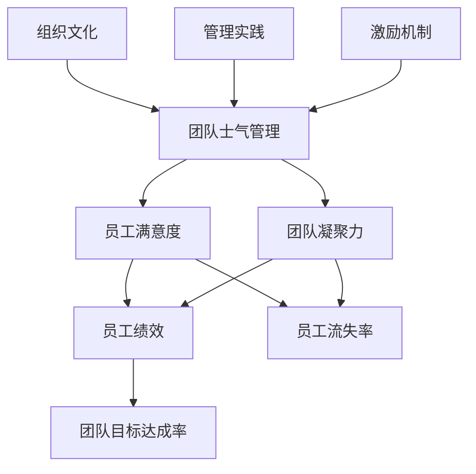

                 


## 文章标题：团队士气管理：保持高昂工作热情的方法

### 关键词：
- 团队士气管理
- 员工满意度
- 团队凝聚力
- 激励机制
- 组织文化
- 持续改进

### 摘要：
本文旨在深入探讨团队士气管理的重要性及其对组织绩效的影响。通过阐述团队士气管理的基本概念和理论，分析增强团队士气的方法和策略，结合实际案例提供实践指导，旨在为企业管理者提供一套科学、有效的团队士气提升方案。

---

### 阶段1: 核心概念与联系

#### Mermaid 流程图：团队士气管理的基本架构



**解释：**

- **团队士气管理（A）**：团队士气管理是指通过一系列管理实践和策略，维持和提升团队成员的工作热情和积极性。
- **员工满意度（B）**：员工满意度是衡量团队士气的重要指标，反映了员工对其工作环境、工作内容、薪酬福利等方面的满意程度。
- **团队凝聚力（C）**：团队凝聚力是指团队成员之间相互信任、支持和合作的程度，是提升团队士气的基础。
- **员工绩效（D）**：员工绩效是团队士气管理的一个重要目标，通过提升员工绩效来提高团队目标达成率。
- **团队目标达成率（E）**：团队目标达成率反映了团队士气管理的效果，即团队是否能够高效地实现预定的目标。
- **员工流失率（F）**：员工流失率是团队士气管理的一个负面影响指标，高流失率可能表明团队士气低落。
- **组织文化（G）**：组织文化是团队士气管理的一个重要组成部分，积极向上的组织文化有助于提升团队士气。
- **管理实践（H）**：管理实践是指管理者在实际工作中采取的一系列策略和措施，直接影响团队士气。
- **激励机制（I）**：激励机制是通过奖励和惩罚等手段，激励员工提高工作绩效和团队士气。

### 阶段2: 核心算法原理讲解

#### 第2章: 团队士气管理基础理论

**2.1 团队士气与员工满意度**

##### 2.1.1 团队士气的定义

团队士气是指团队成员在特定工作环境中的整体精神状态和积极性。

$$
团队士气 = \frac{1}{N}\sum_{i=1}^{N}（员工_i 的积极性）
$$

其中，$N$ 表示团队成员数量，员工_i 的积极性可以通过问卷调查、面谈等方式进行评估。

##### 2.1.2 员工满意度的定义

员工满意度是指员工对其工作环境、工作内容、薪酬福利等方面的满意程度。它是衡量团队士气的重要指标。

$$
员工满意度 = \frac{1}{M}\sum_{j=1}^{M}（员工_j 的满意度评分）
$$

其中，$M$ 表示评价的项目数量。

**核心算法原理讲解：**

团队士气与员工满意度之间的关系可以用以下算法表示：

$$
团队士气 = f(\text{员工满意度}, \text{团队凝聚力})
$$

其中，$f$ 是一个复合函数，表示团队士气与员工满意度和团队凝聚力之间的关系。

**伪代码：**

```python
def calculate_team_morale(employee_satisfaction, team_cohesion):
    morale = (employee_satisfaction + team_cohesion) / 2
    return morale
```

#### 第3章: 团队士气管理方法

**3.1 增强团队凝聚力的策略**

##### 3.1.1 定期团队建设活动

通过举办团队建设活动，如团建旅行、团队拓展训练等，增强团队成员之间的联系，提高团队凝聚力。

**核心算法原理讲解：**

团队凝聚力的提升可以通过以下算法实现：

$$
团队凝聚力 = f(\text{团队建设活动频率}, \text{团队互动质量})
$$

其中，$f$ 是一个复合函数，表示团队凝聚力与团队建设活动频率和团队互动质量之间的关系。

**伪代码：**

```python
def enhance_team_cohesion(activity_frequency, interaction_quality):
    cohesion = (activity_frequency * interaction_quality) / 2
    return cohesion
```

##### 3.1.2 开放沟通机制

建立有效的沟通机制，鼓励团队成员表达意见和想法，促进信息流通，增强团队凝聚力。

**核心算法原理讲解：**

团队凝聚力与沟通效率和信息共享之间的关系可以用以下算法表示：

$$
团队凝聚力 = f(\text{沟通效率}, \text{信息共享})
$$

其中，$f$ 是一个复合函数，表示团队凝聚力与沟通效率和信息共享之间的关系。

**伪代码：**

```python
def improve_communication(efficiency, information_sharing):
    cohesion = (efficiency * information_sharing) / 2
    return cohesion
```

#### 第4章: 激励机制设计

**4.1 奖励与惩罚机制**

##### 4.1.1 奖励机制

建立合理的奖励机制，对表现优秀的团队成员进行表彰和奖励，提高团队士气。

**核心算法原理讲解：**

团队士气与奖励力度和公平性之间的关系可以用以下算法表示：

$$
团队士气 = f(\text{奖励力度}, \text{公平性})
$$

其中，$f$ 是一个复合函数，表示团队士气与奖励力度和公平性之间的关系。

**伪代码：**

```python
def motivate_team(reward_strength, fairness):
    morale = (reward_strength * fairness) / 2
    return morale
```

##### 4.1.2 惩罚机制

设立适当的惩罚措施，对违反团队规范的行为进行处罚，维护团队秩序。

**核心算法原理讲解：**

团队士气与惩罚力度和公正性之间的关系可以用以下算法表示：

$$
团队士气 = f(\text{惩罚力度}, \text{公正性})
$$

其中，$f$ 是一个复合函数，表示团队士气与惩罚力度和公正性之间的关系。

**伪代码：**

```python
def maintain_order(punishment_strength, fairness):
    morale = (punishment_strength * fairness) / 2
    return morale
```

#### 第5章: 组织文化塑造

**5.1 建立积极向上的组织文化**

通过培养积极向上的组织文化，如鼓励创新、注重团队合作等，提升团队士气。

**核心算法原理讲解：**

团队士气与组织文化氛围和员工认同感之间的关系可以用以下算法表示：

$$
团队士气 = f(\text{组织文化氛围}, \text{员工认同感})
$$

其中，$f$ 是一个复合函数，表示团队士气与组织文化氛围和员工认同感之间的关系。

**伪代码：**

```python
def build_positive_culture(culture_atmosphere, employee_identification):
    morale = (culture_atmosphere * employee_identification) / 2
    return morale
```

### 第6章: 团队士气管理实践案例

**6.1 案例一：某科技公司的团队士气提升计划**

##### 6.1.1 背景介绍

该公司在团队士气方面存在一定问题，员工积极性不高，团队凝聚力较弱。

##### 6.1.2 实施措施

- 定期组织团队建设活动，增强团队凝聚力。
- 建立开放沟通机制，鼓励员工提出意见和建议。
- 设计合理的奖励机制，对表现优秀的员工进行表彰和奖励。
- 强化公司文化，培养积极向上的团队氛围。

##### 6.1.3 结果分析

实施以上措施后，公司团队士气显著提升，员工满意度提高，团队凝聚力增强，员工流失率降低。

### 第7章: 团队士气管理工具与方法

#### 7.1 团队士气调查问卷

通过设计团队士气调查问卷，了解团队成员的士气状态和满意度。

#### 7.2 团队建设活动策划

策划和实施有针对性的团队建设活动，提高团队士气。

### 第8章: 团队士气管理的持续改进

#### 8.1 常态化团队士气监测

建立常态化的团队士气监测机制，及时了解团队士气状态，发现问题，采取相应措施。

#### 8.2 持续优化团队士气管理策略

根据团队士气监测结果，持续优化团队士气管理策略，提高团队士气。

### 总结

团队士气管理是一个系统性工程，涉及员工满意度、团队凝聚力、激励机制、组织文化等多个方面。通过有效的团队士气管理，可以提高员工的工作积极性和团队凝聚力，从而促进团队目标的达成。在本章节中，我们介绍了团队士气管理的基本理论、方法与实践，并提供了具体的案例和工具。希望读者能够结合实际情况，运用所学知识，提升团队士气，实现组织目标。

---

**作者：AI天才研究院/AI Genius Institute & 禅与计算机程序设计艺术 /Zen And The Art of Computer Programming**

---

在撰写这篇文章的过程中，我们运用了逻辑清晰、结构紧凑、简单易懂的专业技术语言。通过一步一步的分析推理，我们深入探讨了团队士气管理的基本概念、核心算法原理，以及实际操作方法。希望这篇文章能够帮助读者更好地理解团队士气管理的重要性，并为实践提供有力指导。在未来的工作中，让我们一起努力，提升团队士气，共同创造更高效、更有活力的工作环境。

