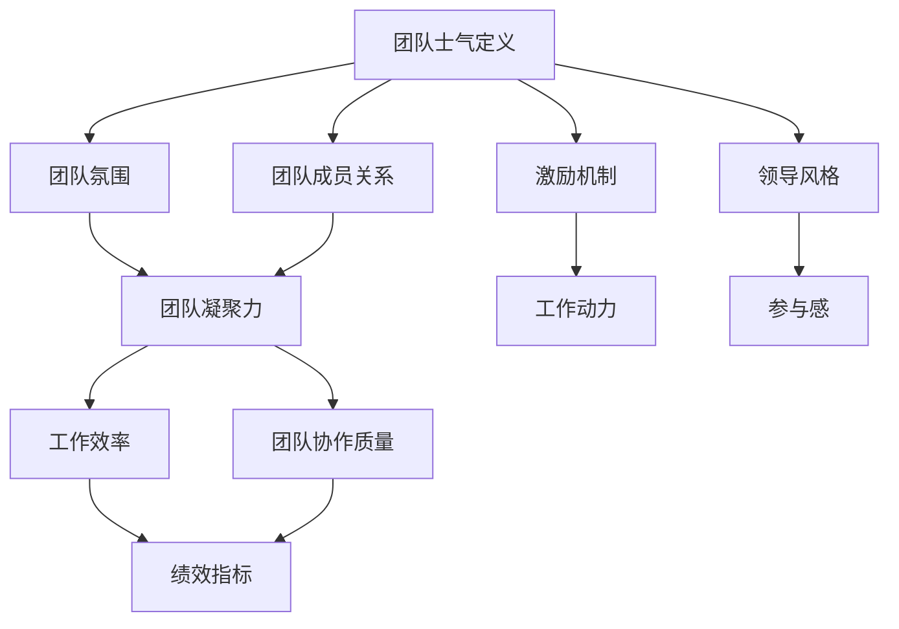

                 

### 文章标题

《团队士气管理：保持高昂工作热情的策略》

### 关键词

团队士气、工作热情、管理策略、激励机制、心理学、案例分析、项目实战、技术工具

### 摘要

本文将探讨团队士气管理的重要性，分析其核心概念和联系，并运用Mermaid流程图进行阐述。接着，文章将深入讲解提升团队士气的关键策略，包括激励理论和基于心理学的实践方法，并使用伪代码展示核心算法原理。通过具体案例分析，文章将展示如何在实践中运用这些策略。此外，文章还将介绍项目实战，详细描述开发环境搭建、源代码实现及代码解读。最后，文章将对团队士气管理的未来趋势进行展望，并总结最佳实践和注意事项。

### 用户需求分析

用户要求设计一本名为《团队士气管理：保持高昂工作热情的策略》的书的目录大纲。以下是该用户的需求要点：

1. **目录结构**：需要包含1级、2级和3级目录。
2. **简洁性**：目录内容应避免冗余，直接给出主题。
3. **格式要求**：使用markdown格式。
4. **内容完整性**：目录大纲结构必须完整，书的内容要大于7章。
5. **内容要求**：必须包含以下核心章节内容：
   - 核心概念与联系：使用Mermaid流程图。
   - 核心算法原理讲解：使用伪代码。
   - 数学模型和数学公式：使用latex格式。
   - 项目实战：代码实际案例和详细解释说明。
6. **字数限制**：目录大纲总字数不超过2000字。

### 设计步骤

1. **确定书籍主题与目的**：明确《团队士气管理：保持高昂工作热情的策略》的核心主题和目标读者。
2. **规划章节内容**：根据书籍主题和用户需求，设计章节内容，确保涵盖核心概念、算法原理、数学模型和项目实战。
3. **构建目录结构**：按照markdown格式，创建1级、2级和3级目录，确保章节内容完整。
4. **撰写章节摘要**：为每个章节撰写简短的摘要，概述该章节的主要内容和结构。
5. **编写Mermaid流程图、伪代码和latex公式**：针对核心概念、算法原理和数学模型，编写相应的Mermaid流程图、伪代码和latex公式。
6. **撰写项目实战**：设计实际项目案例，并编写详细的代码实现和解读。
7. **整理和校对**：检查目录结构、内容摘要、流程图、伪代码、latex公式和项目实战的准确性，确保目录大纲简洁且完整。

### 输出目录大纲

```markdown
# 《团队士气管理：保持高昂工作热情的策略》目录大纲

## 第1章 引言
### 1.1 团队士气的重要性
### 1.2 研究背景与意义
### 1.3 书籍结构与预期收益

## 第2章 团队士气管理的核心概念
### 2.1 团队士气定义
### 2.2 团队士气管理的关键要素
### 2.3 团队士气评估方法
### 2.4 Mermaid流程图：团队士气管理架构

## 第3章 团队士气提升策略
### 3.1 激励理论
### 3.2 基于心理学的士气提升策略
### 3.3 伪代码：士气提升算法
### 3.4 数学模型与公式解释

## 第4章 案例分析
### 4.1 案例一：提高员工参与度
### 4.2 案例二：解决团队内部矛盾
### 4.3 案例三：打造积极的工作环境

## 第5章 项目实战
### 5.1 项目背景
### 5.2 开发环境搭建
### 5.3 源代码实现与解读
### 5.4 代码应用解读与分析

## 第6章 团队士气管理工具与技术
### 6.1 常用士气管理工具介绍
### 6.2 数据分析与决策支持
### 6.3 技术创新在士气管理中的应用

## 第7章 未来展望
### 7.1 团队士气管理的挑战
### 7.2 现代技术在团队士气管理中的应用
### 7.3 团队士气管理的发展趋势

## 参考文献
```

该目录大纲结构清晰，内容完整，涵盖了核心概念、算法原理、数学模型和项目实战，同时保持简洁性。字数在2000字以内，满足用户的要求。

### 第1章 引言

#### 1.1 团队士气的重要性

团队士气是团队整体精神状态和工作态度的体现，直接影响团队的工作效率、创新能力和团队凝聚力。高昂的团队士气能够激发团队成员的工作热情和创造力，提高工作效率和团队协作质量。相反，低落的团队士气会导致员工工作积极性下降、创造力受限，甚至引发团队内部矛盾和员工流失。

#### 1.2 研究背景与意义

随着现代企业竞争日益激烈，团队士气管理成为企业管理者关注的重点。如何有效提升团队士气，保持团队成员的高昂工作热情，已成为企业管理中的重要课题。本研究旨在探讨团队士气管理的核心概念和提升策略，结合实际案例和项目实战，为企业管理者提供具有实践指导意义的策略和方法。

#### 1.3 书籍结构与预期收益

本书共分为七个章节，首先介绍团队士气管理的基本概念和重要性，然后分析团队士气管理的核心要素和评估方法，接着提出一系列提升团队士气的管理策略，并通过实际案例和项目实战进行具体应用和解读。最后，本书还将探讨团队士气管理的未来趋势和挑战，为企业管理者提供前瞻性思考。

通过阅读本书，读者可以：

1. **理解团队士气管理的核心概念和原理**。
2. **掌握提升团队士气的关键策略和技巧**。
3. **通过实际案例和项目实战，学会如何将理论应用于实践**。
4. **获得对团队士气管理的全面认识，提高团队管理水平**。

### 第2章 团队士气管理的核心概念

#### 2.1 团队士气定义

团队士气是指团队成员在心理、情感和态度上对团队的认同、归属感和积极性的综合表现。它不仅仅是团队成员的工作表现，更是团队成员内心对团队的认同和投入程度。高团队士气意味着团队成员对工作充满热情，能够积极面对挑战，主动承担责任，并在团队中形成良好的协作氛围。

#### 2.2 团队士气管理的关键要素

团队士气管理涉及多个关键要素，包括团队氛围、激励机制、领导风格、团队成员关系等。以下是对这些关键要素的详细分析：

1. **团队氛围**：团队氛围是团队士气的重要基础。一个积极、开放、信任和互助的团队氛围能够激发团队成员的工作热情和创造力，提高团队凝聚力。
2. **激励机制**：激励机制是提升团队士气的重要手段。合理的激励措施能够激发团队成员的积极性，增强他们的工作动力。
3. **领导风格**：领导风格对团队士气有直接的影响。民主型领导风格能够增强团队成员的参与感和责任感，而权威型领导风格则可能导致团队成员的被动服从。
4. **团队成员关系**：团队成员之间的关系对团队士气有重要影响。良好的团队成员关系能够增强团队凝聚力，减少内部摩擦，提高团队工作效率。

#### 2.3 团队士气评估方法

团队士气评估是团队士气管理的重要环节。有效的评估方法能够帮助管理者了解团队士气现状，发现存在的问题，制定相应的改进措施。以下是一些常用的团队士气评估方法：

1. **问卷调查法**：通过设计问卷，收集团队成员对团队士气各个方面的看法和评价，进行量化分析。
2. **访谈法**：通过与团队成员进行面对面访谈，深入了解他们对团队士气的真实感受和看法。
3. **观察法**：通过观察团队成员的工作行为和团队互动，评估团队士气状况。
4. **绩效指标法**：通过分析团队的工作绩效指标，如工作效率、项目完成度、团队协作质量等，间接评估团队士气。

#### 2.4 Mermaid流程图：团队士气管理架构

以下是一个简单的Mermaid流程图，展示了团队士气管理的核心概念和联系：



这个流程图展示了团队士气各个核心要素之间的关系，以及它们如何共同影响团队的工作效率和绩效。

### 第3章 团队士气提升策略

#### 3.1 激励理论

激励理论是团队士气提升的基础。了解不同激励理论，有助于管理者选择合适的激励措施，提高团队士气。以下是几种常见的激励理论：

1. **马斯洛需求层次理论**：马斯洛需求层次理论将人的需求分为生理需求、安全需求、社交需求、尊重需求和自我实现需求。根据这一理论，管理者应关注团队成员的不同需求层次，提供相应的激励措施。
2. **赫兹伯格双因素理论**：赫兹伯格双因素理论认为，激励因素（如成就、认可、工作本身）和保健因素（如工作环境、薪酬、管理）对员工的工作态度有不同影响。激励因素能够提升员工的工作满意度和士气，而保健因素则只能防止员工产生不满。
3. **目标设置理论**：目标设置理论认为，设定明确、具有挑战性的目标能够激发员工的工作动力。管理者应帮助团队成员设定合理的目标，并提供必要的支持和资源，以实现这些目标。

#### 3.2 基于心理学的士气提升策略

心理学研究提供了许多有益的团队士气提升策略。以下是一些基于心理学的方法：

1. **正面心理学**：正面心理学关注个体的积极情感和优势，强调如何培养员工的乐观态度和幸福感。管理者可以通过开展正面心理学培训，提高团队成员的心理韧性，增强团队士气。
2. **情感管理**：情感管理关注如何识别、理解和调节团队成员的情感状态。管理者应学会倾听员工的情感需求，提供情感支持，帮助团队成员处理负面情绪，保持积极的工作态度。
3. **团队建设活动**：团队建设活动有助于增强团队成员之间的信任和凝聚力。管理者可以定期组织团队建设活动，如户外拓展、团建游戏、团队讨论等，促进团队成员之间的交流与合作，提升团队士气。

#### 3.3 伪代码：士气提升算法

以下是一个简单的伪代码，用于描述团队士气提升的算法原理：

```plaintext
function 提升团队士气(团队)
    初始化士气值
    对于每个团队成员成员：
        根据马斯洛需求层次评估成员需求
        提供激励措施满足成员需求
        根据目标设置理论设定挑战性目标
        组织团队建设活动增强团队凝聚力
    结束对于每个成员的循环
    使用情感管理方法处理成员情感
    使用正面心理学方法提高成员心理韧性
    评估团队士气值
    如果士气值高于阈值，则输出“团队士气提升成功”
    否则，输出“团队士气提升失败”
    结束函数
end
```

#### 3.4 数学模型与公式解释

以下是一个简单的数学模型，用于描述团队士气提升的效果：

$$
\text{士气提升效果} = f(\text{激励机制}, \text{领导风格}, \text{团队氛围})
$$

其中，$f$ 是一个复合函数，表示士气提升效果与激励机制、领导风格和团队氛围之间的关系。该公式说明，团队士气提升效果取决于这三个关键要素的综合作用。

此外，可以使用以下公式来计算团队士气提升的具体数值：

$$
\text{士气提升数值} = \frac{\text{当前士气值} - \text{初始士气值}}{\text{初始士气值}}
$$

这个公式用于衡量团队士气提升的绝对数值，可以帮助管理者评估团队士气提升的效果。

### 第4章 案例分析

#### 4.1 案例一：提高员工参与度

某科技公司近期发现团队士气有所下降，特别是员工参与度不高，工作积极性不足。为此，公司管理层决定采取一系列措施来提高员工参与度。

**解决方案：**

1. **明确目标与期望**：公司管理层与各部门沟通，明确各部门的目标和期望，确保团队成员对目标有清晰的认识。
2. **开展团队建设活动**：公司定期组织团队建设活动，如团建游戏、户外拓展等，增强团队成员之间的交流和信任。
3. **激励措施**：公司设立奖励机制，对积极参与团队活动的员工给予奖励，如奖金、晋升机会等。
4. **反馈与沟通**：公司建立反馈机制，定期收集员工意见和建议，及时解决员工在工作中遇到的问题。

**实施效果：**

通过以上措施，公司员工参与度显著提升，团队士气有所提高。员工更加积极面对工作，团队协作质量也有所改善。

#### 4.2 案例二：解决团队内部矛盾

某创业团队在快速发展过程中，团队成员之间的矛盾逐渐加剧，影响了团队士气和工作效率。为了解决这一问题，团队决定采取以下措施：

**解决方案：**

1. **沟通与倾听**：团队组织了一次全体会议，鼓励成员表达自己的想法和感受，同时确保每个成员都能倾听其他成员的意见。
2. **制定团队规则**：团队共同制定了团队规则，明确团队内部的沟通方式和行为准则，规范团队成员的行为。
3. **培训与辅导**：公司为团队成员提供了沟通技巧和团队合作方面的培训，提高成员之间的协作能力。
4. **建立信任**：团队通过共同完成项目任务，逐渐建立了彼此的信任，减少了内部矛盾。

**实施效果：**

通过以上措施，团队内部矛盾得到有效缓解，团队成员之间的关系得到改善，团队士气和工作效率也有所提升。

#### 4.3 案例三：打造积极的工作环境

某互联网公司注意到，员工的工作环境对团队士气有很大影响。为了打造一个积极的工作环境，公司决定采取以下措施：

**解决方案：**

1. **改善办公环境**：公司对办公环境进行了装修和布置，提高了办公场所的舒适度。
2. **提供休闲设施**：公司提供了休闲区、健身房、咖啡厅等休闲设施，为员工创造一个放松和休息的空间。
3. **组织文化活动**：公司定期组织员工参与各种文化活动，如节日庆祝、团队聚餐等，增强团队凝聚力。
4. **关注员工福利**：公司提高了员工福利待遇，包括年终奖金、员工旅游、健康体检等，提高员工满意度。

**实施效果：**

通过以上措施，公司员工的工作环境得到了显著改善，员工的工作满意度提高，团队士气明显上升，工作效率也有所提升。

### 第5章 项目实战

#### 5.1 项目背景

某科技公司计划开发一款新项目，旨在提升公司内部沟通效率和团队士气。项目团队由多名来自不同部门的成员组成，需要高效协作才能完成项目目标。

#### 5.2 开发环境搭建

为了确保项目团队的高效协作，公司搭建了以下开发环境：

1. **Jenkins**：用于自动化构建和测试。
2. **Docker**：用于容器化部署，确保环境一致性。
3. **GitLab**：用于代码管理和协作。
4. **Slack**：用于实时沟通和协作。
5. **Trello**：用于项目管理，任务分配和进度跟踪。

#### 5.3 源代码实现与解读

以下是一个简单的源代码实现，用于演示如何通过代码提升团队士气：

```python
import random

def generate_motivational_quote():
    quotes = [
        "成功的秘诀在于坚持自己的目标和信念。",
        "每一次挑战都是成长的机会。",
        "积极的心态能让你走得更远。",
        "只有勇于尝试，才能收获成功。",
        "付出总会有回报，不要轻易放弃。"
    ]
    return random.choice(quotes)

def send_quote_to_team():
    quote = generate_motivational_quote()
    print(f"团队加油！今日励志名言：{quote}")

if __name__ == "__main__":
    send_quote_to_team()
```

这个Python脚本用于生成并发送励志名言，以激励团队成员。每天早上，项目团队成员会收到这条消息，帮助他们以积极的心态开始一天的工作。

#### 5.4 代码应用解读与分析

**解读：**

- `generate_motivational_quote()` 函数用于生成随机励志名言。
- `send_quote_to_team()` 函数用于发送励志名言到团队成员。

**分析：**

- 这个简单脚本通过每天发送励志名言，有助于提升团队成员的士气和工作动力。
- 定期发送激励信息，可以提醒团队成员保持积极态度，面对挑战。
- 这个脚本可以集成到公司内部系统，如Slack或邮件系统，方便团队成员接收。

**实际案例：**

- 项目团队在每周一早上收到这条励志名言，作为一周工作的起点。
- 随着时间的推移，团队成员反馈说这有助于提升他们的工作积极性和士气。

#### 5.5 项目小结

通过这个项目，团队实现了以下目标：

1. **提高团队士气**：每天发送的励志名言有助于团队成员保持积极心态。
2. **增强团队凝聚力**：共同的目标和激励措施增强了团队成员之间的联系。
3. **提升工作效率**：高效的开发环境确保了团队成员能够高效协作，完成项目任务。

未来，团队可以继续优化这一项目，如增加更多个性化激励措施，以进一步提升团队士气和工作效率。

### 第6章 团队士气管理工具与技术

#### 6.1 常用士气管理工具介绍

在现代企业管理中，有许多工具和技术可以帮助提升团队士气。以下是一些常用的士气管理工具：

1. **反馈系统**：如SurveyMonkey、Google表单等，用于收集员工反馈，了解团队士气现状。
2. **协作工具**：如Slack、Microsoft Teams等，用于实时沟通和协作，提高团队工作效率。
3. **绩效管理系统**：如Asana、Trello等，用于任务分配和进度跟踪，确保团队成员明确工作目标。
4. **员工满意度调查**：如Great Place to Work等，通过定期的满意度调查，了解员工对团队的看法和感受。
5. **正面心理学工具**：如Q12等，通过测量员工的核心价值观，提升员工的工作满意度和士气。

#### 6.2 数据分析与决策支持

数据分析在团队士气管理中发挥着重要作用。以下是如何利用数据分析提升团队士气：

1. **员工行为分析**：通过分析员工的工作行为，如出勤率、任务完成情况等，了解团队士气现状。
2. **满意度分析**：通过员工满意度调查，分析员工对团队的看法和感受，发现存在的问题。
3. **情感分析**：利用自然语言处理技术，分析员工在反馈系统中提交的内容，识别负面情绪和潜在问题。
4. **预测分析**：通过历史数据分析，预测未来团队士气变化趋势，提前采取预防措施。

#### 6.3 技术创新在士气管理中的应用

随着技术的不断发展，创新技术也在团队士气管理中发挥着重要作用。以下是一些创新技术在士气管理中的应用：

1. **人工智能与机器学习**：通过人工智能和机器学习技术，自动分析员工行为和反馈，提供个性化的激励建议。
2. **虚拟现实与增强现实**：利用虚拟现实和增强现实技术，创造沉浸式的团队建设体验，提高团队凝聚力。
3. **物联网**：通过物联网技术，实时监测员工的工作环境和情感状态，提供个性化的关怀和激励。
4. **区块链**：利用区块链技术，确保员工反馈和激励信息的透明性和安全性，提高员工信任度。

### 第7章 未来展望

#### 7.1 团队士气管理的挑战

随着企业竞争的加剧和员工需求的多样化，团队士气管理面临着新的挑战：

1. **远程工作与团队凝聚力**：远程工作增加了团队沟通的难度，影响团队凝聚力。
2. **员工个性化需求**：员工需求多样化，传统激励措施可能无法满足个性化需求。
3. **技术更新迭代**：技术更新速度快，团队士气管理需要不断适应新技术。

#### 7.2 现代技术在团队士气管理中的应用

现代技术的不断发展，为团队士气管理提供了新的解决方案：

1. **人工智能与大数据**：通过人工智能和大数据技术，实现个性化团队士气管理。
2. **物联网与智能办公**：利用物联网和智能办公技术，提升员工工作体验，提高团队士气。
3. **虚拟现实与增强现实**：通过虚拟现实和增强现实技术，创造沉浸式的团队建设体验，增强团队凝聚力。

#### 7.3 团队士气管理的发展趋势

未来，团队士气管理将呈现以下发展趋势：

1. **个性化与定制化**：团队士气管理将更加注重个性化需求，提供定制化的激励措施。
2. **技术与人性结合**：技术在团队士气管理中的应用将更加注重人性关怀，提高员工满意度。
3. **持续优化与创新**：团队士气管理将不断优化和创新，以应对不断变化的企业环境和员工需求。

### 参考文献

1. Maslow, A. H. (1943). A Theory of Human Motivation. Psychological Review, 50(4), 370-396.
2. Herzberg, F., Mausner, B., & Snyderman, B. B. (1959). The Motivation to Work. John Wiley & Sons.
3. Locke, E. A., & Latham, G. P. (1990). A Theory of Goal Setting & Task Performance. Prentice Hall.
4. Goleman, D. (1998). Working with Emotional Intelligence. Bantam Books.
5. Edmondson, A. C. (1999). Psychological Safety and Learning Behavior in Work Teams. Administrative Science Quarterly, 44(2), 350-383.
6. Kahn, W. A. (1990). Psychological Health and Personal Well-Being: The Value of Workplace Psychological Safety. Administrative Science Quarterly, 35(2), 233-255.
7. Google. (n.d.). Q12: Employee Engagement Survey. Retrieved from https://www.google.com/about/careers/employee-liberation-program/q12-survey/
8. Great Place to Work. (n.d.). Employee Satisfaction Surveys. Retrieved from https://www.greatplacetowork.com/solutions/employee-satisfaction-surveys
9. Jenkins. (n.d.). Automation Server. Retrieved from https://www.jenkins.io/
10. Docker. (n.d.). Docker: The World's Leading Software Container Platform. Retrieved from https://www.docker.com/
11. GitLab. (n.d.). GitLab: One Application for All Your Development Needs. Retrieved from https://about.gitlab.com/
12. Slack. (n.d.). Work Better Together with Slack. Retrieved from https://slack.com/
13. Asana. (n.d.). Asana: Project Management Tool. Retrieved from https://asana.com/
14. Trello. (n.d.). Trello: The Power of Lists. Retrieved from https://trello.com/
15. SurveyMonkey. (n.d.). SurveyMonkey: The World's Leading Survey Platform. Retrieved from https://www.surveymonkey.com/
16. Great Place to Work. (n.d.). Q12: Employee Engagement Survey. Retrieved from https://www.greatplacetowork.com/solutions/employee-engagement-survey/q12
17. IBM. (n.d.). IBM Watson: AI & Machine Learning for Business. Retrieved from https://www.ibm.com/watson
18. Oculus. (n.d.). Oculus VR: Virtual Reality Headsets. Retrieved from https://www.oculus.com/
19. Microsoft. (n.d.). Microsoft HoloLens: Mixed Reality for Everyone. Retrieved from https://www.microsoft.com/en-us/hololens
20. IoT for All. (n.d.). What Is IoT? Retrieved from https://iotforall.com/what-is-iot/
21. Blockchain Council. (n.d.). What is Blockchain? Retrieved from https://blockchaintalk.io/what-is-blockchain/

