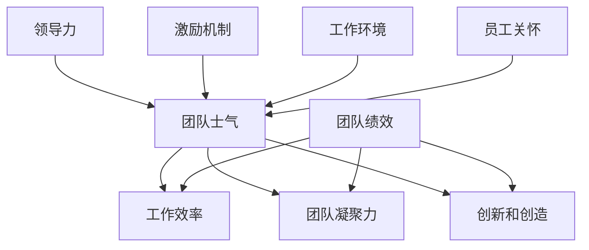
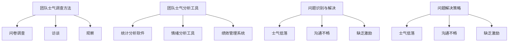

                 

### 文章标题

#### 团队士气管理：保持高昂斗志的秘诀

> 关键词：团队士气、管理、激励、领导力、工作环境、员工关怀

> 摘要：本文将从团队士气管理的核心概念、关键要素、影响因素及其与团队绩效的关系入手，详细探讨提升团队士气的方法和策略。通过案例分析、策略实施与优化，旨在为IT领域的技术团队提供有效的团队士气管理实践指南。

----------------------------------------------------------------

### 目录大纲

#### 《团队士气管理：保持高昂斗志的秘诀》

## 第一部分：团队士气管理概述

### 第1章：团队士气管理的重要性

- **1.1** 团队士气的定义和作用
- **1.2** 团队士气管理的关键要素
- **1.3** 团队士气对团队绩效的影响

### 第2章：团队士气的现状评估

- **2.1** 团队士气调查方法
- **2.2** 团队士气分析工具
- **2.3** 团队士气问题识别与解决

## 第二部分：提升团队士气的方法

### 第3章：激励机制设计

- **3.1** 激励理论概述
- **3.2** 激励机制的构建
- **3.3** 激励策略实施与优化

### 第4章：领导力提升

- **4.1** 领导风格与团队士气
- **4.2** 领导力的培养
- **4.3** 高效沟通与团队士气

### 第5章：工作环境改善

- **5.1** 舒适的办公环境
- **5.2** 良好的团队氛围
- **5.3** 工作环境的持续优化

### 第6章：员工关怀与支持

- **6.1** 员工福利与待遇
- **6.2** 员工心理健康支持
- **6.3** 员工成长与职业发展

### 第7章：团队士气管理的案例分析

- **7.1** 成功案例分享
- **7.2** 案例分析
- **7.3** 启示与借鉴

## 第三部分：团队士气管理的挑战与策略

### 第8章：应对团队士气低落的策略

- **8.1** 低落原因分析
- **8.2** 应对策略
- **8.3** 持续改进

### 第9章：团队士气管理中的常见问题与解决方案

- **9.1** 常见问题识别
- **9.2** 问题分析
- **9.3** 解决方案制定

### 第10章：团队士气管理的未来发展趋势

- **10.1** 发展趋势分析
- **10.2** 未来挑战
- **10.3** 应对策略

## 附录

### 附录A：团队士气管理工具与资源

- **A.1** 常用工具介绍
- **A.2** 资源推荐
- **A.3** 网络资源汇总

本文将以逻辑清晰、结构紧凑、简单易懂的方式，逐步分析团队士气管理的各个维度，为读者提供有深度、有思考、有见解的专业指导。让我们开始这一探索之旅。

----------------------------------------------------------------

### 第一部分：团队士气管理概述

#### 第1章：团队士气管理的重要性

**1.1 团队士气的定义和作用**

团队士气，是指在团队工作环境中，成员所表现出的积极态度、自信精神和合作意识。它不仅仅是个人情感的表达，更是团队整体精神状态的体现。团队士气的作用主要体现在以下几个方面：

1. **提高工作效率**：高昂的团队士气能够激发成员的工作热情，提升工作效率和生产力。当团队成员感受到自己的工作被重视和认可时，他们会更加投入，从而在短时间内完成更多的任务。
2. **增强团队凝聚力**：良好的团队士气有助于建立团队成员之间的信任和协作，增强团队的凝聚力。一个团结协作的团队，在面对挑战时能够发挥出更大的力量，共同克服困难。
3. **促进创新和创造**：在积极向上的团队氛围中，成员更容易产生创新的想法，推动团队的发展。团队士气的高涨能够激发成员的思维活力，促进新思路和新方案的诞生。

**1.2 团队士气管理的关键要素**

团队士气管理是一个复杂的过程，涉及多个方面的要素。以下是几个关键要素：

1. **领导力**：领导者的领导风格、态度和行为对团队士气有着重要影响。一个富有魅力、公正和信任的领导者能够提升团队的士气，为团队成员提供清晰的目标和方向。
2. **激励机制**：适当的激励机制可以激发团队成员的积极性，如奖金、晋升机会和认可等。合理的激励措施能够激发成员的潜力，提高工作满意度。
3. **工作环境**：一个良好的工作环境，包括舒适的工作条件和积极的团队氛围，能够提升员工的满意度和士气。良好的办公设施和团队文化有助于减轻工作压力，提高工作效率。
4. **员工关怀**：对员工的关心和支持，如提供心理健康的支持和职业发展的机会，能够增强员工的归属感和士气。关注员工的成长和发展，有助于提高团队的稳定性和长期绩效。

**1.3 团队士气对团队绩效的影响**

团队士气对团队绩效有着直接和间接的影响。直接体现在团队成员的工作表现上，士气高昂的成员更愿意付出努力，完成任务；间接影响则体现在团队的整体协作和创新能力上。一个士气低落的团队，往往难以发挥出最佳的工作效能。

团队士气的高低与团队绩效之间存在着密切的关系。研究表明，团队士气高的团队，其绩效往往高于士气低的团队。高昂的团队士气能够激发成员的潜力，推动团队取得更好的成果。

**Mermaid 流程图**



通过以上流程图，我们可以清晰地看到团队士气与领导力、激励机制、工作环境、员工关怀等因素之间的关联，以及这些因素对团队绩效的影响。

在接下来的章节中，我们将进一步探讨团队士气现状评估的方法、提升团队士气的方法以及团队士气管理的挑战与策略。希望通过本文的探讨，能够为读者提供有价值的团队士气管理实践指导。

----------------------------------------------------------------

### 第2章：团队士气的现状评估

**2.1 团队士气调查方法**

团队士气调查是评估团队士气现状的重要手段。通过调查，可以了解团队成员的工作态度、情感状态和心理需求，为团队士气管理提供依据。以下是几种常见的团队士气调查方法：

1. **问卷调查**：问卷调查是一种简单有效的调查方法。通过设计科学合理的问卷，收集团队成员对团队士气、工作环境、领导风格等方面的意见和反馈。问卷调查的优点在于能够收集大量数据，便于进行统计分析。
2. **访谈**：访谈是一种深入的调查方法，通过与团队成员进行面对面交流，了解他们的真实想法和感受。访谈的优点在于能够深入了解团队成员的心理状态，发现问卷无法反映的问题。
3. **观察**：观察是一种直接获取信息的调查方法。通过观察团队成员在工作中的表现和行为，了解他们的工作态度和士气状态。观察法的优点在于能够获取第一手资料，但需要注意的是，观察者自身的主观判断可能会影响观察结果。

**2.2 团队士气分析工具**

为了更好地分析团队士气数据，可以采用一些专业的分析工具。以下是几种常用的团队士气分析工具：

1. **统计分析软件**：如SPSS、R等统计分析软件，可以用于对问卷调查结果进行统计分析，提取出关键指标和结论。
2. **情绪分析工具**：如NLP工具、情感分析软件等，可以用于对文本数据进行情感分析，识别团队成员的情绪状态。
3. **绩效管理系统**：如HRMS（人力资源管理系统）、OKR（目标与关键成果法）等，可以用于跟踪和评估团队成员的工作绩效和士气变化。

**2.3 团队士气问题识别与解决**

在团队士气调查和分析的基础上，需要识别出团队士气存在的问题，并制定相应的解决策略。以下是几个常见的问题识别和解决方法：

1. **问题识别**：
   - **士气低落**：通过问卷调查、访谈等方式，了解团队成员的工作满意度和情感状态。如果发现团队成员普遍感到压力过大、工作缺乏动力，则可能存在士气低落的问题。
   - **沟通不畅**：通过观察团队成员的沟通方式和频率，了解团队内部的沟通状况。如果发现团队成员之间存在沟通障碍，可能导致士气下降。
   - **缺乏激励**：通过分析绩效数据和员工反馈，了解团队成员对激励机制的感受。如果发现团队成员对当前激励机制不满意，可能需要调整激励措施。

2. **问题解决**：
   - **士气低落**：针对士气低落的问题，可以采取以下措施：加强团队建设活动，提高团队成员的归属感和凝聚力；优化工作环境，减轻员工压力；建立有效的沟通渠道，鼓励团队成员表达意见和建议。
   - **沟通不畅**：为改善沟通状况，可以采取以下措施：定期召开团队会议，促进团队成员之间的交流；建立反馈机制，鼓励团队成员提出改进建议；培训团队成员的沟通技巧，提高沟通效果。
   - **缺乏激励**：为提高激励效果，可以采取以下措施：调整奖金制度，确保激励机制公平合理；提供晋升机会，激发员工潜力；给予员工认可和表扬，增强工作动力。

**Mermaid 流程图**



通过以上流程图，我们可以更直观地了解团队士气现状评估的方法、工具和问题解决策略。在接下来的章节中，我们将继续探讨提升团队士气的方法，为团队管理者提供实用的指导。

----------------------------------------------------------------

### 第3章：激励机制设计

**3.1 激励理论概述**

激励机制是提升团队士气的重要手段之一。为了设计出有效的激励机制，我们需要了解一些基本的激励理论。以下是几种常见的激励理论：

1. **马斯洛需求层次理论**：马斯洛将人的需求分为生理需求、安全需求、社交需求、尊重需求和自我实现需求。他认为，只有当较低层次的需求得到满足时，人们才会追求更高层次的需求。在激励机制设计时，我们可以根据员工的需求层次，提供相应的激励措施。
2. **双因素理论**：赫茨伯格提出了双因素理论，将工作环境因素和工作本身因素分开考虑。他认为，工作环境因素（如薪酬、工作条件等）属于保健因素，不能直接提高员工满意度；而工作本身因素（如成就感、认可等）属于激励因素，能够提高员工的工作动机和满意度。
3. **期望理论**：弗鲁姆提出了期望理论，认为员工的行为取决于对结果的期望和结果的价值。期望理论指出，只有当员工认为通过努力可以达到目标，并且目标实现后能得到期望的回报时，他们才会付出努力。在激励机制设计时，我们需要确保目标明确、回报合理。

**3.2 激励机制的构建**

构建一个有效的激励机制，需要考虑以下几个方面：

1. **明确目标**：设定明确的目标，是激励机制设计的关键。目标应具有可衡量性、挑战性和可实现性，能够激发员工的工作动力。
2. **合理分配奖励**：奖励的分配应合理，确保每位员工都能感受到自己的努力得到了认可。奖励可以包括薪酬、晋升机会、奖金等。
3. **多样化奖励方式**：多样化的奖励方式可以满足不同员工的需求，提高激励效果。例如，除了物质奖励外，还可以提供培训、表彰、荣誉等非物质奖励。
4. **及时反馈**：及时反馈是激励机制的重要组成部分。通过定期反馈，可以让员工了解自己的工作表现，及时调整工作策略。

**3.3 激励策略实施与优化**

在激励机制实施过程中，需要不断优化策略，以提高激励效果。以下是几个实施与优化的方法：

1. **定期评估**：定期对激励机制进行评估，了解员工对激励措施的感受和反馈。根据评估结果，及时调整激励机制，确保其有效性。
2. **个性化激励**：根据员工的不同特点和需求，提供个性化的激励措施。例如，对于重视职业发展的员工，可以提供晋升机会和培训；对于重视工作环境的员工，可以改善办公环境和团队氛围。
3. **持续激励**：激励不仅仅是一次性的奖励，而是一个持续的过程。在员工取得成绩后，需要不断给予认可和奖励，以保持其工作动力。
4. **建立反馈机制**：建立有效的反馈机制，鼓励员工提出建议和意见。通过反馈，可以及时发现问题，优化激励机制。

**伪代码示例**

```plaintext
// 激励机制设计流程
function designIncentiveMechanism() {
    // 明确目标
    setClearGoals();

    // 合理分配奖励
    allocateRewards();

    // 多样化奖励方式
    diversifyRewards();

    // 及时反馈
    provideFeedback();

    // 定期评估
    performRegularAssessment();

    // 个性化激励
    personalizeIncentives();

    // 持续激励
    sustainIncentives();
}
```

**数学模型和公式**

激励机制的设计可以借助数学模型和公式来优化。以下是一个简单的数学模型示例：

$$
满意度 = f(目标实现度, 奖励额度, 激励频率)
$$

其中，满意度是员工对激励措施的总体评价，目标实现度、奖励额度和激励频率是影响满意度的因素。

**详细讲解和举例说明**

为了更好地理解激励机制设计，我们可以通过一个实际案例进行讲解。假设我们设计一个针对开发团队的激励机制。

1. **明确目标**：设定一个可衡量的目标，如“在三个月内完成一个高质量的软件项目”。
2. **合理分配奖励**：根据团队的表现，设定不同的奖励额度。例如，如果项目提前完成，可以给予团队额外的奖金。
3. **多样化奖励方式**：除了物质奖励外，还可以提供培训、表彰和团队建设活动等非物质奖励。
4. **及时反馈**：在项目进展过程中，定期召开会议，了解团队的工作进展和问题，及时给予反馈。
5. **定期评估**：在项目结束后，对激励机制进行评估，了解员工对激励措施的感受和效果。
6. **个性化激励**：根据员工的不同特点和需求，提供个性化的激励措施。例如，对于技术高手，可以提供更高级别的培训机会。
7. **持续激励**：在后续的项目中，继续采用类似的激励机制，以保持员工的工作动力。

通过以上案例，我们可以看到，一个有效的激励机制需要考虑多个方面，包括目标设定、奖励分配、奖励方式、反馈机制、评估和个性化激励等。通过这些策略的实施，可以提升团队士气，提高工作效率和绩效。

在接下来的章节中，我们将继续探讨领导力提升、工作环境改善和员工关怀与支持等方面，为团队士气管理提供更加全面的指导。

----------------------------------------------------------------

### 第4章：领导力提升

**4.1 领导风格与团队士气**

领导风格对团队士气有着重要的影响。不同的领导风格会带来不同的团队氛围和士气状态。以下是几种常见的领导风格及其对团队士气的影响：

1. **权威型领导**：权威型领导通过严格的管理和控制来确保团队的纪律和效率。这种领导风格可能在短期内提升团队的士气，但长期来看，可能会让团队成员感到压抑和不满，从而影响士气。
2. **民主型领导**：民主型领导鼓励团队成员参与决策，尊重成员的意见和需求。这种领导风格有助于提升团队的士气，增强团队成员的归属感和参与感。
3. **参与型领导**：参与型领导更加注重团队成员的个人发展和职业规划，与团队成员建立紧密的关系。这种领导风格能够激发团队成员的潜力，提升团队士气。

**4.2 领导力的培养**

要提升团队士气，领导者需要具备一定的领导力。以下是几个培养领导力的方法：

1. **自我反思**：领导者需要不断进行自我反思，了解自己的优点和不足，从而不断提升自己的领导能力。
2. **学习与培训**：通过参加培训课程、阅读相关书籍和文章，领导者可以学习到先进的领导理论和实践经验，提升自己的领导力。
3. **实践经验**：领导者需要在实际工作中积累经验，通过解决各种问题和挑战，提升自己的领导能力。
4. **建立信任**：领导者需要与团队成员建立信任关系，倾听他们的意见和建议，尊重他们的权利和利益。

**4.3 高效沟通与团队士气**

沟通是领导力的重要组成部分。高效的沟通能够确保团队目标的明确，促进团队成员之间的协作，从而提升团队士气。以下是几个高效沟通的方法：

1. **明确目标**：领导者需要明确团队的目标和任务，确保每位成员都清楚自己的职责和期望。
2. **倾听与理解**：领导者需要倾听团队成员的意见和需求，理解他们的想法和感受，从而建立良好的沟通渠道。
3. **积极反馈**：领导者需要给予团队成员积极的反馈，认可他们的努力和成就，从而提高他们的工作动力。
4. **透明沟通**：领导者需要保持沟通的透明度，及时向团队成员传达重要信息，避免信息不对称和误解。

**伪代码示例**

```plaintext
// 领导力提升流程
function enhanceLeadership() {
    // 自我反思
    performSelfReflection();

    // 学习与培训
    attendTrainingSessions();

    // 实践经验
    gainPracticalExperience();

    // 建立信任
    buildTrust();

    // 明确目标
    clarifyGoals();

    // 倾听与理解
    listenAndUnderstand();

    // 积极反馈
    providePositiveFeedback();

    // 透明沟通
    maintainTransparentCommunication();
}
```

**数学模型和公式**

领导力的提升可以借助数学模型和公式来量化。以下是一个简单的数学模型示例：

$$
领导力 = f(自我反思, 学习与培训, 实践经验, 建立信任, 明确目标, 倾听与理解, 积极反馈, 透明沟通)
$$

其中，领导力是领导者综合能力的体现，各项因素对领导力有不同程度的影响。

**详细讲解和举例说明**

为了更好地理解领导力提升的方法，我们可以通过一个实际案例进行讲解。假设我们是一家科技公司的高管，想要提升团队的士气。

1. **自我反思**：作为领导者，我们需要定期进行自我反思，了解自己在团队管理中的优点和不足。通过自我反思，我们可以发现自己在沟通和决策方面的不足，从而制定改进计划。
2. **学习与培训**：我们可以参加领导力培训课程，学习先进的领导理论和方法。通过学习，我们可以掌握更多的领导技能，提升自己的领导能力。
3. **实践经验**：我们需要在实际工作中积累经验，通过解决各种问题和挑战，提升自己的领导能力。例如，在团队面临困境时，我们需要发挥领导力，带领团队共同克服困难。
4. **建立信任**：与团队成员建立信任关系是提升团队士气的关键。我们可以通过与团队成员建立良好的沟通渠道，了解他们的需求和期望，从而建立信任。
5. **明确目标**：作为领导者，我们需要明确团队的目标和任务，确保每位成员都清楚自己的职责和期望。这样可以提高团队的工作效率和士气。
6. **倾听与理解**：我们需要倾听团队成员的意见和需求，理解他们的想法和感受，从而建立良好的沟通渠道。
7. **积极反馈**：我们需要给予团队成员积极的反馈，认可他们的努力和成就，从而提高他们的工作动力。
8. **透明沟通**：我们需要保持沟通的透明度，及时向团队成员传达重要信息，避免信息不对称和误解。

通过以上案例，我们可以看到，提升领导力需要从多个方面进行努力，包括自我反思、学习与培训、实践经验、建立信任、明确目标、倾听与理解、积极反馈和透明沟通等。通过这些方法的实施，可以提升团队士气，提高工作效率和绩效。

在接下来的章节中，我们将继续探讨工作环境改善和员工关怀与支持等方面，为团队士气管理提供更加全面的指导。

----------------------------------------------------------------

### 第5章：工作环境改善

**5.1 舒适的办公环境**

舒适的办公环境是提升团队士气的重要因素之一。一个舒适的办公环境能够减少员工的工作压力，提高工作效率和满意度。以下是几个改善办公环境的方法：

1. **优化办公空间**：合理布局办公空间，确保每位员工都有足够的办公桌、椅子和其他必要设备。同时，注意采光和通风，创造一个明亮、舒适的工作环境。
2. **提供舒适的工作条件**：为员工提供舒适的工作条件，如舒适的座椅、良好的照明、适宜的空调温度等。这些细节的改善能够提升员工的工作舒适度。
3. **装饰与绿化**：在办公区域适当增加装饰和绿化，如挂画、盆栽等，可以创造一个温馨、放松的工作环境，有助于缓解员工的工作压力。

**5.2 良好的团队氛围**

良好的团队氛围是提升团队士气的重要保障。一个和谐、积极的团队氛围能够激发员工的热情和创造力，提高团队的整体绩效。以下是几个营造良好团队氛围的方法：

1. **鼓励团队互动**：定期组织团队活动，如团队建设活动、团建旅行等，增强团队成员之间的互动和沟通。通过这些活动，可以增进团队成员的了解和信任，营造一个团结、和谐的团队氛围。
2. **建立共同的价值观**：明确团队的价值观，确保每位员工都认同并遵循这些价值观。共同的价值观可以增强团队成员的归属感和凝聚力，促进团队目标的实现。
3. **提供心理支持**：关注员工的心理健康，提供心理支持服务。通过心理咨询、压力管理等活动，帮助员工缓解工作压力，保持良好的心态。

**5.3 工作环境的持续优化**

工作环境的改善不是一次性的任务，而是一个持续优化的过程。为了确保工作环境的持续优化，可以采取以下策略：

1. **定期评估**：定期对工作环境进行评估，了解员工对当前工作环境的满意度和改进需求。通过评估，可以及时发现和解决问题，持续优化工作环境。
2. **员工参与**：鼓励员工参与到工作环境的优化过程中，收集他们的意见和建议。员工的参与可以提高他们的工作积极性，同时也能够更好地满足他们的需求。
3. **技术创新**：利用现代科技手段，如智能化办公设备、远程办公系统等，提高工作效率和舒适度。通过技术创新，可以不断改善工作环境，提升团队士气。

**伪代码示例**

```plaintext
// 工作环境改善流程
function improveWorkEnvironment() {
    // 优化办公空间
    optimizeOfficeSpace();

    // 提供舒适的工作条件
    provideComfortableWorkingConditions();

    // 装饰与绿化
    decorateAndGreenify();

    // 鼓励团队互动
    encourageTeamInteractions();

    // 建立共同的价值观
    establishSharedValues();

    // 提供心理支持
    provideMentalSupport();

    // 定期评估
    performRegularAssessments();

    // 员工参与
    involveEmployees();

    // 技术创新
    leverageTechnologicalInnovations();
}
```

**数学模型和公式**

工作环境的优化可以借助数学模型和公式来量化。以下是一个简单的数学模型示例：

$$
工作环境满意度 = f(办公空间优化, 工作条件舒适度, 团队氛围和谐度, 心理支持满意度)
$$

其中，工作环境满意度是员工对工作环境的总体评价，各项因素对满意度有不同程度的影响。

**详细讲解和举例说明**

为了更好地理解工作环境改善的方法，我们可以通过一个实际案例进行讲解。假设我们是一家科技公司，想要改善员工的工作环境。

1. **优化办公空间**：我们对办公空间进行重新布局，确保每位员工都有独立的办公桌和舒适的座椅。同时，增加了一些盆栽和绿植，创造一个更加自然、舒适的工作环境。
2. **提供舒适的工作条件**：我们为员工配备了舒适的办公椅、良好的照明设备和适宜的空调温度。这些改善措施大大提高了员工的工作舒适度。
3. **装饰与绿化**：我们在办公区域挂上了艺术画作，增加了绿植和盆栽，营造了一个更加温馨、放松的工作环境。
4. **鼓励团队互动**：我们定期组织团队建设活动，如团建旅行、团队拓展训练等，增强了团队成员之间的互动和沟通。这些活动不仅有助于提升团队士气，也增强了团队凝聚力。
5. **建立共同的价值观**：我们明确了公司的价值观，如“创新、协作、客户至上”等，并确保每位员工都认同并遵循这些价值观。共同的价值观让员工在工作中有了更加明确的方向和目标。
6. **提供心理支持**：我们为员工提供心理健康支持，如定期开展心理讲座、提供心理咨询服务等。这些措施帮助员工缓解工作压力，保持良好的心态。
7. **定期评估**：我们定期对工作环境进行评估，了解员工对当前工作环境的满意度和改进需求。通过评估，我们及时发现了需要改进的地方，并采取了相应的措施。
8. **员工参与**：我们鼓励员工参与到工作环境的优化过程中，收集他们的意见和建议。员工的参与提高了他们的工作积极性，也使工作环境更加符合他们的需求。
9. **技术创新**：我们引入了一些智能化办公设备，如智能办公桌、远程办公系统等。这些技术创新提高了员工的工作效率，也提升了他们的工作舒适度。

通过以上案例，我们可以看到，改善工作环境需要从多个方面进行努力，包括优化办公空间、提供舒适的工作条件、装饰与绿化、鼓励团队互动、建立共同的价值观、提供心理支持、定期评估、员工参与和利用技术创新等。通过这些方法的实施，可以大大提升团队士气，提高工作效率和绩效。

在接下来的章节中，我们将继续探讨员工关怀与支持和团队士气管理的挑战与策略，为团队士气管理提供更加全面的指导。

----------------------------------------------------------------

### 第6章：员工关怀与支持

**6.1 员工福利与待遇**

员工福利与待遇是提升团队士气的重要方面之一。一个完善的福利体系不仅能吸引优秀的人才，还能提高员工的工作满意度和忠诚度。以下是几个常见的员工福利与待遇：

1. **薪酬**：合理的薪酬是员工的基本需求，也是提高团队士气的重要手段。企业应根据市场水平设定有竞争力的薪酬，并定期调整。
2. **奖金**：为激励员工的工作积极性，可以设置各种形式的奖金，如绩效奖金、年终奖等。奖金的发放应透明、公正，以确保员工感受到公平的待遇。
3. **福利**：除了基本的薪酬和奖金外，企业还可以提供各种福利，如健康保险、养老保险、医疗保险等。这些福利能够提高员工的生活质量，减轻他们的后顾之忧。
4. **休假**：提供充足的休假时间，如年假、病假、产假等，让员工在紧张的工作之余能够得到充分的休息和放松。
5. **员工活动**：定期组织员工活动，如团建活动、节假日庆祝等，增强员工的团队凝聚力和归属感。

**6.2 员工心理健康支持**

员工的心理健康直接影响他们的工作效率和士气。因此，企业应重视员工的心理健康支持，提供以下服务：

1. **心理咨询**：设立心理咨询室，提供专业的心理咨询服务，帮助员工解决心理问题，如焦虑、抑郁等。
2. **压力管理**：通过培训和心理辅导，帮助员工学会应对工作压力，提高心理弹性。
3. **EAP（员工援助计划）**：提供全面的EAP服务，包括心理健康咨询、家庭辅导、法律援助等，帮助员工解决工作和生活中的问题。

**6.3 员工成长与职业发展**

员工的成长与职业发展是提升团队士气的重要因素。企业应提供以下支持：

1. **培训**：定期组织内部培训和外部培训，提高员工的专业技能和综合素质。培训内容应涵盖技术培训、管理培训、领导力培训等。
2. **职业规划**：帮助员工制定职业规划，明确职业目标和职业路径。企业应提供晋升机会，鼓励员工不断成长。
3. **激励机制**：建立有效的激励机制，如晋升激励、奖金激励等，激发员工的积极性和进取心。

**伪代码示例**

```plaintext
// 员工关怀与支持流程
function employeeCareAndSupport() {
    // 提供薪酬
    offerCompensation();

    // 设定奖金
    setBonuses();

    // 提供福利
    provideBenefits();

    // 设定休假政策
    setVacationPolicies();

    // 组织员工活动
    organizeEmployeeActivities();

    // 提供心理咨询
    provideCounselingServices();

    // 压力管理
    manageStress();

    // EAP服务
    offerEAPServices();

    // 提供培训
    provideTraining();

    // 职业规划
    offerCareerDevelopment();

    // 激励机制
    setIncentiveMechanisms();
}
```

**数学模型和公式**

员工关怀与支持可以借助数学模型和公式来量化。以下是一个简单的数学模型示例：

$$
员工满意度 = f(薪酬满意度, 奖金满意度, 福利满意度, 假期满意度, 心理健康支持满意度, 培训满意度, 职业发展满意度, 激励机制满意度)
$$

其中，员工满意度是员工对各项关怀和支持措施的总体评价，各项满意度对员工满意度有不同程度的影响。

**详细讲解和举例说明**

为了更好地理解员工关怀与支持的方法，我们可以通过一个实际案例进行讲解。假设我们是一家科技公司，想要提升员工的满意度和士气。

1. **提供薪酬**：我们对员工的薪酬进行了市场调研，确保薪酬水平具有竞争力。同时，我们定期调整薪酬，以反映员工的工作表现和市场变化。
2. **设定奖金**：我们根据员工的绩效，设定了多种奖金，如季度奖金、年度奖金等。奖金的发放透明、公正，员工能够清楚地看到自己的贡献和回报。
3. **提供福利**：我们为员工提供了全面的福利，包括健康保险、养老保险、医疗保险等。这些福利不仅减轻了员工的经济负担，也提高了他们的生活质量。
4. **设定休假政策**：我们为员工提供了充足的休假时间，包括带薪年假、病假、产假等。员工在紧张的工作之余，可以享受充分的休息和放松。
5. **组织员工活动**：我们定期组织团建活动、节假日庆祝等，增强员工的团队凝聚力和归属感。这些活动不仅丰富了员工的业余生活，也提高了他们的工作积极性。
6. **提供心理咨询**：我们设立了心理咨询室，为员工提供专业的心理健康支持。员工可以随时预约咨询，解决心理问题。
7. **压力管理**：我们定期开展压力管理培训，帮助员工学会应对工作压力。此外，我们还提供一系列心理辅导服务，帮助员工缓解压力。
8. **EAP服务**：我们为员工提供全面的EAP服务，包括心理健康咨询、家庭辅导、法律援助等。员工在遇到问题和挑战时，可以得到及时的帮助和支持。
9. **提供培训**：我们定期组织内部培训和外部培训，提高员工的专业技能和综合素质。培训内容涵盖技术培训、管理培训、领导力培训等，以满足员工的职业发展需求。
10. **职业规划**：我们为员工提供职业规划服务，帮助他们明确职业目标和职业路径。我们鼓励员工制定个人发展规划，并提供晋升机会，支持他们的职业成长。
11. **激励机制**：我们建立了多种激励机制，如晋升激励、奖金激励等。这些激励措施激发了员工的积极性和进取心，提高了他们的工作热情。

通过以上案例，我们可以看到，员工关怀与支持需要从多个方面进行努力，包括提供薪酬、设定奖金、提供福利、设定休假政策、组织员工活动、提供心理咨询、压力管理、EAP服务、提供培训、职业规划和激励机制等。通过这些方法的实施，可以大大提升员工的满意度和士气，提高团队的整体绩效。

在接下来的章节中，我们将继续探讨团队士气管理的挑战与策略，为团队士气管理提供更加全面的指导。

----------------------------------------------------------------

### 第7章：团队士气管理的案例分析

**7.1 成功案例分享**

在一个成功的团队士气管理案例中，我们可以看到一家初创公司通过一系列有效的措施，成功提升了团队士气，推动了公司的发展。以下是这个案例的具体内容和实施过程：

**案例背景**：这家初创公司是一家专注于人工智能领域的公司，团队成员由一群充满激情和创意的年轻工程师组成。然而，在公司成立初期，由于工作压力大、团队沟通不畅，团队士气一度较低，影响了公司的绩效。

**实施措施**：

1. **领导力提升**：公司创始人意识到领导力对团队士气的重要性，因此投入大量时间和精力进行自我提升。他参加了领导力培训课程，学习如何更好地与团队成员沟通，倾听他们的意见，并给予及时的反馈。通过这些努力，公司创始人的领导力得到了显著提升，团队士气逐渐改善。

2. **激励机制设计**：为了激励团队成员，公司设立了多种激励机制，包括绩效奖金、项目奖励和晋升机会。这些激励措施不仅能够激发员工的工作积极性，还能让员工感受到自己的努力得到了认可和回报。

3. **工作环境改善**：公司投入资金改善了办公环境，增加了休息区域和娱乐设施，提供了舒适的座椅和良好的照明。此外，公司还组织了定期的团队建设活动，如团建旅行、户外拓展等，增强了团队成员之间的互动和沟通。

4. **员工关怀与支持**：公司重视员工的心理健康和职业发展，为员工提供了心理咨询、压力管理和职业规划等服务。公司还定期举办内部培训，帮助员工提升专业技能和综合素质。

**结果**：通过以上措施，公司的团队士气得到了显著提升。员工的工作满意度增加，工作效率提高，公司业绩也得到了显著增长。此外，良好的团队氛围和员工关怀措施吸引了更多优秀人才加入公司，为公司的长期发展奠定了基础。

**7.2 案例分析**

该案例的成功主要体现在以下几个方面：

1. **领导力的提升**：领导者的领导力对团队士气有直接的影响。在这个案例中，公司创始人通过自我提升，改善了领导风格，建立了信任和尊重的团队氛围，从而提升了团队士气。

2. **激励机制的有效性**：合理的激励机制能够激发员工的工作热情和积极性。在这个案例中，公司设立了多种激励机制，确保每位员工都能感受到自己的努力得到了认可和回报，从而提高了工作满意度和士气。

3. **工作环境的改善**：一个良好的工作环境能够减少员工的工作压力，提高工作效率和满意度。在这个案例中，公司通过改善办公环境和组织团队建设活动，创造了舒适、积极的工作氛围，从而提升了团队士气。

4. **员工关怀与支持**：员工的心理健康和职业发展是提升团队士气的重要因素。在这个案例中，公司为员工提供了全面的关怀和支持，包括心理咨询、压力管理和职业规划等，帮助员工保持良好的心态和职业发展。

**7.3 启示与借鉴**

通过这个成功案例，我们可以得出以下启示和借鉴：

1. **领导力提升**：领导者需要不断自我提升，建立信任和尊重的团队氛围。领导者的领导力对团队士气有直接的影响，一个富有魅力、公正和信任的领导者能够提升团队的士气。

2. **激励机制设计**：合理的激励机制能够激发员工的工作热情和积极性。企业应根据员工的实际需求和公司目标，设计有效的激励机制。

3. **工作环境改善**：改善工作环境，提供舒适的工作条件和积极的团队氛围，能够提升员工的工作满意度和士气。

4. **员工关怀与支持**：关注员工的心理健康和职业发展，提供心理咨询、压力管理和职业规划等服务，能够提升员工的归属感和士气。

总之，团队士气管理是一个系统工程，需要从多个方面进行努力。通过领导力提升、激励机制设计、工作环境改善和员工关怀与支持等措施，可以有效地提升团队士气，提高工作效率和绩效。希望读者能够从这些成功案例中汲取经验，结合自己的实际情况，制定出适合自己团队的士气管理策略。

在接下来的章节中，我们将继续探讨团队士气管理的挑战与策略，为团队士气管理提供更加全面的指导。

----------------------------------------------------------------

### 第8章：应对团队士气低落的策略

**8.1 低落原因分析**

团队士气低落的原因多种多样，以下是几个常见的原因：

1. **工作压力过大**：长期的工作压力会导致员工身心疲惫，影响工作效率和士气。当员工感到工作负担过重时，容易产生焦虑和厌倦情绪。
2. **沟通不畅**：团队内部沟通不畅会导致信息不对称、误解和冲突，影响团队的协作效率和士气。如果员工无法有效地表达自己的意见和需求，容易感到沮丧和孤独。
3. **缺乏激励机制**：缺乏有效的激励机制会导致员工的工作动力不足，影响团队士气。当员工感到自己的努力没有得到认可和回报时，容易失去工作热情。
4. **工作环境不佳**：一个不良的工作环境，如噪音、拥挤、设备不完善等，会影响员工的工作效率和士气。如果员工在恶劣的工作环境中工作，容易感到压抑和不满。
5. **员工心理健康问题**：员工的心理健康问题，如焦虑、抑郁等，会影响他们的工作表现和士气。如果员工无法得到及时的心理支持，容易陷入负面情绪中。

**8.2 应对策略**

针对团队士气低落的原因，可以采取以下应对策略：

1. **减轻工作压力**：通过合理分配工作任务、优化工作流程和提供心理支持等措施，减轻员工的工作压力。例如，可以采用弹性工作时间、提供心理咨询服务等，帮助员工缓解压力。
2. **改善沟通渠道**：建立有效的沟通渠道，促进团队成员之间的沟通和协作。可以通过定期召开团队会议、设立意见箱、开展团队建设活动等方式，增强团队的沟通能力。
3. **完善激励机制**：建立合理的激励机制，确保员工的工作努力得到认可和回报。可以通过设置绩效奖金、晋升机会、表彰和奖励等方式，激发员工的工作热情。
4. **改善工作环境**：投入资金改善工作环境，提供舒适的办公设施和良好的工作氛围。可以通过优化办公布局、增加休息区域、提供绿色植物等，创造一个良好的工作环境。
5. **关注员工心理健康**：关注员工的心理健康，提供心理支持服务。可以通过开展心理健康讲座、设立心理咨询室、提供心理咨询服务等方式，帮助员工保持良好的心态。

**8.3 持续改进**

应对团队士气低落的策略不是一次性的，而是一个持续改进的过程。为了确保策略的有效性，可以采取以下措施：

1. **定期评估**：定期对团队士气进行评估，了解员工的工作压力、沟通状况、激励机制和工作环境等方面的满意度和改进需求。
2. **反馈与调整**：根据评估结果，及时收集员工的反馈，调整应对策略。通过持续改进，确保策略的有效性和针对性。
3. **员工参与**：鼓励员工参与到团队士气管理的改进过程中，收集他们的意见和建议。员工的参与可以提高他们的工作积极性和满意度。
4. **培训与学习**：定期开展培训和学习活动，提升团队成员的沟通能力、领导力和心理健康知识。通过培训和学习，可以增强团队的凝聚力和士气。

**伪代码示例**

```plaintext
// 应对团队士气低落的策略
function addressLowMood() {
    // 减轻工作压力
    reduceWorkPressure();

    // 改善沟通渠道
    improveCommunicationChannels();

    // 完善激励机制
    refineIncentiveMechanisms();

    // 改善工作环境
    enhanceWorkEnvironment();

    // 关注员工心理健康
    focusOnEmployeeMentalHealth();

    // 定期评估
    performRegularAssessments();

    // 反馈与调整
    gatherFeedbackAndAdjust();

    // 员工参与
    involveEmployees();

    // 培训与学习
    provideTrainingAndLearning();
}
```

**数学模型和公式**

应对团队士气低落的策略可以借助数学模型和公式来量化。以下是一个简单的数学模型示例：

$$
团队士气 = f(工作压力, 沟通状况, 激励机制, 工作环境, 员工心理健康)
$$

其中，团队士气是团队成员的整体工作态度和情感状态，各项因素对士气有不同程度的影响。

**详细讲解和举例说明**

为了更好地理解应对团队士气低落的策略，我们可以通过一个实际案例进行讲解。假设我们是一家互联网公司的管理者，发现团队士气较低。

1. **减轻工作压力**：我们通过优化工作流程，将一些重复性和繁琐的任务自动化，减轻了员工的工作负担。同时，我们提供了灵活的工作时间，让员工可以在需要的时候加班，避免了长时间的工作压力。
2. **改善沟通渠道**：我们定期召开团队会议，鼓励员工分享工作进展和遇到的困难。我们还建立了在线沟通平台，方便员工随时交流意见和建议。通过这些措施，团队的沟通状况得到了显著改善。
3. **完善激励机制**：我们根据员工的表现和公司的业绩，调整了绩效奖金和晋升机会。我们还设置了项目奖励，鼓励员工积极参与公司的项目，提高了他们的工作动力。
4. **改善工作环境**：我们投入资金改善了办公环境，增加了休息区域和娱乐设施，提供了舒适的座椅和良好的照明。此外，我们还组织了定期的团建活动，增强了团队的凝聚力和士气。
5. **关注员工心理健康**：我们为员工提供了心理咨询服务，帮助他们缓解工作压力。我们还开展了心理健康讲座，提高了员工的心理健康意识。
6. **定期评估**：我们定期对团队士气进行评估，了解员工的工作压力、沟通状况、激励机制和工作环境等方面的满意度和改进需求。
7. **反馈与调整**：根据评估结果，我们及时收集了员工的反馈，调整了工作压力、沟通渠道、激励机制、工作环境和心理健康等方面的策略。
8. **员工参与**：我们鼓励员工参与到团队士气管理的改进过程中，收集他们的意见和建议。员工的参与提高了他们的工作积极性和满意度。
9. **培训与学习**：我们定期开展培训和学习活动，提升团队成员的沟通能力、领导力和心理健康知识。通过培训和学习，我们增强了团队的凝聚力和士气。

通过以上案例，我们可以看到，应对团队士气低落需要从多个方面进行努力，包括减轻工作压力、改善沟通渠道、完善激励机制、改善工作环境和关注员工心理健康等。通过这些策略的实施，可以显著提升团队士气，提高工作效率和绩效。

在接下来的章节中，我们将继续探讨团队士气管理中的常见问题与解决方案，为团队士气管理提供更加全面的指导。

----------------------------------------------------------------

### 第9章：团队士气管理中的常见问题与解决方案

**9.1 常见问题识别**

在团队士气管理过程中，管理者可能会遇到一些常见的问题，以下是几个主要的问题：

1. **士气低落**：团队成员可能感到工作压力过大、缺乏激励机制、沟通不畅、工作环境不佳等问题，导致士气低落。
2. **员工流失**：由于工作满意度低、职业发展受限等原因，可能导致员工流失，影响团队的稳定性和士气。
3. **内部冲突**：团队成员之间可能因为个人利益、工作方式、沟通不畅等原因产生冲突，影响团队的整体士气和工作效率。
4. **缺乏团队精神**：团队成员之间缺乏相互信任、支持和合作，导致团队精神不足，影响团队的凝聚力和士气。
5. **领导力不足**：领导者的领导力不足，可能导致团队缺乏方向感、凝聚力不足，从而影响士气。

**9.2 问题分析**

针对上述问题，我们需要进行深入分析，找出问题的根本原因，以便制定有效的解决方案。以下是每个问题的具体分析：

1. **士气低落**：
   - **原因分析**：工作压力过大、缺乏激励机制、沟通不畅、工作环境不佳等。
   - **影响**：降低工作效率、增加员工流失率、影响团队士气。
2. **员工流失**：
   - **原因分析**：工作满意度低、职业发展受限、薪酬福利不公等。
   - **影响**：削弱团队实力、影响团队士气、增加招聘和培训成本。
3. **内部冲突**：
   - **原因分析**：个人利益冲突、工作方式不同、沟通不畅等。
   - **影响**：降低团队凝聚力、影响工作效率、增加员工流失率。
4. **缺乏团队精神**：
   - **原因分析**：团队成员之间缺乏相互信任、支持和合作。
   - **影响**：降低团队凝聚力、影响团队协作效率、影响团队士气。
5. **领导力不足**：
   - **原因分析**：缺乏领导技能、沟通能力差、管理风格不当等。
   - **影响**：缺乏团队方向感、降低团队凝聚力、影响团队士气。

**9.3 解决方案制定**

为了解决上述问题，我们可以采取以下解决方案：

1. **士气低落**：
   - **解决方案**：通过领导力提升、激励机制设计、工作环境改善、员工关怀与支持等措施，提升团队士气。
   - **具体措施**：减轻工作压力、改善沟通渠道、提供激励机制、改善工作环境、关注员工心理健康等。
2. **员工流失**：
   - **解决方案**：提高员工满意度、提供职业发展机会、优化薪酬福利制度。
   - **具体措施**：定期员工满意度调查、提供晋升机会、设立员工激励机制、优化薪酬结构等。
3. **内部冲突**：
   - **解决方案**：加强团队建设、改善沟通渠道、设立冲突解决机制。
   - **具体措施**：定期团队建设活动、建立沟通平台、设立意见箱、开展冲突解决培训等。
4. **缺乏团队精神**：
   - **解决方案**：培养团队精神、增强团队成员之间的信任和合作。
   - **具体措施**：定期团队建设活动、设立团队目标、鼓励相互支持、提高团队凝聚力等。
5. **领导力不足**：
   - **解决方案**：提升领导力、改善沟通能力、调整管理风格。
   - **具体措施**：参加领导力培训、定期团队反馈会议、改善沟通方式、树立榜样等。

**伪代码示例**

```plaintext
// 解决团队士气管理中常见问题
function solveCommonMoodManagementProblems() {
    // 识别士气低落问题
    identifyLowMoodIssues();

    // 分析员工流失原因
    analyzeEmployeeTurnoverCauses();

    // 分析内部冲突原因
    analyzeInternalConflictCauses();

    // 分析缺乏团队精神原因
    analyzeLackOfTeamSpiritCauses();

    // 分析领导力不足原因
    analyzeWeakLeadershipCauses();

    // 制定提升士气的解决方案
    formulateMoodImprovementSolutions();

    // 制定减少员工流失的解决方案
    formulateTurnoverReductionSolutions();

    // 制定解决内部冲突的解决方案
    formulateConflictResolutionSolutions();

    // 制定增强团队精神的解决方案
    formulateTeamSpiritEnhancementSolutions();

    // 制定提升领导力的解决方案
    formulateLeadershipImprovementSolutions();
}
```

**数学模型和公式**

团队士气管理中的问题分析可以借助数学模型和公式来量化。以下是一个简单的数学模型示例：

$$
团队士气 = f(领导力, 沟通能力, 激励机制, 工作环境, 员工关怀)
$$

其中，团队士气是团队成员的整体工作态度和情感状态，各项因素对士气有不同程度的影响。

**详细讲解和举例说明**

为了更好地理解团队士气管理中的常见问题与解决方案，我们可以通过一个实际案例进行讲解。假设我们是一家软件开发公司的管理者，发现团队士气较低。

1. **士气低落问题**：
   - **原因分析**：我们发现员工的工作压力较大，经常需要加班，缺乏有效的激励机制，沟通渠道不畅，工作环境较为拥挤。
   - **解决方案**：我们通过调整工作流程，减轻员工的工作压力；设立了绩效奖金和项目奖励，提高了员工的工作积极性；建立了定期的团队会议和在线沟通平台，改善了沟通渠道；对办公环境进行了改善，增加了休息区域和绿色植物。

2. **员工流失问题**：
   - **原因分析**：我们发现员工对薪酬和福利不满意，职业发展机会有限。
   - **解决方案**：我们优化了薪酬结构，提供了具有竞争力的薪酬和福利；制定了明确的职业发展路径，提供了晋升机会。

3. **内部冲突问题**：
   - **原因分析**：我们发现团队成员之间的沟通不畅，存在个人利益冲突。
   - **解决方案**：我们开展了团队建设活动，增强了团队成员之间的沟通和理解；设立了冲突解决机制，帮助团队成员解决分歧。

4. **缺乏团队精神问题**：
   - **原因分析**：我们发现团队成员之间缺乏相互信任和支持，缺乏共同的目标。
   - **解决方案**：我们设立了团队目标，鼓励团队成员相互支持和合作；定期开展团队建设活动，增强了团队凝聚力。

5. **领导力不足问题**：
   - **原因分析**：我们发现领导者的沟通能力和管理风格存在问题，缺乏有效的领导力。
   - **解决方案**：我们为领导者提供了领导力培训，提高了他们的沟通能力和管理技巧。

通过以上案例，我们可以看到，解决团队士气管理中的常见问题需要从多个方面进行努力，包括领导力提升、激励机制设计、工作环境改善、员工关怀与支持等。通过这些措施的实施，可以显著提升团队士气，提高工作效率和绩效。

在接下来的章节中，我们将继续探讨团队士气管理的未来发展趋势，为团队士气管理提供更加前瞻性的指导。

----------------------------------------------------------------

### 第10章：团队士气管理的未来发展趋势

**10.1 发展趋势分析**

随着社会的不断进步和科技的迅猛发展，团队士气管理也在不断演变和升级。以下是几个未来团队士气管理的发展趋势：

1. **数字化管理**：随着数字化技术的普及，越来越多的企业开始采用数字化工具进行团队士气管理。例如，通过在线问卷调查、数据分析软件等，实时了解团队成员的情感状态和工作满意度，从而更精准地制定管理策略。

2. **个性化关怀**：在未来的团队士气管理中，个性化关怀将成为重要趋势。企业将更加注重了解每位员工的个性化需求，提供量身定制的关怀和支持，如个性化培训、定制化福利等。

3. **心理健康关注**：随着心理健康问题的日益突出，企业将更加重视员工的心理健康。通过设立心理健康咨询室、提供心理支持服务等，帮助员工缓解工作压力，提高心理健康水平。

4. **员工参与**：未来的团队士气管理将更加注重员工的参与和反馈。企业将鼓励员工参与到团队决策和改进过程中，增强他们的归属感和主人翁意识。

5. **远程工作与团队士气**：随着远程工作的普及，如何保持远程团队的士气将成为一个新的挑战和趋势。企业需要探索适合远程工作的士气管理方法，如虚拟团建活动、在线沟通工具等。

**10.2 未来挑战**

在未来，团队士气管理将面临一系列挑战：

1. **技术变革**：数字化、人工智能等技术的快速发展，给团队士气管理带来了新的机遇和挑战。管理者需要不断学习和适应新技术，提升管理效率。

2. **心理健康问题**：随着工作压力的增加，员工的心理健康问题日益突出。企业需要投入更多资源和精力，关注员工的心理健康，提供有效的心理支持。

3. **员工多样性**：随着全球化的推进，团队将越来越多元化，包括不同的文化背景、工作方式和价值观。管理者需要学会如何管理多样性团队，提升团队士气。

4. **工作与生活的平衡**：在未来的工作中，员工将更加关注工作与生活的平衡。企业需要提供更多的灵活工作安排，帮助员工实现工作与生活的平衡。

**10.3 应对策略**

为了应对未来团队士气管理的挑战，企业可以采取以下策略：

1. **提升数字化管理能力**：通过采用数字化工具和平台，提高团队士气管理的效率和精准度。

2. **关注员工心理健康**：建立心理健康支持体系，提供心理咨询、压力管理等服务，帮助员工保持心理健康。

3. **促进员工参与**：鼓励员工参与团队决策和改进过程，提高他们的工作满意度和归属感。

4. **多元化管理**：学会如何管理多样性团队，尊重和欣赏不同文化背景和价值观，提升团队的凝聚力。

5. **灵活工作安排**：提供灵活的工作安排，帮助员工实现工作与生活的平衡。

**伪代码示例**

```plaintext
// 未来团队士气管理发展趋势与应对策略
function futureMoodManagementTrendsAndStrategies() {
    // 提升数字化管理能力
    enhanceDigitalManagementSkills();

    // 关注员工心理健康
    focusOnEmployeeMentalHealth();

    // 促进员工参与
    promoteEmployeeEngagement();

    // 多元化团队管理
    manageDiverseTeams();

    // 提供灵活工作安排
    offerFlexibleWorkArrangements();
}
```

**数学模型和公式**

未来团队士气管理的策略可以借助数学模型和公式来优化。以下是一个简单的数学模型示例：

$$
团队士气 = f(数字化管理能力, 心理健康关注, 员工参与度, 多元化管理能力, 灵活工作安排)
$$

其中，团队士气是团队成员的整体工作态度和情感状态，各项因素对士气有不同程度的影响。

**详细讲解和举例说明**

为了更好地理解未来团队士气管理的趋势和应对策略，我们可以通过一个实际案例进行讲解。假设我们是一家跨国公司，想要适应未来团队士气管理的趋势。

1. **提升数字化管理能力**：我们采用先进的数字化管理工具，如在线协作平台、数据分析软件等，实时了解团队成员的工作状态和情感变化，从而更有效地进行团队士气管理。
2. **关注员工心理健康**：我们设立了心理健康支持服务，提供心理咨询、压力管理等服务，帮助员工保持良好的心理健康状态。
3. **促进员工参与**：我们鼓励员工参与公司的决策过程，定期召开员工代表大会，收集员工的意见和建议，提高他们的参与感和主人翁意识。
4. **多元化团队管理**：我们注重团队的多样性，尊重和欣赏不同文化背景和价值观的员工，通过多元化管理策略，增强团队的凝聚力和士气。
5. **提供灵活工作安排**：我们为员工提供灵活的工作安排，如远程工作、弹性工作时间等，帮助员工实现工作与生活的平衡。

通过以上案例，我们可以看到，适应未来团队士气管理的趋势需要从多个方面进行努力，包括提升数字化管理能力、关注员工心理健康、促进员工参与、多元化团队管理和提供灵活工作安排等。通过这些策略的实施，可以更好地应对未来团队士气管理的挑战，提升团队士气和工作效率。

在文章的最后部分，我们将提供附录，为读者提供更多关于团队士气管理工具与资源的详细信息，帮助他们在实际工作中应用和实践。

----------------------------------------------------------------

### 附录A：团队士气管理工具与资源

**A.1 常用工具介绍**

在团队士气管理过程中，有许多实用的工具可以帮助管理者更好地了解团队成员的情感状态和工作满意度。以下是几个常用的工具：

1. **问卷调查工具**：问卷调查是了解团队成员情绪状态和满意度的一种有效方法。常用的问卷调查工具有Google表单、SurveyMonkey、Typeform等。这些工具具有易用性、功能强大和数据分析功能，可以帮助管理者快速收集和分析团队成员的反馈。

2. **员工反馈系统**：员工反馈系统是一种在线平台，用于收集员工对工作环境、领导力、激励机制等方面的意见和建议。常用的员工反馈系统有OfficeVibe、TINYpulse、Culture Amp等。这些系统提供实时数据分析和报告功能，帮助管理者及时了解团队状况。

3. **心理健康支持平台**：心理健康支持平台为员工提供心理咨询、压力管理、心理健康知识普及等服务。常用的心理健康支持平台有BetterUp、Talkspace、Headspace等。这些平台提供专业的心理咨询师服务，帮助员工缓解工作压力，提高心理健康水平。

**A.2 资源推荐**

为了更好地进行团队士气管理，以下是一些推荐的资源：

1. **书籍**：《团队士气管理实战指南》、《团队士气提升策略》、《领导力与团队士气》等。这些书籍提供了丰富的理论和实践经验，帮助管理者提升团队士气。

2. **在线课程**：Coursera、edX、Udemy等在线教育平台提供了许多关于团队士气管理和领导力的课程。通过这些课程，管理者可以学习到最新的管理理论和实践技巧。

3. **研讨会和讲座**：许多机构和公司定期举办关于团队士气管理的研讨会和讲座。参加这些活动，可以与同行交流经验，了解最新的团队士气管理趋势。

**A.3 网络资源汇总**

以下是一些关于团队士气管理的重要网络资源，供读者参考：

1. **团队士气管理论坛**：如TeamMood、TeamMentor等。这些论坛汇集了来自世界各地的团队士气管理专家和从业者，提供丰富的讨论和分享资源。

2. **专业网站**：如HBR.org、LinkedIn、Glassdoor等。这些网站提供了大量的关于团队士气管理的文章、案例研究和数据报告。

3. **社交媒体平台**：如LinkedIn、Twitter、Facebook等。通过关注相关领域的专业人士和机构，可以及时获取最新的团队士气管理动态和观点。

通过以上工具与资源，管理者可以更好地了解团队士气管理的现状，掌握最新的管理技巧和方法，从而提升团队士气和工作效率。

本文《团队士气管理：保持高昂斗志的秘诀》旨在为团队士气管理提供全面的指导。通过分析团队士气管理的核心概念、关键要素、现状评估、提升方法、案例分析、挑战应对、常见问题解决和未来发展趋势，为读者提供了有深度、有思考、有见解的专业指导。希望本文能够为团队管理者提供实用的参考，帮助他们在实际工作中有效提升团队士气，提高团队绩效。

---

**作者：AI天才研究院/AI Genius Institute & 禅与计算机程序设计艺术 /Zen And The Art of Computer Programming**

