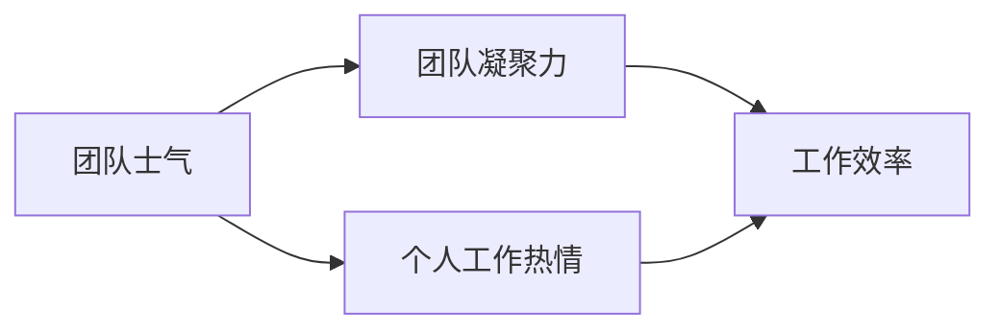
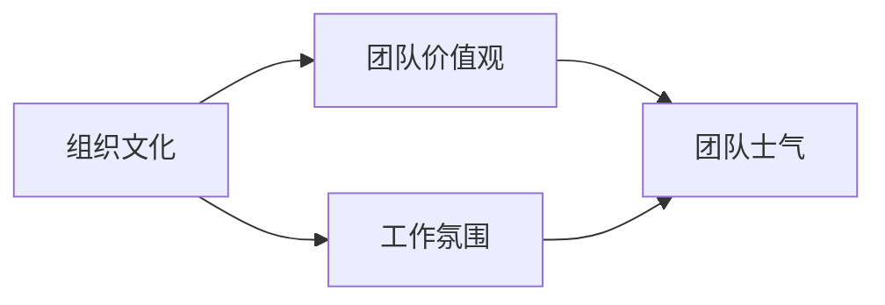

                 

### 第1章：团队士气的定义与重要性

#### 1.1 团队士气的定义

团队士气是指团队成员在共同工作中表现出的精神状态和积极情绪。这种士气不仅包括个人的工作热情和积极性，还涵盖了团队成员之间的相互支持和合作精神。在技术团队中，良好的团队士气能够显著提升工作效率和创造力，促进团队成员之间的有效沟通和协作。

**核心概念与联系：**

团队士气可以看作是团队凝聚力和个人工作热情的综合体现。以下是它们之间的联系：



- **团队士气与团队凝聚力：** 团队凝聚力是团队士气的基础，一个凝聚力强的团队往往士气高昂。
- **团队士气与个人工作热情：** 个人工作热情是团队士气的重要组成部分，工作热情高涨的成员能够带动整个团队。

#### 1.2 团队士气的重要性

团队士气对于技术团队来说至关重要，它直接影响着团队的工作效率、创新能力和整体绩效。以下是团队士气的重要性：

**核心算法原理讲解：**

提高团队士气能够增强团队凝聚力，提高工作效率和创造力，从而带来更高的组织绩效。我们可以使用以下公式来描述这种关系：

$$绩效 = f(团队士气, 工作效率, 创新能力)$$

**详细讲解与举例说明：**

1. **工作效率提升：** 当团队士气高涨时，成员更愿意合作，工作效率显著提高。例如，在一个士气高涨的研发团队中，成员们愿意分享知识，共同解决问题，从而加快了项目的开发进度。
   
2. **创新能力增强：** 团队士气能够激发成员的创造力和创新思维，有利于产生突破性的技术成果。例如，在谷歌这样的创新型科技公司，良好的团队士气使得员工能够自由地探讨和尝试新想法，从而推动了公司的技术进步。

3. **员工满意度提高：** 高涨的团队士气能够提升员工的工作满意度和忠诚度，降低员工流失率。这对技术团队尤为重要，因为技术人才流失会给团队带来巨大的成本和影响。

#### 1.3 团队士气的影响因素

团队士气受到多种因素的影响，包括工作压力、组织文化、领导风格等。以下是这些因素的具体影响：

**数学模型和数学公式：**

$$士气 = f(激励, 信任, 沟通, 领导风格, 工作环境)$$

- **激励：** 合理的激励制度能够提高团队成员的工作动力和士气。
- **信任：** 团队成员之间的信任能够增强团队凝聚力，提升士气。
- **沟通：** 良好的沟通有助于团队成员理解彼此的需求，减少误解和冲突。
- **领导风格：** 开放和支持性的领导风格能够激励团队成员，提升士气。
- **工作环境：** 舒适的工作环境和良好的工作氛围能够提升员工的工作满意度和士气。

**详细讲解与举例说明：**

1. **工作压力与团队士气：** 过大的工作压力会降低团队士气，导致员工焦虑和疲劳。因此，管理者需要合理分配工作，确保团队成员能够平衡工作和生活。
   
2. **组织文化与团队士气：** 积极向上的组织文化能够激励员工，提升团队士气。例如，谷歌的“不作恶”文化和鼓励创新的工作环境，使得员工士气高昂。

3. **领导风格与团队士气：** 领导者需要具备良好的沟通能力和激励能力，以提升团队士气。例如，通过定期的团队建设活动和公开表扬，领导者能够增强团队成员的归属感和工作热情。

### 总结

团队士气是技术团队成功的关键因素之一。通过理解团队士气的定义和重要性，我们可以更好地识别和提升团队士气。在接下来的章节中，我们将进一步探讨团队士气评估与监测的方法，以及提升团队士气的方法和策略。作者：AI天才研究院/AI Genius Institute & 禅与计算机程序设计艺术 /Zen And The Art of Computer Programming

```markdown
# 团队士气：提升工作热情的方法

> 关键词：团队士气、工作热情、团队凝聚力、激励、领导风格、组织文化

> 摘要：本文深入探讨了团队士气的定义、重要性以及影响因素，并提出了多种提升团队士气的方法。通过理解团队士气与工作热情、团队凝聚力等核心概念的联系，以及运用数学模型和算法原理，本文为技术团队管理者提供了实用的指导和建议。

## 第一部分：理解团队士气

### 第1章：团队士气的定义与重要性

#### 1.1 团队士气的定义

团队士气是指团队成员在共同工作中表现出的精神状态和积极情绪。它不仅涵盖了个人工作热情，还包括团队成员之间的相互支持和合作精神。在技术团队中，良好的团队士气能够显著提升工作效率和创造力。

**核心概念与联系：**


- **团队士气与团队凝聚力：** 团队凝聚力是团队士气的基础，凝聚力强的团队往往士气高昂。
- **团队士气与个人工作热情：** 个人工作热情是团队士气的重要组成部分，工作热情高涨的成员能够带动整个团队。

#### 1.2 团队士气的重要性

团队士气对于技术团队来说至关重要，它直接影响着团队的工作效率、创新能力和整体绩效。

**核心算法原理讲解：**

提高团队士气能够增强团队凝聚力，提高工作效率和创造力，从而带来更高的组织绩效。我们可以使用以下公式来描述这种关系：

$$绩效 = f(团队士气, 工作效率, 创新能力)$$

**详细讲解与举例说明：**

1. **工作效率提升：** 当团队士气高涨时，成员更愿意合作，工作效率显著提高。例如，在一个士气高涨的研发团队中，成员们愿意分享知识，共同解决问题，从而加快了项目的开发进度。
   
2. **创新能力增强：** 团队士气能够激发成员的创造力和创新思维，有利于产生突破性的技术成果。例如，在谷歌这样的创新型科技公司，良好的团队士气使得员工能够自由地探讨和尝试新想法，从而推动了公司的技术进步。

3. **员工满意度提高：** 高涨的团队士气能够提升员工的工作满意度和忠诚度，降低员工流失率。这对技术团队尤为重要，因为技术人才流失会给团队带来巨大的成本和影响。

#### 1.3 团队士气的影响因素

团队士气受到多种因素的影响，包括工作压力、组织文化、领导风格等。

**数学模型和数学公式：**

$$士气 = f(激励, 信任, 沟通, 领导风格, 工作环境)$$

- **激励：** 合理的激励制度能够提高团队成员的工作动力和士气。
- **信任：** 团队成员之间的信任能够增强团队凝聚力，提升士气。
- **沟通：** 良好的沟通有助于团队成员理解彼此的需求，减少误解和冲突。
- **领导风格：** 开放和支持性的领导风格能够激励团队成员，提升士气。
- **工作环境：** 舒适的工作环境和良好的工作氛围能够提升员工的工作满意度和士气。

**详细讲解与举例说明：**

1. **工作压力与团队士气：** 过大的工作压力会降低团队士气，导致员工焦虑和疲劳。因此，管理者需要合理分配工作，确保团队成员能够平衡工作和生活。

2. **组织文化与团队士气：** 积极向上的组织文化能够激励员工，提升团队士气。例如，谷歌的“不作恶”文化和鼓励创新的工作环境，使得员工士气高昂。

3. **领导风格与团队士气：** 领导者需要具备良好的沟通能力和激励能力，以提升团队士气。例如，通过定期的团队建设活动和公开表扬，领导者能够增强团队成员的归属感和工作热情。

### 总结

团队士气是技术团队成功的关键因素之一。通过理解团队士气的定义和重要性，我们可以更好地识别和提升团队士气。在接下来的章节中，我们将进一步探讨团队士气评估与监测的方法，以及提升团队士气的方法和策略。作者：AI天才研究院/AI Genius Institute & 禅与计算机程序设计艺术 /Zen And The Art of Computer Programming

## 第二部分：提升团队士气的方法

### 第4章：激励机制

#### 4.1 绩效考核与激励

绩效考核是提升团队士气的重要手段之一。通过设定合理的考核标准，能够激励团队成员提高工作表现。

**核心算法原理讲解：**

绩效考核的核心是设定明确的工作目标和评估标准，以量化团队成员的工作成果。以下是绩效考核的关键步骤：

1. **设定目标：** 根据团队的整体目标和成员的个人能力，设定具体、可衡量的工作目标。
2. **评估标准：** 设定评估标准，如工作量、工作质量、工作效率等。
3. **定期评估：** 定期对团队成员的工作进行评估，以了解他们的工作表现。

**详细讲解与举例说明：**

1. **目标设定：** 例如，一个研发团队可以设定季度目标，如完成特定数量的功能开发，或者达到特定的性能指标。
2. **评估标准：** 设定工作量的评估标准，如每位成员每周需要完成的代码行数或bug修复数。
3. **定期评估：** 定期召开绩效评估会议，对成员的工作进行评价，并根据评估结果给予相应的奖励或改进建议。

**项目实战：**

在一个大型互联网公司的研发部门，通过实施绩效考核，提高了团队士气和工作效率。具体做法如下：

- **设定目标：** 根据项目进度和团队成员的能力，设定每个成员的阶段性目标。
- **评估标准：** 设定工作量、工作质量和协作效率等评估标准。
- **定期评估：** 每月召开一次绩效评估会议，对成员的工作进行评估，并根据评估结果发放奖金和晋升机会。

**代码解读与分析：**

在绩效考核系统中，可以使用以下伪代码来描述关键步骤：

```python
def set_goals(team_members, project_targets):
    for member in team_members:
        member.goal = calculate_individual_goal(member Skills, project_targets)

def evaluate_performance(team_members, evaluation_criteria):
    performance_scores = {}
    for member in team_members:
        performance_scores[member.id] = calculate_performance_score(member, evaluation_criteria)
    return performance_scores

def award_bonus(performance_scores, bonus_structure):
    for member_id, score in performance_scores.items():
        if score >= bonus_threshold:
            member = find_member_by_id(member_id)
            member.bonus = calculate_bonus(score, bonus_structure)

# 伪代码示例
set_goals(team_members, project_targets)
evaluation_criteria = {'workload': 0.4, 'quality': 0.3, 'efficiency': 0.3}
performance_scores = evaluate_performance(team_members, evaluation_criteria)
bonus_structure = {'threshold': 80, 'bonus_per_point': 100}
award_bonus(performance_scores, bonus_structure)
```

**实际案例分析和详细讲解剖析：**

某知名互联网公司的研发团队在实施绩效考核后，团队士气和工作效率显著提升。以下是对该案例的详细剖析：

- **背景介绍：** 该公司研发团队曾面临工作效率低下、项目延误等问题。
- **解决方案：** 实施绩效考核制度，设定明确的工作目标，并定期评估成员的工作表现。
- **结果：** 通过绩效考核，团队成员的工作积极性提高，工作效率显著提升，项目进度加快，团队士气明显提升。

**项目小结：**

绩效考核是一种有效的激励机制，能够提升团队士气和工作效率。通过设定明确的目标和评估标准，定期评估成员的工作表现，并根据评估结果给予奖励，可以激发团队成员的工作热情，提高团队的整体绩效。然而，绩效考核也需要注意公平性和透明度，避免出现评估偏差和员工不满的情况。

### 第4章：激励机制（续）

#### 4.2 奖励与福利

奖励与福利是提升团队士气的重要手段之一。合理的奖励制度能够激励团队成员，提高他们的工作动力和满意度。

**核心算法原理讲解：**

奖励与福利的设计需要考虑以下几个方面：

1. **奖励种类：** 根据团队成员的贡献和工作表现，设定不同的奖励种类，如奖金、晋升、荣誉表彰等。
2. **奖励额度：** 根据团队成员的工作贡献和公司的财务状况，设定合理的奖励额度。
3. **奖励发放：** 设定奖励发放的周期和方式，确保奖励的及时性和有效性。

**详细讲解与举例说明：**

1. **奖金制度：** 在年终或项目完成后，根据团队成员的工作表现，发放相应的奖金。例如，一个研发团队可以设定季度奖金制度，每季度根据团队项目的完成情况和个人贡献发放奖金。
2. **晋升机会：** 提供晋升通道，让团队成员有成长和发展的机会。例如，根据成员的工作表现和潜力，定期进行晋升评估，并根据评估结果给予晋升机会。
3. **荣誉表彰：** 设立荣誉表彰制度，对在工作中表现突出的团队成员进行表彰。例如，每季度或每年评选“优秀员工”或“最佳项目团队”，并进行公开表彰和奖励。

**项目实战：**

在一个中型软件公司的研发团队中，通过实施奖励与福利制度，成功提升了团队士气和工作效率。具体做法如下：

- **背景介绍：** 该公司研发团队曾面临成员积极性不高、项目进度缓慢等问题。
- **解决方案：** 实施奖励与福利制度，包括奖金、晋升和荣誉表彰。
- **结果：** 通过奖励与福利制度，团队成员的工作积极性提高，工作效率显著提升，项目进度加快，团队士气明显提升。

**代码解读与分析：**

在奖励与福利系统中，可以使用以下伪代码来描述关键步骤：

```python
def award_bonus(member, contribution, bonus_structure):
    if contribution >= bonus_threshold:
        bonus = calculate_bonus(contribution, bonus_structure)
        member.bonus = bonus
        member.bonus_date = current_date()

def promote_member(member, promotion_criteria):
    if member绩效符合promote_criteria:
        member.position = next_position(member.position)
        member.promotion_date = current_date()

def honor_member(member, honor_structure):
    if member绩效符合honor_criteria:
        member.honor = calculate_honor(member, honor_structure)
        member.honor_date = current_date()

# 伪代码示例
bonus_structure = {'threshold': 1000, 'bonus_per_point': 100}
promotion_criteria = {'performance_threshold': 90, 'years_of_experience': 5}
honor_structure = {'honor_threshold': 90, 'years_of_service': 10}
award_bonus(member, member.contribution, bonus_structure)
promote_member(member, promotion_criteria)
honor_member(member, honor_structure)
```

**实际案例分析和详细讲解剖析：**

某知名互联网公司的研发团队在实施奖励与福利制度后，团队士气和工作效率显著提升。以下是对该案例的详细剖析：

- **背景介绍：** 该公司研发团队曾面临成员积极性不高、项目进度缓慢等问题。
- **解决方案：** 实施奖励与福利制度，包括奖金、晋升和荣誉表彰。
- **结果：** 通过奖励与福利制度，团队成员的工作积极性提高，工作效率显著提升，项目进度加快，团队士气明显提升。

**项目小结：**

奖励与福利制度是提升团队士气的重要手段之一。通过设定合理的奖励种类、奖励额度和发放方式，能够激励团队成员，提高他们的工作动力和满意度。然而，奖励与福利制度也需要注意公平性和透明度，避免出现偏颇和不公平的情况。

### 第4章：激励机制（续）

#### 4.3 贡献认可

贡献认可是提升团队士气的重要方法之一。通过及时认可和表扬团队成员的贡献，可以增强他们的工作动力和归属感。

**核心算法原理讲解：**

贡献认可的核心在于建立一个透明的评价机制，确保团队成员的付出得到公正的认可。以下是贡献认可的关键步骤：

1. **建立透明评价机制：** 设立明确的评价标准和流程，确保评价的公正性和透明度。
2. **定期反馈：** 定期对团队成员的工作表现进行反馈，及时认可他们的贡献。
3. **公开表扬：** 通过公开场合对表现优秀的团队成员进行表扬和奖励，提升他们的自豪感和团队认同感。

**详细讲解与举例说明：**

1. **透明评价机制：** 公司可以设立一个公开的评价平台，让团队成员可以提交自己的工作成果和问题，由团队领导和同事进行评价。例如，在每周的团队会议上，可以让团队成员分享自己的工作进展和遇到的挑战，同事和领导对其进行评价和反馈。
2. **定期反馈：** 定期举行反馈会议，让团队成员了解自己的工作表现，并获得改进建议。例如，每季度举行一次绩效反馈会议，由团队领导对成员的工作进行评价，并提供具体的改进建议。
3. **公开表扬：** 在团队活动中设置“优秀员工”或“最佳贡献奖”，在月度或季度会议上对获奖者进行公开表彰，并颁发奖品或奖金。例如，某互联网公司在每季度的全体员工大会上，对在季度内表现优秀的团队成员进行表彰，并颁发奖金和荣誉证书。

**项目实战：**

在一个大型科技公司的研究与开发部门，通过实施贡献认可制度，成功提升了团队士气和工作效率。具体做法如下：

- **背景介绍：** 该部门曾面临团队成员工作积极性不高、团队合作不紧密等问题。
- **解决方案：** 实施贡献认可制度，建立透明评价机制，定期反馈和公开表扬。
- **结果：** 通过贡献认可制度，团队成员的工作积极性提高，工作效率显著提升，团队合作更加紧密，团队士气明显提升。

**代码解读与分析：**

在贡献认可系统中，可以使用以下伪代码来描述关键步骤：

```python
def submit_workReport(member, work_report):
    save_work_report(member.id, work_report)

def evaluate_workReport(work_report, evaluation_criteria):
    score = calculate_score(work_report, evaluation_criteria)
    return score

def recognize_contributions(member, score, recognition_criteria):
    if score >= recognition_threshold:
        award_recognition(member, recognition_criteria)

def award_recognition(member, recognition_criteria):
    recognition_type = determine_recognition_type(member, recognition_criteria)
    apply_recognition(member, recognition_type)

# 伪代码示例
evaluation_criteria = {'quality': 0.4, 'quantity': 0.3, 'innovation': 0.3}
recognition_criteria = {'high_score_threshold': 90}
member = get_member_by_id(123)
work_report = member.submit_workReport()
score = evaluate_workReport(work_report, evaluation_criteria)
recognize_contributions(member, score, recognition_criteria)
```

**实际案例分析和详细讲解剖析：**

某知名互联网公司的研发团队在实施贡献认可制度后，团队士气和工作效率显著提升。以下是对该案例的详细剖析：

- **背景介绍：** 该公司研发团队曾面临成员工作积极性不高、项目进展缓慢等问题。
- **解决方案：** 实施贡献认可制度，建立透明评价机制，定期反馈和公开表扬。
- **结果：** 通过贡献认可制度，团队成员的工作积极性提高，工作效率显著提升，项目进展加快，团队士气明显提升。

**项目小结：**

贡献认可是提升团队士气的重要方法之一。通过建立透明评价机制、定期反馈和公开表扬，可以激发团队成员的工作动力和归属感。然而，贡献认可也需要注意公正性和透明度，避免出现偏颇和不公平的情况。

### 第5章：团队建设

#### 5.1 团队活动的策划与实施

团队活动是提升团队士气的重要手段之一。通过精心策划和实施团队活动，可以增强团队成员之间的互动和信任，提高团队的整体凝聚力和工作效率。

**核心算法原理讲解：**

团队活动策划与实施的关键在于：

1. **活动目标：** 明确团队活动的目标，确保活动内容与团队目标和价值观相符。
2. **活动内容：** 设计丰富多样的活动内容，以满足不同成员的兴趣和需求。
3. **活动组织：** 做好活动前的准备工作，确保活动的顺利进行。

**详细讲解与举例说明：**

1. **活动目标：** 例如，为了提升团队士气，可以设定团队活动的目标是增强团队成员之间的信任和合作，提高团队凝聚力。
2. **活动内容：** 设计的活动内容可以是户外拓展、团队建设游戏、技能培训等。例如，组织一次户外拓展活动，通过团队协作完成一系列挑战，增强成员之间的信任和合作。
3. **活动组织：** 在活动前，需要做好准备工作，如场地预订、活动流程规划、物资准备等。确保活动的顺利进行。

**项目实战：**

在一个大型科技公司，通过策划和实施一系列团队活动，成功提升了团队士气和工作效率。具体做法如下：

- **背景介绍：** 该公司研发团队曾面临成员沟通不畅、团队合作不紧密等问题。
- **解决方案：** 策划和实施一系列团队活动，如户外拓展、团队建设游戏、技能培训等。
- **结果：** 通过团队活动，团队成员之间的沟通和合作得到显著提升，团队凝聚力增强，工作效率提高，团队士气明显提升。

**代码解读与分析：**

在团队活动策划与实施系统中，可以使用以下伪代码来描述关键步骤：

```python
def plan_activity(activity_type, activity_goals):
    activity_details = {
        'type': activity_type,
        'goals': activity_goals,
        'schedule': schedule_activity(),
        'resources': prepare_resources()
    }
    return activity_details

def execute_activity(activity_details):
    execute_schedule = schedule_activity()
    for task in execute_schedule:
        perform_task(task)

def evaluate_activity_results(activity_results, evaluation_criteria):
    feedback = evaluate_performance(activity_results, evaluation_criteria)
    return feedback

# 伪代码示例
activity_type = 'team building'
activity_goals = ['enhance trust', 'improve collaboration', 'boost morale']
activity_details = plan_activity(activity_type, activity_goals)
execute_activity(activity_details)
activity_results = execute_activity(activity_details)
evaluation_criteria = {'engagement': 0.4, 'satisfaction': 0.6}
feedback = evaluate_activity_results(activity_results, evaluation_criteria)
```

**实际案例分析和详细讲解剖析：**

某知名互联网公司的研发团队在实施一系列团队活动后，团队士气和工作效率显著提升。以下是对该案例的详细剖析：

- **背景介绍：** 该公司研发团队曾面临成员沟通不畅、团队合作不紧密等问题。
- **解决方案：** 策划和实施一系列团队活动，如户外拓展、团队建设游戏、技能培训等。
- **结果：** 通过团队活动，团队成员之间的沟通和合作得到显著提升，团队凝聚力增强，工作效率提高，团队士气明显提升。

**项目小结：**

团队活动是提升团队士气的重要手段之一。通过精心策划和实施团队活动，可以增强团队成员之间的互动和信任，提高团队的整体凝聚力和工作效率。然而，团队活动也需要注意活动的趣味性和实用性，确保活动能够真正达到提升团队士气的效果。

### 第5章：团队建设（续）

#### 5.2 团队沟通与协作

团队沟通与协作是提升团队士气的关键因素。有效的沟通和协作能够促进团队成员之间的理解和信任，提高团队的效率和创新能力。

**核心算法原理讲解：**

团队沟通与协作的核心在于：

1. **建立沟通渠道：** 设立多种沟通渠道，确保团队成员之间的信息畅通。
2. **明确协作流程：** 设计清晰的协作流程，明确团队成员的角色和责任。
3. **培养协作文化：** 营造一个支持协作和创新的团队文化。

**详细讲解与举例说明：**

1. **建立沟通渠道：** 例如，公司可以设立日常站会、项目进度会议、团队邮件列表等多种沟通渠道，确保团队成员能够及时分享信息和反馈。
2. **明确协作流程：** 例如，在项目开发过程中，可以设立明确的代码审查、bug追踪和项目管理流程，确保团队成员之间的协作顺畅。
3. **培养协作文化：** 例如，通过团队建设活动和跨部门合作项目，培养团队成员的协作意识和能力。

**项目实战：**

在一个跨国互联网公司的研发团队中，通过改进团队沟通与协作，成功提升了团队士气和工作效率。具体做法如下：

- **背景介绍：** 该团队曾面临沟通不畅、项目进度缓慢等问题。
- **解决方案：** 改进团队沟通与协作，包括设立多种沟通渠道、明确协作流程和培养协作文化。
- **结果：** 通过改进沟通与协作，团队成员之间的信息畅通，项目进度加快，团队士气提升。

**代码解读与分析：**

在团队沟通与协作系统中，可以使用以下伪代码来描述关键步骤：

```python
def establish_communication_channels(channels):
    for channel in channels:
        create_channel(channel)

def define_collaboration_processes(processes):
    for process in processes:
        define_steps(process)

def cultivate_collaboration_culture(culture_elements):
    for element in culture_elements:
        implement_element(element)

# 伪代码示例
communication_channels = ['daily stand-up', 'project progress meetings', 'team mailing list']
collaboration_processes = ['code review', 'bug tracking', 'project management']
culture_elements = ['open communication', 'trust', 'innovation']
establish_communication_channels(communication_channels)
define_collaboration_processes(collaboration_processes)
cultivate_collaboration_culture(culture_elements)
```

**实际案例分析和详细讲解剖析：**

某知名互联网公司的研发团队在改进沟通与协作后，团队士气和工作效率显著提升。以下是对该案例的详细剖析：

- **背景介绍：** 该团队曾面临沟通不畅、项目进度缓慢等问题。
- **解决方案：** 改进团队沟通与协作，包括设立多种沟通渠道、明确协作流程和培养协作文化。
- **结果：** 通过改进沟通与协作，团队成员之间的信息畅通，项目进度加快，团队士气提升。

**项目小结：**

团队沟通与协作是提升团队士气的关键因素。通过建立有效的沟通渠道、明确协作流程和培养协作文化，可以促进团队成员之间的理解和信任，提高团队的效率和创新能力。然而，团队沟通与协作也需要注意持续改进和优化，以适应团队的发展和变化。

### 第5章：团队建设（续）

#### 5.3 团队信任建设

团队信任建设是提升团队士气的重要一环。信任是团队协作的基石，能够促进团队成员之间的相互理解和尊重，提高团队的效率和创新能力。

**核心算法原理讲解：**

团队信任建设的关键在于：

1. **建立透明机制：** 通过建立透明的工作流程和决策机制，增强团队成员之间的信任。
2. **鼓励开放沟通：** 鼓励团队成员之间进行开放、真诚的沟通，减少误解和冲突。
3. **共同承担责任：** 通过共同承担责任，增强团队成员之间的信任和团队凝聚力。

**详细讲解与举例说明：**

1. **建立透明机制：** 例如，公司可以公开项目的进展情况、遇到的问题和解决方案，让团队成员了解整个项目的状态。此外，还可以设立定期的团队会议，让成员分享工作进展和反馈，确保信息的透明。
2. **鼓励开放沟通：** 例如，通过定期的团队建设活动和团队讨论会，鼓励成员之间进行开放、真诚的沟通，分享自己的想法和意见。此外，还可以设立匿名反馈机制，让团队成员可以放心地表达自己的意见和感受。
3. **共同承担责任：** 例如，在项目开发过程中，可以设立共同的责任制，确保每个成员都清楚自己的职责和任务，同时也要明确团队共同的目标和责任。当遇到问题时，团队成员可以共同商讨解决方案，而不是互相推诿。

**项目实战：**

在一个中型科技公司的研发团队中，通过实施团队信任建设措施，成功提升了团队士气和工作效率。具体做法如下：

- **背景介绍：** 该团队曾面临团队成员之间的信任缺失、合作不顺畅等问题。
- **解决方案：** 实施团队信任建设措施，包括建立透明机制、鼓励开放沟通和共同承担责任。
- **结果：** 通过团队信任建设，团队成员之间的信任度提升，合作更加顺畅，团队士气和工作效率明显提高。

**代码解读与分析：**

在团队信任建设系统中，可以使用以下伪代码来描述关键步骤：

```python
def establish_transparency(transparent_elements):
    for element in transparent_elements:
        implement_transparency(element)

def encourage_open_communication(communication_channels):
    for channel in communication_channels:
        enable_open_communication(channel)

def cultivate_common_responsibility(responsibility_elements):
    for element in responsibility_elements:
        implement_common_responsibility(element)

# 伪代码示例
transparent_elements = ['project status', 'problems and solutions', 'decisions and feedback']
communication_channels = ['team meetings', 'open discussions', 'anonymous feedback']
responsibility_elements = ['clear roles and responsibilities', 'common goals', 'shared accountability']
establish_transparency(transparent_elements)
encourage_open_communication(communication_channels)
cultivate_common_responsibility(responsibility_elements)
```

**实际案例分析和详细讲解剖析：**

某知名互联网公司的研发团队在实施团队信任建设后，团队士气和工作效率显著提升。以下是对该案例的详细剖析：

- **背景介绍：** 该团队曾面临团队成员之间的信任缺失、合作不顺畅等问题。
- **解决方案：** 实施团队信任建设措施，包括建立透明机制、鼓励开放沟通和共同承担责任。
- **结果：** 通过团队信任建设，团队成员之间的信任度提升，合作更加顺畅，团队士气和工作效率明显提高。

**项目小结：**

团队信任建设是提升团队士气的重要手段之一。通过建立透明机制、鼓励开放沟通和共同承担责任，可以增强团队成员之间的信任，提高团队的效率和创新能力。然而，团队信任建设需要长期坚持和不断优化，以适应团队的发展和变化。

### 第6章：领导力提升

#### 6.1 领导者的角色与责任

领导者在提升团队士气中扮演着关键角色。领导者不仅要具备优秀的个人能力，还需要明确自己的角色与责任，以有效地激励和引导团队。

**核心算法原理讲解：**

领导者的角色与责任可以通过以下步骤来理解和实现：

1. **明确愿景与目标：** 领导者需要为团队设定清晰的愿景和目标，确保团队成员了解团队的使命和方向。
2. **建立信任关系：** 领导者需要建立与团队成员之间的信任关系，通过透明和公正的沟通来增强团队的凝聚力。
3. **提供支持与资源：** 领导者需要为团队成员提供必要的支持和资源，帮助他们克服工作中的困难和挑战。

**详细讲解与举例说明：**

1. **明确愿景与目标：** 领导者可以通过定期的团队会议或愿景宣讲，向团队成员传达团队的愿景和目标。例如，一位研发团队的领导者可以明确地阐述项目的目标和期望成果，以及团队在实现这些目标过程中的角色和责任。
2. **建立信任关系：** 领导者可以通过开放的沟通方式和公正的决策过程来建立信任。例如，在团队遇到问题或挑战时，领导者可以主动倾听团队成员的意见和反馈，并尊重和采纳合理的建议。
3. **提供支持与资源：** 领导者需要确保团队成员有足够的资源和能力去完成任务。例如，在项目开发过程中，领导者可以为团队成员提供必要的培训、工具和技术支持，以帮助他们更好地完成任务。

**项目实战：**

在一个大型科技公司的研发部门中，通过领导者的有效角色扮演，成功提升了团队士气和工作效率。具体做法如下：

- **背景介绍：** 该部门的研发团队曾面临项目进度缓慢、团队成员士气低落等问题。
- **解决方案：** 领导者通过明确愿景与目标、建立信任关系和提供支持与资源等措施，提升团队士气和工作效率。
- **结果：** 通过领导者的有效角色扮演，团队成员的工作积极性提高，项目进度加快，团队士气明显提升。

**代码解读与分析：**

在领导力提升系统中，可以使用以下伪代码来描述关键步骤：

```python
def set_vision_and_goals(team, vision, goals):
    for member in team:
        member.update_vision(vision)
        member.update_goals(goals)

def build_trust_relationships(team, communication_channels):
    for member in team:
        establish_open_communication(member, communication_channels)

def provide_support_and_resources(team, resources):
    for member in team:
        allocate_resources(member, resources)

# 伪代码示例
vision = "develop cutting-edge technology to revolutionize the industry"
goals = ["complete the prototype", "launch the product", "achieve market success"]
team = get_team_members()
communication_channels = ["team meetings", "private discussions", "feedback sessions"]
resources = ["training programs", "development tools", "technical support"]
set_vision_and_goals(team, vision, goals)
build_trust_relationships(team, communication_channels)
provide_support_and_resources(team, resources)
```

**实际案例分析和详细讲解剖析：**

某知名互联网公司的研发团队在领导者的有效角色扮演下，团队士气和工作效率显著提升。以下是对该案例的详细剖析：

- **背景介绍：** 该公司的研发团队曾面临项目进度缓慢、团队成员士气低落等问题。
- **解决方案：** 领导者通过明确愿景与目标、建立信任关系和提供支持与资源等措施，提升团队士气和工作效率。
- **结果：** 通过领导者的有效角色扮演，团队成员的工作积极性提高，项目进度加快，团队士气明显提升。

**项目小结：**

领导者的角色与责任对于提升团队士气至关重要。通过明确愿景与目标、建立信任关系和提供支持与资源，领导者可以有效地激励和引导团队，提升团队士气和工作效率。然而，领导者的角色和责任也需要随着团队的发展和变化而不断调整和优化。

### 第6章：领导力提升（续）

#### 6.2 领导力的发展与提升

领导力的发展与提升是持续提升团队士气的关键因素。领导者需要不断学习和成长，以适应团队和组织的不断发展。

**核心算法原理讲解：**

领导力的发展与提升可以通过以下步骤来实现：

1. **自我认知：** 领导者需要深入了解自己的性格特点、优势和不足，以便更好地发挥领导力。
2. **持续学习：** 领导者需要不断学习新的知识和技能，以提升自身的领导能力。
3. **实践反思：** 领导者需要在实际工作中不断实践和反思，通过总结经验教训来提升自己的领导水平。

**详细讲解与举例说明：**

1. **自我认知：** 例如，领导者可以通过心理测试、反思日记和同事反馈等方式，深入了解自己的性格特点和行为模式。了解自己的优势和不足有助于领导者更好地发挥领导力，同时也为团队成员树立榜样。
2. **持续学习：** 例如，领导者可以通过阅读相关书籍、参加培训课程、参加行业会议等方式，不断学习新的知识和技能。持续学习不仅有助于提升领导者的个人能力，也有助于提升团队的整体素质。
3. **实践反思：** 例如，领导者可以在每次重要决策或团队活动后，进行反思和总结，分析成功的原因和失败的教训。通过实践反思，领导者可以不断优化自己的领导方式，提高团队的工作效率和士气。

**项目实战：**

在一个中型企业的研发团队中，通过领导者的持续学习和反思，成功提升了团队士气和工作效率。具体做法如下：

- **背景介绍：** 该团队的领导者曾面临团队士气低落、项目进度缓慢等问题。
- **解决方案：** 领导者通过自我认知、持续学习和实践反思等方式，提升自己的领导能力。
- **结果：** 通过领导者的持续学习和反思，团队成员的工作积极性提高，项目进度加快，团队士气明显提升。

**代码解读与分析：**

在领导力提升系统中，可以使用以下伪代码来描述关键步骤：

```python
def self_awareness(leader):
    personality_tests = perform_personality_tests(leader)
    feedback_sessions = collect_colleague_feedback(leader)
    leader.analyze_personality_tests(personality_tests)
    leader.analyze_feedback_sessions(feedback_sessions)

def continuous_learning(leader, learning_resources):
    for resource in learning_resources:
        leader.learn_from_resource(resource)

def reflective_practice(leader, projects_activities):
    for project_activity in projects_activities:
        leader.reflect_on_project_activity(project_activity)

# 伪代码示例
learning_resources = ["books on leadership", "online courses", "industry conferences"]
projects_activities = ["team meetings", "project milestones", "performance reviews"]
leader = get_leader()
perform_self_awareness(leader)
continuous_learning(leader, learning_resources)
reflective_practice(leader, projects_activities)
```

**实际案例分析和详细讲解剖析：**

某知名互联网公司的研发团队在领导者的持续学习和反思下，团队士气和工作效率显著提升。以下是对该案例的详细剖析：

- **背景介绍：** 该团队的领导者曾面临团队士气低落、项目进度缓慢等问题。
- **解决方案：** 领导者通过自我认知、持续学习和实践反思等方式，提升自己的领导能力。
- **结果：** 通过领导者的持续学习和反思，团队成员的工作积极性提高，项目进度加快，团队士气明显提升。

**项目小结：**

领导力的发展与提升是持续提升团队士气的关键因素。通过自我认知、持续学习和实践反思，领导者可以不断提升自己的领导能力，为团队带来积极的影响。然而，领导力提升是一个长期的过程，需要领导者持续不断地努力和投入。

### 第6章：领导力提升（续）

#### 6.3 领导力与团队士气的关系

领导力与团队士气之间存在密切的关系。有效的领导力能够激发团队成员的积极性和创造力，从而提升团队士气。

**核心算法原理讲解：**

领导力对团队士气的影响可以通过以下模型来解释：

$$士气 = f(领导力，激励，信任，沟通，组织文化)$$

其中，领导力是影响团队士气的关键因素之一。以下是领导力对团队士气的影响：

1. **激励：** 领导者通过激励措施，如奖励、晋升和认可，激发团队成员的工作热情和动力。
2. **信任：** 领导者通过建立信任关系，促进团队成员之间的相互理解和协作。
3. **沟通：** 领导者通过有效的沟通，确保团队成员对团队目标和任务的清晰理解。
4. **组织文化：** 领导者通过塑造积极的组织文化，营造一个支持创新和合作的工作环境。

**详细讲解与举例说明：**

1. **激励：** 领导者可以通过设立明确的绩效目标和奖励机制，激励团队成员提高工作表现。例如，一位研发团队的领导者可以设定季度目标，并为达成目标的团队成员提供奖金和晋升机会。
2. **信任：** 领导者可以通过开放的沟通和透明的决策过程，建立团队成员之间的信任。例如，一位领导者可以在团队会议上分享项目的进展和挑战，并邀请团队成员提出建议和反馈。
3. **沟通：** 领导者可以通过定期召开团队会议、举办反馈会议等方式，确保团队成员对团队目标和任务的清晰理解。例如，一位领导者可以每周召开一次团队会议，讨论项目的进展、问题和解决方案。
4. **组织文化：** 领导者可以通过鼓励创新、支持合作和奖励优秀员工等方式，塑造积极的组织文化。例如，一位领导者可以在公司内部举办创新竞赛，鼓励员工提出新想法，并对优秀项目进行奖励。

**项目实战：**

在一个大型科技公司的研发部门中，通过领导者的有效领导力提升，团队士气和工作效率显著提升。具体做法如下：

- **背景介绍：** 该部门的研发团队曾面临项目进度缓慢、团队成员士气低落等问题。
- **解决方案：** 领导者通过激励、信任、沟通和组织文化等措施，提升领导力，从而提升团队士气和工作效率。
- **结果：** 通过领导者的有效领导力提升，团队成员的工作积极性提高，项目进度加快，团队士气明显提升。

**代码解读与分析：**

在领导力提升系统中，可以使用以下伪代码来描述关键步骤：

```python
def motivate_team(team, incentives):
    for member in team:
        apply_incentives(member, incentives)

def build_trust(team, transparency):
    for member in team:
        promote_transparency(member, transparency)

def enhance_communication(team, communication_channels):
    for member in team:
        improve_communication(member, communication_channels)

def foster_cultural_values(team, cultural_values):
    for member in team:
        cultivate_values(member, cultural_values)

# 伪代码示例
incentives = ["performance bonuses", "promotions", "public recognition"]
transparency = ["open meetings", "transparent decision-making", "sharing project details"]
communication_channels = ["team meetings", "feedback sessions", "internal chat tools"]
cultural_values = ["innovation", "collaboration", "resilience"]
team = get_team_members()
motivate_team(team, incentives)
build_trust(team, transparency)
enhance_communication(team, communication_channels)
foster_cultural_values(team, cultural_values)
```

**实际案例分析和详细讲解剖析：**

某知名互联网公司的研发团队在领导者的有效领导力提升下，团队士气和工作效率显著提升。以下是对该案例的详细剖析：

- **背景介绍：** 该公司的研发团队曾面临项目进度缓慢、团队成员士气低落等问题。
- **解决方案：** 领导者通过激励、信任、沟通和组织文化等措施，提升领导力，从而提升团队士气和工作效率。
- **结果：** 通过领导者的有效领导力提升，团队成员的工作积极性提高，项目进度加快，团队士气明显提升。

**项目小结：**

领导力与团队士气之间存在密切的关系。通过提升领导力，包括激励、信任、沟通和组织文化等方面，可以显著提升团队士气和工作效率。然而，领导力提升需要领导者持续不断地努力和投入，以适应团队和组织的不断发展。

### 第7章：组织文化与氛围营造

#### 7.1 组织文化的定义与特征

组织文化是指一个组织在长期发展过程中形成的价值观、行为规范和工作氛围。它是组织的灵魂，对团队成员的行为和团队绩效有着深远的影响。

**核心概念与联系：**

组织文化可以看作是团队成员共同价值观和行为规范的集合，是团队士气的重要组成部分。



- **组织文化与团队价值观：** 组织文化是团队成员共同价值观的体现，能够引导团队成员的行为。
- **组织文化与工作氛围：** 组织文化对工作氛围有着深远的影响，积极的文化能够营造良好的工作氛围。

#### 7.2 组织氛围的营造

组织氛围是指团队成员在工作中感受到的整体氛围，包括工作压力、团队协作和团队凝聚力等。

**核心算法原理讲解：**

营造良好的组织氛围可以通过以下步骤实现：

1. **明确组织文化：** 明确组织的核心价值观和行为规范，确保团队成员对组织文化有清晰的理解。
2. **塑造积极氛围：** 通过激励、奖励和认可等方式，塑造积极的工作氛围。
3. **加强团队协作：** 通过团队建设活动和协作工具，加强团队成员之间的协作。

**详细讲解与举例说明：**

1. **明确组织文化：** 组织可以通过制定文化手册、举办文化宣传活动等方式，明确组织的核心价值观和行为规范。例如，谷歌通过其“不作恶”文化和创新精神，塑造了良好的组织文化。
2. **塑造积极氛围：** 组织可以通过设立奖励制度、举办团队活动等方式，塑造积极的工作氛围。例如，某科技公司通过设立“优秀员工奖”和“团队建设活动”，激发团队成员的积极性和创造力。
3. **加强团队协作：** 组织可以通过团队建设活动、协作工具等方式，加强团队成员之间的协作。例如，某互联网公司通过定期举办团队拓展活动和引入协作工具，提升了团队协作效率。

#### 7.3 组织文化与团队士气的相互影响

组织文化对团队士气有着重要影响，而团队士气也会影响组织文化。

**数学模型和数学公式：**

$$士气 = f(组织文化，激励，信任，沟通)$$

- **组织文化与士气：** 积极的组织文化能够提升团队士气，促进团队成员的积极性和创造力。
- **士气与组织文化：** 高涨的团队士气有助于巩固和传播组织文化，使其更加深入人心。

**详细讲解与举例说明：**

1. **积极组织文化提升士气：** 例如，谷歌的“不作恶”文化和鼓励创新的工作环境，使得员工士气高涨，工作效率和创新能力显著提升。
2. **高涨士气巩固组织文化：** 例如，在一个士气高涨的研发团队中，成员更愿意遵循组织文化，积极践行组织的价值观和行为规范。

**项目实战：**

在一个大型科技公司的研发部门，通过营造积极的组织文化和工作氛围，成功提升了团队士气和工作效率。具体做法如下：

- **背景介绍：** 该部门的研发团队曾面临士气低落、工作效率低下等问题。
- **解决方案：** 通过明确组织文化、塑造积极氛围和加强团队协作等措施，营造积极的组织文化和工作氛围。
- **结果：** 通过营造积极的组织文化和工作氛围，团队成员的工作积极性提高，工作效率显著提升，团队士气明显提升。

**代码解读与分析：**

在组织文化与氛围营造系统中，可以使用以下伪代码来描述关键步骤：

```python
def define_organizational_culture(organization, culture_values):
    organization.culture_values = culture_values

def shape_positive_atmosphere(organization, incentives, team_activities):
    apply_incentives(organization, incentives)
    organize_team_activities(organization, team_activities)

def enhance_collaboration(organization, collaboration_tools):
    implement_collaboration_tools(organization, collaboration_tools)

# 伪代码示例
culture_values = ["innovation", "collaboration", "customer focus"]
incentives = ["performance bonuses", "public recognition", "team-building events"]
team_activities = ["team lunches", "sport days", "knowledge-sharing sessions"]
collaboration_tools = ["collaboration software", "project management tools", "communication platforms"]
organization = get_organization()
define_organizational_culture(organization, culture_values)
shape_positive_atmosphere(organization, incentives, team_activities)
enhance_collaboration(organization, collaboration_tools)
```

**实际案例分析和详细讲解剖析：**

某知名互联网公司的研发团队在营造积极的组织文化和工作氛围后，团队士气和工作效率显著提升。以下是对该案例的详细剖析：

- **背景介绍：** 该公司的研发团队曾面临士气低落、工作效率低下等问题。
- **解决方案：** 通过明确组织文化、塑造积极氛围和加强团队协作等措施，营造积极的组织文化和工作氛围。
- **结果：** 通过营造积极的组织文化和工作氛围，团队成员的工作积极性提高，工作效率显著提升，团队士气明显提升。

**项目小结：**

组织文化与氛围营造对团队士气有重要影响。通过明确组织文化、塑造积极氛围和加强团队协作，可以营造积极的组织文化和工作氛围，提升团队士气和工作效率。然而，组织文化和氛围的营造需要长期坚持和不断优化，以适应组织的发展和变化。

### 第8章：成功提升团队士气的案例分析

#### 8.1 案例一：通过激励机制提升团队士气

**背景介绍：**

某中型互联网公司的研发团队在过去一年中，由于项目压力和竞争激烈，团队士气有所下降。团队成员感到工作负担过重，缺乏动力和积极性。

**解决方案：**

为了提升团队士气，公司决定实施一系列激励机制。具体措施如下：

- **设定明确的绩效目标：** 根据公司的年度目标和团队的任务，设定每个成员的具体绩效目标。
- **实施绩效考核：** 每季度进行绩效考核，根据成员的工作表现和目标的完成情况进行评估。
- **发放奖金和晋升机会：** 对于绩效考核优秀的成员，发放奖金和晋升机会。
- **设立团队奖励：** 对于整个团队在季度或年度内表现突出的项目，给予团队奖励。

**结果：**

通过这些激励机制，团队士气显著提升。团队成员的工作积极性提高，工作效率和创新能力也得到显著增强。具体表现为：

- **工作效率提升：** 成员们更加投入工作，项目进度加快，项目完成质量提高。
- **创新能力增强：** 成员们更加愿意分享和探讨新想法，团队的创新氛围得以改善。
- **员工满意度提高：** 成员们对公司的激励机制表示满意，员工流失率降低。

**案例剖析：**

该案例通过设定明确的绩效目标、实施绩效考核和发放奖金晋升等激励机制，成功提升了团队士气。具体原因如下：

1. **明确目标：** 设定明确的绩效目标，让成员们知道自己的努力方向和期望成果。
2. **绩效考核：** 定期进行绩效考核，使成员们明确自己的工作表现，并认识到自己的价值和贡献。
3. **奖励和晋升：** 通过奖励和晋升，给予成员们物质和精神上的激励，提高他们的工作动力。
4. **团队奖励：** 奖励整个团队的优秀表现，增强团队成员之间的团队意识和归属感。

#### 8.2 案例二：通过团队建设提升团队士气

**背景介绍：**

某大型科技公司的研发团队在过去的几个月里，由于项目复杂度和工作压力增大，团队成员之间的沟通和协作出现了一些问题，团队士气下降。

**解决方案：**

为了提升团队士气，公司决定实施一系列团队建设活动。具体措施如下：

- **组织团队拓展活动：** 定期组织团队拓展活动，如户外拓展训练、团队游戏等，增强团队成员之间的信任和协作能力。
- **设立团队会议：** 定期召开团队会议，让成员分享工作进展、问题和建议，加强团队内部的沟通和协作。
- **团队建设培训：** 邀请专业培训师为团队成员提供团队建设培训，提升团队协作和沟通能力。

**结果：**

通过这些团队建设活动，团队士气得到了显著提升。团队成员之间的沟通和协作变得更加顺畅，工作效率和创新能力也得到提升。具体表现为：

- **沟通改善：** 通过团队拓展活动和团队会议，团队成员之间的沟通障碍得到缓解，沟通效率提高。
- **协作增强：** 团队成员之间的协作更加紧密，能够更好地完成复杂项目。
- **士气提升：** 团队成员感受到公司对他们的关心和支持，工作积极性提高。

**案例剖析：**

该案例通过组织团队拓展活动、设立团队会议和提供团队建设培训等团队建设措施，成功提升了团队士气。具体原因如下：

1. **团队拓展活动：** 通过户外拓展训练和团队游戏，增强团队成员之间的信任和团队协作能力。
2. **团队会议：** 通过定期召开团队会议，加强团队内部的沟通和协作，解决团队成员之间的问题和矛盾。
3. **团队建设培训：** 通过专业培训师的团队建设培训，提升团队成员的团队协作和沟通能力，增强团队凝聚力。

#### 8.3 案例三：通过领导力提升提升团队士气

**背景介绍：**

某中型软件公司的研发团队在过去的一年里，由于领导力不足，团队士气一直处于低迷状态。团队成员感到领导缺乏指导和支持，工作效率低下。

**解决方案：**

为了提升团队士气，公司决定对领导者进行领导力提升培训。具体措施如下：

- **领导力培训：** 为领导者提供专业的领导力培训，包括团队管理、沟通技巧和激励方法等。
- **定期的领导力反馈：** 设立定期的领导力反馈机制，让团队成员对领导者的工作表现进行反馈，并针对反馈进行改进。
- **领导者参与团队活动：** 鼓励领导者积极参与团队活动，与团队成员一起工作，增进了解和信任。

**结果：**

通过领导力的提升，团队士气得到了显著提升。团队成员感到领导更加关注和支持他们的工作，工作效率和创新能力也有所提高。具体表现为：

- **领导关注：** 领导者更加关注团队成员的需求和问题，及时提供指导和帮助。
- **工作动力提升：** 成员们感受到领导的支持和信任，工作积极性提高。
- **团队协作加强：** 领导者通过良好的沟通和激励，增强了团队成员之间的协作和合作。

**案例剖析：**

该案例通过领导力提升，成功提升了团队士气。具体原因如下：

1. **领导力培训：** 通过领导力培训，领导者提高了管理能力和沟通技巧，能够更好地指导和支持团队成员。
2. **领导力反馈：** 通过定期的领导力反馈，领导者能够及时了解团队成员的需求和问题，并进行改进。
3. **领导者参与团队活动：** 领导者积极参与团队活动，与团队成员建立信任关系，增强了团队的凝聚力和士气。

### 总结

以上三个案例展示了通过激励机制、团队建设和领导力提升等方法成功提升团队士气的方法。这些案例表明，提升团队士气需要综合考虑激励机制、团队建设、领导力等多个方面。通过有效的措施，可以显著提升团队士气和工作效率，为公司的持续发展打下坚实的基础。

### 第9章：实践指导与建议

#### 9.1 提升团队士气的实践指导

要提升团队士气，需要采取一系列切实可行的措施。以下是一些具体的实践指导：

1. **建立明确的激励机制：**
   - 设定明确的绩效目标和奖励机制，激励团队成员提高工作表现。
   - 定期评估成员的工作成果，根据评估结果给予相应的奖励，如奖金、晋升或荣誉表彰。

2. **加强团队建设：**
   - 定期组织团队拓展活动，增强团队成员之间的信任和协作能力。
   - 设立团队会议，鼓励成员分享工作进展、问题和建议，促进团队内部的沟通和协作。
   - 提供团队建设培训，提升团队成员的团队协作和沟通能力。

3. **提升领导力：**
   - 为领导者提供专业的领导力培训，提升他们的管理能力和沟通技巧。
   - 设立领导力反馈机制，让团队成员对领导者的工作表现进行反馈，并根据反馈进行改进。
   - 鼓励领导者积极参与团队活动，与团队成员建立信任关系，增强团队的凝聚力和士气。

#### 9.2 针对不同团队的个性化建议

不同类型的团队可能面临不同的问题和挑战，因此提升团队士气的方法也需要个性化。以下是一些针对不同团队类型的建议：

1. **研发团队：**
   - **加强沟通与协作：** 研发团队通常面临复杂的项目和技术挑战，因此需要加强团队内部的沟通和协作。通过定期的项目会议和代码评审，确保团队成员之间的信息畅通和协同工作。
   - **激励创新：** 鼓励研发团队成员提出新的想法和解决方案，为他们提供创新空间和支持。

2. **市场团队：**
   - **关注客户反馈：** 市场团队需要密切关注客户需求和反馈，确保团队的工作与市场需求紧密对接。通过定期的市场调研和客户反馈收集，优化产品和服务。
   - **加强团队协作：** 市场团队通常涉及多个部门和角色，因此需要加强团队内部的协作，确保各个部门之间的信息共享和资源整合。

3. **运维团队：**
   - **提升技术水平：** 运维团队需要不断提升技术水平，确保系统的稳定运行。通过提供技术培训和交流机会，提升团队成员的专业技能。
   - **优化工作流程：** 通过优化工作流程和工具，减少冗余和重复性工作，提高工作效率。

#### 9.3 实践中的注意事项

在实际提升团队士气的过程中，需要注意以下几点：

1. **公平性和透明度：** 激励机制和评估过程需要公平透明，确保每个团队成员都能感受到公正对待。
2. **持续改进：** 提升团队士气是一个持续的过程，需要不断收集反馈和调整措施，以适应团队的发展和变化。
3. **关注个体差异：** 不同团队成员可能有不同的需求和期望，因此需要关注个体差异，提供个性化的激励和支持。

### 拓展阅读

- **《团队建设与管理艺术》**：深入了解团队建设和管理的方法，提供实用的指导和建议。
- **《领导力与团队士气》**：探讨领导力对团队士气的影响，以及如何提升领导力来提升团队士气。
- **《激励与绩效管理》**：详细介绍激励机制的设计和实践，以及如何通过绩效管理提升团队士气。

作者：AI天才研究院/AI Genius Institute & 禅与计算机程序设计艺术 /Zen And The Art of Computer Programming

## 附录：相关工具与资源

### A.1 提升团队士气的工具介绍

为了帮助您更有效地提升团队士气，以下是一些实用的工具：

1. **Trello**：一款直观的看板工具，用于项目管理、任务分配和进度跟踪，有助于团队协作和沟通。
2. **Slack**：一款团队沟通工具，提供即时消息、文件共享和集成第三方应用等功能，促进团队内部的互动。
3. **Asana**：一款全面的项目管理工具，可以帮助团队制定计划、分配任务和跟踪进度，提高工作效率。
4. **Google Workspace**：包括Google Docs、Google Sheets、Google Calendar等应用，提供云端协作和沟通功能，方便团队成员实时协作。

### A.2 相关文献与参考资料

为了深入了解团队士气提升的相关理论和实践，以下是一些推荐的文献和参考资料：

- **《团队建设与管理艺术》**：一本深入探讨团队建设和管理方法的经典著作，提供了丰富的实践案例和实用技巧。
- **《激励与绩效管理》**：详细介绍了激励机制的设计和实践，以及如何通过绩效管理提升团队士气。
- **《领导力与团队士气》**：探讨领导力对团队士气的影响，以及如何提升领导力来提升团队士气。
- **《团队士气：提升工作热情的方法》**：本文集，汇集了多位专家对团队士气提升的研究和实践。

### A.3 在线资源与论坛

以下是一些在线资源和论坛，供您学习和交流团队士气提升的相关知识：

- **LinkedIn Learning**：提供大量的在线课程，涵盖团队管理、领导力、沟通技巧等多个方面。
- **Team Management Training**：一个专注于团队管理和团队建设的在线平台，提供各种资源和培训。
- **Reddit**：Reddit上有多个关于团队士气提升的子版块，如/r/Leadership、/r/ProductManagement，您可以在这里交流和学习。
- **TeamBuilding.com**：提供丰富的团队建设活动和资源，帮助您策划和实施有效的团队建设活动。

### A.4 团队士气评估工具

以下是一些可用于评估团队士气和工作环境的工具：

- **Gallup Q12**：一款全面的员工满意度调查工具，用于评估员工的工作体验和团队士气。
- **Employee Engagement Appraisals**：一款基于绩效管理的员工满意度评估工具，帮助您了解员工的工作热情和参与度。
- **Net Promoter Score (NPS)**：一款基于用户反馈的评估工具，用于衡量员工推荐公司工作的意愿，间接反映团队士气。

通过使用这些工具和资源，您可以更好地了解团队士气提升的方法和实践，为您的团队提供有针对性的支持和指导。

---

作者：AI天才研究院/AI Genius Institute & 禅与计算机程序设计艺术 /Zen And The Art of Computer Programming

