                 

# 《团队多元化：包容性领导的实践》

## 关键词
多元化、包容性领导、团队管理、领导力发展、实践案例

## 摘要
本文旨在探讨团队多元化与包容性领导的重要性，以及如何在实践中实现这些目标。文章首先介绍了团队多元化的概念及其对组织的积极影响，随后深入分析了包容性领导的核心原则和实践方法。通过实际案例和工具方法的介绍，文章提供了详细的指导，帮助领导者和管理者在多元化的团队中建立有效的领导力，推动团队协作与创新。

## 引言
在当今全球化和技术迅速发展的时代，组织的成功越来越依赖于团队的合作和创新能力。而多元化的团队在这其中扮演着至关重要的角色。团队多元化不仅包括性别、年龄、文化背景等方面的多样性，还包括技能、经验、教育背景等维度的多样性。这种多样性能够为团队带来不同的视角、观点和创意，从而增强团队的适应能力和创新能力。

### 1.1 什么是团队多元化
团队多元化指的是在一个团队中，成员来自不同的背景，包括性别、年龄、文化、经验、技能、教育背景等。多元化的团队能够促进多样性的观点和创意的产生，从而提高团队的创新能力和解决问题的能力。

### 1.2 多元化的重要性
多元化对于团队和组织的重要性不可忽视。首先，多元化能够增强团队的适应能力，使团队能够更好地应对复杂多变的外部环境。其次，多元化的团队能够带来更多的创新思维，因为不同的背景和经验会导致不同的思考方式和方法。此外，多元化的团队还能够减少偏见和歧视，提高团队的凝聚力和工作效率。

### 1.3 包容性领导的概念
包容性领导是一种领导风格，它强调领导者对团队成员多样性的尊重和认可，并致力于创建一个包容和尊重的环境。包容性领导不仅包括对多元化团队成员的支持，还包括促进团队成员之间的合作、沟通和共同成长。

### 1.4 本文结构
本文将分为四个主要部分。第一部分将深入探讨团队多元化的核心概念、好处和挑战。第二部分将介绍包容性领导的核心原则和实践方法。第三部分将通过实际案例展示如何在实际工作中实现团队多元化和包容性领导。第四部分将展望团队多元化和包容性领导面临的挑战和未来的发展趋势。

## 第一部分：团队多元化

### 2.1 核心概念与联系

#### 2.1.1 多元化的定义
团队多元化是指在一个团队中，成员来自不同的背景，包括性别、年龄、文化、经验、技能、教育背景等。这种多样性能够为团队带来不同的视角和创意。

$$
\text{多元化} = \text{性别} + \text{年龄} + \text{文化} + \text{经验} + \text{技能} + \text{教育背景}
$$

#### 2.1.2 多元化的好处
多元化的团队能够带来多种好处，包括：

- **增强适应能力**：多元化的团队能够更好地应对复杂多变的外部环境。
- **促进创新**：多元化的团队能够带来更多的创新思维和创意。
- **减少偏见和歧视**：多元化的团队能够减少偏见和歧视，提高团队的凝聚力和工作效率。

#### 2.1.3 多元化与包容性领导的关系
多元化与包容性领导密不可分。包容性领导强调领导者对团队成员多样性的尊重和认可，并致力于创建一个包容和尊重的环境。只有在包容性领导的基础上，多元化的团队才能充分发挥其潜力。

### 2.2 多样化与包容性领导

#### 2.2.1 包容性领导的核心原则
包容性领导的核心原则包括：

- **尊重差异**：领导者应尊重团队成员的不同观点和经验。
- **促进合作**：领导者应促进团队成员之间的合作和沟通。
- **认可多样性**：领导者应认可团队成员的多样性和贡献。

#### 2.2.2 多元化领导力的发展
为了建立包容性领导力，领导者需要：

- **自我反思**：领导者需要反思自己的偏见和成见。
- **培训和教育**：领导者应参加相关的培训和教育，提高自己的包容性领导能力。
- **实践和应用**：领导者应在实际工作中实践包容性领导原则，并将其应用于团队管理。

### 2.3 实践指南

#### 2.3.1 制定多元化战略
为了实现团队多元化，组织需要：

- **明确目标**：组织应明确多元化的目标和愿景。
- **评估现状**：组织应评估当前团队的结构和成员背景。
- **制定计划**：组织应制定具体的多元化计划，包括招聘、培训和发展等方面。

#### 2.3.2 实现包容性文化的步骤
为了建立包容性文化，组织需要：

- **建立共识**：组织应与员工建立共识，认识到多元化的重要性和价值。
- **促进沟通**：组织应促进员工之间的沟通和互动，建立信任和尊重。
- **奖励机制**：组织应建立奖励机制，鼓励和支持多元化的实践。

#### 2.3.3 多元化团队的领导技巧
领导者需要掌握以下领导技巧：

- **灵活管理**：领导者应灵活管理多元化团队，根据成员的特点和需求进行个性化的领导。
- **冲突管理**：领导者应学会管理团队中的冲突，促进团队和谐。
- **激励与认可**：领导者应激励和认可团队成员的多样性和贡献。

## 第二部分：包容性领导

### 3.1 核心概念与联系

#### 3.1.1 包容性领导的定义
包容性领导是一种领导风格，它强调领导者对团队成员多样性的尊重和认可，并致力于创建一个包容和尊重的环境。

#### 3.1.2 包容性领导的优势
包容性领导的优势包括：

- **提高团队绩效**：包容性领导能够提高团队的协作效率和工作绩效。
- **增强员工满意度**：包容性领导能够提高员工的满意度和忠诚度。
- **促进创新与创造**：包容性领导能够激发团队成员的创新思维和创造力。

#### 3.1.3 包容性领导与多样化管理的区别
包容性领导和多样化管理虽然密切相关，但两者有一些区别。多样化管理更侧重于团队的结构和组成，而包容性领导更侧重于领导者的行为和态度。

### 3.2 领导者的角色

#### 3.2.1 领导者如何成为包容性领导者
领导者要成为包容性领导者，需要：

- **自我反思**：领导者需要反思自己的偏见和成见。
- **学习与培训**：领导者需要学习和参加相关的培训，提高自己的包容性领导能力。
- **实践与应用**：领导者需要在实际工作中实践包容性领导原则。

#### 3.2.2 提升包容性领导力的方法
领导者可以采取以下方法来提升自己的包容性领导力：

- **建立信任**：领导者应建立与团队成员之间的信任关系。
- **促进沟通**：领导者应促进团队成员之间的沟通和互动。
- **鼓励创新**：领导者应鼓励团队成员提出创新的想法和建议。

#### 3.2.3 领导力发展的路径
领导者的发展路径包括：

- **自我发展**：领导者应不断学习和提升自己的能力。
- **团队发展**：领导者应关注团队的发展和成长。
- **组织发展**：领导者应致力于组织整体的发展和改进。

### 3.3 领导力发展

#### 3.3.1 领导力评估工具
为了提升领导力，领导者可以借助以下评估工具：

- **360度反馈**：通过收集团队成员的反馈，了解自己的领导风格和表现。
- **领导力评估问卷**：通过问卷形式，评估自己的领导力水平和团队绩效。

#### 3.3.2 领导力培养策略
领导者可以采取以下策略来培养自己的领导力：

- **持续学习**：领导者应不断学习和更新自己的知识和技能。
- **实践应用**：领导者应在实际工作中应用所学知识，提升领导力。
- **导师指导**：领导者可以寻求导师的指导，获取宝贵的经验和建议。

#### 3.3.3 领导力发展的实践案例
以下是一些领导力发展的实践案例：

- **领导力训练营**：通过参加领导力训练营，领导者可以学习新的领导技能和方法。
- **领导力研讨会**：通过参加领导力研讨会，领导者可以与同行交流经验，提升领导力。

## 第三部分：实践案例

### 4.1 实际案例

#### 4.1.1 包容性领导在实践中的应用
以下是一个包容性领导在实践中的应用案例：

- **案例背景**：某公司面临多元化团队的挑战，团队成员来自不同的国家和文化背景。
- **解决方案**：公司领导采取了一系列措施，包括：
  - **建立多元文化委员会**：成立多元文化委员会，负责推动多元化和包容性政策的实施。
  - **提供文化培训**：为员工提供文化培训，提高员工的跨文化沟通和合作能力。
  - **建立反馈机制**：建立员工反馈机制，鼓励员工提出意见和建议，促进团队沟通和合作。

#### 4.1.2 多元化团队的成功案例
以下是一个多元化团队的成功案例：

- **案例背景**：某科技公司成立了一个由不同文化和背景的工程师组成的团队，负责开发一款全球化的产品。
- **解决方案**：团队采取了以下措施：
  - **建立跨文化沟通机制**：通过建立跨文化沟通机制，确保团队成员之间的有效沟通。
  - **鼓励创新思维**：鼓励团队成员提出创新的想法和建议，促进团队的创新能力。
  - **建立多元化领导力模型**：建立多元化领导力模型，培养团队成员的领导力。

#### 4.1.3 包容性领导实践中的挑战与解决方案
在包容性领导实践中，可能会面临以下挑战：

- **文化冲突**：团队成员来自不同的文化背景，可能会出现文化冲突。
- **沟通障碍**：团队成员之间的沟通可能存在障碍，影响团队协作。
- **领导力不足**：领导者可能缺乏包容性领导能力，无法有效管理多元化团队。

针对这些挑战，可以采取以下解决方案：

- **培训和教育**：为团队成员提供文化培训和沟通技巧培训，提高他们的跨文化沟通和协作能力。
- **建立信任**：通过建立信任和尊重，促进团队成员之间的合作和沟通。
- **个性化领导**：根据团队成员的特点和需求，采用个性化的领导方法，提高团队绩效。

### 4.2 工具与方法

#### 4.2.1 多元化和包容性评估工具
以下是一些用于评估多元化和包容性的工具：

- **Diversity Baseline Survey**：用于评估组织的多元化状况。
- **Inclusivity Scorecard**：用于评估组织的包容性水平。

#### 4.2.2 促进多元化和包容性的策略
以下是一些促进多元化和包容性的策略：

- **制定多元化政策**：制定明确的多元化政策，确保组织在招聘、晋升等方面实现多元化。
- **提供培训和教育**：为员工提供多元化和包容性培训，提高他们的意识和能力。
- **建立反馈机制**：建立员工反馈机制，鼓励员工提出意见和建议，促进团队沟通和合作。

#### 4.2.3 包容性领导实践指南
以下是一些包容性领导实践指南：

- **建立包容性文化**：领导者应致力于建立包容性文化，尊重和认可团队成员的多样性。
- **促进沟通和合作**：领导者应促进团队成员之间的沟通和合作，提高团队绩效。
- **个性化领导**：领导者应根据团队成员的特点和需求，采用个性化的领导方法，提高团队绩效。

## 第四部分：未来展望

### 5.1 挑战与机遇

#### 5.1.1 多元化和包容性面临的挑战
多元化和包容性在实施过程中可能面临以下挑战：

- **文化差异**：不同文化背景的员工可能存在沟通和合作障碍。
- **偏见和歧视**：一些员工可能存在偏见和歧视，影响团队的和谐和绩效。
- **领导力不足**：一些领导者可能缺乏包容性领导能力，无法有效管理多元化团队。

#### 5.1.2 未来的发展趋势
随着全球化和技术的不断进步，多元化和包容性将面临新的发展趋势：

- **数字化包容性**：随着数字化技术的发展，组织将更加重视数字包容性，确保所有员工都能平等地参与和受益。
- **多样性与包容性的融合**：多样性和包容性将更加紧密地融合，成为组织文化的一部分。

#### 5.1.3 持续发展的策略
为了应对挑战和把握机遇，组织可以采取以下策略：

- **持续学习和培训**：组织应持续学习和培训员工，提高他们的多元化和包容性意识和能力。
- **建立反馈机制**：建立员工反馈机制，鼓励员工提出意见和建议，促进团队沟通和合作。
- **个性化领导**：领导者应根据团队成员的特点和需求，采用个性化的领导方法，提高团队绩效。

### 结语
团队多元化和包容性领导是组织成功的关键。通过理解多元化的重要性，掌握包容性领导的实践方法，组织可以建立高效的团队，推动创新和协作。未来，组织应持续关注多元化和包容性的发展趋势，采取有效策略，实现持续发展。

## 参考文献
1. 【作者】《团队多元化：包容性领导的实践》
2. 【作者】《包容性领导：如何打造多元化团队》
3. 【作者】《多元化与包容性：组织成功的秘密》
4. 【作者】《领导力：理论与实践》

### 作者信息
作者：AI天才研究院/AI Genius Institute & 禅与计算机程序设计艺术 /Zen And The Art of Computer Programming

## 附录
### 5.1 Mermaid 流程图
以下是本文中提到的团队多元化和包容性领导的核心概念之间的联系架构 Mermaid 流程图：

```mermaid
graph TD
    A[团队多元化] --> B[包容性领导]
    B --> C[核心概念与联系]
    C --> D[核心原则]
    D --> E[领导者的角色]
    E --> F[领导力发展]
    B --> G[实践指南]
    G --> H[制定多元化战略]
    G --> I[实现包容性文化]
    G --> J[多元化团队的领导技巧]
```



### 5.2 伪代码
以下是本文中提到的团队多元化和包容性领导的核心算法原理的伪代码：

```plaintext
// 伪代码：团队多元化评估
function diversityEvaluation(teamMembers) {
    // 初始化变量
    diversityScore = 0
    // 遍历团队成员，计算多样性分数
    for each member in teamMembers {
        diversityScore += calculateDiversity(member)
    }
    // 返回多样性分数
    return diversityScore
}

// 伪代码：包容性领导评估
function inclusivityEvaluation(teamMembers) {
    // 初始化变量
    inclusivityScore = 0
    // 遍历团队成员，计算包容性分数
    for each member in teamMembers {
        inclusivityScore += calculateInclusivity(member)
    }
    // 返回包容性分数
    return inclusivityScore
}

// 伪代码：多样性计算
function calculateDiversity(member) {
    // 根据成员的性别、年龄、文化背景、经验、技能和教育背景计算多样性分数
    diversityScore = 0
    if (member.gender != "unknown") diversityScore++
    if (member.age != "unknown") diversityScore++
    if (member.culture != "unknown") diversityScore++
    if (member.experience != "unknown") diversityScore++
    if (member.skill != "unknown") diversityScore++
    if (member.education != "unknown") diversityScore++
    return diversityScore
}

// 伪代码：包容性计算
function calculateInclusivity(member) {
    // 根据成员的参与度、沟通能力和团队贡献计算包容性分数
    inclusivityScore = 0
    if (member.participation > 0) inclusivityScore++
    if (member.communication > 0) inclusivityScore++
    if (member.contribution > 0) inclusivityScore++
    return inclusivityScore
}
```

### 5.3 数学模型和公式
以下是本文中提到的团队多元化和包容性领导的核心算法原理的数学模型和公式：

$$
Diversity = Gender + Age + Culture + Experience + Skill + Education
$$

$$
Inclusivity = Participation \times Communication \times Contribution
$$

### 5.4 举例说明
以下是团队多元化和包容性领导的核心算法原理的举例说明：

#### 5.4.1 多元化评估
- **成员A**：性别（男）、年龄（30岁）、文化（中国）、经验（5年）、技能（编程）、教育背景（硕士）
- **成员B**：性别（女）、年龄（25岁）、文化（美国）、经验（3年）、技能（设计）、教育背景（本科）
- **多样性分数**：
  - 成员A：6分
  - 成员B：5分
- **多样性评估**：团队的整体多样性得分为11分。

#### 5.4.2 包容性评估
- **成员A**：参与度（80%）、沟通能力（90%）、团队贡献（70%）
- **成员B**：参与度（60%）、沟通能力（80%）、团队贡献（80%）
- **包容性分数**：
  - 成员A：50.4分
  - 成员B：38.4分
- **包容性评估**：团队的整体包容性得分为88.8分。

### 5.5 开发环境搭建、源代码实现和代码解读
本文未涉及具体的开发环境搭建、源代码实现和代码解读，但可以提供以下指导：

- **开发环境搭建**：根据项目需求，搭建适合的开发环境，包括操作系统、编程语言和开发工具等。
- **源代码实现**：编写符合项目需求的源代码，实现核心算法原理。
- **代码解读**：对源代码进行详细解读，解释代码的逻辑和功能。

### 5.6 代码应用解读与分析
本文未涉及具体的代码应用解读与分析，但可以提供以下指导：

- **代码应用**：将实现的核心算法原理应用于实际场景，解决具体问题。
- **解读与分析**：对代码的应用效果进行解读和分析，评估其性能和效率。

### 5.7 实际案例分析和详细讲解剖析
本文未提供具体的实际案例分析和详细讲解剖析，但可以提供以下指导：

- **实际案例分析**：选择具有代表性的实际案例，分析案例中的团队多元化和包容性领导实践。
- **详细讲解剖析**：对案例中的关键步骤和策略进行详细讲解和剖析，阐述其实际应用效果。

### 5.8 项目小结
本文未提供具体的

