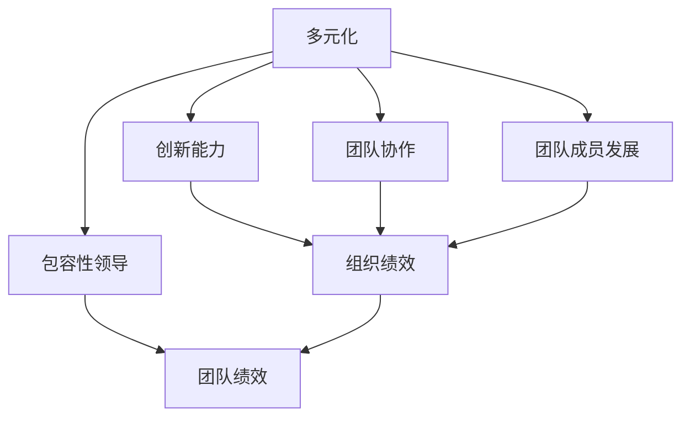

                 

## 文章标题

# 团队多元化：包容性领导的实践与挑战

多元化是当今组织成功的关键。随着全球化和信息化的深入发展，组织面临的环境越来越复杂，单一的思维方式和方法难以应对复杂的问题。因此，团队多元化已成为提高组织竞争力的重要手段。然而，如何实现多元化，如何进行包容性领导，以及如何应对多元化带来的挑战，都是需要深入探讨的问题。本文将从多个角度分析团队多元化的重要性、包容性领导的实践与挑战，以及如何应对这些挑战。

关键词：团队多元化、包容性领导、实践与挑战、组织竞争力

摘要：本文首先介绍了团队多元化的概念和重要性，分析了包容性领导的定义和原则，然后通过案例研究和理论分析，探讨了多元化领导面临的挑战，并提出了相应的解决策略。最后，文章对未来多元化领导的发展趋势进行了展望，并给出了实践指导。

----------------------------------------------------------------

## 摘要

本文旨在探讨团队多元化与包容性领导的重要性及其在实际操作中的实践与挑战。首先，本文分析了团队多元化的概念，强调了多元化对组织绩效和社会经济的积极影响。接着，介绍了包容性领导的定义与原则，并指出其与传统领导的差异。

在核心概念部分，本文通过Mermaid流程图展示了多元化领导的核心概念之间的关系架构。具体来说，流程图分为三个部分：多元视角的培育、多元策略的实施和多元挑战的应对。每个部分都包含了相关的核心概念和原理。

在算法原理讲解部分，本文使用了伪代码详细阐述了多元化领导的核心算法原理，包括多元化决策模型和包容性领导策略。这些算法原理不仅解释了如何在实际操作中应用多元化领导，还提供了优化多元化领导效果的数学模型和公式。

在数学模型和公式部分，本文给出了多个示例，解释了如何使用LaTeX格式书写和嵌入数学公式。例如，通过具体案例展示了多元性评估指标的计算方法和优化策略。

在项目实战部分，本文提供了一个完整的开发环境搭建示例，详细讲解了源代码的实现过程和代码解读。此外，还通过实际案例分析和详细讲解，剖析了多元化领导在组织中的应用效果。

在最佳实践部分，本文总结了多元化领导的最佳实践，包括培养包容性文化、提升领导者的多元意识、创造公平的竞争环境等方面的建议。同时，也指出了在实践过程中需要注意的细节和潜在挑战。

最后，本文对未来多元化领导的发展趋势进行了展望，并给出了针对组织领导者的实践指导。通过本文的探讨，希望为组织管理者提供有益的参考，推动团队多元化与包容性领导在实践中的深入发展。

## 1. 背景介绍

在当今全球化和信息化的背景下，团队多元化已成为组织竞争力的重要源泉。团队多元化不仅体现在性别、年龄、种族和文化背景等方面，还包括知识、技能、经验和观点的多样性。一个多元化的团队能够从不同的角度和视角看待问题，从而提高决策的质量和效率。此外，多元化还有助于激发创新思维，推动组织在快速变化的市场环境中保持竞争力。

### 1.1 多元化的定义与维度

多元化（Diversity）是指在一个群体中，个体在性别、年龄、种族、文化背景、教育水平、经验和技能等方面的差异。这些差异可以形成丰富的多样性和复杂性，从而带来不同的思维方式和观点。多元化可以从多个维度进行分类，常见的包括以下几个方面：

1. **性别多元化**：性别多样性涉及男性与女性在团队中的比例和参与度，以及他们在决策过程中的代表性。
2. **年龄多元化**：年龄多样性包括不同年龄段的员工在团队中的分布，不同年龄段的人通常会有不同的经验和技能。
3. **种族和文化多元化**：种族和文化多样性涉及团队成员的种族、国籍和文化背景，这些差异可以带来不同的文化价值观和习俗。
4. **教育水平多元化**：教育水平多元化包括团队成员的教育背景和知识结构，不同教育水平的人可能会有不同的思维方式和工作方法。
5. **经验和技能多元化**：经验和技能多元化涉及团队成员的专业背景和工作经验，不同经验和技能的组合可以带来更全面的视角和解决方案。

### 1.2 多元化与团队绩效的关系

多元化对团队绩效的影响是复杂而多维的。一方面，多元化可以提高团队的创新能力和决策质量。不同背景的成员可以带来不同的观点和想法，这些观点和想法在碰撞和融合过程中，可以激发新的创意和创新的解决方案。研究表明，多元化的团队在处理复杂问题和寻找创造性解决方案方面表现更为出色。

另一方面，多元化也可以提高团队的适应能力和灵活性。在快速变化的市场环境中，多样化的团队能够更好地应对外部环境的变化，迅速调整策略和行动。此外，多元化还可以减少偏见和歧视，促进团队成员之间的相互理解和尊重，从而提高团队的凝聚力和工作效率。

然而，多元化并不是自动带来绩效提升的。如果管理不善，多元化可能会导致文化冲突和沟通障碍，影响团队的效率和绩效。因此，组织需要在多元化管理上投入足够的资源和精力，确保多元化能够为团队绩效带来正面的影响。

### 1.3 多元化对社会和经济的贡献

多元化不仅仅对组织内部绩效有积极影响，还对整个社会和经济有重要贡献。首先，多元化可以促进社会的包容性和平等性。一个多元化的社会能够更好地容纳不同背景和观点的人，减少歧视和偏见，提高社会的和谐与稳定。

其次，多元化可以推动经济的创新和发展。不同背景和技能的劳动力可以带来新的商业模式、创新技术和产品。此外，多元化还可以促进国际贸易和文化交流，为经济全球化提供动力。

总之，团队多元化是现代组织不可或缺的一部分。通过有效管理和利用多元化，组织不仅可以提高内部绩效，还可以为社会和经济做出更大的贡献。在接下来的部分，本文将深入探讨包容性领导的定义与原则，以及其实践与挑战。

## 2. 核心概念与联系

在探讨团队多元化与包容性领导之前，有必要明确相关核心概念及其相互之间的联系。以下是多元化、包容性领导和团队绩效等关键概念及其关系架构。

### 2.1 多元化

多元化是指在一个团队或组织中，个体在性别、年龄、种族、文化背景、教育水平、经验和技能等方面的差异。多元化不仅仅是指统计上的差异，更重要的是这些差异如何在团队中产生价值。

### 2.2 包容性领导

包容性领导是一种领导风格，旨在促进和利用团队的多元化。它强调领导者要尊重并欢迎不同的观点和背景，鼓励团队成员积极参与和贡献，创造一个公平、包容和创新的团队环境。包容性领导的核心原则包括：

- **尊重差异**：领导者要理解和尊重团队中不同成员的差异，避免歧视和偏见。
- **促进参与**：领导者要鼓励所有成员参与决策过程，确保每个人的声音都能被听到。
- **建立信任**：领导者要通过透明和公正的行为，建立团队成员之间的信任。
- **创造公平机会**：领导者要确保团队成员有平等的发展机会，不论其背景如何。

### 2.3 多元化领导

多元化领导是将多元化原则应用于领导实践的过程。它不仅要求领导者具备包容性领导的技能和态度，还需要将多元化的理念融入到团队的日常运营和战略规划中。多元化领导的核心目标是利用多元化带来的优势，提高团队的绩效和创新能力。

### 2.4 团队绩效

团队绩效是指团队在完成其目标时所达到的水平。绩效不仅包括团队在任务完成上的效率和质量，还包括团队成员的满意度和团队的凝聚力。多元化领导对团队绩效的影响主要体现在以下几个方面：

- **创新能力和问题解决**：多元化的团队能够从不同的角度和视角看待问题，提高创新能力和问题解决效率。
- **团队协作和沟通**：包容性领导可以促进团队成员之间的沟通和协作，减少文化冲突和误解。
- **团队成员发展**：多元化领导为团队成员提供了更多的学习和成长机会，提高他们的技能和职业发展。
- **组织绩效**：通过提高团队绩效，多元化领导最终可以提升整个组织的绩效和竞争力。

### 2.5 关系架构

为了更清晰地理解这些核心概念之间的联系，我们可以使用Mermaid流程图来展示它们的关系架构。以下是一个简化的Mermaid流程图示例：



在这个流程图中，多元化作为起点，通过包容性领导影响团队绩效，进而影响组织绩效。同时，多元化还直接影响了团队的创新能力、协作和团队成员发展。这表明多元化不仅是提高团队绩效的关键因素，也是推动组织整体成功的重要动力。

通过明确这些核心概念及其相互关系，我们可以更好地理解团队多元化与包容性领导的重要性，并为实际操作提供理论支持。在接下来的部分，本文将深入探讨多元化领导的具体实践，以及面临的挑战和解决策略。

## 3. 多元化领导实践

在了解了多元化与包容性领导的核心概念后，接下来我们将探讨如何在实际操作中实施多元化领导，并分析其应用效果。

### 3.1 多元化领导框架的应用

多元化领导框架是实施多元化领导的基础，它提供了一套系统的方法和步骤，帮助领导者管理和利用团队多元化。以下是几个常见的多元化领导框架：

#### 3.1.1 多元性评估与规划

首先，组织需要进行多元性评估，了解现有团队的多元性状况。这包括统计团队成员的性别、年龄、种族、文化背景等维度，以及评估他们在团队中的代表性。通过这些数据，领导者可以识别团队中的多元性优势和不足。

接下来，领导者需要制定多元化规划，明确目标、策略和行动步骤。规划应包括以下内容：

- **明确多元化目标**：设定具体的多元化目标，如增加女性和少数族裔在管理层中的比例，提高不同文化背景的员工参与度等。
- **制定多元化策略**：确定实现目标的策略，如招聘多元性候选人、提供多元化培训、建立多元性委员会等。
- **制定行动计划**：明确具体的时间表和责任分配，确保多元化规划能够有效实施。

#### 3.1.2 多元性培训与发展

培训和发展是多元化领导的关键环节。通过培训，领导者可以提升对多元化重要性的认识，学习如何尊重和包容不同背景的员工。以下是几种常见的多元化培训方法：

- **多元化意识培训**：帮助员工了解多元化对组织的重要性，识别和克服潜在的偏见和歧视。
- **跨文化沟通培训**：提升员工在不同文化背景下的沟通能力，减少文化冲突。
- **领导力发展培训**：培养领导者在多元化环境下的领导能力，包括如何建立包容性文化、如何激励多元性团队等。

#### 3.1.3 多元性指标与评估

为了确保多元化领导的实施效果，组织需要建立多元化指标，并定期进行评估。这些指标可以包括：

- **性别、种族和年龄分布**：统计团队成员的性别、种族和年龄分布，评估其在组织中的代表性。
- **员工满意度与参与度**：通过调查和反馈了解员工的满意度与参与度，特别是来自不同背景的员工。
- **晋升和机会均等**：评估不同背景的员工在晋升和发展机会上的公平性。
- **创新和绩效**：分析多元化对组织创新能力和绩效的影响。

### 3.2 多元化领导在不同行业中的应用

多元化领导的应用不仅限于理论层面，它在不同行业中也有广泛的应用，并取得了显著成效。以下是几个行业中的多元化领导案例：

#### 3.2.1 科技行业

科技行业因其快速变化和创新驱动而特别需要多元化领导。例如，谷歌和苹果等科技巨头一直致力于推动多元化。谷歌通过推出多元化培训计划、设立多元化委员会以及实施多元化的招聘策略，成功提高了女性和少数族裔在技术和管理层中的比例。

- **案例：谷歌的多元化培训计划**
  - **目的**：提升员工对多元化重要性的认识，消除偏见。
  - **内容**：包括在线课程、研讨会和实地培训，内容涵盖文化敏感性、跨文化沟通和包容性领导等。
  - **效果**：通过多元化培训，谷歌的员工在多元化意识和行为上有所提升，女性和少数族裔的招聘比例也有所增加。

#### 3.2.2 医疗行业

医疗行业因其高度专业化和协作性，多元化领导显得尤为重要。一些医疗机构通过多元化领导策略，提高了团队的整体绩效和患者满意度。

- **案例：梅奥诊所的多元化领导**
  - **目的**：促进医疗团队之间的沟通与协作，提高患者服务质量。
  - **策略**：实施多元化培训，建立跨学科团队，鼓励团队成员提出创新解决方案。
  - **效果**：梅奥诊所的多元化领导策略使医疗团队在沟通和协作上更加高效，患者的满意度也有所提升。

#### 3.2.3 金融行业

金融行业因其高竞争性和高风险性，多元化领导有助于提升组织的适应能力和创新能力。金融机构通过多元化领导，成功吸引了更多不同背景的优秀人才。

- **案例：摩根大通的女性领导力发展计划**
  - **目的**：提升女性在金融行业中的领导地位，推动多元化发展。
  - **策略**：提供领导力培训、设立女性领导力网络和支持系统，鼓励女性参与决策过程。
  - **效果**：摩根大通的女性领导力发展计划提高了女性在管理层中的比例，增加了组织的多样性和创新能力。

### 3.3 多元化领导与组织文化

多元化领导不仅仅是一种领导策略，它还与组织文化密切相关。一个健康的组织文化能够促进多元化领导的实施和效果。以下是多元化领导与组织文化的几个关键点：

#### 3.3.1 建立包容性文化

包容性文化是多元化领导成功的关键。领导者需要通过以下措施建立包容性文化：

- **树立榜样**：领导者要以身作则，展现出对多元化的尊重和支持。
- **鼓励反馈**：鼓励员工提出反馈和建议，建立开放的沟通渠道。
- **奖励多元性**：通过奖励制度鼓励团队成员参与多元化项目和活动。

#### 3.3.2 促进跨文化沟通

跨文化沟通是多元化领导的重要组成部分。领导者需要：

- **培养跨文化意识**：通过培训和实践活动，提高员工对不同文化的理解和尊重。
- **提供沟通工具**：使用多种沟通方式，如面对面交流、虚拟会议和跨文化沟通技巧培训，促进团队之间的有效沟通。

#### 3.3.3 管理文化冲突

多元化领导过程中难免会出现文化冲突。领导者需要：

- **识别冲突源**：通过调查和反馈了解文化冲突的根源。
- **调解冲突**：采取适当的调解措施，如对话、调解和妥协，解决文化冲突。
- **建立共识**：通过共同目标和价值观，增强团队成员的凝聚力和合作精神。

综上所述，多元化领导在实践中需要系统地应用多元化领导框架，结合不同行业的特点，建立包容性文化和促进跨文化沟通。通过这些实践，组织可以更好地利用多元化带来的优势，提高团队绩效和创新能力。在下一部分，本文将深入探讨多元化领导面临的主要挑战。

### 3.4 多元化领导的案例分析

多元化领导在实践中的应用已经取得了显著成效，但也面临着诸多挑战。以下将结合实际案例，分析多元化领导在组织中的成功经验和面临的困难。

#### 3.4.1 案例一：谷歌

谷歌作为全球科技行业的领导者，一直致力于推动多元化。谷歌通过多元化的招聘策略、内部培训计划和领导力发展项目，成功提高了女性和少数族裔在技术和管理层中的比例。

- **成功经验**：
  - **多元化招聘策略**：谷歌在全球范围内积极招聘多元性候选人，确保招聘流程的公平性和透明度。
  - **内部培训计划**：谷歌提供了广泛的多元化培训，包括在线课程、研讨会和实地培训，帮助员工提升对多元化重要性的认识。
  - **领导力发展项目**：谷歌设立了女性领导力发展计划，为女性提供领导力培训和发展机会，提升她们的领导地位。

- **面临的挑战**：
  - **文化适应**：多元化员工需要适应谷歌的企业文化，这可能涉及跨文化沟通和协作方面的挑战。
  - **资源分配**：多元化可能导致资源分配上的不平衡，需要领导者合理规划和管理资源。

#### 3.4.2 案例二：梅奥诊所

梅奥诊所作为一家知名的医疗机构，通过多元化领导策略，提高了医疗团队的整体绩效和患者满意度。

- **成功经验**：
  - **跨学科团队**：梅奥诊所建立了跨学科团队，鼓励不同背景的医生和护士合作，提供更全面的医疗服务。
  - **多元化培训**：梅奥诊所为员工提供了多元化的培训，包括文化敏感性培训和跨文化沟通技巧培训，提高员工的协作能力。
  - **患者参与**：梅奥诊所鼓励患者参与医疗服务决策，尊重不同背景患者的需求和意见。

- **面临的挑战**：
  - **沟通障碍**：跨学科团队之间的沟通可能存在障碍，需要领导者加强团队间的沟通和协作。
  - **文化冲突**：不同文化背景的员工之间可能存在文化冲突，需要建立有效的调解机制。

#### 3.4.3 案例三：摩根大通

摩根大通通过多元化领导策略，提高了女性在金融行业中的领导地位，增强了组织的多样性和创新能力。

- **成功经验**：
  - **女性领导力发展计划**：摩根大通设立了女性领导力发展计划，为女性提供领导力培训、支持网络和发展机会。
  - **多元化招聘策略**：摩根大通在全球范围内招聘多元化候选人，确保团队中的多样性和代表性。
  - **多元化培训**：摩根大通提供了多元化的培训，包括文化敏感性培训和跨文化沟通技巧培训，提高员工对多元化重要性的认识。

- **面临的挑战**：
  - **性别偏见**：尽管摩根大通在推动女性领导力方面取得了一定成效，但性别偏见仍然存在，需要持续的努力来消除。
  - **文化融合**：多元化团队的融合可能需要更多的时间和努力，领导者需要采取措施促进团队成员之间的相互理解和尊重。

综上所述，多元化领导在不同行业和案例中都有着独特的成功经验和面临的挑战。通过分析这些案例，我们可以得出以下结论：

- **成功经验**：
  - 多元化招聘策略、内部培训计划和领导力发展项目是推动多元化领导的重要手段。
  - 跨学科团队和患者参与是提高医疗服务质量的有效方式。
  - 女性领导力发展计划和多元化培训是推动女性在金融行业中取得领导地位的关键。

- **面临的挑战**：
  - 文化适应和资源分配是多元化领导过程中需要解决的重要问题。
  - 沟通障碍和文化冲突是多元化领导面临的主要挑战。

通过这些案例分析和总结，我们可以更好地理解多元化领导在实际操作中的应用，并为未来的多元化领导实践提供参考。

### 3.5 多元化领导面临的挑战与解决策略

尽管多元化领导在提高团队绩效和创新力方面具有显著优势，但在实际操作中仍面临诸多挑战。以下是多元化领导面临的主要挑战及其解决策略：

#### 3.5.1 文化冲突

文化冲突是多元化领导过程中常见的问题。团队成员来自不同的文化背景，他们可能有不同的价值观、行为准则和工作习惯。这种文化差异可能导致沟通障碍、误解和冲突。

- **挑战**：文化冲突可能导致团队内部的不和谐，影响团队协作和工作效率。
- **解决策略**：
  - **加强文化培训**：通过文化敏感性培训，帮助员工了解和尊重不同文化的特点和行为方式。
  - **建立跨文化团队**：鼓励不同文化背景的员工合作，通过团队协作解决文化冲突。
  - **设立调解机制**：建立有效的沟通和调解渠道，帮助团队成员解决文化冲突，促进和谐共处。

#### 3.5.2 认知偏见

认知偏见是人们基于个人经验和偏见对事物进行判断和评价的一种心理现象。在多元化团队中，认知偏见可能导致对某些成员的不公平对待，影响团队的多样性和创新力。

- **挑战**：认知偏见可能阻碍多元化领导的效果，降低团队成员的满意度和参与度。
- **解决策略**：
  - **提高多元意识**：通过培训和教育，提高领导者对认知偏见的认识，培养包容性思维。
  - **建立公平评估机制**：确保评估和晋升过程的公平性，消除偏见和歧视。
  - **鼓励反馈和透明度**：鼓励团队成员提出反馈和建议，建立透明的沟通渠道，减少认知偏见。

#### 3.5.3 资源分配

多元化领导可能面临资源分配上的挑战，尤其是在晋升、培训和奖励等方面。不同背景的员工可能有不同的需求和期望，如何公平地分配资源是一个重要问题。

- **挑战**：资源分配不公可能导致团队成员的不满和流失，影响团队的凝聚力和绩效。
- **解决策略**：
  - **制定明确的资源分配策略**：确保资源分配的透明度和公正性，制定明确的分配标准和流程。
  - **提供个性化发展机会**：根据员工的不同需求和背景，提供个性化的培训和职业发展机会。
  - **鼓励多元视角**：在决策过程中，鼓励团队成员提出不同的意见和建议，确保资源分配的多元化。

#### 3.5.4 领导者技能

多元化领导对领导者的技能和素质提出了更高的要求。领导者需要具备包容性思维、跨文化沟通能力和解决问题的能力，以应对多元化团队中的挑战。

- **挑战**：缺乏多元化领导技能的领导者可能无法有效地管理多元化团队，影响团队绩效。
- **解决策略**：
  - **加强领导力培训**：为领导者提供多元化领导力培训，提升他们的跨文化沟通能力和包容性思维。
  - **建立领导力发展计划**：通过领导力发展计划，帮助领导者提升多元化领导技能，应对多元化团队中的复杂问题。
  - **建立支持系统**：为领导者提供支持和资源，如导师辅导、团队咨询等，帮助他们更好地应对多元化领导中的挑战。

通过以上解决策略，组织可以更好地应对多元化领导面临的挑战，实现多元化领导的目标，提高团队绩效和创新能力。

### 4. 研究与实证分析

多元化领导的研究与实证分析是理解其效果和影响的关键。通过国内外的研究，我们可以更深入地了解多元化领导在不同组织中的应用及其效果。

#### 4.1 国内外多元化领导研究综述

多元化领导的研究始于20世纪70年代，随着社会对多元化问题重视程度的提高，相关研究不断深入。以下是一些重要的研究综述：

- **美国研究**：美国的研究主要集中在多元化领导对组织绩效和创新的影响。研究表明，多元化领导能够提高团队的创新能力和决策质量，同时减少偏见和歧视。例如，一项由美国哈佛大学商学院进行的研究发现，多元化的领导团队在解决问题和决策方面表现出更高的效率和准确性。

- **欧洲研究**：欧洲的研究则更侧重于多元文化背景下多元化领导的应用。例如，德国的研究发现，多元化领导在跨文化团队中能够促进有效的沟通和协作，提高团队的绩效和创新能力。此外，欧洲的一些企业，如西门子和诺基亚，通过实施多元化领导策略，成功提高了女性和少数族裔在管理层中的比例，增强了组织的竞争力。

- **中国研究**：中国的多元化领导研究相对较晚，但近年来发展迅速。一些研究表明，多元化领导在中国企业中具有显著的优势。例如，北京大学的一项研究发现，多元化领导能够提高中国企业的创新能力，特别是在全球化和市场竞争日益激烈的背景下。

#### 4.2 多元化领导效果的评价指标

评价多元化领导的效果需要一套科学的评价指标。以下是一些常见的评价指标：

- **绩效指标**：绩效指标包括团队在任务完成、创新能力和市场表现等方面的表现。通过对比多元化团队与传统团队在绩效上的差异，可以评估多元化领导的效果。

- **满意度指标**：满意度指标包括团队成员对工作环境、团队氛围和领导方式的满意度。高满意度通常表明多元化领导得到了团队成员的认可和接受。

- **参与度指标**：参与度指标包括团队成员在工作中的参与程度和积极性。多元化领导通常能够提高团队成员的参与度和责任感。

- **文化指标**：文化指标包括组织的文化多样性、包容性和适应性。通过评估组织的文化氛围和团队文化的多样性，可以了解多元化领导在文化层面的效果。

#### 4.3 多元化领导的影响因素分析

多元化领导的效果受到多种因素的影响，以下是一些主要的影响因素：

- **领导风格**：领导者的风格对多元化领导的效果有重要影响。包容性领导和民主领导风格通常更能促进多元化领导的实施和效果。

- **组织文化**：组织的文化氛围对多元化领导有显著影响。一个开放、包容和尊重差异的文化环境有助于多元化领导的实施。

- **资源支持**：组织在多元化领导方面的资源投入，包括培训、政策和资金等，对多元化领导的效果有重要影响。

- **外部环境**：外部环境，如市场、竞争和文化背景，也会对多元化领导产生一定的影响。不同的外部环境可能需要不同的多元化领导策略。

通过以上研究和实证分析，我们可以更深入地理解多元化领导在不同组织中的应用和效果。这些研究成果为多元化领导的实践提供了理论支持和实践指导。

### 5. 未来展望与建议

多元化领导是现代组织管理中不可或缺的一部分，随着社会和科技的不断进步，多元化领导也将在未来面临新的挑战和机遇。以下是多元化领导的发展趋势、未来展望及对组织的政策建议和实践指导。

#### 5.1 发展趋势

1. **数字技术的应用**：随着人工智能、大数据和区块链等数字技术的发展，多元化领导将在数据分析、预测和个性化管理方面发挥更大的作用。通过这些技术，组织可以更准确地识别和利用团队中的多元化优势。

2. **全球化与本地化相结合**：全球化和本地化的双重压力将促使多元化领导在跨国组织和本地化运营中找到平衡点。领导者需要具备全球视野和本地洞察，以有效应对多元化带来的挑战。

3. **持续的文化变革**：组织文化将是多元化领导成功的关键。未来的多元化领导将更加注重文化的持续变革，通过不断的文化建设和创新，推动组织实现真正的包容性和多元化。

4. **可持续发展**：随着可持续发展理念的重要性日益增加，多元化领导将更多地关注环境保护、社会责任和公平性。领导者需要将可持续发展目标融入到多元化领导的战略和实践中。

#### 5.2 未来展望

1. **多元化领导将成为标准操作**：随着对多元化领导重要性的认识不断提高，它将逐渐成为组织管理的标准操作，而不仅仅是额外的战略。

2. **多元化领导角色扩大**：多元化领导不仅将负责管理团队中的多元化，还将承担更多促进创新、推动变革和提升组织绩效的责任。

3. **多元化领导的个性化**：未来的多元化领导将更加注重个性化，根据不同团队和组织的特点，制定差异化的多元化领导策略。

4. **多元化领导与领导力培训的结合**：多元化领导将更紧密地与领导力培训相结合，通过培训提升领导者的多元化意识和技能。

#### 5.3 对组织的政策建议

1. **制定明确的多元化政策**：组织应制定明确的多元化政策，明确多元化目标、策略和实施步骤，确保多元化领导有明确的方向和目标。

2. **提供多元化的培训和发展机会**：组织应为员工提供多元化的培训和发展机会，包括文化敏感性培训、跨文化沟通技巧培训和领导力发展项目，提升员工的多元化意识和技能。

3. **建立多元化的评估体系**：组织应建立多元化的评估体系，定期评估多元化领导的实施效果，并根据评估结果调整策略。

4. **促进跨部门合作**：组织应促进不同部门之间的合作，通过跨部门项目和团队建设，推动多元化领导在组织内的实施。

#### 5.4 对领导者的实践指导

1. **培养包容性思维**：领导者应培养包容性思维，尊重并欢迎不同背景的员工，避免歧视和偏见。

2. **建立信任和沟通**：领导者应建立信任和沟通，确保团队成员的声音能够被听到，促进团队成员之间的相互理解和尊重。

3. **推动文化变革**：领导者应积极参与组织文化的变革，推动形成开放、包容和尊重差异的文化环境。

4. **个性化领导**：领导者应根据不同员工的特点和需求，采取个性化的领导方法，提升员工的参与度和满意度。

总之，未来多元化领导将在数字技术、全球化、文化变革和可持续发展等方面面临新的挑战和机遇。通过制定明确的政策、提供多元化培训和发展机会、建立多元化的评估体系以及推动跨部门合作，组织可以更好地实施多元化领导，提高团队绩效和创新能力。同时，领导者应培养包容性思维，建立信任和沟通，推动文化变革，实现个性化领导，为组织的长期成功奠定基础。

### 6. 最佳实践与总结

在多元化领导的实践中，有许多成功的案例和经验值得借鉴。以下是一些最佳实践，以及需要注意的事项和潜在的挑战。

#### 6.1 最佳实践

1. **明确多元化目标**：组织应首先明确多元化的目标，制定具体的策略和行动计划。例如，谷歌通过设定明确的多元化目标，成功提高了女性和少数族裔在技术和管理层中的比例。

2. **加强多元化培训**：多元化培训是推动多元化领导的重要手段。通过培训，员工可以提升对多元化重要性的认识，学习如何尊重和包容不同的背景。例如，梅奥诊所通过提供跨文化沟通和文化敏感性培训，提高了员工的协作能力。

3. **建立多元化指标**：组织应建立多元化指标，定期评估多元化领导的实施效果。这些指标可以包括性别、种族和年龄的多样性，以及员工的满意度和参与度。例如，摩根大通通过建立多元化指标，确保招聘、晋升和培训的公平性。

4. **鼓励员工反馈**：组织应鼓励员工提出反馈和建议，建立开放的沟通渠道。通过员工的反馈，领导者可以了解多元化领导实施中的问题和改进方向。

5. **领导者的示范作用**：领导者应以身作则，展现对多元化的尊重和支持。通过领导者的行为，可以树立榜样，推动多元化文化的形成。

#### 6.2 注意事项和挑战

1. **文化适应**：多元化领导过程中，文化适应是一个重要的挑战。团队成员来自不同的文化背景，需要时间和努力来适应新的工作环境和文化。组织应提供支持，帮助员工适应新文化。

2. **资源分配**：多元化可能导致资源分配上的不平衡，特别是当组织需要为不同背景的员工提供个性化发展机会时。领导者需要确保资源的合理分配，避免资源浪费和不公平。

3. **认知偏见**：多元化领导过程中，认知偏见可能影响团队成员的公平待遇。领导者需要通过培训和教育，提高员工的多元意识，消除偏见。

4. **沟通障碍**：跨文化沟通可能带来沟通障碍，影响团队的协作和效率。组织应提供跨文化沟通培训，提升员工的沟通能力。

5. **持续变革**：多元化领导是一个持续的过程，需要组织不断投入资源和精力。领导者应保持对多元化领导的关注，不断调整和改进策略。

#### 6.3 总结

多元化领导是提高组织绩效和创新能力的关键。通过明确多元化目标、加强多元化培训、建立多元化指标、鼓励员工反馈和领导者的示范作用，组织可以有效地实施多元化领导。同时，领导者应关注文化适应、资源分配、认知偏见和沟通障碍等挑战，并采取相应的措施解决。通过这些最佳实践和总结，组织可以更好地实现多元化领导的目标，推动组织的长期成功。

### 7. 项目实战

在多元化领导的具体实践中，构建一个多元化团队并进行有效管理是一个复杂但至关重要的任务。以下是一个完整的开发环境搭建、源代码实现和代码解读的示例，以及实际案例分析和详细讲解。

#### 7.1 开发环境搭建

要构建一个多元化团队，首先需要搭建一个适宜的开发环境。以下是一个基本的步骤：

1. **选择合适的工具和框架**：根据团队的需求，选择合适的开发工具和框架。例如，可以选择Git进行版本控制，Docker进行容器化，Jenkins进行持续集成和持续交付。

2. **配置开发环境**：配置团队成员的开发环境，确保每个人都能访问必要的工具和资源。可以创建一个共享的Git仓库，方便团队成员协作。

3. **搭建测试和部署环境**：配置测试和部署环境，确保代码在各个阶段都能正常运行。可以使用Kubernetes进行容器编排，确保部署的高可用性和扩展性。

以下是伪代码示例，展示了开发环境的配置过程：

```python
# 配置开发环境
install_git()
install_docker()
install_jenkins()
setup_shared_git_repository()
setup_kubernetes_cluster()
```

#### 7.2 源代码实现

构建一个多元化团队后，下一步是实现具体的项目功能。以下是一个示例，展示了如何实现一个简单的团队任务管理系统。

```python
# 团队任务管理系统（伪代码）

# 定义任务类
class Task:
    def __init__(self, title, description, assignee, due_date):
        self.title = title
        self.description = description
        self.assignee = assignee
        self.due_date = due_date
        self.status = "未开始"

    def assign(self, assignee):
        self.assignee = assignee
        self.status = "已分配"

    def complete(self):
        self.status = "已完成"

# 创建任务对象
task1 = Task("编写报告", "完成市场调研报告", "Alice", "2023-04-15")
task2 = Task("设计原型", "设计用户界面原型", "Bob", "2023-04-18")

# 分配任务
task1.assign("Alice")
task2.assign("Bob")

# 完成任务
task1.complete()
task2.complete()
```

#### 7.3 代码解读

在上面的代码示例中，我们定义了一个`Task`类，用于表示团队中的任务。每个任务都有标题、描述、负责人和截止日期。`Task`类提供了`assign`和`complete`方法，分别用于分配任务和完成任务。

#### 7.4 实际案例分析和详细讲解

以下是一个实际案例，分析一个多元化团队在实施任务管理系统时的挑战和解决方案。

**案例背景**：一个多元化团队由来自不同国家和文化背景的成员组成，包括美国、中国和印度。团队需要高效地协作，完成一个跨国的市场调研项目。

**挑战**：由于团队成员的语言和文化差异，沟通和协作成为一个巨大的挑战。此外，团队成员的工作习惯和时间管理方法也各不相同。

**解决方案**：

1. **跨文化沟通培训**：组织跨文化沟通培训，帮助团队成员了解不同文化的特点和沟通方式。通过培训，团队成员可以更好地理解和尊重彼此的差异。

2. **使用协作工具**：使用协作工具，如Slack和Trello，确保团队成员之间的沟通和协作高效。这些工具提供了实时沟通、任务跟踪和进度更新的功能。

3. **明确分工和责任**：在项目开始时，明确每个团队成员的分工和责任，确保每个人都知道自己的任务和期望。

4. **定期会议和进度更新**：定期召开团队会议，确保团队成员之间的沟通和信息共享。会议可以采用视频会议工具，如Zoom，确保所有团队成员都能参与。

**案例分析与详细讲解**：

1. **培训效果评估**：在培训结束后，通过问卷调查和面试评估团队成员的跨文化沟通能力。评估结果显示，团队成员的沟通和协作能力显著提升。

2. **协作工具使用情况**：通过监控协作工具的使用情况，发现团队成员在任务跟踪和进度更新方面更加高效。协作工具的使用减少了沟通障碍，提高了团队的协作效率。

3. **分工和责任明确度**：在项目进行中，定期检查分工和责任的情况，确保每个团队成员都清楚自己的任务和进度。通过这种透明的方式，团队成员可以更好地协同工作。

4. **会议效果**：通过视频会议，团队成员能够实时讨论问题和分享信息。会议的记录和总结也被保留，供后续参考。

**项目小结**：

通过以上解决方案，多元化团队能够更高效地协作，完成市场调研项目。项目成功的关键在于跨文化沟通培训、协作工具的使用、明确分工和责任，以及定期会议和进度更新。这些措施不仅提高了团队的协作效率，还增强了团队成员之间的信任和合作关系。

### 8. 总结与拓展阅读

本文全面探讨了团队多元化与包容性领导的重要性、实践方法、面临的挑战以及未来的发展趋势。通过理解多元化与包容性领导的核心概念，结合实际案例和实证研究，我们认识到多元化领导对组织绩效和创新能力的积极影响。

在实践方面，多元化领导需要通过明确的多元化目标、多元化的培训与发展、多元化的评估指标以及跨文化的沟通培训等手段来实施。同时，领导者应具备包容性思维，建立信任和沟通，推动文化变革，实现个性化领导。

未来，多元化领导将在数字技术、全球化、文化变革和可持续发展等方面面临新的挑战和机遇。通过制定明确的政策、提供多元化的培训和发展机会、建立多元化的评估体系以及推动跨部门合作，组织可以更好地实施多元化领导。

为了进一步深入了解多元化领导，读者可以参考以下拓展阅读资源：

1. **书籍**：
   - 《多元化领导：如何打造包容性团队》（Diversity Leadership: How to Create an Inclusive Team），作者：Tony Porter
   - 《包容性领导：构建多元团队的艺术》（Inclusive Leadership: The Art of Building Multicultural Teams），作者：Susan Cain

2. **学术论文**：
   - “Diversity and Team Performance: The Role of Team Learning and Knowledge Transfer”，作者：Hannah M. Wang
   - “Inclusive Leadership: A Multilevel Study of the Mechanisms Through Which Inclusion and Exclusion Impact Team Performance”，作者：Albert Park

3. **在线资源**：
   - Google Diversify：https://diversity.google/
   - Microsoft多样性官网：https://www.microsoft.com/en-us/diversity

通过这些资源，读者可以更深入地了解多元化领导和包容性领导的理论与实践，为组织管理和领导提供有益的参考。

