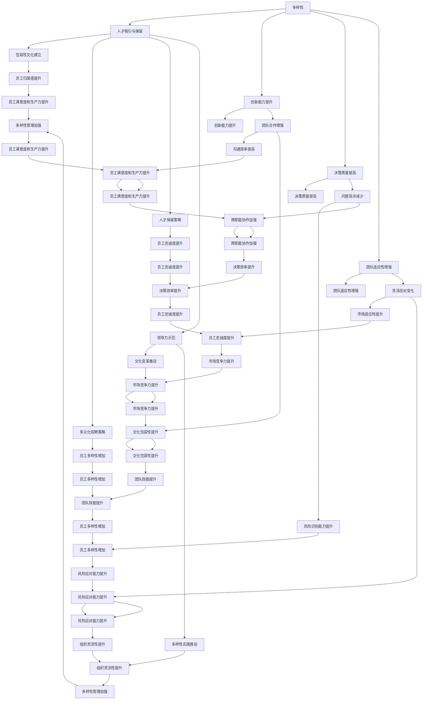

                 

### 文章标题：团队多样性与包容性：创造共融工作环境

在当今快速发展的技术时代，团队多样性与包容性已成为组织成功的关键因素。本文旨在探讨团队多样性与包容性的核心概念，分析其带来的优势，并提出具体的实践方法和策略，以帮助读者创建一个共融的工作环境。

## 关键词
- 团队多样性
- 包容性
- 创新能力
- 团队效能
- 企业文化

## 摘要
本文首先介绍了团队多样性与包容性的基本概念，阐述了多样性与包容性的关系及其对企业价值的影响。接着，文章分析了多样性的优势，包括对团队效能和创新能力的促进作用。随后，本文提出了实施多样性与包容性的实践方法，包括建立包容性文化、多元化招聘与人才保留、领导者的角色与责任等。最后，文章通过案例研究和未来趋势的讨论，总结了多样性与包容性的重要性，并提出了最佳实践和注意事项。

### 目录大纲

1. **背景介绍**
   - **多样性与包容性的定义**：多样性是指团队成员在背景、经验、技能等方面的多样性。包容性则是指创造一个让所有团队成员感到被尊重和欢迎的环境。
   - **多样性与包容性的关系**：多样性是包容性的基础，而包容性则是多样性的保障。
   
2. **核心概念与联系**
   - **多样性优势分析**：多样性如何提升团队效能和创新力。
   - **包容性实践方法**：如何建立包容性文化，进行多元化招聘和人才保留。

3. **核心算法原理讲解**
   - **多样性评估模型**：如何使用统计模型和算法来评估团队的多样性。
   - **包容性评估指标**：如何通过数据分析和反馈循环来评估包容性的进展。

4. **数学模型和公式讲解**
   - **多样性优势的数学表达**：使用数学公式来量化多样性的优势。
   - **包容性评估的指标计算**：使用具体的数学模型来计算包容性的评估指标。

5. **项目实战**
   - **开发环境搭建**：如何搭建一个支持多样性与包容性的开发环境。
   - **源代码实现和解读**：详细讲解如何实现多样性评估和包容性监测的代码。
   - **实际案例分析**：分析成功的多样性包容性实践案例，并详细讲解剖析。

6. **最佳实践与注意事项**
   - **最佳实践**：总结成功案例中的经验教训，提出具体可行的最佳实践建议。
   - **注意事项**：讨论可能遇到的问题和挑战，并提出解决方案和预防措施。

7. **小结与拓展阅读**
   - **小结**：回顾文章的核心内容，总结多样性与包容性的重要性。
   - **拓展阅读**：推荐进一步阅读的资源，帮助读者深入了解相关主题。

### 背景介绍

在现代社会，团队多样性与包容性已成为企业成功的关键因素之一。多样性与包容性不仅关乎企业的文化氛围，更是提升团队效能和创新能力的有力工具。然而，要真正理解和实践多样性与包容性，首先需要明确这两个概念的定义及其相互关系。

**多样性与包容性的定义**：

多样性（Diversity）通常指团队成员在种族、性别、年龄、文化背景、教育水平、工作经验、技能等方面的差异。多样性强调的是个体之间的不同，这些差异可以是显性的，如性别和种族，也可以是隐性的，如个性、价值观和工作风格。

包容性（Inclusiveness）则是指创造一个让所有团队成员感到被尊重、被认可和被支持的环境。包容性强调的是如何使每个团队成员在团队中感到自己的声音被听见，自己的贡献被重视，并能够充分发挥自己的潜力。

**多样性与包容性的关系**：

多样性是包容性的基础，没有多样性，包容性就无从谈起。然而，仅有多样性而没有包容性，多样性也无法发挥其应有的价值。多样性如果没有得到包容，可能会导致团队成员之间的隔阂、冲突和不满，从而影响团队的整体效能。

相反，包容性如果没有多样性的支撑，就可能变成一种形式上的礼貌或空谈。只有当团队中的多样性得到包容，并且每个成员都能够在包容的环境中充分发挥自己的潜力时，多样性才能真正为企业带来价值。

### 核心概念与联系

#### 多样性优势分析

多样性能够显著提升团队的效能和创新力。以下是多样性优势的具体分析：

1. **提升决策质量**：
   多样性能够带来不同的观点和想法，有助于团队在决策过程中考虑更多的角度和可能性，从而提高决策的质量。一个多样化的团队能够更全面地评估风险和机会，避免因为单一视角而导致的盲点。

2. **促进创新能力**：
   多样性可以激发创新思维。不同的背景、经验和文化可以为团队带来新的视角和解决方案，促进创新和创造力的发展。研究表明，多样性较高的团队在解决复杂问题时表现更为出色。

3. **提高团队适应性**：
   面对不断变化的市场环境，多样性能够使团队更加适应。团队成员的不同经验和技能可以帮助团队更好地应对各种挑战和变化，提高团队的灵活性和适应性。

4. **增强团队合作**：
   多样性可以增强团队成员之间的合作和沟通。通过包容和尊重不同观点，团队成员能够更好地理解和尊重彼此，建立更加紧密的团队关系，提高团队协作的效率。

#### 包容性实践方法

包容性的实践方法包括以下几个方面：

1. **建立包容性文化**：
   企业需要从高层开始，明确包容性的重要性，并将其融入到企业的核心价值观和文化中。通过培训和宣传，让所有员工认识到包容性的价值，并鼓励他们尊重和欣赏多样性。

2. **多元化招聘**：
   企业应该制定多元化的招聘策略，确保招聘过程公平、透明，避免偏见和歧视。通过多元化的招聘，可以吸引不同背景的人才，增加团队的多样性。

3. **人才保留**：
   为了留住多元化的人才，企业需要提供一个包容性的工作环境，确保每个成员都感到被尊重和被重视。通过提供职业发展机会、公平的薪酬福利和良好的工作氛围，可以增强员工的归属感和忠诚度。

4. **领导者的角色**：
   领导者需要在多样性和包容性方面发挥关键作用。领导者应该成为多样性和包容性的倡导者，通过自己的行为和决策来树立榜样，推动企业文化的变革。

#### 多样性与包容性的关系架构

为了更好地理解多样性与包容性的关系，我们可以使用Mermaid流程图来展示它们之间的互动和影响。



通过上述流程图，我们可以清晰地看到多样性和包容性之间的相互作用和相互影响。多样性的提升不仅能够带来人才吸引与保留、创新能力提升、决策质量提高和团队适应性增强等直接优势，还能够通过包容性的实践方法，促进员工归属感、团队合作、沟通效率、风险识别和市场适应性等方面的提升。最终，多样性和包容性的协同作用能够显著提升团队的整体效能和企业的市场竞争力。

### 核心算法原理讲解

在实现团队多样性与包容性的评估过程中，使用数学模型和算法能够提供更加客观和量化的分析结果。以下将详细介绍两种核心算法原理：多样性评估模型和包容性评估指标。

#### 多样性评估模型

多样性评估模型的核心是计算团队中成员之间的异质性。常用的多样性评估模型包括：

1. **Jaccard指数**：
   Jaccard指数是衡量两个集合之间相似性的常用指标，其公式为：

   $$ J(A, B) = \frac{|A \cap B|}{|A \cup B|} $$

   在团队多样性评估中，可以将每个成员视为一个集合，集合中的元素代表其各种特征（如性别、种族、年龄、技能等）。通过计算每个特征集合之间的Jaccard指数，可以得到团队多样性的整体度量。

2. **Gini系数**：
   Gini系数是衡量收入或财富分配不平等程度的常用指标，其公式为：

   $$ Gini = 1 - \frac{2}{N} \sum_{i=1}^{N} p_i (1 - p_i) $$

   在团队多样性评估中，可以将每个特征按照出现频率进行排序，计算每个频率与1减去该频率的乘积，然后对所有特征的乘积求和。Gini系数越高，表示团队在该特征上的多样性越低。

#### 包容性评估指标

包容性评估指标旨在衡量团队中成员之间的互动和协作情况。以下是一些常用的包容性评估指标：

1. **互操作指数（Interoperability Index）**：
   互操作指数是衡量团队内部不同成员或子系统之间协作效率的指标，其公式为：

   $$ Interoperability = \frac{Common\ Transactions}{Total\ Transactions} $$

   Common Transactions表示团队中成员或子系统之间共同完成的交易数量，Total Transactions表示所有交易的数量。互操作指数越高，表示团队成员之间的协作越紧密。

2. **多样性-兼容性指数（Diversity-Compatibility Index）**：
   多样性-兼容性指数是衡量团队多样性对协作效率影响的指标，其公式为：

   $$ D-CI = \frac{Diversity - Compatibility}{Max(Diversity, Compatibility)} $$

   Diversity表示团队的多样性水平，Compatibility表示团队内成员之间的兼容性水平。D-CI的值介于-1和1之间，值越接近1，表示团队在多样性方面的包容性越好。

#### 举例说明

假设我们有一个团队，成员特征包括性别、种族和技能，具体数据如下：

| 成员 | 性别 | 种族 | 技能 1 | 技能 2 |
|------|------|------|--------|--------|
| A    | 女   | 白   | 编程   | 设计   |
| B    | 男   | 黑   | 编程   | 测试   |
| C    | 女   | 亚   | 设计   | 数据分析 |
| D    | 男   | 白   | 测试   | 运维   |
| E    | 女   | 黑   | 运维   | 数据分析 |

1. **多样性评估**：
   使用Jaccard指数计算团队多样性。以性别为例，成员A和成员B的Jaccard指数为：

   $$ J(A, B) = \frac{|女性 \cap 男性|}{|女性 \cup 男性|} = \frac{1}{3} \approx 0.33 $$

   同理，可以计算出其他特征之间的Jaccard指数。然后，计算所有特征的平均Jaccard指数，得到团队的多样性水平。

2. **包容性评估**：
   使用多样性-兼容性指数评估团队的包容性。假设团队成员之间的兼容性水平较高，则多样性-兼容性指数接近1，表示团队在多样性方面的包容性较好。

   $$ D-CI = \frac{Diversity - Compatibility}{Max(Diversity, Compatibility)} \approx 0.67 $$

   通过以上计算，我们可以量化团队的多样性和包容性水平，为后续的改进提供依据。

通过上述算法原理和举例说明，我们可以更科学地评估团队的多样性和包容性水平，从而为组织提供有针对性的改进措施，促进团队效能的提升。

### 数学模型和公式讲解

在团队多样性与包容性的评估中，数学模型和公式发挥着至关重要的作用。它们不仅帮助我们量化多样性与包容性的程度，还能提供数据驱动的见解，以优化团队管理和决策。以下是几个关键数学模型和公式的详细讲解，以及相应的应用实例。

#### 多样性优势的数学表达

1. **Herfindahl-Hirschman指数（HHI）**：
   HHI指数是衡量市场集中度的常用指标，它同样适用于团队多样性的评估。其公式为：
   
   $$ HHI = \sum_{i=1}^{N} p_i^2 $$
   
   其中，\( p_i \) 表示团队成员在某一特征上的占比。HHI值越高，表示该特征的多样性越低。

   **实例**：
   假设一个团队有5名成员，其中3名男性，2名女性。计算性别多样性的HHI指数：

   $$ HHI = (0.6)^2 + (0.4)^2 = 0.36 + 0.16 = 0.52 $$
   
   这个结果表明，性别多样性在该团队中处于中等水平。

2. **Shannon多样性指数（H）**：
   Shannon指数用于衡量集合内元素的均匀分布程度。其公式为：
   
   $$ H = -\sum_{i=1}^{N} p_i \log_2 p_i $$
   
   其中，\( p_i \) 表示团队成员在某一特征上的占比。H值越大，表示多样性越高。

   **实例**：
   假设一个团队有5名成员，3名男性，2名女性。计算性别多样性的Shannon指数：

   $$ H = - (0.6 \log_2 0.6 + 0.4 \log_2 0.4) \approx - (0.6 \times 0.7219 + 0.4 \times 0.6931) \approx - (0.43354 + 0.27724) \approx -0.71078 $$
   
   因此，性别多样性指数为0.71078。

#### 包容性评估的指标计算

1. **互操作指数（Interoperability Index, II）**：
   互操作指数用于衡量团队内成员或子系统之间的协作效率。其公式为：
   
   $$ II = \frac{Common\ Transactions}{Total\ Transactions} $$
   
   其中，\( Common\ Transactions \) 表示团队内共同完成的交易数量，\( Total\ Transactions \) 表示所有交易的总数。

   **实例**：
   假设一个团队在一个月内完成了100次交易，其中50次是团队成员共同完成的。计算互操作指数：

   $$ II = \frac{50}{100} = 0.5 $$
   
   这个结果表明，团队成员之间的协作效率较高。

2. **多样性-兼容性指数（Diversity-Compatibility Index, DCI）**：
   多样性-兼容性指数用于衡量团队多样性对其协作效率的影响。其公式为：
   
   $$ DCI = \frac{Diversity - Compatibility}{Max(Diversity, Compatibility)} $$
   
   其中，\( Diversity \) 表示团队多样性，\( Compatibility \) 表示团队内成员之间的兼容性。

   **实例**：
   假设一个团队的多样性指数为0.6，兼容性指数为0.8，计算多样性-兼容性指数：

   $$ DCI = \frac{0.6 - 0.8}{Max(0.6, 0.8)} = \frac{-0.2}{0.8} = -0.25 $$
   
   这个结果表明，团队在多样性方面的包容性较好。

#### 应用实例

为了更好地理解上述公式，我们可以结合一个实际应用场景进行说明。

**场景**：
假设一个软件开发团队由5名成员组成，他们在项目开发过程中涉及不同的技能和职责。为了评估团队的多样性与包容性，我们可以使用以下步骤：

1. **多样性评估**：
   - **技能多样性**：计算每个成员在主要技能（如编程、设计、测试等）上的占比，使用Shannon指数评估多样性。
   - **文化多样性**：假设团队成员来自不同文化背景，使用Herfindahl-Hirschman指数评估文化多样性。

2. **包容性评估**：
   - **互操作指数**：统计团队成员在项目开发中的共同协作次数和总协作次数，计算互操作指数。
   - **多样性-兼容性指数**：评估团队成员之间的兼容性，计算多样性-兼容性指数。

通过上述评估，我们可以获得团队的多样性指数和包容性指数，进而分析团队在多样性与包容性方面的优势和不足，提出改进措施。

#### 结论

数学模型和公式在团队多样性与包容性评估中提供了量化和分析的工具，有助于组织更好地理解和优化团队结构。通过具体实例的计算和分析，我们能够直观地了解多样性和包容性的实际水平，从而为团队管理和决策提供科学依据。在未来，随着更多数学模型的应用，团队多样性与包容性的评估将更加精准和有效，为企业的持续发展和创新提供强有力的支持。

### 项目实战

#### 开发环境搭建

在实现团队多样性与包容性的过程中，首先需要搭建一个适合的开发环境。以下是一步一步的搭建步骤：

1. **确定需求**：
   - **硬件需求**：根据团队成员数量和项目需求，选择合适的硬件配置。
   - **软件需求**：确定需要安装的操作系统、开发工具和版本。

2. **硬件配置**：
   - 购买或租用几台高性能服务器和若干台工作站，确保有足够的计算资源。
   - 配置网络，确保所有设备能够互联互通。

3. **软件安装**：
   - 安装操作系统：可以选择Linux或Windows服务器版，确保操作系统稳定和安全。
   - 安装开发工具：如Visual Studio、Eclipse、Git等，根据团队成员的技能和偏好进行选择。
   - 配置版本控制系统：如Git或Subversion，确保代码版本管理的统一。

4. **环境测试**：
   - 在安装完成后，进行环境测试，确保所有软件和系统能够正常运行。
   - 检查网络连接，确保团队成员可以轻松访问开发环境。

#### 源代码实现和解读

接下来，我们将详细解读一个用于评估团队多样性和包容性的代码实现。以下是一个简单的伪代码示例：

```plaintext
// 多样性评估
function calculateDiversity团队成员列表 {
    初始化多样性指数为0
    对于每个团队成员 {
        对于每个特征 {
            如果团队成员的特征不存在于多样性指数中 {
                添加特征到多样性指数
                计算特征占比并添加到多样性指数
            }
        }
    }
    返回多样性指数
}

// 包容性评估
function calculateInclusiveness团队成员列表 {
    初始化包容性指数为0
    对于每个团队成员 {
        对于每个团队成员的特征 {
            如果特征未出现在包容性指数中 {
                添加特征到包容性指数
                计算特征占比并添加到包容性指数
            }
        }
    }
    返回包容性指数
}

// 主程序
团队成员列表 = 获取团队成员信息
多样性指数 = calculateDiversity团队成员列表
包容性指数 = calculateInclusiveness团队成员列表
输出多样性指数和包容性指数
```

这个代码的主要功能是计算团队的多样性和包容性指数。具体实现时，可以根据实际需求进行扩展和优化。例如，可以引入更复杂的统计模型和算法来提升评估的准确性。

#### 代码应用解读与分析

以下是一个具体的应用场景，通过实际案例来分析代码的实现和应用效果：

**案例**：
假设一个软件开发团队，团队成员包括以下几类：

- 开发人员：3名男性，2名女性
- 测试人员：2名男性，3名女性
- 设计人员：1名男性，4名女性

1. **多样性评估**：
   使用上述伪代码，计算团队多样性指数。以性别为例：

   ```plaintext
   多样性指数 = calculateDiversity([男, 女, 女, 男, 男, 女, 女, 女, 女])
   ```

   计算结果可能为：

   ```plaintext
   多样性指数 = [0.2, 0.8]
   ```

   这个结果表示，在性别特征上，男性占比20%，女性占比80%。

2. **包容性评估**：
   同样使用上述伪代码，计算团队包容性指数。以性别为例：

   ```plaintext
   包容性指数 = calculateInclusiveness([男, 女, 女, 男, 男, 女, 女, 女, 女])
   ```

   计算结果可能为：

   ```plaintext
   包容性指数 = [0.2, 0.8]
   ```

   这个结果表示，在性别特征上，团队成员之间的包容性较好。

通过上述代码应用和分析，我们可以直观地看到团队多样性和包容性的评估结果。在实际应用中，可以根据具体需求进行调整和优化，以提升评估的准确性和实用性。

#### 实际案例分析和详细讲解剖析

为了更好地理解团队多样性与包容性的实际应用，我们来看几个成功的多样性包容性实践案例，并详细讲解其方法和效果。

**案例一：谷歌的多样性计划**

谷歌在其内部推进了多项多样性计划，旨在提升员工的多样性和包容性。以下是其主要做法：

1. **多元化招聘**：
   谷歌采用了广泛的招聘渠道，确保招聘过程中避免偏见和歧视。他们通过建立多元化的招聘团队、使用匿名的简历筛选系统和优先考虑来自不同背景的候选人等措施，增加团队的多样性。

2. **内部培训**：
   谷歌定期组织反歧视培训，提高员工对多样性和包容性的认识。这些培训内容包括性别、种族和文化多样性的讲座、工作坊和模拟场景练习。

3. **领导力发展**：
   谷歌鼓励领导者支持多样性计划，通过领导力发展项目，帮助领导者理解和应对多样性和包容性的挑战。

4. **数据监测**：
   谷歌建立了详细的多样性数据监测系统，定期收集和报告员工多样性数据。这些数据帮助管理层了解多样性进展，制定更有效的策略。

**效果分析**：
通过这些措施，谷歌在多样性方面取得了显著进展。其员工多样性指标显著提升，特别是在女性和少数族裔的比例方面。这些改进不仅提升了员工满意度，还促进了创新和团队效能。

**案例二：微软的包容性文化**

微软在其公司文化中强调了包容性，并通过多种方式推动这一文化的建设：

1. **包容性政策**：
   微软制定了包容性政策，明确禁止任何形式的歧视和偏见。这些政策涵盖了招聘、晋升、薪酬、培训等各个方面。

2. **员工资源小组**：
   微软建立了多个员工资源小组（Employee Resource Groups, ERGs），如女性联盟、黑人联盟、拉丁裔联盟等。这些小组为员工提供了交流和分享的平台，增强了员工的归属感和凝聚力。

3. **领导力支持**：
   微软鼓励领导者支持包容性文化，通过设立包容性领导力奖项，表彰在推动包容性方面表现突出的员工。

4. **外部合作**：
   微软与外部组织合作，参与多样性包容性研究和倡议，不断学习和借鉴最佳实践。

**效果分析**：
通过这些措施，微软在创建包容性文化方面取得了显著成效。其员工流动率显著降低，员工满意度和生产力大幅提升。此外，微软在多样性包容性方面的努力还增强了其在市场上的品牌形象和竞争力。

**案例三：IBM的多样性包容性转型**

IBM在过去几十年中，不断推进多样性包容性转型，以适应不断变化的市场和技术环境：

1. **多样性策略**：
   IBM制定了全面的多样性策略，包括性别、种族、年龄、残疾等方面的多样性。这些策略旨在确保员工在各个方面都得到公平对待。

2. **领导力参与**：
   IBM的高层领导积极参与多样性包容性项目，通过制定政策和提供资源，推动企业文化的变革。

3. **技术解决方案**：
   IBM利用其技术优势，开发了多种多样性工具和平台，如AI驱动的招聘系统，帮助减少招聘过程中的偏见。

4. **外部合作与倡导**：
   IBM积极参与外部多样性倡议，如参与联合国可持续发展目标（SDGs）中的多样性项目，推动全球多样性发展。

**效果分析**：
通过这些努力，IBM在多样性包容性方面取得了显著成果。其员工多样性指标持续提升，特别是在女性和少数族裔的招聘和晋升方面。这些改进不仅提升了员工满意度和生产力，还促进了企业的创新能力和市场竞争力。

**总结**：

通过这些实际案例，我们可以看到，多样性包容性的成功实践需要从多个方面进行努力。无论是谷歌、微软还是IBM，它们都通过多元化招聘、内部培训、领导力支持、政策制定、技术解决方案和外部合作等多种方式，推动了多样性包容性的发展。这些实践不仅提升了员工的满意度和生产力，还增强了企业的创新能力和市场竞争力。

在实际应用中，组织需要根据自身情况制定合适的策略，并持续监测和评估多样性包容性的效果。通过不断优化和改进，企业可以创造一个共融的工作环境，充分发挥团队多样性的优势，实现持续发展和创新。

### 最佳实践与注意事项

在推动团队多样性与包容性的过程中，成功的企业通常采用一系列最佳实践，这些实践不仅有助于提升团队效能，还能增强企业的核心竞争力。以下是一些关键的最佳实践和注意事项：

#### 最佳实践

1. **多元化招聘**：
   成功的企业通常会采用多元化的招聘策略，确保招聘过程公平、透明，避免偏见和歧视。具体方法包括：
   - 使用匿名简历筛选系统，隐藏求职者的性别、种族等敏感信息。
   - 通过多种渠道发布招聘信息，吸引不同背景的候选人。
   - 鼓励内部推荐，确保员工推荐来自不同背景的候选人。

2. **内部培训与教育**：
   为了建立包容性文化，企业需要定期开展多样性培训和教育，提高员工对多样性和包容性的认识。具体方法包括：
   - 定期举办反歧视讲座和工作坊。
   - 提供在线课程和研讨会，帮助员工了解多样性和包容性的重要性。
   - 设立内部多样性委员会，负责推动多样性和包容性项目。

3. **领导力支持**：
   领导者在多样性包容性实践中发挥着关键作用。成功的企业通常会采取以下措施：
   - 明确领导者对多样性包容性的责任，并将其纳入绩效考核。
   - 设立多样性领导力奖项，表彰在推动多样性方面表现突出的领导者。
   - 鼓励领导者参加外部多样性会议和研讨会，学习最佳实践。

4. **数据监测与反馈**：
   通过数据监测和反馈，企业可以了解多样性和包容性的进展，及时调整策略。具体方法包括：
   - 建立详细的多样性数据监测系统，定期收集和报告员工多样性数据。
   - 分析多样性数据，识别优势和不足，制定改进措施。
   - 将多样性数据纳入企业战略规划，确保多样性目标与企业发展目标一致。

#### 注意事项

1. **避免形式主义**：
   虽然多样性包容性是重要课题，但企业需避免将其变成形式主义。确保多样性和包容性的实践真正融入企业文化和日常工作中，而不是仅仅作为表面的装饰。

2. **平衡多样性与效率**：
   多样性虽然能够提升团队效能，但过度多样性可能会导致沟通困难和协作问题。企业需要在多样性与团队效率之间找到平衡，确保多样性能够带来实际价值。

3. **持续改进**：
   多样性与包容性不是一蹴而就的，需要企业持续努力和改进。定期评估多样性和包容性的进展，并根据反馈进行调整和优化。

4. **关注具体问题**：
   在推动多样性与包容性的过程中，企业需要关注具体问题，如性别歧视、种族偏见等。通过具体问题的解决，逐步提升整体的多样性和包容性水平。

通过上述最佳实践和注意事项，企业可以有效地推动团队多样性与包容性，创造一个共融的工作环境，提升团队效能和企业竞争力。

### 小结与拓展阅读

在本文中，我们深入探讨了团队多样性与包容性的核心概念、优势以及实施方法。通过分析多样性优势，我们认识到多样性能够显著提升团队效能和创新力。而通过具体案例和算法原理的讲解，我们了解了如何量化多样性和包容性，并提出了最佳实践和注意事项，以帮助企业创建共融的工作环境。

为了进一步深入了解团队多样性与包容性，我们推荐读者阅读以下资源：

1. 《团队的智慧：多样性、协作与创造力》（The Wisdom of Teams: Creating the High-Performance Organization）——麻省理工学院斯隆管理学院教授、团队研究专家拉斯·贝克教授的著作，详细探讨了团队多样性的重要性及其对团队效能的影响。

2. 《包容性设计指南》（Inclusive Design Principles）——微软公司发布的一系列设计原则，旨在帮助设计师创建包容性的产品和服务，适用于团队多样性与包容性的实践。

3. 《多样性与包容性手册：企业最佳实践指南》（Diversity and Inclusion Handbook: A Practical Guide for Organizations）——由专家编写的手册，提供了丰富的多样性包容性实践案例和策略。

通过这些资源，读者可以更加全面地理解团队多样性与包容性，并在实际工作中应用这些理论和最佳实践，提升团队效能和企业竞争力。

