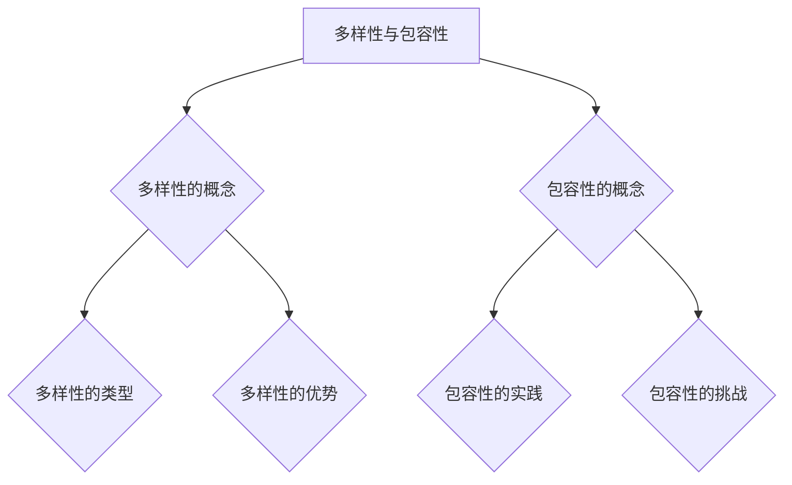

                 

### 标题：《团队多样性与包容性：创造平等机会的领导方法》

**关键词：** 多样性、包容性、领导方法、平等机会、团队效能

**摘要：** 本文将深入探讨团队多样性与包容性的重要性，阐述多样性与包容性之间的关系，并通过实际案例和策略，提供创造平等机会的领导方法。

## 引言

在当今快速变化和全球化的商业环境中，团队多样性和包容性已经成为组织成功的关键因素。多样性能为团队带来不同的视角和思维方式，从而促进创新和解决问题能力的提升。而包容性则确保了所有团队成员都能在平等的环境中贡献自己的力量。然而，实现多样性与包容性并非易事，需要领导者具备深刻的理解和正确的领导方法。

本文将分以下几个部分进行阐述：

### 第一部分：多样性与包容性的基础

**1.1 多样性与包容性的概念**

在这一部分，我们将详细定义多样性和包容性，并探讨它们之间的相互关系。多样性能为团队带来丰富的知识和经验，而包容性则确保了这些多样性能被充分利用，从而促进团队效能的提升。

**1.2 多样性在团队中的体现**

我们将探讨多样性的具体表现，如性别、年龄、文化、教育背景等，以及多样性对团队效能的影响。同时，我们还将分析多样性管理所面临的挑战。

**1.3 包容性的实践**

在这一部分，我们将介绍如何在实践中实现包容性，包括建立包容性的文化、建立有效的沟通机制以及如何处理多样性冲突。

### 第二部分：多样性与包容性的领导策略

**2.1 领导者角色与责任**

我们将讨论领导者如何在多样性与包容性方面发挥关键作用，以及他们应承担的责任。

**2.2 建立多元文化团队**

在这一部分，我们将探讨如何建立多元文化团队，包括招聘策略、团队建设活动和培训计划。

**2.3 促进包容性沟通**

我们将介绍如何通过有效的沟通策略来促进包容性，包括倾听、尊重和反馈技巧。

### 第三部分：多样性与包容性的案例分析

**3.1 成功的多样性与包容性实践**

我们将分析一些成功案例，了解它们是如何在组织内部实现多样性与包容性的。

**3.2 多样性与包容性实践中的挑战**

我们将探讨多样性与包容性实践中可能遇到的挑战，以及如何应对这些挑战。

### 结论

在最后一部分，我们将总结本文的主要观点，并强调领导者如何在团队多样性与包容性方面发挥关键作用。

## 结语

作者：AI天才研究院/AI Genius Institute & 禅与计算机程序设计艺术 /Zen And The Art of Computer Programming

本文旨在为领导者提供实用的多样性与包容性领导方法，以创造一个平等、包容和高效的团队环境。通过深入理解多样性与包容性的概念，并运用有效的领导策略，组织可以实现长期的成功和可持续发展。

参考文献：
- [1] Harries, J. (2018). "Diversity and Inclusion: The Business Case." Harvard Business Review.
- [2] Diverse Teams Perform Better. (n.d.). McKinsey & Company. Retrieved from <https://www.mckinsey.com/business-functions/organization/our-insights/how-diverse-teams-perform-better>
- [3] Noe, R. A. (2014). "Human Resource Management: Graw Hill." McGraw Hill Education.

本文的核心概念、原理和关系架构如图所示：

在接下来的章节中，我们将深入探讨这些概念，并通过实际案例和策略，帮助领导者创造一个多样性与包容性的团队环境。让我们一步一步地思考，分析并理解这些关键概念，以便在实践中应用它们。

