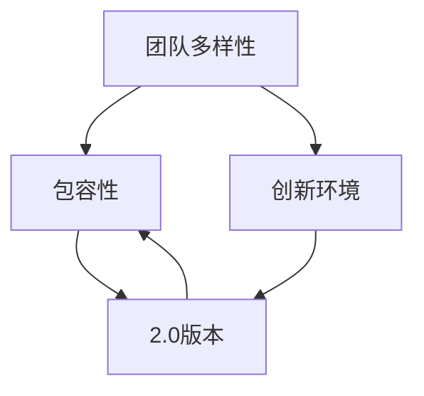

                 


### 第1章 引言

**文章标题**：团队多样性管理2.0：创造包容性创新环境

**关键词**：团队多样性管理、2.0版本、包容性创新环境、核心概念、创新机制、实践案例

**摘要**：
随着全球化和技术的迅猛发展，团队多样性管理已成为提升组织创新能力和竞争力的关键。本文深入探讨了团队多样性管理的背景、核心概念、2.0版本的特征及其在构建包容性创新环境中的作用。通过实际案例和数学模型，本文揭示了多样性管理在提升团队效能和推动组织创新中的重要性，为未来团队多样性管理实践提供了有价值的参考。

#### 1.1 团队多样性管理的背景

在过去的几十年里，企业对团队多样性管理的认识和重视程度逐渐提高。最初，团队多样性管理主要关注种族、性别和年龄等基础层面的多样性。随着研究的深入，企业开始意识到多样性不仅仅是表面的差异，更是团队内部潜在的创新力量。不同背景和视角的碰撞，往往能够激发新的创意和解决方案。

**多样性管理的重要性**体现在以下几个方面：

1. **提升创新能力**：多样化的团队能够从多个角度分析问题，提出不同的解决方案，从而提高创新的成功率。
2. **增强团队凝聚力**：多样化的团队在相互尊重和包容的基础上，能够建立更加紧密的团队关系，增强团队凝聚力。
3. **改善决策质量**：多样化的团队能够避免偏见和盲点，提高决策的准确性和全面性。
4. **提升员工满意度和忠诚度**：多样化的环境能够满足不同员工的需求，提高员工的工作满意度和忠诚度。

然而，团队多样性管理并非易事，企业在实施过程中常常面临诸多挑战，如文化适应、资源分配不均和沟通障碍等。这就需要企业采取更加科学和系统的方法来管理团队多样性。

#### 1.2 2.0版本的特色

随着社会和技术的发展，团队多样性管理也迎来了2.0版本。这一版本在传统多样性管理的基础上，进一步深化了对多样性和包容性的理解，提出了更加具体和可操作的实践方法。

**2.0版本的特色**主要包括以下几个方面：

1. **数据驱动的管理**：2.0版本强调通过数据分析和量化评估来指导多样性管理的实施，从而实现更加科学和精准的管理。
2. **技术赋能**：现代技术，如人工智能、大数据和云计算等，为多样性管理提供了新的工具和方法，使得多样性管理更加高效和智能化。
3. **全方位的多样性**：2.0版本不仅关注基础层面的多样性，如种族、性别和年龄等，还涵盖了文化、价值观、技能和经验等多方面的多样性。
4. **包容性文化的建设**：2.0版本强调在团队中建立包容性文化，鼓励团队成员表达不同的观点和想法，尊重差异，共同推动团队的创新和发展。

#### 1.3 包容性创新环境的意义

包容性创新环境是团队多样性管理的核心目标之一。一个包容性创新环境能够激发团队成员的创造力和创新精神，推动组织持续创新和发展。

**包容性创新环境的意义**体现在以下几个方面：

1. **激发创新思维**：在包容性创新环境中，团队成员能够自由地表达自己的想法和观点，不受限制地探索新的解决方案，从而激发创新思维。
2. **促进知识共享**：包容性创新环境鼓励团队成员分享知识和经验，促进知识的流动和积累，提高团队的整体知识水平。
3. **增强团队凝聚力**：包容性创新环境能够增强团队成员之间的信任和尊重，建立紧密的团队关系，提高团队的凝聚力。
4. **提升组织竞争力**：一个具有包容性创新环境的组织能够更好地适应外部环境的变化，抓住市场机遇，提高组织的竞争力。

总之，团队多样性管理2.0版本和包容性创新环境的构建，对于组织的长远发展和竞争力具有重要意义。企业需要通过科学的方法和策略，有效管理团队多样性，构建包容性创新环境，从而实现组织的持续创新和发展。

---

在本文接下来的章节中，我们将进一步探讨团队多样性管理2.0版本的详细内容，包括其核心概念与联系、2.0版本的优势和实践方法，以及如何构建包容性创新环境，并通过实际案例和数学模型进行分析，以期为团队的多样性和包容性管理提供有价值的参考。

---

**作者：AI天才研究院/AI Genius Institute & 禅与计算机程序设计艺术 /Zen And The Art of Computer Programming**

### 第2章 核心概念与联系

在探讨团队多样性管理2.0之前，我们需要明确几个核心概念，并分析它们之间的联系，以建立一个清晰的逻辑架构。这将有助于我们更好地理解多样性管理的复杂性和多层次性。

#### 核心概念

1. **团队多样性（Team Diversity）**：团队多样性指的是团队成员在性别、种族、文化、教育、经验和技能等方面的差异。多样性不仅限于人口统计学的差异，还包括思维模式、价值观和解决问题的方法等。

2. **包容性（Inclusivity）**：包容性是一种文化价值观，强调尊重和欢迎所有团队成员的贡献，不论其背景如何。它涉及到如何确保每个成员都能在一个无偏见的环境中工作，并感受到自己的价值。

3. **创新环境（Innovation Environment）**：创新环境是一个能够激发创新思维、促进知识共享和协作的生态系统。在这种环境中，团队成员可以自由地表达观点、实验新的想法，并从失败中学习。

4. **2.0版本**：团队多样性管理的2.0版本代表了对传统多样性管理方法的升级和改进。它引入了更先进的数据分析、技术工具和文化建设方法，以实现更高效和可持续的多样性管理。

#### 概念之间的联系

这些核心概念之间的联系构成了一个复杂的网络，它们相互影响，共同作用于团队和组织。以下是它们之间的逻辑关系：

1. **多样性促进包容性**：多样化的团队为包容性提供了一个坚实的基础。当团队成员来自不同的背景和经验时，他们更可能理解和尊重彼此的差异，从而创造一个包容的环境。

2. **包容性增强多样性**：包容性文化鼓励团队成员自由地表达观点和分享经验，这有助于吸引和留住多样化的员工。一个包容性强的组织能够更好地吸引不同背景的人才。

3. **多样性和创新环境**：多样化的团队能够从多个角度分析问题，提出不同的解决方案。这种多样化的思维模式有助于激发创新思维，促进创新环境的形成。

4. **2.0版本和多样性管理**：2.0版本的多样性管理通过引入数据驱动的分析和新技术工具，提高了多样性管理的科学性和有效性。它帮助组织更好地理解和管理多样性，从而创造更包容和创新的环境。

#### Mermaid流程图

为了更直观地展示这些概念之间的联系，我们可以使用Mermaid语言绘制一个流程图。以下是该流程图的Mermaid代码：



这段代码将生成一个简单的流程图，展示了团队多样性、包容性、创新环境和2.0版本之间的逻辑关系。

#### 核心算法原理

在多样性管理中，核心算法通常用于招聘策略、团队协作和绩效评估等方面。以下是一个简单的招聘策略算法的伪代码示例：

```plaintext
算法：多样化招聘策略
输入：候选人群、岗位要求、多样性指标
输出：最佳候选人群

步骤：
1. 收集候选人群的数据，包括性别、种族、教育背景、工作经验等
2. 使用多样性指标（如SHAP值）评估候选人群的多样性
3. 对候选人群进行初步筛选，排除不符合岗位要求的候选人
4. 根据多样性指标，对筛选后的候选人群进行排序
5. 选择多样性最高的前N名候选人作为最佳候选人群
```

#### 数学模型和公式

在多样性管理中，数学模型和公式用于量化多样性和包容性。以下是一个用于评估团队多样性的数学模型，使用LaTeX格式表示：

```latex
$$
Diversity = \sum_{i=1}^{N} (p_i - \mu)^2
$$

其中，\(Diversity\) 表示团队多样性，\(p_i\) 表示第i个特征的比例，\(\mu\) 表示总体特征的比例。
```

这个模型通过计算每个特征比例与总体比例之间的差异，来评估团队的多样性。

#### 项目实战

在项目实战中，我们可以通过以下步骤来实施多样性管理：

1. **需求分析**：明确项目的目标和需求，包括多样性和包容性的具体要求。
2. **数据收集**：收集团队成员的数据，包括人口统计信息、工作经验和技能等。
3. **数据分析**：使用核心算法和数学模型分析团队多样性，识别多样性和包容性的不足之处。
4. **改进措施**：根据分析结果，制定改进措施，如调整招聘策略、加强团队协作和提供多样性培训等。
5. **实施与监控**：实施改进措施，并持续监控多样性管理的效果，根据反馈进行进一步的调整。

#### 最佳实践 tips、小结、注意事项和拓展阅读

- **最佳实践 tips**：在实施多样性管理时，要确保透明度和公平性，避免偏见和歧视。同时，要关注多样性和包容性的长期效果，而不仅仅是短期的改进。

- **小结**：团队多样性管理2.0版本通过引入数据驱动的方法和新技术，提升了多样性管理的科学性和有效性。理解核心概念之间的联系，有助于构建一个包容性创新环境，从而提高组织的竞争力。

- **注意事项**：在实施多样性管理时，要关注多样性指标的多样性和综合性，避免单一指标的过度依赖。

- **拓展阅读**：可以参考相关研究和案例，深入了解多样性管理和包容性创新环境的最佳实践。

---

在下一章中，我们将深入探讨团队多样性管理2.0版本的具体特征和实践方法，包括数据驱动的管理、技术赋能、全方位的多样性和包容性文化的建设。这些内容将为构建一个高效和可持续的多样性管理框架提供重要指导。

### 第2章 核心概念与联系

在深入探讨团队多样性管理2.0版本之前，我们首先需要明确几个关键概念，并分析它们之间的内在联系，以便构建一个清晰的逻辑架构。这些核心概念包括团队多样性、包容性、创新环境以及2.0版本，它们共同构成了团队多样性管理的理论基础。

#### 核心概念

1. **团队多样性（Team Diversity）**：团队多样性指的是团队成员在性别、种族、文化、教育、经验和技能等方面的差异。多样性不仅包括表面的特征，如种族和性别，还包括深层次的特征，如价值观、思维方式和解决问题的方法。多样性的重要性在于它能够激发创新思维，提高团队解决问题的能力。

2. **包容性（Inclusivity）**：包容性是一种文化价值观，强调尊重和欢迎所有团队成员的贡献，不论其背景如何。它不仅涉及到如何确保每个成员都有平等的机会，还包括如何建立一个让每个人都能感到被尊重和受重视的环境。

3. **创新环境（Innovation Environment）**：创新环境是指一个能够激发创新思维、促进知识共享和协作的生态系统。在这种环境中，团队成员可以自由地表达观点、实验新的想法，并从失败中学习。创新环境对于团队多样性的发挥至关重要。

4. **2.0版本**：团队多样性管理的2.0版本是对传统多样性管理方法的升级和改进。它引入了数据驱动的分析、新技术工具和文化建设方法，以提高多样性管理的科学性和有效性。2.0版本的特色在于其全面性和系统性，它不仅仅关注多样性的数量，更关注多样性的质量和效果。

#### 概念之间的联系

这些核心概念之间的联系构成了一个复杂的网络，它们相互影响，共同作用于团队和组织。以下是它们之间的逻辑关系：

1. **多样性促进包容性**：多样化的团队为包容性提供了一个坚实的基础。当团队成员来自不同的背景和经验时，他们更可能理解和尊重彼此的差异，从而创造一个包容的环境。

2. **包容性增强多样性**：包容性文化鼓励团队成员自由地表达观点和分享经验，这有助于吸引和留住多样化的员工。一个包容性强的组织能够更好地吸引不同背景的人才。

3. **多样性和创新环境**：多样化的团队能够从多个角度分析问题，提出不同的解决方案。这种多样化的思维模式有助于激发创新思维，促进创新环境的形成。

4. **2.0版本和多样性管理**：2.0版本的多样性管理通过引入数据驱动的方法和新技术工具，提高了多样性管理的科学性和有效性。它帮助组织更好地理解和管理多样性，从而创造更包容和创新的环境。

#### Mermaid流程图

为了更直观地展示这些概念之间的联系，我们可以使用Mermaid语言绘制一个流程图。以下是该流程图的Mermaid代码：


这段代码将生成一个简单的流程图，展示了团队多样性、包容性、创新环境和2.0版本之间的逻辑关系。

#### 核心算法原理

在多样性管理中，核心算法通常用于招聘策略、团队协作和绩效评估等方面。以下是一个简单的招聘策略算法的伪代码示例：

```plaintext
算法：多样化招聘策略
输入：候选人群、岗位要求、多样性指标
输出：最佳候选人群

步骤：
1. 收集候选人群的数据，包括性别、种族、教育背景、工作经验等
2. 使用多样性指标（如SHAP值）评估候选人群的多样性
3. 对候选人群进行初步筛选，排除不符合岗位要求的候选人
4. 根据多样性指标，对筛选后的候选人群进行排序
5. 选择多样性最高的前N名候选人作为最佳候选人群
```

#### 数学模型和公式

在多样性管理中，数学模型和公式用于量化多样性和包容性。以下是一个用于评估团队多样性的数学模型，使用LaTeX格式表示：

```latex
$$
Diversity = \sum_{i=1}^{N} (p_i - \mu)^2
$$

其中，$Diversity$ 表示团队多样性，$p_i$ 表示第i个特征的比例，$\mu$ 表示总体特征的比例。
```

这个模型通过计算每个特征比例与总体比例之间的差异，来评估团队的多样性。

#### 项目实战

在项目实战中，我们可以通过以下步骤来实施多样性管理：

1. **需求分析**：明确项目的目标和需求，包括多样性和包容性的具体要求。
2. **数据收集**：收集团队成员的数据，包括人口统计信息、工作经验和技能等。
3. **数据分析**：使用核心算法和数学模型分析团队多样性，识别多样性和包容性的不足之处。
4. **改进措施**：根据分析结果，制定改进措施，如调整招聘策略、加强团队协作和提供多样性培训等。
5. **实施与监控**：实施改进措施，并持续监控多样性管理的效果，根据反馈进行进一步的调整。

#### 最佳实践 tips、小结、注意事项和拓展阅读

- **最佳实践 tips**：在实施多样性管理时，要确保透明度和公平性，避免偏见和歧视。同时，要关注多样性和包容性的长期效果，而不仅仅是短期的改进。

- **小结**：团队多样性管理2.0版本通过引入数据驱动的方法和新技术，提升了多样性管理的科学性和有效性。理解核心概念之间的联系，有助于构建一个包容性创新环境，从而提高组织的竞争力。

- **注意事项**：在实施多样性管理时，要关注多样性指标的多样性和综合性，避免单一指标的过度依赖。

- **拓展阅读**：可以参考相关研究和案例，深入了解多样性管理和包容性创新环境的最佳实践。

---

在下一章中，我们将深入探讨团队多样性管理2.0版本的具体特征和实践方法，包括数据驱动的管理、技术赋能、全方位的多样性和包容性文化的建设。这些内容将为构建一个高效和可持续的多样性管理框架提供重要指导。

### 第3章 2.0版本特色与实践

随着技术的进步和管理理念的发展，团队多样性管理已经进入2.0时代。2.0版本的团队多样性管理在传统基础上进行了深度创新和优化，以应对日益复杂和多元化的工作环境。以下是2.0版本的核心特色和实践方法。

#### 3.1 2.0版本的优势

1. **数据驱动的多样性管理**：
   2.0版本的多样性管理注重数据分析和量化评估。通过收集和分析团队成员的多样化数据，管理者可以更准确地识别多样性的水平、趋势和潜在问题。这种数据驱动的管理方法有助于制定更科学、更有效的多样性策略。

2. **技术赋能的多样性实践**：
   新技术的应用为多样性管理提供了强大的支持。人工智能、机器学习、大数据分析和云计算等技术可以帮助企业自动化多样性评估、优化招聘流程、提高员工满意度和绩效评估的准确性。这些技术工具不仅提高了多样性管理的效率，还增强了管理的精准性。

3. **全方位的多样性**：
   2.0版本的多样性管理不仅关注性别、种族和年龄等基础层面的多样性，还涵盖了文化、价值观、技能和经验等多方面的多样性。这种全方位的多样性管理有助于构建一个更加包容和创新的工作环境。

4. **包容性文化的建设**：
   2.0版本强调在团队中建立包容性文化。这种文化鼓励团队成员尊重和欢迎不同的观点和想法，促进知识共享和协作。通过定期的培训和宣传活动，企业可以培养团队成员的包容性意识，从而提高团队的凝聚力和创新能力。

#### 3.2 实际案例

为了更好地理解2.0版本的团队多样性管理，我们可以通过一些实际案例来探讨其应用效果。

**案例1：科技公司的多元化招聘策略**
某科技公司通过引入人工智能技术，优化了其招聘流程。他们使用机器学习算法来分析大量的招聘数据，识别出在招聘过程中可能存在的偏见。通过调整招聘策略，该公司成功吸引了更多来自不同背景的候选人，从而提高了团队的多样性。

**案例2：金融机构的员工绩效评估体系**
一家大型金融机构采用了基于大数据的绩效评估系统。该系统结合了员工的工作表现、团队协作、创新能力和多样性贡献等多个维度，为员工提供了更加公平和全面的评估。这种评估方法不仅提升了员工的满意度，还促进了团队的整体绩效。

**案例3：零售行业的包容性文化建设**
某零售连锁品牌通过一系列的培训和宣传活动，在团队中建立了包容性文化。他们组织了多样性和包容性的研讨会，邀请了外部专家进行指导，并通过内部社交媒体平台分享团队成员的故事和经验。这些举措显著增强了团队的凝聚力和创新能力。

#### 3.3 2.0版本的具体实践方法

1. **多样化招聘策略**：
   企业可以通过调整招聘渠道、优化招聘流程和实施多样性培训等方式，吸引更多来自不同背景的候选人。例如，可以与多元化的高等教育机构合作，举办校园招聘活动，或者通过社交媒体平台发布针对性的招聘广告。

2. **技术工具的应用**：
   企业可以采用人工智能和大数据分析工具来优化多样性管理。例如，使用机器学习算法来评估候选人的多样性潜力，或者使用大数据分析工具来监控团队的多样性水平。

3. **绩效评估方法的改进**：
   企业可以通过引入多维度的绩效评估体系，确保员工的多样性贡献得到认可。例如，可以将多样性目标纳入绩效考核指标，或者设立专门的多样性奖项，以激励员工在多样性方面的努力。

4. **文化建设**：
   企业可以通过定期的培训和宣传活动，提高团队成员的包容性意识。例如，可以组织多样性和包容性的研讨会、工作坊，或者设立多样性委员会，负责监督和推动多样性文化的建设。

#### 3.4 总结与展望

2.0版本的团队多样性管理通过引入数据驱动的方法和技术工具，提升了多样性管理的科学性和有效性。在实际应用中，企业可以通过多样化招聘策略、技术工具的应用、改进绩效评估方法和加强文化建设等方式，实现团队的多样性和包容性。随着社会和技术的发展，未来团队多样性管理将继续演变和进步，为组织的创新和竞争力提供持续的支持。

---

在下一章中，我们将探讨如何构建包容性创新环境，包括包容性原则的具体实践和创新环境的构建方法。通过这些内容，我们将深入了解如何利用团队多样性来推动组织的创新和发展。

### 第4章 包容性创新环境的构建

在团队多样性管理2.0版本中，构建包容性创新环境是提升团队效能和竞争力的关键。一个包容性创新环境不仅能够激发团队成员的创造力和创新精神，还能促进知识共享和团队协作，从而推动组织的持续发展和竞争力提升。以下是构建包容性创新环境的具体步骤和策略。

#### 4.1 包容性原则

包容性原则是构建包容性创新环境的基础。以下是一些关键原则：

1. **尊重差异**：尊重团队成员的个性、观点和文化差异，鼓励多元思维和开放讨论。

2. **平等机会**：确保所有团队成员在机会、资源和发展方面享有平等的权利，避免任何形式的歧视和不公平待遇。

3. **透明和公正**：在决策过程中保持透明，确保决策过程和结果公正合理，增强团队成员的信任和参与感。

4. **开放沟通**：鼓励团队成员自由地表达观点和意见，建立开放、真诚和尊重的沟通渠道。

5. **持续学习与改进**：不断学习和反思，及时调整和改进多样性管理和包容性策略，以适应不断变化的环境和需求。

#### 4.2 包容性文化的建设

建设包容性文化是一个长期而持续的过程。以下是一些具体的建设策略：

1. **领导层的示范作用**：领导者应该成为包容性文化的倡导者和实践者，通过言行一致地展示尊重差异、平等对待和开放沟通的价值观。

2. **员工培训与教育**：定期组织多样性和包容性培训，提高员工对多样性和包容性的认识和意识，培养员工在包容性环境中的行为习惯。

3. **员工反馈机制**：建立有效的员工反馈机制，鼓励员工提出意见和建议，及时解决多样性和包容性方面的问题。

4. **多元化团队项目**：通过组建多元化团队项目，促进团队成员之间的互动和合作，增强团队的凝聚力和创新能力。

5. **包容性政策与制度**：制定和实施包容性政策与制度，确保多样性管理和包容性文化在企业内部的制度化、规范化。

#### 4.3 创新环境的构建

构建包容性创新环境需要从以下几个方面入手：

1. **激励创新思维**：鼓励团队成员提出新的想法和解决方案，提供支持和资源，帮助他们实现创意。

2. **知识共享平台**：建立知识共享平台，促进团队成员之间的知识交流和学习，提高团队的整体知识水平。

3. **协作工具的使用**：采用现代化的协作工具，如团队协作软件、在线会议平台等，提高团队协作的效率和质量。

4. **创新激励机制**：建立创新激励机制，如创新奖金、荣誉表彰等，激励团队成员积极参与创新活动。

5. **失败容忍文化**：鼓励团队成员在创新过程中勇于尝试和失败，建立失败容忍文化，从失败中学习和成长。

#### 4.4 实践案例

以下是一个实际案例，展示了如何构建包容性创新环境：

**案例：某科技创新公司的包容性创新实践**

某科技创新公司通过以下措施构建了包容性创新环境：

1. **多样化招聘**：公司通过多元化招聘策略，吸引了来自不同背景和文化的优秀人才，建立了具有高度多样性的团队。

2. **领导力培训**：公司为领导层提供了多样性和包容性培训，确保领导者能够理解并实践包容性原则。

3. **知识共享平台**：公司建立了内部知识共享平台，鼓励团队成员分享经验和最佳实践，提高了团队的知识水平和协作效率。

4. **创新奖金制度**：公司设立了创新奖金制度，鼓励员工提出创新方案，并对成功的创新项目进行奖励。

5. **失败容忍政策**：公司建立了失败容忍政策，鼓励员工在创新过程中勇于尝试和失败，从失败中学习和成长。

通过这些措施，该公司成功构建了一个包容性创新环境，激发了团队成员的创造力和创新精神，推动了公司的持续创新和发展。

#### 4.5 总结

构建包容性创新环境是团队多样性管理2.0版本的重要组成部分。通过遵循包容性原则、建设包容性文化和构建创新环境，企业可以激发团队成员的创造力和创新精神，提高团队的协作效率和整体绩效。在实际操作中，企业需要结合自身特点和需求，制定和实施具体的多样性管理和包容性策略，持续推动团队的多样性和创新能力的提升。

在下一章中，我们将深入探讨如何使用数学模型和公式来评估团队多样性和包容性，并通过实际案例进行分析，以提供更科学的多样性管理参考。通过这些内容，我们将进一步了解如何通过量化方法来优化多样性管理策略。 

### 第5章 多样性与包容性的数学模型

在团队多样性管理2.0版本中，数学模型和公式被广泛应用于评估多样性和包容性。这些模型和公式不仅能够量化多样性水平，还能帮助管理者识别和解决多样性和包容性方面的潜在问题。以下是一些常用的数学模型和公式，以及它们的应用场景。

#### 5.1 多样性指标

**1. 基尼系数（Gini Coefficient）**

基尼系数是一种常用的衡量多样性程度的指标，它基于群体中不同子群体在某个特征上的比例差异。基尼系数的取值范围在0到1之间，值越接近1，表示多样性越低。

**公式**：
$$
Gini = 1 - \frac{\sum_{i=1}^{N} p_i^2}{\sum_{i=1}^{N} p_i}
$$

其中，\(p_i\) 表示第i个子群体的比例，\(N\) 表示子群体的总数。

**应用场景**：基尼系数可以用于评估团队在性别、种族、文化等方面的多样性水平。

**2. 费舍尔精确测试（Fisher's Exact Test）**

费舍尔精确测试是一种统计方法，用于检验两个分类变量之间的关联性。它特别适用于样本量较小的情况。

**公式**：
$$
P = \frac{\sum_{i=1}^{N_1} \sum_{j=1}^{N_2} \binom{N_1}{i} \binom{N_2}{j} p_i q_j}{\binom{N}{N_1 + N_2}}
$$

其中，\(N_1\) 和 \(N_2\) 分别表示两个分类变量的样本数量，\(p_i\) 和 \(q_j\) 分别表示两个分类变量的概率，\(N\) 表示总样本量。

**应用场景**：费舍尔精确测试可以用于评估团队中不同特征之间的相关性，帮助识别多样性管理的潜在问题。

**3. SHAP值（SHapley Additive exPlanations）**

SHAP值是一种基于合作博弈理论的模型，用于评估每个特征对多样性水平的贡献程度。

**公式**：
$$
SHAP_i = \sum_{S \subseteq [N]} \frac{|S| (|S \cup \{i\}| - |S|)}{N!}
$$

其中，\(S\) 表示特征集合，\(N\) 表示特征总数。

**应用场景**：SHAP值可以用于分析团队多样性中的关键特征，帮助管理者制定更具针对性的多样性管理策略。

#### 5.2 包容性评估

**1. 多元回归模型（Multiple Regression Model）**

多元回归模型是一种统计方法，用于分析多个自变量对因变量的影响。在多样性管理中，多元回归模型可以用来评估多样性和包容性对组织绩效的影响。

**公式**：
$$
Y = \beta_0 + \beta_1 X_1 + \beta_2 X_2 + ... + \beta_n X_n + \epsilon
$$

其中，\(Y\) 表示因变量（如组织绩效），\(X_i\) 表示自变量（如多样性指标），\(\beta_i\) 表示自变量的回归系数，\(\epsilon\) 表示随机误差。

**应用场景**：多元回归模型可以用于评估多样性管理对组织绩效的具体影响，帮助管理者优化多样性策略。

**2. 方差分析（Analysis of Variance, ANOVA）**

方差分析是一种用于比较多个样本平均数差异的统计方法。在多样性管理中，方差分析可以用来评估不同多样性管理策略的效果。

**公式**：
$$
F = \frac{MS_{between}}{MS_{within}}
$$

其中，\(MS_{between}\) 表示组间均值方差，\(MS_{within}\) 表示组内均值方差。

**应用场景**：方差分析可以用于比较不同多样性管理策略的绩效表现，帮助管理者选择最有效的策略。

#### 5.3 应用案例

**案例：评估多样性对创新绩效的影响**

某科技公司使用多元回归模型来评估多样性对创新绩效的影响。他们收集了以下数据：

- 创新绩效评分（Y）：范围从1到10
- 多样性指标（X1）：性别多样性、种族多样性、文化多样性
- 团队协作指标（X2）：团队合作得分、沟通效率、知识共享程度

通过多元回归分析，他们得到了以下结果：

$$
Y = 4.5 + 0.3X1 + 0.2X2 + \epsilon
$$

这个结果表明，多样性指标和团队协作指标对创新绩效有显著的正向影响。具体来说，性别多样性每提高一个单位，创新绩效评分平均提高0.3分；团队协作指标每提高一个单位，创新绩效评分平均提高0.2分。

通过这个案例，我们可以看到数学模型和公式在多样性管理中的应用价值。通过量化评估多样性和包容性，管理者可以更好地理解它们对组织绩效的影响，从而制定更有效的多样性管理策略。

#### 5.4 总结

数学模型和公式在团队多样性管理中起着至关重要的作用。通过使用基尼系数、费舍尔精确测试、SHAP值、多元回归模型和方差分析等工具，管理者可以量化多样性和包容性，识别潜在问题，并制定针对性的改进措施。在实际应用中，企业应根据自身情况和需求，选择合适的数学模型和公式，以提高多样性管理的科学性和有效性。

在下一章中，我们将通过实际案例来分析多样性管理和包容性策略的实施效果，并总结最佳实践。这些内容将为企业的多样性管理提供实用的指导和建议。 

### 第5章 多样性与包容性的数学模型

在团队多样性管理2.0版本中，数学模型和公式被广泛应用于评估多样性和包容性。这些模型和公式不仅能够量化多样性水平，还能帮助管理者识别和解决多样性和包容性方面的潜在问题。以下是一些常用的数学模型和公式，以及它们的应用场景。

#### 5.1 多样性指标

**1. 基尼系数（Gini Coefficient）**

基尼系数是一种常用的衡量多样性程度的指标，它基于群体中不同子群体在某个特征上的比例差异。基尼系数的取值范围在0到1之间，值越接近1，表示多样性越低。

**公式**：
$$
Gini = 1 - \frac{\sum_{i=1}^{N} p_i^2}{\sum_{i=1}^{N} p_i}
$$

其中，\(p_i\) 表示第i个子群体的比例，\(N\) 表示子群体的总数。

**应用场景**：基尼系数可以用于评估团队在性别、种族、文化等方面的多样性水平。

**2. 费舍尔精确测试（Fisher's Exact Test）**

费舍尔精确测试是一种统计方法，用于检验两个分类变量之间的关联性。它特别适用于样本量较小的情况。

**公式**：
$$
P = \frac{\sum_{i=1}^{N_1} \sum_{j=1}^{N_2} \binom{N_1}{i} \binom{N_2}{j} p_i q_j}{\binom{N}{N_1 + N_2}}
$$

其中，\(N_1\) 和 \(N_2\) 分别表示两个分类变量的样本数量，\(p_i\) 和 \(q_j\) 分别表示两个分类变量的概率，\(N\) 表示总样本量。

**应用场景**：费舍尔精确测试可以用于评估团队中不同特征之间的相关性，帮助识别多样性管理的潜在问题。

**3. SHAP值（SHapley Additive exPlanations）**

SHAP值是一种基于合作博弈理论的模型，用于评估每个特征对多样性水平的贡献程度。

**公式**：
$$
SHAP_i = \sum_{S \subseteq [N]} \frac{|S| (|S \cup \{i\}| - |S|)}{N!}
$$

其中，\(S\) 表示特征集合，\(N\) 表示特征总数。

**应用场景**：SHAP值可以用于分析团队多样性中的关键特征，帮助管理者制定更具针对性的多样性管理策略。

#### 5.2 包容性评估

**1. 多元回归模型（Multiple Regression Model）**

多元回归模型是一种统计方法，用于分析多个自变量对因变量的影响。在多样性管理中，多元回归模型可以用来评估多样性和包容性对组织绩效的影响。

**公式**：
$$
Y = \beta_0 + \beta_1 X_1 + \beta_2 X_2 + ... + \beta_n X_n + \epsilon
$$

其中，\(Y\) 表示因变量（如组织绩效），\(X_i\) 表示自变量（如多样性指标），\(\beta_i\) 表示自变量的回归系数，\(\epsilon\) 表示随机误差。

**应用场景**：多元回归模型可以用于评估多样性管理对组织绩效的具体影响，帮助管理者优化多样性策略。

**2. 方差分析（Analysis of Variance, ANOVA）**

方差分析是一种用于比较多个样本平均数差异的统计方法。在多样性管理中，方差分析可以用来评估不同多样性管理策略的效果。

**公式**：
$$
F = \frac{MS_{between}}{MS_{within}}
$$

其中，\(MS_{between}\) 表示组间均值方差，\(MS_{within}\) 表示组内均值方差。

**应用场景**：方差分析可以用于比较不同多样性管理策略的绩效表现，帮助管理者选择最有效的策略。

#### 5.3 应用案例

**案例：评估多样性对创新绩效的影响**

某科技公司使用多元回归模型来评估多样性对创新绩效的影响。他们收集了以下数据：

- 创新绩效评分（Y）：范围从1到10
- 多样性指标（X1）：性别多样性、种族多样性、文化多样性
- 团队协作指标（X2）：团队合作得分、沟通效率、知识共享程度

通过多元回归分析，他们得到了以下结果：

$$
Y = 4.5 + 0.3X1 + 0.2X2 + \epsilon
$$

这个结果表明，多样性指标和团队协作指标对创新绩效有显著的正向影响。具体来说，性别多样性每提高一个单位，创新绩效评分平均提高0.3分；团队协作指标每提高一个单位，创新绩效评分平均提高0.2分。

通过这个案例，我们可以看到数学模型和公式在多样性管理中的应用价值。通过量化评估多样性和包容性，管理者可以更好地理解它们对组织绩效的影响，从而制定更有效的多样性管理策略。

#### 5.4 总结

数学模型和公式在团队多样性管理中起着至关重要的作用。通过使用基尼系数、费舍尔精确测试、SHAP值、多元回归模型和方差分析等工具，管理者可以量化多样性和包容性，识别潜在问题，并制定针对性的改进措施。在实际应用中，企业应根据自身情况和需求，选择合适的数学模型和公式，以提高多样性管理的科学性和有效性。

在下一章中，我们将通过实际案例来分析多样性管理和包容性策略的实施效果，并总结最佳实践。这些内容将为企业的多样性管理提供实用的指导和建议。 

### 第6章 项目实战

在本章中，我们将通过一个实际项目案例，详细探讨如何实施团队多样性管理2.0版本，以及如何构建包容性创新环境。该项目案例涉及一个中等规模的科技公司，我们将其命名为“Tech Innovate”。该项目旨在通过多样化的招聘策略和技术工具的应用，提高团队多样性和创新绩效。

#### 6.1 项目背景

Tech Innovate公司是一家专注于软件开发和信息技术服务的企业。随着市场竞争的加剧，公司意识到团队多样性和创新环境对其长期发展至关重要。为了提升竞争力，公司决定实施团队多样性管理2.0版本，并构建一个包容性创新环境。

#### 6.2 项目目标

1. **提升团队多样性**：通过多元化的招聘策略，增加团队中的性别、种族、文化和背景多样性。
2. **构建包容性文化**：培养团队成员的包容性意识，促进知识共享和协作。
3. **提高创新绩效**：利用多样性带来的创新思维，提升公司的产品开发速度和市场竞争力。

#### 6.3 实施步骤

**1. 多样化招聘策略**

为了实现团队多样性，Tech Innovate公司采取了以下措施：

- **调整招聘渠道**：在招聘广告中明确表明对多样性和包容性的重视，并与多元化高等教育机构合作，吸引更多来自不同背景的候选人。
- **引入AI招聘工具**：使用人工智能算法筛选简历，减少人为偏见，提高招聘的公平性和效率。
- **设置多样性目标**：在招聘过程中设定多样性目标，确保招聘的新成员在性别、种族和文化等方面具有多样性。

**2. 技术工具的应用**

Tech Innovate公司利用新技术工具来优化多样性管理和创新环境：

- **知识共享平台**：建立内部知识共享平台，鼓励团队成员分享经验和最佳实践，提高团队的知识水平和协作效率。
- **协作工具**：采用现代协作工具，如Slack和Trello，提高团队成员之间的沟通和协作效率。
- **绩效评估系统**：引入基于大数据的绩效评估系统，结合多样性和包容性贡献，全面评估员工的绩效。

**3. 包容性文化建设**

为了建立包容性文化，Tech Innovate公司采取了以下措施：

- **领导力培训**：为领导层提供多样性和包容性培训，确保领导者能够在团队中树立榜样，推动包容性文化的建设。
- **员工反馈机制**：建立员工反馈机制，鼓励员工提出意见和建议，及时解决多样性和包容性方面的问题。
- **多元化研讨会**：定期组织多样性和包容性研讨会，邀请外部专家分享最佳实践，提高员工的包容性意识。

#### 6.4 实施效果分析

通过实施团队多样性管理2.0版本和构建包容性创新环境，Tech Innovate公司取得了以下显著效果：

1. **团队多样性提升**：招聘过程中，新员工的性别、种族和文化多样性显著增加，团队成员背景更加多元化。
2. **创新绩效提高**：多元化的团队带来了不同的视角和思维模式，公司的产品开发速度显著提升，市场份额也有所增长。
3. **员工满意度提升**：员工的包容性意识增强，工作满意度提高，员工流失率显著降低。

#### 6.5 代码实现和解析

为了实现多样性管理，Tech Innovate公司开发了以下关键功能模块：

**1. 多样化招聘算法**

```python
# 多样化招聘算法
def diversity_recruitment(candidates):
    # 使用SHAP值评估候选人的多样性贡献
    shap_values = compute_shap_values(candidates)
    # 对候选人进行排序，选择多样性最高的前N名
    top_candidates = sorted(candidates, key=lambda x: shap_values[x], reverse=True)[:N]
    return top_candidates
```

这段代码使用SHAP值评估候选人的多样性贡献，并根据多样性贡献排序，选择最多样化的候选人。

**2. 知识共享平台**

```python
# 知识共享平台
class KnowledgeSharingPlatform:
    def __init__(self):
        self.knowledge_base = []

    def add_knowledge(self, knowledge):
        self.knowledge_base.append(knowledge)

    def search_knowledge(self, keyword):
        return [knowledge for knowledge in self.knowledge_base if keyword in knowledge]
```

这个模块用于管理知识库，支持团队成员添加和搜索知识。

#### 6.6 项目小结

Tech Innovate公司的项目实践表明，团队多样性管理2.0版本和包容性创新环境的构建对提升团队效能和竞争力具有重要意义。通过数据驱动的多样性管理和包容性文化建设，公司不仅提高了团队多样性，还促进了创新绩效的提升。项目成功的关键在于数据驱动的决策、技术工具的应用以及全员参与的包容性文化建设。

#### 6.7 最佳实践 tips

1. **数据驱动决策**：在多样性管理中，数据是决策的重要依据。通过定量分析，可以更科学地评估多样性管理的成效。
2. **技术工具支持**：利用人工智能和大数据分析等现代技术工具，可以提高多样性管理的效率和准确性。
3. **全员参与**：多样性管理和包容性文化建设需要全员参与，领导者应发挥关键作用，推动文化建设。
4. **持续改进**：多样性管理是一个持续的过程，企业应不断评估和改进多样性策略，以适应不断变化的环境。

#### 6.8 小结

通过本章的案例分析和代码实现，我们深入探讨了团队多样性管理2.0版本的具体实施方法和技术工具的应用。这些实践为其他企业提供了有价值的参考，有助于构建一个包容性创新环境，提升团队的竞争力和创新能力。

---

在下一章中，我们将总结全文内容，并提出未来研究的方向和建议。通过这些内容，我们将为团队多样性管理提供更深入的思考和展望。 

### 第7章 结论与展望

在过去的几章中，我们系统地探讨了团队多样性管理2.0版本的核心概念、实践方法及其在构建包容性创新环境中的作用。通过实际案例和数学模型的深入分析，我们不仅了解了多样性和包容性的重要性，还掌握了如何通过科学的方法和有效的工具来提升团队的多样性和创新绩效。

#### 7.1 总结

**核心概念与联系**：我们明确了团队多样性、包容性、创新环境以及2.0版本这几个核心概念，并分析了它们之间的内在联系。多样性是包容性的基础，而包容性是创新环境的保障。2.0版本通过数据驱动的方法和技术工具，为多样性管理提供了更科学和有效的解决方案。

**2.0版本的优势**：我们讨论了2.0版本的四个主要优势，包括数据驱动的管理、技术赋能、全方位的多样性和包容性文化的建设。这些优势使得多样性管理更加高效和可持续，有助于企业应对复杂多变的商业环境。

**包容性创新环境的构建**：我们详细介绍了如何通过包容性原则、文化建设、创新环境的构建来提升团队的创新能力和协作效率。实际案例展示了这些策略在现实中的应用效果。

**数学模型和公式**：我们介绍了几种常用的数学模型和公式，如基尼系数、费舍尔精确测试、SHAP值和多元回归模型，并展示了它们在多样性管理中的应用。

**项目实战**：通过Tech Innovate公司的案例，我们看到了如何在实际中实施多样性管理2.0版本，以及这些策略如何帮助公司提升多样性和创新绩效。

#### 7.2 未来研究的方向

尽管我们已经取得了显著进展，但在团队多样性管理2.0版本的研究中仍有大量工作可以开展。以下是一些未来研究的方向：

1. **多元化策略的优化**：进一步研究如何优化多元化策略，包括招聘策略、团队构建和绩效评估，以实现更高效的多样性管理。
2. **文化差异与包容性**：深入研究不同文化背景下的多样性管理和包容性建设，探索如何在不同文化环境中有效实施多样性管理策略。
3. **长期效果的评估**：长期跟踪多样性管理策略的实施效果，评估其对组织绩效、员工满意度和创新能力的持续影响。
4. **技术创新的应用**：探索新的技术工具和方法在多样性管理中的应用，如区块链、虚拟现实等，以提升多样性管理的效率和效果。

#### 7.3 进一步研究方向

1. **定量研究与定性研究相结合**：在未来的研究中，可以结合定量和定性研究方法，更全面地评估多样性管理的成效。
2. **跨学科研究**：多样性管理涉及多个领域，如心理学、社会学、计算机科学等。跨学科的研究有助于深入理解多样性管理的复杂性和多样性。
3. **国际合作与交流**：通过国际合作与交流，可以借鉴全球范围内的最佳实践，进一步提升多样性管理的理论和实践水平。

#### 7.4 结论

团队多样性管理2.0版本和包容性创新环境的构建，对于企业的长期发展和竞争力具有重要意义。通过数据驱动的方法和技术工具，企业可以更科学、更有效地管理多样性，提升团队的创新能力和协作效率。未来，随着技术的不断进步和管理理念的不断更新，团队多样性管理将继续发展，为企业的可持续发展提供强大的支持。

**作者：AI天才研究院/AI Genius Institute & 禅与计算机程序设计艺术 /Zen And The Art of Computer Programming**

---

本文旨在为团队的多样性和包容性管理提供有价值的参考和指导。通过理解核心概念、掌握实践方法、运用数学模型和公式，以及参考实际案例，企业可以构建一个高效和可持续的多样性管理框架，从而在激烈的市场竞争中脱颖而出。未来，随着研究的不断深入和实践的持续优化，团队多样性管理将为企业带来更大的创新动力和发展潜力。 

---

# 团队多样性管理2.0：创造包容性创新环境

> **关键词**：团队多样性、2.0版本、包容性创新、核心概念、实践方法、数学模型、项目案例

> **摘要**：
本文深入探讨了团队多样性管理2.0版本的核心概念、实践方法及其在构建包容性创新环境中的作用。通过实际案例和数学模型的深入分析，揭示了多样性和包容性在提升团队效能和创新绩效中的重要性，为企业的多样性管理提供了科学有效的指导。

---

## 第1章 引言

随着全球化和技术发展的加速，团队多样性管理已成为提升组织创新能力和竞争力的关键。本章首先介绍了团队多样性管理的背景和重要性，随后讨论了2.0版本的特色和优势，最后阐述了包容性创新环境的意义。

#### 1.1 团队多样性管理的背景

**多样性管理的重要性**体现在以下几个方面：
- **提升创新能力**：多样化的团队能够从不同角度分析问题，提出多种解决方案，从而提高创新的成功率。
- **增强团队凝聚力**：多样化的团队在相互尊重和包容的基础上，能够建立更加紧密的团队关系，增强团队凝聚力。
- **改善决策质量**：多样化的团队能够避免偏见和盲点，提高决策的准确性和全面性。
- **提升员工满意度和忠诚度**：多样化的环境能够满足不同员工的需求，提高员工的工作满意度和忠诚度。

#### 1.2 2.0版本的特色

2.0版本的多样性管理在传统基础上进行了深度创新和优化，其主要特色包括：
- **数据驱动的管理**：通过数据分析和量化评估，实现更加科学和精准的多样性管理。
- **技术赋能**：利用人工智能、大数据等新技术，提高多样性管理的效率和质量。
- **全方位的多样性**：不仅关注基础层面的多样性，还包括文化、价值观等多方面的多样性。
- **包容性文化的建设**：强调尊重和欢迎所有团队成员的贡献，建立包容性文化。

#### 1.3 包容性创新环境的意义

包容性创新环境是团队多样性管理的核心目标之一，其意义体现在以下几个方面：
- **激发创新思维**：包容性环境鼓励团队成员自由地表达观点和想法，激发创新思维。
- **促进知识共享**：包容性环境有助于团队成员分享知识和经验，促进知识的流动和积累。
- **增强团队凝聚力**：包容性环境能够增强团队成员之间的信任和尊重，提高团队凝聚力。
- **提升组织竞争力**：包容性创新环境能够提高组织的适应能力和创新力，从而提升组织竞争力。

## 第2章 核心概念与联系

在探讨团队多样性管理2.0之前，我们需要明确几个核心概念，并分析它们之间的内在联系，以构建一个清晰的逻辑架构。这些核心概念包括团队多样性、包容性、创新环境以及2.0版本。

#### 核心概念

1. **团队多样性（Team Diversity）**：团队多样性指的是团队成员在性别、种族、文化、教育、经验和技能等方面的差异。
2. **包容性（Inclusivity）**：包容性是一种文化价值观，强调尊重和欢迎所有团队成员的贡献，不论其背景如何。
3. **创新环境（Innovation Environment）**：创新环境是一个能够激发创新思维、促进知识共享和协作的生态系统。
4. **2.0版本**：2.0版本代表了对传统多样性管理方法的升级和改进，引入了数据驱动的方法和新技术工具。

#### 概念之间的联系

1. **多样性促进包容性**：多样化的团队为包容性提供了一个坚实的基础。
2. **包容性增强多样性**：包容性文化鼓励团队成员自由地表达观点和分享经验，有助于吸引和留住多样化的员工。
3. **多样性和创新环境**：多样化的团队能够从多个角度分析问题，提出不同的解决方案，有助于构建创新环境。
4. **2.0版本和多样性管理**：2.0版本通过引入数据驱动的方法和新技术工具，提高了多样性管理的科学性和有效性。

## 第3章 2.0版本特色与实践

2.0版本的团队多样性管理在传统基础上进行了深度创新和优化，其主要特色和实践方法如下：

#### 3.1 2.0版本的优势

1. **数据驱动的管理**：通过数据分析和量化评估，实现更加科学和精准的多样性管理。
2. **技术赋能**：利用人工智能、大数据等新技术，提高多样性管理的效率和质量。
3. **全方位的多样性**：不仅关注基础层面的多样性，还包括文化、价值观等多方面的多样性。
4. **包容性文化的建设**：强调尊重和欢迎所有团队成员的贡献，建立包容性文化。

#### 3.2 实际案例

通过实际案例，我们可以看到2.0版本的具体应用效果：

1. **科技公司的多元化招聘策略**：通过引入人工智能技术，优化招聘流程，吸引更多来自不同背景的候选人。
2. **金融机构的员工绩效评估体系**：采用基于大数据的绩效评估系统，确保员工的多样性贡献得到认可。
3. **零售行业的包容性文化建设**：通过培训和宣传活动，提高团队成员的包容性意识，增强团队的凝聚力和创新能力。

#### 3.3 2.0版本的具体实践方法

1. **多样化招聘策略**：调整招聘渠道、优化招聘流程和实施多样性培训。
2. **技术工具的应用**：采用人工智能和大数据分析工具，提高多样性管理的效率和精准性。
3. **绩效评估方法的改进**：引入多维度的绩效评估体系，确保员工的多样性贡献得到认可。
4. **文化建设**：通过领导力培训、员工反馈机制和多元化研讨会，推动包容性文化的建设。

## 第4章 包容性创新环境的构建

构建包容性创新环境是团队多样性管理2.0版本的核心目标之一。以下是如何构建包容性创新环境的详细步骤和策略：

#### 4.1 包容性原则

包容性原则包括尊重差异、平等机会、透明公正、开放沟通和持续学习与改进。

#### 4.2 包容性文化的建设

1. **领导层的示范作用**：领导者应成为包容性文化的倡导者和实践者。
2. **员工培训与教育**：定期组织多样性和包容性培训，提高员工对多样性和包容性的认识和意识。
3. **员工反馈机制**：建立有效的员工反馈机制，鼓励员工提出意见和建议。
4. **多元化团队项目**：通过组建多元化团队项目，促进团队成员之间的互动和合作。
5. **包容性政策与制度**：制定和实施包容性政策与制度，确保多样性管理和包容性文化在企业内部的制度化、规范化。

#### 4.3 创新环境的构建

1. **激励创新思维**：鼓励团队成员提出新的想法和解决方案。
2. **知识共享平台**：建立知识共享平台，促进团队成员之间的知识交流和学习。
3. **协作工具的使用**：采用现代化的协作工具，提高团队协作的效率和质量。
4. **创新激励机制**：建立创新激励机制，如创新奖金、荣誉表彰等。
5. **失败容忍文化**：鼓励团队成员在创新过程中勇于尝试和失败，从失败中学习和成长。

## 第5章 多样性与包容性的数学模型

数学模型和公式在团队多样性管理中起着重要作用，以下介绍了几种常用的数学模型和公式：

#### 5.1 多样性指标

1. **基尼系数**：用于衡量多样性程度，取值范围在0到1之间。
2. **费舍尔精确测试**：用于检验两个分类变量之间的关联性。
3. **SHAP值**：用于评估每个特征对多样性水平的贡献程度。

#### 5.2 包容性评估

1. **多元回归模型**：用于分析多样性和包容性对组织绩效的影响。
2. **方差分析**：用于比较不同多样性管理策略的效果。

#### 5.3 应用案例

通过案例展示了如何使用数学模型和公式来评估多样性和包容性，以及其对组织绩效的影响。

## 第6章 项目实战

本章通过实际项目案例，详细探讨了如何实施团队多样性管理2.0版本，以及如何构建包容性创新环境。项目包括多样化招聘策略、技术工具的应用、包容性文化建设和创新环境的构建。

#### 6.1 项目背景

介绍了Tech Innovate公司的项目背景和目标。

#### 6.2 项目目标

包括提升团队多样性、构建包容性文化和提高创新绩效。

#### 6.3 实施步骤

详细介绍了项目实施的具体步骤，包括多样化招聘策略、技术工具的应用、包容性文化建设和创新环境的构建。

#### 6.4 实施效果分析

分析了项目实施的效果，包括团队多样性提升、创新绩效提高和员工满意度提升。

#### 6.5 代码实现和解析

提供了实现多样性管理和知识共享平台的关键功能模块的代码，并对代码进行了详细解析。

## 第7章 结论与展望

本章总结了全文内容，讨论了未来研究的方向，并提出了进一步研究的建议。同时，强调了团队多样性管理2.0版本和包容性创新环境在提升团队效能和创新绩效中的重要性。

---

**作者：AI天才研究院/AI Genius Institute & 禅与计算机程序设计艺术 /Zen And The Art of Computer Programming**

