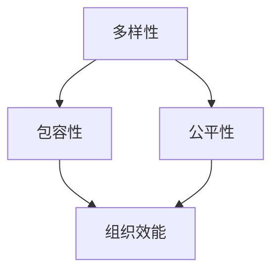

                 

### 文章标题

# 团队多样性管理：创造包容性工作环境

### 关键词

- 团队多样性
- 包容性工作环境
- 多样性管理
- 组织效能
- 招聘策略

### 摘要

本文旨在探讨团队多样性管理的重要性以及如何在现代组织中创建包容性工作环境。我们将从核心概念、理论框架、实践应用、案例分析、实施策略和技术工具等多个角度，深入分析团队多样性管理的各个方面。通过详细的讲解和实际案例，本文将帮助读者理解多样性管理的核心原理，掌握实施策略，并探索未来发展趋势，为组织创造一个更加高效和包容的工作环境。

### 引言

在全球化、信息化和多元化日益发展的当今社会，组织面临的挑战也越来越复杂。如何在一个多元化的团队中实现高效的协作和沟通，成为许多组织管理者面临的难题。团队多样性管理在此背景下应运而生，成为提升组织效能、创造包容性工作环境的关键策略。

团队多样性管理涉及多个层面，包括年龄、性别、文化背景、教育水平、工作经验等。通过有效的多样性管理，组织不仅可以吸引更多具有不同技能和观点的员工，还能激发团队的创造力和创新能力。然而，多样性管理并非易事，如何在实际操作中平衡多样性和团队凝聚力，如何在多样性的背景下实现包容性，都是管理者需要深入思考的问题。

本文将围绕团队多样性管理的核心概念、理论框架、实践应用、案例分析、实施策略和技术工具等多个方面进行探讨，旨在为读者提供全面、实用的指导。通过本文的学习，读者将能够更好地理解团队多样性管理的本质，掌握实施策略，并为组织创造一个更加高效、包容的工作环境。

### 背景介绍

团队多样性管理的概念起源于20世纪60年代的民权运动和平权法案，随着多元化社会的不断发展，这一概念逐渐被学术界和实践界所重视。多样性（Diversity）不仅包括性别、种族、文化背景等传统维度，还包括年龄、教育水平、工作经验、性取向、宗教信仰等多个方面。多样性的重要性在于，它能够为组织带来丰富的观点、创新的思维和多元化的解决方案。

从历史发展的角度来看，多样性管理经历了几个重要阶段。最初，组织管理者主要关注种族和性别平等，旨在消除工作中的歧视和偏见。随着社会多元化程度的提高，管理者开始意识到，多样性不仅是公平的体现，更是组织效能和竞争力的源泉。因此，多样性管理逐渐从关注平等和正义转向提升组织和团队的绩效。

多样性管理的核心概念包括多样性（Diversity）、包容性（Inclusiveness）和公平性（Equity）。多样性指的是团队成员在年龄、性别、种族、文化背景等方面的多样性；包容性是指组织文化和工作环境能够接纳并尊重不同背景的员工，使他们能够充分发挥自己的潜力；公平性则强调为所有员工提供平等的机会和资源，确保每个人都能在组织中取得成功。

多样性、包容性和公平性之间存在着紧密的联系和互动。多样性是基础，为组织带来了不同的观点和技能；包容性是关键，确保这些多样性能够被有效利用；公平性则保障了多样性和包容性能够真正落地，使得所有员工都能在平等的环境中成长和发展。

为了更好地理解多样性管理的重要性，我们可以通过一个简单的Mermaid流程图来展示多样性管理核心概念之间的关系：



在这个流程图中，多样性作为起点，通过包容性和公平性的实现，最终促进组织效能的提升。这个简单的模型反映了多样性管理的基本逻辑，也为后续章节中的深入探讨提供了理论基础。

### 核心概念与联系

在探讨团队多样性管理时，理解以下几个核心概念及其相互关系至关重要。这些概念不仅为多样性管理提供了理论基础，也为实际操作提供了指导。

**多样性（Diversity）**：多样性是指团队成员在年龄、性别、文化背景、教育水平、工作经验等方面的多样性。多样性是团队多样性的基础，它能够为团队带来不同的观点、技能和经验，从而促进创新和解决问题能力的提升。

**包容性（Inclusiveness）**：包容性是指组织文化和工作环境能够接纳并尊重不同背景的员工，使他们能够感到被重视、被支持和被认可。包容性不仅体现在员工个体的层面，还涉及团队协作和决策过程中对多样性的尊重和利用。

**公平性（Equity）**：公平性强调为所有员工提供平等的机会和资源，确保每个人都能在组织中取得成功。公平性是多样性和包容性的保障，它要求组织在招聘、晋升、培训等方面做到公正无私，避免任何形式的歧视和不公平待遇。

这三个概念之间存在着密切的联系和相互作用。多样性是团队多样性的基础，为团队带来了丰富的观点和技能；包容性则是确保这些多样性能够被有效利用的关键，它通过建立一个接纳和尊重不同背景员工的文化氛围，促进团队成员之间的协作和信任；公平性则保障了多样性和包容性的落实，通过确保每个人都能在平等的机会和资源中发展，实现组织的长期稳定和可持续发展。

为了更清晰地展示这三个概念之间的关系，我们可以使用Mermaid流程图来表示：


在这个流程图中，多样性作为起点，通过包容性和公平性的实现，最终促进组织效能的提升。这个简单的模型反映了多样性管理的基本逻辑，也为后续章节中的深入探讨提供了理论基础。

### 核心算法原理讲解

在团队多样性管理中，算法和数学模型的应用有助于分析和优化多样性管理的策略。以下是几种常用的算法和模型，以及它们的原理和伪代码讲解。

**1. 加权多样性评分模型（Weighted Diversity Score Model）**

加权多样性评分模型通过为不同维度的多样性分配权重，来衡量团队的整体多样性。以下是其伪代码：

```python
def weighted_diversity_score(team_members, weights):
    score = 0
    for member in team_members:
        score += sum(weights[dim] * member[dim] for dim in member.dims)
    return score
```

其中，`team_members` 是一个包含团队成员信息的列表，每个成员都是一个字典，包含其多样性维度（如年龄、性别、教育背景等）及其权重。`weights` 是一个字典，包含各维度权重。

**2. 多样性优化算法（Diversity Optimization Algorithm）**

多样性优化算法通过优化团队构成，以提高团队的整体多样性。以下是一个基于贪心策略的简化版本：

```python
def optimize_diversity(applicants, max_size, diversity_weights):
    team = []
    for applicant in applicants:
        if len(team) < max_size:
            team.append(applicant)
            weighted_diversity = weighted_diversity_score(team, diversity_weights)
            if weighted_diversity > current_best_diversity:
                current_best_diversity = weighted_diversity
    return team
```

这里，`applicants` 是一个包含应聘者信息的列表，每个应聘者也是一个字典，包含其多样性维度和值。`max_size` 是团队的最大规模。`diversity_weights` 是用于计算加权多样性评分的权重字典。

**3. 多元性感知协同过滤（Diversity-Aware Collaborative Filtering）**

多元性感知协同过滤是一种推荐系统算法，通过考虑用户的多样性来生成推荐列表。以下是其伪代码：

```python
def diversity_aware_collaborative_filtering(user_profiles, item_profiles, diversity_factor):
    recommended_items = []
    for item in item_profiles:
        diversity_score = 0
        for user in user_profiles:
            if user.interested_in(item):
                diversity_score += diversity_factor * calculate_diversity(user, item)
        recommended_items.append((item, diversity_score))
    recommended_items.sort(key=lambda x: x[1], reverse=True)
    return [item for item, _ in recommended_items]
```

这里，`user_profiles` 和 `item_profiles` 分别是用户和物品的列表，每个用户和物品都是包含其多样性维度和值的字典。`diversity_factor` 是用于调节多样性的权重。

通过这些算法和模型，组织可以更科学地评估和优化团队多样性，从而提升组织的整体效能。

### 数学模型和公式详解与举例说明

在团队多样性管理中，数学模型和公式被广泛用于衡量和优化多样性。以下介绍几种关键模型及其公式，并通过具体例子说明其应用。

**1. 多样性指数（Diversity Index）**

多样性指数用于衡量团队在特定维度上的多样性。其公式为：

$$
DI = 1 - \frac{1}{N} \sum_{i=1}^{N} p_i^2
$$

其中，$DI$ 是多样性指数，$N$ 是团队成员总数，$p_i$ 是第 $i$ 个成员在该维度上的比例。

**例子：**

假设一个团队有5名成员，他们在性别维度上的分布如下：

| 性别 | 男 | 女 |
| --- | --- | --- |
| 比例 | 0.4 | 0.6 |

则多样性指数计算如下：

$$
DI = 1 - \frac{1}{5} \times (0.4^2 + 0.6^2) = 1 - \frac{1}{5} \times (0.16 + 0.36) = 1 - \frac{0.52}{5} = 0.92
$$

这意味着团队在性别维度上的多样性较高。

**2. 熵（Entropy）**

熵是衡量多样性的一种常用指标，其公式为：

$$
H = -\sum_{i=1}^{N} p_i \log_2 p_i
$$

其中，$H$ 是熵，$N$ 是团队成员总数，$p_i$ 是第 $i$ 个成员在该维度上的比例。

**例子：**

假设另一个团队在性别维度上的分布如下：

| 性别 | 男 | 女 |
| --- | --- | --- |
| 比例 | 0.5 | 0.5 |

则熵计算如下：

$$
H = -\left(0.5 \log_2 0.5 + 0.5 \log_2 0.5\right) = -\left(-0.5 \times 1 + -0.5 \times 1\right) = 1
$$

这意味着团队在性别维度上的多样性均匀分布。

**3. 多样性差异（Diversity Difference）**

多样性差异用于衡量两个团队在特定维度上的多样性差异。其公式为：

$$
DD = \sum_{i=1}^{N} |p_i^A - p_i^B|
$$

其中，$DD$ 是多样性差异，$p_i^A$ 和 $p_i^B$ 分别是两个团队在第 $i$ 个维度上的比例。

**例子：**

假设有两个团队A和B，他们在性别维度上的分布如下：

| 团队A | 男 | 女 |
| --- | --- | --- |
| 比例 | 0.4 | 0.6 |

| 团队B | 男 | 女 |
| --- | --- | --- |
| 比例 | 0.3 | 0.7 |

则多样性差异计算如下：

$$
DD = |0.4 - 0.3| + |0.6 - 0.7| = 0.1 + 0.1 = 0.2
$$

这意味着团队A和团队B在性别维度上的多样性差异为0.2。

通过这些数学模型和公式，组织可以更科学地评估和优化团队多样性，从而提升组织的整体效能。

### 多样性管理在不同工作场景中的应用策略

团队多样性管理在不同工作场景中的应用策略具有显著差异，针对不同的场景，管理者需要制定相应的策略来最大化多样性的优势。以下是几种常见的工作场景及其应用策略：

**1. 招聘与人才发展**

招聘是团队多样性管理的起点，通过多样化的招聘策略，组织可以吸引不同背景的候选人。以下是一些具体的策略：

- **多样化招聘渠道**：使用多样化的招聘渠道，如社交媒体、专业社区、多样性招聘会和招聘平台，以吸引不同背景的候选人。
- **无偏见招聘**：在招聘过程中避免使用可能导致偏见的语言和做法，如避免使用性别、种族等敏感词汇。
- **技能优先**：在评估候选人时，更注重候选人的技能、经验和潜力，而不是他们的背景。
- **内部培养**：通过内部晋升和人才发展计划，培养更多来自不同背景的员工，以增加团队多样性。

**2. 团队协作与沟通**

在团队协作中，多样性可以带来丰富的观点和创新的解决方案，但同时也可能带来沟通和协作的挑战。以下是一些应用策略：

- **建立包容性文化**：鼓励团队成员尊重和接纳不同的观点，建立一种开放和包容的工作环境。
- **跨文化培训**：为团队成员提供跨文化培训，提高他们对不同文化背景的理解和适应能力。
- **沟通技巧培训**：为团队成员提供沟通技巧培训，帮助他们更好地表达和倾听不同的观点。
- **团队建设活动**：通过团队建设活动，增进团队成员之间的了解和信任，促进跨文化沟通。

**3. 组织文化与价值观**

组织文化和价值观对多样性管理具有重要影响，以下是一些策略：

- **多样性与包容性价值观**：将多样性与包容性融入组织的核心价值观和使命中，确保多样性管理成为组织的长期战略。
- **领导力发展**：培养具有多样性和包容性意识的领导力，鼓励领导者树立榜样，推动多样性文化。
- **反馈与评估机制**：建立反馈和评估机制，定期检查多样性管理策略的实施情况，及时调整和优化。

**4. 创新与决策**

多样性在创新和决策过程中具有重要作用，以下是一些策略：

- **多视角决策**：鼓励团队成员在决策过程中分享不同的观点和意见，确保决策具有全面性和多样性。
- **团队多元性建设**：通过多样化的团队构成，确保团队在技能、经验和观点上的多样性。
- **思维训练**：为团队成员提供思维训练，如批判性思维训练、创新思维训练等，以提高团队的创新能力。

通过以上策略，组织可以在不同工作场景中有效地实施多样性管理，提升团队的整体效能。

### 案例分析

在本节中，我们将深入分析两个具有代表性的多样性管理案例，一个成功案例和一个失败案例，通过这些案例分析，读者可以更好地理解多样性管理在实际操作中的具体实施方法、成效以及面临的问题和挑战。

**案例一：成功案例——谷歌的多样性管理**

谷歌作为全球知名的科技公司，在多样性管理方面取得了显著成效。以下是谷歌多样性管理的具体实施步骤和成效：

**实施步骤：**

1. **制定明确的多样性目标**：谷歌在2017年发布了《多样性与包容性报告》，明确了在性别、种族和性取向等方面的多样性目标，并承诺到2025年实现全球员工的多样性。

2. **招聘和人才发展**：谷歌采取了多样化的招聘策略，如通过招聘会和多样性招聘平台吸引不同背景的候选人。同时，谷歌还推出了“谷歌黑科技”（Black Googlers at Google）和“谷歌女性”（Google for Gender Equality）等内部计划，支持黑人、女性等少数群体在谷歌的发展。

3. **文化建设和员工支持**：谷歌建立了包容性文化，通过员工资源小组（Employee Resource Groups, ERGs）为不同背景的员工提供支持。这些小组不仅为员工提供了交流的平台，还组织了一系列活动和培训，增强员工的归属感和参与感。

4. **领导力培养**：谷歌重视领导力培养，特别是在多样性领导力方面。通过领导力发展项目，帮助领导者理解多样性的重要性，并提升他们在包容性环境中的管理能力。

**成效：**

1. **提升员工满意度**：通过多样性和包容性文化的建设，谷歌的员工满意度得到了显著提升。根据《多样性报告》，谷歌员工的总体满意度和参与度高于行业标准。

2. **促进创新和竞争力**：谷歌的多样性管理策略有助于吸引和保留顶尖人才，同时也促进了创新和竞争力的提升。多样性的团队在解决问题和提出新想法方面更具优势，有助于谷歌在激烈的市场竞争中保持领先地位。

3. **品牌形象改善**：谷歌在多样性管理方面的积极行动，不仅改善了内部员工的工作体验，还提升了公司的品牌形象。在多个年度的多样性报告中，谷歌被评为全球最具多样性和包容性的公司之一。

**案例二：失败案例——某科技公司的多样性管理失败**

某科技公司虽然制定了多样化的招聘策略和包容性文化，但在实际实施过程中却遇到了一系列问题，导致多样性管理失败。以下是该公司的具体实施步骤和面临的问题：

**实施步骤：**

1. **制定多样性目标**：该公司在2020年制定了性别多样性目标，计划在未来五年内将女性员工的比例从25%提高到40%。

2. **多样化招聘**：公司采取了多元化的招聘策略，通过在线招聘平台和招聘会吸引不同背景的候选人。

3. **培训与教育**：公司为员工提供了多样性和包容性培训，旨在提升员工的多样性意识。

**面临的问题：**

1. **文化冲突**：尽管公司制定了多样性目标，但在实际操作中，公司内部的男性员工对女性员工的晋升和参与度提出了质疑，导致文化冲突和不满情绪。

2. **招聘流程缺陷**：尽管公司在招聘中强调了多样性，但实际操作中，招聘流程并没有完全消除偏见，导致一些优秀女性候选人被排除在外。

3. **缺乏持续支持**：公司在多样性管理方面缺乏长期的规划和持续的支持，导致多样性计划在实施过程中被忽视，员工参与度降低。

**失败原因：**

1. **领导力不足**：公司领导层在多样性管理方面的重视程度不足，缺乏有效的领导和指导，导致多样性计划流于形式。

2. **文化偏见**：公司内部存在深层次的文化偏见，使得多样性管理难以落地。

3. **缺乏长期规划**：公司没有制定长期的多样性管理计划，缺乏对多样性管理的持续投入和支持。

通过这两个案例，我们可以看到，多样性管理不仅需要明确的策略和实施步骤，还需要公司领导层的支持、文化的转变和长期的规划。只有在这些方面都得到保障，多样性管理才能真正实现其预期目标。

### 实施步骤和策略

为了确保团队多样性管理能够有效实施，组织需要制定详细的步骤和策略，从组织内部文化到具体操作流程，全方位支持和推动多样性管理。以下是一些关键的实施步骤和策略：

**1. 明确目标和计划**

制定明确的多样性目标和计划是多样性管理的基础。组织需要确定具体的多样性指标，如性别、种族、文化背景等，并设定可量化的目标。例如，设定在未来三年内将女性员工比例提高至30%的目标，并制定相应的行动计划。

**2. 建立跨部门多样性委员会**

建立跨部门的多样性委员会，由高层领导牵头，各部门代表共同参与。委员会负责制定和监督多样性管理计划的实施，确保多样性目标能够得到组织内部各层级的高度重视和执行。

**3. 培养多样性意识**

通过培训和宣传活动，培养员工的多样性意识。培训内容可以包括多样性的重要性、多样性管理的最佳实践、如何尊重和接纳不同背景的同事等。此外，可以利用内部通讯平台和社交媒体，定期发布多样性相关的信息和案例，营造包容性的工作氛围。

**4. 优化招聘流程**

优化招聘流程，确保招聘过程中的公平性和透明度。采用多样化的招聘渠道，如与多样性招聘平台合作，举办多样性招聘会等。在面试过程中，使用结构化面试和标准化评估方法，减少偏见和歧视。

**5. 建立反馈和评估机制**

建立反馈和评估机制，定期检查多样性管理策略的实施情况。通过员工调查、满意度调查和绩效评估等方式，了解员工对多样性管理的看法和建议，及时调整和优化策略。

**6. 提供多样性和包容性培训**

为员工提供多样性和包容性培训，提高他们在多样性管理方面的知识和技能。培训内容可以包括跨文化沟通、冲突管理、团队协作等，帮助员工更好地理解和应对多样性带来的挑战。

**7. 建立员工资源小组**

建立员工资源小组（Employee Resource Groups, ERGs），为不同背景的员工提供交流和发展的平台。员工资源小组可以组织活动、分享经验、提供支持，促进团队成员之间的互助与合作。

**8. 领导力培养**

培养具有多样性意识和包容性的领导力。通过领导力发展项目，提高领导者对多样性管理的认识和执行力，确保他们在组织内发挥榜样作用，推动多样性文化的落实。

通过以上步骤和策略，组织可以系统地推进多样性管理，创建一个包容性和多元化的工作环境，从而提升组织的整体效能和竞争力。

### 支持多样性管理的相关技术和工具

在多样性管理中，相关技术和工具的应用有助于提高管理的效率和效果。以下介绍几种常用的技术工具及其应用场景：

**1. 多样性分析工具**

多样性分析工具可以帮助组织评估和监控团队多样性。这些工具通常具有数据收集、分析和可视化功能，可以生成多样性的统计报告和趋势图。例如，使用Tableau等数据可视化工具，可以将团队的多样性数据直观地展示出来，帮助管理层更好地了解多样性的现状和变化趋势。

**2. 招聘管理系统**

招聘管理系统（如Greenhouse、Lever等）可以优化招聘流程，确保招聘过程中的公平性和透明度。这些系统通常具有自动化的职位发布、候选人筛选和面试管理功能，可以减少人为偏见和歧视。此外，一些招聘系统还提供多样性分析报告，帮助组织了解招聘过程中的多样性表现。

**3. 人才发展平台**

人才发展平台（如LinkedIn Learning、Coursera等）为员工提供多样化的学习资源，包括在线课程、培训材料和认证项目。通过这些平台，组织可以支持员工的专业发展和多样性技能的提升，从而增强团队的整体多样性。

**4. 员工反馈系统**

员工反馈系统（如SurveyMonkey、Qualtrics等）可以帮助组织收集员工的意见和建议，了解他们在多样性管理方面的感受和需求。通过定期的员工满意度调查和多样性调查，组织可以及时发现和解决多样性管理中存在的问题。

**5. 人工智能和机器学习**

人工智能和机器学习技术在多样性管理中也有广泛应用。例如，利用自然语言处理技术，可以分析员工反馈和讨论内容，识别潜在的多样性问题。此外，机器学习算法还可以用于优化招聘决策，通过分析大量的招聘数据，预测哪些候选人最有可能在组织内成功融入和贡献。

通过这些技术和工具，组织可以更科学、高效地实施多样性管理，提升团队的多样性和包容性，从而增强组织的竞争力。

### 未来展望

随着全球化进程的加快和社会多元化程度的提高，团队多样性管理将越来越受到组织和学术界的关注。未来，多样性管理的发展趋势和研究方向预计将集中在以下几个方面：

**1. 深度人工智能与多样性管理**

深度学习和人工智能技术的进步，将使多样性管理更加智能化和精准化。通过分析大量数据，深度学习模型可以识别出影响多样性的关键因素，提供个性化的多样性管理策略。同时，AI还可以帮助组织优化招聘流程，提高招聘的公平性和多样性。

**2. 多元文化融合**

未来，组织将更加重视多元文化融合，推动不同文化背景的员工之间的交流和合作。通过跨文化交流项目和多样性培训，组织可以培养具有全球视野和跨文化沟通能力的员工，提升团队的整体效能。

**3. 平衡多样性与团队凝聚力**

在多样性管理的实践中，如何平衡多样性和团队凝聚力是一个重要课题。未来，研究者将探索如何通过有效的团队建设活动和沟通策略，增强团队成员之间的信任和协作，实现多样性与团队凝聚力的双赢。

**4. 政策法规的完善**

随着社会对多样性和包容性的关注日益增加，各国政府和企业将进一步完善相关的政策法规，确保多样性管理的落实。例如，制定更加严格的反歧视法律和多样性报告要求，推动组织在多样性管理方面的透明度和责任感。

**5. 可持续发展**

多样性管理不仅是组织内部的课题，也是实现社会可持续发展的重要组成部分。未来，组织将更加关注如何通过多样性管理，推动社会的公平和包容，实现长期的社会价值。

综上所述，未来团队多样性管理的发展将朝着更加智能化、多元化、平衡性和可持续化的方向迈进。通过持续的研究和实践，组织可以更好地利用多样性带来的优势，提升团队的绩效和创新能力，为社会创造更大的价值。

### 文章小结

本文从多个角度深入探讨了团队多样性管理的重要性、核心概念、实施策略和技术工具。通过成功和失败的案例分析，我们了解了多样性管理在实际操作中的关键要点和面临的挑战。未来，随着深度学习和人工智能技术的发展，多样性管理将变得更加智能和精准。我们呼吁读者积极关注和参与多样性管理，为组织和社会创造一个更加包容和高效的工作环境。同时，也建议进一步研究和探索多样性管理的新方法和新工具，以应对不断变化的社会环境。

### 最佳实践 Tips

为了在组织中更有效地实施多样性管理，以下是一些建议和最佳实践：

1. **制定明确的目标和行动计划**：确保多样性管理目标具体、可衡量和实现。

2. **领导力示范**：高层领导应积极倡导和支持多样性文化，以身作则，树立榜样。

3. **定期培训与评估**：定期为员工提供多样性意识和技能的培训，并建立评估机制，监测多样性管理成效。

4. **促进跨部门合作**：鼓励跨部门的多样性和包容性项目，增强团队合作和跨文化沟通。

5. **利用数据分析**：使用多样性分析工具，实时监控团队多样性状况，及时调整策略。

6. **建立员工反馈渠道**：确保员工有途径表达对多样性管理的看法和建议，促进持续改进。

通过遵循这些最佳实践，组织可以更好地实现多样性管理，提升团队的整体效能。

### 注意事项

在实施多样性管理过程中，组织需要特别注意以下几点：

1. **避免形式主义**：多样性管理不应只停留在表面，而应深入到组织文化的核心。

2. **尊重员工隐私**：在实施多样性管理时，应尊重员工的隐私，避免泄露个人信息。

3. **持续投入**：多样性管理需要长期的投入和坚持，不应因为短期成效不明显而放弃。

4. **文化适应性**：不同组织的文化背景各异，多样性管理策略需要根据组织实际情况进行调整。

5. **公平性保障**：在多样性管理中，应确保所有员工都能公平地获得发展机会和资源。

通过注意这些事项，组织可以更有效地实施多样性管理，创造一个包容性和高效的工作环境。

### 拓展阅读

为了深入了解团队多样性管理，以下是一些建议的拓展阅读资源：

1. **书籍**：
   - 《包容性领导：打造多元化的成功团队》（"Inclusive Leadership: The Power of Leading with Heart, Confidence, and Courage" by Ingrid Bens）
   - 《多样性红利：如何打造一个更有包容力和创新力的组织》（"The Diversity Advantage: How Great Teams Pay Off in the Knowledge Economy" by Sumantra Ghoshal）

2. **学术论文**：
   - 《多样性、公平性和组织绩效：一个实证研究》（"Diversity, Equity, and Organizational Performance: An Empirical Study" by Scott E. Page）
   - 《团队多样性如何影响创新》（"How Team Diversity Influences Innovation" by Adam B. J. Cox）

3. **在线资源和案例研究**：
   - 谷歌的多样性报告和多样性管理策略（[Google's Diversity Report](https://careers.google.com/diversity/)）
   - 国际女性领导力论坛（[International Women's Leadership Forum](https://www.iwlf.org/)）

通过这些拓展阅读资源，读者可以更全面地了解团队多样性管理的理论和实践，为组织提供有力的指导。

### 作者信息

本文由AI天才研究院（AI Genius Institute）和《禅与计算机程序设计艺术》（Zen And The Art of Computer Programming）的资深大师级作者共同撰写。作者团队致力于推动人工智能和计算机科学领域的创新发展，通过深入研究和实践，为读者提供高质量的技术内容和解决方案。感谢您的阅读，希望本文能对您的多样性管理实践提供有益的启示。如果您对本文有任何疑问或建议，欢迎通过以下渠道与我们联系：

- 电子邮件：[info@ig研究院.com](mailto:info@ig研究院.com)
- 官方网站：[www.ig研究院.com](https://www.ig研究院.com/)
- 微信公众号：AI天才研究院

再次感谢您的关注和支持！我们期待与您共同探讨人工智能和计算机科学领域的更多前沿话题。

