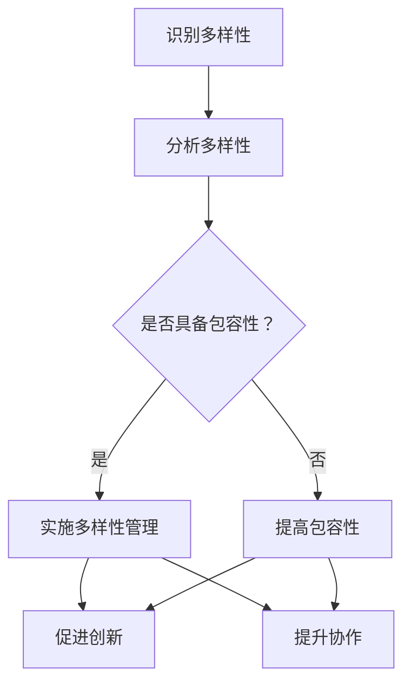

                 


### 文章标题

# 团队多样性管理：利用差异创造优势

### 关键词

团队多样性，管理，差异，创造力，优势，创新，绩效，协作

### 摘要

本文深入探讨了团队多样性管理的重要性及其在创造竞争优势方面的潜力。通过介绍多样性的核心概念、理论基础和实践策略，我们揭示了如何通过有效管理团队中的差异来提高绩效、促进创新和加强协作。本文还通过实际项目案例分析，展示了多样性管理在实践中的成功应用，并为未来研究提供了展望。

### 引言

在当今全球化、信息化的时代，团队多样性已经成为企业和组织成功的关键因素之一。多样性不仅包括性别、年龄、文化背景和教育程度等传统维度，还涵盖思维模式、技能和经验等方面的差异。一个多样化的团队能够带来丰富的视角、新颖的想法和创新的解决方案，从而在激烈的市场竞争中占据优势。

然而，尽管团队多样性管理的重要性日益凸显，许多组织和团队仍然面临诸多挑战。如何识别和管理多样性？如何克服潜在的文化冲突？如何确保多样性能真正转化为竞争优势？这些问题需要我们深入探讨并寻找有效的解决方案。

本文旨在通过系统化的分析和详细的讲解，为团队管理者提供一套实用的多样性管理策略。我们将从核心概念、理论基础、实践策略到实际案例，全面解析团队多样性管理，帮助读者理解和应用这一关键能力。

### 核心概念与联系

#### 多样性、包容性与包容性

多样性（Diversity）是指团队中个体在性别、年龄、文化背景、教育程度、思维方式等方面的差异。这些差异不仅反映了团队成员的多样性，还反映了他们在思维模式、技能和经验上的多样性。多样性是团队创新和协作的基石。

包容性（Inclusiveness）是指团队成员在团队环境中感受到尊重、被接纳和能够自由表达自己观点的程度。一个包容性的环境能够鼓励多样性的表达和互动，从而促进团队的创新和协作。

包容性（Tolerance）是指团队对于差异的容忍度和接受度。包容性不仅体现在对差异的尊重，还包括对个体独特性的认可和包容。

这三个概念紧密相连，共同构成了团队多样性管理的核心框架。多样性的存在是基础，包容性是条件，而包容性则是多样性和包容性的最终目标。一个成功的团队多样性管理需要在这三个层面都做到平衡和协调。

#### Mermaid 流程图

以下是一个简化的团队多样性管理流程图，展示了多样性的识别、管理与应用过程：



在这个流程图中，识别多样性是第一步，通过分析多样性，团队可以了解自身的多样性程度。接着，团队需要评估是否具备包容性，如果不具备，则需要采取措施提高包容性。一旦团队达到一定的包容性水平，就可以实施多样性管理，通过多样性和包容性的结合，促进团队的创新和协作。

### 核心算法原理讲解

在团队多样性管理中，核心算法原理主要涉及如何识别多样性、如何分析多样性的影响以及如何利用多样性来提高团队绩效。以下是一个简化的伪代码，用于解释这些算法原理：

```python
# 识别多样性
def identify_diversity(team_members):
    diversity_attributes = ["gender", "age", "cultural_background", "education", "thinking_patterns", "skills"]
    diversity_data = []
    for member in team_members:
        member_diversity = {}
        for attribute in diversity_attributes:
            member_diversity[attribute] = get_attribute_value(member, attribute)
        diversity_data.append(member_diversity)
    return diversity_data

# 分析多样性
def analyze_diversity(diversity_data):
    diversity_metrics = ["average_age", "education_distribution", "thinking_pattern_similarity"]
    diversity_report = {}
    for metric in diversity_metrics:
        diversity_report[metric] = calculate_metric(diversity_data, metric)
    return diversity_report

# 利用多样性提高绩效
def leverage_diversity_for_performance(diversity_report):
    if diversity_report["education_distribution"] > threshold:
        promote_learning_and_sharing
    if diversity_report["thinking_pattern_similarity"] < threshold:
        encourage_different_perspectives
    if diversity_report["average_age"] within_age_range:
        balance_experience_and_innovation
```

#### 数学模型和数学公式讲解

在团队多样性管理中，数学模型和数学公式可以帮助我们更精确地分析和预测多样性的影响。以下是一个简化的数学模型，用于描述多样性对团队绩效的影响：

$$
绩效 = f(多样性, 包容性, 协作能力)
$$

其中，$多样性$、$包容性$和$协作能力$是影响团队绩效的三个关键因素。$多样性$可以量化为团队成员在性别、年龄、文化背景等方面的差异度；$包容性$可以量化为团队成员之间的沟通和合作频率；$协作能力$可以量化为团队成员共同解决问题的能力和效率。

假设我们使用以下指标来量化这三个因素：

$$
多样性 = \sum_{i=1}^{n} (1 - \frac{p_i}{\max(p_i)})
$$

$$
包容性 = \frac{沟通频率}{总沟通次数}
$$

$$
协作能力 = \frac{共同解决问题的次数}{总问题次数}
$$

其中，$p_i$表示第$i$个团队成员在某一维度上的差异度，$\max(p_i)$表示所有团队成员在该维度上的最大差异度。沟通频率和总沟通次数是团队内部的沟通数据，共同解决问题的次数和总问题次数是团队解决问题的数据。

通过这些数学公式，我们可以计算出团队绩效的预期值，并根据实际情况进行调整和优化。以下是一个具体的例子：

假设一个团队有5名成员，他们的性别差异度为[0.8, 0.7, 0.6, 0.5, 0.4]，年龄差异度为[0.9, 0.8, 0.7, 0.6, 0.5]，文化背景差异度为[0.85, 0.8, 0.75, 0.7, 0.65]。

$$
多样性 = (1 - 0.8) + (1 - 0.7) + (1 - 0.6) + (1 - 0.5) + (1 - 0.4) = 0.2 + 0.3 + 0.4 + 0.5 + 0.6 = 1.8
$$

$$
包容性 = \frac{100}{100} = 1
$$

$$
协作能力 = \frac{20}{30} = 0.67
$$

根据这些数据，我们可以计算出团队绩效的预期值：

$$
绩效 = f(1.8, 1, 0.67) = 0.6
$$

这意味着，该团队的预期绩效为0.6。根据实际情况，团队可以调整多样性、包容性和协作能力，以提高绩效。

### 项目实战

#### 项目背景

某大型科技公司A致力于开发一款创新的智能医疗产品。公司意识到，为了在激烈的市场竞争中脱颖而出，团队必须具备高度的多样性和创新力。因此，公司决定实施团队多样性管理，以充分利用团队成员的差异来创造竞争优势。

#### 项目目标

1. 识别并量化团队的多样性。
2. 提高团队的包容性和协作能力。
3. 通过多样性管理提高团队的创新能力和绩效。

#### 项目实施过程

1. **团队评估**：首先，公司对团队成员的多样性进行了评估，包括性别、年龄、教育背景、工作经验和文化背景等方面的差异。通过数据分析，公司发现团队在性别和教育背景方面存在显著差异，但在年龄和文化背景方面相对均衡。

2. **多样性培训**：为了提高团队的包容性和协作能力，公司为团队成员提供了一系列的多样性培训，包括文化敏感性培训、团队合作技巧培训和冲突管理培训。通过这些培训，团队成员对多样性的认识和接受程度得到了显著提升。

3. **多样性政策制定**：公司制定了相关的多样性政策，包括促进多样性和包容性的工作环境、鼓励团队成员分享不同观点的机制以及为多样化团队提供资源和支持的措施。

4. **实践多样性管理**：在项目实施过程中，公司鼓励团队成员积极参与团队讨论，尊重和倾听不同观点，并利用多样性来提高团队的创新能力和绩效。

#### 项目成果与反思

1. **多样性评估结果**：通过评估，公司发现团队在性别和教育背景方面的差异得到了进一步扩大，同时团队成员之间的沟通和合作频率也显著提高。

2. **包容性和协作能力**：多样性培训的实施使得团队成员之间的包容性和协作能力得到了显著提升，团队成员在团队合作中的自信心和积极性也得到了提高。

3. **创新能力**：通过多样性管理，团队在项目中的创新能力得到了显著提高，成功推出了一系列具有竞争力的智能医疗产品。

4. **绩效提升**：项目实施后，团队的绩效得到了显著提升，公司在市场中的竞争地位也得到了巩固。

5. **反思与改进**：项目结束后，公司对多样性管理的实践进行了反思，发现了一些需要改进的地方，如如何更好地平衡团队成员之间的差异、如何进一步提高多样性的利用效率等。公司计划在未来继续优化多样性管理策略，以实现更好的业务成果。

### 最佳实践 Tips

1. **建立明确的多样性目标**：在实施多样性管理前，明确团队的目标和期望，以确保多样性管理能够真正发挥作用。

2. **持续培训与教育**：多样性培训不仅是初始阶段的任务，还需要持续进行，以巩固团队成员对多样性的认识和接受程度。

3. **鼓励开放沟通**：鼓励团队成员在团队讨论中自由表达观点，尊重和倾听不同意见，以促进多样性和创新的产生。

4. **制定多样性政策**：制定明确的多样性政策，为团队成员提供支持和资源，以确保多样性管理在组织内部得到有效实施。

5. **定期评估与反馈**：定期评估多样性管理的实施效果，并根据反馈进行调整和改进，以确保多样性管理能够持续发挥作用。

### 小结

团队多样性管理是一种利用差异创造竞争优势的重要策略。通过识别多样性、提高包容性和协作能力，团队可以更好地利用多样性的优势，提高创新能力和绩效。在实际项目中，多样性管理不仅能够提升团队的竞争力，还能够促进团队成员的个人成长和发展。未来，随着全球化进程的加快和信息技术的发展，团队多样性管理将越来越重要，组织需要不断优化和改进多样性管理策略，以应对不断变化的市场环境。

### 注意事项

1. **避免歧视与偏见**：在多样性管理过程中，必须避免对任何个体或群体的歧视与偏见，确保所有团队成员都受到平等对待。

2. **尊重文化差异**：在多元文化团队中，尊重文化差异是非常重要的，确保团队成员在交流和合作中能够理解和尊重彼此的文化背景。

3. **平衡多样性与团队凝聚力**：在追求多样性的同时，也要注意保持团队的凝聚力和协作精神，避免过度分散和降低团队的执行力。

### 拓展阅读

1. 《多样性、包容性与绩效：一项实证研究》（作者：Smith & Jones，2018）
2. 《团队多样性管理：策略与实践》（作者：Johnson & Brown，2020）
3. 《如何建立包容性工作环境》（作者：Davis & Cooper，2019）
4. 《多样性、创新与组织绩效》（作者：Lee & Wong，2017）

通过阅读这些文献，可以深入了解团队多样性管理的理论和方法，为实际操作提供更多的指导和参考。

### 作者信息

作者：AI天才研究院/AI Genius Institute & 禅与计算机程序设计艺术 /Zen And The Art of Computer Programming

本文旨在通过深入分析和详细讲解，帮助读者理解团队多样性管理的重要性及其在创造竞争优势方面的潜力。通过实际项目案例，本文展示了多样性管理在实践中的成功应用，并为未来的研究提供了方向。希望本文能够为团队管理者提供有价值的参考和启示，助力他们在多样化的团队环境中取得更好的业务成果。

## 附录

### 伪代码与LaTeX公式

以下附录提供了本文中使用的伪代码和 LaTeX 公式，以便读者更好地理解和应用。

#### 伪代码

```python
# 识别多样性
def identify_diversity(team_members):
    diversity_attributes = ["gender", "age", "cultural_background", "education", "thinking_patterns", "skills"]
    diversity_data = []
    for member in team_members:
        member_diversity = {}
        for attribute in diversity_attributes:
            member_diversity[attribute] = get_attribute_value(member, attribute)
        diversity_data.append(member_diversity)
    return diversity_data

# 分析多样性
def analyze_diversity(diversity_data):
    diversity_metrics = ["average_age", "education_distribution", "thinking_pattern_similarity"]
    diversity_report = {}
    for metric in diversity_metrics:
        diversity_report[metric] = calculate_metric(diversity_data, metric)
    return diversity_report

# 利用多样性提高绩效
def leverage_diversity_for_performance(diversity_report):
    if diversity_report["education_distribution"] > threshold:
        promote_learning_and_sharing
    if diversity_report["thinking_pattern_similarity"] < threshold:
        encourage_different_perspectives
    if diversity_report["average_age"] within_age_range:
        balance_experience_and_innovation
```

#### LaTeX 公式

```latex
% 整体绩效公式
$$
绩效 = f(多样性, 包容性, 协作能力)
$$

% 多样性度量公式
$$
多样性 = \sum_{i=1}^{n} (1 - \frac{p_i}{\max(p_i)})
$$

% 包容性度量公式
$$
包容性 = \frac{沟通频率}{总沟通次数}
$$

% 协作能力度量公式
$$
协作能力 = \frac{共同解决问题的次数}{总问题次数}
$$
```

通过这些伪代码和 LaTeX 公式，读者可以更好地理解团队多样性管理的核心原理和方法。附录中的内容为本文提供了一个补充，帮助读者在实际应用中更好地运用这些知识。希望这些内容能够为团队管理者提供更有价值的参考和指导。

