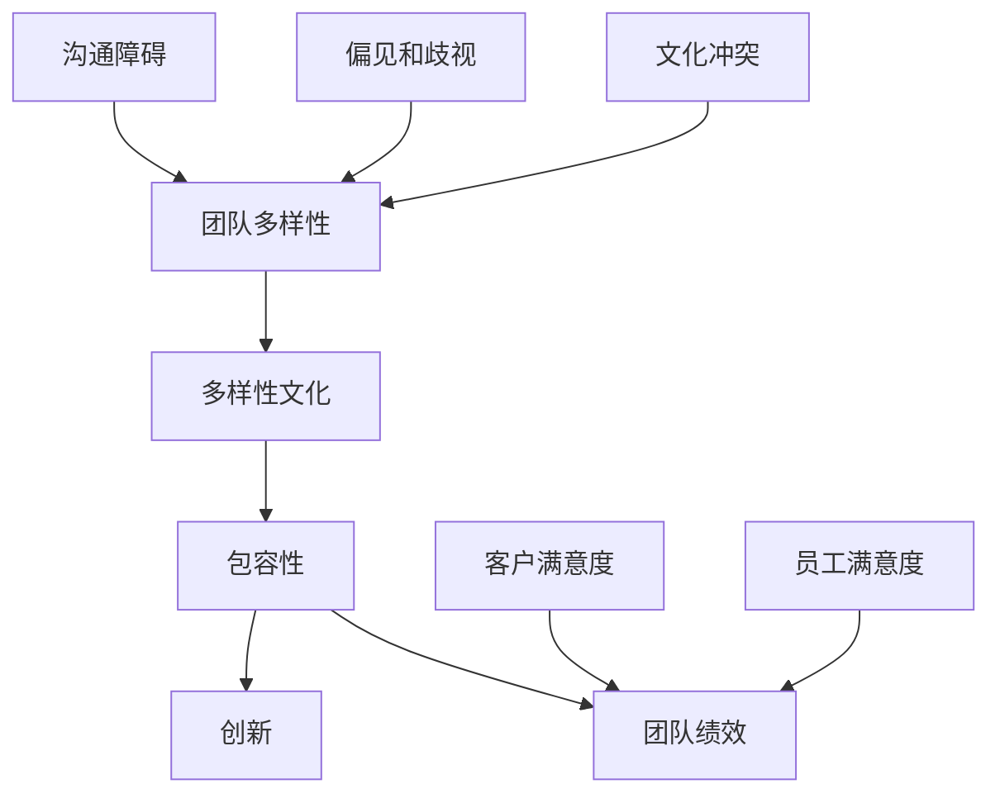

                 

### 文章标题：团队多样性管理：包容性领导力

在当今快速变化的世界中，团队多样性管理已经成为企业成功的关键因素。随着全球化和技术的进步，企业需要具备多元化的视角和技能来应对复杂的市场环境。本文将深入探讨团队多样性管理的核心概念，以及如何通过包容性领导力来实现这一目标。

### 关键词：

- **团队多样性管理**
- **包容性领导力**
- **团队绩效**
- **文化变革**
- **冲突管理**
- **招聘与保留策略**
- **项目管理**
- **评估与改进**

### 摘要：

本文首先介绍了团队多样性管理的背景和重要性，然后详细阐述了包容性领导力的概念及其关键要素。接下来，文章将探讨如何构建包容性文化，管理多样性冲突，实施多样性招聘与保留策略，以及在项目管理中的应用。通过案例分析，本文展示了成功实践的范例，并提供了一些最佳实践和未来展望。

---

### 目录大纲：

## 第一部分：背景与概念

### 第1章 引言

- 多样性管理的概念
- 包容性领导力的定义
- 本书的目标与结构

### 第2章 多样性在团队中的重要性

- 多样性的类型
- 多样性与团队绩效的关系
- 多样性对创新的影响

## 第二部分：构建包容性团队

### 第3章 建立包容性文化

- 包容性文化的特征
- 如何建立包容性文化
- 文化变革的策略

### 第4章 领导力与多样性管理

- 领导者在多样性管理中的作用
- 包容性领导力的关键要素
- 领导力的提升策略

### 第5章 管理多样性冲突

- 冲突的类型与来源
- 冲突管理的策略
- 包容性沟通技巧

## 第三部分：多样性管理的实践

### 第6章 多样性招聘与保留策略

- 多样性招聘的挑战与机会
- 多样性保留策略
- 多样性培训与发展的角色

### 第7章 多样性在项目管理中的应用

- 项目多样性管理的关键环节
- 多样性在项目团队中的优势
- 多样性在项目风险管理中的作用

### 第8章 多样性管理的评估与改进

- 多样性管理评估的方法
- 多样性管理改进的步骤
- 持续改进的策略

## 第四部分：案例分析

### 第9章 多样性管理的成功案例

- 案例分析
- 经验与教训

### 第10章 包容性领导力实践

- 包容性领导力的实践案例
- 包容性领导力对团队绩效的影响

## 第五部分：结论与展望

### 第11章 总结与展望

- 多样性管理的未来趋势
- 包容性领导力的挑战与机遇

---

### 具体内容：

#### 引言

团队多样性管理是一种战略方法，旨在通过多元化视角和技能的融合，提高团队的整体绩效和创新力。随着全球化和技术进步，组织需要更加开放和包容，以适应多变的市场环境。本文将从以下方面展开讨论：

1. **多样性管理的概念**：介绍多样性的类型及其在团队中的作用。
2. **包容性领导力的定义**：探讨包容性领导力的关键要素和实施策略。
3. **构建包容性文化**：分析如何建立和维持包容性文化。
4. **管理多样性冲突**：提供冲突管理和包容性沟通技巧。
5. **多样性招聘与保留策略**：探讨如何在招聘和保留员工中实施多样性策略。
6. **项目管理中的应用**：讨论多样性在项目管理中的重要性。
7. **评估与改进**：介绍多样性管理的评估方法及改进策略。
8. **成功案例**：分析多样性管理的成功实践。
9. **未来展望**：讨论多样性管理的未来趋势和包容性领导力的挑战。

通过本文的讨论，读者将了解团队多样性管理的重要性，掌握构建包容性团队的策略和实践方法，以及如何通过包容性领导力提升团队绩效。

---

#### 背景介绍

多样性管理是一种旨在提高组织整体效能的战略方法，通过吸纳和利用不同背景、经验和技能的员工，促进创新和团队协作。多样性不仅仅是指种族、性别、年龄和文化背景的多样化，还包括思维方式、价值观和工作习惯的差异。

**多样性管理的重要性**：

1. **团队绩效**：多样化的团队能够带来更多的视角和想法，有助于解决问题和创新。研究表明，多样化团队在决策过程中更容易发现潜在的风险和机会。

2. **创新**：不同背景的员工能够提供独特的见解和解决方案，从而推动创新。例如，一个由不同文化背景的工程师组成的团队可能会开发出更适合国际市场的产品。

3. **客户满意度**：多样化的团队能够更好地理解和满足不同客户群体的需求，提高客户满意度。

4. **员工满意度**：多样性和包容性文化能够提升员工的满意度和忠诚度，减少员工流失。

**多样性管理面临的挑战**：

1. **文化冲突**：不同文化背景的员工可能在价值观和工作方式上存在差异，导致文化冲突。

2. **偏见和歧视**：尽管组织可能制定了多样性政策，但员工可能仍然存在偏见和歧视行为。

3. **沟通障碍**：不同的沟通风格和语言能力可能导致沟通障碍，影响团队协作。

**多样性管理的目标**：

1. **建立包容性文化**：通过建立包容性文化，鼓励员工表达自己的观点，并尊重他人的差异。

2. **提高团队效能**：通过优化团队结构，利用多样化的优势和弥补不足。

3. **促进创新**：鼓励员工分享不同的见解和想法，推动创新和改进。

4. **提升客户满意度**：更好地理解和满足不同客户群体的需求。

---

#### 核心概念与联系

多样性管理中的核心概念包括多样性、包容性、团队绩效和创新。这些概念之间的关系可以通过以下Mermaid流程图进行展示：



- **团队多样性（A）**：指团队成员在性别、种族、年龄、文化背景、技能等方面的多样性。
- **多样性文化（B）**：指组织内部对多样性的接受和尊重，以及如何在文化层面融入多样性。
- **包容性（C）**：指在组织内部创造一个所有成员都能感到被尊重和归属的环境。
- **团队绩效（D）**：指团队在完成任务、达成目标方面的表现。
- **创新（E）**：指团队在产品开发、服务设计等方面的新思路和新方法。
- **客户满意度（F）**：指客户对组织产品或服务的满意程度。
- **员工满意度（G）**：指员工对工作的满意程度。

这些概念之间的关系是相互影响的。多样性文化（B）的建立可以促进包容性（C），进而提高团队绩效（D）和创新（E）。团队绩效（D）的提升会带来客户满意度（F）的提高，而员工的满意度（G）又会促进团队绩效（D）的提升。同时，文化冲突（H）、偏见和歧视（I）、沟通障碍（J）可能会对团队多样性（A）产生负面影响。

通过这个流程图，我们可以清晰地看到多样性管理中的核心概念及其相互联系，为后续章节的深入探讨提供了基础。

---

#### 核心算法原理讲解

在多样性管理中，核心算法原理主要涉及如何通过数学模型和伪代码来优化团队结构和提升团队绩效。以下是一个简单的伪代码示例，展示了如何利用多样性来提升团队创新能力和决策质量：

```python
# 伪代码：团队多样性提升算法

function ImproveTeamDiversity(team_members):
    # 初始化团队成员列表
    diversity_score = 0
    current_team = team_members
    
    # 计算初始多样性得分
    diversity_score = CalculateDiversityScore(current_team)
    
    # 循环迭代，寻找最优多样性组合
    while diversity_score < MaxDiversityScore:
        # 随机选择一个团队成员
        selected_member = RandomlySelectMember(current_team)
        
        # 替换团队成员，计算新多样性得分
        new_team = ReplaceMember(current_team, selected_member)
        new_diversity_score = CalculateDiversityScore(new_team)
        
        # 比较新旧多样性得分，选择最佳组合
        if new_diversity_score > diversity_score:
            current_team = new_team
            diversity_score = new_diversity_score
            
        # 更新迭代次数
        iteration_count += 1
    
    return current_team

function CalculateDiversityScore(team):
    # 计算团队多样性得分
    diversity_score = 0
    
    # 根据不同维度（如性别、文化背景、技能等）计算得分
    for dimension in DiversityDimensions:
        score = CalculateDimensionScore(team, dimension)
        diversity_score += score
    
    return diversity_score

function RandomlySelectMember(team):
    # 随机选择团队成员
    return random.choice(team)

function ReplaceMember(team, member_to_replace):
    # 替换团队成员
    new_team = team.copy()
    new_team.remove(member_to_replace)
    return new_team
```

这个算法的基本思想是通过随机替换团队成员，并计算替换后的团队多样性得分，不断迭代寻找最优的多样性组合。多样性得分可以根据不同的维度（如性别、文化背景、技能等）进行计算，从而确保团队在多个方面都具有较高的多样性。

以下是多样性得分的计算示例：

```python
# 伪代码：多样性得分计算示例

def CalculateDimensionScore(team, dimension):
    # 计算某个维度的多样性得分
    scores = []
    for member in team:
        score = GetDimensionScore(member, dimension)
        scores.append(score)
    
    # 计算得分的平均值
    dimension_score = sum(scores) / len(scores)
    return dimension_score

def GetDimensionScore(member, dimension):
    # 根据成员的某个维度特征计算得分
    if dimension == "性别":
        return 1 if member.gender != "男性" else 0
    elif dimension == "文化背景":
        return 1 if member.culture != "西方" else 0
    elif dimension == "技能":
        return 1 if member.skill != "编程" else 0
```

通过这个算法，组织可以不断优化团队结构，提升团队多样性和创新能力，从而在激烈的市场竞争中脱颖而出。

---

#### 数学模型和公式

在多样性管理中，数学模型和公式可以用于评估团队的多样性和绩效，从而提供量化的决策依据。以下是一个简单的数学模型，用于计算团队多样性得分：

$$
Diversity\ Score = \sum_{i=1}^{n} w_i \cdot D_i
$$

其中：

- $Diversity\ Score$ 表示团队的多样性得分。
- $w_i$ 表示第 $i$ 个维度的权重。
- $D_i$ 表示第 $i$ 个维度的多样性得分。

例如，假设团队中有三个维度：性别、文化背景和技能，每个维度的权重分别为 $0.3$、$0.4$ 和 $0.3$。则可以使用以下公式计算团队多样性得分：

$$
Diversity\ Score = 0.3 \cdot D_{性别} + 0.4 \cdot D_{文化背景} + 0.3 \cdot D_{技能}
$$

其中：

- $D_{性别}$ 表示性别多样性的得分，例如可以设置为 $1$ 如果团队中至少有 $50\%$ 的女性，否则为 $0$。
- $D_{文化背景}$ 表示文化背景的得分，例如可以设置为 $1$ 如果团队中有至少 $3$ 个不同的文化背景，否则为 $0$。
- $D_{技能}$ 表示技能多样性的得分，例如可以设置为 $1$ 如果团队中至少有 $3$ 个不同的技能，否则为 $0$。

通过这个数学模型，组织可以量化团队多样性，并评估多样性对绩效的影响。

#### 举例说明

为了更好地理解数学模型的应用，以下是一个具体的例子：

假设有一个团队，其中包含以下成员：

- **性别**：$2$ 名男性，$3$ 名女性
- **文化背景**：$2$ 名来自西方文化，$3$ 名来自亚洲文化
- **技能**：$2$ 名擅长编程，$3$ 名擅长设计，$1$ 名擅长市场

根据上述公式，可以计算团队多样性得分：

$$
Diversity\ Score = 0.3 \cdot (2/5) + 0.4 \cdot (3/5) + 0.3 \cdot (3/5) = 0.3 \cdot 0.4 + 0.4 \cdot 0.6 + 0.3 \cdot 0.6 = 0.12 + 0.24 + 0.18 = 0.54
$$

根据这个得分，我们可以看出团队的多样性相对较高，尤其是文化背景和技能方面。

此外，假设另一个团队的情况如下：

- **性别**：$5$ 名男性
- **文化背景**：$5$ 名来自西方文化
- **技能**：$5$ 名擅长编程

使用相同的公式计算，该团队的多样性得分：

$$
Diversity\ Score = 0.3 \cdot (0/5) + 0.4 \cdot (0/5) + 0.3 \cdot (1/5) = 0 + 0 + 0.06 = 0.06
$$

显然，这个团队的多样性得分较低，特别是在性别和文化背景方面。

通过这个例子，我们可以看到数学模型如何帮助组织评估团队的多样性，并为改进团队结构提供依据。

#### 实际项目实战

为了更好地理解多样性管理在实际项目中的应用，我们将通过一个具体的项目案例来展示如何实施多样性管理策略。该项目是一个大型企业的产品开发项目，目标是在三个月内推出一款面向全球市场的智能移动应用。

**项目背景**：

1. **项目目标**：开发一款功能齐全、用户友好的智能移动应用，满足不同国家和地区用户的需求。
2. **团队成员**：包括来自不同国家、拥有不同专业背景的员工，如软件开发、用户体验设计、市场营销和项目管理等。
3. **项目挑战**：确保团队能够高效合作，充分利用多样性带来的优势，同时应对文化差异和沟通障碍。

**多样性管理策略**：

1. **建立包容性文化**：项目一开始，项目经理组织了团队建设活动，强调尊重和包容多样性，建立了一个开放和信任的工作氛围。

2. **多样化招聘**：在招聘阶段，注重多元性，确保团队成员来自不同的文化背景和拥有不同的技能。

3. **培训与发展**：为团队成员提供跨文化交流和沟通技巧的培训，帮助他们更好地理解和尊重彼此的差异。

4. **冲突管理**：设立冲突解决机制，鼓励团队成员表达意见，并通过包容性沟通解决冲突。

**开发环境搭建**：

1. **技术栈选择**：根据团队的专业技能和市场需求，选择了Java和React作为主要技术栈，并使用Git进行代码管理。

2. **开发工具**：采用Jenkins进行持续集成和持续部署，确保项目的进度和质量。

3. **沟通平台**：使用Slack进行日常沟通，并设立专门的频道用于分享文化差异和交流心得。

**源代码详细实现和代码解读**：

1. **架构设计**：项目采用了微服务架构，将功能模块分解为多个独立的服务，如用户管理、支付系统和通知服务。

2. **代码实现**：每个服务都由不同的团队负责开发，确保团队之间的协作和代码质量。

3. **代码审查**：定期进行代码审查，确保代码的规范性和一致性，同时提高团队成员之间的技术交流。

**代码应用解读与分析**：

1. **用户管理服务**：实现了用户注册、登录和权限管理功能，采用JWT进行认证和授权。

2. **支付系统服务**：与第三方支付平台集成，支持多种支付方式，如信用卡和移动支付。

3. **通知服务**：通过邮件、短信和推送通知，确保用户及时收到重要信息。

**实际案例分析和详细讲解剖析**：

1. **文化差异解决**：在一次团队会议上，由于文化差异，部分成员在决策过程中存在分歧。通过包容性沟通和协商，最终达成共识，确保项目进度不受影响。

2. **冲突管理实例**：当团队成员在开发过程中出现技术分歧时，项目经理组织了技术讨论会，通过演示和代码审查，解决了技术冲突。

**项目小结**：

1. **成果**：项目成功在三个月内推出了一款功能齐全、用户友好的智能移动应用，获得了市场的良好反馈。

2. **经验与教训**：通过多样性管理策略的实施，项目团队充分利用了多样性带来的优势，提高了创新能力和决策质量。同时，也认识到在多元文化背景下，沟通和冲突管理的重要性。

通过这个项目案例，我们可以看到多样性管理在实际项目中的应用，以及如何通过包容性领导力实现项目目标。

### 最佳实践 tips

在多样性管理中，以下是一些最佳实践和技巧：

1. **建立明确的目标和策略**：确保多样性管理有明确的目标和策略，并将其纳入组织的整体战略中。

2. **培训与意识提升**：定期为员工提供培训，提升他们对多样性和包容性的理解和认识。

3. **透明的招聘流程**：确保招聘流程透明、公正，避免偏见和歧视。

4. **建立反馈机制**：鼓励员工反馈多样性管理的成效和建议，持续改进策略。

5. **领导力培养**：培养包容性领导力，确保领导者能够支持和推动多样性管理。

6. **文化包容性**：在组织文化中强调尊重和包容，建立一个支持多样性的工作环境。

7. **监测与评估**：定期监测多样性管理的成效，评估策略的执行情况，并根据反馈进行调整。

通过实施这些最佳实践，组织可以更好地管理多样性，提高团队绩效和创新能力。

### 小结

本文详细探讨了团队多样性管理的背景、核心概念、实施策略以及实际项目中的应用。通过引入包容性领导力，组织可以充分利用多样性带来的优势，提高团队绩效和创新能力。在实践中，组织应注重建立包容性文化，实施透明的招聘和培训策略，并持续监测和评估多样性管理的成效。未来，多样性管理将继续成为组织竞争力的关键，而包容性领导力将成为领导者必备的素质。

### 注意事项

在实施多样性管理时，组织需要注意以下几点：

1. **尊重差异**：尊重员工的个人差异，避免因文化、性别、年龄等因素而产生的偏见和歧视。

2. **透明沟通**：确保沟通渠道的透明和开放，鼓励员工表达意见，并及时解决冲突。

3. **文化适应性**：根据不同文化背景的员工特点，提供个性化的培训和支持。

4. **持续改进**：多样性管理不是一蹴而就的过程，需要持续改进和调整策略。

5. **员工参与**：鼓励员工参与多样性管理的规划和实施，提高他们的参与感和归属感。

通过关注这些注意事项，组织可以更有效地实施多样性管理，提高团队整体效能。

### 拓展阅读

- **《多样性、平等与包容性：企业领导者的指南》**：一本关于多样性、平等与包容性的实战指南，适用于企业各级领导者。
- **《包容性领导力：如何激发团队潜能》**：探讨如何通过包容性领导力激发团队成员的潜能，提高团队绩效。
- **《打造多元团队：跨文化协作的艺术》**：介绍如何在不同文化背景下打造高效的多元团队。
- **《多样性与创新：如何激发团队的创造力》**：探讨多样性如何促进创新，提高组织的竞争力。

通过阅读这些书籍，读者可以深入了解多样性管理的理论和方法，进一步提升自身的领导力和管理能力。

