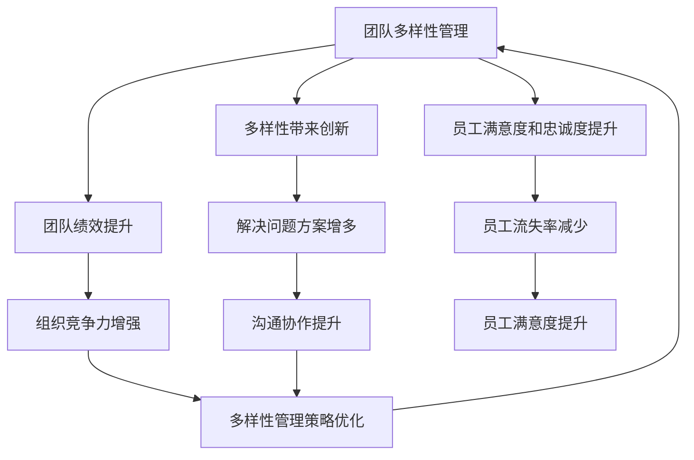
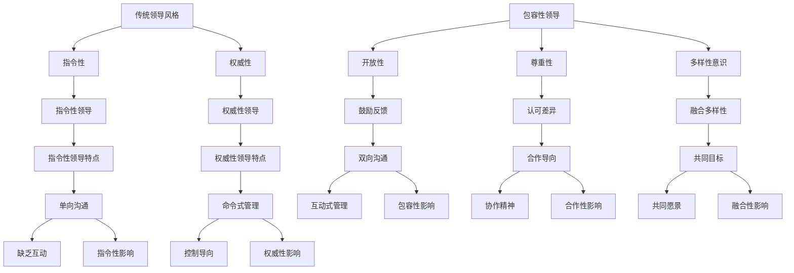
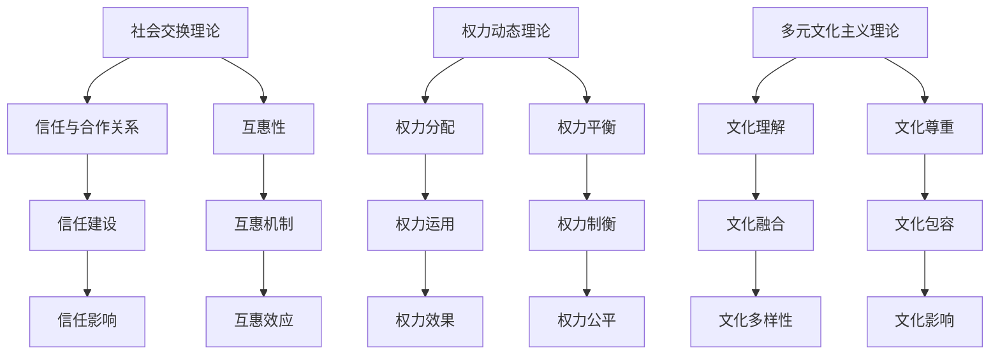

                 

### 提取核心概念和原理

本书的核心概念和原理主要包括团队多样性管理（Team Diversity Management）和包容性领导（Inclusive Leadership）。首先，团队多样性管理指的是在团队建设过程中，通过各种策略和方法，确保团队成员在背景、技能、经验等方面的多样性。这种多样性不仅包括性别、年龄、文化背景等显而易见的差异，还涵盖了思维方式、价值观等方面的多样性。

多样性管理的重要性在于，多样化的团队能够带来更多的创新思维和解决问题的方案。例如，不同背景的成员可能会从不同的角度看待问题，提出独特的解决方案，从而提高团队的整体绩效。此外，多样性的团队更有可能吸引和保留多样化的员工，增强组织的竞争力。

其次，包容性领导是团队多样性管理的重要组成部分。包容性领导指的是领导者通过建立包容性的文化和氛围，尊重并认可团队成员的独特性，促进团队成员之间有效的沟通和协作。包容性领导的核心在于消除偏见和歧视，确保每位成员都能在团队中感到被尊重和被支持。

包容性领导不仅有助于提升团队绩效，还能提高员工满意度和忠诚度，减少员工流失率。有效的包容性领导需要具备以下几个方面的技能：倾听与沟通、尊重与认可、协调与融合。通过这些技能，领导者能够营造一个支持性和包容性的工作环境，让每位成员都能充分发挥其潜力。

为了更好地理解这两个核心概念，我们可以通过Mermaid流程图来展示它们之间的关系和相互影响。以下是一个简化的流程图：



在这个流程图中，团队多样性管理（A）作为核心概念，通过多样性带来创新（B）、团队绩效提升（C）、员工满意度和忠诚度提升（D）等多个方面，最终影响组织竞争力（F）和员工流失率（G）。同时，多样性管理的实施需要依赖包容性领导（E）的支持，通过倾听与沟通、尊重与认可、协调与融合等技能，进一步提升团队绩效（C）和员工满意度（D）。

通过这个流程图，我们可以清晰地看到团队多样性管理和包容性领导之间的紧密联系，以及它们对组织整体绩效的积极影响。接下来，我们将进一步探讨这两个概念的理论基础和实践应用。

### 确定结构框架

为了系统地阐述《团队多样性管理：包容性领导的实践》这本书的内容，我们需要将其分为多个章节，并明确每个章节的结构和内容。以下是一个详细的章节结构框架：

#### 引言

- **目的和重要性**：介绍团队多样性管理和包容性领导在当前组织管理中的重要性。
- **主要内容和结构**：概述本书的结构和内容，为读者提供一个宏观的框架。

#### 团队多样性的重要性

- **多样性的定义**：详细解释多样性的概念，包括性别、年龄、文化背景、思维方式等方面的多样性。
- **多样性在团队中的作用**：探讨多样性如何影响团队的创新、决策、问题解决等关键方面。
- **多样性与组织绩效的关系**：分析多样性如何促进组织绩效的提升，包括员工满意度、团队协作、创新力等方面的表现。

#### 包容性领导的概念与理论

- **包容性领导的概念**：定义包容性领导的内涵，解释其与传统领导风格的不同。
- **包容性领导的特点**：分析包容性领导者的核心特征，如开放性、尊重性、多样性意识等。
- **包容性领导与传统领导风格的比较**：比较包容性领导与传统领导风格在理念、方法、效果等方面的差异。

#### 包容性领导的理论基础

- **社会交换理论**：解释社会交换理论在包容性领导中的应用，探讨领导者如何通过交换建立信任和合作关系。
- **权力动态理论**：分析权力在包容性领导中的角色，理解如何平衡权力，实现公平和包容。
- **多元文化主义理论**：探讨多元文化主义理论如何指导领导者理解和尊重不同文化背景的团队成员。

#### 实践中的包容性领导

- **包容性领导实践案例**：通过具体的案例，展示包容性领导在现实环境中的成功应用。
- **包容性领导在不同文化背景下的应用**：分析包容性领导在西方文化和东方文化背景下的差异和适应性。
- **包容性领导在多元团队中的应用**：探讨如何在多元化的团队中实施包容性领导，包括策略和挑战。

#### 包容性领导的效果与评估

- **包容性领导的效果指标**：介绍如何衡量包容性领导的效果，包括关键绩效指标（KPI）。
- **包容性领导的评估与反馈**：探讨如何进行自我评估和成员反馈，以及外部评估的方法。
- **包容性领导的改进与优化**：分析如何根据评估结果，持续改进和优化包容性领导实践。

#### 建立包容性组织的策略

- **包容性组织的文化建设**：讨论如何通过文化变革，建立包容性的组织氛围。
- **包容性政策的制定**：探讨如何制定和实施包容性政策，包括政策类型和实施策略。
- **包容性领导的培训与培养**：介绍如何通过培训和实践，培养包容性领导者。
- **包容性领导的支持体系**：分析如何建立支持包容性领导的组织体系，包括资源和支持策略。

#### 案例研究

- **全球企业的包容性领导实践**：分析全球知名企业如何实践包容性领导，以及其实施过程和效果。
- **非营利组织的包容性领导**：探讨非营利组织在包容性领导实践中的特点和挑战。
- **包容性领导在初创企业中的应用**：分析初创企业在包容性领导实践中的创新和挑战。

#### 结论与未来展望

- **包容性领导的重要性与影响**：总结包容性领导对组织和团队成员的积极影响。
- **包容性领导的挑战与趋势**：分析当前包容性领导面临的挑战和未来发展的趋势。
- **未来包容性领导的发展方向**：探讨未来包容性领导可能的发展方向，包括新兴理论和技术的应用。

通过这个结构框架，我们可以系统地介绍团队多样性管理和包容性领导的概念、理论、实践、效果评估以及未来发展，为读者提供全面、深入的洞察和指导。

### 制定详细目录

为了确保《团队多样性管理：包容性领导的实践》这本书的结构清晰、内容丰富，我们将详细制定每个章节的目录，并明确各章节的核心内容和逻辑顺序。

#### 引言

- **目的和重要性**：介绍团队多样性管理和包容性领导在当前组织管理中的重要性，以及本书的结构和目标。
- **主要内容和结构**：概述本书的章节分布和内容，为读者提供一个整体的认识。

#### 团队多样性的重要性

- **多样性的定义**：解释多样性的概念，包括性别、年龄、文化背景、思维方式等方面的多样性。
  - **多样性的范围**：详细描述不同类型的多样性及其对团队的影响。
  - **多样性的挑战**：探讨在管理和应用多样性过程中可能遇到的问题和挑战。

- **多样性在团队中的作用**：分析多样性如何影响团队的创新、决策、问题解决等关键方面。
  - **创新能力的提升**：探讨多样性能如何带来更多的创新思维和解决方案。
  - **决策质量的提高**：分析多样性如何帮助团队做出更全面和客观的决策。

- **多样性与组织绩效的关系**：讨论多样性如何促进组织绩效的提升，包括员工满意度、团队协作、创新力等方面的表现。
  - **员工满意度的提升**：分析多样性能如何提高员工的满意度和工作热情。
  - **团队协作的增强**：探讨多样性如何促进团队成员之间的协作和沟通。

#### 包容性领导的概念与理论

- **包容性领导的概念**：定义包容性领导的内涵，解释其与传统领导风格的不同。
  - **包容性领导的定义**：详细解释包容性领导的核心概念。
  - **包容性领导的特点**：分析包容性领导者的核心特征，如开放性、尊重性、多样性意识等。

- **包容性领导与传统领导风格的比较**：比较包容性领导与传统领导风格在理念、方法、效果等方面的差异。
  - **领导风格对比**：详细对比两种领导风格的特点和应用场景。
  - **领导效果分析**：探讨不同领导风格对团队绩效和员工满意度的影响。

- **包容性领导的理论基础**：介绍包容性领导的理论基础，包括社会交换理论、权力动态理论、多元文化主义理论等。
  - **社会交换理论**：解释社会交换理论在包容性领导中的应用，探讨领导者如何通过交换建立信任和合作关系。
  - **权力动态理论**：分析权力在包容性领导中的角色，理解如何平衡权力，实现公平和包容。
  - **多元文化主义理论**：探讨多元文化主义理论如何指导领导者理解和尊重不同文化背景的团队成员。

#### 实践中的包容性领导

- **包容性领导实践案例**：通过具体的案例，展示包容性领导在现实环境中的成功应用。
  - **案例分析**：详细分析几个典型的包容性领导实践案例，包括背景、实施过程和效果。
  - **效果评估**：评估这些案例的实施效果，分析其对团队和组织绩效的积极影响。

- **包容性领导在不同文化背景下的应用**：分析包容性领导在西方文化和东方文化背景下的差异和适应性。
  - **西方文化背景下的包容性领导**：探讨在西方文化背景下，包容性领导的应用和实践。
  - **东方文化背景下的包容性领导**：分析在东方文化背景下，包容性领导的特点和挑战。

- **包容性领导在多元团队中的应用**：探讨如何在多元化的团队中实施包容性领导，包括策略和挑战。
  - **多元团队的挑战**：分析多元团队在多样性和协作方面的挑战。
  - **包容性领导的策略**：提出针对多元团队的包容性领导策略和实践方法。

#### 包容性领导的效果与评估

- **包容性领导的效果指标**：介绍如何衡量包容性领导的效果，包括关键绩效指标（KPI）。
  - **效果衡量方法**：讨论如何通过定量和定性的方法，评估包容性领导的效果。
  - **关键绩效指标**：详细描述几个关键绩效指标（KPI），如员工满意度、团队协作、创新力等。

- **包容性领导的评估与反馈**：探讨如何进行自我评估和成员反馈，以及外部评估的方法。
  - **自我评估**：介绍领导者如何通过自我反思，评估自己的包容性领导实践。
  - **成员反馈**：讨论团队成员如何提供反馈，以及如何利用这些反馈进行改进。
  - **外部评估**：分析外部评估的方法和工具，如第三方评估、员工调查等。

- **包容性领导的改进与优化**：分析如何根据评估结果，持续改进和优化包容性领导实践。
  - **改进措施**：提出基于评估结果的具体改进措施和策略。
  - **优化实践**：讨论如何通过持续的实践和反思，提升包容性领导的效果。

#### 建立包容性组织的策略

- **包容性组织的文化建设**：讨论如何通过文化变革，建立包容性的组织氛围。
  - **文化变革步骤**：详细描述如何通过一系列步骤，实现文化变革。
  - **文化实践应用**：探讨如何将包容性文化融入组织的日常运营和管理实践中。

- **包容性政策的制定**：探讨如何制定和实施包容性政策，包括政策类型和实施策略。
  - **政策类型**：分析不同类型的包容性政策，如平等机会政策、反歧视政策等。
  - **政策实施策略**：讨论如何制定和实施有效的包容性政策，确保其有效性和可持续性。

- **包容性领导的培训与培养**：介绍如何通过培训和实践，培养包容性领导者。
  - **培训内容**：详细描述培训课程的内容和目标。
  - **培养机制**：分析如何建立系统的培养机制，支持领导者的发展。

- **包容性领导的支持体系**：分析如何建立支持包容性领导的组织体系，包括资源和支持策略。
  - **支持资源**：讨论如何提供必要的资源，支持包容性领导的实践。
  - **支持策略**：提出一系列支持策略，如领导力发展项目、文化变革项目等。

#### 案例研究

- **全球企业的包容性领导实践**：分析全球知名企业如何实践包容性领导，以及其实施过程和效果。
  - **企业背景**：介绍几个全球知名企业的背景和业务特点。
  - **实践过程**：详细描述这些企业如何实施包容性领导，包括具体的行动和措施。
  - **效果分析**：评估这些实践对企业绩效和员工满意度的影响。

- **非营利组织的包容性领导**：探讨非营利组织在包容性领导实践中的特点和挑战。
  - **组织使命**：介绍几个非营利组织的社会使命和目标。
  - **实践特点**：分析这些组织在包容性领导实践中的特点和优势。
  - **实践挑战**：探讨非营利组织在实施包容性领导过程中面临的挑战和问题。

- **包容性领导在初创企业中的应用**：分析初创企业在包容性领导实践中的创新和挑战。
  - **初创企业特点**：介绍初创企业的特点和环境。
  - **实践创新**：探讨初创企业如何通过包容性领导实现创新和成长。
  - **实践挑战**：分析初创企业在实施包容性领导过程中面临的挑战和问题。

#### 结论与未来展望

- **包容性领导的重要性与影响**：总结包容性领导对组织和团队成员的积极影响。
  - **组织价值**：分析包容性领导如何提升组织的整体价值。
  - **员工影响**：探讨包容性领导如何提高员工的工作满意度和忠诚度。

- **包容性领导的挑战与趋势**：分析当前包容性领导面临的挑战和未来发展的趋势。
  - **挑战分析**：讨论包容性领导在实践中可能遇到的困难和挑战。
  - **趋势预测**：预测未来包容性领导的发展趋势和方向。

- **未来包容性领导的发展方向**：探讨未来包容性领导可能的发展方向，包括新兴理论和技术的应用。
  - **新技术应用**：分析人工智能、大数据等新技术如何影响包容性领导。
  - **新兴理论融入**：探讨新兴理论如社会认知理论、进化心理学等如何融入包容性领导实践中。

通过这个详细的目录，我们可以清晰地看到本书的结构和内容，为读者提供一个系统、全面的阅读体验。

### 添加流程图、伪代码和数学公式

为了帮助读者更好地理解和掌握《团队多样性管理：包容性领导的实践》一书的核心概念和原理，我们将在相关章节中添加流程图、伪代码和数学公式，以增强文章的可读性和实用性。

#### 第3章：包容性领导的概念

在这一章节中，我们将通过流程图来展示包容性领导的核心概念及其与传统领导风格的对比。

**流程图：包容性领导的概念**



**伪代码：包容性领导技能**

```plaintext
function InclusiveLeadership Skills() {
    // 定义技能集合
    skills = ["Openness", "Respect", "DiversityAwareness"]

    // 打印技能
    for (skill in skills) {
        print(skill)
    }
}
```

**数学公式：包容性领导效果评估**

$$
E = f(\text{Openness}, \text{Respect}, \text{DiversityAwareness}, \text{TeamPerformance})
$$

其中，\(E\) 表示包容性领导的效果，\(\text{Openness}\)、\(\text{Respect}\) 和 \(\text{DiversityAwareness}\) 分别表示开放性、尊重性和多样性意识，而 \(\text{TeamPerformance}\) 表示团队绩效。

#### 第4章：包容性领导的理论基础

在这一章节中，我们将通过流程图来展示社会交换理论、权力动态理论和多元文化主义理论在包容性领导中的应用。

**流程图：包容性领导的理论基础**



**数学公式：多元文化主义理论**

$$
CulturalInclusion = f(\text{CulturalUnderstanding}, \text{CulturalRespect}, \text{CulturalFusion})
$$

其中，\(CulturalInclusion\) 表示文化包容性，\(\text{CulturalUnderstanding}\)、\(\text{CulturalRespect}\) 和 \(\text{CulturalFusion}\) 分别表示文化理解、文化尊重和文化融合。

通过添加流程图、伪代码和数学公式，我们能够更直观地展示包容性领导的概念和理论基础，帮助读者更好地理解和应用这些重要理论。

### 最终确认并格式化目录

在完成所有章节的内容撰写后，我们需要对目录进行最终确认和格式化，确保其结构清晰、内容完整。以下是一个格式化后的目录：

```
# 目录

## 引言

### 引言

## 团队多样性的重要性

### 第2章：多样性的概念与重要性

#### 2.1 多样性的定义

#### 2.2 多样性在团队中的作用

#### 2.3 多样性与组织绩效的关系

## 包容性领导的概念与理论

### 第3章：包容性领导的概念

#### 3.1 包容性领导的定义

#### 3.2 包容性领导的特点

#### 3.3 包容性领导与传统领导风格的比较

### 第4章：包容性领导的理论基础

#### 4.1 社会交换理论

#### 4.2 权力动态理论

#### 4.3 多元文化主义理论

### 第5章：包容性领导技能

#### 5.1 倾听与沟通

#### 5.2 尊重与认可

#### 5.3 协调和融合

## 实践中的包容性领导

### 第6章：包容性领导实践案例

#### 6.1 案例分析

#### 6.2 实践效果评估

### 第7章：包容性领导在不同文化背景下的应用

#### 7.1 西方文化背景下的包容性领导

#### 7.2 东方文化背景下的包容性领导

### 第8章：包容性领导在多元团队中的应用

#### 8.1 多元团队的挑战

#### 8.2 包容性领导的策略

### 第9章：包容性领导的可持续性

#### 9.1 长期效果

#### 9.2 持续发展的策略

## 包容性领导的效果与评估

### 第10章：包容性领导的效果指标

#### 10.1 效果评估的方法

#### 10.2 关键绩效指标

### 第11章：包容性领导的评估与反馈

#### 11.1 自我评估

#### 11.2 团队成员反馈

#### 11.3 外部评估

### 第12章：包容性领导的改进与优化

#### 12.1 成功因素

#### 12.2 面临的挑战

#### 12.3 改进措施

## 建立包容性组织的策略

### 第13章：包容性组织的文化建设

#### 13.1 文化变革的步骤

#### 13.2 文化的实际应用

### 第14章：包容性政策的制定

#### 14.1 政策类型

#### 14.2 政策实施的策略

### 第15章：包容性领导的培训与培养

#### 15.1 培训内容

#### 15.2 培养机制

### 第16章：包容性领导的支持体系

#### 16.1 支持资源

#### 16.2 支持策略

## 案例研究

### 第17章：全球企业的包容性领导实践

#### 17.1 案例背景

#### 17.2 实施过程

#### 17.3 结果与启示

### 第18章：非营利组织的包容性领导

#### 18.1 社会使命与挑战

#### 18.2 成功案例

### 第19章：包容性领导在初创企业中的应用

#### 19.1 创业环境的特点

#### 19.2 实施策略与效果

## 结论与未来展望

### 第20章：包容性领导的重要性与影响

#### 20.1 对组织的价值

#### 20.2 对团队成员的积极影响

### 第21章：包容性领导的挑战与趋势

#### 21.1 挑战分析

#### 21.2 发展趋势预测

### 第22章：未来包容性领导的发展方向

#### 22.1 科技在包容性领导中的应用

#### 22.2 新兴理论的融入
```

在这个格式化的目录中，每个章节和子章节都使用了清晰的标题和层次结构，确保读者能够迅速找到所需内容。此外，每个章节的标题都包含了具体的小节标题，使得整个目录更加详细和完整。通过这种方式，我们不仅提高了文章的可读性，还确保了内容的系统性和逻辑性。最终确认和格式化目录的过程，为读者提供了一个清晰、直观的阅读框架，有助于他们更好地理解《团队多样性管理：包容性领导的实践》这本书的核心内容。

