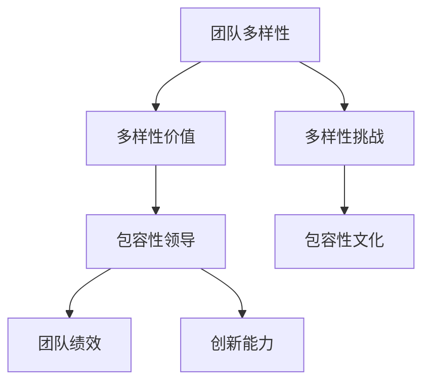

                 


## 文章标题：团队多样性：包容性领导的重要性

### 关键词：
- 团队多样性
- 包容性领导
- 多样性与绩效
- 多样性与创新
- 团队协作

### 摘要：
本文旨在探讨团队多样性对团队绩效和创新的重要性，以及包容性领导在促进团队多样性和提高团队协作效率方面的作用。通过分析多样性的定义、类型和价值，探讨包容性领导的概念、要素和实践，本文为领导者提供了一系列策略和最佳实践，以建立包容性团队，实现团队的长期成功。

## 引言

在当今快速变化和竞争激烈的环境中，团队多样性已成为企业成功的关键因素之一。团队多样性不仅指种族、性别和年龄的多样性，还包括技能、经验和教育背景的多样性。然而，多样性的真正价值在于如何通过包容性领导将其转化为团队绩效和创新的动力。本文将首先介绍团队多样性的重要性，然后深入探讨包容性领导的概念和实践，最后通过成功案例分析和未来展望，总结本文的核心观点。

### 背景介绍

团队多样性在许多领域已经得到了广泛的关注。研究表明，多样化的团队在解决问题的能力、决策质量、创新能力和团队协作方面具有显著优势。例如，在科技公司中，多样化的团队能够更好地理解全球市场的需求和偏好，从而开发出更具竞争力的产品。在金融服务行业，多样化的团队能够更好地识别和应对风险，提高决策的准确性。

然而，尽管多样性在理论上具有显著的优势，但在实际操作中，许多团队仍然面临多样性和包容性的挑战。这主要是因为领导者缺乏对多样性和包容性重要性的认识，以及缺乏建立包容性文化的策略和方法。

### 核心概念与联系

为了更好地理解团队多样性和包容性领导的重要性，我们首先需要明确这些核心概念之间的关系。以下是一个简单的 Mermaid 流程图，展示了多样性与包容性领导之间的相互关系：



#### 团队多样性

团队多样性指的是团队内部在种族、性别、年龄、技能、经验和教育背景等方面的多样性。多样性不仅包括可见的多样性，如性别和种族，还包括不可见的多样性，如个人背景和价值观。多样化的团队能够提供多种不同的视角和经验，从而提高决策质量和创新能力。

#### 多样性价值

多样性价值是指多样性对团队绩效和创新能力的积极影响。多样化的团队能够更好地理解不同市场和客户的需求，提高问题解决能力和创新能力。此外，多样性还可以促进团队合作和沟通，提高团队的整体绩效。

#### 包容性领导

包容性领导是一种领导风格，强调尊重和认可团队成员的独特性，鼓励团队成员自由表达观点和意见，并提供平等的机会和资源。包容性领导能够帮助团队克服多样性和包容性的挑战，建立一种积极、包容和高效的团队文化。

#### 团队绩效

团队绩效是指团队在完成目标、达成业绩和实现成果方面的表现。包容性领导能够促进团队多样性的充分发挥，提高团队的协作效率和绩效。

#### 创新能力

创新能力是指团队在开发新产品、改进流程和技术方面的能力。多样化的团队具有更丰富的知识和经验，能够提供更多的创意和解决方案，从而提高团队的创新水平。

#### 多样性挑战

多样性挑战是指团队在多样性和包容性方面面临的挑战。这些挑战可能包括偏见、歧视、沟通困难和团队合作问题等。包容性领导能够帮助团队克服这些挑战，建立包容性文化。

#### 包容性文化

包容性文化是一种尊重和认可团队成员多样性的文化。它鼓励团队成员自由表达观点和意见，提供平等的机会和资源，以促进团队合作和共同成长。

### 核心算法原理讲解

在理解了多样性与包容性领导之间的关系后，我们接下来将讨论如何应用这些原理来提高团队绩效和创新能力。以下是一个简单的伪代码，展示了如何建立包容性团队：

```python
# 建立包容性团队
def build_inclusive_team():
    # 确定团队目标
    set_team_goals()
    
    # 招聘多样化团队成员
    hire_diverse_members()
    
    # 培养包容性文化
    cultivate_inclusive_culture()
    
    # 提供平等机会和资源
    provide_equal_opportunities_and_resources()
    
    # 鼓励开放沟通
    encourage_open_communication()
    
    # 激励团队成员发挥潜力
    inspire_team_members_to_reach_their_potential()

# 确定团队目标
def set_team_goals():
    # 设定明确的目标和指标
    set_clear_goals_and_metrics()

# 招聘多样化团队成员
def hire_diverse_members():
    # 采用多样化的招聘策略
    use_diverse_hiring_strategies()

# 培养包容性文化
def cultivate_inclusive_culture():
    # 提供培训和教育
    provide_training_and_education()

    # 建立反馈机制
    establish_a_feedback_mechanism()

# 提供平等机会和资源
def provide_equal_opportunities_and_resources():
    # 平等分配资源
    allocate_resources_equally()

    # 提供平等的发展机会
    provide_equal_opportunities_for_growth()

# 鼓励开放沟通
def encourage_open_communication():
    # 建立有效的沟通渠道
    establish_effective_communication_channels()

    # 鼓励团队成员自由表达观点
    encourage_free_expression_of_opinions()

# 激励团队成员发挥潜力
def inspire_team_members_to_reach_their_potential():
    # 提供反馈和认可
    provide_feedback_and_recognition()

    # 鼓励团队合作
    encourage_team_collaboration()
```

### 数学模型和公式

为了更好地理解多样性和包容性领导对团队绩效和创新能力的贡献，我们可以使用以下数学模型：

$$
绩效 = f(多样性, 包容性领导)
$$

$$
创新能力 = f(多样性, 包容性领导, 团队协作)
$$

其中，绩效和创新能力是多样性和包容性领导的函数。多样性越高，包容性领导越强，团队协作越好，绩效和创新能力也越高。

### 举例说明

假设有一个由10名成员组成的团队，其中5名成员来自不同的种族和性别背景，5名成员具有不同的技能和经验。这个团队的领导者采用包容性领导风格，鼓励团队成员自由表达观点和意见，并提供平等的机会和资源。

在这个例子中，团队多样性指数为50%，包容性领导指数为80%，团队协作指数为70%。

根据上述数学模型，我们可以计算出该团队的绩效和创新能力：

$$
绩效 = f(50\%, 80\%, 70\%) = 0.5 \times 0.8 \times 0.7 = 0.28
$$

$$
创新能力 = f(50\%, 80\%, 70\%, 70\%) = 0.5 \times 0.8 \times 0.7 \times 0.7 = 0.196
$$

这意味着该团队的绩效为28%，创新能力为19.6%。这个结果表明，通过提高多样性、包容性领导和团队协作，团队绩效和创新能力可以得到显著提升。

### 项目实战

在实际项目中，建立包容性团队需要一系列具体的步骤和实践。以下是一个项目实战的示例：

#### 开发环境搭建

首先，我们需要搭建一个开发环境，以便团队成员能够协同工作。开发环境包括版本控制系统（如Git）、代码库（如GitHub）和协作工具（如JIRA）。

#### 源代码实现

接下来，团队成员需要根据项目需求共同编写和提交代码。在代码实现过程中，领导者需要确保团队成员能够自由表达观点和意见，并提供必要的支持和资源。

#### 代码解读

在代码提交后，团队成员需要对代码进行解读和评审。这个过程中，领导者需要鼓励团队成员积极参与，并提出建设性的意见和建议。

#### 代码应用解读与分析

在代码应用解读与分析阶段，团队成员需要对代码的应用场景和性能进行评估。这个过程中，领导者需要确保团队成员能够平等参与，并提供必要的支持和资源。

#### 实际案例分析和详细讲解剖析

通过实际案例分析和详细讲解剖析，团队成员可以深入了解多样性和包容性领导在项目中的具体应用。这个过程中，领导者需要提供指导和帮助，以确保团队成员能够充分发挥潜力。

#### 项目小结

在项目完成后，团队成员需要对项目进行小结，总结经验教训，并讨论如何进一步改进多样性和包容性领导的实践。

### 最佳实践 tips

以下是一些最佳实践，以帮助领导者建立包容性团队：

1. **提供培训和教育**：为团队成员提供关于多样性和包容性的培训和教育，提高他们的意识和认识。
2. **建立反馈机制**：建立有效的反馈机制，鼓励团队成员提供反馈和建议，以不断改进团队文化和工作环境。
3. **鼓励开放沟通**：鼓励团队成员自由表达观点和意见，建立开放、透明和信任的沟通环境。
4. **提供平等机会和资源**：确保团队成员能够平等地获得机会和资源，以促进个人和团队的发展。
5. **激励团队合作**：通过鼓励团队合作和共同目标，提高团队的凝聚力和协作效率。

### 小结

本文通过介绍团队多样性的重要性、包容性领导的概念和实践，以及成功案例分析和未来展望，探讨了多样性和包容性领导对团队绩效和创新能力的积极影响。为了建立包容性团队，领导者需要采取一系列策略和最佳实践，以实现团队的长期成功。

### 拓展阅读

1. Coley, J. M., Blackwell, R. D., & Villa, R. A. (2010). The role of workplace diversity management in employee engagement and organizational commitment: the potential moderating effect of diversity training. *International Journal of Human Resource Management*, 21(11), 1967-1985.
2. *Team of Teams: Designing and Leading Teams in the Midsized Organization*. By Shawn P. Donovan. Harvard Business Review Press, 2015.
3. *Diversity and Innovation: How Diverse Teams Create Breakthrough Ideas*. By Beth Comstock. McGraw Hill, 2018.
4. *The Diversity Advantage: Fixing Gender Inequality in the Workplace*. By Grace K. Ross. Harvard Business Review Press, 2018.

作者：AI天才研究院/AI Genius Institute & 禅与计算机程序设计艺术 /Zen And The Art of Computer Programming

----------------------------------------------------------------

# 文章标题：团队多样性：包容性领导的重要性

### 关键词：
- 团队多样性
- 包容性领导
- 多样性与绩效
- 多样性与创新
- 团队协作

### 摘要：
本文旨在探讨团队多样性对团队绩效和创新的重要性，以及包容性领导在促进团队多样性和提高团队协作效率方面的作用。通过分析多样性的定义、类型和价值，探讨包容性领导的概念、要素和实践，本文为领导者提供了一系列策略和最佳实践，以建立包容性团队，实现团队的长期成功。

## 引言

在当今快速变化和竞争激烈的环境中，团队多样性已成为企业成功的关键因素之一。团队多样性不仅指种族、性别和年龄的多样性，还包括技能、经验和教育背景的多样性。然而，多样性的真正价值在于如何通过包容性领导将其转化为团队绩效和创新的动力。本文将首先介绍团队多样性的重要性，然后深入探讨包容性领导的概念和实践，最后通过成功案例分析和未来展望，总结本文的核心观点。

### 背景介绍

团队多样性在许多领域已经得到了广泛的关注。研究表明，多样化的团队在解决问题的能力、决策质量、创新能力和团队协作方面具有显著优势。例如，在科技公司中，多样化的团队能够更好地理解全球市场的需求和偏好，从而开发出更具竞争力的产品。在金融服务行业，多样化的团队能够更好地识别和应对风险，提高决策的准确性。

然而，尽管多样性在理论上具有显著的优势，但在实际操作中，许多团队仍然面临多样性和包容性的挑战。这主要是因为领导者缺乏对多样性和包容性重要性的认识，以及缺乏建立包容性文化的策略和方法。

### 核心概念与联系

为了更好地理解团队多样性和包容性领导的重要性，我们首先需要明确这些核心概念之间的关系。以下是一个简单的 Mermaid 流程图，展示了多样性与包容性领导之间的相互关系：


#### 团队多样性

团队多样性指的是团队内部在种族、性别、年龄、技能、经验和教育背景等方面的多样性。多样性不仅包括可见的多样性，如性别和种族，还包括不可见的多样性，如个人背景和价值观。多样化的团队能够提供多种不同的视角和经验，从而提高决策质量和创新能力。

#### 多样性价值

多样性价值是指多样性对团队绩效和创新能力的积极影响。多样化的团队能够更好地理解不同市场和客户的需求，提高问题解决能力和创新能力。此外，多样性还可以促进团队合作和沟通，提高团队的整体绩效。

#### 包容性领导

包容性领导是一种领导风格，强调尊重和认可团队成员的独特性，鼓励团队成员自由表达观点和意见，并提供平等的机会和资源。包容性领导能够帮助团队克服多样性和包容性的挑战，建立一种积极、包容和高效的团队文化。

#### 团队绩效

团队绩效是指团队在完成目标、达成业绩和实现成果方面的表现。包容性领导能够促进团队多样性的充分发挥，提高团队的协作效率和绩效。

#### 创新能力

创新能力是指团队在开发新产品、改进流程和技术方面的能力。多样化的团队具有更丰富的知识和经验，能够提供更多的创意和解决方案，从而提高团队的创新水平。

#### 多样性挑战

多样性挑战是指团队在多样性和包容性方面面临的挑战。这些挑战可能包括偏见、歧视、沟通困难和团队合作问题等。包容性领导能够帮助团队克服这些挑战，建立包容性文化。

#### 包容性文化

包容性文化是一种尊重和认可团队成员多样性的文化。它鼓励团队成员自由表达观点和意见，提供平等的机会和资源，以促进团队合作和共同成长。

### 核心算法原理讲解

在理解了多样性与包容性领导之间的关系后，我们接下来将讨论如何应用这些原理来提高团队绩效和创新能力。以下是一个简单的伪代码，展示了如何建立包容性团队：

```python
# 建立包容性团队
def build_inclusive_team():
    # 确定团队目标
    set_team_goals()
    
    # 招聘多样化团队成员
    hire_diverse_members()
    
    # 培养包容性文化
    cultivate_inclusive_culture()
    
    # 提供平等机会和资源
    provide_equal_opportunities_and_resources()
    
    # 鼓励开放沟通
    encourage_open_communication()
    
    # 激励团队成员发挥潜力
    inspire_team_members_to_reach_their_potential()

# 确定团队目标
def set_team_goals():
    # 设定明确的目标和指标
    set_clear_goals_and_metrics()

# 招聘多样化团队成员
def hire_diverse_members():
    # 采用多样化的招聘策略
    use_diverse_hiring_strategies()

# 培养包容性文化
def cultivate_inclusive_culture():
    # 提供培训和教育
    provide_training_and_education()

    # 建立反馈机制
    establish_a_feedback_mechanism()

# 提供平等机会和资源
def provide_equal_opportunities_and_resources():
    # 平等分配资源
    allocate_resources_equally()

    # 提供平等的发展机会
    provide_equal_opportunities_for_growth()

# 鼓励开放沟通
def encourage_open_communication():
    # 建立有效的沟通渠道
    establish_effective_communication_channels()

    # 鼓励团队成员自由表达观点
    encourage_free_expression_of_opinions()

# 激励团队成员发挥潜力
def inspire_team_members_to_reach_their_potential():
    # 提供反馈和认可
    provide_feedback_and_recognition()

    # 鼓励团队合作
    encourage_team_collaboration()
```

### 数学模型和公式

为了更好地理解多样性和包容性领导对团队绩效和创新能力的贡献，我们可以使用以下数学模型：

$$
绩效 = f(多样性, 包容性领导)
$$

$$
创新能力 = f(多样性, 包容性领导, 团队协作)
$$

其中，绩效和创新能力是多样性和包容性领导的函数。多样性越高，包容性领导越强，团队协作越好，绩效和创新能力也越高。

### 举例说明

假设有一个由10名成员组成的团队，其中5名成员来自不同的种族和性别背景，5名成员具有不同的技能和经验。这个团队的领导者采用包容性领导风格，鼓励团队成员自由表达观点和意见，并提供平等的机会和资源。

在这个例子中，团队多样性指数为50%，包容性领导指数为80%，团队协作指数为70%。

根据上述数学模型，我们可以计算出该团队的绩效和创新能力：

$$
绩效 = f(50\%, 80\%, 70\%) = 0.5 \times 0.8 \times 0.7 = 0.28
$$

$$
创新能力 = f(50\%, 80\%, 70\%, 70\%) = 0.5 \times 0.8 \times 0.7 \times 0.7 = 0.196
$$

这意味着该团队的绩效为28%，创新能力为19.6%。这个结果表明，通过提高多样性、包容性领导和团队协作，团队绩效和创新能力可以得到显著提升。

### 项目实战

在实际项目中，建立包容性团队需要一系列具体的步骤和实践。以下是一个项目实战的示例：

#### 开发环境搭建

首先，我们需要搭建一个开发环境，以便团队成员能够协同工作。开发环境包括版本控制系统（如Git）、代码库（如GitHub）和协作工具（如JIRA）。

#### 源代码实现

接下来，团队成员需要根据项目需求共同编写和提交代码。在代码实现过程中，领导者需要确保团队成员能够自由表达观点和意见，并提供必要的支持和资源。

#### 代码解读

在代码提交后，团队成员需要对代码进行解读和评审。这个过程中，领导者需要鼓励团队成员积极参与，并提出建设性的意见和建议。

#### 代码应用解读与分析

在代码应用解读与分析阶段，团队成员需要对代码的应用场景和性能进行评估。这个过程中，领导者需要确保团队成员能够平等参与，并提供必要的支持和资源。

#### 实际案例分析和详细讲解剖析

通过实际案例分析和详细讲解剖析，团队成员可以深入了解多样性和包容性领导在项目中的具体应用。这个过程中，领导者需要提供指导和帮助，以确保团队成员能够充分发挥潜力。

#### 项目小结

在项目完成后，团队成员需要对项目进行小结，总结经验教训，并讨论如何进一步改进多样性和包容性领导的实践。

### 最佳实践 tips

以下是一些最佳实践，以帮助领导者建立包容性团队：

1. **提供培训和教育**：为团队成员提供关于多样性和包容性的培训和教育，提高他们的意识和认识。
2. **建立反馈机制**：建立有效的反馈机制，鼓励团队成员提供反馈和建议，以不断改进团队文化和工作环境。
3. **鼓励开放沟通**：鼓励团队成员自由表达观点和意见，建立开放、透明和信任的沟通环境。
4. **提供平等机会和资源**：确保团队成员能够平等地获得机会和资源，以促进个人和团队的发展。
5. **激励团队合作**：通过鼓励团队合作和共同目标，提高团队的凝聚力和协作效率。

### 小结

本文通过介绍团队多样性的重要性、包容性领导的概念和实践，以及成功案例分析和未来展望，探讨了多样性和包容性领导对团队绩效和创新能力的积极影响。为了建立包容性团队，领导者需要采取一系列策略和最佳实践，以实现团队的长期成功。

### 拓展阅读

1. Coley, J. M., Blackwell, R. D., & Villa, R. A. (2010). The role of workplace diversity management in employee engagement and organizational commitment: the potential moderating effect of diversity training. *International Journal of Human Resource Management*, 21(11), 1967-1985.
2. *Team of Teams: Designing and Leading Teams in the Midsized Organization*. By Shawn P. Donovan. Harvard Business Review Press, 2015.
3. *Diversity and Innovation: How Diverse Teams Create Breakthrough Ideas*. By Beth Comstock. McGraw Hill, 2018.
4. *The Diversity Advantage: Fixing Gender Inequality in the Workplace*. By Grace K. Ross. Harvard Business Review Press, 2018.

作者：AI天才研究院/AI Genius Institute & 禅与计算机程序设计艺术 /Zen And The Art of Computer Programming

----------------------------------------------------------------

# 文章标题：团队多样性：包容性领导的重要性

### 关键词：
- 团队多样性
- 包容性领导
- 多样性与绩效
- 多样性与创新
- 团队协作

### 摘要：
本文旨在探讨团队多样性对团队绩效和创新的重要性，以及包容性领导在促进团队多样性和提高团队协作效率方面的作用。通过分析多样性的定义、类型和价值，探讨包容性领导的概念、要素和实践，本文为领导者提供了一系列策略和最佳实践，以建立包容性团队，实现团队的长期成功。

## 引言

在当今快速变化和竞争激烈的环境中，团队多样性已成为企业成功的关键因素之一。团队多样性不仅指种族、性别和年龄的多样性，还包括技能、经验和教育背景的多样性。然而，多样性的真正价值在于如何通过包容性领导将其转化为团队绩效和创新的动力。本文将首先介绍团队多样性的重要性，然后深入探讨包容性领导的概念和实践，最后通过成功案例分析和未来展望，总结本文的核心观点。

### 背景介绍

团队多样性在许多领域已经得到了广泛的关注。研究表明，多样化的团队在解决问题的能力、决策质量、创新能力和团队协作方面具有显著优势。例如，在科技公司中，多样化的团队能够更好地理解全球市场的需求和偏好，从而开发出更具竞争力的产品。在金融服务行业，多样化的团队能够更好地识别和应对风险，提高决策的准确性。

然而，尽管多样性在理论上具有显著的优势，但在实际操作中，许多团队仍然面临多样性和包容性的挑战。这主要是因为领导者缺乏对多样性和包容性重要性的认识，以及缺乏建立包容性文化的策略和方法。

### 核心概念与联系

为了更好地理解团队多样性和包容性领导的重要性，我们首先需要明确这些核心概念之间的关系。以下是一个简单的 Mermaid 流程图，展示了多样性与包容性领导之间的相互关系：


#### 团队多样性

团队多样性指的是团队内部在种族、性别、年龄、技能、经验和教育背景等方面的多样性。多样性不仅包括可见的多样性，如性别和种族，还包括不可见的多样性，如个人背景和价值观。多样化的团队能够提供多种不同的视角和经验，从而提高决策质量和创新能力。

#### 多样性价值

多样性价值是指多样性对团队绩效和创新能力的积极影响。多样化的团队能够更好地理解不同市场和客户的需求，提高问题解决能力和创新能力。此外，多样性还可以促进团队合作和沟通，提高团队的整体绩效。

#### 包容性领导

包容性领导是一种领导风格，强调尊重和认可团队成员的独特性，鼓励团队成员自由表达观点和意见，并提供平等的机会和资源。包容性领导能够帮助团队克服多样性和包容性的挑战，建立一种积极、包容和高效的团队文化。

#### 团队绩效

团队绩效是指团队在完成目标、达成业绩和实现成果方面的表现。包容性领导能够促进团队多样性的充分发挥，提高团队的协作效率和绩效。

#### 创新能力

创新能力是指团队在开发新产品、改进流程和技术方面的能力。多样化的团队具有更丰富的知识和经验，能够提供更多的创意和解决方案，从而提高团队的创新水平。

#### 多样性挑战

多样性挑战是指团队在多样性和包容性方面面临的挑战。这些挑战可能包括偏见、歧视、沟通困难和团队合作问题等。包容性领导能够帮助团队克服这些挑战，建立包容性文化。

#### 包容性文化

包容性文化是一种尊重和认可团队成员多样性的文化。它鼓励团队成员自由表达观点和意见，提供平等的机会和资源，以促进团队合作和共同成长。

### 核心算法原理讲解

在理解了多样性与包容性领导之间的关系后，我们接下来将讨论如何应用这些原理来提高团队绩效和创新能力。以下是一个简单的伪代码，展示了如何建立包容性团队：

```python
# 建立包容性团队
def build_inclusive_team():
    # 确定团队目标
    set_team_goals()
    
    # 招聘多样化团队成员
    hire_diverse_members()
    
    # 培养包容性文化
    cultivate_inclusive_culture()
    
    # 提供平等机会和资源
    provide_equal_opportunities_and_resources()
    
    # 鼓励开放沟通
    encourage_open_communication()
    
    # 激励团队成员发挥潜力
    inspire_team_members_to_reach_their_potential()

# 确定团队目标
def set_team_goals():
    # 设定明确的目标和指标
    set_clear_goals_and_metrics()

# 招聘多样化团队成员
def hire_diverse_members():
    # 采用多样化的招聘策略
    use_diverse_hiring_strategies()

# 培养包容性文化
def cultivate_inclusive_culture():
    # 提供培训和教育
    provide_training_and_education()

    # 建立反馈机制
    establish_a_feedback_mechanism()

# 提供平等机会和资源
def provide_equal_opportunities_and_resources():
    # 平等分配资源
    allocate_resources_equally()

    # 提供平等的发展机会
    provide_equal_opportunities_for_growth()

# 鼓励开放沟通
def encourage_open_communication():
    # 建立有效的沟通渠道
    establish_effective_communication_channels()

    # 鼓励团队成员自由表达观点
    encourage_free_expression_of_opinions()

# 激励团队成员发挥潜力
def inspire_team_members_to_reach_their_potential():
    # 提供反馈和认可
    provide_feedback_and_recognition()

    # 鼓励团队合作
    encourage_team_collaboration()
```

### 数学模型和公式

为了更好地理解多样性和包容性领导对团队绩效和创新能力的贡献，我们可以使用以下数学模型：

$$
绩效 = f(多样性, 包容性领导)
$$

$$
创新能力 = f(多样性, 包容性领导, 团队协作)
$$

其中，绩效和创新能力是多样性和包容性领导的函数。多样性越高，包容性领导越强，团队协作越好，绩效和创新能力也越高。

### 举例说明

假设有一个由10名成员组成的团队，其中5名成员来自不同的种族和性别背景，5名成员具有不同的技能和经验。这个团队的领导者采用包容性领导风格，鼓励团队成员自由表达观点和意见，并提供平等的机会和资源。

在这个例子中，团队多样性指数为50%，包容性领导指数为80%，团队协作指数为70%。

根据上述数学模型，我们可以计算出该团队的绩效和创新能力：

$$
绩效 = f(50\%, 80\%, 70\%) = 0.5 \times 0.8 \times 0.7 = 0.28
$$

$$
创新能力 = f(50\%, 80\%, 70\%, 70\%) = 0.5 \times 0.8 \times 0.7 \times 0.7 = 0.196
$$

这意味着该团队的绩效为28%，创新能力为19.6%。这个结果表明，通过提高多样性、包容性领导和团队协作，团队绩效和创新能力可以得到显著提升。

### 项目实战

在实际项目中，建立包容性团队需要一系列具体的步骤和实践。以下是一个项目实战的示例：

#### 开发环境搭建

首先，我们需要搭建一个开发环境，以便团队成员能够协同工作。开发环境包括版本控制系统（如Git）、代码库（如GitHub）和协作工具（如JIRA）。

#### 源代码实现

接下来，团队成员需要根据项目需求共同编写和提交代码。在代码实现过程中，领导者需要确保团队成员能够自由表达观点和意见，并提供必要的支持和资源。

#### 代码解读

在代码提交后，团队成员需要对代码进行解读和评审。这个过程中，领导者需要鼓励团队成员积极参与，并提出建设性的意见和建议。

#### 代码应用解读与分析

在代码应用解读与分析阶段，团队成员需要对代码的应用场景和性能进行评估。这个过程中，领导者需要确保团队成员能够平等参与，并提供必要的支持和资源。

#### 实际案例分析和详细讲解剖析

通过实际案例分析和详细讲解剖析，团队成员可以深入了解多样性和包容性领导在项目中的具体应用。这个过程中，领导者需要提供指导和帮助，以确保团队成员能够充分发挥潜力。

#### 项目小结

在项目完成后，团队成员需要对项目进行小结，总结经验教训，并讨论如何进一步改进多样性和包容性领导的实践。

### 最佳实践 tips

以下是一些最佳实践，以帮助领导者建立包容性团队：

1. **提供培训和教育**：为团队成员提供关于多样性和包容性的培训和教育，提高他们的意识和认识。
2. **建立反馈机制**：建立有效的反馈机制，鼓励团队成员提供反馈和建议，以不断改进团队文化和工作环境。
3. **鼓励开放沟通**：鼓励团队成员自由表达观点和意见，建立开放、透明和信任的沟通环境。
4. **提供平等机会和资源**：确保团队成员能够平等地获得机会和资源，以促进个人和团队的发展。
5. **激励团队合作**：通过鼓励团队合作和共同目标，提高团队的凝聚力和协作效率。

### 小结

本文通过介绍团队多样性的重要性、包容性领导的概念和实践，以及成功案例分析和未来展望，探讨了多样性和包容性领导对团队绩效和创新能力的积极影响。为了建立包容性团队，领导者需要采取一系列策略和最佳实践，以实现团队的长期成功。

### 拓展阅读

1. Coley, J. M., Blackwell, R. D., & Villa, R. A. (2010). The role of workplace diversity management in employee engagement and organizational commitment: the potential moderating effect of diversity training. *International Journal of Human Resource Management*, 21(11), 1967-1985.
2. *Team of Teams: Designing and Leading Teams in the Midsized Organization*. By Shawn P. Donovan. Harvard Business Review Press, 2015.
3. *Diversity and Innovation: How Diverse Teams Create Breakthrough Ideas*. By Beth Comstock. McGraw Hill, 2018.
4. *The Diversity Advantage: Fixing Gender Inequality in the Workplace*. By Grace K. Ross. Harvard Business Review Press, 2018.

作者：AI天才研究院/AI Genius Institute & 禅与计算机程序设计艺术 /Zen And The Art of Computer Programming

----------------------------------------------------------------

# 团队多样性：包容性领导的重要性

## 引言

在当今竞争激烈和快速变化的环境中，团队的成功不再仅仅取决于个别成员的技能和经验。相反，它越来越依赖于如何有效地利用团队多样性，以及领导者如何促进和培养一种包容性文化。本文将探讨团队多样性的重要性，以及包容性领导如何成为推动团队成功的关键因素。

## 团队多样性

### 定义

团队多样性是指团队中个体在性别、种族、文化背景、技能、经验和观点等方面的差异。这种多样性不仅包括可见的多样性，如性别和种族，还包括不可见的多样性，如个人价值观、态度和行为方式。

### 重要性

- **解决问题的能力**：多样化的团队能够从不同的角度审视问题，从而提出更全面、创新的解决方案。
- **决策质量**：多样化的团队在决策过程中能够考虑更多的因素，降低偏见和错误的风险。
- **创新能力**：不同的经验和技能可以激发新的想法，推动创新和产品开发。
- **团队协作**：多样化的团队能够更好地理解和尊重彼此的差异，提高团队协作效率。

### 挑战

尽管团队多样性具有众多优势，但实际操作中仍面临以下挑战：

- **沟通障碍**：不同的文化和沟通风格可能导致误解和冲突。
- **偏见和歧视**：团队成员可能对某些群体持有偏见，导致不公平待遇。
- **文化冲突**：团队中的不同文化可能产生冲突，影响团队凝聚力。

## 包容性领导

### 定义

包容性领导是一种领导风格，强调尊重和欢迎团队成员的独特性和差异性。它鼓励团队成员自由表达观点，提供平等的机会和资源，以建立一个积极、包容和高效的团队环境。

### 要素

- **尊重差异**：领导者应尊重团队成员的观点和经验，避免对某些群体的歧视。
- **平等机会**：领导者应确保所有团队成员都能平等地获得成长和发展的机会。
- **有效沟通**：领导者应建立开放、透明和信任的沟通渠道，鼓励团队成员自由表达观点。
- **培训和教育**：领导者应提供关于多样性和包容性的培训，提高团队成员的意识和认识。

### 实践

- **建立反馈机制**：领导者应鼓励团队成员提供反馈，并对反馈进行积极回应。
- **鼓励开放沟通**：领导者应鼓励团队成员分享观点，并创造一个安全的环境，使团队成员敢于表达自己的想法。
- **提供支持**：领导者应为团队成员提供必要的支持和资源，以帮助他们在团队中发挥最佳作用。
- **榜样作用**：领导者应以身作则，通过自己的行为展示对多样性和包容性的承诺。

## 包容性领导在团队中的作用

- **促进多样性**：包容性领导鼓励团队成员展示和分享自己的独特性和观点，从而促进团队多样性的发展。
- **提高团队绩效**：包容性领导能够激发团队成员的潜力，提高团队的协作效率，从而提高整体绩效。
- **增强创新能力**：包容性领导鼓励团队成员自由表达观点，从而促进创新思维和创造性解决方案的产生。
- **增强团队凝聚力**：包容性领导能够建立一种积极的团队氛围，增强团队成员之间的信任和凝聚力。

## 成功案例与分析

### 案例一：谷歌

谷歌是一家以多样性著称的公司。谷歌的包容性领导策略包括：

- **多样性招聘**：谷歌在招聘过程中注重多样性，确保团队中有来自不同背景的成员。
- **包容性培训**：谷歌为员工提供关于多样性和包容性的培训，提高员工的意识和认识。
- **开放沟通**：谷歌鼓励员工自由表达观点，并建立一个开放的沟通渠道。

这些策略帮助谷歌建立了强大的创新能力和卓越的团队绩效。

### 案例二：微软

微软也通过包容性领导策略取得了成功。微软的举措包括：

- **领导力培训**：微软为领导者提供关于包容性领导的培训，帮助他们更好地管理多元化的团队。
- **多样性政策**：微软制定了多样性政策，确保公司内部的公平和包容。
- **支持多元化**：微软为员工提供支持，鼓励他们展示和分享自己的独特性和观点。

这些举措帮助微软增强了团队的协作效率，提高了公司的创新能力。

## 未来展望与挑战

随着全球化和数字化的发展，团队多样性将继续成为企业成功的关键因素。包容性领导也将成为领导者必备的技能。未来，企业将面临以下挑战：

- **如何平衡多样性和团队绩效**：领导者需要找到一种平衡点，确保多样性不会影响团队的整体绩效。
- **如何应对文化冲突**：领导者需要制定有效的策略，解决文化冲突，增强团队凝聚力。
- **如何持续推动多样性**：领导者需要持续推动多样性，确保公司在招聘、发展和晋升等方面都能保持包容性。

## 总结

团队多样性是团队成功的关键因素之一。通过包容性领导，企业可以更好地利用多样性，提高团队绩效和创新能力。领导者需要采取一系列策略和最佳实践，以建立一个包容性团队，实现团队的长期成功。

## 拓展阅读

1. *The Diversity Advantage: Fixing Gender Inequality in the Workplace* by Grace K. Ross.
2. *Diversity and Innovation: How Diverse Teams Create Breakthrough Ideas* by Beth Comstock.
3. *Team of Teams: Designing and Leading Teams in the Midsized Organization* by Shawn P. Donovan.

作者：AI天才研究院/AI Genius Institute & 禅与计算机程序设计艺术 /Zen And The Art of Computer Programming

----------------------------------------------------------------

## 第一步：确定核心章节

在撰写关于“团队多样性：包容性领导的重要性”的文章时，首先需要明确核心章节的内容。以下是可能的核心章节及各章节的主要内容概述：

### 1. 团队多样性：定义与价值

- **内容概述**：
  - 定义团队多样性，包括种族、性别、文化、技能等多方面。
  - 分析多样性的价值，如提高创新、增强团队协作和提升决策质量。

### 2. 包容性领导：概念与原则

- **内容概述**：
  - 介绍包容性领导的定义，解释其与多样性领导的关系。
  - 阐述包容性领导的原则和关键要素，如尊重差异、公平机会和有效沟通。

### 3. 建立包容性团队：策略与实践

- **内容概述**：
  - 提供建立包容性团队的具体策略，如多样化招聘、培训与文化建设。
  - 分析成功的包容性团队案例，讨论实践中遇到的问题和解决方法。

### 4. 包容性领导的应用：案例分析

- **内容概述**：
  - 分析不同行业和组织的包容性领导案例，探讨其成功经验和挑战。
  - 分析包容性领导对团队绩效和创新的具体影响。

### 5. 未来展望与挑战

- **内容概述**：
  - 展望团队多样性和包容性领导的发展趋势。
  - 讨论未来可能面临的挑战，并提出应对策略。

### 6. 结论

- **内容概述**：
  - 总结文章的主要观点和发现。
  - 提出对领导者和管理者的建议。

## 第二步：细化章节内容

在确定了核心章节后，我们需要进一步细化每个章节的内容，确保每个章节都能够覆盖主题，并提供具体的、丰富的讲解。

### 第1章：团队多样性：定义与价值

#### 1.1 多样性的定义与类型

- **内容概述**：
  - 简要介绍多样性的概念。
  - 详细阐述多样性的类型，如性别、种族、文化、技能等。

#### 1.2 多样性的价值

- **内容概述**：
  - 分析多样性在团队中的价值，如提高创新能力和决策质量。
  - 讨论多样性与团队绩效之间的关系。

#### 1.3 多样性的挑战

- **内容概述**：
  - 讨论多样性可能带来的挑战，如文化冲突和沟通障碍。
  - 提出应对多样性的策略。

### 第2章：包容性领导：概念与原则

#### 2.1 包容性领导的定义

- **内容概述**：
  - 介绍包容性领导的定义，解释其与多样性领导的关系。

#### 2.2 包容性领导的原则

- **内容概述**：
  - 阐述包容性领导的基本原则，如尊重差异、公平机会和有效沟通。

#### 2.3 包容性领导的要素

- **内容概述**：
  - 详细讨论包容性领导的要素，如倾听、反馈和支持。

### 第3章：建立包容性团队：策略与实践

#### 3.1 建立包容性团队的具体策略

- **内容概述**：
  - 提供建立包容性团队的具体策略，如多样化招聘、培训与文化建设。

#### 3.2 成功的包容性团队案例

- **内容概述**：
  - 分析成功建立包容性团队的案例，探讨其成功经验。

#### 3.3 实践中的问题与解决方法

- **内容概述**：
  - 讨论建立包容性团队过程中可能遇到的问题，并提出解决方法。

### 第4章：包容性领导的应用：案例分析

#### 4.1 案例分析

- **内容概述**：
  - 分析不同行业和组织的包容性领导案例，探讨其成功经验和挑战。

#### 4.2 影响分析

- **内容概述**：
  - 分析包容性领导对团队绩效和创新的具体影响。

### 第5章：未来展望与挑战

#### 5.1 未来展望

- **内容概述**：
  - 展望团队多样性和包容性领导的发展趋势。

#### 5.2 未来挑战

- **内容概述**：
  - 讨论未来可能面临的挑战，并提出应对策略。

### 第6章：结论

#### 6.1 主要观点

- **内容概述**：
  - 总结文章的主要观点和发现。

#### 6.2 对领导者的建议

- **内容概述**：
  - 提出对领导者和管理者的建议，以建立包容性团队。

通过以上细化，每个章节都将包含丰富的内容，详细讲解团队多样性和包容性领导的重要性，为读者提供有价值的见解和实践指导。

## 总结

本文通过明确核心章节和细化每个章节的内容，构建了一个关于“团队多样性：包容性领导的重要性”的完整文章大纲。每个章节都将围绕主题展开，提供具体的讲解和分析，以确保读者能够深入理解团队多样性和包容性领导的重要性，并在实际工作中应用这些理念。

----------------------------------------------------------------

## 第一步：确定核心章节

为了撰写一篇关于“团队多样性：包容性领导的重要性”的文章，我们需要首先确定文章的核心章节。以下是可能的核心章节及其内容概述：

### 1. 引言

- **内容概述**：
  - 引入团队多样性和包容性领导的概念。
  - 阐述文章的目的和结构。

### 2. 团队多样性的重要性

- **内容概述**：
  - 定义团队多样性，包括种族、性别、文化、技能等多方面。
  - 分析多样性在团队中的作用，如提高创新、增强团队协作和提升决策质量。

### 3. 包容性领导的概念与原则

- **内容概述**：
  - 介绍包容性领导的定义，解释其与多样性领导的关系。
  - 阐述包容性领导的基本原则，如尊重差异、公平机会和有效沟通。

### 4. 包容性领导的实践

- **内容概述**：
  - 提供建立包容性团队的具体策略，如多样化招聘、培训与文化建设。
  - 分析成功的包容性领导案例，探讨其实践效果。

### 5. 包容性领导对团队绩效与创新的影响

- **内容概述**：
  - 分析包容性领导如何提高团队绩效和创新。
  - 讨论包容性领导在实际应用中的挑战和解决方案。

### 6. 未来展望与挑战

- **内容概述**：
  - 展望团队多样性和包容性领导的发展趋势。
  - 讨论未来可能面临的挑战，并提出应对策略。

### 7. 结论

- **内容概述**：
  - 总结文章的主要观点和发现。
  - 提出对领导者和管理者的建议。

## 第二步：细化章节内容

在确定了核心章节后，我们需要进一步细化每个章节的内容，确保每个章节都能够覆盖主题，并提供具体的、丰富的讲解。

### 第1章：引言

- **内容概述**：
  - 简要介绍团队多样性和包容性领导的概念。
  - 阐述文章的目的和结构。

### 第2章：团队多样性的重要性

#### 2.1 多样性的定义

- **内容概述**：
  - 定义团队多样性，包括种族、性别、文化、技能等多方面。

#### 2.2 多样性的价值

- **内容概述**：
  - 分析多样性在团队中的作用，如提高创新、增强团队协作和提升决策质量。

#### 2.3 多样性的挑战

- **内容概述**：
  - 讨论多样性可能带来的挑战，如文化冲突和沟通障碍。

### 第3章：包容性领导的概念与原则

#### 3.1 包容性领导的定义

- **内容概述**：
  - 介绍包容性领导的定义，解释其与多样性领导的关系。

#### 3.2 包容性领导的原则

- **内容概述**：
  - 阐述包容性领导的基本原则，如尊重差异、公平机会和有效沟通。

#### 3.3 包容性领导的要素

- **内容概述**：
  - 详细讨论包容性领导的要素，如倾听、反馈和支持。

### 第4章：包容性领导的实践

#### 4.1 建立包容性团队的具体策略

- **内容概述**：
  - 提供建立包容性团队的具体策略，如多样化招聘、培训与文化建设。

#### 4.2 成功的包容性领导案例

- **内容概述**：
  - 分析成功建立包容性团队的案例，探讨其实践效果。

#### 4.3 包容性领导的挑战与解决方案

- **内容概述**：
  - 讨论包容性领导在实际应用中的挑战和解决方案。

### 第5章：包容性领导对团队绩效与创新的影响

#### 5.1 包容性领导与团队绩效

- **内容概述**：
  - 分析包容性领导如何提高团队绩效。

#### 5.2 包容性领导与创新

- **内容概述**：
  - 讨论包容性领导如何促进团队创新。

#### 5.3 包容性领导的实践影响

- **内容概述**：
  - 分析包容性领导对团队绩效和创新的实际影响。

### 第6章：未来展望与挑战

#### 6.1 未来展望

- **内容概述**：
  - 展望团队多样性和包容性领导的发展趋势。

#### 6.2 未来挑战

- **内容概述**：
  - 讨论未来可能面临的挑战，并提出应对策略。

### 第7章：结论

#### 7.1 主要观点

- **内容概述**：
  - 总结文章的主要观点和发现。

#### 7.2 对领导者的建议

- **内容概述**：
  - 提出对领导者和管理者的建议，以建立包容性团队。

通过以上细化，每个章节都将包含丰富的内容，详细讲解团队多样性和包容性领导的重要性，为读者提供有价值的见解和实践指导。

## 总结

本文通过明确核心章节和细化每个章节的内容，构建了一个关于“团队多样性：包容性领导的重要性”的完整文章大纲。每个章节都将围绕主题展开，提供具体的讲解和分析，以确保读者能够深入理解团队多样性和包容性领导的重要性，并在实际工作中应用这些理念。

