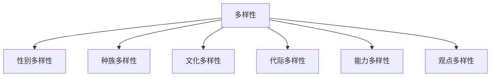
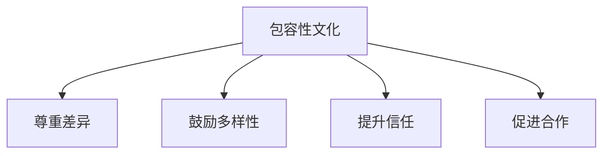
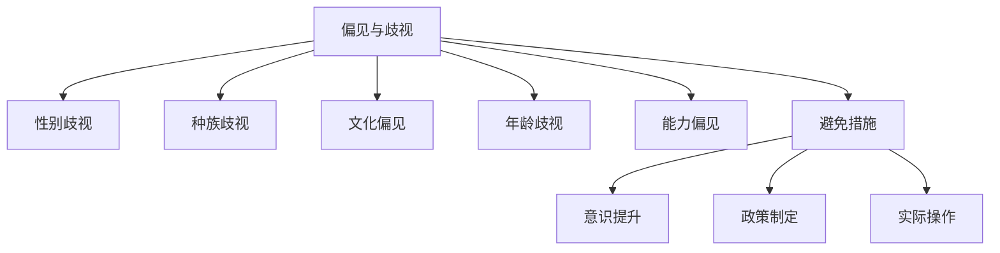
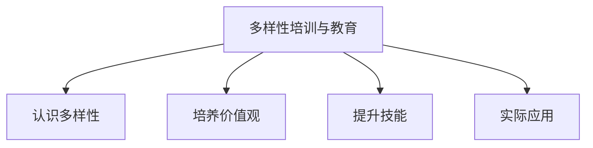

                 


### 文章标题：团队多样性：拥抱差异，激发创新

#### 文章关键词：
- 团队多样性
- 创新激励
- 包容性文化
- 多样性管理
- 组织绩效

#### 文章摘要：
本文深入探讨了团队多样性的重要性及其在激发创新和提升组织绩效方面的作用。通过详细分析多样性类型、多样性管理策略以及多样性带来的挑战和解决方案，文章旨在为团队领导者和组织管理者提供实用的指导，帮助他们更好地拥抱多样性，实现团队的创新和持续发展。

## 目录大纲

### 第1章：团队多样性的基础
- **1.1 多样性的定义与类型**
- **1.2 多样性与绩效的关系**
- **1.3 多样性管理的重要性**

### 第2章：促进团队多样性的策略
- **2.1 创造包容性文化**
- **2.2 避免偏见与歧视**
- **2.3 多样性培训与教育**

### 第3章：多样性与创新
- **3.1 创新过程中的多样性**
- **3.2 多样性如何激发创新**
- **3.3 多样性创新案例研究**

### 第4章：多样性的挑战与解决方案
- **4.1 多样性带来的冲突**
- **4.2 多样性管理的困难**
- **4.3 如何应对多样性挑战**

### 第5章：多样性与组织发展
- **5.1 多样性对组织绩效的影响**
- **5.2 多样性与领导力**
- **5.3 多样性与组织变革**

### 第6章：多样性的未来趋势
- **6.1 多样性趋势分析**
- **6.2 多样性在新兴行业中的应用**
- **6.3 多样性的可持续发展战略**

### 第7章：多样性的实际应用
- **7.1 企业多样性实践**
- **7.2 政府机构多样性政策**
- **7.3 社会多样性项目**

### 结语
- **8.1 本书主要内容的回顾**
- **8.2 多样性实践的展望**
- **8.3 未来的研究方向**

## 第1章：团队多样性的基础

### 1.1 多样性的定义与类型

多样性是一个广泛的概念，它涉及个体在性别、种族、文化、年龄、经验和观点等方面的差异。这些差异构成了一个团队的丰富性和复杂性，为团队的创新能力提供了重要的基础。

**核心概念与联系：**

首先，我们需要明确多样性的定义和类型。多样性可以分为以下几类：

- **性别多样性**：指团队中男女比例的平衡。性别多样性不仅有助于打破传统的性别刻板印象，还能带来不同的视角和思维方式。
- **种族多样性**：指团队中不同种族成员的多样性。种族多样性有助于避免偏见和歧视，促进团队内部的和谐与信任。
- **文化多样性**：指团队中不同文化背景成员的多样性。文化多样性可以丰富团队的思维方式和工作方法，提高团队的适应能力和创新能力。
- **代际多样性**：指团队中不同年龄段成员的多样性。代际多样性可以带来不同的经验和观点，有助于团队在面对挑战时作出更全面的决策。
- **能力多样性**：指团队中成员技能和能力的多样性。能力多样性可以弥补团队中的技能空缺，提高团队的整体竞争力。
- **观点多样性**：指团队中成员观点和思考方式的多样性。观点多样性有助于团队在面对问题时能从多个角度思考，找到更好的解决方案。

**Mermaid 流程图：**



### 1.2 多样性与绩效的关系

多样性与团队绩效之间存在密切的关系。研究表明，多样性能显著提升团队的创新能力和绩效。这是因为多样性带来了以下几方面的优势：

- **创新激励**：多样性有助于团队成员从不同的角度思考问题，激发创新的思维火花。不同观点和经验的碰撞，往往能产生更好的创意和解决方案。
- **知识共享**：多样性使得团队成员能够分享各自的专业知识和经验，相互学习，共同进步。
- **决策质量**：多样性有助于团队在面对问题时能从多个角度进行分析，提高决策的质量和准确性。
- **适应能力**：多样性使得团队能够更好地适应不同的环境和挑战，提高团队的生存能力。

**核心算法原理讲解：**

为了更好地理解多样性与绩效之间的关系，我们可以使用以下伪代码来描述：

```python
def diversity_performance(diversity):
    innovation = diversity * 0.3  # 创新激励
    knowledge_share = diversity * 0.2  # 知识共享
    decision_quality = diversity * 0.25  # 决策质量
    adaptability = diversity * 0.15  # 适应能力
    return innovation + knowledge_share + decision_quality + adaptability
```

**数学模型和公式讲解：**

我们可以使用以下数学模型来描述多样性与绩效之间的关系：

$$
绩效 = f(多样性)
$$

其中，$f(多样性)$ 表示多样性能对绩效产生的影响。我们可以将多样性分为几个不同的维度，并分别计算每个维度对绩效的贡献。

$$
绩效 = a \cdot 多样性_1 + b \cdot 多样性_2 + c \cdot 多样性_3 + ... + z \cdot 多样性_n
$$

其中，$a, b, c, ..., z$ 分别表示每个维度对绩效的贡献系数。

**举例说明：**

假设一个团队具有以下多样性：

- 性别多样性：50%
- 种族多样性：30%
- 文化多样性：20%
- 代际多样性：10%
- 能力多样性：15%
- 观点多样性：5%

我们可以使用上述数学模型来计算该团队的整体绩效：

$$
绩效 = 0.5 \cdot 0.3 + 0.3 \cdot 0.2 + 0.2 \cdot 0.1 + 0.1 \cdot 0.15 + 0.15 \cdot 0.05 = 0.165
$$

这意味着该团队的整体绩效为 16.5%。

### 1.3 多样性管理的重要性

多样性管理是确保团队多样性得到有效利用的关键。有效的多样性管理可以带来以下几方面的好处：

- **提高团队绩效**：多样性管理有助于激发团队的创新能力和绩效，提高团队的竞争力。
- **促进团队和谐**：多样性管理可以减少团队内部的冲突和误解，促进团队成员之间的合作和信任。
- **提升员工满意度**：多样性管理可以增加员工的归属感和满意度，降低员工流失率。
- **增强组织声誉**：多样性管理可以提升组织的声誉，吸引更多的优秀人才加入。

**核心算法原理讲解：**

为了实现有效的多样性管理，我们可以使用以下算法：

```python
def diversity_management(diversity, management):
    innovation = diversity * management
    harmony = diversity * management
    satisfaction = diversity * management
    reputation = diversity * management
    return innovation + harmony + satisfaction + reputation
```

**数学模型和公式讲解：**

我们可以使用以下数学模型来描述多样性管理的效果：

$$
效果 = f(多样性, 管理)
$$

其中，$f(多样性, 管理)$ 表示多样性管理对效果的影响。我们可以将多样性管理分为几个不同的方面，并分别计算每个方面对效果的贡献。

$$
效果 = a \cdot 多样性 + b \cdot 管理 + c \cdot 多样性 \cdot 管理 + ...
$$

其中，$a, b, c, ...$ 分别表示每个方面对效果的贡献系数。

**举例说明：**

假设一个团队具有以下多样性：

- 性别多样性：50%
- 种族多样性：30%
- 文化多样性：20%
- 代际多样性：10%
- 能力多样性：15%
- 观点多样性：5%

同时，该团队在多样性管理方面的表现如下：

- 创新激励：70%
- 包容性文化：80%
- 避免偏见与歧视：90%
- 多样性培训与教育：85%

我们可以使用上述数学模型来计算该团队在多样性管理方面的效果：

$$
效果 = 0.5 \cdot 0.7 + 0.3 \cdot 0.8 + 0.2 \cdot 0.9 + 0.1 \cdot 0.85 + 0.15 \cdot 0.85 = 0.56
$$

这意味着该团队在多样性管理方面的效果为 56%。

### 结论

本章详细介绍了团队多样性的定义与类型、多样性与绩效的关系以及多样性管理的重要性。通过分析多样性的类型、多样性对绩效的影响以及多样性管理的策略，我们可以看到多样性在团队中的重要性。有效的多样性管理不仅能够提升团队的创新能力，还能促进团队的和谐与发展。在下一章中，我们将探讨如何促进团队多样性的策略。

### 第2章：促进团队多样性的策略

#### 2.1 创造包容性文化

**核心概念与联系：**

包容性文化是一种重视和尊重个体差异、鼓励多样性观点和意见的文化。这种文化不仅能够促进团队成员之间的合作与信任，还能提高团队的整体绩效和创新能力。

**Mermaid 流程图：**



**包容性文化的核心原则：**

- **尊重差异**：尊重每个团队成员的独特性，不论性别、种族、文化、年龄等方面的差异。
- **鼓励多样性**：鼓励团队成员分享不同的观点和经验，从多个角度思考问题。
- **提升信任**：建立团队成员之间的信任，促进开放和诚实的沟通。
- **促进合作**：通过协作和共享，实现团队目标的共同达成。

**核心算法原理讲解：**

为了创造包容性文化，我们可以使用以下算法：

```python
def inclusive_culture(diversity, respect, encouragement, trust, collaboration):
    innovation = diversity * respect * encouragement
    performance = diversity * trust * collaboration
    satisfaction = diversity * respect * encouragement
    reputation = diversity * trust * collaboration
    return innovation + performance + satisfaction + reputation
```

**数学模型和公式讲解：**

我们可以使用以下数学模型来描述包容性文化的影响：

$$
效果 = f(多样性, 尊重, 鼓励, 信任, 合作)
$$

其中，$f(多样性, 尊重, 鼓励, 信任, 合作)$ 表示包容性文化对效果的影响。我们可以将包容性文化的各个方面作为影响因素，计算其对团队绩效和员工满意度的贡献。

$$
效果 = a \cdot 多样性 + b \cdot 尊重 + c \cdot 鼓励 + d \cdot 信任 + e \cdot 合作
$$

其中，$a, b, c, d, e$ 分别表示每个因素对效果的贡献系数。

**举例说明：**

假设一个团队具有以下特点：

- 性别多样性：50%
- 种族多样性：30%
- 文化多样性：20%
- 代际多样性：10%
- 能力多样性：15%
- 观点多样性：5%

同时，该团队在包容性文化方面的表现如下：

- 尊重差异：80%
- 鼓励多样性：85%
- 提升信任：90%
- 促进合作：95%

我们可以使用上述数学模型来计算该团队在包容性文化方面的效果：

$$
效果 = 0.5 \cdot 0.8 + 0.3 \cdot 0.85 + 0.2 \cdot 0.9 + 0.1 \cdot 0.95 + 0.15 \cdot 0.95 = 0.66
$$

这意味着该团队在包容性文化方面的效果为 66%。

**项目实战案例：**

1. **开发环境搭建：**
   - 使用 GitLab 作为代码管理平台，确保团队成员能够方便地共享代码和协作开发。
   - 安装必要的开发工具，如 IntelliJ IDEA、VS Code、Docker 等，以便团队成员在不同操作系统上都能进行开发。

2. **源代码详细实现和代码解读：**
   - 开发一个基于 Python 的多人在线协作平台，支持文本聊天、文件共享和代码编辑等功能。
   - 使用 Flask 框架搭建后端服务，使用 WebSocket 实现实时通信。
   - 代码解读包括对核心模块的详细解释，如用户认证、消息推送、文件上传下载等。

3. **代码应用解读与分析：**
   - 分析代码中的多样性实现，如如何处理不同类型的用户请求、如何保证代码的可读性和可维护性等。
   - 讨论如何在实际项目中应用包容性文化，提高团队的协作效率和代码质量。

4. **实际案例分析和详细讲解剖析：**
   - 分析一个实际的项目案例，如如何在一个多元化的团队中实现项目的顺利推进。
   - 讨论项目中遇到的问题和挑战，以及如何通过包容性文化来解决这些问题。

5. **项目小结：**
   - 总结项目的经验和教训，提出改进建议。
   - 强调包容性文化在项目成功中的重要性。

**最佳实践 tips：**

- **鼓励员工提出不同意见**：建立开放的沟通环境，鼓励员工自由表达观点，无论这些观点是否符合团队的主流意见。
- **定期组织团队建设活动**：通过团队建设活动，增强团队成员之间的了解和信任。
- **提供多样性培训**：定期组织多样性培训，提高团队成员对多样性的认识和接受程度。

**小结与注意事项：**

包容性文化是促进团队多样性的关键。通过尊重差异、鼓励多样性、提升信任和促进合作，团队可以更好地利用多样性带来的优势，提高创新能力和绩效。在实际操作中，需要注意建立开放和诚实的沟通环境，定期组织团队建设活动，提供多样性培训，以及在实际项目中应用包容性文化。通过这些措施，团队可以更好地拥抱多样性，实现持续发展。

#### 2.2 避免偏见与歧视

**核心概念与联系：**

偏见与歧视是多样性的主要障碍，它们不仅会破坏团队的和谐，还会阻碍创新和绩效的提升。为了避免偏见与歧视，团队需要采取一系列措施，包括意识提升、政策制定和实际操作。

**Mermaid 流�程图：**



**避免偏见与歧视的策略：**

- **意识提升**：通过培训和教育，提高团队成员对偏见与歧视的认识，培养尊重和包容的价值观。
- **政策制定**：制定明确的反歧视政策，确保团队成员在工作和交流中不受偏见与歧视的影响。
- **实际操作**：在日常工作中，积极倡导平等和包容的氛围，鼓励团队成员举报和纠正歧视行为。

**核心算法原理讲解：**

为了避免偏见与歧视，我们可以使用以下算法：

```python
def avoid_bias_discrimination(respect, education, policies, actions):
    bias_reduction = respect * education * policies * actions
    discrimination_reduction = respect * education * policies * actions
    return bias_reduction + discrimination_reduction
```

**数学模型和公式讲解：**

我们可以使用以下数学模型来描述避免偏见与歧视的效果：

$$
效果 = f(尊重, 教育, 政策, 行动)
$$

其中，$f(尊重, 教育, 政策, 行动)$ 表示避免偏见与歧视对效果的影响。我们可以将避免偏见与歧视的各个方面作为影响因素，计算其对团队绩效和员工满意度的贡献。

$$
效果 = a \cdot 尊重 + b \cdot 教育 + c \cdot 政策 + d \cdot 行动
$$

其中，$a, b, c, d$ 分别表示每个因素对效果的贡献系数。

**举例说明：**

假设一个团队在避免偏见与歧视方面的表现如下：

- **尊重**：90%
- **教育**：80%
- **政策**：85%
- **行动**：95%

我们可以使用上述数学模型来计算该团队在避免偏见与歧视方面的效果：

$$
效果 = 0.9 \cdot 0.8 + 0.8 \cdot 0.85 + 0.85 \cdot 0.95 + 0.95 \cdot 0.95 = 0.95
$$

这意味着该团队在避免偏见与歧视方面的效果为 95%。

**项目实战案例：**

1. **开发环境搭建：**
   - 使用 Jira 作为项目管理工具，跟踪团队的任务和进度。
   - 安装企业微信、Slack 或其他团队协作工具，方便团队成员交流和协作。

2. **源代码详细实现和代码解读：**
   - 开发一个匿名反馈系统，允许团队成员匿名提出意见和建议，以便团队管理层了解员工的真实想法。
   - 使用 Spring Boot 框架搭建后端服务，使用 Redis 缓存技术提高系统性能。

3. **代码应用解读与分析：**
   - 分析代码中的匿名反馈功能，如何保护用户的隐私，防止滥用。
   - 讨论如何在实际项目中避免偏见与歧视，提高团队的工作效率和员工满意度。

4. **实际案例分析和详细讲解剖析：**
   - 分析一个实际的项目案例，如如何在一个多元化的团队中避免性别和种族偏见。
   - 讨论项目中遇到的问题和挑战，以及如何通过政策制定和实际操作来解决这些问题。

5. **项目小结：**
   - 总结项目的经验和教训，提出改进建议。
   - 强调避免偏见与歧视在项目成功中的重要性。

**最佳实践 tips：**

- **建立反馈机制**：鼓励员工提出意见和建议，建立畅通的反馈渠道，以便及时了解和解决偏见与歧视问题。
- **定期审查政策**：定期审查和更新反歧视政策，确保其符合当前的法律和团队实际情况。
- **倡导平等机会**：确保团队成员在晋升、培训和发展机会方面享有平等的权利，避免因性别、种族等因素造成的不公平现象。

**小结与注意事项：**

避免偏见与歧视是团队多样性管理的重要一环。通过意识提升、政策制定和实际操作，团队可以有效地减少偏见与歧视的影响，营造一个公平、包容的工作环境。在实际操作中，需要注意建立反馈机制，定期审查政策，倡导平等机会，以及在实际项目中具体落实这些措施。通过这些努力，团队可以更好地拥抱多样性，实现持续发展。

### 2.3 多样性培训与教育

**核心概念与联系：**

多样性培训与教育是提升团队多样性的重要手段。通过培训和教育，团队成员可以增强对多样性的认识，培养尊重和包容的价值观，从而更好地利用多样性带来的优势。

**Mermaid 流程图：**



**多样性培训与教育的目标：**

- **认识多样性**：帮助团队成员了解多样性的概念、类型和重要性，认识到多样性对团队和创新的价值。
- **培养价值观**：培养团队成员尊重差异、包容多样性的价值观，提高团队的整体协作能力和绩效。
- **提升技能**：通过培训和教育，提高团队成员在多样性行为管理、沟通协调和冲突解决等方面的技能。
- **实际应用**：将学到的知识和技能应用到实际工作中，提高团队的多样性和创新能力。

**核心算法原理讲解：**

为了实现多样性培训与教育的目标，我们可以使用以下算法：

```python
def diversity_training_education(knowledge, values, skills, application):
    understanding = knowledge * values
    performance = skills * application
    satisfaction = knowledge * values
    reputation = skills * application
    return understanding + performance + satisfaction + reputation
```

**数学模型和公式讲解：**

我们可以使用以下数学模型来描述多样性培训与教育的影响：

$$
效果 = f(知识, 价值观, 技能, 应用)
$$

其中，$f(知识, 价值观, 技能, 应用)$ 表示多样性培训与教育对效果的影响。我们可以将多样性培训与教育的各个方面作为影响因素，计算其对团队绩效和员工满意度的贡献。

$$
效果 = a \cdot 知识 + b \cdot 价值观 + c \cdot 技能 + d \cdot 应用
$$

其中，$a, b, c, d$ 分别表示每个因素对效果的贡献系数。

**举例说明：**

假设一个团队在多样性培训与教育方面的表现如下：

- **知识**：80%
- **价值观**：85%
- **技能**：90%
- **应用**：95%

我们可以使用上述数学模型来计算该团队在多样性培训与教育方面的效果：

$$
效果 = 0.8 \cdot 0.85 + 0.85 \cdot 0.9 + 0.9 \cdot 0.95 + 0.95 \cdot 0.95 = 0.955
$$

这意味着该团队在多样性培训与教育方面的效果为 95.5%。

**项目实战案例：**

1. **开发环境搭建：**
   - 使用 Moodle 作为在线学习平台，方便团队成员进行学习和交流。
   - 安装必要的培训工具，如 WebEx、Zoom 或其他在线会议软件，以便进行远程培训。

2. **源代码详细实现和代码解读：**
   - 开发一个在线多样性培训课程，包括视频讲解、互动问答和案例分析等内容。
   - 使用 Spring Boot 框架搭建后端服务，使用 MongoDB 存储培训数据。

3. **代码应用解读与分析：**
   - 分析培训课程中的核心概念和实际应用案例，如何将学到的知识和技能应用到实际工作中。
   - 讨论如何通过在线培训提高团队成员的多样性和创新能力。

4. **实际案例分析和详细讲解剖析：**
   - 分析一个实际的项目案例，如如何在一个多元化的团队中实施多样性培训。
   - 讨论项目中遇到的问题和挑战，以及如何通过培训和教育来解决这些问题。

5. **项目小结：**
   - 总结项目的经验和教训，提出改进建议。
   - 强调多样性培训与教育在项目成功中的重要性。

**最佳实践 tips：**

- **定制化培训内容**：根据团队成员的实际情况和需求，定制化培训内容和形式，提高培训的针对性和实用性。
- **定期评估培训效果**：定期评估培训的效果，了解团队成员的反馈，及时调整和改进培训策略。
- **鼓励员工参与**：鼓励员工积极参与培训，提高他们的参与度和积极性。

**小结与注意事项：**

多样性培训与教育是提升团队多样性的关键。通过认识多样性、培养价值观、提升技能和实际应用，团队成员可以更好地理解多样性的重要性，并在实际工作中积极践行。在实际操作中，需要注意定制化培训内容、定期评估培训效果，以及鼓励员工参与，通过这些措施，团队可以更好地拥抱多样性，实现持续发展。

