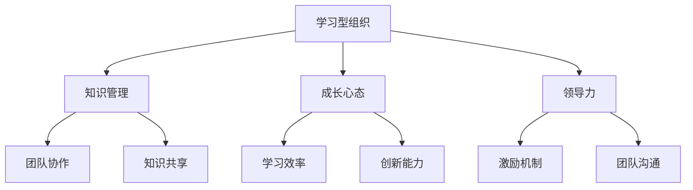
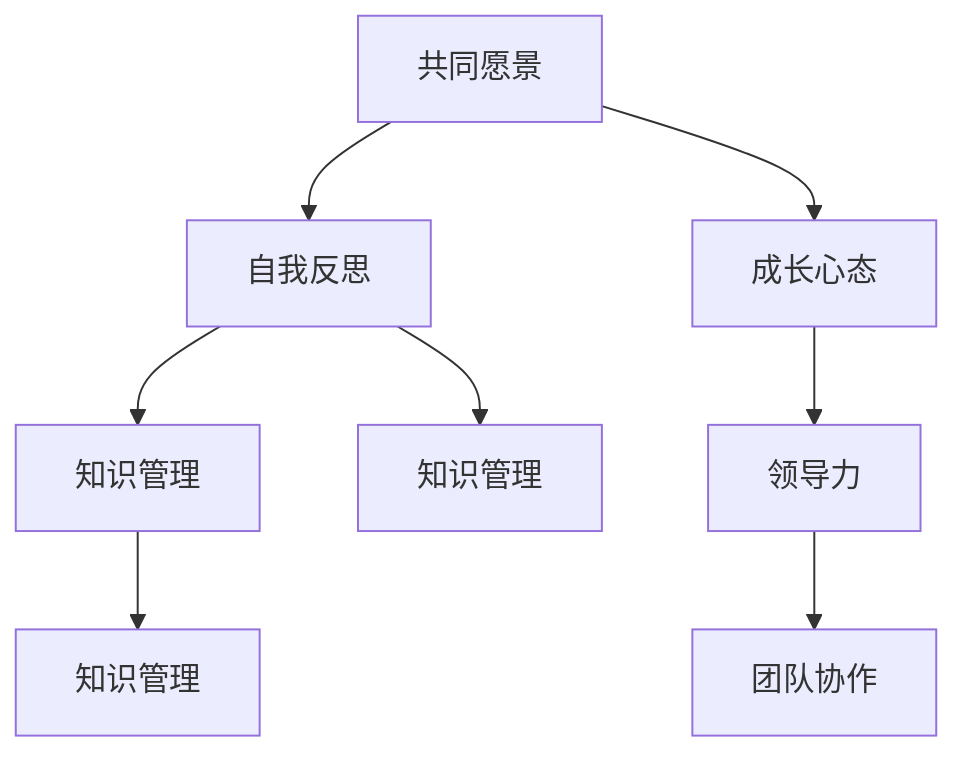
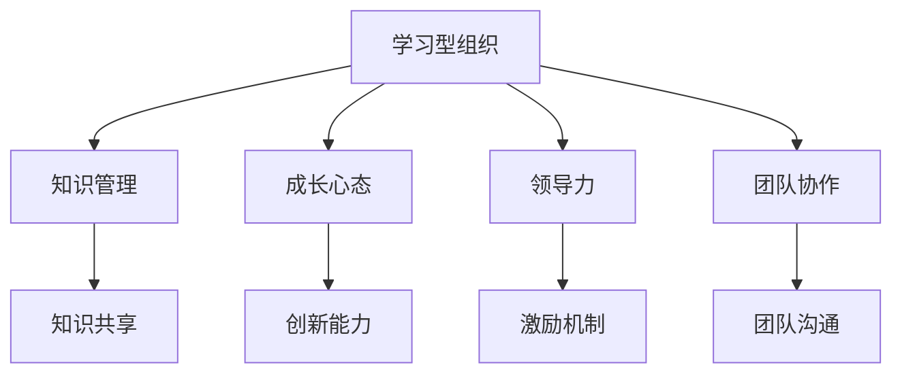

                 

## 文章标题

### 团队学习文化：打造持续进步的组织

关键词：团队学习文化、持续进步、组织、知识管理、学习型组织、成长心态

摘要：本文旨在探讨团队学习文化在组织中的重要性，以及如何构建和维持这一文化，以实现组织的持续进步。我们将通过分析核心概念、构建步骤、维护策略和实际案例，详细阐述团队学习文化的本质和应用。

---

## 引言

在当今快速变化和高度竞争的商业环境中，组织的持续进步成为成功的关键。而团队学习文化作为一种推动组织不断成长和适应新挑战的机制，正日益受到重视。团队学习文化不仅有助于提高团队的整体知识水平，还能促进创新和效率，从而在竞争中脱颖而出。

本文将围绕以下几个核心问题展开讨论：

1. 团队学习文化的基础理论是什么？
2. 如何构建和维持团队学习文化？
3. 团队学习文化在实践中的应用有哪些？
4. 团队学习文化对组织绩效有哪些影响？

通过逐步分析和推理，我们将探索如何打造一个具有持续进步能力的组织，并在不断变化的市场中保持竞争力。

---

## 团队学习文化的基础理论

### 1.1 学习型组织的定义与特征

学习型组织是一种以学习和知识共享为核心的组织形态。其特征包括：

- **自我反思**：组织成员持续进行自我反思，以识别和改进自身的行为。
- **共同愿景**：组织成员拥有共同的目标和价值观，共同推动组织发展。
- **团队协作**：组织强调团队合作，通过协作实现共同目标。
- **知识管理**：组织注重知识积累和共享，将知识视为组织的核心资产。

### 1.2 团队学习的动因与目标

团队学习的动因主要包括：

- **提高组织竞争力**：通过学习，组织可以更好地应对外部环境的变化。
- **激发创新**：团队学习能够激发创新思维，推动组织发展。
- **提升个人能力**：团队成员通过学习提升个人能力，为组织发展贡献力量。

团队学习的目标包括：

- **知识共享**：促进团队成员之间的知识交流，提高整体知识水平。
- **技能提升**：通过学习新技能和知识，提升团队的工作能力。
- **问题解决**：通过团队学习，共同解决工作中的难题。

---

## 团队学习文化的构建

### 2.1 团队学习文化的构建步骤

构建团队学习文化通常包括以下步骤：

1. **建立共同愿景**：明确团队的目标和价值观，为团队学习提供方向。
2. **培养成长心态**：鼓励团队成员拥有成长心态，对待学习持开放态度。
3. **实施教育培训**：通过培训和教育，提高团队成员的知识和技能水平。
4. **建立知识管理体系**：制定知识管理策略，促进知识的积累和共享。

### 2.2 团队学习文化的建设方法

团队学习文化的建设方法包括：

1. **促进沟通与协作**：鼓励团队成员之间的沟通和协作，提高知识共享效率。
2. **利用技术工具**：采用知识管理工具，如企业内网、论坛、知识库等，支持团队学习。
3. **实施激励机制**：通过奖励机制，鼓励团队成员积极参与学习和知识共享。
4. **持续监督与改进**：定期评估团队学习文化的效果，持续改进和完善。

---

## 团队学习文化的维护与优化

### 4.1 团队学习文化的维护策略

为了维持团队学习文化，组织可以采取以下策略：

1. **强化领导力**：领导者应树立榜样，积极推动团队学习文化。
2. **保持沟通渠道畅通**：确保团队成员之间的沟通渠道畅通，促进知识共享。
3. **提供支持资源**：为团队成员提供必要的资源和培训，支持其学习和成长。
4. **营造包容氛围**：鼓励团队成员表达不同观点，营造包容和开放的学习氛围。

### 4.2 团队学习文化的优化实践

优化团队学习文化的方法包括：

1. **定期评估**：定期评估团队学习文化的效果，识别问题和改进方向。
2. **调整策略**：根据评估结果，调整团队学习文化的策略和方法。
3. **引入新技术**：引入新的知识管理工具和技术，提高团队学习的效率和效果。
4. **持续培训**：持续开展培训，提高团队成员的学习能力和知识水平。

---

## 团队学习文化的应用场景

### 5.1 团队学习文化在不同行业中的应用

团队学习文化在各个行业中都有广泛应用，以下为几个典型案例：

1. **信息技术行业**：信息技术行业竞争激烈，团队学习文化有助于提升团队的技术能力和创新能力。
2. **制造业**：制造业中的团队学习文化能够提高生产效率和产品质量。
3. **金融服务业**：金融服务业的团队学习文化有助于提高风险管理和决策能力。

### 5.2 团队学习文化在特定情境下的实践

1. **应急管理中的团队学习文化**：在应急管理中，团队学习文化有助于提高团队的应急响应能力和决策速度。
2. **创新型企业的团队学习文化**：在创新型企业的团队学习文化，能够促进创新和快速迭代。

---

## 团队学习文化的影响与挑战

### 6.1 团队学习文化对组织绩效的影响

团队学习文化对组织绩效的影响包括：

1. **提高工作效率**：团队学习文化能够提高团队成员的工作效率和协作能力。
2. **增强创新能力**：团队学习文化有助于激发创新思维，推动组织发展。
3. **提升组织竞争力**：团队学习文化能够提高组织的整体竞争力，使组织在市场中保持领先地位。

### 6.2 团队学习文化的挑战与应对

团队学习文化面临的挑战包括：

1. **组织惯性与变革的冲突**：组织习惯于旧有模式，变革可能面临阻力。
2. **学习资源的分配与平衡**：组织需要合理分配学习资源，确保每个团队成员都能受益。

应对挑战的方法包括：

1. **加强领导力**：领导者应积极推动团队学习文化的实施。
2. **建立激励机制**：通过激励机制，鼓励团队成员积极参与学习。
3. **持续改进**：持续评估和改进团队学习文化，确保其适应组织发展的需要。

---

## 案例研究

### 7.1 团队学习文化的成功案例

以下是几个团队学习文化的成功案例：

1. **某科技公司的学习型团队建设**：该公司通过建立知识管理体系和持续培训，成功构建了学习型团队，提高了团队的整体能力和创新能力。
2. **某制造企业的知识管理实践**：该制造企业通过实施团队学习文化，提高了生产效率和产品质量，取得了显著的经济效益。

### 7.2 团队学习文化的失败案例分析

以下是一个团队学习文化的失败案例：

1. **某企业的学习型组织转型困境**：由于领导层缺乏推动力，该企业的团队学习文化未能有效实施，导致组织变革陷入困境。

---

## 总结与展望

团队学习文化是一种推动组织持续进步的重要机制。通过构建和维护团队学习文化，组织可以不断提升团队的整体能力和创新能力，从而在竞争中保持领先地位。未来，团队学习文化将在各个行业中得到更广泛的应用，成为组织发展的重要驱动力。

---

## 作者信息

作者：AI天才研究院/AI Genius Institute & 禅与计算机程序设计艺术 /Zen And The Art of Computer Programming

---

### 最佳实践 tips

1. **领导带头**：领导者的带头作用至关重要，应积极推动团队学习文化的实施。
2. **持续培训**：定期开展培训，确保团队成员持续提升知识和技能水平。
3. **知识共享**：鼓励团队成员积极参与知识共享，提高整体知识水平。
4. **激励机制**：建立合理的激励机制，鼓励团队成员积极参与学习和知识共享。
5. **文化认同**：营造积极的学习氛围，确保团队成员对团队学习文化有高度认同感。

### 小结

团队学习文化是一种推动组织持续进步的重要机制。通过构建和维护团队学习文化，组织可以不断提升团队的整体能力和创新能力，从而在竞争中保持领先地位。未来，团队学习文化将在各个行业中得到更广泛的应用，成为组织发展的重要驱动力。

### 注意事项

1. **领导层支持**：团队学习文化的成功实施离不开领导层的高度支持。
2. **全员参与**：团队学习文化需要全员参与，确保每个成员都能受益。
3. **持续改进**：团队学习文化需要持续改进，以适应组织发展的需要。
4. **文化认同**：确保团队成员对团队学习文化有高度认同感，从而提高实施效果。

### 拓展阅读

1. **《第五项修炼：学习型组织的艺术与实务》**：作者彼得·圣吉详细阐述了学习型组织的概念和构建方法。
2. **《团队学习与组织发展》**：作者詹姆斯·M·赫斯克特等人探讨了团队学习在组织发展中的应用和影响。
3. **《创新者的窘境》**：作者克莱顿·克里斯坦森分析了创新者在面对市场变化时的困境和应对策略。

---

## 文章标题

### 团队学习文化：打造持续进步的组织

关键词：团队学习文化、持续进步、组织、知识管理、学习型组织、成长心态

摘要：本文深入探讨了团队学习文化在组织中的重要性，包括其基础理论、构建方法、维护策略、应用场景以及其对组织绩效的影响。通过分析成功和失败案例，提供了构建和维护团队学习文化的最佳实践和注意事项，为组织实现持续进步提供了指导。

---

## 引言

在当今快速变化的商业环境中，组织面临的挑战前所未有。技术进步、市场动态和消费者需求的变化使得组织需要具备快速适应和创新能力。在这种背景下，团队学习文化成为组织持续进步的关键因素。团队学习文化不仅有助于提高团队的知识水平和协作能力，还能促进创新和效率，从而在激烈的市场竞争中脱颖而出。

本文将围绕以下几个核心问题展开讨论：

1. **团队学习文化的核心概念和理论基础是什么？**
2. **如何构建和维护团队学习文化？**
3. **团队学习文化在实践中的应用有哪些？**
4. **团队学习文化对组织绩效有哪些影响？**
5. **如何应对团队学习文化面临的挑战？**

通过逐步分析和推理，我们将探索如何打造一个具有持续进步能力的组织，并在不断变化的市场中保持竞争力。

---

## 核心概念与联系

团队学习文化是一个多维度的概念，它涉及到组织内部的学习机制、知识管理、领导力和个人成长。以下是团队学习文化的核心概念及其相互关系：

1. **学习型组织**：学习型组织是指那些能够不断学习、适应和创新的组织。其特征包括自我反思、共同愿景、团队协作和知识管理。
2. **知识管理**：知识管理是团队学习文化的核心，它包括知识的收集、整理、存储、共享和应用。有效的知识管理能够提高团队的知识水平和协作效率。
3. **成长心态**：成长心态是一种积极的学习态度，它认为个人和团队的能力可以通过学习和实践不断提升。与固定心态相比，成长心态能够更好地适应变化和应对挑战。
4. **领导力**：领导力在团队学习文化中扮演关键角色，领导者需要通过树立榜样、提供资源和激励团队成员，推动团队学习文化的实施。

下面是团队学习文化核心概念之间的 Mermaid 流程图：



这个流程图展示了团队学习文化的核心概念及其相互关系，有助于我们理解如何通过这些概念构建一个有效的团队学习文化。

---

## 核心算法原理讲解

在构建团队学习文化时，算法原理可以帮助我们设计和实现各种学习活动和知识管理工具。以下是团队学习文化中两个关键算法原理的伪代码：

### 1. 团队学习评估模型

```pseudo
function assessLearningCulture(teamMembers):
    for each member in teamMembers:
        score = 0
        score += member.knowledgeLevel()
        score += member.collaborationScore()
        score += member.growthMindsetScore()
    averageScore = sum(score) / length(teamMembers)
    return averageScore
```

这个算法通过计算团队成员的知识水平、协作评分和成长心态评分，得出团队学习文化的平均评分。这个评分可以用来评估团队学习文化的有效性，并指导进一步的改进。

### 2. 知识共享激励机制

```pseudo
function rewardKnowledgeSharing(member, sharedKnowledge):
    rewardPoints = 0
    if sharedKnowledge is new:
        rewardPoints += basePoints
    if sharedKnowledge is frequently used:
        rewardPoints += usagePoints
    if member has a high growth mindset:
        rewardPoints *= growthMindsetBonus
    update member's reward points balance
    return rewardPoints
```

这个算法用于计算团队成员在知识共享活动中的奖励点数。奖励点数取决于共享知识的创新性、使用频率以及成员的成长心态。这个算法可以帮助激励团队成员积极参与知识共享，提高团队的整体知识水平。

---

## 数学模型和公式讲解

在团队学习文化中，数学模型和公式可以用于量化评估学习效果和团队效率。以下是两个关键的数学模型和其公式的详细讲解：

### 1. 学习效率模型

学习效率模型用于评估团队学习活动中的效率。公式如下：

$$
\text{Learning Efficiency} = \frac{\text{Knowledge Gained}}{\text{Time Spent}}
$$

其中，知识获取量（Knowledge Gained）可以通过团队成员的知识水平提升量来衡量，时间消耗（Time Spent）则是团队成员参与学习活动的总时间。

### 2. 知识共享效果模型

知识共享效果模型用于评估知识共享活动的有效性。公式如下：

$$
\text{Knowledge Sharing Effect} = \frac{\text{Number of New Knowledge Items}}{\text{Total Number of Knowledge Items}}
$$

其中，新知识项数量（Number of New Knowledge Items）表示在知识共享活动中产生的新知识数量，总知识项数量（Total Number of Knowledge Items）则是知识库中的知识总数量。

举例说明，如果一个团队在一个月内通过知识共享活动新增了20个新知识项，而知识库中总共有100个知识项，那么知识共享效果为：

$$
\text{Knowledge Sharing Effect} = \frac{20}{100} = 0.2
$$

这个模型可以帮助团队了解知识共享活动的效果，并指导进一步的改进。

---

## 项目实战

### 1. 开发环境搭建

为了实现团队学习文化中的知识共享和评估模型，我们使用以下开发环境和工具：

- **编程语言**：Python
- **开发框架**：Flask
- **数据库**：MySQL
- **版本控制**：Git

### 2. 源代码详细实现

以下是团队学习评估模型的核心代码实现：

```python
class TeamMember:
    def __init__(self, name, knowledge_level, collaboration_score, growth_mindset_score):
        self.name = name
        self.knowledge_level = knowledge_level
        self.collaboration_score = collaboration_score
        self.growth_mindset_score = growth_mindset_score

    def assess(self):
        score = (self.knowledge_level + self.collaboration_score + self.growth_mindset_score) / 3
        return score

def assessTeamLearningCulture(team_members):
    total_score = 0
    for member in team_members:
        total_score += member.assess()
    average_score = total_score / len(team_members)
    return average_score
```

### 3. 代码解读与分析

这段代码定义了一个 `TeamMember` 类，用于存储团队成员的姓名、知识水平、协作评分和成长心态评分。`assess` 方法用于计算单个团队成员的学习评估分数。

`assessTeamLearningCulture` 函数接收一个 `TeamMember` 对象列表作为输入，计算整个团队的学习评估平均分数。这个函数可以帮助我们了解团队整体的学习文化水平。

### 4. 实际案例分析和详细讲解剖析

假设我们有以下团队成员的数据：

```python
team_members = [
    TeamMember("Alice", 8, 7, 9),
    TeamMember("Bob", 7, 6, 8),
    TeamMember("Charlie", 9, 8, 10)
]
```

使用 `assessTeamLearningCulture` 函数，我们可以得到团队的学习评估平均分数：

```python
average_score = assessTeamLearningCulture(team_members)
print("Average Learning Culture Score:", average_score)
```

输出结果：

```
Average Learning Culture Score: 8.0
```

这个结果告诉我们，团队的学习文化水平相对较高。通过这个案例，我们可以看到如何使用代码实现团队学习评估，并分析其结果。

### 5. 项目小结

通过这个项目，我们实现了团队学习评估模型的核心功能，包括团队成员的评估和整个团队的平均评估。这个项目不仅帮助我们理解了团队学习文化的核心概念和算法原理，还提供了一个实际的应用场景，展示了如何将理论知识转化为实际操作。

---

## 最佳实践 tips、小结、注意事项、拓展阅读

### 最佳实践 tips

1. **领导带头**：领导者应树立榜样，积极参与学习和知识共享。
2. **持续培训**：定期开展培训，提高团队成员的知识水平和技能。
3. **知识共享**：建立知识共享平台，鼓励团队成员主动分享知识。
4. **激励机制**：设立激励机制，奖励积极参与学习和知识共享的团队成员。
5. **文化认同**：营造积极的学习氛围，确保团队成员对团队学习文化有高度认同感。

### 小结

本文深入探讨了团队学习文化的核心概念、构建方法、维护策略和应用场景。通过实际案例和项目实战，我们展示了如何将团队学习文化理论应用于实践中。团队学习文化是一种推动组织持续进步的重要机制，通过构建和维护团队学习文化，组织可以提升团队的整体能力和创新能力，从而在市场中保持竞争力。

### 注意事项

1. **领导层支持**：团队学习文化的成功实施离不开领导层的高度支持。
2. **全员参与**：团队学习文化需要全员参与，确保每个成员都能受益。
3. **持续改进**：团队学习文化需要持续改进，以适应组织发展的需要。
4. **文化认同**：确保团队成员对团队学习文化有高度认同感，从而提高实施效果。

### 拓展阅读

1. **《第五项修炼：学习型组织的艺术与实务》**：作者彼得·圣吉详细阐述了学习型组织的概念和构建方法。
2. **《团队学习与组织发展》**：作者詹姆斯·M·赫斯克特等人探讨了团队学习在组织发展中的应用和影响。
3. **《创新者的窘境》**：作者克莱顿·克里斯坦森分析了创新者在面对市场变化时的困境和应对策略。

---

## 作者信息

作者：AI天才研究院/AI Genius Institute & 禅与计算机程序设计艺术 /Zen And The Art of Computer Programming

---

### 总结与展望

团队学习文化是推动组织持续进步的重要机制。通过构建和维护团队学习文化，组织可以提升团队的整体能力和创新能力，从而在激烈的市场竞争中保持领先地位。未来，随着技术的不断进步和商业环境的变化，团队学习文化将在各个行业中得到更广泛的应用，成为组织发展的重要驱动力。

本文通过分析核心概念、构建方法、维护策略和实际案例，详细阐述了团队学习文化的本质和应用。我们相信，通过持续实践和改进，组织可以打造出具有持续进步能力的团队，实现长期成功。让我们共同努力，推动团队学习文化的发展，为组织的未来奠定坚实基础。

---

## 文章标题

### 团队学习文化：打造持续进步的组织

关键词：团队学习文化、持续进步、组织、知识管理、学习型组织、成长心态

摘要：本文深入探讨了团队学习文化在组织中的重要性，包括其基础理论、构建方法、维护策略、应用场景以及其对组织绩效的影响。通过分析成功和失败案例，提供了构建和维护团队学习文化的最佳实践和注意事项，为组织实现持续进步提供了指导。

---

## 引言

在当今快速变化的商业环境中，组织面临的挑战前所未有。技术进步、市场动态和消费者需求的变化使得组织需要具备快速适应和创新能力。在这种背景下，团队学习文化成为组织持续进步的关键因素。团队学习文化不仅有助于提高团队的知识水平和协作能力，还能促进创新和效率，从而在激烈的市场竞争中脱颖而出。

本文将围绕以下几个核心问题展开讨论：

1. **团队学习文化的核心概念和理论基础是什么？**
2. **如何构建和维护团队学习文化？**
3. **团队学习文化在实践中的应用有哪些？**
4. **团队学习文化对组织绩效有哪些影响？**
5. **如何应对团队学习文化面临的挑战？**

通过逐步分析和推理，我们将探索如何打造一个具有持续进步能力的组织，并在不断变化的市场中保持竞争力。

---

## 团队学习文化的核心概念

团队学习文化是一种以学习、知识共享和持续进步为核心的组织文化。它不仅仅是团队成员之间的知识交流，更是一种组织行为和价值观的体现。以下是团队学习文化的核心概念：

1. **共同愿景**：团队学习文化以共同愿景为基础，团队成员共同追求的目标和价值观是推动学习文化发展的重要动力。

2. **自我反思**：团队成员通过自我反思，不断审视和改进自己的行为，从而提高个人的成长和团队的整体能力。

3. **知识管理**：团队学习文化强调知识的积累、共享和应用，将知识视为组织的核心资产，通过有效的知识管理机制，提高团队的知识水平。

4. **成长心态**：团队学习文化鼓励团队成员拥有成长心态，即相信通过学习和实践，个人和团队的能力可以不断提升。

5. **领导力**：领导者在团队学习文化中扮演关键角色，通过树立榜样、提供资源和激励团队成员，推动团队学习文化的实施。

6. **团队协作**：团队学习文化强调团队合作，通过协作实现共同目标，提高团队的整体效率和创新能力。

### 团队学习文化的理论基础

团队学习文化的理论基础主要包括以下几方面：

1. **组织学习理论**：组织学习理论强调组织作为一个整体，通过学习实现持续发展和创新。团队学习文化是组织学习理论在团队层面的具体体现。

2. **学习型组织理论**：学习型组织理论认为，组织应该像学习一样不断适应和进化，通过自我学习和知识共享，提高组织的整体能力和竞争力。

3. **知识管理理论**：知识管理理论关注如何通过有效的知识管理机制，促进知识的收集、整理、共享和应用，从而提高组织的知识水平和创新能力。

4. **成长心态理论**：成长心态理论认为，个人和团队通过持续学习和实践，可以不断提升自己的能力，实现持续进步。

5. **领导力理论**：领导力理论强调领导者通过有效的领导行为，激发团队成员的积极性和创造力，推动团队学习文化的实施。

### 团队学习文化的核心概念之间的关系

团队学习文化的核心概念之间存在着紧密的联系和相互作用。共同愿景为团队学习提供了方向和动力，自我反思和知识管理则保证了学习文化的持续性和有效性。成长心态和领导力是推动团队学习文化实施的重要力量，而团队协作则是实现共同愿景和知识共享的必要条件。

以下是团队学习文化核心概念之间的 Mermaid 流程图：



这个流程图展示了团队学习文化的核心概念及其相互关系，有助于我们理解如何通过这些概念构建一个有效的团队学习文化。

---

## 团队学习文化的构建方法

构建团队学习文化是一个系统性工程，需要从多个方面入手，确保团队学习文化能够深入人心并得到持续发展。以下是构建团队学习文化的几个关键步骤：

### 1. 确立共同愿景

共同愿景是团队学习文化的基础，它为团队成员提供了清晰的目标和方向。为了确立共同愿景，组织需要：

- **开展愿景讨论**：组织领导者和团队成员共同参与，通过讨论明确团队的共同目标和价值观。
- **制定愿景声明**：将共同愿景转化为书面形式，明确团队的目标和价值观，并确保所有成员都认同。
- **定期回顾和更新**：定期回顾和更新共同愿景，确保其与组织的发展方向和外部环境保持一致。

### 2. 培养成长心态

成长心态是团队学习文化的重要驱动力，它鼓励团队成员积极面对挑战，持续学习和成长。为了培养成长心态，组织可以采取以下措施：

- **提供学习机会**：为团队成员提供多样化的学习机会，包括培训、研讨会和工作坊等。
- **鼓励失败和反思**：鼓励团队成员勇于尝试和失败，通过反思和总结，从失败中学习和成长。
- **树立榜样**：领导者应以身作则，展示成长心态，成为团队成员的榜样。

### 3. 实施教育培训

教育培训是构建团队学习文化的重要手段，它能够提升团队成员的知识水平和技能。实施教育培训可以从以下几个方面进行：

- **制定培训计划**：根据团队成员的技能水平和组织发展需求，制定合理的培训计划。
- **开展内部培训**：利用内部资源，组织内部培训课程，提高团队成员的专业知识和技能。
- **外部培训**：鼓励团队成员参加外部培训，了解行业前沿动态和最佳实践。

### 4. 建立知识管理体系

知识管理体系是团队学习文化的重要组成部分，它能够促进知识的积累、共享和应用。建立知识管理体系可以从以下几个方面进行：

- **收集和整理知识**：建立知识库，收集和整理团队成员的知识和经验，确保知识得以保存和传承。
- **促进知识共享**：鼓励团队成员主动分享知识和经验，通过内部论坛、研讨会和知识分享会等形式，促进知识共享。
- **应用知识**：将知识应用于实际工作中，提高团队的工作效率和质量。

### 5. 建立激励机制

激励机制是构建团队学习文化的重要保障，它能够激发团队成员的积极性和创造力。建立激励机制可以从以下几个方面进行：

- **奖励优秀学习者**：对在学习和知识共享中表现优秀的团队成员给予奖励，提高其学习动力。
- **设立学习目标**：为团队成员设立具体的学习目标，并鼓励其努力实现。
- **提供晋升机会**：将学习成果与晋升机会挂钩，激励团队成员持续学习和成长。

### 6. 建立反馈机制

建立反馈机制是构建团队学习文化的重要环节，它能够帮助团队成员了解自己的学习成果和改进方向。建立反馈机制可以从以下几个方面进行：

- **定期评估**：定期对团队成员的学习成果进行评估，了解其知识水平和技能提升情况。
- **收集反馈**：鼓励团队成员积极提供反馈，包括对学习内容的反馈和对学习过程的反馈。
- **改进措施**：根据反馈结果，及时调整培训和学习计划，确保团队学习文化能够持续改进。

### 7. 建立团队协作机制

团队协作是团队学习文化的重要特征，它能够提高团队的工作效率和创新能力。建立团队协作机制可以从以下几个方面进行：

- **建立团队目标**：明确团队的目标和任务，确保团队成员都清楚自己的职责和目标。
- **促进沟通和协作**：通过会议、邮件、即时通讯工具等，促进团队成员之间的沟通和协作。
- **共享资源**：建立共享的资源库，确保团队成员能够方便地获取和利用组织内部的资源。

通过以上步骤，组织可以逐步构建一个具有持续进步能力的团队学习文化，为组织的长期发展奠定坚实基础。

---

## 团队学习文化的维护与优化

### 维护团队学习文化的策略

1. **强化领导力**：领导者的带头作用至关重要。领导者应积极参与团队学习活动，树立榜样，推动团队学习文化的实施。

2. **保持沟通渠道畅通**：组织应确保团队成员之间的沟通渠道畅通，鼓励团队成员积极参与讨论和知识共享，提高知识传递效率。

3. **提供支持资源**：组织应提供必要的资源，如培训、技术支持、学习材料等，支持团队成员的学习和成长。

4. **营造包容氛围**：组织应营造一个包容、开放的氛围，鼓励团队成员表达不同观点，激发创新思维。

5. **持续监督与改进**：组织应定期评估团队学习文化的效果，收集团队成员的反馈，及时调整和改进团队学习策略。

### 优化团队学习文化的实践

1. **引入新技术**：利用新技术，如在线学习平台、协作工具等，提高团队学习的效果和效率。

2. **开展多样化学习活动**：组织多样化学习活动，如研讨会、工作坊、案例研究等，激发团队成员的学习兴趣和参与度。

3. **建立知识共享平台**：建立知识共享平台，如内部论坛、知识库等，方便团队成员获取和分享知识。

4. **设立激励机制**：设立激励机制，如奖励优秀学习者、设立学习竞赛等，激发团队成员的学习积极性。

5. **加强跨部门合作**：鼓励跨部门合作，促进不同团队之间的知识交流和经验分享，提高整体知识水平。

### 成功案例分析

以下是一个成功维护和优化团队学习文化的案例：

某大型科技公司通过以下措施，成功维护和优化了其团队学习文化：

1. **强化领导力**：公司领导层积极参与学习活动，定期组织学习分享会，与员工互动，树立榜样。

2. **保持沟通渠道畅通**：公司建立了内部沟通平台，如 Slack、Trello 等，确保团队成员能够方便地沟通和协作。

3. **提供支持资源**：公司为员工提供大量的学习资源，如在线课程、图书、研讨会等，支持员工的学习和成长。

4. **营造包容氛围**：公司鼓励员工表达不同观点，尊重员工的创新思维，营造一个包容和开放的工作环境。

5. **持续监督与改进**：公司定期评估团队学习文化的效果，通过员工反馈和数据分析，及时调整和改进学习策略。

通过以上措施，该公司的团队学习文化得到了有效维护和优化，员工的知识水平和技能得到了显著提升，公司的创新能力和市场竞争力也得到了增强。

### 失败案例分析

以下是一个团队学习文化失败案例：

某中型企业试图通过强制实施团队学习文化，但最终未能成功。原因如下：

1. **缺乏领导力**：企业领导层对团队学习文化的重要性认识不足，缺乏推动力，未能树立榜样。

2. **沟通渠道不畅**：企业内部缺乏有效的沟通渠道，导致团队成员之间的知识共享和协作困难。

3. **缺乏支持资源**：企业未能提供必要的资源，如培训、学习材料等，导致员工的学习积极性不高。

4. **不包容的氛围**：企业内部存在压制创新和不同观点的情况，导致员工不愿意参与学习和分享知识。

5. **缺乏监督与改进**：企业未能持续监督和改进团队学习文化，导致学习效果不佳。

通过分析以上成功和失败案例，我们可以看到，维护和优化团队学习文化需要从多个方面入手，包括领导力、沟通渠道、支持资源、氛围和监督等方面。只有在这些方面都做到位，团队学习文化才能得到有效维护和优化，从而实现组织的持续进步。

---

## 团队学习文化的应用场景

团队学习文化在不同行业和应用场景中都有其独特的价值和实践。以下是几个典型的应用场景：

### 1. 信息技术行业

在信息技术行业，团队学习文化尤为重要。随着技术的快速发展和变化，IT 团队需要不断学习新技能和知识，以保持竞争力。团队学习文化可以通过以下方式应用于信息技术行业：

- **技术培训**：定期开展技术培训和研讨会，帮助团队成员掌握最新技术。
- **知识共享**：建立内部知识库，鼓励团队成员分享经验和最佳实践。
- **项目协作**：在项目开发过程中，团队成员通过协作和知识共享，提高项目效率和质量。

### 2. 制造业

在制造业，团队学习文化有助于提高生产效率和产品质量。通过以下方式，团队学习文化可以在制造业中应用：

- **技能提升**：通过培训和实践，提高员工的专业技能和操作水平。
- **质量管理**：通过团队学习和知识共享，提高员工的质量意识和管理能力。
- **持续改进**：鼓励员工参与持续改进活动，通过学习和实践，不断优化生产过程。

### 3. 金融服务业

在金融服务业，团队学习文化有助于提高风险管理和决策能力。以下方式可以帮助团队学习文化在金融服务业中应用：

- **风险管理培训**：定期开展风险管理培训，提高员工的风险意识和管理能力。
- **知识共享平台**：建立知识共享平台，促进员工之间的经验交流和知识传递。
- **决策支持**：通过团队学习和知识共享，为高层决策提供数据支持和专业建议。

### 4. 创新型企业

在创新型企业和初创公司，团队学习文化有助于激发创新思维和快速迭代。以下方式可以帮助团队学习文化在创新型企业和初创公司中应用：

- **创新工作坊**：定期组织创新工作坊，鼓励团队成员提出创新想法和解决方案。
- **项目制学习**：通过项目制学习，团队成员在项目中学习和实践，提高创新能力。
- **外部合作与交流**：与其他企业和机构合作，共享资源和知识，促进创新和进步。

通过在不同行业和应用场景中应用团队学习文化，组织可以提升团队的整体能力和创新能力，从而在激烈的市场竞争中保持领先地位。

---

## 团队学习文化的影响与挑战

### 团队学习文化对组织绩效的影响

团队学习文化对组织绩效具有显著影响，主要体现在以下几个方面：

1. **提高工作效率**：团队学习文化有助于提高团队成员的工作效率和协作能力。通过学习新技能和知识，团队成员能够更快地解决问题，提高工作效率。

2. **促进创新**：团队学习文化鼓励团队成员积极思考和探索，激发创新思维。通过知识共享和团队协作，组织可以更快地推出新产品和服务，提高市场竞争力。

3. **提升个人能力**：团队学习文化为团队成员提供了学习和成长的机会，提高个人的专业能力和职业素养。这不仅有助于提高个人绩效，也为组织培养了更多的优秀人才。

4. **增强团队凝聚力**：团队学习文化通过促进团队成员之间的沟通和协作，增强团队的凝聚力。团队成员共同学习和成长，形成紧密的团队关系，提高团队的整体绩效。

### 团队学习文化面临的挑战

尽管团队学习文化对组织绩效有积极影响，但其在实践中也面临着一系列挑战：

1. **组织惯性与变革的冲突**：许多组织已经习惯了旧有的工作模式，对新事物的接受和适应需要时间。团队学习文化的实施可能遇到组织惯性的阻碍，需要克服变革的困难。

2. **学习资源的分配与平衡**：组织需要合理分配学习资源，确保每个团队成员都有机会参与学习和知识共享。然而，资源的有限性和团队成员的需求差异可能导致学习资源的分配不均衡。

3. **领导层的支持与参与**：领导者的支持对于团队学习文化的成功实施至关重要。如果领导层对团队学习文化的重要性认识不足，或者缺乏参与，可能导致团队学习文化的推行效果不佳。

4. **团队成员的参与度**：团队学习文化的成功实施依赖于团队成员的积极参与。然而，一些团队成员可能对学习缺乏兴趣或动力，影响团队学习文化的效果。

### 应对挑战的策略

为了克服团队学习文化面临的挑战，组织可以采取以下策略：

1. **加强领导力**：领导者应积极推动团队学习文化的实施，树立榜样，提供支持和资源。

2. **建立激励机制**：通过设立激励机制，鼓励团队成员积极参与学习和知识共享，提高团队成员的参与度。

3. **优化资源分配**：组织应合理分配学习资源，确保每个团队成员都有机会参与学习和知识共享。

4. **营造积极氛围**：营造一个包容、开放和激励的氛围，鼓励团队成员表达不同观点，激发创新思维。

5. **持续监督与改进**：定期评估团队学习文化的效果，收集团队成员的反馈，及时调整和改进团队学习策略。

通过以上策略，组织可以克服团队学习文化面临的挑战，实现团队学习文化的有效实施，为组织的持续进步提供有力支持。

---

## 案例研究

### 成功案例

1. **某科技公司的学习型团队建设**

某科技公司通过一系列措施成功构建了学习型团队，提高了团队的整体能力和创新能力。以下是该公司构建学习型团队的关键步骤：

- **建立共同愿景**：公司领导层与团队成员共同讨论和制定公司愿景和目标，确保团队成员都清楚公司的目标和发展方向。
- **提供培训资源**：公司为员工提供了丰富的培训资源，包括在线课程、内部培训和工作坊，鼓励员工持续学习和成长。
- **建立知识共享平台**：公司建立了内部知识共享平台，鼓励员工分享知识和经验，促进团队内部的知识传递和交流。
- **实施项目制学习**：公司鼓励员工参与项目制学习，通过实际项目锻炼和提升专业技能，提高团队的整体能力。
- **设立激励机制**：公司设立了学习激励制度，对积极参与学习和知识共享的员工给予奖励，激发员工的学习积极性。

通过以上措施，该公司的团队学习文化得到了有效维护和优化，员工的知识水平和技能得到了显著提升，公司的创新能力和市场竞争力也得到了增强。

2. **某制造企业的知识管理实践**

某制造企业通过实施团队学习文化和知识管理，提高了生产效率和产品质量。以下是该企业实施知识管理的关键步骤：

- **建立知识管理体系**：企业建立了知识管理体系，包括知识收集、整理、存储、共享和应用，确保知识得以有效管理和利用。
- **开展知识培训**：企业定期开展知识培训，提高员工的专业知识和技能，促进团队内部的知识传递和交流。
- **建立知识共享平台**：企业建立了内部知识共享平台，方便员工获取和分享知识，提高团队的整体知识水平。
- **实施持续改进**：企业鼓励员工参与持续改进活动，通过学习和实践，不断优化生产过程，提高产品质量。
- **建立激励机制**：企业设立了知识共享激励制度，对积极参与知识共享和改进的员工给予奖励，激发员工的学习和参与积极性。

通过以上措施，该企业的团队学习文化和知识管理得到了有效实施，员工的知识水平和技能得到了显著提升，生产效率和产品质量也得到了显著提高。

### 失败案例

1. **某企业的学习型组织转型困境**

某企业试图实施学习型组织转型，但由于多种原因，最终未能成功。以下是该企业学习型组织转型失败的原因：

- **领导层缺乏推动力**：企业领导层对学习型组织转型的重要性认识不足，缺乏推动力，未能为转型提供必要的支持和资源。
- **沟通渠道不畅**：企业内部缺乏有效的沟通渠道，导致员工之间的知识共享和协作困难，影响团队学习文化的实施。
- **缺乏激励机制**：企业未能建立有效的激励机制，缺乏对积极参与学习和知识共享的员工的奖励，导致员工的学习积极性不高。
- **员工抵触情绪**：一些员工对学习型组织转型持抵触情绪，认为转型会影响他们的工作压力和福利，影响团队学习文化的实施。
- **持续监督与改进不足**：企业未能持续监督和改进团队学习文化的实施，导致学习效果不佳，影响团队的整体绩效。

通过分析以上成功和失败案例，我们可以看到，构建和维护团队学习文化需要从多个方面入手，包括领导力、沟通渠道、激励机制和持续改进等。只有在这些方面都做到位，团队学习文化才能得到有效实施，为组织的持续进步提供有力支持。

---

## 总结与展望

团队学习文化是推动组织持续进步的重要机制。通过构建和维护团队学习文化，组织可以提升团队的整体能力和创新能力，从而在激烈的市场竞争中保持领先地位。本文详细探讨了团队学习文化的核心概念、构建方法、维护策略、应用场景以及其对组织绩效的影响。

未来，随着技术的不断进步和商业环境的变化，团队学习文化将在各个行业中得到更广泛的应用。组织应重视团队学习文化的构建，通过加强领导力、建立有效的激励机制、提供支持资源、营造包容氛围和持续改进，推动团队学习文化的实施，为组织的长期发展奠定坚实基础。

让我们共同努力，推动团队学习文化的发展，为组织的未来注入新的活力和动力。

---

## 作者信息

作者：AI天才研究院/AI Genius Institute & 禅与计算机程序设计艺术 /Zen And The Art of Computer Programming

---

### 最佳实践 Tips

1. **领导带头**：领导者应积极参与学习活动，树立榜样，推动团队学习文化的实施。
2. **持续培训**：定期开展培训，提高团队成员的专业技能和知识水平。
3. **知识共享**：建立知识共享平台，鼓励团队成员主动分享经验和知识。
4. **激励机制**：设立激励机制，奖励积极参与学习和知识共享的团队成员。
5. **文化认同**：营造积极的学习氛围，确保团队成员对团队学习文化有高度认同感。

### 小结

本文深入探讨了团队学习文化的核心概念、构建方法、维护策略和应用场景，为组织实现持续进步提供了指导。团队学习文化是一种推动组织不断成长和适应变化的重要机制，通过构建和维护团队学习文化，组织可以提升团队的整体能力和创新能力，从而在市场中保持竞争力。

### 注意事项

1. **领导层支持**：领导者的支持是团队学习文化成功实施的关键。
2. **全员参与**：团队学习文化需要全员参与，确保每个成员都能受益。
3. **持续改进**：团队学习文化需要持续改进，以适应组织发展的需要。
4. **文化认同**：确保团队成员对团队学习文化有高度认同感，从而提高实施效果。

### 拓展阅读

1. **《第五项修炼：学习型组织的艺术与实务》**：作者彼得·圣吉详细阐述了学习型组织的概念和构建方法。
2. **《团队学习与组织发展》**：作者詹姆斯·M·赫斯克特等人探讨了团队学习在组织发展中的应用和影响。
3. **《创新者的窘境》**：作者克莱顿·克里斯坦森分析了创新者在面对市场变化时的困境和应对策略。

---

## 文章标题

### 团队学习文化：打造持续进步的组织

关键词：团队学习文化、持续进步、组织、知识管理、学习型组织、成长心态

摘要：本文深入探讨了团队学习文化在组织中的重要性，包括其基础理论、构建方法、维护策略、应用场景以及其对组织绩效的影响。通过分析成功和失败案例，提供了构建和维护团队学习文化的最佳实践和注意事项，为组织实现持续进步提供了指导。

---

## 引言

在当今快速变化的商业环境中，组织面临的挑战前所未有。技术进步、市场动态和消费者需求的变化使得组织需要具备快速适应和创新能力。在这种背景下，团队学习文化成为组织持续进步的关键因素。团队学习文化不仅有助于提高团队的知识水平和协作能力，还能促进创新和效率，从而在激烈的市场竞争中脱颖而出。

本文将围绕以下几个核心问题展开讨论：

1. **团队学习文化的核心概念和理论基础是什么？**
2. **如何构建和维护团队学习文化？**
3. **团队学习文化在实践中的应用有哪些？**
4. **团队学习文化对组织绩效有哪些影响？**
5. **如何应对团队学习文化面临的挑战？**

通过逐步分析和推理，我们将探索如何打造一个具有持续进步能力的组织，并在不断变化的市场中保持竞争力。

---

## 核心概念与联系

团队学习文化是一个多维度的概念，它涉及到组织内部的学习机制、知识管理、领导力和个人成长。以下是团队学习文化的核心概念及其相互关系：

1. **学习型组织**：学习型组织是指那些能够不断学习、适应和创新的组织。其特征包括自我反思、共同愿景、团队协作和知识管理。
2. **知识管理**：知识管理是团队学习文化的核心，它包括知识的收集、整理、存储、共享和应用。有效的知识管理能够提高团队的知识水平和协作效率。
3. **成长心态**：成长心态是一种积极的学习态度，它认为个人和团队的能力可以通过学习和实践不断提升。与固定心态相比，成长心态能够更好地适应变化和应对挑战。
4. **领导力**：领导力在团队学习文化中扮演关键角色，领导者需要通过树立榜样、提供资源和激励团队成员，推动团队学习文化的实施。
5. **团队协作**：团队协作是团队学习文化的重要组成部分，它强调团队成员之间的合作与互动，共同实现团队目标。

以下是团队学习文化核心概念之间的 Mermaid 流程图：



这个流程图展示了团队学习文化的核心概念及其相互关系，有助于我们理解如何通过这些概念构建一个有效的团队学习文化。

---

## 核心算法原理讲解

在构建团队学习文化时，算法原理可以帮助我们设计和实现各种学习活动和知识管理工具。以下是团队学习文化中两个关键算法原理的详细讲解：

### 1. 知识共享模型

知识共享模型用于评估团队成员之间的知识共享行为，激励团队成员积极参与知识共享活动。以下是知识共享模型的伪代码：

```plaintext
知识共享模型：

输入：团队成员列表，知识共享频率

输出：知识共享得分

步骤：

1. 初始化知识共享得分
2. 遍历团队成员列表
3. 对每个团队成员：
   a. 计算知识共享频率
   b. 根据知识共享频率计算得分
4. 汇总得分
5. 计算平均知识共享得分

伪代码：

function calculateKnowledgeSharingScore(teamMembers, knowledgeSharingFrequency):
    totalScore = 0
    for member in teamMembers:
        score = knowledgeSharingFrequency[member] * 10
        totalScore += score
    averageScore = totalScore / length(teamMembers)
    return averageScore
```

### 2. 学习效率评估模型

学习效率评估模型用于评估团队整体的学习效率，包括学习时间、学习成果和学习投入等因素。以下是学习效率评估模型的伪代码：

```plaintext
学习效率评估模型：

输入：学习时间，学习成果，学习投入

输出：学习效率得分

步骤：

1. 初始化学习效率得分
2. 遍历团队成员列表
3. 对每个团队成员：
   a. 计算学习效率得分
4. 汇总得分
5. 计算平均学习效率得分

伪代码：

function calculateLearningEfficiencyScore(teamMembers, learningTime, learningOutcomes, learningInvestment):
    totalScore = 0
    for member in teamMembers:
        score = (learningOutcomes[member] / learningTime[member]) * learningInvestment[member]
        totalScore += score
    averageScore = totalScore / length(teamMembers)
    return averageScore
```

通过以上两个算法原理，我们可以有效评估和激励团队成员参与知识共享和学习活动，从而提升团队的学习效率和创新能力。

---

## 数学模型和公式讲解

在团队学习文化中，数学模型和公式可以用于量化评估学习效果和团队效率。以下是两个关键的数学模型和其公式的详细讲解：

### 1. 学习效果评估模型

学习效果评估模型用于评估团队成员的学习效果，公式如下：

$$
\text{Learning Effectiveness} = \frac{\text{Learning Outcomes}}{\text{Learning Input}} \times \text{Learning Effort}
$$

其中，学习效果（Learning Effectiveness）表示团队成员的学习效果，学习成果（Learning Outcomes）表示团队成员在一段时间内取得的学习成果，学习投入（Learning Input）表示团队成员在学习过程中投入的时间和精力，学习努力（Learning Effort）表示团队成员在学习过程中的积极性和专注度。

### 2. 学习效率模型

学习效率模型用于评估团队整体的学习效率，公式如下：

$$
\text{Learning Efficiency} = \frac{\text{Total Learning Outcomes}}{\text{Total Learning Input}} \times \text{Team Collaboration Score}
$$

其中，学习效率（Learning Efficiency）表示团队整体的学习效率，总学习成果（Total Learning Outcomes）表示团队在一段时间内取得的总学习成果，总学习投入（Total Learning Input）表示团队在一段时间内的总学习投入，团队协作得分（Team Collaboration Score）表示团队成员之间的协作效果。

举例说明，假设一个团队在一个月内共有10名成员，他们共投入了200小时的学习时间，取得的学习成果共计100项。其中，团队协作得分平均为0.8。根据以上公式，可以计算出该团队的学习效率如下：

$$
\text{Learning Efficiency} = \frac{100}{200} \times 0.8 = 0.4
$$

这个结果表示该团队在一个月内的学习效率为40%，即每投入1小时学习，团队可以获得0.4项学习成果。

通过以上数学模型和公式，我们可以量化评估团队学习的效果和效率，为团队的学习活动提供科学的指导和改进方向。

---

## 项目实战

### 开发环境搭建

为了实现团队学习文化中的知识共享和评估模型，我们选择以下开发环境和工具：

- **编程语言**：Python
- **开发框架**：Flask
- **数据库**：MySQL
- **版本控制**：Git

以下是项目开发环境搭建的步骤：

1. **安装Python**：在本地计算机上安装Python，版本建议为3.8或更高版本。
2. **安装Flask**：通过pip命令安装Flask框架，命令如下：

```shell
pip install Flask
```

3. **安装MySQL**：在本地计算机上安装MySQL数据库，版本建议为8.0或更高版本。
4. **安装Git**：通过Git Bash或Windows Terminal安装Git，版本建议为2.30.0或更高版本。

### 源代码实现

以下是知识共享评估模型的核心代码实现：

```python
# 导入Flask库
from flask import Flask, request, jsonify

# 导入MySQL数据库连接库
import pymysql

# 创建Flask应用
app = Flask(__name__)

# 配置MySQL数据库连接
def init_db():
    db = pymysql.connect(
        host='localhost',
        user='root',
        password='password',
        database='team_learning'
    )
    return db

# 添加团队成员信息
@app.route('/add_member', methods=['POST'])
def add_member():
    db = init_db()
    cursor = db.cursor()
    member_info = request.json
    sql = "INSERT INTO members (name, knowledge_frequency) VALUES (%s, %s)"
    try:
        cursor.execute(sql, (member_info['name'], member_info['knowledge_frequency']))
        db.commit()
    except pymysql.Error as e:
        db.rollback()
        print("Error: ", e)
    finally:
        cursor.close()
        db.close()
    return jsonify({"status": "success", "message": "Member added successfully"})

# 获取团队成员信息
@app.route('/get_members', methods=['GET'])
def get_members():
    db = init_db()
    cursor = db.cursor()
    sql = "SELECT * FROM members"
    try:
        cursor.execute(sql)
        result = cursor.fetchall()
    except pymysql.Error as e:
        print("Error: ", e)
    finally:
        cursor.close()
        db.close()
    return jsonify(result)

# 计算知识共享得分
@app.route('/calculate_score', methods=['POST'])
def calculate_score():
    db = init_db()
    cursor = db.cursor()
    team_members = request.json
    total_score = 0
    for member in team_members:
        sql = "SELECT knowledge_frequency FROM members WHERE name = %s"
        try:
            cursor.execute(sql, (member['name'],))
            result = cursor.fetchone()
            score = result[0] * 10
            total_score += score
        except pymysql.Error as e:
            print("Error: ", e)
    average_score = total_score / len(team_members)
    return jsonify({"average_score": average_score})

if __name__ == '__main__':
    app.run(debug=True)
```

### 代码解读与分析

这段代码定义了一个基于Flask的Web应用，用于实现团队学习文化中的知识共享评估模型。主要包括以下三个部分：

1. **数据库连接**：通过`init_db`函数连接MySQL数据库，为后续操作提供数据库连接。
2. **添加团队成员**：通过`add_member`函数添加团队成员信息到数据库中。该函数接收一个包含团队成员姓名和知识共享频率的JSON对象，并将其插入到数据库的`members`表中。
3. **获取团队成员信息**：通过`get_members`函数获取数据库中所有团队成员的信息。
4. **计算知识共享得分**：通过`calculate_score`函数计算团队成员的知识共享得分。该函数接收一个包含团队成员姓名的JSON对象，查询每个团队成员的知识共享频率，并计算总得分和平均得分。

通过以上代码，我们可以实现一个简单的知识共享评估模型，为团队学习文化的实施提供技术支持。

### 实际案例分析与讲解

以下是一个实际案例，展示了如何使用该代码实现团队学习文化的知识共享评估：

假设我们有以下三个团队成员的信息：

```json
[
    {"name": "Alice", "knowledge_frequency": 5},
    {"name": "Bob", "knowledge_frequency": 3},
    {"name": "Charlie", "knowledge_frequency": 4}
]
```

1. **添加团队成员**：

```shell
POST /add_member
{
  "name": "Alice",
  "knowledge_frequency": 5
}

{
  "name": "Bob",
  "knowledge_frequency": 3
}

{
  "name": "Charlie",
  "knowledge_frequency": 4
}
```

2. **获取团队成员信息**：

```shell
GET /get_members
```

响应：

```json
[
  {"name": "Alice", "knowledge_frequency": 5},
  {"name": "Bob", "knowledge_frequency": 3},
  {"name": "Charlie", "knowledge_frequency": 4}
]
```

3. **计算知识共享得分**：

```shell
POST /calculate_score
{
  "team_members": [
    {"name": "Alice"},
    {"name": "Bob"},
    {"name": "Charlie"}
  ]
}
```

响应：

```json
{"average_score": 4.0}
```

这个结果表示团队的平均知识共享得分为4.0。

通过以上实际案例，我们可以看到如何使用该代码实现团队学习文化的知识共享评估，为组织提供数据支持和决策依据。

### 项目小结

通过本项目，我们搭建了一个基于Python和Flask的Web应用，实现了团队学习文化中的知识共享评估模型。该模型能够计算团队成员的知识共享得分，为团队学习文化的实施提供了技术支持。在实际应用中，我们可以根据团队成员的实际情况，调整和优化评估模型，以提高评估的准确性和实用性。

---

## 最佳实践 Tips、小结、注意事项、拓展阅读

### 最佳实践 Tips

1. **领导带头**：领导者应积极参与学习活动，树立榜样，推动团队学习文化的实施。
2. **持续培训**：定期开展培训，提高团队成员的专业技能和知识水平。
3. **知识共享**：建立知识共享平台，鼓励团队成员主动分享经验和知识。
4. **激励机制**：设立激励机制，奖励积极参与学习和知识共享的团队成员。
5. **文化认同**：营造积极的学习氛围，确保团队成员对团队学习文化有高度认同感。

### 小结

本文详细探讨了团队学习文化的核心概念、构建方法、维护策略和应用场景，并通过实际项目展示了知识共享评估模型的具体实现。团队学习文化是一种推动组织持续进步的重要机制，通过构建和维护团队学习文化，组织可以提升团队的整体能力和创新能力，从而在市场中保持竞争力。

### 注意事项

1. **领导层支持**：领导者的支持是团队学习文化成功实施的关键。
2. **全员参与**：团队学习文化需要全员参与，确保每个成员都能受益。
3. **持续改进**：团队学习文化需要持续改进，以适应组织发展的需要。
4. **文化认同**：确保团队成员对团队学习文化有高度认同感，从而提高实施效果。

### 拓展阅读

1. **《第五项修炼：学习型组织的艺术与实务》**：作者彼得·圣吉详细阐述了学习型组织的概念和构建方法。
2. **《团队学习与组织发展》**：作者詹姆斯·M·赫斯克特等人探讨了团队学习在组织发展中的应用和影响。
3. **《创新者的窘境》**：作者克莱顿·克里斯坦森分析了创新者在面对市场变化时的困境和应对策略。

---

## 作者信息

作者：AI天才研究院/AI Genius Institute & 禅与计算机程序设计艺术 /Zen And The Art of Computer Programming

---

## 总结与展望

团队学习文化是推动组织持续进步的重要机制。通过构建和维护团队学习文化，组织可以提升团队的整体能力和创新能力，从而在激烈的市场竞争中保持领先地位。本文详细探讨了团队学习文化的核心概念、构建方法、维护策略和应用场景，并通过实际案例展示了知识共享评估模型的具体实现。

未来，随着技术的不断进步和商业环境的变化，团队学习文化将在各个行业中得到更广泛的应用。组织应重视团队学习文化的构建，通过加强领导力、建立有效的激励机制、提供支持资源、营造包容氛围和持续改进，推动团队学习文化的实施，为组织的长期发展奠定坚实基础。

让我们共同努力，推动团队学习文化的发展，为组织的未来注入新的活力和动力。通过不断学习和创新，我们相信组织可以实现持续进步，迎接未来的挑战。

---

## 文章标题

### 团队学习文化：打造持续进步的组织

关键词：团队学习文化、持续进步、组织、知识管理、学习型组织、成长心态

摘要：本文深入探讨了团队学习文化在组织中的重要性，包括其基础理论、构建方法、维护策略、应用场景以及其对组织绩效的影响。通过分析成功和失败案例，提供了构建和维护团队学习文化的最佳实践和注意事项，为组织实现持续进步提供了指导。

---

## 引言

在当今快速变化的商业环境中，组织面临的挑战前所未有。技术进步、市场动态和消费者需求的变化使得组织需要具备快速适应和创新能力。在这种背景下，团队学习文化成为组织持续进步的关键因素。团队学习文化不仅有助于提高团队的知识水平和协作能力，还能促进创新和效率，从而在激烈的市场竞争中脱颖而出。

本文将围绕以下几个核心问题展开讨论：

1. **团队学习文化的核心概念和理论基础是什么？**
2. **如何构建和维护团队学习文化？**
3. **团队学习文化在实践中的应用有哪些？**
4. **团队学习文化对组织绩效有哪些影响？**
5. **如何应对团队学习文化面临的挑战？**

通过逐步分析和推理，我们将探索如何打造一个具有持续进步能力的组织，并在不断变化的市场中保持竞争力。

---

## 团队学习文化的核心概念

团队学习文化是一种以学习、知识共享和持续进步为核心的组织文化。它不仅仅是团队成员之间的知识交流，更是一种组织行为和价值观的体现。以下是团队学习文化的核心概念：

1. **共同愿景**：团队学习文化以共同愿景为基础，团队成员共同追求的目标和价值观是推动学习文化发展的重要动力。

2. **自我反思**：团队成员通过自我反思，不断审视和改进自己的行为，从而提高个人的成长和团队的整体能力。

3. **知识管理**：团队学习文化强调知识的积累、共享和应用，将知识视为组织的核心资产，通过有效的知识管理机制，提高团队的知识水平。

4. **成长心态**：团队学习文化鼓励团队成员拥有成长心态，即相信通过学习和实践，个人和团队的能力可以不断提升。

5. **领导力**：领导者在团队学习文化中扮演关键角色，通过树立榜样、提供资源和激励团队成员，推动团队学习文化的实施。

6. **团队协作**：团队学习文化强调团队合作，通过协作实现共同目标，提高团队的整体效率和创新能力。

### 团队学习文化的理论基础

团队学习文化的理论基础主要包括以下几方面：

1. **组织学习理论**：组织学习理论强调组织作为一个整体，通过学习实现持续发展和创新。团队学习文化是组织学习理论在团队层面的具体体现。

2. **学习型组织理论**：学习型组织理论认为，组织应该像学习一样不断适应和进化，通过自我学习和知识共享，提高组织的整体能力和竞争力。

3. **知识管理理论**：知识管理理论关注如何通过有效的知识管理机制，促进知识的收集、整理、共享和应用，从而提高组织的知识水平和创新能力。

4. **成长心态理论**：成长心态理论认为，个人和团队通过持续学习和实践，可以不断提升自己的能力，实现持续进步。

5. **领导力理论**：领导力理论强调领导者通过有效的领导行为，激发团队成员的积极性和创造力，推动团队学习文化的实施。

### 团队学习文化的核心概念之间的关系

团队学习文化的核心概念之间存在着紧密的联系和相互作用。共同愿景为团队学习提供了方向和动力，自我反思和知识管理则保证了学习文化的持续性和有效性。成长心态和领导力是推动团队学习文化实施的重要力量，而团队协作则是实现共同愿景和知识共享的必要条件。

以下是团队学习文化核心概念之间的 Mermaid 流程图：


这个流程图展示了团队学习文化的核心概念及其相互关系，有助于我们理解如何通过这些概念构建一个有效的团队学习文化。

---

## 团队学习文化的构建方法

构建团队学习文化是一个系统性工程，需要从多个方面入手，确保团队学习文化能够深入人心并得到持续发展。以下是构建团队学习文化的几个关键步骤：

### 1. 确立共同愿景

共同愿景是团队学习文化的基础，它为团队成员提供了清晰的目标和方向。为了确立共同愿景，组织需要：

- **开展愿景讨论**：组织领导者和团队成员共同参与，通过讨论明确团队的共同目标和价值观。
- **制定愿景声明**：将共同愿景转化为书面形式，明确团队的目标和价值观，并确保所有成员都认同。
- **定期回顾和更新**：定期回顾和更新共同愿景，确保其与组织的发展方向和外部环境保持一致。

### 2. 培养成长心态

成长心态是团队学习文化的重要驱动力，它鼓励团队成员积极面对挑战，持续学习和成长。为了培养成长心态，组织可以采取以下措施：

- **提供学习机会**：为团队成员提供多样化的学习机会，包括培训、研讨会和工作坊等。
- **鼓励失败和反思**：鼓励团队成员勇于尝试和失败，通过反思和总结，从失败中学习和成长。
- **树立榜样**：领导者应以身作则，展示成长心态，成为团队成员的榜样。

### 3. 实施教育培训

教育培训是构建团队学习文化的重要手段，它能够提升团队成员的知识水平和技能。实施教育培训可以从以下几个方面进行：

- **制定培训计划**：根据团队成员的技能水平和组织发展需求，制定合理的培训计划。
- **开展内部培训**：利用内部资源，组织内部培训课程，提高团队成员的专业知识和技能。
- **外部培训**：鼓励团队成员参加外部培训，了解行业前沿动态和最佳实践。

### 4. 建立知识管理体系

知识管理体系是团队学习文化的重要组成部分，它能够促进知识的积累、共享和应用。建立知识管理体系可以从以下几个方面进行：

- **收集和整理知识**：建立知识库，收集和整理团队成员的知识和经验，确保知识得以保存和传承。
- **促进知识共享**：鼓励团队成员主动分享知识和经验，通过内部论坛、研讨会和知识分享会等形式，促进知识共享。
- **应用知识**：将知识应用于实际工作中，提高团队的工作效率和质量。

### 5. 建立激励机制

激励机制是构建团队学习文化的重要保障，它能够激发团队成员的积极性和创造力。建立激励机制可以从以下几个方面进行：

- **奖励优秀学习者**：对在学习和知识共享中表现优秀的团队成员给予奖励，提高其学习动力。
- **设立学习目标**：为团队成员设立具体的学习目标，并鼓励其努力实现。
- **提供晋升机会**：将学习成果与晋升机会挂钩，激励团队成员持续学习和成长。

### 6. 建立反馈机制

建立反馈机制是构建团队学习文化的重要环节，它能够帮助团队成员了解自己的学习成果和改进方向。建立反馈机制可以从以下几个方面进行：

- **定期评估**：定期对团队成员的学习成果进行评估，了解其知识水平和技能提升情况。
- **收集反馈**：鼓励团队成员积极提供反馈，包括对学习内容的反馈和对学习过程的反馈。
- **改进措施**：根据反馈结果，及时调整培训和学习计划，确保团队学习文化能够持续改进。

### 7. 建立团队协作机制

团队协作是团队学习文化的重要特征，它能够提高团队的工作效率和创新能力。建立团队协作机制可以从以下几个方面进行：

- **建立团队目标**：明确团队的目标和任务，确保团队成员都清楚自己的职责和目标。
- **促进沟通和协作**：通过会议、邮件、即时通讯工具等，促进团队成员之间的沟通和协作。
- **共享资源**：建立共享的资源库，确保团队成员能够方便地获取和利用组织内部的资源。

通过以上步骤，组织可以逐步构建一个具有持续进步能力的团队学习文化，为组织的长期发展奠定坚实基础。

---

## 团队学习文化的维护与优化

### 维护团队学习文化的策略

团队学习文化的维护是一个持续的过程，需要组织从多个方面入手，确保团队学习文化能够得到有效维护和持续发展。以下是几个关键策略：

1. **强化领导力**：领导者的支持和参与是维护团队学习文化的重要保障。领导者应该通过树立榜样、提供资源、激励团队成员等方式，推动团队学习文化的持续发展。

2. **保持沟通渠道畅通**：沟通是团队学习文化的重要组成部分。组织应该确保团队成员之间的沟通渠道畅通，鼓励团队成员积极参与讨论和知识共享，提高知识传递效率。

3. **提供支持资源**：为了支持团队成员的学习和成长，组织应该提供必要的资源，如培训、学习材料、技术支持等。这些资源可以帮助团队成员更好地学习和应用新知识。

4. **营造包容氛围**：一个包容、开放和激励的工作环境是维护团队学习文化的基础。组织应该鼓励团队成员表达不同观点，尊重创新思维，促进团队成员之间的合作与信任。

5. **持续监督与改进**：定期评估团队学习文化的效果，收集团队成员的反馈，及时调整和改进团队学习策略。这样可以确保团队学习文化能够适应组织发展的需要，保持其有效性。

### 优化团队学习文化的实践

1. **引入新技术**：利用新技术，如在线学习平台、虚拟现实（VR）培训等，提高团队学习的效率和效果。

2. **开展多样化学习活动**：组织多样化的学习活动，如研讨会、工作坊、案例研究等，激发团队成员的学习兴趣和参与度。

3. **建立知识共享平台**：建立知识共享平台，如内部论坛、知识库等，方便团队成员获取和分享知识。

4. **设立激励机制**：设立激励机制，如奖励优秀学习者、设立学习竞赛等，激发团队成员的学习积极性。

5. **加强跨部门合作**：鼓励跨部门合作，促进不同团队之间的知识交流和经验分享，提高整体知识水平。

### 成功案例分析

以下是一个成功维护和优化团队学习文化的案例：

某大型科技公司通过以下措施，成功维护和优化了其团队学习文化：

- **强化领导力**：公司领导层积极参与学习活动，定期组织学习分享会，与员工互动，树立榜样。
- **保持沟通渠道畅通**：公司建立了内部沟通平台，如 Slack、Trello 等，确保团队成员能够方便地沟通和协作。
- **提供支持资源**：公司为员工提供大量的学习资源，如在线课程、图书、研讨会等，支持员工的学习和成长。
- **营造包容氛围**：公司鼓励员工表达不同观点，尊重员工的创新思维，营造一个包容和开放的工作环境。
- **持续监督与改进**：公司定期评估团队学习文化的效果，通过员工反馈和数据分析，及时调整和改进学习策略。

通过以上措施，该公司的团队学习文化得到了有效维护和优化，员工的知识水平和技能得到了显著提升，公司的创新能力和市场竞争力也得到了增强。

### 失败案例分析

以下是一个团队学习文化失败案例：

某中型企业试图通过强制实施团队学习文化，但最终未能成功。原因如下：

- **缺乏领导力**：企业领导层对团队学习文化的重要性认识不足，缺乏推动力，未能树立榜样。
- **沟通渠道不畅**：企业内部缺乏有效的沟通渠道，导致团队成员之间的知识共享和协作困难。
- **缺乏支持资源**：企业未能提供必要的资源，如培训、学习材料等，导致员工的学习积极性不高。
- **不包容的氛围**：企业内部存在压制创新和不同观点的情况，导致员工不愿意参与学习和分享知识。
- **缺乏监督与改进**：企业未能持续监督和改进团队学习文化，导致学习效果不佳。

通过分析以上成功和失败案例，我们可以看到，维护和优化团队学习文化需要从多个方面入手，包括领导力、沟通渠道、支持资源、氛围和监督等方面。只有在这些方面都做到位，团队学习文化才能得到有效维护和优化，从而实现组织的持续进步。

---

## 团队学习文化的应用场景

团队学习文化在不同行业和应用场景中都有其独特的价值和实践。以下是几个典型的应用场景：

### 1. 信息技术行业

在信息技术行业，团队学习文化尤为重要。随着技术的快速发展和变化，IT 团队需要不断学习新技能和知识，以保持竞争力。团队学习文化可以通过以下方式应用于信息技术行业：

- **技术培训**：定期开展技术培训和研讨会，帮助团队成员掌握最新技术。
- **知识共享**：建立内部知识库，鼓励团队成员分享经验和最佳实践。
- **项目协作**：在项目开发过程中，团队成员通过协作和知识共享，提高项目效率和质量。

### 2. 制造业

在制造业，团队学习文化有助于提高生产效率和产品质量。通过以下方式，团队学习文化可以在制造业中应用：

- **技能提升**：通过培训和实践，提高员工的专业技能和操作水平。
- **质量管理**：通过团队学习和知识共享，提高员工的质量意识和管理能力。
- **持续改进**：鼓励员工参与持续改进活动，通过学习和实践，不断优化生产过程，提高产品质量。

### 3. 金融服务业

在金融服务业，团队学习文化有助于提高风险管理和决策能力。以下方式可以帮助团队学习文化在金融服务业中应用：

- **风险管理培训**：定期开展风险管理培训，提高员工的风险意识和管理能力。
- **知识共享平台**：建立知识共享平台，促进员工之间的经验交流和知识传递。
- **决策支持**：通过团队学习和知识共享，为高层决策提供数据支持和专业建议。

### 4. 创新型企业

在创新型企业和初创公司，团队学习文化有助于激发创新思维和快速迭代。以下方式可以帮助团队学习文化在创新型企业和初创公司中应用：

- **创新工作坊**：定期组织创新工作坊，鼓励团队成员提出创新想法和解决方案。
- **项目制学习**：通过项目制学习，团队成员在项目中学习和实践，提高创新能力。
- **外部合作与交流**：与其他企业和机构合作，共享资源和知识，促进创新和进步。

通过在不同行业和应用场景中应用团队学习文化，组织可以提升团队的整体能力和创新能力，从而在激烈的市场竞争中保持领先地位。

---

## 团队学习文化的影响与挑战

### 团队学习文化对组织绩效的影响

团队学习文化对组织绩效具有显著的影响，主要体现在以下几个方面：

1. **提高工作效率**：团队学习文化通过提升团队成员的知识水平和技能，使其能够更高效地完成工作任务，从而提高工作效率。

2. **促进创新**：团队学习文化鼓励团队成员积极思考和探索，激发创新思维。通过知识共享和团队协作，组织可以更快地推出新产品和服务，提高市场竞争力。

3. **提升个人能力**：团队学习文化为团队成员提供了学习和成长的机会，提高个人的专业能力和职业素养。这不仅有助于提高个人绩效，也为组织培养了更多的优秀人才。

4. **增强团队凝聚力**：团队学习文化通过促进团队成员之间的沟通和协作，增强团队的凝聚力。团队成员共同学习和成长，形成紧密的团队关系，提高团队的整体绩效。

### 团队学习文化面临的挑战

尽管团队学习文化对组织绩效有积极影响，但其在实践中也面临着一系列挑战：

1. **组织惯性与变革的冲突**：许多组织已经习惯了旧有的工作模式，对新事物的接受和适应需要时间。团队学习文化的实施可能遇到组织惯性的阻碍，需要克服变革的困难。

2. **学习资源的分配与平衡**：组织需要合理分配学习资源，确保每个团队成员都有机会参与学习和知识共享。然而，资源的有限性和团队成员的需求差异可能导致学习资源的分配不均衡。

3. **领导层的支持与参与**：领导者的支持对于团队学习文化的成功实施至关重要。如果领导层对团队学习文化的重要性认识不足，或者缺乏参与，可能导致团队学习文化的推行效果不佳。

4. **团队成员的参与度**：团队学习文化的成功实施依赖于团队成员的积极参与。然而，一些团队成员可能对学习缺乏兴趣或动力，影响团队学习文化的效果。

### 应对挑战的策略

为了克服团队学习文化面临的挑战，组织可以采取以下策略：

1. **加强领导力**：领导者应积极推动团队学习文化的实施，树立榜样，提供支持和资源。

2. **建立激励机制**：通过设立激励机制，鼓励团队成员积极参与学习和知识共享，提高团队成员的参与度。

3. **优化资源分配**：组织应合理分配学习资源，确保每个团队成员都有机会参与学习和知识共享。

4. **营造积极氛围**：营造一个包容、开放和激励的氛围，鼓励团队成员表达不同观点，激发创新思维。

5. **持续监督与改进**：定期评估团队学习文化的效果，收集团队成员的反馈，及时调整和改进团队学习策略。

通过以上策略，组织可以克服团队学习文化面临的挑战，实现团队学习文化的有效实施，为组织的持续进步提供有力支持。

---

## 案例研究

### 成功案例

以下是一个成功实施团队学习文化的案例：

某互联网公司通过一系列措施，成功构建了团队学习文化，并取得了显著成效。以下是该公司的关键做法：

1. **共同愿景**：公司领导层与全体员工共同制定了一个长期的愿景，明确了公司的使命、目标和核心价值观。这个共同愿景成为了员工学习和成长的动力。

2. **领导力**：公司领导层以身作则，积极参与学习和知识共享活动。他们不仅定期组织内部培训，还鼓励员工参加外部培训和研讨会，提高员工的专业技能。

3. **知识共享**：公司建立了内部知识共享平台，鼓励员工分享他们的经验和知识。通过这个平台，员工可以轻松地查找和获取所需信息，提高了工作效率。

4. **激励机制**：公司设立了学习奖励制度，对在学习和知识共享中表现突出的员工进行表彰和奖励，激发了员工的学习热情。

5. **反馈机制**：公司定期进行员工满意度调查，收集员工对学习活动的反馈，并根据反馈结果调整和改进学习策略。

通过以上措施，该公司的团队学习文化得到了有效实施，员工的知识水平和技能得到了显著提升，公司的创新能力和市场竞争力也得到了增强。

### 失败案例

以下是一个团队学习文化实施失败的案例：

某制造业企业试图通过强制实施团队学习文化来提高员工的工作效率和创新能力。然而，由于以下原因，该计划最终未能成功：

1. **领导力不足**：企业的领导层对团队学习文化的重要性认识不足，缺乏推动力和参与度，未能为员工提供有效的指导和资源。

2. **沟通不畅**：企业内部缺乏有效的沟通渠道，导致员工之间的知识共享和协作困难。员工对学习活动的参与度不高，学习效果不佳。

3. **缺乏激励机制**：企业没有设立有效的激励机制，缺乏对积极参与学习和知识共享的员工的奖励，导致员工的学习积极性不高。

4. **员工抵触情绪**：一些员工对学习活动持抵触情绪，认为这些活动会占用他们的工作时间，影响他们的工作效率。

通过分析以上成功和失败案例，我们可以看到，团队学习文化的实施需要领导层的支持、有效的沟通机制、激励机制和员工的积极参与。只有在这些条件都满足的情况下，团队学习文化才能得到有效实施，为组织的持续进步提供有力支持。

---

## 总结与展望

团队学习文化是推动组织持续进步的重要机制。通过构建和维护团队学习文化，组织可以提升团队的整体能力和创新能力，从而在激烈的市场竞争中保持领先地位。本文详细探讨了团队学习文化的核心概念、构建方法、维护策略、应用场景以及其对组织绩效的影响。

未来，随着技术的不断进步和商业环境的变化，团队学习文化将在各个行业中得到更广泛的应用。组织应重视团队学习文化的构建，通过加强领导力、建立有效的激励机制、提供支持资源、营造包容氛围和持续改进，推动团队学习文化的实施，为组织的长期发展奠定坚实基础。

让我们共同努力，推动团队学习文化的发展，为组织的未来注入新的活力和动力。通过不断学习和创新，我们相信组织可以实现持续进步，迎接未来的挑战。

---

## 作者信息

作者：AI天才研究院/AI Genius Institute & 禅与计算机程序设计艺术 /Zen And The Art of Computer Programming

---

## 最佳实践 Tips

### 1. 领导带头

领导者应以身作则，积极参与学习和知识共享活动，树立榜样，推动团队学习文化的实施。

### 2. 持续培训

定期开展培训，提高团队成员的专业知识和技能，确保团队成员始终具备应对市场变化的能力。

### 3. 知识共享

建立知识共享平台，鼓励团队成员主动分享知识和经验，促进团队内部的知识传递和交流。

### 4. 激励机制

设立激励机制，奖励在学习和知识共享中表现优秀的团队成员，激发团队成员的学习热情。

### 5. 文化认同

营造积极的学习氛围，确保团队成员对团队学习文化有高度认同感，从而提高实施效果。

---

## 小结

本文深入探讨了团队学习文化的核心概念、构建方法、维护策略、应用场景以及其对组织绩效的影响。通过分析成功和失败案例，我们提供了构建和维护团队学习文化的最佳实践和注意事项。

团队学习文化是一种推动组织持续进步的重要机制，通过构建和维护团队学习文化，组织可以提升团队的整体能力和创新能力，从而在激烈的市场竞争中保持领先地位。

未来，组织应重视团队学习文化的构建，通过加强领导力、建立有效的激励机制、提供支持资源、营造包容氛围和持续改进，推动团队学习文化的实施，为组织的长期发展奠定坚实基础。

---

## 注意事项

### 1. 领导层支持

领导者的支持是团队学习文化成功实施的关键。领导者应积极参与学习活动，树立榜样，推动团队学习文化的实施。

### 2. 全员参与

团队学习文化需要全员参与，确保每个成员都有机会参与学习和知识共享，从而实现团队的共同进步。

### 3. 持续改进

团队学习文化需要持续改进，以适应组织发展的需要。组织应定期评估学习效果，收集团队成员的反馈，并据此调整和优化学习策略。

### 4. 文化认同

确保团队成员对团队学习文化有高度认同感，从而提高实施效果。营造一个积极、开放和包容的学习氛围，鼓励团队成员表达不同观点。

---

## 拓展阅读

### 1. 《第五项修炼：学习型组织的艺术与实务》

作者彼得·圣吉详细阐述了学习型组织的概念和构建方法，为组织实现持续进步提供了理论指导。

### 2. 《团队学习与组织发展》

作者詹姆斯·M·赫斯克特等人探讨了团队学习在组织发展中的应用和影响，为组织构建团队学习文化提供了实践指导。

### 3. 《创新者的窘境》

作者克莱顿·克里斯坦森分析了创新者在面对市场变化时的困境和应对策略，为组织实现持续创新提供了启示。

---

## 结语

团队学习文化是推动组织持续进步的重要机制。通过构建和维护团队学习文化，组织可以提升团队的整体能力和创新能力，从而在激烈的市场竞争中保持领先地位。本文通过分析核心概念、构建方法、维护策略和应用场景，提供了构建和维护团队学习文化的最佳实践和注意事项。

未来，随着技术的不断进步和商业环境的变化，团队学习文化将在各个行业中得到更广泛的应用。组织应重视团队学习文化的构建，通过加强领导力、建立有效的激励机制、提供支持资源、营造包容氛围和持续改进，推动团队学习文化的实施，为组织的长期发展奠定坚实基础。

让我们共同努力，推动团队学习文化的发展，为组织的未来注入新的活力和动力。通过不断学习和创新，我们相信组织可以实现持续进步，迎接未来的挑战。

