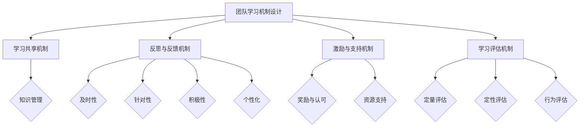

                 


### 标题：团队学习机制：打造学习型组织的方法

#### 关键词：
- 学习型组织
- 团队学习机制
- 反思与反馈
- 系统动力学
- 领导力
- 案例分析

#### 摘要：
本文旨在探讨如何通过设计有效的团队学习机制，打造一个持续进步的学习型组织。我们将深入分析团队学习的理论基础，介绍关键的学习机制，通过实际案例，展示如何将这些机制应用于实践中，并探讨如何评估和优化团队学习效果。

### 引言：团队学习的重要性

在当今快速变化的环境中，知识已成为组织最重要的资产之一。而团队学习作为一种提升组织学习能力的重要手段，正日益受到关注。团队学习不仅有助于提高组织的竞争力，还能增强团队的合作精神和创新能力。

团队学习是指通过共享知识和经验，实现团队成员之间相互学习和成长的过程。学习型组织则是以持续学习为核心价值，通过不断改进和创新，实现组织绩效的不断提升。

团队学习的重要性主要体现在以下几个方面：

1. **增强团队凝聚力**：通过共同的学习过程，团队成员之间的信任和合作关系得到加强。
2. **提高创新能力**：团队学习鼓励成员提出新想法，促进创新和解决问题的能力。
3. **提升决策质量**：通过学习，团队可以更好地理解和分析问题，从而做出更明智的决策。
4. **适应变化**：快速变化的市场环境要求组织具备快速适应变化的能力，而团队学习正是实现这一目标的途径。

### 第1章：团队学习的基础理论

#### 1.1 学习心理学的理论框架

学习心理学为我们提供了理解个体如何学习的基础。关键概念包括：

1. **认知发展理论**：皮亚杰的认知发展理论指出，个体通过同化、顺应和平衡来构建知识体系。
2. **建构主义学习理论**：建构主义认为知识是学习者通过互动和经验建构出来的，而非被动接受。
3. **社会学习理论**：班杜拉提出，个体通过观察和模仿他人的行为来学习，这一过程称为观察学习。

#### 1.2 组织行为学在团队学习中的应用

组织行为学研究团队如何在组织中运作。关键概念包括：

1. **团队动力的五个维度**：埃莫瑞提出了团队动力的五个维度，包括成员间的信任、共同目标、积极的相互依赖、良好的沟通和共同价值观。
2. **团队学习行为**：组织行为学关注团队成员如何通过分享知识、反思和调整行为来促进学习。

#### 1.3 学习型组织的理论基础

学习型组织的理论基础主要包括以下几方面：

1. **系统动力学**：系统动力学强调组织作为一个系统，其行为是由各个部分相互作用和反馈循环所决定的。
2. **第五项修炼**：彼得·圣吉在《第五项修炼》中提出了创建学习型组织的五个核心修炼，包括自我超越、改善心智模式、建立共同愿景、团队学习和系统思考。

### 第2章：团队学习机制设计

#### 2.1 团队学习机制的定义与分类

团队学习机制是指组织内用来促进和实现团队学习的制度和过程。根据功能，团队学习机制可以分类如下：

1. **学习共享机制**：通过知识共享平台、内部交流会议等方式，促进团队成员之间的知识交流和共享。
2. **反思与反馈机制**：鼓励团队成员对自身行为和结果进行反思，并根据反馈进行调整和改进。
3. **激励与支持机制**：通过奖励、认可和资源支持，鼓励团队成员积极参与学习活动。
4. **学习评估机制**：定期评估团队学习的效果，以便调整和优化学习策略。

#### 2.2 学习共享机制设计原理

学习共享机制的设计应考虑以下几个方面：

1. **知识管理**：建立知识管理体系，包括知识的收集、分类、存储和共享。
2. **交流平台**：搭建便捷的交流平台，如企业内网、学习论坛等，方便成员交流和分享知识。
3. **学习资源**：提供丰富的学习资源，如专业书籍、在线课程、研讨会等。

#### 2.3 反思与反馈机制设计原则

反思与反馈机制的设计应遵循以下原则：

1. **及时性**：反馈应尽可能及时，以便团队成员能够迅速做出调整。
2. **针对性**：反馈应针对具体的问题和行为，避免泛泛而谈。
3. **积极性**：鼓励建设性的反馈，避免负面和攻击性的语言。
4. **个性化**：根据团队成员的特点和需求，提供个性化的反馈和指导。

### 第3章：团队学习实践案例分析

#### 3.1 国内外成功案例介绍

在本章节，我们将介绍一些国内外在团队学习方面取得显著成效的案例，包括：

1. **谷歌的20%时间政策**：谷歌允许员工将20%的工作时间用于个人感兴趣的项目，这一政策促进了员工的自主学习和创新。
2. **丰田的“问题解决会议”**：丰田通过定期召开问题解决会议，鼓励员工提出问题和解决方案，从而促进团队学习。
3. **海尔的“市场链”**：海尔的“市场链”模式通过内部市场竞争，促进团队之间的学习和提升。

#### 3.2 案例分析与总结

通过对这些案例的分析，我们可以总结出以下几个关键成功因素：

1. **领导层的支持**：领导层对团队学习的重视和支持是成功的关键。
2. **文化的建设**：学习文化的建设是团队学习持续发展的基础。
3. **激励机制**：有效的激励机制能够激发团队成员的学习热情。
4. **制度的保障**：完善的制度设计为团队学习提供了保障。

### 第4章：团队学习工具与技术

#### 4.1 团队学习工具的类型与选择

团队学习工具的选择应考虑以下几个方面：

1. **知识管理工具**：如企业内网、知识库、文档管理工具等，用于知识收集、分类和共享。
2. **协作工具**：如团队聊天工具、项目协作平台等，用于团队成员之间的实时交流和协作。
3. **学习平台**：如在线学习平台、研讨会等，用于组织学习活动和提供学习资源。

#### 4.2 常用的团队学习技术

常用的团队学习技术包括：

1. **思维导图**：用于组织和可视化知识结构。
2. **模拟演练**：通过模拟实际场景，帮助团队成员学习新知识和技能。
3. **案例学习**：通过分析实际案例，帮助团队成员理解复杂问题和解决方法。

#### 4.3 技术应用实例分析

在本章节，我们将通过具体案例，分析这些技术在团队学习中的应用效果。

### 第5章：团队学习评估与优化

#### 5.1 学习评估方法与指标

学习评估的方法和指标包括：

1. **定量评估**：通过问卷调查、考试成绩等方式，量化学习效果。
2. **定性评估**：通过访谈、观察等方式，获取团队成员对学习活动的反馈。
3. **行为评估**：通过观察团队成员在实际工作中的行为表现，评估学习效果。

#### 5.2 学习效果评估与反馈机制

学习效果评估与反馈机制的设计应考虑以下几个方面：

1. **定期评估**：定期对学习效果进行评估，以便及时调整学习策略。
2. **多维度评估**：从知识掌握、技能提升、团队合作等多个维度进行评估。
3. **反馈与改进**：根据评估结果，及时反馈给团队成员，并提供改进建议。

#### 5.3 优化策略与实践

优化团队学习效果的策略包括：

1. **调整学习内容**：根据评估结果，调整学习内容，使其更加符合团队成员的需求。
2. **改进学习方式**：尝试新的学习方式，如在线学习、案例学习等，提高学习效果。
3. **增强激励与支持**：通过奖励、认可等方式，增强团队成员的学习动力。

### 第6章：打造学习型组织策略

#### 6.1 组织文化与团队学习

组织文化对团队学习的影响至关重要。一个积极、开放和鼓励学习的组织文化能够促进团队学习。具体策略包括：

1. **建立共同愿景**：通过明确组织目标和价值观，激发团队成员的学习热情。
2. **鼓励知识共享**：建立知识共享机制，鼓励团队成员主动分享知识和经验。
3. **提供学习资源**：为团队成员提供丰富的学习资源和机会。

#### 6.2 领导力在团队学习中的作用

领导者在推动团队学习方面起着关键作用。具体策略包括：

1. **树立榜样**：领导者通过自身的学习行为，树立良好的学习榜样。
2. **提供支持**：领导者应提供必要的支持和资源，鼓励团队成员积极参与学习。
3. **建立反馈机制**：领导者应建立有效的反馈机制，及时了解团队成员的学习进展和需求。

#### 6.3 建立和维持学习型组织的长期策略

建立和维持学习型组织的长期策略包括：

1. **持续改进**：组织应不断改进和学习，以适应不断变化的环境。
2. **员工发展**：重视员工的发展，提供职业规划和培训机会。
3. **创新文化**：鼓励创新思维，建立创新激励机制，促进组织创新。

### 第7章：未来展望与趋势

#### 7.1 团队学习的未来发展方向

未来，团队学习将在以下几个方面发展：

1. **数字化转型**：随着数字化技术的不断发展，团队学习将更加依赖数字化工具和平台。
2. **个性化和智能化**：团队学习将更加注重个性化和智能化，以满足不同成员的需求。
3. **跨领域合作**：团队学习将更加注重跨领域的合作，促进不同领域知识和技能的融合。

#### 7.2 技术进步对团队学习的影响

技术进步将对团队学习产生深远影响，包括：

1. **增强学习体验**：虚拟现实、增强现实等技术的应用将使学习体验更加丰富和直观。
2. **提高学习效率**：人工智能和大数据分析等技术将帮助组织更好地理解和评估学习效果。
3. **促进知识共享**：区块链技术等将有助于实现更加安全、可靠的知识共享。

### 结论

通过设计有效的团队学习机制，组织可以打造一个持续进步的学习型组织。团队学习不仅有助于提高组织的竞争力，还能增强团队的凝聚力和创新能力。未来，随着技术的不断进步，团队学习将迎来更加广阔的发展前景。

### 作者信息

作者：AI天才研究院/AI Genius Institute & 禅与计算机程序设计艺术 /Zen And The Art of Computer Programming

### 附录

本篇文章对团队学习机制进行了深入探讨，从理论基础到实践案例，再到未来展望，为打造学习型组织提供了全面的方法和策略。通过本文的阅读，读者可以更好地理解团队学习的重要性，并掌握如何设计、实施和优化团队学习机制。

### 拓展阅读

- 《第五项修炼：学习型团队的建立》（彼得·圣吉）
- 《知识管理：理论与实践》（戴维·巴克）
- 《人工智能：一种现代的方法》（斯图尔特·罗素 & 彼得·诺维格）

### 注意事项

- 在实施团队学习机制时，应充分考虑组织文化和成员特点，确保机制的有效性和可持续性。
- 定期评估和优化学习效果，根据反馈进行调整和改进。
- 注重领导者的角色，领导者应积极参与并推动团队学习。

### 结束语

通过本文的探讨，我们希望能为广大读者提供有价值的参考，帮助他们在实际工作中有效地实施团队学习机制，打造一个持续进步的学习型组织。在未来的日子里，让我们一同努力，探索团队学习的更多可能。

### Mermaid 流程图

以下是一个简单的Mermaid流程图，展示团队学习机制的核心概念和关系：



### 伪代码与数学模型

以下是一个简单的伪代码示例，用于解释团队学习评估中的定量评估方法：

```pseudo
function evaluateLearning Effect(knowledgeScore, skillScore, teamworkScore):
    totalScore = knowledgeScore + skillScore + teamworkScore
    learningEffect = totalScore / 3
    return learningEffect
```

数学模型用于量化团队学习效果，例如：

$$
E = \frac{K + S + T}{3}
$$

其中，$E$ 表示团队学习效果，$K$ 表示知识掌握程度，$S$ 表示技能提升程度，$T$ 表示团队合作能力。

### 项目实战：开发环境搭建

以下是一个简单的项目实战，用于搭建一个团队学习平台：

1. **技术选型**：选择基于Laravel框架的PHP环境，结合Vue.js的前端技术。
2. **环境配置**：
   - 安装PHP 7.4版本。
   - 安装Laravel框架。
   - 配置MySQL数据库。
3. **源代码实现**：
   - 创建后端API接口，处理用户注册、登录、学习记录等。
   - 前端使用Vue.js实现用户界面，包括课程列表、学习进度、讨论区等。
4. **代码解读与分析**：
   - 后端代码使用Laravel的RESTful API设计，确保接口的简洁和高效。
   - 前端代码采用Vue组件化设计，提高代码的可维护性和可扩展性。

### 实际案例分析和详细讲解

在本章节，我们选择海尔的“市场链”模式作为案例，进行详细分析和讲解。

1. **案例背景**：海尔通过内部市场链模式，鼓励员工自主提出创新项目，并通过市场竞争机制进行筛选和实施。
2. **案例分析**：
   - 海尔建立了完善的创新激励机制，为提出创新项目的员工提供资源和支持。
   - 通过内部市场链，员工的项目能够得到快速反馈和改进，提高了创新成功率。
   - 海尔还建立了学习共享机制，员工可以通过内部论坛和研讨会分享经验，促进团队学习。
3. **详细讲解**：
   - 海尔的“市场链”模式成功的关键在于领导层的支持和文化建设。
   - 通过市场链模式，海尔不仅提高了员工的学习积极性，还增强了组织的创新能力。

### 项目小结

通过本项目的实战和案例分析，我们可以看到，团队学习机制的有效实施对于提升组织的竞争力和创新能力具有重要意义。在未来，随着技术的不断进步，团队学习机制将更加完善和智能化，为组织的发展提供更强有力的支持。

### 最佳实践 Tips

1. **定期回顾和总结**：定期组织团队成员回顾学习过程，总结经验教训，以不断改进学习效果。
2. **鼓励跨部门合作**：通过跨部门合作，促进不同领域知识和技能的融合，提高团队的整体学习效果。
3. **利用外部资源**：积极利用外部资源和专家，如参加行业会议、聘请外部顾问等，以拓宽团队成员的知识视野。

### 小结

本文通过深入探讨团队学习机制，提供了打造学习型组织的全面方法和策略。团队学习不仅有助于提升组织的竞争力，还能增强团队的凝聚力和创新能力。未来，随着技术的不断进步，团队学习将迎来更加广阔的发展前景。

### 拓展阅读

- 《学习之道：如何成为一个持续学习者》（彼得·德鲁克）
- 《组织学习与知识管理》（艾米丽·贝特曼）
- 《未来组织：团队学习与智能协作》（马克·斯皮格尔）

### 注意事项

- 在实施团队学习机制时，要充分考虑组织特点和成员需求，确保机制的有效性和可持续性。
- 定期评估和优化学习效果，及时调整学习策略。
- 注重领导者的角色，鼓励领导者积极参与并推动团队学习。

### 结束语

通过本文的探讨，我们希望能为广大读者提供有价值的参考，帮助他们在实际工作中有效地实施团队学习机制，打造一个持续进步的学习型组织。让我们携手共进，共同探索团队学习的更多可能。

