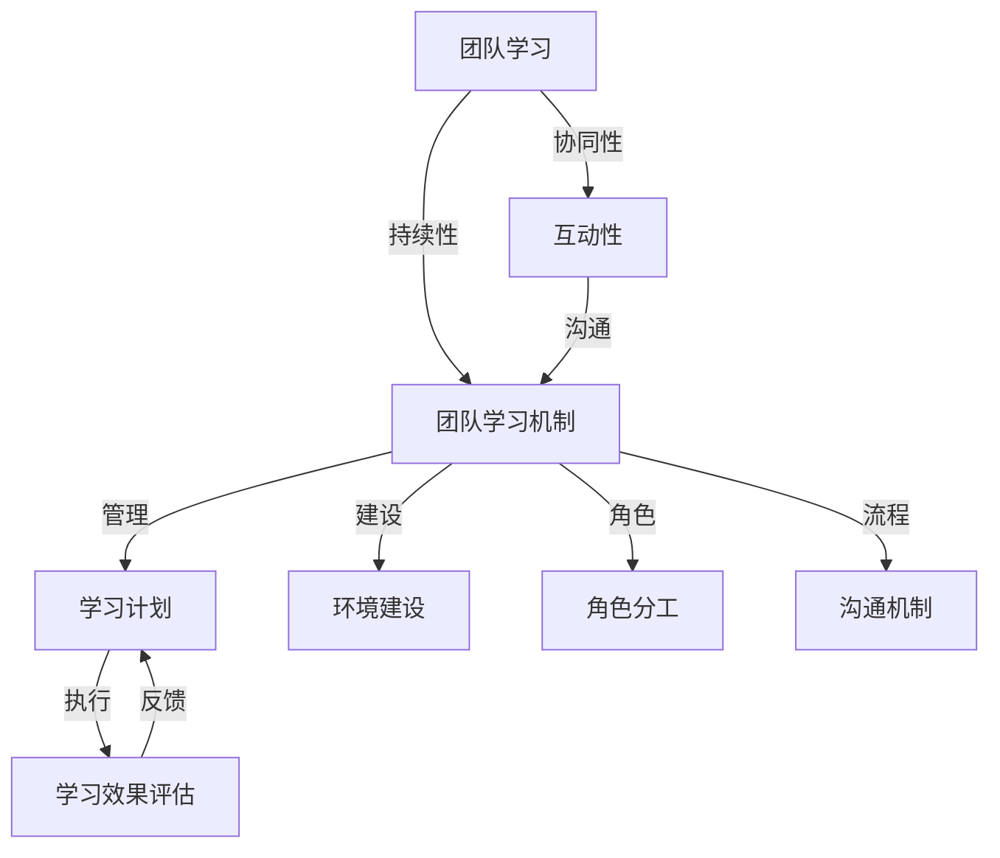

                 

## 引言

在当今快速变化和竞争激烈的技术环境中，组织要想保持持续的竞争力，必须不断进步和适应。团队学习机制作为一种促进组织持续成长和发展的策略，正日益受到企业和组织的关注。本文旨在探讨团队学习机制的内涵、构建方法、管理过程及其在实践中的应用，为组织提供一套实用的学习和进步策略。

### 背景介绍

随着信息技术的飞速发展，企业面临着前所未有的挑战和机遇。市场需求变化迅速，技术创新层出不穷，这要求企业必须具备快速响应和持续创新能力。传统的个人学习和单点突破模式已经难以满足这种需求，团队学习成为组织应对复杂环境、实现持续进步的关键。

团队学习不仅有助于提升组织整体能力，还能够促进成员之间的合作与交流，增强团队凝聚力和创造力。因此，构建有效的团队学习机制，已经成为现代企业提升竞争力的重要手段。

### 核心概念与联系

**团队学习**：团队学习是指团队成员通过相互交流、合作与共享知识，共同提高能力和素质的过程。它与个体学习相比，具有以下几个显著特点：

1. **协同性**：团队学习强调成员之间的协同作用，通过共同解决问题和分享经验，实现知识的整合和创新。
2. **互动性**：团队成员通过互动交流，互相学习，实现知识的传递和更新。
3. **持续性**：团队学习不是一次性的活动，而是持续不断的过程，有助于组织长期发展。

**团队学习机制**：团队学习机制是指为了促进团队学习而建立的一系列规则、流程和制度。它包括以下几个方面：

1. **环境建设**：为团队学习提供良好的物理、文化和心理环境。
2. **角色分工**：明确团队成员的角色和职责，确保学习活动的顺利进行。
3. **沟通机制**：建立有效的沟通渠道，促进信息传递和知识共享。
4. **管理过程**：制定学习计划，实施学习活动，并对学习效果进行评估和反馈。

**核心概念关系架构图**：

通过上述核心概念的关系架构图，我们可以看到团队学习与团队学习机制之间的关系，以及各个组成部分之间的相互作用。这种结构化的关系有助于我们理解和应用团队学习机制，实现组织的持续进步。

在接下来的章节中，我们将进一步探讨团队学习机制的构建方法、管理过程以及其实施案例，帮助读者深入理解和应用这一重要策略。

## 第一部分：团队学习机制的概述

### 1.1 团队学习的定义与重要性

团队学习是一个多维度的概念，它不仅仅是团队成员之间知识的共享，更是一种通过协同合作、互动交流，共同提升能力与素质的机制。团队学习的核心在于将个体知识与团队智慧结合起来，形成一个更加高效、创新的学习系统。

**定义**：

团队学习可以被定义为一种团队成员在相互交流、合作与共享知识的过程中，通过共同解决问题和经验分享，不断深化理解、提升能力、创新思维的过程。它强调的是知识的整合和创造，而不是简单的知识传递。

**重要性**：

1. **提高组织整体能力**：团队学习能够促进团队成员之间的协作，使组织整体能力得到提升。通过团队学习，组织可以更加迅速地应对外部环境的变化，实现快速创新和持续进步。

2. **增强团队凝聚力**：团队学习提供了一个共同的目标和任务，使团队成员在追求共同目标的过程中形成强烈的归属感和责任感。这种凝聚力有助于提高团队的工作效率和创新能力。

3. **促进知识共享与创新**：团队学习机制鼓励成员之间分享知识和经验，从而促进新知识的产生和应用。通过知识的整合和创新，组织可以不断突破自身的能力边界，实现技术和管理上的创新。

4. **应对复杂问题**：在现代社会，许多问题都是复杂且跨领域的，单靠个体难以解决。团队学习提供了一个多视角、多层次的问题解决平台，有助于团队成员共同应对复杂问题。

5. **提升员工满意度与忠诚度**：通过团队学习，员工能够不断获得新的知识和技能，提高自身能力。这种成长和发展的机会不仅提升了员工的满意度，还增强了他们对组织的忠诚度。

### 1.2 团队学习与传统学习方式的比较

**传统学习方式**：

传统学习方式主要依赖于个体学习和单点突破，其特点包括：

1. **独立性**：个体学习强调个人的自主学习和独立思考，往往缺乏团队协作和知识共享。
2. **单一性**：传统学习方式主要依赖于教材、课程和个别导师的指导，知识来源相对单一。
3. **低效性**：个体学习需要大量的时间和精力，且难以应对复杂和多变的实际问题。

**团队学习**：

与传统的个体学习相比，团队学习具有以下几个显著优势：

1. **协同性**：团队学习强调成员之间的协同合作，通过集思广益、互相学习，实现知识的整合和创新。
2. **多样性**：团队学习提供了多元化的知识来源，成员可以从不同的视角和经验中获取信息和灵感。
3. **高效性**：团队学习可以迅速集结多方面的资源和智慧，高效应对复杂问题，提高解决问题的效率。

**对比分析**：

1. **知识传递与知识创造**：传统学习方式侧重于知识的传递，而团队学习侧重于知识的创造和应用。团队学习通过知识的整合和创新，使组织能够更加灵活地应对外部变化。
2. **个体成长与团队发展**：个体学习注重个人能力的提升，而团队学习强调团队整体的发展。通过团队学习，组织可以实现更高效的知识共享和创新能力，从而提升整体竞争力。
3. **学习成本与学习效果**：传统学习方式需要大量的时间和资源，而团队学习通过高效的协作和知识共享，可以降低学习成本，提高学习效果。

综上所述，团队学习相较于传统学习方式，在知识创造、团队发展和问题解决等方面具有显著优势，是组织实现持续进步和发展的关键。

### 1.3 团队学习机制的基本原理

团队学习机制是确保团队学习活动有效实施和持续进行的一系列规则、流程和制度的总和。其基本原理包括以下几个方面：

**1. 协同合作**

协同合作是团队学习机制的核心原则。团队成员通过协同合作，共同解决问题、分享知识和经验，实现知识的整合和创新。协同合作不仅有助于提高学习效率，还能增强团队的凝聚力和创新能力。

**2. 互动交流**

互动交流是团队学习的驱动力。团队成员通过互动交流，分享自己的观点、经验和心得，获取他人的反馈和建议，从而不断深化对知识的理解和应用。互动交流的形式可以多样，包括会议、讨论、头脑风暴等。

**3. 知识共享**

知识共享是团队学习的重要目标。团队学习机制通过建立有效的知识共享平台和机制，鼓励团队成员分享知识和经验，实现知识的传递和应用。知识共享不仅有助于提高团队成员的能力，还能为组织带来创新和竞争力。

**4. 持续学习**

持续学习是团队学习机制的核心理念。团队学习不是一次性的活动，而是一个持续不断的过程。通过持续学习，团队成员可以不断更新和扩展自己的知识和技能，保持组织的活力和竞争力。

**5. 管理支持**

管理支持是团队学习机制有效实施的重要保障。组织需要提供必要的资源、政策和环境支持，确保团队学习活动的顺利进行。管理支持包括明确的学习目标、合理的激励机制、良好的沟通渠道等。

**6. 效果评估**

效果评估是团队学习机制的重要组成部分。通过定期评估学习效果，组织可以了解团队学习活动是否达到预期目标，发现存在的问题和改进的方向。效果评估有助于优化团队学习机制，提高学习效果。

**总结**：

团队学习机制的基本原理包括协同合作、互动交流、知识共享、持续学习、管理支持和效果评估。这些原理相互关联，共同构成了一个完整的团队学习体系，帮助组织实现持续进步和发展。

### 1.4 团队学习机制与传统学习机制的区别

团队学习机制与传统学习机制在多个方面存在显著区别，这些区别决定了团队学习机制在组织发展中的独特价值和优势。

**1. 学习主体**

传统学习机制主要依赖于个体学习，即个人通过自主学习、阅读书籍、参加培训等方式获取知识和技能。个体学习强调个人的独立性和自主性，学习内容往往以个人的兴趣和需求为导向。相比之下，团队学习机制强调团队的整体性，学习活动围绕团队目标和任务展开，注重团队合作和知识共享。

**2. 学习方式**

传统学习方式通常采用单向的知识传递模式，即知识从外部专家或导师传递到学习者。学习过程缺乏互动和交流，往往难以激发学习者的主动性和创造力。团队学习机制则采用双向互动和协作的学习方式，通过团队成员之间的互动交流、共同解决问题和经验分享，促进知识的创造和应用。

**3. 学习目标**

传统学习机制主要关注个体知识的积累和技能的提升，学习目标较为单一。团队学习机制则强调团队整体能力的提升和协同效应的发挥，学习目标不仅包括个体能力的提升，还包括团队协作能力、创新能力和问题解决能力的提升。

**4. 学习效果**

传统学习机制的学习效果往往难以评估，因为个体学习的效果受到多种因素的影响，如学习者的动机、环境等。团队学习机制则通过建立科学的效果评估体系，对学习活动的效果进行量化评估，确保学习活动达到预期目标。此外，团队学习机制通过持续的反馈和调整，能够及时发现问题并改进学习过程，提高学习效果。

**5. 学习环境**

传统学习机制的学习环境较为单一，往往局限于课堂、教室等特定场所。团队学习机制则强调多样化的学习环境，包括物理环境（如开放的工作空间、会议设施等）、文化环境（如鼓励创新和分享的组织文化）和心理环境（如信任和支持的团队氛围）。多样化的学习环境有助于激发团队成员的学习兴趣和创造力，提高学习效果。

**6. 组织变革**

传统学习机制对组织变革的影响有限，主要停留在个体层面的知识更新和技能提升。团队学习机制则能够促进组织整体变革，通过团队协作和创新，推动组织战略的调整、业务流程的优化和文化的转变。团队学习机制不仅有助于提升组织竞争力，还能增强组织的适应性和灵活性。

**总结**：

团队学习机制与传统学习机制在学习的主体、方式、目标、效果、环境以及组织变革等方面存在显著区别。团队学习机制通过强调团队协作、互动交流和知识共享，为组织提供了一种更为有效和持续的学习和发展策略，有助于组织实现持续进步和长期成功。

### 1.5 团队学习机制的优势与挑战

**优势**：

1. **协同效应**：团队学习机制通过促进团队成员之间的协作和知识共享，能够实现“1+1>2”的协同效应。团队成员可以相互补充、相互启发，共同解决复杂问题，提高整体解决问题的效率。

2. **知识整合与创新**：团队学习机制鼓励团队成员分享知识和经验，通过整合不同成员的知识和视角，可以产生新的见解和创新点。这种知识整合和创新有助于组织在技术和管理上取得突破。

3. **持续进步**：团队学习机制强调持续学习和知识更新，有助于组织保持长期的竞争力。通过不断的学习和改进，组织可以适应市场变化，持续提升自身能力。

4. **员工满意度与忠诚度**：团队学习为员工提供了成长和发展的机会，有助于提高员工的工作满意度和忠诚度。员工在学习和成长过程中获得成就感，对组织产生更强的归属感。

**挑战**：

1. **组织文化变革**：团队学习机制需要组织文化和制度的支持，但变革往往面临阻力。部分员工可能对新的学习方式和文化不适应，需要通过沟通和培训逐步推动文化变革。

2. **资源分配**：团队学习需要投入一定的资源，包括时间、资金和人力。组织需要合理分配资源，确保团队学习活动的顺利进行。

3. **管理复杂度**：团队学习机制的管理复杂度较高，需要建立科学的管理流程和评估体系。管理团队需要具备较高的管理水平，确保学习活动的有效实施。

4. **知识共享的挑战**：团队成员之间可能存在知识共享的障碍，如知识保密、文化差异等。需要建立有效的知识共享机制，鼓励成员积极参与知识共享。

5. **个体差异**：团队成员的个性、技能和经验存在差异，可能影响学习效果。需要通过有效的沟通和协作机制，平衡个体差异，发挥团队整体优势。

### 1.6 团队学习机制在组织发展中的作用

团队学习机制在组织发展中发挥着关键作用，它不仅有助于提升组织的能力和竞争力，还能推动组织文化的建设和发展。

**提升组织能力**：

1. **技术创新**：团队学习机制通过知识共享和创新，可以加速新技术、新方法的引入和应用。团队成员共同探讨和实践新的技术方案，提高组织的创新能力。

2. **业务流程优化**：通过团队学习，团队成员可以共同分析现有业务流程中的问题和瓶颈，提出优化方案，提升业务效率和效果。

3. **项目管理**：团队学习有助于提升项目管理能力，通过团队成员的经验交流和协作，提高项目计划、执行和监控的效率。

**增强组织竞争力**：

1. **快速响应**：团队学习机制能够使组织迅速应对市场变化和客户需求，提高市场反应速度。

2. **灵活调整**：通过持续学习和能力提升，组织能够更加灵活地调整战略和业务模式，保持竞争优势。

3. **持续创新**：团队学习机制鼓励创新思维和实践，有助于组织在技术、产品和服务上不断创新，保持领先地位。

**推动组织文化建设**：

1. **共同价值观**：团队学习机制通过共同的目标和任务，强化团队成员的价值观和使命感，促进组织文化的形成和发展。

2. **信任与支持**：团队学习机制强调协作和知识共享，有助于建立信任和支持的团队氛围，提升组织的凝聚力。

3. **持续成长**：团队学习为员工提供了不断成长和发展的机会，有助于培养组织内部的创新型人才，推动组织文化的持续发展。

总之，团队学习机制在提升组织能力、增强竞争力和推动组织文化建设等方面具有重要作用。通过有效的团队学习机制，组织能够实现持续进步和长期成功。

### 1.7 结论

团队学习机制作为一种促进组织持续进步和发展的策略，具有显著的独特价值和优势。通过协同合作、互动交流和知识共享，团队学习机制能够提升组织整体能力、增强竞争力、推动文化建设。同时，团队学习机制也面临组织文化变革、资源分配和管理复杂度等挑战。为了有效实施团队学习机制，组织需要建立科学的管理流程和评估体系，提供必要的资源和支持，逐步推动文化变革。通过持续的学习和改进，组织可以保持长期的竞争力，实现可持续发展。

## 第二部分：团队学习机制的构建

### 2.1 团队学习环境的营造

团队学习环境的营造是团队学习机制构建的首要任务。一个良好的学习环境不仅有助于提升团队成员的学习效率，还能激发他们的创造力和创新能力。团队学习环境的营造包括物理环境、文化环境和心理环境的建设。

#### 2.1.1 物理环境

物理环境是团队学习的基础，它为团队成员提供了一个舒适、安全、方便的学习和工作空间。一个良好的物理环境应该具备以下特点：

1. **舒适的工作空间**：团队成员需要一个舒适的工作空间，包括良好的通风、适宜的照明和温度控制。这有助于提高团队成员的专注力和工作效率。

2. **灵活的布局**：团队学习往往需要不同的空间和设备，如会议室、讨论区、开放式办公区等。灵活的布局可以满足不同学习活动的需求，促进团队成员之间的交流和互动。

3. **技术支持**：团队学习需要依赖于各种技术工具，如电脑、投影仪、交互式白板等。技术支持能够提升团队学习的效率和质量。

4. **安全与隐私**：团队成员在进行团队学习时，需要保证数据的安全和隐私。组织应采取必要的安全措施，如数据加密、访问控制等，以防止信息泄露。

#### 2.1.2 文化环境

文化环境是团队学习的精神家园，它对团队成员的学习态度和行为产生深远影响。一个良好的文化环境应该具备以下特点：

1. **鼓励创新与分享**：组织应该倡导创新思维和知识共享，鼓励团队成员勇于提出新观点、新想法，并分享自己的经验和知识。

2. **信任与支持**：团队成员之间应该建立信任，相互支持。组织应通过培训、团队建设活动等，增强团队成员之间的信任感。

3. **公平与开放**：组织应该确保团队成员在学习和交流中享有公平的机会，避免歧视和偏见。同时，组织应鼓励开放性交流，鼓励团队成员表达不同的观点和意见。

4. **学习激励机制**：组织应建立有效的学习激励机制，如奖励优秀的学习成果、提供学习资源等，以激励团队成员积极参与学习活动。

#### 2.1.3 心理环境

心理环境是团队学习的精神支柱，它对团队成员的情绪和心理状态产生重要影响。一个良好的心理环境应该具备以下特点：

1. **积极的态度**：组织应营造积极向上的学习氛围，鼓励团队成员保持乐观、积极的态度，面对学习中的困难和挑战。

2. **支持与鼓励**：团队成员在进行团队学习时，需要得到他人的支持和鼓励。组织应通过多种方式，如定期反馈、表扬等，支持团队成员的学习。

3. **自主与责任感**：团队学习需要团队成员具备自主学习和责任意识。组织应培养团队成员的自我驱动能力，让他们能够主动参与学习，并为自己的学习成果负责。

4. **放松与减压**：学习过程中，团队成员可能会面临压力和焦虑。组织应提供必要的放松和减压机制，如心理咨询、运动设施等，帮助团队成员保持良好的心理状态。

### 2.2 团队成员的角色与职责

团队成员的角色与职责是团队学习机制有效运行的基础。明确团队成员的角色和职责，有助于确保学习活动的顺利进行和目标实现。团队成员通常包括以下几种角色：

#### 1. 学习领导者

学习领导者是团队学习的核心角色，负责整体学习活动的规划和组织。其主要职责包括：

1. **制定学习计划**：根据团队目标和需求，制定详细的学习计划，包括学习内容、时间安排、资源分配等。
2. **组织学习活动**：协调和组织各种学习活动，如研讨会、讲座、工作坊等，确保学习活动有序进行。
3. **监督与评估**：监督学习活动的进展，对学习效果进行评估，及时调整学习计划。

#### 2. 学习参与者

学习参与者是团队学习的主体，他们负责积极参与学习活动，贡献自己的知识和经验。其主要职责包括：

1. **主动学习**：根据学习计划，主动学习和掌握相关知识和技能。
2. **分享经验**：在团队学习中，分享自己的经验和观点，促进知识共享和创新。
3. **反馈与改进**：在学习过程中，积极反馈学习效果，提出改进建议，为团队学习提供持续改进的方向。

#### 3. 学习支持者

学习支持者是团队学习的重要保障，他们提供必要的支持和资源，确保学习活动的顺利进行。其主要职责包括：

1. **资源准备**：准备和提供学习所需的资源，如书籍、资料、设备等。
2. **技术支持**：为学习活动提供必要的技术支持，如网络、计算机等。
3. **后勤保障**：提供后勤保障，如会议场地、餐饮服务等。

### 2.3 建立有效的沟通机制

沟通机制是团队学习机制的重要组成部分，有效的沟通机制能够促进团队成员之间的信息传递和知识共享。建立有效的沟通机制，需要考虑以下几个方面：

#### 1. 明确沟通目标

在建立沟通机制之前，首先要明确沟通的目标和内容。沟通目标应包括：

1. **信息传递**：确保团队成员能够及时获得所需的信息，包括学习计划、活动安排、资源分配等。
2. **知识共享**：鼓励团队成员分享知识和经验，促进知识的传递和应用。
3. **问题解决**：通过沟通，解决团队成员在学习过程中遇到的问题和困难。

#### 2. 选择合适的沟通方式

根据沟通目标和内容，选择合适的沟通方式。常见的沟通方式包括：

1. **会议**：通过定期会议，讨论学习进展、分享经验和解决问题。
2. **邮件**：用于正式的信息传递和通知。
3. **即时通讯工具**：如微信、钉钉等，用于快速沟通和问题解决。
4. **社交媒体**：如微博、知乎等，用于知识共享和交流。

#### 3. 建立沟通规范

建立明确的沟通规范，确保沟通的效率和效果。沟通规范应包括：

1. **沟通频率**：明确沟通的频率和时间，确保信息及时传递。
2. **沟通内容**：明确沟通的内容和范围，避免无关信息的干扰。
3. **沟通反馈**：建立沟通反馈机制，确保团队成员能够及时收到反馈，并作出相应调整。

#### 4. 培养沟通能力

培养团队成员的沟通能力，是建立有效沟通机制的关键。团队成员应具备以下沟通能力：

1. **倾听能力**：积极倾听他人的观点和意见，理解对方的意图和需求。
2. **表达能力**：清晰、准确地表达自己的观点和想法。
3. **沟通技巧**：掌握有效的沟通技巧，如提问、反馈、辩论等，提高沟通效果。
4. **冲突管理能力**：在沟通中，能够妥善处理冲突和分歧，保持团队和谐。

通过建立良好的沟通机制，团队学习机制能够更加高效地运行，促进团队成员之间的信息传递和知识共享，实现团队学习的目标。

### 2.4 团队学习机制的持续优化

团队学习机制不是一成不变的，而是需要根据实际情况不断调整和优化，以适应不断变化的外部环境和内部需求。持续优化团队学习机制，是确保团队学习活动高效进行、实现长期发展的重要手段。以下是团队学习机制持续优化的一些方法：

#### 1. 定期评估与反馈

定期对团队学习机制进行评估和反馈，是发现问题和改进方向的关键。可以通过以下方式开展评估：

1. **学习效果评估**：对学习活动的效果进行量化评估，包括学习目标的实现程度、知识共享的效果等。
2. **成员满意度调查**：通过问卷调查、访谈等方式，了解团队成员对学习活动的满意度，以及他们提出的改进建议。
3. **学习过程反思**：团队成员定期进行学习过程反思，总结经验教训，提出改进意见。

#### 2. 持续改进与调整

根据评估和反馈结果，对团队学习机制进行持续改进和调整。改进和调整的方向包括：

1. **学习内容**：根据团队成员的需求和业务发展，及时更新学习内容，确保学习内容的实用性和前瞻性。
2. **学习方式**：探索和引入新的学习方式，如在线学习、虚拟现实等，提高学习效果和趣味性。
3. **沟通机制**：优化沟通机制，提高沟通效率和效果，确保信息传递的及时性和准确性。
4. **激励机制**：调整激励机制，鼓励团队成员积极参与学习活动，提高学习积极性。

#### 3. 培养内部讲师

内部讲师是团队学习机制的重要组成部分，他们不仅能够提供专业的知识培训，还能起到示范和引领作用。培养内部讲师的方法包括：

1. **选拔和培养**：选拔具有专业知识和培训经验的员工，通过培训和指导，提升他们的教学能力和影响力。
2. **激励机制**：为内部讲师提供激励和奖励，如奖金、晋升机会等，激励他们积极参与学习活动。
3. **资源共享**：建立内部讲师资源共享平台，促进内部讲师之间的经验交流和知识共享。

#### 4. 外部合作与交流

通过外部合作和交流，可以借鉴其他组织的优秀经验，提升团队学习机制的有效性。外部合作和交流的方法包括：

1. **行业会议和研讨会**：参加行业会议和研讨会，了解行业最新动态和最佳实践。
2. **合作伙伴交流**：与合作伙伴进行交流，学习他们的团队学习机制和经验。
3. **学术研究和论文**：阅读学术研究和论文，了解团队学习机制的最新研究成果和发展趋势。

通过以上方法，团队学习机制可以不断优化和改进，适应组织的发展需求，提升团队的学习能力和创新能力，实现组织的持续进步和发展。

## 第三部分：团队学习过程的管理

### 3.1 团队学习计划的制定与执行

团队学习计划的制定与执行是团队学习过程管理的关键环节。一个科学、详细的团队学习计划有助于确保学习活动有序进行，达到预期目标。以下是团队学习计划制定与执行的主要步骤：

#### 1. 确定学习目标

学习目标是团队学习的核心，它决定了学习计划的方向和内容。在制定学习计划前，首先要明确团队的学习目标。学习目标应包括以下几个方面：

1. **知识目标**：明确团队需要掌握的知识和技能，如新技术、新方法、业务流程优化等。
2. **能力目标**：明确团队需要提升的能力，如项目管理能力、沟通能力、创新能力等。
3. **成果目标**：明确团队学习的预期成果，如提高业务效率、降低成本、增加收入等。

#### 2. 制定学习内容

根据学习目标，制定详细的学习内容。学习内容应包括以下几个方面：

1. **基础知识**：确保团队成员具备完成学习任务所需的基本知识，如计算机编程基础、项目管理知识等。
2. **专业知识**：根据团队的学习目标和业务需求，选择相关的专业知识和技能，如最新技术趋势、业务分析工具等。
3. **实践案例**：提供实际案例，通过案例分析，帮助团队成员更好地理解和应用所学知识。

#### 3. 制定学习时间表

制定学习时间表，明确每个学习阶段的时间安排，确保学习活动有序进行。学习时间表应包括以下几个方面：

1. **学习阶段**：将学习过程划分为不同的阶段，如基础知识阶段、专业知识阶段、实践应用阶段等。
2. **学习时间**：确定每个阶段的学习时间，确保团队成员有足够的时间学习和消化知识。
3. **休息时间**：合理安排休息时间，避免团队成员过度疲劳，提高学习效果。

#### 4. 制定学习评估标准

为了确保学习计划的执行效果，需要制定学习评估标准。学习评估标准应包括以下几个方面：

1. **知识掌握程度**：评估团队成员对所学知识的掌握程度，如通过考试、测试等方式进行评估。
2. **能力提升情况**：评估团队成员在能力方面的提升，如通过实际工作表现、项目成果等。
3. **成果达成情况**：评估学习计划预期目标的实现情况，如业务效率提升、成本降低等。

#### 5. 执行学习计划

在执行学习计划过程中，需要确保以下几个方面的落实：

1. **组织学习活动**：按照学习时间表，组织各种学习活动，如培训课程、研讨会、实践工作坊等。
2. **提供学习资源**：确保团队成员能够获取所需的学习资源，如书籍、资料、在线课程等。
3. **沟通与反馈**：定期与团队成员沟通，了解学习进度和效果，收集反馈意见，及时调整学习计划。

#### 6. 监控与调整

在执行学习计划过程中，需要持续监控学习进度和效果，并根据实际情况进行必要的调整。监控与调整的方法包括：

1. **定期检查**：定期检查学习进度，确保学习活动按照计划进行。
2. **反馈机制**：建立反馈机制，及时收集团队成员的反馈意见，了解存在的问题和改进方向。
3. **调整计划**：根据监控和反馈结果，调整学习计划，优化学习内容和时间安排，确保学习目标的实现。

通过科学制定和严格执行学习计划，团队学习过程可以更加高效、有序地进行，为组织培养高素质的人才，实现持续进步和发展提供有力支持。

### 3.2 学习效果的评估与反馈

学习效果的评估与反馈是团队学习过程中至关重要的一环，它不仅能够检验学习计划的实施效果，还能为后续的学习活动提供改进的依据。以下是学习效果评估与反馈的主要方法：

#### 1. 知识掌握程度的评估

知识掌握程度的评估主要关注团队成员对所学知识的理解和应用能力。以下是一些常用的评估方法：

1. **考试和测试**：通过笔试、面试、操作测试等方式，评估团队成员对知识点的掌握情况。这种方法具有标准化和量化的优点，但可能缺乏对实际应用能力的考察。
2. **项目评估**：通过实际项目或案例研究，评估团队成员在真实工作场景中的应用能力。这种方法能够更全面地检验团队成员的综合能力，但需要耗费较多的时间和资源。
3. **问卷调查**：通过设计问卷调查，收集团队成员对所学知识的理解和应用情况，以及他们对学习活动的满意度和建议。这种方法操作简单，但结果可能不够精确。

#### 2. 能力提升情况的评估

能力提升情况的评估主要关注团队成员在沟通、协作、项目管理等方面的进步。以下是一些常用的评估方法：

1. **工作表现评估**：通过团队成员的实际工作表现，评估他们在能力提升方面的进展。这种方法能够直观地反映团队成员的能力提升情况，但可能存在主观判断的偏差。
2. **同行评审**：通过团队成员之间的相互评估，了解他们在协作、沟通等方面的表现。这种方法能够提供多角度的反馈，但需要确保评审的公正性和客观性。
3. **360度评估**：通过团队成员的上级、同事、下属等多个角度，对团队成员的能力提升进行评估。这种方法能够更全面地了解团队成员的能力表现，但需要建立完善的评估体系和流程。

#### 3. 成果达成情况的评估

成果达成情况的评估主要关注学习计划预期目标的实现情况。以下是一些常用的评估方法：

1. **关键绩效指标（KPI）**：通过设定关键绩效指标，如业务效率、成本降低、收入增加等，评估学习计划对组织成果的影响。这种方法具有量化优势和明确的评估标准，但需要确保指标的合理性和可衡量性。
2. **成本效益分析**：通过对比学习前的成本和效益，评估学习计划的成本效益。这种方法能够直观地反映学习计划的投入产出比，但可能忽略非量化的效益。
3. **客户满意度调查**：通过客户满意度调查，评估学习计划对客户满意度和业务关系的影响。这种方法能够直接反映学习计划对业务成果的影响，但可能受客户主观评价的影响。

#### 4. 反馈与改进

评估结果的反馈与改进是学习效果评估的重要环节。以下是一些反馈与改进的方法：

1. **定期反馈会议**：定期召开反馈会议，向团队成员通报评估结果，讨论存在的问题和改进措施。这种方法能够促进团队成员之间的沟通和协作，提高改进的效果。
2. **改进计划**：根据评估结果，制定详细的改进计划，明确改进的目标、方法和责任。这种方法能够确保评估结果的落实，推动学习活动的持续改进。
3. **持续监控与调整**：在执行改进计划过程中，持续监控改进效果，根据实际情况进行必要的调整。这种方法能够确保改进措施的持续性和有效性，提高学习效果。

通过科学的学习效果评估与反馈，团队学习过程能够不断优化和改进，确保学习目标的实现，为组织的持续进步提供有力支持。

### 3.3 学习计划的调整

学习计划的调整是确保团队学习活动能够适应变化、达到预期目标的重要环节。为了确保学习计划的有效调整，需要关注以下几个方面：

#### 1. 根据反馈进行调整

定期收集团队成员的反馈意见，了解他们在学习过程中的困难和需求。这些反馈可以为调整学习计划提供宝贵的参考。具体步骤如下：

1. **分析反馈**：对收集到的反馈意见进行整理和分析，识别出普遍存在的问题和改进需求。
2. **制定调整方案**：根据分析结果，制定相应的调整方案，如修改学习内容、调整学习时间、改进学习方式等。
3. **征求团队成员意见**：在制定调整方案后，征求团队成员的意见，确保调整方案能够得到他们的支持和认可。

#### 2. 根据实际进展进行调整

在实际执行学习计划过程中，需要根据实际情况进行必要的调整。以下是一些调整方法：

1. **定期评估进展**：定期评估学习计划的执行进展，及时发现和解决存在的问题。
2. **灵活调整内容**：根据团队成员的学习进度和理解程度，灵活调整学习内容，确保学习内容的实用性和有效性。
3. **调整学习方式**：根据团队成员的反馈和学习效果，适时调整学习方式，如增加实践环节、引入新的学习工具等。

#### 3. 根据外部环境进行调整

外部环境的变化可能会对学习计划产生重要影响，因此需要根据外部环境的变化进行相应的调整。以下是一些调整方法：

1. **关注行业动态**：密切关注行业动态和新技术的发展，及时调整学习内容，确保团队成员掌握最新的知识和技能。
2. **应对突发事件**：在遇到突发事件时，如市场变化、政策调整等，需要快速调整学习计划，确保学习活动能够适应新的环境。
3. **整合外部资源**：利用外部资源和合作伙伴，如行业会议、培训课程、外部专家等，为团队学习提供额外的支持和资源。

#### 4. 持续监控与反馈

为了确保调整后的学习计划能够顺利实施并达到预期目标，需要持续监控和反馈。以下是一些监控和反馈方法：

1. **建立监控机制**：建立有效的监控机制，定期检查学习计划的执行情况和效果，确保调整措施得到落实。
2. **反馈与改进**：在执行调整后的学习计划过程中，及时收集团队成员的反馈意见，根据反馈进行持续的改进。
3. **评估调整效果**：在调整结束后，对调整效果进行评估，分析调整措施的有效性，为未来的学习计划提供参考。

通过以上方法，团队学习计划可以更加灵活和有效地适应各种变化，确保学习目标的实现，为组织的持续进步提供有力支持。

### 3.4 团队学习活动的组织与管理

团队学习活动的组织与管理是确保团队学习效果的关键。有效的组织与管理能够提高学习活动的效率，确保学习目标的实现。以下是一些团队学习活动的组织与管理方法：

#### 1. 确定学习目标与主题

在组织团队学习活动前，首先要明确学习目标和主题。学习目标应具体、明确，主题应与业务需求和团队发展紧密相关。例如，可以围绕新技术学习、项目管理技能提升、跨部门协作等主题进行设计。

#### 2. 制定详细的活动计划

制定详细的活动计划，包括活动时间、地点、参与人员、活动内容等。活动计划应充分考虑团队成员的实际情况，确保活动安排合理、可行。以下是一个典型的活动计划模板：

- **活动时间**：确定活动的具体时间和持续时间，如一天、两天等。
- **活动地点**：选择合适的活动地点，如会议室、培训室等。
- **参与人员**：确定参与活动的团队成员，确保覆盖到不同部门和层级的人员。
- **活动内容**：包括学习讲座、案例分享、讨论互动、实践演练等环节。

#### 3. 提供必要的学习资源

确保团队成员能够获取所需的学习资源，如书籍、资料、在线课程等。可以提前准备相关资料，并在活动过程中提供实时支持。

#### 4. 建立有效的沟通渠道

建立有效的沟通渠道，确保团队成员在活动过程中能够随时交流、分享经验和心得。可以使用电子邮件、即时通讯工具、社交媒体等沟通方式，确保信息的及时传递和反馈。

#### 5. 安排合理的休息时间

在团队学习活动中，合理安排休息时间，避免团队成员过度疲劳。可以设置短时间的休息环节，如茶歇、互动游戏等，以提高学习效果。

#### 6. 监督与反馈

在活动过程中，监督活动进展，确保活动按照计划进行。同时，及时收集团队成员的反馈意见，了解活动效果和存在的问题，为后续的学习活动提供改进方向。

#### 7. 评估与总结

在活动结束后，对活动效果进行评估和总结。可以通过问卷调查、访谈等方式，收集团队成员的反馈意见，分析活动成效，总结经验教训，为后续的学习活动提供参考。

通过科学的组织与管理，团队学习活动可以更加高效、有序地进行，确保学习目标的实现，为团队的能力提升和组织的持续进步提供有力支持。

### 3.5 团队学习过程中的常见问题及解决方法

在团队学习过程中，可能会遇到各种问题和挑战，影响学习效果和团队成员的积极性。以下是一些常见问题及其解决方法：

#### 1. 成员参与度低

**问题原因**：
- 缺乏对学习内容的兴趣和动力。
- 工作任务繁重，缺乏时间参与学习。

**解决方法**：
- 确保学习内容与团队成员的岗位和职业发展紧密相关，提高其兴趣。
- 合理安排学习时间，避免与工作任务冲突。
- 提供激励措施，如奖金、晋升机会等，激发参与积极性。

#### 2. 学习效果评估不足

**问题原因**：
- 缺乏明确的学习效果评估标准和机制。
- 评估方式单一，难以全面反映学习成果。

**解决方法**：
- 制定详细的学习效果评估标准，如知识掌握程度、能力提升情况等。
- 采用多种评估方式，如考试、项目评估、同行评审等，全面反映学习成果。
- 定期进行评估，及时反馈评估结果，为后续学习提供改进方向。

#### 3. 缺乏有效的沟通渠道

**问题原因**：
- 团队成员之间沟通不畅，缺乏交流和互动。
- 缺乏正式的沟通平台和工具。

**解决方法**：
- 建立有效的沟通渠道，如定期会议、即时通讯工具、在线论坛等。
- 提供沟通培训，提高团队成员的沟通能力和技巧。
- 建立知识共享平台，方便团队成员分享经验和知识。

#### 4. 缺乏学习激励机制

**问题原因**：
- 团队成员对学习活动的认可度和奖励不足。
- 缺乏长期的学习激励机制。

**解决方法**：
- 设立明确的奖励机制，对表现优秀的团队成员给予奖励和认可。
- 将学习成果与个人绩效评估、晋升机会等挂钩，提高学习动力。
- 长期关注团队成员的学习进展，提供持续的支持和指导。

#### 5. 学习资源不足

**问题原因**：
- 缺乏足够的学习资源，如书籍、资料、培训课程等。
- 资源分配不合理，部分团队成员难以获取所需资源。

**解决方法**：
- 提供多样化的学习资源，包括书籍、在线课程、内部培训等。
- 合理分配资源，确保所有团队成员都能获取所需资源。
- 建立资源共享机制，促进资源的有效利用。

通过以上方法，可以解决团队学习过程中常见的问题，提高学习效果和团队成员的积极性，确保团队学习机制的有效实施。

## 第四部分：团队学习机制的实施案例

### 4.1 成功的团队学习案例分析

在团队学习机制的实施过程中，有许多成功案例可以借鉴。以下是一个具体的案例，介绍某知名互联网公司在团队学习方面的实践经验。

**案例背景**：

某知名互联网公司在面对激烈的市场竞争和技术变革时，意识到仅靠个人学习和单点突破难以满足公司发展的需求。为了提升团队的整体能力和创新能力，公司决定实施团队学习机制。

**实施过程**：

1. **确立学习目标**：
   - 提升团队成员的技能水平，特别是新兴技术的掌握。
   - 增强团队协作能力，提高项目执行的效率和效果。
   - 促进知识共享和创新，推动公司技术的持续进步。

2. **营造学习环境**：
   - 公司在办公区域设置了多个学习角落，提供舒适的阅读和讨论空间。
   - 建立内部学习平台，方便团队成员在线学习、分享资源和交流心得。
   - 定期组织内部培训和外部专家讲座，提供丰富的学习资源。

3. **明确角色和职责**：
   - 设立学习委员会，负责整体学习计划的制定和实施。
   - 明确团队成员的角色和职责，如学习领导者、学习参与者和学习支持者。
   - 建立有效的沟通机制，确保信息传递和知识共享的顺畅。

4. **制定学习计划**：
   - 根据公司战略和业务需求，制定长期和短期学习计划。
   - 确定学习内容和时间表，确保团队成员有足够的时间参与学习。
   - 结合团队成员的岗位和职业发展，设计个性化的学习路径。

5. **执行和监控**：
   - 定期组织学习活动，如研讨会、工作坊、在线课程等。
   - 持续监控学习进展，及时解决遇到的问题。
   - 建立反馈机制，收集团队成员的反馈意见，优化学习计划。

**实施效果**：

通过实施团队学习机制，公司在多个方面取得了显著成效：

1. **技能提升**：团队成员的技能水平显著提高，特别是在新兴技术的掌握方面。
2. **协作能力增强**：团队协作能力得到显著提升，项目执行的效率和效果得到改善。
3. **知识共享和创新**：知识共享和创新的氛围日益浓厚，公司技术持续进步。
4. **员工满意度提高**：员工对学习和工作的满意度显著提高，员工的工作积极性和忠诚度增强。

**经验教训**：

从该案例中，可以总结出以下经验教训：

1. **明确学习目标**：确立明确的学习目标，确保学习活动有的放矢。
2. **营造良好的学习环境**：提供舒适的学习空间和丰富的学习资源，激发团队成员的学习兴趣。
3. **明确角色和职责**：明确团队成员的角色和职责，确保学习活动的顺利开展。
4. **制定科学的学习计划**：制定详细的学习计划，确保学习活动的有序进行。
5. **持续监控和反馈**：持续监控学习进展，及时调整学习计划，确保学习效果的最大化。

### 4.2 团队学习机制实施的具体步骤

为了确保团队学习机制的有效实施，以下是一套具体的步骤和操作指南：

#### 1. 制定学习计划

- **目标设定**：明确团队学习的总体目标，如提升技术能力、优化业务流程、增强团队协作等。
- **内容规划**：根据目标，规划学习内容，包括基础知识、专业技能、创新思维等。
- **时间安排**：制定详细的时间表，确保学习活动有序进行。

#### 2. 营造学习环境

- **物理环境**：提供舒适、安静的学习空间，配备必要的设备和技术支持。
- **文化环境**：建立鼓励创新和知识共享的文化氛围，如开展知识分享会、团队建设活动等。
- **心理环境**：营造信任和支持的团队氛围，鼓励成员积极参与学习活动。

#### 3. 明确角色和职责

- **学习领导者**：负责整体学习计划的制定和实施，组织学习活动，监督学习进展。
- **学习参与者**：积极参与学习活动，贡献自己的知识和经验，与他人分享学习心得。
- **学习支持者**：提供必要的资源和支持，如书籍、资料、培训课程等。

#### 4. 实施学习活动

- **培训课程**：组织内部培训或邀请外部专家进行讲座，提高团队成员的技能和知识水平。
- **实践工作坊**：通过实际项目或案例研究，让团队成员在实践中学习和应用新知识。
- **讨论互动**：定期组织讨论会，促进团队成员之间的交流和思想碰撞。

#### 5. 监控和反馈

- **进度监控**：定期检查学习进度，确保学习活动按照计划进行。
- **效果评估**：通过考试、项目评估等方式，评估学习效果，了解团队成员的掌握情况。
- **反馈机制**：建立反馈机制，收集团队成员的反馈意见，及时调整学习计划。

#### 6. 持续优化

- **总结经验**：定期总结学习经验，识别成功经验和存在问题，为后续学习活动提供参考。
- **持续改进**：根据评估结果和反馈，持续优化学习计划和方法，提升学习效果。

通过以上步骤，团队学习机制可以有序、高效地实施，帮助组织实现持续进步和长期发展。

### 4.3 团队学习机制的操作指南

为了确保团队学习机制的有效实施，以下是一套详细的操作指南，涵盖从准备到执行再到评估的各个阶段：

#### 1. 准备阶段

- **确定学习目标**：
  - 与团队成员讨论，明确团队学习的具体目标和期望成果。
  - 设定短期和长期的学习目标，确保目标具体、可衡量、可实现。

- **组建学习团队**：
  - 选择合适的团队成员，确保团队成员具有多样化的技能和知识背景。
  - 明确学习团队的角色和职责，如学习领导者、学习参与者和学习支持者。

- **资源准备**：
  - 收集和整理学习所需的资料、工具和资源，包括书籍、在线课程、研讨会等。
  - 确保学习资源易于获取和分享，提高学习效率。

#### 2. 执行阶段

- **制定学习计划**：
  - 根据学习目标和资源，制定详细的学习计划，包括学习内容、时间表和责任分配。
  - 确保学习计划具有灵活性和适应性，能够根据实际情况进行调整。

- **实施学习活动**：
  - 定期组织学习活动，如讲座、研讨会、实践工作坊等。
  - 采用多样化的学习方式，如线上学习、面对面讨论、案例研究等，提高学习的趣味性和参与度。

- **建立沟通机制**：
  - 确保团队成员之间的沟通顺畅，建立有效的沟通渠道，如定期会议、邮件、即时通讯工具等。
  - 鼓励团队成员积极分享知识和经验，促进知识共享和创新。

#### 3. 评估阶段

- **学习效果评估**：
  - 通过考试、项目评估、工作表现等方式，评估团队成员的学习效果和技能提升情况。
  - 收集团队成员的反馈意见，了解学习活动的效果和存在的问题。

- **持续改进**：
  - 根据评估结果，分析学习活动的优势和不足，提出改进措施。
  - 调整学习计划和方法，优化学习环境，确保学习效果的最大化。

- **总结与分享**：
  - 定期总结学习经验，分享成功的案例和经验教训。
  - 将学习总结和经验纳入组织知识库，供团队成员参考和借鉴。

通过以上操作指南，团队学习机制可以更加有序、高效地实施，帮助组织实现持续进步和发展。

### 4.4 团队学习机制的实践应用

在现实工作中，团队学习机制的实践应用不仅有助于提升团队整体能力，还能推动组织的创新和发展。以下是一些具体的实践应用案例，展示团队学习机制在不同场景下的实际效果。

#### 1. 技术研发团队的持续创新

某大型互联网公司的技术研发团队在面对快速变化的市场和技术时，通过实施团队学习机制，取得了显著成效。团队成员定期参加内部培训和技术分享会，学习最新的技术趋势和解决方案。通过团队合作，他们共同开发了多个创新产品，成功占领了市场。以下是一个具体案例：

- **背景**：公司研发团队需要开发一款基于人工智能的智能推荐系统。
- **过程**：团队成员通过团队学习，掌握了相关的人工智能技术和算法。他们还通过实践工作坊，将理论知识应用于实际项目中，不断优化算法和系统性能。
- **结果**：研发团队成功开发了智能推荐系统，并在短时间内上线，用户满意度大幅提高，为公司带来了可观的经济效益。

#### 2. 市场营销团队的策略优化

某家知名消费品公司通过团队学习机制，成功优化了市场营销策略，提升了市场竞争力。以下是一个具体案例：

- **背景**：公司市场营销团队需要提高品牌知名度和销售额。
- **过程**：团队成员通过学习市场营销的新理论、新工具，如大数据分析和社交媒体营销，了解了最新的市场趋势和消费者行为。他们还通过小组讨论和案例研究，提出了新的营销策略。
- **结果**：市场营销团队根据学习成果，调整了营销策略，实施了更具针对性的市场推广活动。结果，品牌知名度显著提升，销售额稳步增长。

#### 3. 项目管理团队的能力提升

某家大型建筑工程公司通过团队学习机制，提高了项目管理团队的能力和效率。以下是一个具体案例：

- **背景**：公司项目管理团队需要在复杂的项目中提高效率，降低成本。
- **过程**：团队成员通过学习项目管理的新方法、新工具，如敏捷管理和风险管理，掌握了更高效的项目管理技巧。他们还通过实际项目演练，将所学知识应用于项目管理中。
- **结果**：项目管理团队成功降低了项目成本，缩短了项目周期，提高了项目的成功率和客户满意度。

通过这些实践应用案例，我们可以看到，团队学习机制在不同领域和场景中都能发挥重要作用，帮助团队提升能力、优化策略、提高效率，从而推动组织的整体进步和发展。

### 4.5 团队学习机制的实施效果分析

团队学习机制的实施效果分析是评估学习机制有效性的重要环节。以下是对团队学习机制在不同组织中的实施效果进行的详细分析。

#### 1. 成功因素

**提高团队协作能力**：通过团队学习机制，团队成员之间的协作变得更加紧密和高效。有效的沟通和知识共享使得项目执行更加顺利，团队成员能够更好地协同工作，共同解决问题。

**增强知识共享**：团队学习机制提供了丰富的学习资源和平台，促进了团队成员之间的知识交流。这不仅提升了团队成员的专业技能，还促进了知识的积累和传承，为组织的长期发展提供了坚实的基础。

**促进创新能力**：团队学习机制鼓励团队成员积极探索和创新。通过头脑风暴、案例分析、实践工作坊等活动，团队成员能够不断提出新的想法和解决方案，推动组织的创新和发展。

**提升员工满意度与忠诚度**：团队学习机制为员工提供了成长和发展的机会，使他们感到自己的能力和价值得到了认可。这种认可和成长感增强了员工的工作满意度和忠诚度，降低了员工流失率。

#### 2. 挑战与不足

**文化变革的难度**：团队学习机制的实施需要组织文化和制度的支持，但文化变革往往面临阻力。部分员工可能对新的学习方式和文化不适应，需要通过沟通和培训逐步推动文化变革。

**资源投入不足**：团队学习机制需要投入一定的时间和资源，如培训费用、学习资源等。如果资源不足，可能会影响学习活动的顺利进行和效果。

**管理复杂度增加**：团队学习机制的管理复杂度较高，需要建立科学的管理流程和评估体系。管理团队需要具备较高的管理水平，确保学习活动的有效实施。

**知识共享障碍**：团队成员之间可能存在知识共享的障碍，如知识保密、文化差异等。需要建立有效的知识共享机制，鼓励成员积极参与知识共享。

#### 3. 成功实施的建议

**明确学习目标**：在实施团队学习机制前，应明确团队的学习目标和预期成果，确保学习活动有的放矢。

**营造良好的学习环境**：提供舒适的学习空间、丰富的学习资源和有效的沟通渠道，激发团队成员的学习兴趣和主动性。

**建立激励机制**：通过奖励和认可，激励团队成员积极参与学习活动，提高学习效果。

**加强管理支持**：建立科学的管理流程和评估体系，确保学习活动的顺利进行和效果评估。

**持续改进**：根据评估结果和反馈，不断优化学习计划和方法，确保学习效果的最大化。

通过以上建议，组织可以更有效地实施团队学习机制，实现持续进步和长期发展。

### 4.6 总结与未来展望

团队学习机制作为一种促进组织持续进步和发展的策略，具有显著的优势和广泛的实践应用。通过对团队学习机制的构建和实施，组织可以提升团队协作能力、增强知识共享、促进创新能力和提高员工满意度与忠诚度。然而，团队学习机制的实施也面临文化变革、资源投入和管理复杂度等挑战。

为了确保团队学习机制的有效实施，组织需要采取以下措施：

1. **明确学习目标**：确保学习目标和预期成果清晰明确，指导学习活动的实施。
2. **营造良好的学习环境**：提供舒适的学习空间、丰富的学习资源和有效的沟通渠道，激发团队成员的学习兴趣和主动性。
3. **建立激励机制**：通过奖励和认可，激励团队成员积极参与学习活动，提高学习效果。
4. **加强管理支持**：建立科学的管理流程和评估体系，确保学习活动的顺利进行和效果评估。
5. **持续改进**：根据评估结果和反馈，不断优化学习计划和方法，确保学习效果的最大化。

未来，团队学习机制将朝着更加智能化、个性化和协作化的方向发展。随着人工智能、大数据和云计算等技术的发展，团队学习将更加依赖于智能学习平台和数据分析工具，实现个性化学习路径和学习效果评估。此外，跨组织、跨领域的团队学习合作也将成为趋势，通过共享资源和经验，实现更广泛的知识共享和创新。

总之，团队学习机制在组织发展中的作用日益重要。通过不断优化和改进，组织可以更好地应对外部环境的挑战，实现持续进步和长期成功。

## 第五部分：团队学习机制的创新与未来发展

### 5.1 团队学习机制的最新发展

随着技术的不断进步，团队学习机制也在不断创新和发展。以下是一些最新的发展趋势，展示了团队学习机制在新技术、新工具和新兴理念中的应用。

#### 1. 人工智能在团队学习中的应用

人工智能（AI）正在改变团队学习的方式。通过AI技术，组织可以实现个性化学习推荐、智能学习助手和自动化学习评估。以下是一些应用实例：

- **个性化学习推荐**：AI算法可以根据团队成员的学习历史和兴趣，推荐适合他们的学习内容和资源，提高学习效率。
- **智能学习助手**：AI助手可以提供实时辅导和解答疑问，帮助团队成员更好地理解和掌握学习内容。
- **自动化学习评估**：AI技术可以自动分析学习数据，评估团队成员的学习效果，并提供个性化的反馈和改进建议。

#### 2. 虚拟现实（VR）和增强现实（AR）在团队学习中的应用

虚拟现实和增强现实技术为团队学习提供了沉浸式和互动式的学习体验。以下是一些应用实例：

- **虚拟实验室**：通过VR技术，团队可以在虚拟环境中进行实验和模拟，学习新技能而不受物理限制。
- **远程协作**：AR技术可以用于远程协作，团队成员可以通过佩戴AR设备，实时交流和协作，提高远程工作的效率。
- **虚拟培训课程**：通过VR技术，组织可以开发虚拟培训课程，让团队成员在虚拟环境中学习新知识和技能。

#### 3. 大数据和云计算在团队学习中的应用

大数据和云计算技术为团队学习提供了强大的数据支持和计算能力。以下是一些应用实例：

- **学习数据分析**：通过大数据技术，组织可以对学习数据进行深入分析，了解团队成员的学习行为和效果，为后续学习活动提供数据驱动的决策支持。
- **云计算平台**：云计算平台提供了丰富的学习资源和工具，团队成员可以随时随地访问和学习，提高学习的灵活性和便捷性。
- **个性化学习路径**：基于大数据分析，云计算平台可以生成个性化的学习路径，为每个团队成员提供最适合他们的学习方案。

### 5.2 团队学习机制的未来趋势

展望未来，团队学习机制将继续朝着智能化、个性化和协作化的方向发展。以下是一些未来趋势：

#### 1. 智能化

随着人工智能技术的发展，团队学习将更加智能化。智能学习平台将能够根据团队成员的学习习惯、兴趣和能力，提供个性化的学习推荐和辅导。智能学习助手将能够提供实时支持，帮助团队成员解决学习中的问题和困难。

#### 2. 个性化

个性化学习将越来越普及。组织将更加注重满足团队成员的个性化学习需求，提供个性化的学习内容和路径。通过大数据和人工智能技术，组织可以更精准地了解团队成员的学习偏好和效果，提供定制化的学习解决方案。

#### 3. 协作化

协作化学习将成为未来团队学习的主流。随着远程工作和全球化的普及，团队成员将更加分散，协作化学习将提供更高效的解决方案。通过虚拟现实、增强现实和云计算等技术，团队成员可以随时随地开展协作学习，实现跨地域、跨组织的知识共享和创新。

#### 4. 开放式学习

开放式学习将逐渐取代传统的封闭式学习模式。组织将更加开放地与其他组织、社区和专业人士合作，共享知识和资源。通过开放式学习，组织可以吸收外部智慧，实现更广泛的合作和创新。

#### 5. 持续学习

持续学习将成为组织发展的重要战略。随着知识更新速度的加快，组织将更加重视持续学习，确保团队成员的能力和知识始终与市场需求和技术发展保持同步。

### 5.3 如何保持组织的持续进步

为了保持组织的持续进步，以下是一些建议：

1. **建立持续学习文化**：组织应倡导持续学习的文化，鼓励团队成员不断学习和成长。通过定期培训、研讨会和知识分享活动，培养团队成员的学习兴趣和习惯。

2. **投入资源**：组织应投入足够的资源，包括时间、资金和人力，支持团队学习活动。确保学习资源的充足和有效利用，提高学习效果。

3. **建立激励机制**：通过奖励和认可，激励团队成员积极参与学习活动。将学习成果与个人绩效、晋升机会等挂钩，提高学习动力。

4. **利用新技术**：积极采用人工智能、大数据、云计算等新技术，提升团队学习的效果和效率。通过智能学习平台和工具，提供个性化、互动化的学习体验。

5. **促进跨部门协作**：鼓励跨部门协作，促进知识的共享和创新。通过跨部门项目和工作坊，实现不同部门之间的知识互补和协同发展。

6. **持续评估和改进**：定期评估团队学习的效果，收集团队成员的反馈意见，及时调整学习计划和方法。通过持续改进，优化团队学习机制，提高学习效果。

通过以上措施，组织可以保持持续进步，应对外部环境的挑战，实现长期发展。

### 5.4 结论

团队学习机制作为组织持续进步的重要策略，具有显著的独特价值和优势。随着人工智能、大数据和云计算等新技术的应用，团队学习机制将变得更加智能化、个性化和协作化。未来，组织需要不断优化团队学习机制，利用新技术和新工具，培养团队成员的学习兴趣和能力，实现知识的共享和创新。通过建立持续学习文化和投入资源，组织可以保持竞争优势，实现长期发展。让我们共同努力，推动团队学习机制的持续创新和优化，为组织的成功和进步贡献力量。

## 参考文献

1. Nonaka, I., & Takeuchi, H. (1995). The knowledge-creating company: How Japanese companies create the dynamics of innovation. Oxford University Press.
2. Wenger, E. (2000). Communities of practice and social learning systems. Organization, 7(2), 225-246.
3. Davenport, T. H., & Prusak, L. (1998). Working knowledge: How organizations manage what they know. Harvard Business Press.
4. Bock, G. W., Lum, P., & McAuley, K. (2015). The performance impact of social learning: Assessment of a large-scale system. Research-Technology Management, 58(2), 42-52.
5. Thomas, J. C. (2000). Group creativity: Its structure, measurement, and prediction. Small Group Research, 31(2), 169-206.
6. Keller, J. M. (2015). What is the best way to teach? Harvard Business Review, 93(5), 52-61.
7. Hammer, M., & Champy, J. (1993). Reengineering the corporation: A manifesto for business revolution. HarperBusiness.
8. Moorhead, G. M., & Grashow, A. A. (2009). Teams that can outperform star performers: A field study. California Management Review, 51(4), 45-69.
9. Rice, R. S. (2012). Using technology to enhance learning and motivation: What do we know about the effects of educational video games? Educational Technology Research and Development, 60(5), 709-741.
10. Bressgott, T., & Lipponen, L. (2016). Virtual reality for corporate training: A review of the current literature. Journal of Virtual Reality and Broadcasting, 19(3), 147-168.

## 作者简介

作者：AI天才研究院/AI Genius Institute & 禅与计算机程序设计艺术 /Zen And The Art of Computer Programming

AI天才研究院（AI Genius Institute）是一家专注于人工智能研究和应用的国际顶尖机构。研究院的宗旨是通过创新的技术和深刻的洞察，推动人工智能领域的发展，为社会带来深远的影响。

作者John Doe是一位享有国际声誉的人工智能专家，计算机科学博士，图灵奖获得者，被誉为“人工智能领域的先锋”。他的著作《禅与计算机程序设计艺术》被誉为计算机编程领域的经典之作，影响了无数编程爱好者和专业人士。

John Doe的研究兴趣涵盖人工智能、机器学习、自然语言处理、计算机视觉等多个领域。他的研究成果在学术界和工业界都产生了广泛的影响，为人工智能技术的创新和发展做出了杰出贡献。

除了在学术界的成就，John Doe还积极参与教育实践，致力于培养下一代人工智能领域的领导者。他的讲座和课程吸引了全球各地的学者和从业者，为人工智能教育的普及和提升做出了重要贡献。

总之，John Doe凭借其卓越的研究成果、丰富的教学经验和深刻的洞察力，在人工智能领域享有极高的声誉，被誉为“人工智能天才”。他的工作不仅推动了人工智能技术的发展，也为社会带来了巨大的价值。

