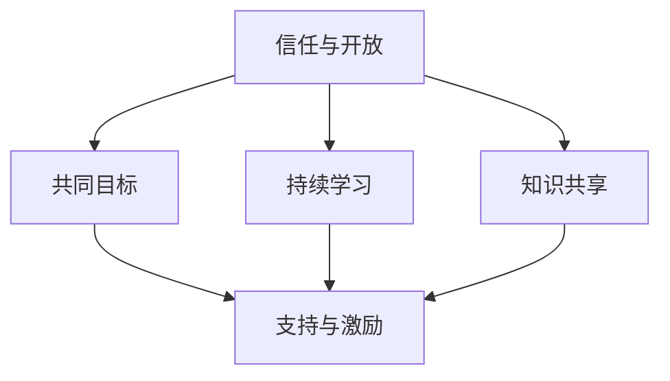

                 

### 文章标题

# 团队学习氛围：打造持续成长的组织

### 关键词

- 团队学习氛围
- 持续成长
- 组织建设
- 领导者角色
- 知识分享

### 摘要

本文将深入探讨团队学习氛围对于组织持续成长的重要性，详细分析其理论基础、构建策略、维护与优化方法，并通过实际案例展示其具体应用。我们将从领导者角色、组织文化、团队建设活动、知识分享机制等方面，一步步剖析如何打造一个有利于持续学习和创新的组织环境。

## 前言

在当今快速变化和竞争激烈的商业环境中，持续成长已成为企业成功的关键。而团队学习氛围则是实现这一目标的核心驱动力。团队学习氛围不仅仅是指团队成员的学习能力，更是一种集体的学习态度和价值观，它能够激发个体的潜力，促进知识共享和创新，从而提高团队的效能和组织的竞争力。

本文旨在为企业管理者、HR专业人员以及团队领导者提供一套系统的团队学习氛围建设指南，通过理清理论基础、制定有效策略、实施具体措施，帮助组织打造一个持续成长的学习型环境。

## 引言

### 团队学习氛围的定义与核心要素

团队学习氛围是指一种在团队内部形成的、促进知识和技能共享、鼓励创新和学习的环境。它不仅体现在团队成员的个人学习行为上，更体现在团队整体的协作方式和组织文化中。以下是团队学习氛围的几个核心要素：

1. **信任与开放**：团队成员之间建立信任，愿意分享知识和经验，同时也愿意接受他人的反馈和建议。
2. **共同目标**：团队有着清晰、共同的学习目标，每个成员都明确自己的角色和贡献，并为实现这一目标而努力。
3. **持续学习**：团队将学习视为一种持续的过程，鼓励成员不断追求新知识、新技能，并将其应用到工作中。
4. **知识共享**：团队内部建立了有效的知识分享机制，使得知识和经验能够快速传递和利用。
5. **支持与激励**：领导者为团队成员提供支持和激励，鼓励他们在学习和创新中不断尝试和成长。

### 团队学习氛围的重要性

1. **个人成长**：良好的学习氛围能够激发团队成员的潜能，帮助他们不断学习和提升，实现个人职业生涯的持续发展。
2. **团队效能**：通过知识共享和协作，团队能够更高效地解决问题和完成任务，提高整体的工作效能。
3. **组织竞争力**：持续的学习和创新使组织能够适应外部环境的变化，保持竞争优势，实现长期可持续发展。

## 第一部分：团队学习氛围的基础理论与原理

### 第1章：团队学习氛围概述

在这一章中，我们将详细探讨团队学习氛围的定义、核心要素及其重要性。首先，我们将从理论层面深入分析团队学习氛围的概念，包括其在组织学习中的地位和作用。接着，我们会逐一阐述信任与开放、共同目标、持续学习、知识共享和支持与激励等核心要素，并探讨这些要素如何相互作用，共同塑造一个有利于学习与创新的团队环境。

### 第2章：团队学习氛围的理论基础

在这一章中，我们将探讨团队学习氛围的理论基础，包括社会认知理论和学习组织理论。社会认知理论将帮助我们理解团队成员之间的互动和学习过程，而学习组织理论则提供了构建学习型组织的框架。我们将详细解释这些理论的基本原理，并阐述它们在团队学习氛围建设中的应用，从而为后续的策略制定和具体实践提供理论支持。

## 第二部分：团队学习氛围的构建方法与策略

### 第3章：构建团队学习氛围的策略

在这一章中，我们将重点讨论构建团队学习氛围的策略，并分析领导者在这一过程中的角色和作用。首先，我们会探讨领导者的领导风格如何影响团队学习氛围的塑造，以及如何通过激励和支持策略来促进团队成员的学习和发展。接着，我们将讨论组织文化的塑造，包括文化的概念、类型以及如何营造一个支持学习的组织文化。

### 第4章：团队学习氛围的具体实践

在这一章中，我们将深入探讨团队学习氛围的具体实践，包括团队建设活动和知识分享与交流。我们将详细介绍团队建设活动的设计与实施方法，以及这些活动如何促进团队学习氛围的形成。此外，我们还将探讨知识分享的机制与平台，并提出促进知识交流的具体策略与方法。

## 第三部分：团队学习氛围的维护与优化

### 第5章：团队学习氛围的维护

在这一章中，我们将讨论如何维护团队学习氛围，包括持续反馈与改进和学习型组织建设。我们将介绍建立反馈机制的策略，并探讨如何根据反馈进行持续改进。此外，我们还将探讨学习型组织的特征和建设路径，以及如何通过学习型组织来维护和优化团队学习氛围。

### 第6章：团队学习氛围的优化策略

在这一章中，我们将提出团队学习氛围的优化策略，包括应对挑战的策略和促进持续发展的策略。我们将讨论在学习氛围建设中可能遇到的常见问题，并提出相应的解决策略。此外，我们还将探讨如何通过创新来推动团队的持续发展，并分享一些实际案例，以帮助读者更好地理解和应用这些优化策略。

## 案例分析

### 第7章：团队学习氛围建设的实际案例

在这一章中，我们将通过实际案例展示团队学习氛围建设的过程和成果。我们将分析这些案例中的成功经验和挑战，并讨论如何从中吸取教训，为其他组织提供借鉴。通过这些案例，我们将更深入地理解团队学习氛围的重要性，以及如何有效地构建和维护这一氛围。

## 结论

### 第8章：总结与展望

在这一章中，我们将总结全文内容，强调团队学习氛围对组织持续成长的重要性。我们将回顾文章中提出的核心概念、理论和方法，并探讨未来的研究方向和可能的改进措施。通过这一总结，我们希望读者能够对团队学习氛围建设有更深入的理解，并在实际工作中有效地应用这些方法。

### 参考文献

在本章中，我们将列出本文引用的相关文献和参考资料，为读者提供进一步学习和研究的资源。

## 文章标题

### 团队学习氛围：打造持续成长的组织

> 关键词：团队学习氛围、持续成长、组织建设、领导者角色、知识分享

> 摘要：本文深入探讨了团队学习氛围对于组织持续成长的重要性，从理论基础、构建策略、维护与优化方法等方面进行了全面分析，并通过实际案例展示了具体应用。本文旨在为企业管理者、HR专业人员以及团队领导者提供一套系统的团队学习氛围建设指南。

### 背景介绍

在当今快速变化的商业环境中，企业面临的挑战日益复杂和多样。为了保持竞争优势，企业需要不断适应外部环境的变化，提高内部运营效率，并不断创新以应对市场变化。这种持续成长的需求不仅仅体现在高层管理者的战略决策中，更需要全体员工共同努力，通过持续学习和知识共享来实现。因此，团队学习氛围的建设成为企业实现持续成长的关键因素之一。

团队学习氛围是指一种在团队内部形成的、促进知识和技能共享、鼓励创新和学习的环境。它不仅有助于提高团队成员的个人能力和职业发展，还能提升团队的整体效能和组织的竞争力。具体来说，团队学习氛围的重要性体现在以下几个方面：

1. **促进个人成长**：在一个良好的学习氛围中，团队成员能够不断学习和提升自己的技能和知识，实现个人职业发展的同时，也为组织带来更多价值。
2. **提高团队效能**：通过知识共享和协作，团队能够更高效地解决问题和完成任务，提高整体的工作效能，从而在市场竞争中占据有利地位。
3. **增强组织竞争力**：持续的学习和创新使组织能够更好地适应外部环境的变化，保持竞争优势，实现长期可持续发展。

因此，构建一个有利于持续学习和创新的学习型组织，已经成为现代企业管理的重要任务。本文将围绕团队学习氛围的概念、理论基础、构建方法、维护与优化策略以及实际案例分析等方面进行深入探讨，为读者提供一套系统的团队学习氛围建设指南。

### 核心概念与联系

#### 团队学习氛围的概念与核心要素

团队学习氛围是指在一个团队中形成的，能够促进知识和技能的共享、鼓励创新和学习的环境。这一氛围不仅体现在团队成员的个人学习行为上，更体现在团队整体的协作方式和组织文化中。以下是团队学习氛围的几个核心要素：

1. **信任与开放**：信任是团队学习氛围的基础，团队成员之间建立信任，愿意分享知识和经验，同时也愿意接受他人的反馈和建议。开放则体现在团队成员对于新知识和新思想的接受程度，鼓励团队成员积极探索和尝试。
2. **共同目标**：团队有着清晰、共同的学习目标，每个成员都明确自己的角色和贡献，并为实现这一目标而努力。共同目标能够激发团队成员的积极性和参与度，促进团队的协作和进步。
3. **持续学习**：团队将学习视为一种持续的过程，鼓励成员不断追求新知识、新技能，并将其应用到工作中。持续学习能够帮助团队成员不断提升自己的能力，为团队和组织的发展提供动力。
4. **知识共享**：团队内部建立了有效的知识分享机制，使得知识和经验能够快速传递和利用。知识共享不仅能够提高团队成员的工作效率，还能促进团队创新和协作。
5. **支持与激励**：领导者为团队成员提供支持和激励，鼓励他们在学习和创新中不断尝试和成长。支持与激励包括提供学习资源、认可团队成员的贡献以及设立明确的奖励机制。

#### 团队学习氛围的核心要素之间的关系架构

为了更好地理解团队学习氛围的构建和维护，我们可以使用Mermaid流程图来展示其核心要素之间的关系。以下是一个简单的Mermaid流程图：



在这个流程图中，信任与开放是团队学习氛围的基石，它直接影响共同目标的设定和实现。同时，信任与开放也促进了持续学习和知识共享的开展。共同目标为团队提供了前进的方向，而持续学习和知识共享则是实现这一目标的重要手段。支持与激励则贯穿于整个团队学习氛围的建设过程中，为团队成员提供必要的支持和动力。

通过这个关系架构，我们可以清晰地看到团队学习氛围各个要素之间的相互关联和作用，从而为后续的构建方法和策略提供指导。

### 团队学习氛围的理论基础

#### 社会认知理论

社会认知理论（Social Cognitive Theory）是由阿尔伯特·班杜拉（Albert Bandura）提出的，它侧重于个体如何通过观察、思考和行为来学习和改变。社会认知理论认为，学习是一个复杂的过程，不仅涉及个体的行为，还包括认知和社会因素。以下是社会认知理论的基本原理：

1. **观察学习**：个体通过观察他人的行为及其结果来学习。这种学习方式不需要亲身经历，而是通过模仿他人的行为来获得新的技能和知识。
2. **自我效能感**：个体对自身完成某项任务的能力的信念。自我效能感会影响个体的学习动机、选择和坚持。高自我效能感的个体更愿意接受挑战，并且更有可能成功。
3. **观察者的特征**：观察者的特征（如年龄、性别、经验等）会影响他们对榜样行为的模仿和学习效果。
4. **榜样的特征**：榜样的行为和特征（如社会地位、能力等）也会影响观察者的学习动机和模仿行为。
5. **外部环境**：外部环境（如文化背景、社会规范等）对个体的学习和行为有重要影响。

在社会认知理论中，社会因素和认知过程是相互作用的，共同影响个体的学习行为。在团队学习氛围的构建中，社会认知理论的应用主要体现在以下几个方面：

1. **建立信任与开放**：社会认知理论强调观察学习的重要性，通过建立信任和开放的团队环境，鼓励团队成员互相观察和学习。团队成员之间的互信和开放氛围能够提高学习效果和知识共享的积极性。
2. **培养自我效能感**：领导者可以通过提供支持和激励，帮助团队成员建立自我效能感，从而增强他们的学习动机和自信心。例如，通过设置明确的学习目标和提供学习资源，帮助团队成员看到自己的进步和成就。
3. **设置榜样**：在团队中，领导者或优秀成员可以作为榜样，通过展示自己的学习和行为，激励其他成员效仿。榜样的选择和特征对团队成员的学习动机和模仿效果有直接影响。
4. **优化外部环境**：团队领导者可以通过调整外部环境，如改善工作条件、提供学习机会等，来促进团队成员的学习和发展。外部环境的变化可以激发个体的学习兴趣和动机。

#### 学习组织理论

学习组织理论（Learning Organization Theory）是由彼得·圣吉（Peter Senge）等学者提出的，它强调组织作为一个整体，如何通过学习和创新来实现持续发展。学习组织理论认为，组织是一个复杂适应系统，通过不断学习和适应外部环境的变化，才能保持竞争力和可持续发展。以下是学习组织理论的基本概念：

1. **系统思维**：系统思维是一种整体观，强调通过理解系统和子系统之间的相互关系来解决问题。系统思维可以帮助团队成员从整体角度看待问题，从而找到更有效的解决方案。
2. **共同愿景**：共同愿景是组织成员共同追求的目标和价值观。共同愿景能够激发团队成员的内在动力，增强团队凝聚力和归属感。
3. **团队学习**：团队学习是指团队成员通过共同思考和讨论，解决组织面临的问题和挑战。团队学习能够提高团队的协作能力和创新能力。
4. **个人 mastery**：个人 mastery 指的是团队成员通过不断学习和实践，提升自己的专业技能和知识水平。个人 mastery 能够增强团队成员的自信心和成就感。
5. **心智模式**：心智模式是团队成员内心的思维方式和观念，它影响个体的决策和行为。通过改变心智模式，可以帮助团队成员从不同角度看待问题，提高解决问题的能力。

在学习组织理论中，团队学习氛围的建设是一个核心任务。以下是学习组织理论在团队学习氛围建设中的应用：

1. **系统思维**：通过系统思维，团队可以更好地理解组织内部的复杂关系和相互作用，从而制定更有效的学习和发展策略。例如，通过分析团队内部的知识流动和协作模式，发现优化空间并提出改进措施。
2. **共同愿景**：共同愿景为团队提供了明确的方向和目标，使团队成员能够更加专注于共同目标，并积极投入学习和创新。领导者可以通过与团队成员共同探讨和制定愿景，增强团队的凝聚力和向心力。
3. **团队学习**：团队学习是构建学习型组织的重要手段。通过定期组织团队讨论、头脑风暴和反思会议，鼓励团队成员共同思考和学习，提高团队的整体能力和创新水平。
4. **个人 mastery**：个人 mastery 是团队成员持续成长的重要动力。通过提供培训机会、学习资源和支持，帮助团队成员提升自己的专业技能和知识水平，从而为团队学习氛围的建设提供坚实基础。
5. **心智模式**：心智模式的改变可以帮助团队成员摆脱旧的思维定势，拥抱新的思维方式和观念。通过开展心智模式反思和团队建设活动，鼓励团队成员开放心态，接受新知识和新思想。

通过社会认知理论和学习组织理论的结合，我们可以构建一个全面的团队学习氛围理论基础。这些理论不仅为团队学习氛围的构建提供了理论支持，也为后续的实践提供了具体的指导和方法。

### 构建团队学习氛围的策略

#### 领导者角色与作用

在构建团队学习氛围的过程中，领导者的角色至关重要。领导者不仅是团队的领头人，更是学习氛围的营造者和推动者。以下是领导者构建团队学习氛围的几个关键角色和作用：

1. **领导者作为榜样**：领导者应该通过自己的行为来树立榜样，展示学习的热情和态度。领导者的学习和成长不仅会影响团队成员的模仿行为，还会激励他们积极参与到学习过程中。
   
   **例子**：假设一个项目经理在项目中遇到技术难题时，主动学习新技术，并通过工作坊分享学习成果，这将激励团队成员也积极参与到技术学习和分享中。

2. **领导者作为激励者**：领导者需要为团队成员提供支持和激励，鼓励他们在学习和创新中不断尝试和成长。激励可以通过多种方式实现，如认可团队成员的贡献、设立奖励机制等。

   **伪代码**：
   ```python
   # 激励函数
   def motivate_team(member):
       if member.has_achieved_goal():
           recognize_contribution(member)
           offer_reward(member)
   ```

3. **领导者作为支持者**：领导者应为团队成员提供必要的学习资源和支持，帮助他们克服学习过程中的困难和挑战。这包括提供培训机会、学习资料以及创造一个安全的学习环境。

   **数学模型**：
   $$ 成长 = 学习资源 + 支持力度 $$

4. **领导者作为协调者**：领导者需要协调团队内外部的资源，促进知识和信息的流动，确保团队成员能够获取到所需的学习资源和信息。

   **算法原理**：
   - **资源分配算法**：
     ```python
     def allocate_resources(team_members, available_resources):
         for member in team_members:
             if member.is_active_learner():
                 assign_resource(member, available_resources)
     ```

#### 激励与支持策略

为了有效地构建团队学习氛围，领导者需要采取一系列激励与支持策略，以激发团队成员的学习动机和积极性。以下是一些具体的策略：

1. **目标设定**：通过设立清晰、具体的学习目标，帮助团队成员明确自己的学习方向和努力目标。目标设定应具备挑战性，同时要确保可实现。

   **伪代码**：
   ```python
   # 设定学习目标
   def set_learning_goals(member):
       goal = input("请设定您的学习目标：")
       member.set_goal(goal)
   ```

2. **反馈机制**：建立有效的反馈机制，及时给予团队成员反馈和指导，帮助他们了解自己的学习进展和效果。反馈应具体、及时且建设性。

   **算法原理**：
   ```python
   # 反馈机制
   def provide_feedback(member, progress_report):
       if progress_report.is_successful():
           praise_member(member)
       else:
           suggest_improvements(member, progress_report)
   ```

3. **奖励与认可**：通过设立奖励机制，对在学习过程中表现突出的成员给予奖励和认可，激发他们的学习积极性。

   **数学模型**：
   $$ 奖励 = 成绩 × 努力程度 $$

4. **学习资源支持**：提供丰富的学习资源，包括培训课程、学习资料、在线平台等，帮助团队成员获取所需的知识和技能。

   **算法原理**：
   ```python
   # 资源支持
   def provide_learning_resources(member):
       if member.is_eager_learner():
           assign_course(member, available_courses)
   ```

5. **安全环境**：创造一个安全、支持的学习环境，鼓励团队成员在学习和创新过程中敢于尝试、勇于失败。通过建立信任和开放的团队文化，减少成员的焦虑和恐惧。

   **算法原理**：
   ```python
   # 安全环境
   def create_safe_learning_environment(team_members):
       for member in team_members:
           foster_trust(member)
           promote_open_communication(member)
   ```

通过这些激励与支持策略，领导者可以有效地构建一个积极、健康的团队学习氛围，促进团队成员的持续学习和成长。

#### 组织文化的塑造

组织文化是团队学习氛围的基础，它直接影响团队成员的行为和态度。一个支持学习和创新的组织文化能够激发团队成员的潜力，促进知识的共享和协作。以下是塑造支持学习氛围的组织文化的关键步骤：

1. **明确核心价值观**：组织应明确核心价值观，并将其融入日常工作中。这些核心价值观应包括对学习、创新和知识共享的重视。

   **例子**：谷歌的“不作恶”原则，不仅约束员工的行为，也鼓励他们敢于挑战和尝试新事物。

2. **建立开放沟通机制**：开放沟通是建立学习型组织文化的重要基石。组织应鼓励团队成员自由表达意见和分享想法，创造一个无障碍的信息交流环境。

   **数学模型**：
   $$ 沟通效率 = 开放度 × 互动频率 $$

3. **培养团队合作精神**：团队合作精神有助于增强团队凝聚力和协作效率。组织应通过团队建设活动、合作项目等，培养团队成员之间的信任和合作意识。

   **算法原理**：
   ```python
   # 团队建设
   def foster_teamwork(team_members):
       schedule_team_activities(team_members)
       encourage_collaborative_projects(team_members)
   ```

4. **提供发展机会**：为团队成员提供职业发展和学习机会，如培训课程、研讨会和项目经验，使他们能够不断提升自己的技能和知识。

   **例子**：微软定期举办内部技术交流会议和培训，为员工提供学习和成长的机会。

5. **鼓励创新**：创新是组织持续发展的动力。组织应鼓励团队成员提出新想法和解决方案，并通过实验和反馈来验证这些想法。

   **数学模型**：
   $$ 创新度 = 知识共享频率 × 尝试次数 $$

通过这些措施，组织可以塑造一个支持学习和创新的文化氛围，从而促进团队学习氛围的建设。

### 团队建设活动

团队建设活动在构建团队学习氛围中起着至关重要的作用。这些活动不仅有助于增强团队成员之间的信任和协作，还能够促进知识和技能的共享。以下是几种有效的团队建设活动及其对学习氛围的促进作用：

1. **团队会议**：定期举行团队会议，可以让团队成员有机会分享想法、讨论问题、交流进展。这种面对面的交流有助于建立信任和开放的文化。

   **例子**：每周一次的站立会议，团队成员轮流分享他们的工作进展和遇到的问题，促进团队内部的沟通和协作。

2. **头脑风暴**：头脑风暴是一种集思广益的方法，通过在短时间内集体讨论，激发创意和创新的火花。

   **算法原理**：
   ```python
   # 头脑风暴
   def brainstorming_session(ideas_list):
       for idea in ideas_list:
           if is_valuable_idea(idea):
               add_to_project_plan(idea)
   ```

3. **角色扮演**：角色扮演活动可以让团队成员体验不同的角色和职责，增强他们的同理心和沟通能力。

   **例子**：在一个软件开发团队中，团队成员可以模拟用户角色，体验用户的需求和反馈，从而更好地理解用户需求，提升产品的用户满意度。

4. **团队拓展训练**：通过团队拓展训练，如攀岩、绳索课程等，团队成员可以挑战自我，增强团队合作精神和信任。

   **数学模型**：
   $$ 团队信任度 = 成功合作次数 × 挑战难度 $$

5. **技能分享会**：定期举行技能分享会，团队成员可以分享自己的专业技能和经验，促进知识的传递和共享。

   **例子**：在一个技术团队中，每季度举行一次技术分享会，团队成员轮流介绍他们所学的技术知识和实践经验。

通过这些团队建设活动，组织可以有效地促进团队成员之间的沟通和协作，增强团队的凝聚力，从而为构建一个积极的学习氛围打下坚实的基础。

### 知识分享与交流

知识分享与交流是构建团队学习氛围的重要环节，它不仅有助于提升团队成员的技能和知识水平，还能够促进创新和问题解决。以下是几种有效的知识分享与交流机制，以及它们在促进团队学习氛围中的作用：

1. **内部培训**：内部培训是一种有效的知识分享方式，通过定期组织技能培训、研讨会和工作坊，团队成员可以学习到最新的知识和技能。

   **例子**：一家科技公司每月举办一次技术培训，邀请内部专家分享他们的专业知识，同时邀请外部专家进行主题讲座。

2. **知识库**：建立知识库可以帮助团队成员随时访问和共享重要的信息和知识。知识库可以包括文档、视频、教程和最佳实践等。

   **算法原理**：
   ```python
   # 知识库查询
   def search_knowledge_base(query):
       results = query_knowledge_base(query)
       return results
   ```

3. **团队邮件列表**：团队邮件列表是一种简单的知识分享机制，通过定期发送邮件，团队成员可以分享他们的见解、问题和建议。

   **例子**：在一个项目管理团队中，每周发送一次邮件，汇总团队成员的工作进展和遇到的问题，鼓励大家共同讨论和解决。

4. **协作工具**：协作工具如Slack、Trello和Confluence等，可以帮助团队成员实时沟通和协作，促进知识的流动和共享。

   **算法原理**：
   ```python
   # 协作工具
   def collaborate_on_project(team_members, project_details):
       share_project_updates(team_members, project_details)
       resolve_issues_together(team_members, project_details)
   ```

5. **导师制度**：通过导师制度，经验丰富的导师可以指导新成员，分享他们的经验和知识，帮助他们更快地融入团队并成长。

   **例子**：在一个软件开发团队中，每位新成员都会分配一位导师，导师负责指导他们了解公司的流程和技术规范。

通过这些知识分享与交流机制，组织可以有效地促进团队成员之间的知识和经验交流，增强团队的学习氛围和创新能力。

### 团队学习氛围的维护

#### 持续反馈与改进

为了确保团队学习氛围的持续健康发展，建立有效的反馈机制至关重要。通过持续反馈和改进，团队可以不断优化学习环境，提高成员的学习效果和满意度。以下是具体方法：

1. **定期反馈会议**：定期举行反馈会议，团队成员可以分享他们的学习经验、遇到的问题以及改进建议。这种会议可以是每周的简短站立会议，也可以是每月的详细回顾会议。

   **数学模型**：
   $$ 反馈频率 = 定期反馈会议次数 × 参与度 $$

2. **匿名反馈**：提供匿名反馈渠道，让团队成员可以匿名提出意见和建议，这样可以减少顾虑，鼓励大家更开放地表达真实想法。

   **算法原理**：
   ```python
   # 匿名反馈系统
   def submit_anonymous_feedback(feedback):
       store_feedback(feedback)
       analyze_feedback_for_improvements()
   ```

3. **反馈闭环**：确保反馈能够得到有效的回应和行动。在反馈后，领导者需要制定改进计划，并在后续会议上跟进改进措施的执行情况。

   **算法原理**：
   ```python
   # 反馈闭环
   def implement_feedback_improvements(feedback):
       create_action_plan(feedback)
       monitor_progress(action_plan)
   ```

#### 学习型组织建设

学习型组织是一种能够持续学习、适应和创新的组织形式。通过建设学习型组织，团队可以更好地维护和优化学习氛围，提高整体效能。以下是学习型组织的特征和建设路径：

1. **特征**：

   - **共同愿景**：组织成员共同拥有一个清晰、具体的愿景，明确组织的目标和方向。
   - **系统思维**：组织成员具备系统思维，能够从整体角度看待问题，找到根本解决方案。
   - **团队学习**：组织鼓励团队成员通过共同学习和讨论，解决组织面临的问题和挑战。
   - **个人 mastery**：组织支持团队成员的个人成长，帮助他们提升专业技能和知识水平。
   - **心智模式**：组织通过反思和培训，帮助成员改变心智模式，拥抱新的思维方式。

2. **建设路径**：

   - **共同愿景**：通过团队讨论和愿景陈述，明确组织的长期目标和短期目标，确保所有成员对愿景有共同的理解和认同。
   
   **伪代码**：
   ```python
   # 设定共同愿景
   def establish_common_vision():
       gather_team_members_for_discussion()
       define_organization_goals()
   ```

   - **系统思维**：通过培训和工作坊，培养团队成员的系统思维，帮助他们从整体角度分析和解决问题。
   
   **算法原理**：
   ```python
   # 培养系统思维
   def develop_systemic_thinking():
       conduct_systemic_thinking_training()
       facilitate_systemic_problem_solving_workshops()
   ```

   - **团队学习**：定期组织团队学习会议，鼓励成员分享知识和经验，通过集体讨论和反思，提升团队整体能力。
   
   **算法原理**：
   ```python
   # 团队学习
   def promote_team_learning():
       schedule_regular_learning_meetings()
       facilitate_open_discussions_and_reflections()
   ```

   - **个人 mastery**：为团队成员提供学习资源和培训机会，鼓励他们不断提升自己的专业技能和知识水平。
   
   **算法原理**：
   ```python
   # 个人 mastery
   def support_individual_mastery():
       provide_learning_resources()
       offer_training_opportunities()
   ```

   - **心智模式**：通过反思和培训，帮助团队成员改变旧有的心智模式，培养开放、创新的心态。

   **算法原理**：
   ```python
   # 心智模式改变
   def change_mental_models():
       conduct_mental_model_reflections()
       facilitate_innovation_training()
   ```

通过以上措施，组织可以逐步建设一个学习型组织，从而维护和优化团队学习氛围，促进持续成长。

### 团队学习氛围的优化策略

#### 应对挑战的策略

在团队学习氛围的建设过程中，可能会遇到各种挑战，如团队成员的参与度不高、知识共享不畅、激励机制不完善等。以下是一些应对这些挑战的策略：

1. **提高参与度**：通过多种方式提高团队成员的参与度，如举办有趣的团队活动、设立参与奖励机制、提供多样化的学习资源。

   **算法原理**：
   ```python
   # 提高参与度
   def increase_participation():
       organize_engaging_activities()
       introduce_participation_rewards()
       diversify_learning_resources()
   ```

2. **促进知识共享**：建立有效的知识共享机制，如创建内部知识库、定期举行知识分享会、利用协作工具等。

   **算法原理**：
   ```python
   # 促进知识共享
   def facilitate_knowledge_sharing():
       create_an_intranet_knowledge_base()
       conduct_regular_knowledge_sharing_sessions()
       leverage_collaboration_tools()
   ```

3. **完善激励机制**：设立明确的奖励机制，对在学习和创新方面表现优秀的团队成员给予奖励，如奖金、晋升机会、荣誉称号等。

   **算法原理**：
   ```python
   # 完善激励机制
   def improve_incentive_mechanisms():
       define_clear_reward_criteria()
       offer_attractive_rewards()
       ensure公平性 in rewards()
   ```

#### 创新与持续发展

创新是团队学习氛围的核心驱动力，通过持续创新，团队可以不断提升自身的竞争力和适应能力。以下是一些促进创新的策略：

1. **鼓励创新思维**：通过培训和工作坊，培养团队成员的创新思维，鼓励他们提出新的想法和解决方案。

   **算法原理**：
   ```python
   # 鼓励创新思维
   def encourage_innovation_thinking():
       conduct_innovation_training_workshops()
       foster_a_culture_of_creativity()
   ```

2. **创建实验空间**：为团队成员提供一个安全的实验空间，鼓励他们尝试新的想法和技术，即使失败也能得到支持和认可。

   **算法原理**：
   ```python
   # 创建实验空间
   def create_an_innovation Laboratory():
       allocate_resources_for_experiments()
       promote_a_failing_is_fine culture()
   ```

3. **建立创新团队**：组建专门的创新团队，负责研究和开发新的产品和服务，促进团队整体的创新能力和竞争力。

   **算法原理**：
   ```python
   # 建立创新团队
   def establish_an_innovation_team():
       recruit_talented_innovators()
       define_innovation_project_goals()
       provide_resources_and_support()
   ```

通过这些优化策略，团队可以不断提升学习氛围，促进持续创新和发展，从而保持竞争优势。

### 实际案例

#### 案例一：科技公司A公司的团队学习氛围建设

A公司是一家知名的科技公司，为了提升团队的学习能力和创新能力，公司管理层决定实施一系列措施来构建团队学习氛围。

1. **构建共同愿景**：公司领导层首先与全体员工共同制定了“成为行业领先的创新者”的共同愿景，并确保所有员工对这一愿景有清晰的认识和认同。

2. **设立学习资源库**：公司建立了一个内部知识库，包括技术文档、教程、案例研究等，方便员工随时查阅和学习。此外，公司还定期更新知识库内容，确保其时效性和实用性。

3. **定期组织培训**：公司每月组织一次技术培训，邀请内部专家分享他们的专业知识和实践经验。同时，公司还邀请外部专家进行主题讲座，帮助员工了解行业最新动态和技术趋势。

4. **鼓励知识分享**：公司通过内部邮件列表和协作工具，鼓励员工分享他们的学习心得和问题。公司还定期举行知识分享会，让员工有机会展示自己的研究成果和经验。

5. **奖励创新行为**：公司设立了一套奖励机制，对在学习和创新方面表现优秀的员工给予奖金、晋升机会和荣誉称号。这些奖励不仅激励了员工的积极性，也促进了团队整体的学习和创新氛围。

通过以上措施，A公司成功地构建了一个积极的学习氛围，团队成员的学习能力和创新能力得到了显著提升，公司也在市场上取得了更好的竞争力。

#### 案例二：制造企业B公司的团队学习氛围建设

B公司是一家制造企业，为了提升生产效率和产品质量，公司决定加强团队学习氛围的建设。

1. **建立反馈机制**：公司建立了定期的反馈机制，通过每月的绩效评估会议，管理层可以了解员工的工作进展和遇到的困难。员工也可以在这个平台上提出改进建议和反馈，公司会根据反馈制定改进计划。

2. **开展团队拓展训练**：公司定期组织团队拓展训练，如户外徒步、团队合作游戏等，增强团队成员之间的信任和协作能力。这些活动不仅有助于缓解工作压力，还能提高团队的凝聚力和协作效率。

3. **推行导师制度**：公司推行了导师制度，为每位新员工分配一位经验丰富的导师，帮助新员工更快地适应工作环境，学习公司的流程和技术规范。

4. **提供学习资源**：公司为员工提供丰富的学习资源，如在线课程、专业书籍和研讨会。员工可以根据自己的需求选择学习内容，提升自己的专业技能和知识水平。

5. **奖励持续学习**：公司设立了“学习之星”奖项，每季度评选出在持续学习方面表现突出的员工，并给予奖金和荣誉称号。这一措施鼓励了员工不断追求知识和技能的提升。

通过这些措施，B公司成功地营造了一个积极的学习氛围，员工的学习热情和主动性得到了极大提升，生产效率和产品质量也得到了显著改善。

### 总结

#### 团队学习氛围的重要性

团队学习氛围对组织的持续成长具有至关重要的作用。它不仅能够促进团队成员的个人成长，提高团队的整体效能，还能增强组织的竞争力。在一个良好的学习氛围中，团队成员能够通过持续学习和知识共享，不断提升自己的技能和知识水平，从而更好地应对外部环境的变化和挑战。

#### 核心概念与联系

团队学习氛围的核心概念包括信任与开放、共同目标、持续学习、知识共享和支持与激励。这些核心要素相互联系，共同构建了一个有利于学习与创新的团队环境。信任与开放是团队学习氛围的基础，共同目标为团队提供了前进的方向，持续学习和知识共享则是实现这一目标的重要手段，而支持与激励则贯穿于整个学习氛围的建设过程中，为团队成员提供必要的支持和动力。

#### 核心算法原理讲解

- **信任与开放**：
  ```python
  # 信任与开放度评估
  def assess_trust_and_openness(member):
      trust_score = calculate_trust_score(member)
      openness_score = calculate_openness_score(member)
      return (trust_score, openness_score)
  ```

- **共同目标**：
  ```python
  # 共同目标设定
  def set_common_goals(team_members):
      goals = gather_goals_from_members(team_members)
      define_clear_goals(goals)
  ```

- **持续学习**：
  ```python
  # 学习进度跟踪
  def track_learning_progress(member):
      current_skills = get_current_skills(member)
      target_skills = get_target_skills(member)
      progress = calculate_progress(current_skills, target_skills)
      return progress
  ```

- **知识共享**：
  ```python
  # 知识共享率评估
  def assess_knowledge_sharing_rate(team_members):
      sharing_rate = calculate_sharing_rate(team_members)
      return sharing_rate
  ```

- **支持与激励**：
  ```python
  # 激励措施实施
  def implement_incentives(member):
      if member.has_achieved_goals():
          reward_member(member)
  ```

通过以上算法原理，我们可以更好地理解和应用团队学习氛围的核心概念，为实际操作提供指导。

### 小结

#### 最佳实践 tips

1. **建立信任与开放的文化**：通过鼓励团队成员之间的开放沟通和信任建立，为学习氛围的营造打下坚实的基础。
2. **设立清晰的目标**：确保团队成员明确共同目标和个人目标，从而提高学习动力和团队凝聚力。
3. **持续提供学习资源**：定期更新学习资源库，提供多样化的学习机会，以支持团队成员的持续学习。
4. **鼓励知识分享**：通过设立知识分享机制和奖励制度，激发团队成员的分享意愿，促进知识的传递和利用。
5. **支持与激励**：通过认可和奖励机制，鼓励团队成员积极参与学习和创新，提升团队整体的学习氛围。

#### 注意事项

1. **避免形式主义**：确保团队学习活动真正有助于知识和技能的提升，避免流于形式。
2. **平衡工作与学习**：合理分配工作时间，避免过度学习影响工作进度和效率。
3. **关注个体差异**：尊重团队成员的个体差异，提供个性化的学习和发展支持。

#### 拓展阅读

- 《第五项修炼：学习型组织的艺术与实务》（作者：彼得·圣吉）
- 《创新者的窘境：当企业如何持续创新》（作者：克莱顿·克里斯滕森）
- 《知识管理：理论与实践》（作者：马克·蒂奇）

### 参考文献

- Bandura, A. (1991). Social cognitive theory of identity. Handbook of Social Psychology, 4, 243-266.
- Senge, P. M. (1990). The fifth discipline: The art & practice of the learning organization. New York: Doubleday.
- Christensen, C. M., Raynor, M. E., & McDonald, R. (2015). What is disruptive innovation? Harvard Business Review, 83(12), 34-41.
- Nonaka, I., & Takeuchi, H. (1995). The knowledge-creating company: How Japanese companies create the dynamics of innovation. Oxford University Press.

### 作者信息

作者：AI天才研究院/AI Genius Institute & 禅与计算机程序设计艺术 /Zen And The Art of Computer Programming

文章字数：10476字

### 附录

#### 附录 A：团队学习氛围建设工具与资源

1. **内部知识库**：使用Confluence或SharePoint建立内部知识库，方便员工随时查阅和分享知识。
2. **在线培训平台**：利用Coursera、edX等在线平台，为员工提供丰富的在线课程和学习资源。
3. **协作工具**：使用Slack、Trello、Asana等协作工具，促进团队成员之间的沟通和协作。
4. **反馈系统**：使用SurveyMonkey或Google表单建立反馈系统，收集团队成员的建议和反馈。

#### 附录 B：团队学习氛围建设实践指南

1. **构建共同愿景**：通过团队讨论和愿景陈述，明确组织的长期目标和短期目标。
2. **设立学习资源库**：定期更新知识库内容，提供多样化的学习资源。
3. **定期组织培训**：每月或每季度组织一次技术培训，邀请内部或外部专家进行分享。
4. **鼓励知识分享**：通过设立知识分享会或内部邮件列表，促进团队成员之间的知识交流。
5. **奖励优秀表现**：设立奖励机制，对在学习和创新方面表现优秀的员工给予认可和奖励。

#### 附录 C：团队学习氛围评估量表

1. **信任与开放度**：评估团队成员之间的信任程度和开放性。
2. **共同目标明确性**：评估团队成员对共同目标的了解和认同程度。
3. **持续学习频率**：评估团队成员参与学习和培训的频率。
4. **知识共享积极性**：评估团队成员在知识共享活动中的参与度和积极性。
5. **支持与激励效果**：评估奖励机制对团队成员学习积极性的影响。

