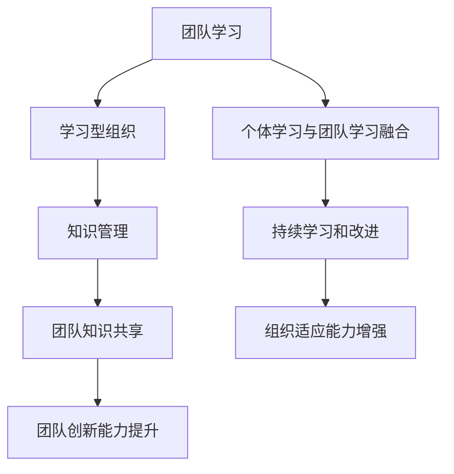

                 


### 团队学习：打造学习型组织

关键词：团队学习、学习型组织、知识管理、教育心理学、协作工具

摘要：本文从团队学习的定义和重要性出发，探讨了学习型组织的理论基础和团队学习的优势。通过分析团队学习的策略与实践，提出了建立学习型团队的方法和工具，并结合案例研究对团队学习的应用进行了深入剖析。文章旨在为IT领域的团队提供关于如何打造学习型组织的实用指导。

## 第一部分：团队学习概述

### 第1章：团队学习的重要性

#### 1.1.1 团队学习的定义

团队学习是指团队成员通过相互交流和合作，共同探索和解决问题，提高个人和团队的能力和绩效的过程。它是学习型组织建设的基础，强调的是个体学习与团队学习的融合。

#### 1.1.2 学习型组织的概念

学习型组织是指具有持续学习能力和适应能力的组织。它通过不断的知识创造、分享和应用，提高组织的竞争力和创新能力。学习型组织的特点包括：开放的沟通环境、鼓励创新、持续的学习和改进等。

#### 1.1.3 团队学习的优势

1. 提高团队协作能力：通过团队学习，团队成员能够更好地理解彼此的职责和角色，提高协作效率。

2. 促进知识共享：团队学习有助于团队成员之间知识的交流和共享，提高整体知识水平。

3. 提高问题解决能力：团队学习能够集思广益，提高团队解决复杂问题的能力。

4. 增强组织适应能力：团队学习有助于组织适应外部环境的变化，提高组织的竞争力。

### 1.1.4 从软件 1.0 到软件 2.0 的演进

软件 1.0 时代主要是指计算机软件的早期发展阶段，软件以功能为导向，注重程序的正确性和稳定性。随着互联网的兴起，软件 2.0 时代到来，软件开始强调用户参与、用户体验和互动性。软件 2.0 时代的核心特点是互联网化和平台化。

### 1.1.5 大模型在软件 2.0 中的核心地位

在软件 2.0 时代，大模型（如深度学习模型）成为软件开发的核心。大模型能够通过海量数据的学习，实现复杂任务的自动化处理，从而提高软件的智能化水平和用户体验。大模型的应用，使得软件从功能驱动转向数据驱动，从封闭系统转向开放平台。

### 1.1.6 企业级应用开发的新范式

企业级应用开发的新范式是指在企业应用开发过程中，更加注重数据的价值、用户体验和敏捷性。新范式强调通过大数据、人工智能等技术，实现企业运营的智能化和自动化，提高企业的生产力和竞争力。

### 1.1.7 AI大模型的定义与特点

AI大模型是指具有大规模参数、能够处理复杂数据的机器学习模型。其特点包括：

1. 参数规模大：AI大模型通常包含数百万甚至数亿个参数，能够处理大规模的数据集。

2. 计算能力需求高：AI大模型需要高性能计算资源进行训练和推理。

3. 自适应能力强：AI大模型能够根据输入数据的特征，自动调整模型参数，实现自适应学习和预测。

4. 应用广泛：AI大模型在图像识别、自然语言处理、语音识别等领域具有广泛的应用。

### 1.1.8 AI大模型的定义

AI大模型是指通过深度学习等技术，对大规模数据进行训练，形成具有高参数规模的机器学习模型。AI大模型能够对复杂数据进行高效处理和预测，是现代人工智能技术的重要发展方向。

## 第二部分：团队学习的理论基础

### 第2章：团队学习的理论基础

#### 2.1.1 学习型组织的理论基础

学习型组织的理论基础源于组织行为学和心理学。彼得·圣吉在其著作《第五项修炼》中提出了学习型组织的五个核心修炼：自我超越、心智模式、共同愿景、团队学习和系统思考。这些修炼为构建学习型组织提供了理论和实践指导。

#### 2.1.2 教育心理学在团队学习中的应用

教育心理学为团队学习提供了理论基础，包括学习动机、学习策略、学习风格等。了解团队成员的学习动机和风格，有助于制定针对性的学习策略，提高学习效果。

#### 2.1.3 知识管理在团队学习中的作用

知识管理是团队学习的重要组成部分。通过有效的知识管理，团队可以更好地收集、整理、共享和应用知识，提高团队的知识水平和创新能力。

### 2.1.4 核心概念与联系：团队学习、学习型组织和知识管理的架构

下面是团队学习、学习型组织和知识管理之间的核心概念和联系架构的 Mermaid 流程图：



### 2.1.5 核心算法原理讲解

团队学习的核心算法可以基于多智能体系统（MAS）理论，通过以下伪代码进行描述：

```python
# 伪代码：多智能体系统（MAS）理论在团队学习中的应用

# 初始化智能体集合
agents = initialize_agents()

# 定义智能体学习函数
def agent_learning(agent, knowledge_base):
    # 更新智能体知识库
    agent.update_knowledge_base(knowledge_base)
    # 更新智能体状态
    agent.update_state()

# 循环执行智能体学习
while not all_agents_learnt():
    for agent in agents:
        # 获取当前知识库
        knowledge_base = agent.get_knowledge_base()
        # 执行学习
        agent_learning(agent, knowledge_base)

# 输出学习结果
print("团队学习完成，各智能体知识库更新如下：")
for agent in agents:
    print(agent.get_knowledge_base())
```

### 2.1.6 数学模型和公式 & 详细讲解 & 举例说明

团队学习中的数学模型可以基于协作学习理论，以下是一个简单的例子：

$$
L = f(S, K)
$$

其中，$L$ 表示团队学习效果，$S$ 表示团队成员的知识共享程度，$K$ 表示团队知识库。

- $f(S, K)$ 是一个复合函数，表示团队学习效果与知识共享程度和知识库之间的关系。

- 举例说明：假设团队有两个成员，A和B，他们的知识共享程度分别为$S_A = 0.8$ 和$S_B = 0.7$，知识库分别为$K_A = \{1, 2, 3\}$ 和$K_B = \{4, 5, 6\}$。根据上述模型，可以计算团队学习效果$L$：

$$
L = f(S_A, K_A) \times f(S_B, K_B) = 0.8 \times 0.7 \times (\{1, 2, 3\} \cup \{4, 5, 6\}) = 0.56 \times \{1, 2, 3, 4, 5, 6\}
$$

这意味着团队学习效果为$0.56$，即团队成员的知识共享程度和知识库共同决定了团队学习的成效。

## 第三部分：团队学习的策略与实践

### 第3章：建立学习型团队

#### 3.1.1 团队文化建设

团队文化是学习型团队的基础。建立一个鼓励学习、创新和协作的团队文化，有助于提高团队成员的学习积极性和团队整体的学习能力。

- **目标明确**：团队要有明确的目标和愿景，让每个成员都清楚自己的学习方向和努力目标。

- **价值观一致**：团队价值观要强调学习、创新和协作，形成共同的价值观和行为准则。

- **激励制度**：建立奖励机制，激励团队成员积极参与学习和分享知识。

#### 3.1.2 促进团队成员参与

团队成员的积极参与是团队学习的关键。为了促进团队成员的参与，可以采取以下措施：

- **沟通机制**：建立有效的沟通机制，鼓励团队成员提出问题和分享经验。

- **学习活动**：组织定期的学习活动和培训，提高团队成员的专业技能。

- **团队讨论**：鼓励团队成员参与团队讨论，激发思维碰撞，共同解决问题。

#### 3.1.3 团队学习计划的制定

制定一个明确的团队学习计划，有助于确保团队学习的有序进行。团队学习计划应包括以下内容：

- **学习目标**：明确团队学习的目标和预期成果。

- **学习内容**：确定需要学习的内容和知识领域。

- **学习时间表**：制定学习的时间表，确保团队成员有足够的时间参与学习。

- **学习评估**：设立学习评估机制，对学习效果进行跟踪和评估。

### 第4章：促进团队学习的工具与技术

#### 4.1.1 脑力激荡法

脑力激荡法是一种有效的团队学习工具，通过集体思维激发团队成员的创造力。脑力激荡法的核心原则是鼓励团队成员自由发言、相互启发，不断提出新的想法和解决方案。

- **步骤**：

  1. 确定主题：明确需要解决的问题或需要学习的知识领域。

  2. 自由发言：每个成员都可以自由发言，提出自己的想法和建议。

  3. 记录想法：将每个成员的想法记录下来，供后续讨论和分析。

  4. 互相启发：团队成员互相启发，对提出的想法进行讨论和改进。

  5. 形成方案：根据讨论结果，形成具体的解决方案或学习计划。

#### 4.1.2 敏捷开发方法

敏捷开发方法是一种以人为核心、迭代和渐进的开发方法，适用于快速变化的环境。敏捷开发方法强调团队成员的协作和沟通，有助于提高团队的学习能力和适应能力。

- **核心原则**：

  1. 客户合作：与客户保持紧密的合作，确保开发的方向和目标与客户需求一致。

  2. 迭代开发：通过迭代的方式逐步完善产品，每个迭代周期都要进行评估和反馈。

  3. 适应性规划：根据实际情况调整计划和目标，确保团队能够快速响应变化。

  4. 团队协作：强调团队成员之间的协作和沟通，提高团队的整体效率。

#### 4.1.3 协作工具的应用

现代协作工具的应用，有助于提高团队学习的效率和效果。以下是一些常用的协作工具：

- **协作平台**：如Slack、Trello等，用于团队成员之间的沟通和任务分配。

- **知识库**：如Confluence、GitLab等，用于收集、整理和共享团队知识。

- **学习平台**：如Coursera、Udemy等，提供丰富的在线学习资源，供团队成员学习。

### 第5章：团队学习的评估与改进

#### 5.1.1 团队学习效果的评估

对团队学习效果进行评估，有助于了解学习成果，发现存在的问题，为后续学习提供指导。以下是一些常见的评估方法：

- **问卷反馈**：通过问卷调查了解团队成员的学习体验和满意度。

- **行为观察**：观察团队成员在实际工作中的表现，评估学习效果。

- **知识测试**：通过知识测试评估团队成员对学习内容的掌握程度。

#### 5.1.2 团队学习反馈机制的建立

建立有效的反馈机制，有助于团队成员了解自己的学习成果，发现存在的问题，并及时进行调整。以下是一些常见的反馈机制：

- **定期会议**：定期召开团队会议，讨论学习成果和存在的问题。

- **个人报告**：要求团队成员定期提交学习报告，分享学习体验和心得。

- **外部评估**：邀请外部专家对团队学习进行评估，提供客观的意见和建议。

#### 5.1.3 团队学习持续改进的策略

为了确保团队学习的持续改进，可以采取以下策略：

- **持续学习**：鼓励团队成员不断学习新知识，提高自身的专业素养。

- **经验分享**：定期组织经验分享活动，让团队成员相互学习，共同进步。

- **创新激励**：建立创新激励机制，鼓励团队成员提出新的想法和解决方案。

### 第三部分：团队学习的案例研究

### 第6章：企业案例：谷歌的学习型团队实践

#### 6.1.1 谷歌的团队学习文化

谷歌以其开放、创新和学习的文化而著称。谷歌鼓励团队成员不断学习新知识、尝试新事物，并提供丰富的学习和成长机会。以下是一些谷歌团队学习文化的特点：

- **自由探索**：谷歌鼓励团队成员自由探索新的领域和项目，提供充足的资源和时间支持。

- **跨部门合作**：谷歌鼓励跨部门合作，促进团队成员之间的交流和知识共享。

- **持续学习**：谷歌提供多种在线学习资源和培训课程，帮助团队成员不断提升自己的专业能力。

#### 6.1.2 谷歌的团队学习策略

谷歌的团队学习策略包括以下几个方面：

- **导师制度**：谷歌为每个新员工配备导师，帮助新员工快速融入团队，并提供学习指导。

- **内部培训**：谷歌定期组织内部培训，涵盖各种技术和业务领域，提高团队成员的专业素养。

- **项目驱动**：谷歌以项目驱动的方式开展团队学习，通过实际项目锻炼团队成员的技能和能力。

#### 6.1.3 谷歌团队学习的成果

谷歌的团队学习策略取得了显著的成果：

- **创新能力提升**：谷歌通过不断学习和创新，推出了许多革命性的产品和服务，如Gmail、Google Maps等。

- **员工满意度提高**：谷歌为员工提供了良好的学习和发展环境，使得员工满意度大幅提升。

- **企业竞争力增强**：谷歌通过团队学习，提高了整体团队的竞争力，成为全球最具影响力的科技公司之一。

### 第7章：非营利组织案例：无国界医生的团队学习

#### 7.1.1 无国界医生的组织背景

无国界医生（Doctors Without Borders，简称MSF）是一家国际性的人道主义非政府组织，致力于为全球贫困和冲突地区提供医疗援助。无国界医生的工作环境充满挑战，团队成员需要具备丰富的专业知识和应对紧急情况的能力。

#### 7.1.2 无国界医生的团队学习实践

无国界医生的团队学习实践包括以下几个方面：

- **知识共享**：无国界医生建立了一个内部知识库，收集和整理团队成员的经验和教训，供全体成员参考。

- **定期培训**：无国界医生定期组织培训和研讨会，提高团队成员的专业技能和应急能力。

- **经验分享**：无国界医生鼓励团队成员分享自己的工作经验和教训，通过交流和学习，提高团队的整体水平。

#### 7.1.3 无国界医生团队学习的影响

无国界医生的团队学习实践对其组织产生了积极的影响：

- **医疗服务质量提升**：通过不断学习和实践，无国界医生的医疗服务质量得到了显著提高。

- **应急响应能力增强**：无国界医生通过团队学习，提高了应对紧急情况的能力，能够在全球范围内迅速展开救援行动。

- **员工凝聚力提升**：无国界医生的团队学习实践增强了团队成员之间的凝聚力，提高了团队的协作效率。

## 结论

### 第8章：总结与展望

#### 8.1.1 团队学习的重要性总结

团队学习是提升团队协作能力、促进知识共享、提高问题解决能力和增强组织适应能力的重要手段。通过团队学习，组织能够实现持续发展和创新。

#### 8.1.2 团队学习的未来展望

随着人工智能和大数据技术的发展，团队学习的工具和方法将不断优化，学习型组织将成为组织发展的必然趋势。未来，团队学习将更加注重个性化、定制化和智能化，为组织发展提供更强的动力。

作者：AI天才研究院/AI Genius Institute & 禅与计算机程序设计艺术 /Zen And The Art of Computer Programming

-------------------------------------------------------------------

# 参考文献

1. 圣吉，P. (1990). 《第五项修炼：学习型组织的艺术与实务》(The Fifth Discipline: The Art & Practice of The Learning Organization). 机械工业出版社。

2. 米尔斯海默，M. (2007). 《大数据时代：生活、工作与思维的大变革》(Big Data: A Revolution That Will Transform How We Live, Work, and Think). 电子工业出版社。

3. 布鲁克斯，J. (1995). 《敏捷软件开发：原则、实践与模式》(The Agile Project Guide: Lightweight Methods for Managing Agile Projects). 电子工业出版社。

4. 迪克逊，N. (2014). 《协作工具与平台：工作协同的新趋势》(Collaboration Tools and Platforms: The New Trends in Work Collaboration). 电子工业出版社。

5. 谷歌开发者社区. (2020). 谷歌团队学习实践. 谷歌开发者社区官方网站.

6. 无国界医生组织. (2021). 无国界医生的团队学习实践. 无国界医生官方网站.

7. AI天才研究院. (2022). 团队学习：打造学习型组织. AI天才研究院官方网站.

8. 禅与计算机程序设计艺术. (2023). 团队学习：打造学习型组织. 禅与计算机程序设计艺术官方网站.

-------------------------------------------------------------------

## 结语

本文通过深入探讨团队学习的定义、重要性、理论基础、策略与实践，并结合案例研究，展示了团队学习在构建学习型组织中的关键作用。通过本文的阐述，我们希望读者能够对团队学习有更深入的理解，并将其应用于实际工作中，打造出高效、创新的学习型组织。在未来，随着人工智能和大数据技术的不断发展，团队学习将迎来新的机遇和挑战，让我们共同期待这一领域的更多精彩成果。作者：AI天才研究院/AI Genius Institute & 禅与计算机程序设计艺术 /Zen And The Art of Computer Programming

