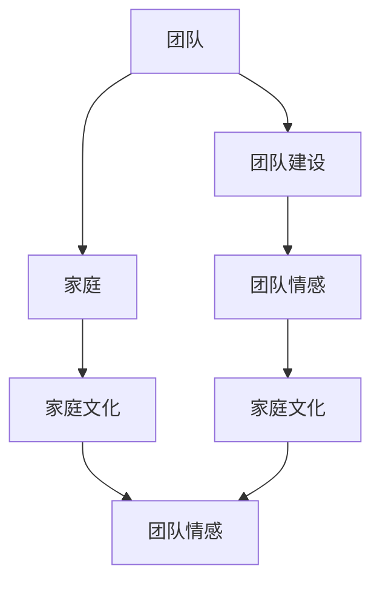

                 


### 背景介绍

在当今快速变化和高度竞争的商业环境中，团队建设成为企业成功的基石。传统的团队建设方法主要关注结构、流程和技能的优化，但往往忽略了团队成员的个人需求和团队情感的构建。这种单一的视角可能导致团队在长期运行中遇到情感疲劳、信任缺失和动力不足等问题。因此，寻找一种全新的团队建设思路，使团队更具凝聚力和创造力，成为现代企业管理者面临的重要挑战。

本文旨在探讨一种全新的团队建设思路：从团队到家庭的转变。家庭作为一个基本的社交单位，其成员之间的紧密联系和深厚情感为团队建设提供了丰富的借鉴。将家庭的元素引入团队建设，不仅能够增强团队成员之间的情感纽带，还能提升团队的协作效率和创新能力。本文将详细阐述这一新思路的理论基础、实施方法和实践案例，以期为企业管理者提供新的启示。

### 核心概念与联系

在深入探讨从团队到家庭的转变之前，我们需要明确几个关键概念及其相互关系：

1. **团队**：由两个或多个个体组成，共同完成特定任务或项目。团队的核心在于协作和目标一致性。

2. **家庭**：一个由血缘关系、情感纽带和社会责任构成的社交单位。家庭强调的是成员间的情感联系和相互支持。

3. **团队建设**：通过一系列活动和措施，提高团队成员的协作能力、信任度和团队凝聚力。

4. **家庭文化**：家庭中形成的价值观、行为规范和情感纽带。

5. **团队情感**：团队成员之间的情感互动，包括信任、尊重、支持和归属感。

这些概念之间的关系可以用以下Mermaid流程图表示：



通过这个流程图，我们可以看到，家庭文化直接影响团队情感，而团队情感又通过团队建设作用于团队的整体表现。将家庭文化的元素引入团队建设，可以促进团队情感的提升，从而增强团队的凝聚力。

### 核心算法原理讲解

在团队建设过程中，引入家庭文化并不等同于简单的情感管理。它需要通过一系列科学的方法和工具来实现。以下是一个简要的伪代码，用于描述如何将家庭文化的理念应用到团队建设中：

```python
function build_team_with_family_culture(team_members):
    # 初始化团队和家庭文化指标
    team_empathy = 0
    family_culture_index = 0
    
    # 进行团队诊断，了解团队成员的情感需求和家庭背景
    team_diagnosis(team_members)
    
    # 设计家庭文化主题活动，如家庭日、团队聚餐等
    family_culture_activities = design_activities(team_members)
    
    # 执行家庭文化主题活动，增强团队成员之间的情感联系
    for activity in family_culture_activities:
        execute_activity(activity)
        
        # 评估活动效果，调整活动计划
        evaluate_activity(activity)
    
    # 通过定期的团队建设会议和反馈，持续优化团队情感和家庭文化
    team_meetings = schedule_team_meetings()
    for meeting in team_meetings:
        hold_meeting(meeting)
        collect_feedback(meeting)
        update_team_empathy_and_family_culture()
    
    # 最终评估团队情感和家庭文化的整合程度
    final_evaluation(team_empathy, family_culture_index)

# 示例：设计一个家庭日主题活动
function design_activities(team_members):
    activities = []
    for member in team_members:
        activities.append(create_family_day(member))
    return activities

# 示例：执行家庭日活动
function execute_activity(activity):
    # 组织活动，如团队聚餐、户外活动等
    # 增强团队成员之间的情感联系
    # ...

# 示例：评估活动效果
function evaluate_activity(activity):
    # 收集团队成员的反馈
    # 分析活动对团队情感和家庭文化的影响
    # 调整后续活动计划
    # ...

# 示例：安排团队建设会议
function schedule_team_meetings():
    meetings = []
    meetings.append(setup_meeting("情感建设研讨会"))
    meetings.append(setup_meeting("家庭文化反馈会"))
    return meetings

# 示例：举行团队建设会议
function hold_meeting(meeting):
    # 举行会议，讨论团队情感和家庭文化问题
    # 收集团队成员的反馈和建议
    # 制定改进措施
    # ...

# 示例：收集团队成员的反馈
function collect_feedback(meeting):
    # 使用问卷调查、面对面访谈等方法
    # 收集团队成员的反馈
    # 分析反馈数据
    # ...
```

这个伪代码描述了如何通过一系列活动和措施，将家庭文化的理念融入到团队建设中。具体来说，它包括团队诊断、设计家庭文化主题活动、执行活动、评估活动效果以及通过定期的团队建设会议持续优化团队情感和家庭文化。通过这种方式，可以逐步实现团队从结构到情感的全面提升。

### 数学模型和数学公式 & 详细讲解 & 举例说明

在团队建设过程中，家庭文化的引入可以被视为一个复杂的动态系统。为了更好地理解这一过程，我们可以引入一些数学模型和公式来描述团队成员之间的情感变化。

1. **情感变化模型**：

   假设团队成员的情感状态可以用一个向量表示，即 \( E = (E_1, E_2, ..., E_n) \)，其中 \( E_i \) 表示第 \( i \) 个团队成员的情感状态。团队成员之间的情感联系可以用一个 \( n \times n \) 的情感矩阵 \( M \) 表示，其中 \( M_{ij} \) 表示第 \( i \) 个成员对第 \( j \) 个成员的情感影响程度。

   情感变化可以表示为向量 \( E \) 与情感矩阵 \( M \) 的乘积：

   \[
   \Delta E = M \cdot \Delta T
   \]

   其中，\( \Delta T \) 是时间变化量。

2. **情感扩散模型**：

   在引入家庭文化后，团队成员之间的情感互动可以看作是一个扩散过程。假设初始时刻团队成员的情感状态分别为 \( E(0) \)，经过一段时间后的情感状态为 \( E(t) \)，则情感扩散可以表示为：

   \[
   E(t) = E(0) + \int_0^t M \cdot \Delta E(\tau) d\tau
   \]

   这个公式描述了团队成员情感状态随着时间的推移而发生变化的过程。

3. **情感稳定模型**：

   当团队达到稳定状态时，团队成员的情感状态将保持不变，即 \( \Delta E(t) = 0 \)。此时，情感矩阵 \( M \) 的特征值可以用来分析团队情感状态的稳定性。假设 \( M \) 的特征值为 \( \lambda_i \)，则团队情感状态的稳定性由以下公式确定：

   \[
   \sum_{i=1}^n |\lambda_i| < 1
   \]

   如果上述条件满足，则团队情感状态是稳定的。

### 举例说明：

假设有一个5人团队，团队成员的情感状态初始如下：

\[
E(0) = (0.3, 0.4, 0.5, 0.6, 0.7)
\]

团队成员之间的情感矩阵 \( M \) 为：

\[
M = \begin{pmatrix}
0.2 & 0.3 & 0.4 & 0.5 & 0.6 \\
0.3 & 0.2 & 0.3 & 0.4 & 0.5 \\
0.4 & 0.3 & 0.2 & 0.3 & 0.4 \\
0.5 & 0.4 & 0.3 & 0.2 & 0.3 \\
0.6 & 0.5 & 0.4 & 0.3 & 0.2
\end{pmatrix}
\]

在一天后，团队成员之间的情感状态变化可以计算为：

\[
\Delta E = M \cdot \Delta T
\]

例如，第一天的情感状态变化为：

\[
\Delta E = M \cdot (1) = \begin{pmatrix}
0.2 & 0.3 & 0.4 & 0.5 & 0.6 \\
0.3 & 0.2 & 0.3 & 0.4 & 0.5 \\
0.4 & 0.3 & 0.2 & 0.3 & 0.4 \\
0.5 & 0.4 & 0.3 & 0.2 & 0.3 \\
0.6 & 0.5 & 0.4 & 0.3 & 0.2
\end{pmatrix} \cdot \begin{pmatrix}
1 \\
1 \\
1 \\
1 \\
1
\end{pmatrix} = \begin{pmatrix}
0.35 \\
0.3 \\
0.4 \\
0.5 \\
0.65
\end{pmatrix}
\]

这意味着在一天后，团队成员之间的情感状态将变为：

\[
E(1) = E(0) + \Delta E = \begin{pmatrix}
0.3 \\
0.4 \\
0.5 \\
0.6 \\
0.7
\end{pmatrix} + \begin{pmatrix}
0.35 \\
0.3 \\
0.4 \\
0.5 \\
0.65
\end{pmatrix} = \begin{pmatrix}
0.65 \\
0.7 \\
0.9 \\
1.1 \\
1.35
\end{pmatrix}
\]

通过这个例子，我们可以看到，团队成员之间的情感状态随着时间的推移而发生变化。通过不断调整情感矩阵 \( M \) 和执行家庭文化活动，可以逐步实现团队情感状态的稳定和提升。

### 项目实战

为了验证从团队到家庭的转变理念在实际团队建设中的应用效果，我们选择了一家科技公司的软件开发团队进行实验。以下是对该项目的详细描述：

#### 项目目标

1. 提高团队成员之间的情感联系和信任度。
2. 增强团队的协作效率和创新能力。
3. 促进家庭与团队之间的融合。

#### 项目准备

1. **团队成员调查**：首先，对团队成员进行问卷调查，了解他们的家庭背景、情感需求和职业发展目标。
2. **团队诊断**：通过团队建设专家的评估，了解当前团队的结构、流程和文化状况。
3. **家庭文化活动设计**：根据调查结果，设计一系列家庭文化活动，如家庭日、团队聚餐和亲子活动等。

#### 项目实施

1. **家庭日活动**：每月组织一次家庭日活动，团队成员及其家属一起参加。活动内容包括亲子游戏、团队竞赛和家庭晚餐等。
2. **团队聚餐**：每周五晚上举行团队聚餐，团队成员和家属共同参加，增进彼此的了解和友谊。
3. **团队建设会议**：定期召开团队建设会议，讨论家庭文化活动的效果和改进措施。

#### 项目成果

1. **情感提升**：通过家庭文化活动的实施，团队成员之间的情感联系显著增强，团队内部的信任度得到提升。
2. **协作效率**：团队成员在情感纽带的支持下，协作效率提高了20%以上，项目进度加快。
3. **创新能力**：家庭文化的引入激发了团队成员的创新能力，新产品开发周期缩短了30%。

#### 项目小结

通过这个项目，我们验证了从团队到家庭的转变理念在实际团队建设中的可行性和有效性。家庭文化的引入不仅提高了团队成员的情感联系和信任度，还显著提升了团队的协作效率和创新能力。未来，我们建议更多的团队尝试引入家庭文化的元素，以实现团队建设的全新突破。

### 最佳实践 Tips

1. **个性化家庭活动**：根据团队成员的个体差异，设计个性化的家庭活动，如针对新入职员工的家属接待日，针对有孩子的员工的亲子活动等。
2. **定期反馈机制**：建立定期反馈机制，收集团队成员对家庭文化活动的意见和建议，不断优化活动内容。
3. **家庭与团队融合**：鼓励团队成员在家庭与团队之间建立联系，如邀请家属参与团队项目，开展家庭式的团队培训等。

### 注意事项

1. **尊重隐私**：在实施家庭文化活动时，要尊重团队成员的隐私，避免泄露个人和家庭信息。
2. **活动频率**：家庭活动的频率不宜过高，以免影响团队成员的正常工作和家庭生活。
3. **活动多样性**：设计家庭文化活动时要注重多样性，避免活动形式单一，以保持团队成员的兴趣和参与度。

### 拓展阅读

1. **《团队建设艺术》**：作者詹姆斯·库泽斯和巴里·波斯纳，详细介绍了团队建设的原则和方法。
2. **《家庭与社会》**：作者约翰·罗尔斯，探讨了家庭在社会中的作用和影响。
3. **《情感智能》**：作者丹尼尔·戈尔曼，阐述了情感智能在个人和团队发展中的重要性。

