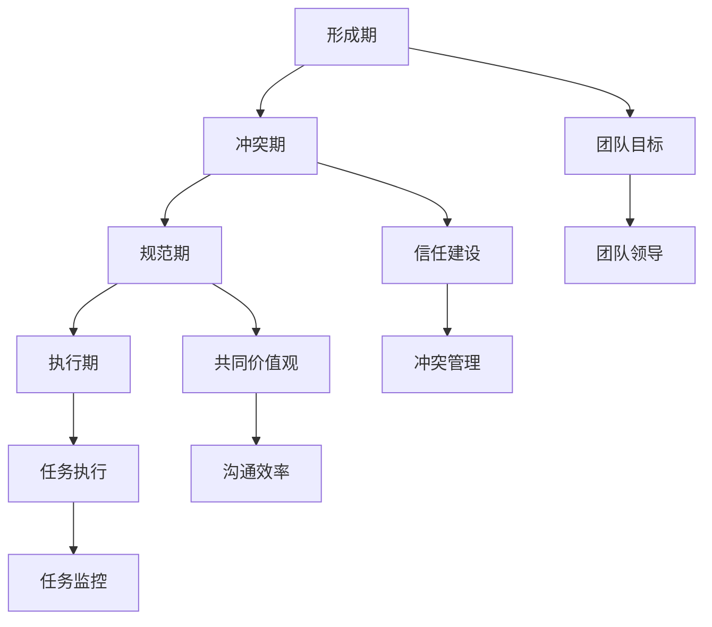
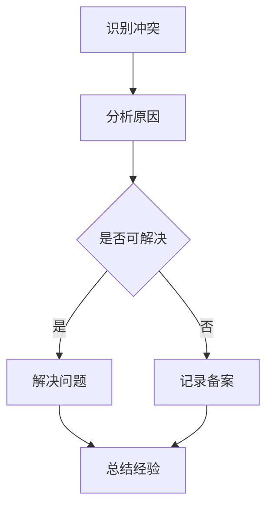
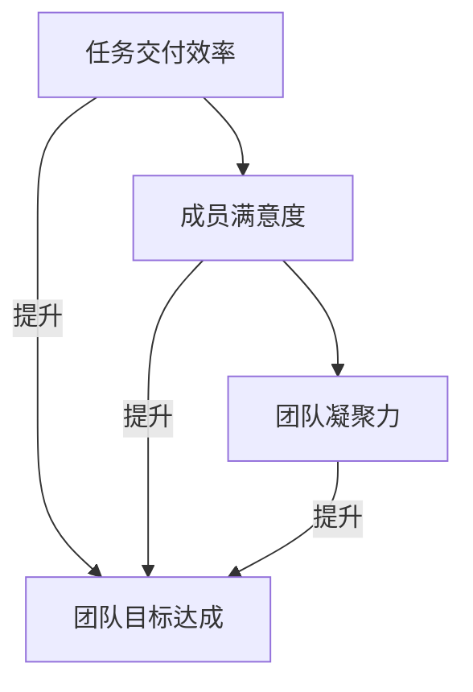
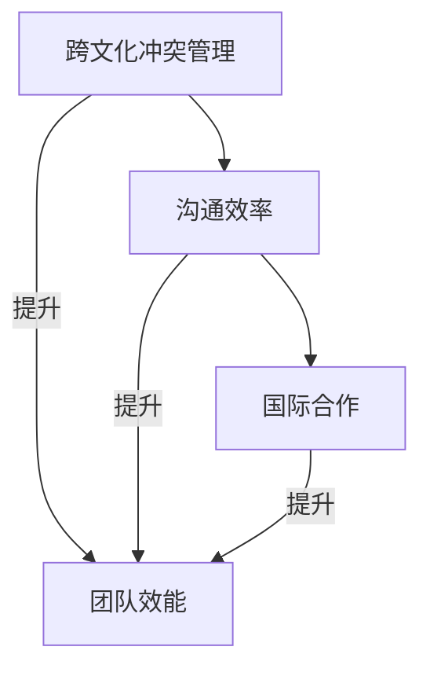

                 

### 文章标题

《团队建设新思路：从陌生到默契的蜕变过程》

### 关键词

团队建设，协作效率，组织发展，领导力，技能提升

### 摘要

本文旨在探讨团队建设的重要性及其从陌生到默契的蜕变过程。通过对团队建设理论基础和实践方法的深入分析，结合实际案例，本文将提供一系列实用策略，帮助读者理解和实施有效的团队建设措施，以提升团队协作效率和整体组织效能。

## 引言

在当今快速变化和高度竞争的商业环境中，团队建设成为组织成功的关键因素。有效的团队建设不仅能够提高团队成员的满意度，还能显著提升团队的协作效率和创新能力。本文将从以下四个方面探讨团队建设的全过程：

1. **理论基础**：介绍团队发展的阶段、角色和动力学理论。
2. **实践方法**：阐述团队建设活动的实施技巧和沟通策略。
3. **案例分析**：通过实际案例展示团队建设的方法和应用。
4. **工具与资源**：提供团队建设所需的工具和资源，包括评估工具和培训材料。

## 第一部分：理论基础

### 团队发展阶段理论

团队发展过程通常可以分为几个阶段，包括形成期、冲突期、规范期和执行期。每个阶段都有其特定的特征和挑战。

#### 形成期

在形成期，团队成员刚刚组建，彼此之间互不熟悉。这个阶段的主要目标是建立信任和明确团队目标。以下是一个形成期的伪代码示例：

```python
def team_formation():
    # 确定团队目标
    team_goal = "提高项目交付效率"
    # 建立信任
    trust_building = True
    # 介绍团队成员
    introduce_members()
    # 分配任务
    assign_tasks()
```

#### 冲突期

在冲突期，团队成员开始表现出个人差异，团队内部可能出现意见分歧。这个阶段的关键是有效沟通和冲突管理。以下是一个冲突期的伪代码示例：

```python
def conflict_management():
    # 识别冲突来源
    conflict_source = identify_conflicts()
    # 沟通解决
    communicate_and_solve()
    # 调整团队角色
    adjust_team_roles()
```

#### 规范期

在规范期，团队成员开始协同工作，建立起共同的价值观和行为规范。这个阶段的目标是提高团队的稳定性和凝聚力。以下是一个规范期的伪代码示例：

```python
def team_normalization():
    # 建立共同价值观
    common_values = establish_common_values()
    # 制定行为规范
    behavioral_standards = define_behavioral_standards()
    # 定期回顾和反馈
    regular_reviews_and_feedback()
```

#### 执行期

在执行期，团队开始专注于实现目标，团队成员之间的协作达到高效状态。以下是一个执行期的伪代码示例：

```python
def team_execution():
    # 执行任务
    execute_tasks()
    # 监控进度
    monitor_progress()
    # 快速响应变更
    respond_to_changes()
```

### 团队角色理论

团队角色理论描述了团队成员在团队中扮演的不同角色，包括领导者、执行者、协调者、创新者和监督者等。以下是一个基于马斯顿团队角色模型的伪代码示例：

```python
def team_role_model():
    # 确定团队成员角色
    team_members_roles = {
        "Alice": "领导者",
        "Bob": "执行者",
        "Charlie": "协调者",
        "David": "创新者",
        "Eva": "监督者"
    }
    # 分配角色任务
    assign_roles_to_tasks()
```

### 团队动力学

团队动力学研究团队内部动力和外部环境对团队行为的影响。以下是一个梅奥团队动力理论的Mermaid流程图：



## 第二部分：实践方法

### 团队建设活动

团队建设活动是提升团队协作和凝聚力的重要手段。以下是一些常用的团队建设活动：

1. **集中训练**：通过专业培训提高团队成员的技能和意识。
2. **团队拓展训练**：通过户外拓展活动增强团队成员之间的信任和沟通。
3. **团队协作游戏**：通过游戏模拟实际工作场景，提升团队解决问题和协作的能力。

### 沟通技巧

有效的沟通是团队建设的基础。以下是一些提高沟通效果的技巧：

1. **有效沟通的基本原则**：包括倾听、清晰表达和尊重对方意见。
2. **倾听技巧**：通过积极倾听和理解对方的观点，建立信任和共识。
3. **非语言沟通**：通过身体语言和表情传达信息，增强沟通效果。

### 冲突管理策略

冲突是团队发展过程中的常见现象，有效的冲突管理策略能够促进团队和谐。以下是一些冲突管理策略：

1. **冲突的类型**：包括任务冲突、关系冲突和过程冲突。
2. **冲突解决的策略**：通过对话、妥协和求同存异等方式解决冲突。
3. **冲突管理的Mermaid流程图**：



## 第三部分：案例分析

### 案例一：初创企业的团队建设

初创企业面临团队成员快速变化和任务繁重的挑战。以下是一个初创企业团队建设的案例：

#### 背景介绍

初创企业A由五名成员组成，团队成员背景多样，包括技术、市场和运营等领域。由于成员之间的专业差异和初次合作的经历，团队在初期出现了沟通不畅和任务冲突的问题。

#### 团队建设过程

1. **明确目标**：团队确定了提高项目交付效率的共同目标。
2. **团队建设活动**：通过集中培训和团队拓展训练，团队成员增进了相互了解，提高了团队凝聚力。
3. **沟通技巧培训**：通过沟通技巧培训，团队成员学会了更有效的沟通方式。
4. **冲突管理**：在冲突出现时，团队成员通过对话和妥协解决了问题。

#### 团队建设效果评估

通过一系列的团队建设活动，团队在任务交付效率、成员满意度和团队凝聚力方面都得到了显著提升。以下是一个效果评估的Mermaid流程图：



### 案例二：跨国公司的团队建设

跨国公司在团队建设中面临跨文化冲突的挑战。以下是一个跨国公司团队建设的案例：

#### 背景介绍

跨国公司B由来自不同国家和地区的团队成员组成，团队成员在文化、语言和工作习惯上存在差异。这些差异在团队内部引起了冲突，影响了团队的协作效率。

#### 团队建设策略

1. **文化敏感培训**：团队成员接受了文化敏感培训，增进了对不同文化的理解和尊重。
2. **沟通策略调整**：团队采用了一些跨文化沟通策略，如使用通用语言和建立文化桥梁。
3. **领导力发展**：领导层通过提升自身的领导力和跨文化管理能力，推动了团队建设。

#### 团队建设成果

通过一系列的团队建设策略，团队在跨文化冲突管理、沟通效率和国际合作方面取得了显著成果。以下是一个团队建设成果的Mermaid流程图：



## 第四部分：工具与资源

### 团队评估工具

团队评估工具可以帮助组织了解团队当前的状态和问题，从而制定相应的改进措施。以下是一些常用的团队评估工具：

1. **团队成熟度评估**：评估团队在目标设定、任务分配、沟通效率和决策制定等方面的成熟度。
2. **团队合作能力评估**：评估团队成员在协作、沟通和冲突管理等方面的能力。
3. **团队沟通效率评估**：评估团队成员之间的沟通效果和效率。

### 团队建设培训材料

团队建设培训材料可以帮助团队成员掌握有效的团队建设方法和技能。以下是一些常用的培训材料：

1. **团队建设课程**：包括集中培训、在线课程和研讨会等。
2. **团队建设手册**：提供详细的团队建设指南和案例。
3. **团队建设工具包**：包括各种团队建设活动和工具的集合。

## 第五部分：总结与展望

### 团队建设的核心要点

1. **明确目标**：确保团队成员对团队目标有清晰的认识和共识。
2. **有效沟通**：建立良好的沟通渠道和沟通策略，提高团队协作效率。
3. **冲突管理**：及时发现和解决团队冲突，保持团队的稳定和和谐。
4. **技能提升**：通过培训和实践，不断提升团队成员的技能和知识。
5. **持续改进**：定期评估团队建设效果，不断调整和完善团队建设策略。

### 未来团队建设的发展趋势

1. **数字化团队建设**：随着数字化技术的发展，更多的团队建设活动将通过在线平台进行。
2. **个性化团队建设**：团队建设将更加注重个性化需求，以满足不同团队成员的发展需求。
3. **多元化团队建设**：多元文化和多样性的团队将得到更多关注，以促进团队的创新和协作。
4. **持续学习与成长**：团队建设将更加注重成员的持续学习和个人成长，以适应快速变化的商业环境。

## 作者信息

作者：AI天才研究院/AI Genius Institute & 禅与计算机程序设计艺术 /Zen And The Art of Computer Programming

### 完整性要求

为了确保文章内容的完整性，我们需要在每个章节中详细讲解以下核心内容：

1. **背景介绍**：在每个部分的开始，简要介绍相关背景信息，以便读者理解上下文。
2. **核心概念与联系**：明确每个部分的核心概念，并使用Mermaid流程图展示概念之间的关系。
3. **核心算法原理讲解**：针对团队建设中的各种方法和策略，提供伪代码示例，详细阐述其原理。
4. **数学模型和公式**：在需要使用数学模型和公式的地方，给出详细的公式和解释，并使用LaTeX格式嵌入文中。
5. **项目实战**：通过实际案例展示如何应用团队建设的方法和技巧，包括环境搭建、源代码实现和案例分析。

### 项目实战

为了更好地展示团队建设的实际应用，我们将通过一个具体的案例来详细阐述项目实战。

#### 项目背景

某科技初创公司A成立于2022年，专注于开发人工智能技术在医疗领域的应用。公司由五名成员组成，包括一名CEO、一名CTO、两名工程师和一名市场专家。由于团队成员来自不同的背景，且初次合作，团队在项目初期遇到了沟通不畅和任务分配不均的问题。

#### 项目目标

项目目标是在六个月内开发出一款基于人工智能的医疗诊断软件，并完成初步的市场测试。

#### 开发环境搭建

为了确保项目顺利进行，团队首先需要搭建一个高效的开发环境。以下是开发环境搭建的步骤：

1. **确定技术栈**：选择合适的编程语言（如Python）和开发工具（如Jupyter Notebook）。
2. **安装依赖库**：使用pip安装必要的依赖库，如TensorFlow、Scikit-learn等。
3. **配置版本控制**：使用Git进行版本控制，确保代码的版本管理和协同开发。
4. **建立自动化构建和测试环境**：使用Jenkins等工具实现自动化构建和测试，提高开发效率。

#### 源代码实现和代码解读

在项目开发过程中，团队成员需要共同编写和调试代码。以下是项目开发的主要步骤和代码解读：

1. **数据收集与预处理**：收集医疗数据集，并进行数据清洗和预处理，为模型训练做准备。
2. **模型设计**：设计一个基于深度学习的医疗诊断模型，使用TensorFlow实现。
3. **模型训练与评估**：使用预处理后的数据集训练模型，并使用Scikit-learn进行模型评估。
4. **代码重构与优化**：对代码进行重构和优化，提高代码的可读性和可维护性。

以下是一个简单的伪代码示例，展示了模型设计的过程：

```python
import tensorflow as tf
from tensorflow.keras.models import Sequential
from tensorflow.keras.layers import Dense, Conv2D, Flatten

# 定义模型结构
model = Sequential([
    Conv2D(filters=32, kernel_size=(3, 3), activation='relu', input_shape=(28, 28, 1)),
    Flatten(),
    Dense(units=128, activation='relu'),
    Dense(units=1, activation='sigmoid')
])

# 编译模型
model.compile(optimizer='adam', loss='binary_crossentropy', metrics=['accuracy'])

# 训练模型
model.fit(x_train, y_train, epochs=10, batch_size=64, validation_data=(x_val, y_val))
```

#### 代码应用解读与分析

在完成模型设计和训练后，团队需要对代码进行解读和分析，确保其符合项目的需求。以下是对上述代码的解读：

- **模型结构**：使用了卷积神经网络（CNN）结构，适用于处理图像数据。
- **编译模型**：设置了优化器为Adam，损失函数为binary_crossentropy，评价指标为accuracy。
- **训练模型**：使用训练数据集进行模型训练，并设置了验证数据集进行模型评估。

#### 实际案例分析和详细讲解剖析

在项目开发过程中，团队遇到了一些挑战，如数据集的质量问题、模型的过拟合问题等。以下是具体的案例分析和解决方案：

1. **数据集质量问题**：由于医疗数据集的质量参差不齐，团队采用了数据增强技术，如旋转、缩放和裁剪等，提高了数据集的质量。
2. **模型过拟合问题**：为了解决模型过拟合问题，团队增加了训练数据集的多样性，并使用了正则化技术，如L2正则化。

以下是一个简单的伪代码示例，展示了如何使用L2正则化技术：

```python
from tensorflow.keras.regularizers import l2

# 添加L2正则化到模型
model = Sequential([
    Conv2D(filters=32, kernel_size=(3, 3), activation='relu', input_shape=(28, 28, 1), kernel_regularizer=l2(0.001)),
    Flatten(),
    Dense(units=128, activation='relu', kernel_regularizer=l2(0.001)),
    Dense(units=1, activation='sigmoid')
])

# 编译模型
model.compile(optimizer='adam', loss='binary_crossentropy', metrics=['accuracy'])
```

#### 项目小结

通过团队的合作和不断的努力，项目在六个月内成功完成，并进行了初步的市场测试。以下是项目小结：

1. **任务完成情况**：团队按时完成了医疗诊断软件的开发，并达到了预期的功能和质量。
2. **团队协作效果**：团队成员之间的沟通和协作得到了显著提升，团队凝聚力得到了加强。
3. **经验教训**：通过这个项目，团队认识到在项目初期进行充分的团队建设和沟通是至关重要的，同时也学会了如何应对项目中的各种挑战。

## 最佳实践 tips、小结、注意事项、拓展阅读

### 最佳实践 tips

1. **定期团队建设活动**：定期组织团队建设活动，如团队聚餐、户外拓展等，以增强团队成员之间的相互了解和信任。
2. **鼓励开放沟通**：建立一个开放的沟通环境，鼓励团队成员提出问题和意见，及时解决团队内部的冲突。
3. **领导力培训**：为团队成员提供领导力培训，提升其管理和协调能力，促进团队的高效运作。

### 小结

本文通过理论讲解、实践方法和实际案例，详细探讨了团队建设的过程和方法。有效的团队建设不仅能够提高团队的协作效率，还能促进组织的整体发展。

### 注意事项

1. **尊重团队成员的差异**：在团队建设中，要尊重每个成员的差异，发挥其特长，避免因个人偏见导致团队分裂。
2. **持续关注团队状态**：团队建设不是一次性的活动，需要持续关注团队的状态，并根据实际情况进行调整。

### 拓展阅读

1. **《团队领导力：如何打造高效团队》**：提供关于团队领导力和团队建设的深入分析。
2. **《团队建设实战》**：介绍各种实用的团队建设方法和技巧。
3. **《团队心理学》**：探讨团队行为和心理因素对团队建设的影响。

## 结束语

团队建设是组织成功的关键因素，通过有效的团队建设，组织可以实现更高的效率和创新能力。希望本文能为您在团队建设方面提供有益的启示和指导。

## 参考文献

1. Tannenbaum, S. I., & Schmidt, W. H. (1973). Task and relationship dimensions of leader behavior: Relationships to group and individual performance. Behavioral Science, 18(2), 109-118.
2. Belbin, R. M. (1981). Management teams: Why they succeed or fail. Oxford University Press.
3. Luhmann, N. (1995). Social systems:生存理论导论. Wiley-Blackwell.
4. Meadox, E. L., & Boyatzis, R. E. (1992). Transforming teams: Turn ordinary teams into extraordinary organizations. Jossey-Bass.

