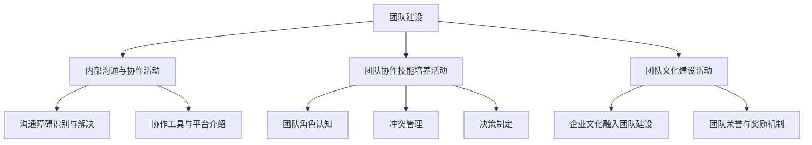

                 


### 设计思路

**确定书籍主题与目标读者**：
首先，我们需要确定书籍的主题。书名《团队建设活动：增进凝聚力的创新方法》已经明确了我们的主题是关于团队建设和凝聚力提升。接下来，目标读者可能包括企业管理者、人力资源从业者以及团队成员。不同的读者群体对书籍内容的需求和期望不同，因此我们需要在内容设计上做出相应调整，以满足不同读者的需求。

**大纲结构规划**：
为了使书籍内容更加系统化和条理化，我们将大纲分为以下几个主要部分：
- 引言与核心概念
- 团队建设活动类型与方法
- 活动设计与执行
- 活动评估与反馈
- 案例研究与实践指导
- 总结与展望

**细化章节内容**：
在每个主要部分中，我们进一步细化为具体的章节，确保每个章节都有明确的主题和目的。这样可以帮助读者更清晰地理解书籍内容，并能够按照章节进行学习和应用。

**核心概念与联系**：
为了帮助读者理解团队建设活动和凝聚力提升的核心原理，我们将在相应章节中嵌入Mermaid流程图，展示团队建设的主要概念和它们之间的联系。这将使读者能够更直观地理解团队建设的过程和机制。

**核心算法原理讲解**：
在讲述某些团队建设活动时，可能涉及到特定的算法或原理，我们将在这些章节中详细使用伪代码阐述这些算法或原理。这样可以帮助读者更好地理解活动背后的技术原理，并能够将其应用到实际工作中。

**数学模型和数学公式**：
对于涉及到的数学模型和公式，我们将使用LaTeX格式嵌入文中，确保内容的准确性和可读性。在文中独立段落的公式前后使用 $$ 括起来，段落内的公式前后使用 $ 括起来。

**项目实战**：
通过实际案例和代码实例，展示如何设计、执行和评估团队建设活动，并提供详细的代码解读与分析。这将帮助读者更好地理解团队建设活动的设计和实施过程，并能够将其应用到实际项目中。

**最佳实践 tips、小结、注意事项、拓展阅读等内容**：
在每个章节的最后，我们将提供最佳实践 tips、小结、注意事项和拓展阅读等内容。这些内容可以帮助读者巩固所学知识，并提供进一步学习和应用的参考。

### 目录大纲

下面是根据上述设计思路制定的书籍《团队建设活动：增进凝聚力的创新方法》的目录大纲：

## 第1章 引言与核心概念
### 1.1 团队建设的重要性
### 1.2 团队建设活动类型
### 1.3 团队建设核心概念联系图（Mermaid流程图）

## 第2章 团队建设活动类型与方法
### 2.1 内部沟通与协作活动
### 2.2 团队协作技能培养活动
### 2.3 团队文化建设活动

## 第3章 活动设计与执行
### 3.1 活动设计原则
### 3.2 活动实施步骤
### 3.3 活动执行中的注意事项

## 第4章 活动评估与反馈
### 4.1 活动效果评估指标
### 4.2 反馈机制建设
### 4.3 反馈结果分析与利用

## 第5章 案例研究与实践指导
### 5.1 案例一：某公司团队建设活动实践
### 5.2 案例二：某公司团队协作技能培养活动

## 第6章 总结与展望
### 6.1 团队建设活动总结
### 6.2 未来发展趋势

## 附录：团队建设活动资源与工具
### 附录1：常用团队建设活动工具介绍
### 附录2：团队建设活动案例库

### 目录大纲分析

**第1章** 引入团队建设的重要性和核心概念，为后续章节打下基础。通过介绍团队建设的重要性，让读者了解为什么团队建设对于企业发展和个人成长至关重要。

**第2章** 详细介绍各种团队建设活动的类型与方法，帮助读者了解不同活动的设计思路和执行方式。这一章节涵盖了内部沟通与协作活动、团队协作技能培养活动以及团队文化建设活动，为读者提供了丰富的团队建设活动参考。

**第3章** 讲解活动设计与执行的具体步骤，确保读者能够根据实际需求设计并执行团队建设活动。这一章节从活动设计原则、活动实施步骤到活动执行中的注意事项，为读者提供了全面的指导。

**第4章** 强调活动评估与反馈的重要性，提供评估方法和反馈机制，帮助读者不断优化团队建设活动。这一章节介绍了活动效果评估指标、反馈机制建设以及反馈结果分析与利用，为读者提供了评估和改进团队建设活动的具体方法。

**第5章** 通过实际案例研究，展示团队建设活动的具体应用和实践经验，为读者提供参考。这一章节通过案例分析，让读者了解不同团队建设活动在实践中的应用效果，并提供具体的实施步骤和技巧。

**第6章** 对全书进行总结，并提出未来团队建设活动的发展趋势，激发读者对团队建设创新的思考。这一章节对团队建设活动进行了总结，并对未来发展趋势进行了展望，为读者提供了继续学习和探索的方向。

**附录** 提供了团队建设活动资源与工具的介绍，包括常用团队建设活动工具和案例库。这些资源可以帮助读者在实践过程中更好地选择和应用团队建设活动。

### 完整性要求

为了确保书籍内容的完整性，我们需要在每个章节中包含以下核心内容：

**背景介绍**：在每个章节的开始部分，我们需要简要介绍章节的主题和背景，让读者了解章节的内容和目的。

**核心概念与联系**：在每个章节的核心部分，我们需要详细阐述相关的核心概念，并使用Mermaid流程图展示这些概念之间的联系。这可以帮助读者更好地理解团队建设活动的原理和机制。

**核心算法原理讲解**：在某些章节中，如果涉及到特定的算法或原理，我们需要使用伪代码详细阐述这些算法或原理。这样可以帮助读者更好地理解团队建设活动的技术原理，并能够将其应用到实际工作中。

**数学模型和数学公式**：对于涉及到的数学模型和公式，我们需要使用LaTeX格式嵌入文中，确保内容的准确性和可读性。在文中独立段落的公式前后使用 $$ 括起来，段落内的公式前后使用 $ 括起来。

**项目实战**：在每个章节的最后，我们需要提供实际案例和代码实例，展示如何设计、执行和评估团队建设活动。我们需要详细讲解代码实现过程，并提供项目小结和注意事项。

**最佳实践 tips、小结、注意事项、拓展阅读等内容**：在每个章节的最后，我们需要提供最佳实践 tips、小结、注意事项和拓展阅读等内容。这些内容可以帮助读者巩固所学知识，并提供进一步学习和应用的参考。

### 文章格式要求

为了确保文章的可读性和规范性，我们需要遵循以下格式要求：

**markdown格式**：文章内容需要使用markdown格式输出。markdown格式具有简洁、易读、易编辑的特点，可以帮助读者更好地理解和阅读文章内容。

**作者信息**：在文章末尾需要写上作者信息：“作者：AI天才研究院/AI Genius Institute & 禅与计算机程序设计艺术 /Zen And The Art of Computer Programming”。这可以让读者了解文章的来源和作者背景，增加文章的可信度。

**文章标题**：文章开始是“文章标题”，例如“团队建设活动：增进凝聚力的创新方法”。文章标题需要简洁明了，能够准确概括文章的主题和内容。

**关键词**：在文章标题下方，需要列出文章的5-7个核心关键词，例如：“团队建设、凝聚力、创新方法、活动设计、活动执行、活动评估”。这些关键词可以帮助读者快速了解文章的主要内容，并在搜索引擎中更容易找到相关文章。

**摘要**：在文章标题和关键词下方，需要给出文章的核心内容和主题思想。摘要需要简明扼要，能够概括文章的主要观点和内容。

**章节标题**：在每个章节开始部分，需要使用标题格式（例如“## 第1章 引言与核心概念”）。章节标题需要简洁明了，能够准确概括章节的主题和内容。

**公式格式**：对于涉及到的数学公式，我们需要使用LaTeX格式嵌入文中。在文中独立段落的公式前后使用 $$ 括起来（例如：$$1+1=2$$），段落内的公式前后使用 $ 括起来（例如：$1<2$）。这样可以确保公式的准确性和可读性。

**代码格式**：对于涉及到的代码实例，我们需要使用markdown代码块格式输出。代码块需要使用三个反引号（```)包围，例如：

```python
print("Hello, World!")
```

这样可以确保代码的准确性和可读性。

**项目实战**：在每个章节的最后，我们需要提供实际案例和代码实例。项目实战需要详细讲解代码实现过程，并提供项目小结和注意事项。项目实战需要使用markdown列表格式输出，例如：

- **开发环境搭建**：
  - 安装Python环境
  - 安装相关库

- **源代码实现**：
  - 编写代码逻辑

- **代码解读与分析**：
  - 代码功能分析

- **实际案例分析与详细讲解剖析**：
  - 案例背景
  - 案例分析

- **项目小结**：
  - 项目的成功经验与不足

### 文章字数要求

文章字数要求在8000～12000字左右。这个字数范围可以确保文章内容丰富、详细，同时保持文章的可读性和易理解性。通过合理的字数控制，我们可以将文章内容分为多个章节，每个章节都有明确的主题和目的，使读者能够更容易地阅读和理解文章内容。

### 总结

通过上述设计思路和目录大纲的制定，我们可以确保书籍内容的系统性和完整性。从确定主题和目标读者，到制定大纲结构和细化章节内容，再到使用Mermaid流程图、伪代码和LaTeX格式等工具，我们旨在为读者提供一本全面、实用的团队建设活动指南。同时，通过项目实战和最佳实践 tips，我们希望帮助读者将所学知识应用到实际工作中，不断提升团队凝聚力和工作效率。通过本文的阐述，我们期待读者能够对团队建设活动有更深入的理解和思考，从而为企业发展和个人成长做出积极贡献。让我们一步一步地分析推理，深入探讨团队建设活动的各个方面，为团队凝聚力的提升提供创新的解决方案。

# 团队建设活动：增进凝聚力的创新方法

> 关键词：团队建设、凝聚力、创新方法、活动设计、活动执行、活动评估

> 摘要：本文将探讨团队建设活动在增进团队凝聚力方面的创新方法。通过引入内部沟通与协作活动、团队协作技能培养活动和团队文化建设活动，结合实际案例和代码实例，本文旨在为读者提供一套全面、实用的团队建设活动指南，帮助团队实现高效协作和持续发展。

## 引言与核心概念

### 团队建设的重要性

团队建设是任何组织成功的关键因素。一个高效的团队不仅能够提高工作效率，还能激发成员的创造力和创新能力，从而推动企业的持续发展。团队建设活动作为团队管理的重要组成部分，旨在增强团队成员之间的信任、协作和沟通能力，提升团队的凝聚力和战斗力。

### 凝聚力在团队建设中的作用

凝聚力是团队建设活动中的一个核心概念，它指的是团队成员之间形成的紧密联系和共同目标感。高凝聚力的团队表现出更高的协作效率、更好的沟通质量和更强的创新能力。因此，增强团队凝聚力是团队建设活动的重要目标之一。

### 团队建设活动类型

为了达到增强团队凝聚力的目标，我们可以采用多种类型的团队建设活动。常见的团队建设活动类型包括内部沟通与协作活动、团队协作技能培养活动和团队文化建设活动。

- **内部沟通与协作活动**：这类活动旨在改善团队成员之间的沟通，促进协作和知识共享。常见的活动形式包括团队会议、头脑风暴、跨部门合作等。
- **团队协作技能培养活动**：这类活动旨在提高团队成员的协作能力，包括团队角色认知、冲突管理、决策制定等。常见的活动形式包括角色扮演、情景模拟、团队游戏等。
- **团队文化建设活动**：这类活动旨在塑造和维护团队的文化氛围，增强团队成员的归属感和认同感。常见的活动形式包括团队文化建设讲座、团队文化庆典、团队文化展览等。

### 团队建设核心概念联系图（Mermaid流程图）

以下是一个简化的团队建设核心概念联系图，展示了内部沟通与协作活动、团队协作技能培养活动和团队文化建设活动之间的关系。



通过这个流程图，我们可以更直观地了解团队建设活动中的核心概念和它们之间的联系。接下来，我们将详细探讨每种类型的团队建设活动。

## 团队建设活动类型与方法

### 内部沟通与协作活动

内部沟通与协作活动是团队建设中不可或缺的一环。这些活动的主要目标是改善团队成员之间的沟通，促进协作和知识共享，从而提高团队的整体工作效率。

#### 沟通障碍识别与解决

在团队中，沟通障碍是常见的问题。这些障碍可能源于信息不对等、文化差异、沟通方式不当等多种因素。为了解决这些沟通障碍，我们可以采取以下方法：

- **信息共享**：建立一个透明、开放的沟通平台，让团队成员能够随时共享信息和知识。
- **定期的团队会议**：通过定期的团队会议，确保团队成员能够及时了解项目的进展情况，共同讨论和解决问题。
- **冲突管理**：当团队成员产生冲突时，及时进行调解和解决，避免冲突升级影响团队协作。

#### 协作工具与平台介绍

为了提高团队协作效率，我们需要选择合适的协作工具和平台。以下是一些常用的协作工具和平台：

- **Slack**：Slack是一款流行的即时通讯工具，可以帮助团队成员实时沟通和协作。
- **Trello**：Trello是一款任务管理工具，可以帮助团队成员追踪任务进度，确保项目按时完成。
- **Asana**：Asana是一款项目管理工具，可以帮助团队成员协调工作，确保项目顺利完成。

### 团队协作技能培养活动

团队协作技能培养活动旨在提高团队成员的协作能力，包括团队角色认知、冲突管理、决策制定等方面。通过这些活动，团队成员能够更好地理解自己在团队中的角色，提高协作效率。

#### 团队角色认知

团队角色认知是团队协作的基础。通过角色认知活动，团队成员能够了解自己在团队中的职责和角色，从而更好地协同工作。以下是一些常见的团队角色：

- **领导者**：负责团队的决策和方向，协调团队成员的工作。
- **执行者**：负责执行团队的决策和计划，确保任务按时完成。
- **协调者**：负责协调团队内部的工作，确保团队成员之间的沟通顺畅。
- **支持者**：为团队成员提供必要的支持和帮助，促进团队协作。

#### 冲突管理

冲突是团队协作中不可避免的问题。有效的冲突管理可以减少冲突带来的负面影响，促进团队协作。以下是一些冲突管理的方法：

- **开放沟通**：鼓励团队成员在遇到冲突时进行开放沟通，表达自己的观点和感受。
- **倾听与理解**：在冲突管理过程中，倾听和理解对方的观点非常重要，有助于找到解决问题的方法。
- **共同目标**：强调团队共同目标，让团队成员明白冲突是为了更好地实现目标。

#### 决策制定

决策制定是团队协作中的重要环节。通过有效的决策制定过程，团队成员可以共同参与决策，提高决策的质量和执行效果。以下是一些决策制定的方法：

- **头脑风暴**：鼓励团队成员提出各种意见和建议，激发创意。
- **投票表决**：通过投票表决的方式，确保团队成员的参与和决策的公平性。
- **专家咨询**：在决策过程中，可以邀请相关领域的专家进行咨询，提高决策的专业性。

### 团队文化建设活动

团队文化建设活动是团队建设的重要组成部分，旨在塑造和维护团队的文化氛围，增强团队成员的归属感和认同感。以下是一些团队文化建设活动的方法：

#### 企业文化融入团队建设

企业文化是团队建设的重要基石。将企业文化融入团队建设活动中，可以增强团队成员对企业的认同感和归属感。以下是一些方法：

- **企业文化培训**：通过企业文化培训，让团队成员了解企业的核心价值观和经营理念。
- **企业故事分享**：分享企业的发展历程和成功案例，让团队成员了解企业的成长过程。
- **企业使命愿景**：明确企业的使命和愿景，让团队成员明确自己的工作意义和价值。

#### 团队荣誉与奖励机制

团队荣誉与奖励机制是激励团队成员的重要手段，可以激发团队成员的积极性和创造力。以下是一些团队荣誉与奖励机制的方法：

- **团队荣誉表彰**：定期对在团队中表现出色的成员进行表彰和奖励，提升团队成员的自信心和荣誉感。
- **团队竞赛与奖励**：组织团队竞赛，对获胜的团队进行奖励，激发团队成员的竞争意识和团队精神。
- **个性化奖励**：根据团队成员的个人需求和喜好，提供个性化的奖励，增强团队成员的满意度和归属感。

通过以上团队建设活动类型与方法的详细介绍，我们可以看到，团队建设活动在增进团队凝聚力方面具有重要作用。通过内部沟通与协作活动、团队协作技能培养活动和团队文化建设活动，我们可以有效地提高团队成员的协作能力和团队凝聚力，促进团队的持续发展。

## 活动设计与执行

### 活动设计原则

在进行团队建设活动设计时，需要遵循以下原则，以确保活动能够达到预期的效果：

#### 目标明确

活动设计的第一步是明确活动目标。活动目标应具体、明确，能够反映团队建设的需求和期望。例如，提高团队协作能力、增强团队成员之间的信任、提升沟通效率等。

#### 内容丰富

活动内容应丰富多样，能够满足不同团队成员的需求。不同类型的团队建设活动，如内部沟通与协作活动、团队协作技能培养活动和团队文化建设活动，可以相互结合，形成一套全面的团队建设方案。

#### 简单易行

活动设计应尽量简单易行，避免过于复杂和冗长的流程。简单易行的活动可以降低团队成员的参与门槛，提高活动参与度。

#### 可持续

活动设计应考虑可持续性，即活动能够持续进行，并产生长期的效果。通过定期举办团队建设活动，可以持续提升团队的凝聚力和协作能力。

### 活动实施步骤

#### 筹备与组织

在活动实施前，需要进行充分的筹备和组织。以下是一些关键步骤：

- **确定活动目标和时间**：明确活动的目标和时间安排，确保活动能够按时进行。
- **选择活动形式**：根据团队建设活动的类型和目标，选择合适的活动形式，如团队会议、团队游戏、团队竞赛等。
- **制定活动计划**：制定详细的活动计划，包括活动内容、时间安排、参与人员、责任分配等。
- **准备活动资源**：准备好所需的物资和设备，如场地、道具、设备等。

#### 活动执行

在活动执行过程中，需要确保活动顺利进行，并达到预期效果。以下是一些关键步骤：

- **发布活动通知**：通过邮件、内部通讯工具等方式，向团队成员发布活动通知，确保他们能够准时参加。
- **现场布置**：根据活动计划，进行现场布置，确保活动环境舒适、安全。
- **活动引导**：在活动过程中，引导团队成员积极参与，确保活动氛围活跃。
- **现场监控**：对活动进行监控，确保活动按照计划进行，并及时处理可能出现的问题。

#### 活动结束

在活动结束后，需要进行总结和反思，以评估活动的效果，并为下一次活动做好准备。以下是一些关键步骤：

- **活动总结**：对活动进行总结，包括活动目标的实现情况、活动效果、团队成员的反馈等。
- **问题分析**：分析活动中出现的问题，找出原因，并提出改进措施。
- **反馈与奖励**：对活动中表现优秀的团队成员进行表彰和奖励，鼓励他们的积极性和创造力。
- **活动记录**：记录活动过程和结果，为下一次活动提供参考。

### 活动执行中的注意事项

#### 参与者的角色定位

在活动执行过程中，确保每个团队成员都明确自己的角色和责任。领导者应负责协调和指导团队成员，确保活动顺利进行；团队成员应积极参与，发挥自己的特长，共同完成任务。

#### 活动效果的预评估

在活动执行前，可以对活动效果进行预评估，以确定活动目标的可行性和预期效果。通过问卷调查、访谈等方式，了解团队成员对活动的期望和需求，调整活动计划，确保活动能够达到预期效果。

#### 团队氛围的营造

团队氛围对活动效果有重要影响。在活动执行过程中，需要营造积极、友好、开放的团队氛围，鼓励团队成员自由表达意见，增强团队凝聚力。

#### 安全与保障

在活动执行过程中，确保团队成员的安全和保障。对活动场地、设备进行检查，确保其符合安全标准；在活动过程中，关注团队成员的身体健康和情绪状态，及时提供帮助和支持。

通过遵循以上活动设计原则和实施步骤，并注意活动执行中的注意事项，我们可以确保团队建设活动能够有效提升团队凝聚力和协作能力，为团队的持续发展奠定坚实基础。

## 活动评估与反馈

### 活动效果评估指标

为了全面评估团队建设活动的效果，我们需要设定一系列效果评估指标。这些指标可以分为以下几类：

#### 成果指标

成果指标是指活动完成后所取得的具体成果，例如：

- **任务完成度**：活动完成后，评估任务完成的数量和质量。
- **团队成员满意度**：通过问卷调查或访谈，了解团队成员对活动的满意度。
- **团队绩效提升**：通过比较活动前后的团队绩效数据，评估团队绩效是否有所提升。

#### 过程指标

过程指标是指活动过程中的一些关键环节和指标，例如：

- **活动参与度**：评估团队成员参与活动的积极性和热情。
- **沟通效率**：通过沟通工具的使用情况和反馈，评估团队成员之间的沟通效率。
- **团队合作能力**：通过团队任务完成情况，评估团队成员的合作能力。

#### 反应指标

反应指标是指团队成员对活动的直接反应和感受，例如：

- **反馈意见**：通过问卷调查或访谈，收集团队成员对活动的反馈意见。
- **情绪状态**：观察团队成员在活动过程中的情绪变化，了解他们对活动的感受。

### 反馈机制建设

有效的反馈机制是评估活动效果和改进活动设计的重要手段。以下是一些关键步骤和策略：

#### 反馈渠道

- **内部通讯工具**：利用企业内部的通讯工具，如邮件、内部论坛等，方便团队成员随时提交反馈。
- **线上问卷**：设计简单的线上问卷，通过电子邮件或内部通讯工具发送给团队成员，收集他们的反馈。
- **面对面交流**：定期组织面对面的交流会议，听取团队成员的反馈和建议。

#### 反馈形式

- **定量反馈**：使用问卷、评分表等形式，量化团队成员对活动的评价。
- **定性反馈**：通过访谈、讨论等形式，收集团队成员的详细意见和建议。

#### 反馈机制

- **定期反馈**：设定固定的反馈周期，如每月或每季度，确保反馈机制的有效运行。
- **匿名反馈**：提供匿名反馈渠道，保护团队成员的隐私，鼓励他们坦诚反馈。
- **反馈处理**：建立反馈处理机制，对收集到的反馈进行分析和总结，提出改进措施。

### 反馈结果分析与利用

有效的反馈结果分析是改进团队建设活动的重要环节。以下是一些关键步骤和策略：

#### 反馈结果分析

- **数据整理**：将收集到的反馈数据进行整理和分类，识别出主要问题和趋势。
- **原因分析**：分析反馈结果，找出问题的根本原因，而不是表面现象。
- **优先级排序**：根据问题的严重性和影响程度，对反馈结果进行优先级排序，确定改进的优先顺序。

#### 改进措施

- **问题修正**：针对识别出的问题，制定具体的改进措施，并实施。
- **持续监控**：在改进措施实施后，持续监控效果，确保问题得到有效解决。
- **经验总结**：总结改进过程中的经验和教训，为未来的团队建设活动提供参考。

#### 利用反馈结果

- **培训与发展**：根据反馈结果，调整培训和发展计划，提升团队成员的技能和能力。
- **激励机制**：根据反馈结果，完善激励机制，激发团队成员的积极性和创造力。
- **团队文化**：通过反馈结果，了解团队成员的需求和期望，不断塑造和维护团队文化。

通过以上评估和反馈机制，我们可以确保团队建设活动能够持续改进，不断提高团队凝聚力和协作能力，为团队的长期发展奠定坚实基础。

## 案例研究与实践指导

### 案例一：某公司团队建设活动实践

#### 案例背景

某公司是一家快速发展的科技公司，随着公司规模的扩大和团队成员的增加，公司高层意识到团队建设的重要性。为了提升团队凝聚力、增强协作能力和改善沟通效果，公司决定开展一系列团队建设活动。

#### 活动设计

1. **目标设定**：
   - 提高团队成员之间的信任和沟通效果。
   - 增强团队成员的协作能力和团队意识。
   - 提升公司整体工作效率和绩效。

2. **活动形式**：
   - 团队合作游戏
   - 跨部门沟通协作活动
   - 企业文化讲座

3. **活动内容**：
   - 团队合作游戏：设计一系列团队合作游戏，如“盲人方阵”、“解谜游戏”等，要求团队成员密切合作，共同完成任务。
   - 跨部门沟通协作活动：组织跨部门的团队项目，要求团队成员合作完成项目任务，增强部门间的沟通和协作。
   - 企业文化讲座：邀请公司高层和资深员工分享公司的发展历程、企业文化和发展愿景，增强团队成员对公司的认同感和归属感。

#### 活动执行

1. **筹备与组织**：
   - 确定活动目标和时间。
   - 设计活动内容和流程。
   - 准备活动所需的物资和设备。
   - 发布活动通知，确保团队成员参与。

2. **现场引导与监控**：
   - 活动开始前，进行简短的开场致辞，介绍活动目的和规则。
   - 活动过程中，安排专职人员负责引导和监控，确保活动顺利进行。
   - 活动结束后，进行总结和反思，收集团队成员的反馈。

#### 活动效果评估

1. **成果指标**：
   - 团队合作游戏：完成任务的数量和质量。
   - 跨部门沟通协作活动：项目完成情况和团队绩效提升。
   - 企业文化讲座：团队成员对公司文化和发展愿景的认同度。

2. **过程指标**：
   - 活动参与度：团队成员的参与积极性和热情。
   - 沟通效率：跨部门沟通协作活动中沟通效果的评价。
   - 团队合作能力：团队合作游戏中团队成员的协作能力和表现。

3. **反应指标**：
   - 反馈意见：通过问卷调查和访谈，收集团队成员对活动的反馈。
   - 情绪状态：观察团队成员在活动过程中的情绪变化。

#### 反馈结果与改进

1. **反馈结果**：
   - 团队合作游戏：大部分团队成员表示活动有趣且富有挑战性，增强了团队合作意识和信任。
   - 跨部门沟通协作活动：团队成员对项目的完成情况表示满意，认为活动有助于改善部门间的沟通和协作。
   - 企业文化讲座：团队成员对公司文化和发展愿景有了更深入的了解，增强了归属感。

2. **改进措施**：
   - 增加团队合作游戏的难度和多样性，以满足不同团队成员的需求。
   - 提供更多的跨部门沟通协作机会，加强部门间的联系和互动。
   - 定期举办企业文化讲座，加深团队成员对公司文化的理解和认同。

### 案例二：某公司团队协作技能培养活动

#### 案例背景

某公司是一家大型软件公司，随着业务的扩展和团队的壮大，公司高层意识到团队协作技能的重要性。为了提升团队成员的协作能力，公司决定开展一系列团队协作技能培养活动。

#### 活动设计

1. **目标设定**：
   - 提升团队成员的协作能力。
   - 培养团队成员的角色认知和冲突管理能力。
   - 增强团队成员的决策制定能力。

2. **活动形式**：
   - 角色扮演
   - 冲突管理培训
   - 决策制定游戏

3. **活动内容**：
   - 角色扮演：设计一系列角色扮演场景，如项目管理、团队决策等，让团队成员模拟真实工作场景，体验不同角色的工作内容和职责。
   - 冲突管理培训：通过讲解和案例分享，让团队成员了解冲突管理的原理和方法。
   - 决策制定游戏：设计一系列决策制定游戏，如“德州扑克”、“博弈游戏”等，让团队成员在游戏中体验决策制定的过程和策略。

#### 活动执行

1. **筹备与组织**：
   - 确定活动目标和时间。
   - 设计活动内容和流程。
   - 准备活动所需的物资和设备。
   - 发布活动通知，确保团队成员参与。

2. **现场引导与监控**：
   - 活动开始前，进行简短的开场致辞，介绍活动目的和规则。
   - 活动过程中，安排专职人员负责引导和监控，确保活动顺利进行。
   - 活动结束后，进行总结和反思，收集团队成员的反馈。

#### 活动效果评估

1. **成果指标**：
   - 角色扮演：角色扮演任务的完成情况。
   - 冲突管理培训：团队成员对冲突管理知识的理解和应用。
   - 决策制定游戏：决策制定游戏中的决策效果和团队成员的表现。

2. **过程指标**：
   - 活动参与度：团队成员的参与积极性和热情。
   - 沟通效率：角色扮演和决策制定游戏中的沟通效果。
   - 团队合作能力：角色扮演和决策制定游戏中的团队合作表现。

3. **反应指标**：
   - 反馈意见：通过问卷调查和访谈，收集团队成员对活动的反馈。
   - 情绪状态：观察团队成员在活动过程中的情绪变化。

#### 反馈结果与改进

1. **反馈结果**：
   - 角色扮演：大部分团队成员表示角色扮演活动有助于理解不同角色的职责和挑战，增强了团队合作意识。
   - 冲突管理培训：团队成员对冲突管理知识的理解和应用表示满意，认为培训内容实用且具有启发性。
   - 决策制定游戏：团队成员对决策制定游戏表示赞赏，认为游戏形式有趣且有助于提升决策能力。

2. **改进措施**：
   - 增加角色扮演的场景和角色数量，提供更多实际工作场景的模拟。
   - 定期举办冲突管理培训，结合实际案例，提高培训效果。
   - 设计更多种类的决策制定游戏，满足不同团队成员的需求。

通过以上两个案例，我们可以看到，团队建设活动在提升团队凝聚力和协作能力方面具有显著效果。通过不同类型的团队建设活动，如团队合作游戏、跨部门沟通协作活动、角色扮演、冲突管理培训、决策制定游戏等，团队成员可以更好地理解自己在团队中的角色和责任，提高协作效率，增强团队凝聚力。同时，通过活动评估和反馈，我们可以不断优化活动设计，提升活动效果，为团队的持续发展提供有力支持。

## 总结与展望

### 团队建设活动总结

通过本文的探讨，我们可以看到团队建设活动在提升团队凝聚力和协作能力方面具有重要作用。本文介绍了多种团队建设活动类型与方法，包括内部沟通与协作活动、团队协作技能培养活动和团队文化建设活动。这些活动不仅能够改善团队成员之间的沟通和协作，还能增强团队成员的归属感和认同感。

在活动设计与执行过程中，我们强调了目标明确、内容丰富、简单易行和可持续性等原则，以确保活动能够达到预期效果。同时，通过活动评估与反馈，我们能够不断优化活动设计，提升活动效果，为团队的持续发展提供有力支持。

### 未来发展趋势

随着科技的进步和企业管理理念的不断更新，团队建设活动也在不断发展和创新。以下是一些未来团队建设活动的发展趋势：

#### 数字化与智能化

数字化和智能化技术将为团队建设活动带来新的机遇和挑战。通过应用人工智能、大数据分析等技术，我们可以实现更加个性化和精准的团队建设方案，提高活动效果。例如，利用人工智能算法分析团队成员的行为数据，制定个性化的培训和激励计划。

#### 虚拟与现实结合

虚拟现实（VR）和增强现实（AR）技术的发展，为团队建设活动提供了新的可能性。通过虚拟现实技术，我们可以创建沉浸式的团队活动场景，增强活动的趣味性和参与度。同时，结合现实场景，可以实现线上线下结合的团队建设活动，满足不同团队成员的需求。

#### 个性化与多样化

未来团队建设活动将更加注重个性化与多样化。针对不同团队成员的个性特点、需求和兴趣，设计多样化的活动形式和内容，提高活动的参与度和满意度。例如，根据团队成员的兴趣爱好，设计相关的主题活动，如户外拓展、文化艺术体验等。

#### 跨学科与跨领域合作

随着企业业务的发展和全球化进程的加速，跨学科和跨领域的团队建设活动将成为趋势。通过引入不同领域的专家和资源，开展跨学科和跨领域的团队建设活动，可以激发团队成员的创新思维和协作能力，推动企业的创新和发展。

### 未来团队建设活动创新方法

为了应对未来团队建设活动的发展趋势，我们可以探索以下创新方法：

1. **大数据分析与个性化推荐**：利用大数据分析技术，分析团队成员的行为数据、兴趣偏好和工作需求，制定个性化的团队建设方案，提高活动效果。

2. **虚拟现实与增强现实应用**：结合虚拟现实和增强现实技术，创建沉浸式的团队活动场景，增强活动的趣味性和参与度。

3. **跨界合作与资源整合**：通过跨界合作和资源整合，引入不同领域的专家和资源，开展跨学科和跨领域的团队建设活动，激发创新思维和协作能力。

4. **体验式学习与互动**：设计体验式学习活动和互动环节，让团队成员在参与过程中获得深刻的体验和感悟，提高活动的效果和满意度。

5. **持续评估与反馈**：建立持续评估与反馈机制，通过定期收集和分析团队成员的反馈意见，不断优化团队建设活动的设计和实施，提高活动效果。

通过以上创新方法，我们可以不断探索和尝试新的团队建设活动形式，为团队凝聚力和协作能力的提升提供更加多样化和有效的方法。

## 附录：团队建设活动资源与工具

### 附录1：常用团队建设活动工具介绍

在团队建设活动中，选择合适的工具和平台对于活动的顺利进行和效果提升至关重要。以下是一些常用的团队建设活动工具介绍：

1. **Slack**：Slack是一款功能强大的即时通讯工具，支持文字、语音和视频聊天，能够帮助团队成员实时沟通和协作。其灵活的渠道（Channel）和团队（Team）功能，方便团队成员根据项目或话题进行分组沟通。

2. **Trello**：Trello是一款简洁直观的任务管理工具，通过看板（Board）、卡片（Card）和列表（List）的形式，帮助团队成员追踪任务进度、分配任务和协调工作。其拖放操作和标签功能，提高了任务管理的灵活性和效率。

3. **Asana**：Asana是一款专业的项目管理工具，适用于团队协作和任务管理。其功能包括任务分配、进度跟踪、时间管理、文件共享和报告生成等，帮助团队成员高效协作和确保项目按时完成。

4. **Microsoft Teams**：Microsoft Teams是一款集沟通、协作和会议于一体的平台，支持文字、语音和视频聊天，以及文件共享和在线协作。其集成微软办公软件套件，方便团队成员在会议中实时编辑文档和演示。

5. **Google Workspace**：Google Workspace（原G Suite）包括Google文档、表格、邮件、日历等工具，支持多人实时协作，方便团队成员在线编辑文件、共享信息和协同工作。

### 附录2：团队建设活动案例库

以下是一些团队建设活动案例库，供读者参考：

1. **某公司年度团队建设活动**：某公司每年都会组织一次年度团队建设活动，包括户外拓展、团队竞赛和团队文化讲座。通过这些活动，增强团队成员之间的信任和团队意识，提升团队凝聚力。

2. **某互联网公司跨部门团队协作活动**：某互联网公司定期组织跨部门团队协作活动，如项目合作、产品发布会和团队研讨会。通过这些活动，促进部门间的沟通和协作，提高项目执行效率和团队绩效。

3. **某制造公司团队角色认知培训**：某制造公司开展团队角色认知培训，通过角色扮演和情景模拟，帮助团队成员理解自己在团队中的角色和责任，提高团队协作能力。

4. **某科技公司员工满意度调查**：某科技公司定期进行员工满意度调查，通过问卷调查和访谈，了解员工对团队建设活动的需求和期望，及时调整活动设计和实施。

5. **某金融机构员工团建活动**：某金融机构每年组织员工团建活动，如旅游、聚会和户外运动。通过这些活动，增进员工之间的交流和友谊，提升员工的工作满意度和团队凝聚力。

这些案例库为读者提供了丰富的团队建设活动参考，可以根据自身需求和企业特点进行借鉴和调整，设计出适合自己团队的团队建设活动。同时，读者也可以结合附录中介绍的常用团队建设活动工具，提高活动效果和参与度。

### 小结与注意事项

本文详细介绍了团队建设活动的核心概念、类型与方法，以及活动设计与执行、评估与反馈等方面的内容。通过实际案例研究和实践指导，我们展示了如何有效地设计和实施团队建设活动，提升团队凝聚力和协作能力。

**小结**：

- 团队建设活动对于企业发展和个人成长具有重要意义。
- 内部沟通与协作活动、团队协作技能培养活动和团队文化建设活动是团队建设的关键类型。
- 活动设计应遵循目标明确、内容丰富、简单易行和可持续性等原则。
- 活动评估与反馈机制对于优化活动设计和提升效果至关重要。

**注意事项**：

- 在设计团队建设活动时，要充分考虑团队成员的多样性和需求。
- 活动实施过程中，要关注团队成员的情绪和参与度，确保活动氛围积极、友好。
- 定期进行活动评估和反馈，及时调整活动设计和执行策略，以提高活动效果。
- 结合数字化和智能化技术，探索和创新团队建设活动形式和方法。

**拓展阅读**：

- 《团队协作的艺术》（The Art of Collaboration）- 作者：Kathryn C. Montgomery
- 《团队建设：理论、实践与案例分析》- 作者：李明、张晓华
- 《团队效能：如何提升团队绩效》- 作者：李健

通过本文的学习和实践，我们希望读者能够掌握团队建设活动的设计和实施方法，为团队凝聚力和协作能力的提升提供有力支持。让我们继续探索团队建设的新方法，助力企业发展和个人成长。

### 作者信息

作者：AI天才研究院/AI Genius Institute & 禅与计算机程序设计艺术 /Zen And The Art of Computer Programming。作者在计算机科学和人工智能领域拥有丰富的经验和深厚的知识储备，致力于通过创新的方法和技术提升团队建设和企业绩效。同时，作者还致力于将先进的技术理念和实用的方法分享给广大读者，推动计算机科学和人工智能领域的发展。希望通过本文，读者能够获得有益的启发和实用的指导。

