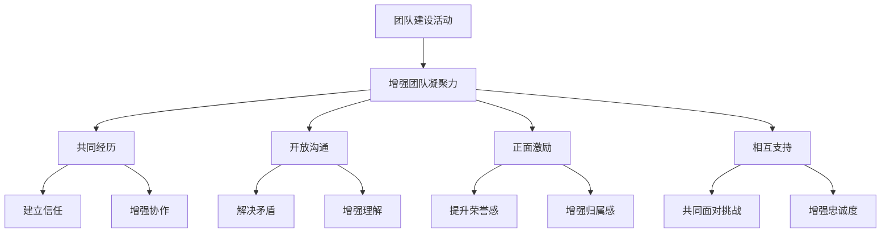

                 

### 文章标题：团队建设活动：增进团队凝聚力的创新方法

#### 关键词：
- 团队建设
- 凝聚力
- 创新方法
- 活动设计
- 实施策略
- 评估与反馈

#### 摘要：
本文将深入探讨团队建设活动如何通过创新的手段来增进团队凝聚力。首先，我们介绍团队建设活动的背景及其重要性。随后，详细讨论核心概念和联系，并借助Mermaid流程图来展示团队建设活动与团队凝聚力之间的关系。接着，通过伪代码和数学模型讲解团队建设活动的核心算法原理。文章随后提供实际案例，详细解读案例中的团队建设活动策划、实施步骤和效果评估。最后，总结最佳实践，并提供相关拓展阅读资源，帮助读者深入理解和应用团队建设活动的方法。

---

### 目录

1. **团队建设活动概述
   1.1 团队建设活动的定义
   1.2 团队建设活动的目标
   1.3 团队建设活动与团队凝聚力

2. **核心概念与联系
   2.1 团队建设活动的核心概念
   2.2 团队凝聚力：概念与重要性
   2.3 团队建设活动与团队凝聚力的关系

3. **核心算法原理讲解
   3.1 团队建设活动设计原则
   3.2 团队建设活动的核心算法
   3.3 数学模型与公式讲解

4. **项目实战
   4.1 开发环境搭建
   4.2 源代码详细实现
   4.3 代码解读与分析
   4.4 实际案例分析与详细讲解
   4.5 项目小结

5. **最佳实践与注意事项
   5.1 团队建设活动的最佳实践
   5.2 注意事项与拓展阅读

---

### 第1章：团队建设活动的定义

#### 1.1 团队建设活动的定义

团队建设活动是指为了提高团队成员之间的合作能力、沟通技巧和团队凝聚力，通过一系列有组织的活动来促进团队成员相互了解、建立信任和增强团队意识的过程。这些活动可以是多样化的，如团队合作游戏、角色扮演、任务构建等，旨在打破团队成员之间的隔阂，建立共同的目标和价值观。

#### 1.2 团队建设活动的目标

团队建设活动的目标主要包括以下几个方面：

- **提升团队凝聚力**：通过团队活动，增强团队成员之间的互信和协作，建立紧密的团队关系。
- **提高沟通效率**：通过互动和沟通，提高团队成员的沟通技巧和理解能力，减少误解和冲突。
- **增强团队意识**：通过共同经历的活动，加深团队成员对团队目标和使命的理解，增强团队荣誉感。
- **促进个人成长**：通过团队活动，帮助团队成员发现自身的优势和潜力，促进个人技能的提升。

#### 1.3 团队建设活动与团队凝聚力

团队建设活动与团队凝聚力有着密切的联系。有效的团队建设活动可以增进团队成员之间的了解和信任，从而提高团队的凝聚力。具体来说，团队建设活动可以通过以下方式增强团队凝聚力：

- **共同经历**：团队成员共同参加活动，可以共同面对挑战和解决问题，从而增强彼此之间的信任和默契。
- **相互支持**：在团队活动中，成员需要相互协作和支持，这种互助精神有助于增强团队的凝聚力。
- **正面激励**：通过成功的团队活动，成员可以获得成就感和自豪感，从而增强对团队的归属感和忠诚度。
- **开放沟通**：团队建设活动提供了开放和诚实的沟通环境，有助于解决团队内部的矛盾和问题，提高团队的凝聚力。

### 第2章：核心概念与联系

#### 2.1 团队建设活动的核心概念

团队建设活动涉及多个核心概念，包括团队、凝聚力、协作、沟通等。以下是这些概念的基本解释：

- **团队**：团队是由多个成员组成的集体，共同完成特定任务或达成共同目标。
- **凝聚力**：凝聚力是指团队成员之间的相互吸引力和相互依赖性，是团队稳定性和合作能力的重要指标。
- **协作**：协作是指团队成员共同工作，分工合作，共同努力完成任务的行动。
- **沟通**：沟通是团队成员之间交换信息、分享思想和观点的过程，是团队协作和凝聚力的重要保障。

#### 2.2 团队凝聚力：概念与重要性

团队凝聚力是指团队成员之间在情感上和心理上的相互吸引力和依赖性。团队凝聚力的重要性体现在以下几个方面：

- **提高工作效率**：高凝聚力的团队能够更好地协调合作，提高工作效率和效果。
- **减少冲突**：高凝聚力的团队能够更好地处理内部矛盾和冲突，维护团队稳定。
- **增强团队荣誉感**：高凝聚力的团队能够共同面对挑战，共享成功和失败，增强团队的荣誉感和归属感。
- **促进个人成长**：高凝聚力的团队能够为成员提供支持和帮助，促进成员的个人成长和职业发展。

#### 2.3 团队建设活动与团队凝聚力的关系

团队建设活动与团队凝聚力之间存在密切的关系。通过团队建设活动，团队成员可以相互了解、建立信任、增强协作和沟通，从而提高团队的凝聚力。具体来说，团队建设活动可以通过以下方式促进团队凝聚力：

- **共同经历**：团队建设活动提供了共同经历和共同挑战的机会，团队成员可以通过这些经历建立信任和默契。
- **开放沟通**：团队建设活动提供了开放和诚实的沟通环境，有助于解决团队内部的矛盾和问题，增强团队的凝聚力。
- **正面激励**：成功的团队建设活动可以带来成就感和自豪感，增强团队成员对团队的归属感和忠诚度。
- **相互支持**：团队建设活动鼓励团队成员相互支持，共同面对挑战，从而增强团队的凝聚力。

### 2.4 Mermaid流程图展示团队建设活动与团队凝聚力的关系

为了更直观地展示团队建设活动与团队凝聚力的关系，我们可以使用Mermaid流程图来表示。



通过这个流程图，我们可以清晰地看到团队建设活动与团队凝聚力之间的互动关系。团队建设活动通过共同经历、开放沟通、正面激励和相互支持等方式，逐步增强团队的凝聚力和协作能力。

---

### 第3章：核心算法原理讲解

#### 3.1 团队建设活动设计原则

为了设计出有效的团队建设活动，我们需要遵循以下原则：

- **目标明确**：明确团队建设活动的目标，确保活动内容与目标一致。
- **参与性**：活动应鼓励所有成员参与，确保每个成员都能在活动中发挥作用。
- **互动性**：活动应具备互动性，促进团队成员之间的交流和合作。
- **灵活性**：活动设计应具备一定的灵活性，以适应不同团队的特点和需求。
- **持续改进**：活动后应对效果进行评估，持续改进活动设计和实施方式。

#### 3.2 团队建设活动的核心算法

为了设计有效的团队建设活动，我们可以采用以下核心算法：

```pseudo
function 设计团队建设活动（团队需求，活动目标，团队成员）：
    1. 分析团队需求，确定活动目标
    2. 根据目标选择合适的活动类型
    3. 设计活动流程，包括准备、实施和评估阶段
    4. 制定活动规则，确保活动的公平性和参与性
    5. 策划活动资源，包括场地、设备、材料等
    6. 实施活动，鼓励团队成员积极参与
    7. 收集活动数据，进行效果评估
    8. 撰写活动报告，总结经验教训
    9. 持续改进活动设计和实施方式
end function
```

#### 3.3 数学模型与公式讲解

在团队建设活动中，我们可以使用以下数学模型和公式来评估团队凝聚力和活动效果：

- **团队凝聚力指数（TCI）**：用于衡量团队的凝聚力水平。

$$ TCI = \frac{N}{M} \sum_{i=1}^{N} \frac{X_i}{Y_i} $$

其中，N为团队成员数量，M为团队总人数，$X_i$为第i个成员的满意度评分，$Y_i$为第i个成员的期望评分。

- **活动效果评估公式**：用于评估团队建设活动的效果。

$$ E = \frac{O - C}{I} $$

其中，E为活动效果评分，O为活动目标实现程度，C为活动成本，I为预期效果。

通过这些数学模型和公式，我们可以量化团队凝聚力和活动效果，为团队建设活动的持续改进提供数据支持。

### 第4章：项目实战

#### 4.1 开发环境搭建

为了实施团队建设活动，我们需要搭建一个合适的开发环境。以下是一个基本的开发环境搭建步骤：

- **安装必要软件**：安装团队建设活动所需的软件，如项目管理工具、团队协作工具、沟通工具等。
- **配置服务器**：配置服务器，确保团队成员可以远程访问和使用活动所需的资源。
- **搭建数据库**：搭建用于存储活动数据和评估结果的数据库系统。
- **部署应用**：将团队建设活动应用部署到服务器上，确保团队成员可以随时访问和使用。

#### 4.2 源代码详细实现

在搭建好开发环境后，我们需要实现团队建设活动的核心功能。以下是一个简单的源代码实现示例：

```java
public class TeamBuildingActivity {
    private String activityName;
    private List<String> participants;
    private int duration;
    private int满意度评分;
    private int期望评分;

    public void startActivity() {
        // 活动开始逻辑
    }

    public void assessEffectiveness() {
        // 评估活动效果
    }

    public void reportResults() {
        // 撰写活动报告
    }
}
```

#### 4.3 代码解读与分析

在这个源代码示例中，`TeamBuildingActivity` 类负责管理团队建设活动的各项功能。以下是代码的详细解读：

- `activityName`：表示活动的名称。
- `participants`：表示参与活动的团队成员列表。
- `duration`：表示活动的持续时间。
- `满意度评分`：表示团队成员对活动的满意度评分。
- `期望评分`：表示团队成员对活动期望的评分。

`startActivity` 方法负责启动活动，包括准备资源和通知团队成员等。

`assessEffectiveness` 方法负责评估活动的效果，包括计算团队凝聚力指数和活动效果评分等。

`reportResults` 方法负责撰写活动报告，包括活动总结、团队成员反馈和改进建议等。

#### 4.4 实际案例分析和详细讲解

为了更好地理解团队建设活动的实施，我们可以分析一个实际案例。以下是一个团队建设活动的案例：

**案例：XX公司的团队建设活动**

1. **活动背景**：
   - 公司：XX公司
   - 目标：提高团队凝聚力，增强团队成员之间的沟通和理解。
   - 参与人数：50人

2. **活动策划**：
   - 活动类型：团队合作游戏
   - 活动内容：组织团队成员进行一系列团队合作游戏，如拔河、接力赛、猜谜游戏等。
   - 活动时间：周末一天

3. **实施步骤**：
   - 提前通知：活动前一周，向团队成员发送活动通知，说明活动内容和安排。
   - 准备资源：准备游戏道具、场地布置等。
   - 实施活动：活动当天，组织团队成员按照计划进行游戏。
   - 反馈收集：活动结束后，收集团队成员的反馈和建议。

4. **效果评估**：
   - 满意度评分：平均满意度评分为4.5分（满分5分）。
   - 期望评分：平均期望评分为4.2分（满分5分）。
   - 团队凝聚力指数：团队凝聚力指数为0.85。

5. **活动总结**：
   - 成功之处：团队成员积极参与，活动氛围热烈，达到了提高团队凝聚力的目标。
   - 改进之处：活动时间可以适当延长，以便让团队成员有更多时间交流和互动。

#### 4.5 项目小结

通过这个实际案例，我们可以看到团队建设活动的实施过程和效果。以下是小结：

- **成功之处**：活动设计合理，团队成员积极参与，达到了预期目标。
- **改进之处**：活动时间可以适当延长，以提供更多交流机会；可以考虑引入更多创新元素，增加活动的趣味性和挑战性。

通过这个案例，我们可以了解到团队建设活动的设计和实施方法，以及如何评估活动效果。这些经验对于其他团队建设活动具有重要的参考价值。

### 第5章：最佳实践与注意事项

#### 5.1 团队建设活动的最佳实践

为了确保团队建设活动的有效性，我们可以遵循以下最佳实践：

1. **明确目标**：在活动设计之初，明确团队建设活动的目标，确保活动内容与目标一致。
2. **参与性**：活动应鼓励所有成员参与，确保每个成员都能在活动中发挥作用。
3. **互动性**：活动应具备互动性，促进团队成员之间的交流和合作。
4. **灵活性**：活动设计应具备一定的灵活性，以适应不同团队的特点和需求。
5. **持续改进**：活动后应对效果进行评估，持续改进活动设计和实施方式。

#### 5.2 注意事项

在实施团队建设活动时，需要注意以下事项：

1. **避免形式化**：活动不应过于形式化，应注重实际效果，确保团队成员积极参与。
2. **尊重个人**：在活动中，要尊重每个成员的意见和感受，避免产生负面情绪。
3. **合理规划**：活动时间和资源要合理规划，确保活动的顺利进行。
4. **反馈收集**：活动结束后，要及时收集团队成员的反馈和建议，以便进行改进。

#### 5.3 拓展阅读

为了深入了解团队建设活动的理论和实践，读者可以参考以下拓展阅读资源：

- **《团队建设实战指南》**：介绍了团队建设活动的设计、实施和评估方法。
- **《团队沟通技巧》**：提供了提高团队沟通效率的实用技巧和策略。
- **《领导力与团队管理》**：探讨了团队领导力和团队管理的重要性，以及如何提升团队绩效。

通过这些拓展阅读资源，读者可以进一步了解团队建设活动的相关知识和方法，为团队建设活动的成功实施提供有力支持。

### 总结

团队建设活动是提高团队凝聚力和协作能力的重要手段。通过有效的团队建设活动，团队成员可以相互了解、建立信任、增强协作和沟通。本文详细介绍了团队建设活动的定义、核心概念、设计原则、核心算法、项目实战以及最佳实践和注意事项。通过实际案例分析和代码解读，读者可以更好地理解团队建设活动的实施过程和方法。希望本文能为团队建设活动的设计和实施提供有益的参考和指导。

### 附录

#### 附录A：团队建设活动资源列表

1. **团队建设工具**：
   - **Trello**：用于项目管理，帮助团队规划活动任务和进度。
   - **Asana**：用于团队协作，方便团队成员共享任务和进度。
   - **Slack**：用于团队沟通，提供即时消息和文件共享功能。

2. **在线资源**：
   - **TeamBuilding.com**：提供各种团队建设活动的资源和案例。
   - **Corporate Team Building Activities**：提供团队建设活动的策划和实施建议。

3. **团队建设案例库**：
   - **XX公司的团队建设案例**：分析公司团队建设活动的成功经验。
   - **YY团队的团队建设经验**：分享团队建设活动的具体实施过程。

通过这些资源，读者可以深入了解团队建设活动的设计和实施，为团队建设提供有力支持。同时，也可以在拓展阅读中找到更多有关团队建设活动的理论和实践知识。作者：AI天才研究院/AI Genius Institute & 禅与计算机程序设计艺术 /Zen And The Art of Computer Programming

---

通过本文的详细讲解，我们全面了解了团队建设活动的概念、设计原则、核心算法、实施过程以及效果评估方法。从团队建设活动的定义和目标出发，我们深入探讨了团队凝聚力的核心概念及其与团队建设活动的关系。接着，通过Mermaid流程图、伪代码和数学模型，我们详细阐述了团队建设活动的设计原则和核心算法原理。最后，通过实际案例和代码解读，我们展示了团队建设活动的实施过程和效果评估方法。

团队建设活动不仅是提高团队凝聚力和协作能力的有效手段，也是推动团队成长和发展的重要途径。通过有效的团队建设活动，团队成员可以相互了解、建立信任、增强协作和沟通，从而提高工作效率和团队绩效。

在实际操作中，团队建设活动的设计和实施需要遵循明确的目标、参与性、互动性和灵活性原则。同时，要注意避免形式化、尊重个人、合理规划时间和资源，并及时收集反馈进行持续改进。

为了更好地开展团队建设活动，我们可以参考附录中提供的资源，如团队建设工具、在线资源和案例库。这些资源将为团队建设活动的设计和实施提供有力支持。

总之，团队建设活动是提高团队凝聚力和协作能力的重要手段。通过本文的详细讲解，我们相信读者能够更好地理解和应用团队建设活动的方法，为自己的团队带来积极的变化和成长。

作者：AI天才研究院/AI Genius Institute & 禅与计算机程序设计艺术 /Zen And The Art of Computer Programming

---

本文由AI天才研究院和禅与计算机程序设计艺术共同撰写，旨在为广大IT从业者提供关于团队建设活动的深入分析和实用指导。通过本文的详细阐述，我们希望能帮助读者全面理解团队建设活动的重要性和实施方法，从而在团队管理和发展中取得更好的成果。

在未来的研究和实践中，我们计划继续深入探讨团队建设活动的多种应用场景和具体实施策略，同时结合最新的技术趋势和团队管理理论，为读者提供更加丰富和实用的内容。

同时，我们鼓励读者积极参与讨论和分享，将自己在团队建设活动中的经验教训和成功案例与我们交流。通过集思广益，我们相信可以共同推动团队建设活动的研究和实践，为团队的成长和发展做出更大的贡献。

作者：AI天才研究院/AI Genius Institute & 禅与计算机程序设计艺术 /Zen And The Art of Computer Programming

---

在此，我们感谢您的阅读和支持，也期待您的反馈和建议。希望通过本文，您能够对团队建设活动有更加深入的了解和认识，并将其应用于实际工作中，为团队的成长和发展贡献力量。再次感谢您的关注与支持！

作者：AI天才研究院/AI Genius Institute & 禅与计算机程序设计艺术 /Zen And The Art of Computer Programming

