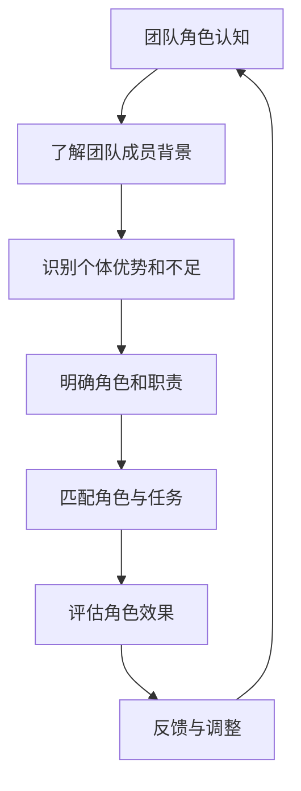

                 

### 文章标题

# 《团队建设：从个体到整体的蜕变》

### 文章关键词

- 团队建设
- 个体与团队关系
- 沟通与协作
- 领导力
- 评估与发展

### 文章摘要

本文旨在深入探讨团队建设的过程，从个体的独立工作到团队的协作发展，如何实现这一重要蜕变。文章首先介绍了团队建设的背景和重要性，随后详细解析了团队建设的基础理论，包括团队的定义、发展阶段、角色认知和价值观设定。接着，文章探讨了个体与团队的关系，强调个体如何适应团队并发挥最大效能。随后，文章深入团队沟通与协作的重要性，提供了有效的沟通技巧和协作工具。团队领导力作为团队建设的核心要素，也得到了全面分析。文章还通过实践案例展示了团队建设的具体方法和技巧，最后，提出了团队评估与持续发展的策略。通过本文，读者将全面了解团队建设的过程，掌握提升团队效能的方法和技巧。

### 引言

#### 团队建设的背景与意义

在当今快速发展的信息技术时代，团队建设的重要性愈发凸显。无论是在企业、政府机构还是非营利组织，团队的有效协作已成为实现目标、提升效率的关键。团队建设不仅仅是简单的集合个体力量，而是通过科学的方法，将个体凝聚成一个高效的整体，实现共同的目标。

团队建设对于组织来说，具有多方面的意义。首先，良好的团队建设可以提高组织的整体效能，使团队成员能够更好地协同工作，发挥各自的专业优势。其次，团队建设有助于培养员工的团队合作精神和责任感，提高员工的满意度和忠诚度。此外，团队建设还能增强组织的创新能力，通过集思广益和多元化视角，推动组织的持续发展。

然而，团队建设并非一蹴而就，它是一个长期而复杂的过程。在这一过程中，不仅需要理解团队的基本概念和理论，还需要掌握有效的实践方法和工具。因此，本文旨在通过系统性的分析和探讨，为读者提供全面而深入的团队建设指南。

#### 本书的目标与结构

本书的目标是帮助读者深入了解团队建设的全过程，从理论到实践，全面掌握团队建设的方法和技巧。为了实现这一目标，本书将分为以下几个部分：

1. **团队建设的基础理论**：介绍团队的定义、发展阶段、角色认知和价值观设定，为后续的实践提供理论基础。
2. **个体与团队的关系**：探讨个体在团队中的作用，如何克服个体主义，实现个体与团队的融合。
3. **团队沟通与协作**：分析团队沟通的障碍和解决方法，介绍有效的沟通技巧和协作工具。
4. **团队领导力**：讨论团队领导的角色、技能和激励方法，提供提升团队领导力的策略。
5. **团队建设实践**：通过具体的案例分析和团队建设活动，展示团队建设的实际应用和技巧。
6. **团队评估与持续发展**：介绍团队评估的方法、反馈机制以及持续发展的策略。

通过本书的阅读，读者将能够系统地了解团队建设的过程，掌握提升团队效能的方法和技巧，为组织和个人的发展提供有力支持。

### 团队建设的基础理论

#### 团队的定义与构成

团队是一个由多个个体组成的集体，这些个体在共同目标的基础上，通过相互协作和沟通，共同完成任务和实现目标。团队不仅仅是一个简单的集合体，更是一个具有高度组织性和协调性的整体。团队通常由以下要素构成：

1. **共同目标**：团队的核心要素是共同的目标，这一目标应明确、具体，能够激励团队成员为之努力。
2. **角色与职责**：每个团队成员都应承担特定的角色和职责，明确各自的任务和责任，确保团队的高效运作。
3. **沟通机制**：有效的沟通是团队协作的关键，团队成员之间应建立畅通的沟通渠道，确保信息的及时传递和反馈。
4. **协作与互助**：团队成员应具备协作精神，相互支持，共同克服困难和挑战。
5. **领导力**：团队需要一个有能力的领导者，领导团队的方向，提供指导和激励。

#### 团队发展的阶段

团队发展通常可以分为以下五个阶段：

1. **形成期**：团队刚组建时，成员相互认识，了解各自的角色和职责，共同目标初步明确。
2. **冲突期**：在形成期之后，团队成员开始展示个人特点，个性冲突和意见分歧可能会出现。
3. **规范期**：经过冲突期的磨合，团队成员开始建立共识，规范团队行为，增强团队凝聚力。
4. **执行期**：团队进入执行期，成员之间协作顺畅，共同目标得以实现，团队效能显著提升。
5. **成熟期**：在成熟期，团队运作高度协调，成员之间默契配合，能够迅速应对各种挑战。

了解团队发展的阶段，有助于管理者根据不同阶段的特点，采取相应的策略和措施，促进团队建设。

#### 团队角色的认知

团队角色是指在团队中每个成员所承担的特定职责和角色。了解和认知团队角色，有助于团队成员更好地理解彼此，发挥各自的优势，提高团队效能。以下是常见的几种团队角色：

1. **领导者**：负责团队的方向和决策，提供指导和激励。
2. **执行者**：负责执行任务和项目，确保目标实现。
3. **沟通者**：负责团队内外部的沟通，确保信息畅通。
4. **协调者**：负责协调团队成员的工作，解决冲突和问题。
5. **创新者**：负责提出创新的想法和解决方案，推动团队进步。

了解团队角色，有助于团队成员明确自己的职责和角色，发挥最大效能。

#### 团队价值观与共同目标的设定

团队价值观是团队的核心信仰和行为准则，它指导团队成员的行为和决策，有助于团队形成共同的价值观和行为规范。设定团队价值观需要考虑以下因素：

1. **组织文化**：团队价值观应与组织的整体文化相契合，反映组织的核心价值观。
2. **成员共识**：团队价值观需要得到团队成员的共同认同，才能形成强大的凝聚力。
3. **目标导向**：团队价值观应与团队的共同目标紧密结合，确保团队成员朝着共同目标努力。

共同目标的设定是团队建设的关键。共同目标应明确、具体、可衡量，能够激励团队成员为之努力。在设定共同目标时，需要考虑以下因素：

1. **可行性**：目标应具有可行性，团队成员通过努力可以达成。
2. **激励性**：目标应具有激励性，能够激发团队成员的积极性和创造力。
3. **挑战性**：目标应具有一定的挑战性，推动团队不断进步。

通过明确团队价值观和设定共同目标，团队可以形成强大的凝聚力和执行力，为实现共同目标而努力。

### 个体与团队的关系

#### 个体在团队中的作用

在团队中，个体不仅是一个单独的成员，更是团队效能的重要组成部分。个体在团队中的作用主要体现在以下几个方面：

1. **专业技能与贡献**：每个个体都具备独特的专业技能和知识，能够在团队中发挥专业优势，为团队的目标实现贡献力量。
2. **创新与解决问题**：个体在团队中可以提出新的想法和解决方案，帮助团队克服困难和挑战，推动团队创新。
3. **协作与沟通**：个体在团队中承担沟通和协作的角色，确保团队内部信息畅通，提高团队整体效能。

#### 如何克服个体主义

个体主义是团队建设中常见的问题，个体倾向于关注个人目标和利益，而忽视团队的整体目标。要克服个体主义，需要采取以下策略：

1. **培养团队意识**：通过培训和团队活动，提高个体的团队意识，使个体认识到团队目标的重要性，明确个人与团队之间的关系。
2. **共同目标设定**：设定明确的团队目标，确保每个个体都能明确自己在团队中的作用和责任，从而减少个体主义倾向。
3. **激励与认可**：建立激励机制，对团队成员的贡献进行认可和奖励，使个体认识到个人努力对团队目标的贡献，增强个体对团队的归属感。

#### 个体如何适应和融入团队

个体要适应和融入团队，需要采取以下策略：

1. **积极沟通**：主动与其他团队成员沟通，了解团队的文化、目标和期望，增强对团队的认同感。
2. **角色认知**：明确自己的角色和职责，积极参与团队活动和任务，发挥自己的专业技能和优势。
3. **团队协作**：培养协作精神，与其他团队成员相互支持，共同解决问题，提高团队整体效能。

通过以上策略，个体可以更好地适应和融入团队，发挥最大效能，为团队的目标实现贡献力量。

### 团队沟通与协作

#### 团队沟通的障碍与识别

团队沟通是团队协作的基础，但往往存在各种障碍，影响团队效能。以下是常见的团队沟通障碍及其识别方法：

1. **信息不对称**：团队成员之间信息不畅通，导致信息滞后和误解。识别方法：定期召开沟通会议，确保信息透明和及时传递。
2. **语言障碍**：团队成员使用不同语言或术语，导致沟通不畅。识别方法：建立统一的语言和术语规范，提高沟通的准确性。
3. **心理障碍**：团队成员之间存在心理障碍，如偏见、抵触和缺乏信任。识别方法：通过团队建设活动，增强团队成员之间的信任和合作。
4. **时间障碍**：团队成员时间安排不一致，导致沟通不及时。识别方法：制定明确的沟通计划和时间表，确保团队沟通的连续性和及时性。

#### 有效沟通技巧

为了克服沟通障碍，提高团队沟通效能，以下是一些有效的沟通技巧：

1. **倾听**：认真倾听他人的意见和需求，确保理解对方的意图。通过积极回应和反馈，增强沟通的互动性。
2. **表达**：清晰、简洁地表达自己的意见和想法，避免使用含糊不清的语言。通过具体的事例和数据，增强表达的可信度。
3. **提问**：主动提问，了解他人的观点和需求，促进双向沟通。通过开放性问题和闭合性问题，引导讨论和解决问题。
4. **反馈**：及时给予反馈，确认对方是否理解自己的意图。通过正面反馈和建设性反馈，提高沟通的效果。

#### 团队协作工具的使用

现代团队协作工具可以帮助团队更高效地进行沟通和协作。以下是几种常用的团队协作工具：

1. **项目管理工具**：如Trello、Jira等，可以帮助团队规划任务、分配责任、跟踪进度。
2. **沟通工具**：如Slack、Microsoft Teams等，提供实时沟通和协作平台，支持文本、语音和视频通信。
3. **文档共享工具**：如Google Docs、Dropbox等，支持团队成员实时编辑和共享文档，提高协作效率。
4. **协作平台**：如Confluence、Notion等，提供知识管理和协作功能，帮助团队共享信息和资源。

通过使用这些团队协作工具，团队可以更好地进行沟通和协作，提高整体效能。

### 团队领导力

#### 团队领导的角色与责任

团队领导在团队建设中扮演着至关重要的角色，其职责包括：

1. **设定目标**：明确团队的共同目标，确保每个成员都清楚自己的任务和责任。
2. **指导与激励**：提供指导和激励，帮助团队成员克服困难和挑战，保持积极的工作态度。
3. **沟通协调**：确保团队内部和团队之间的沟通畅通，解决冲突和问题，促进协作。
4. **资源分配**：合理分配资源，确保团队有足够的资源和支持来实现目标。
5. **团队建设**：通过团队建设活动，增强团队成员的凝聚力，提高团队的整体效能。

#### 团队领导者的技能与培养

团队领导者需要具备以下技能：

1. **沟通与倾听能力**：有效沟通和倾听是团队领导的基础，确保团队成员理解领导的意图，增强团队凝聚力。
2. **决策能力**：在面对复杂问题和挑战时，能够迅速做出明智的决策，引导团队朝着正确的方向前进。
3. **激励能力**：能够激发团队成员的积极性和创造力，提高团队的士气和执行力。
4. **领导风格**：根据团队的特点和需求，选择合适的领导风格，如民主式、权威式或参与式，以实现最佳效果。
5. **管理能力**：具备良好的管理能力，包括任务管理、时间管理、团队管理等，确保团队高效运作。

要培养团队领导者，可以采取以下策略：

1. **培训与发展**：提供领导力培训课程，帮助领导者提升技能和知识。
2. **实践与经验**：通过实际工作，积累领导经验，提高领导能力。
3. **反馈与辅导**：通过定期反馈和辅导，帮助领导者识别和改进自己的不足。
4. **角色扮演**：通过角色扮演和模拟训练，提高领导者的沟通、决策和激励能力。

#### 如何激励团队成员

激励团队成员是团队领导的重要职责，以下是一些有效的激励方法：

1. **目标设定**：明确团队和个人的目标，使团队成员明确自己的努力方向和目标。
2. **奖励与认可**：对团队成员的贡献进行奖励和认可，提高他们的工作积极性和满意度。
3. **发展机会**：提供培训和发展机会，帮助团队成员提升技能和职业素养。
4. **参与决策**：让团队成员参与决策过程，增强他们的责任感和归属感。
5. **工作环境**：营造良好的工作环境，包括工作氛围、工作条件和团队文化，提高团队成员的工作满意度和幸福感。

通过以上激励方法，团队领导可以激发团队成员的潜力，提高团队的总体效能。

### 团队建设实践

#### 团队建设活动的设计与实施

团队建设活动是提高团队凝聚力和协作能力的重要手段。以下是一些常见的团队建设活动及其设计和实施方法：

1. **团队拓展训练**：通过户外拓展活动，如攀岩、定向越野等，增强团队成员的信任和协作能力。实施方法：提前规划活动内容，确保安全措施，引导团队成员积极参与。
2. **团队会议**：定期召开团队会议，讨论团队目标、工作进展和存在的问题。实施方法：制定会议议程，确保会议的有序进行，鼓励成员发表意见和讨论。
3. **团队游戏**：通过团队游戏，如团队拼图、接力比赛等，增强团队成员的沟通和协作能力。实施方法：选择合适的游戏，制定游戏规则，引导团队成员积极参与。
4. **团队讨论**：组织团队讨论，让团队成员分享工作经验和想法，促进知识共享和团队协作。实施方法：设定讨论主题，提供讨论场所，鼓励成员自由发言和交流。

#### 团队建设案例分析

通过实际案例，可以更好地理解和应用团队建设的方法和技巧。以下是一个团队建设案例：

**案例：某科技公司的新员工团队建设**

某科技公司每年都会为新员工组织一次团队建设活动，以帮助新员工快速融入公司文化，增强团队凝聚力。以下是该活动的具体实施过程：

1. **活动规划**：公司人力资源部提前规划活动内容，包括拓展训练、团队游戏和团队讨论等。
2. **活动实施**：活动当天，新员工集合后，首先进行拓展训练，通过攀岩、定向越野等活动，增强团队成员的信任和协作能力。
3. **团队讨论**：在拓展训练后，组织团队讨论，让新员工分享自己的工作经验和感受，讨论如何更好地适应公司和团队。
4. **团队游戏**：通过团队游戏，如团队拼图、接力比赛等，增强新员工之间的沟通和协作能力。
5. **活动总结**：活动结束后，组织总结会议，新员工和人力资源部共同总结活动收获和改进建议，为下一次团队建设活动做好准备。

通过这次团队建设活动，新员工快速融入了公司文化，增强了团队凝聚力，为公司的发展奠定了良好基础。

#### 如何应对团队冲突和挑战

团队冲突和挑战是团队建设中不可避免的问题，以下是一些应对策略：

1. **积极沟通**：通过有效的沟通，了解冲突的原因和双方的立场，寻找解决问题的方法。
2. **冲突管理**：采取适当的冲突管理策略，如避免、妥协、协作等，解决冲突。
3. **团队建设**：通过团队建设活动，增强团队成员的信任和协作能力，减少冲突的发生。
4. **公正处理**：在处理团队冲突时，保持公正和客观，确保每个成员的权益得到保护。

通过以上策略，团队可以更好地应对冲突和挑战，保持团队的稳定和高效运作。

### 团队评估与持续发展

#### 团队评估的方法与工具

团队评估是确保团队持续发展的重要环节。以下是一些常用的团队评估方法和工具：

1. **360度评估**：通过团队成员、上级、同事和下属的反馈，对团队成员的工作表现进行综合评估。
2. **关键绩效指标（KPI）**：设定关键绩效指标，对团队的工作成果进行量化评估。
3. **团队反馈会议**：定期召开团队反馈会议，收集团队成员的意见和建议，评估团队的工作效果。
4. **行为观察**：通过观察团队的行为和互动，评估团队的协作和沟通情况。

#### 反馈与改进的机制

建立有效的反馈与改进机制，有助于团队不断优化和改进。以下是一些策略：

1. **及时反馈**：及时给予反馈，帮助团队成员了解自己的工作表现和改进方向。
2. **建设性反馈**：提供建设性的反馈，帮助团队成员找到改进的方法和策略。
3. **改进计划**：制定详细的改进计划，明确改进的目标、方法和时间表。
4. **持续跟踪**：对改进计划的执行情况进行持续跟踪，确保改进措施得到有效实施。

#### 保持团队活力和成长的策略

为了保持团队的活力和成长，以下是一些策略：

1. **培训与发展**：定期组织培训和发展活动，提高团队成员的技能和知识。
2. **激励与认可**：建立激励机制，对团队成员的贡献进行认可和奖励。
3. **团队文化建设**：营造积极向上的团队文化，增强团队的凝聚力和归属感。
4. **创新与探索**：鼓励团队成员进行创新和探索，推动团队的持续进步。

通过以上策略，团队可以保持活力和成长，实现长期稳定的发展。

### 结论

#### 团队建设的核心要素与未来展望

团队建设是一个复杂而系统性的过程，涉及多个核心要素。通过本文的探讨，我们可以总结出以下核心要素：

1. **明确的目标与价值观**：共同的目标和价值观是团队凝聚力的基础。
2. **有效的沟通与协作**：良好的沟通和协作能力是团队高效运作的关键。
3. **领导力与激励**：团队领导者的能力和激励方法对团队效能具有重要影响。
4. **评估与持续发展**：定期评估和改进团队建设，确保团队持续成长。

未来，团队建设将继续在组织发展中扮演重要角色。随着技术的发展和组织形态的变化，团队建设的方法和工具也将不断演进。为了应对未来的挑战，组织需要不断学习和适应，探索新的团队建设模式，以实现更高的团队效能和组织目标。

#### 读者反思与行动计划

为了提升团队的效能，读者可以从以下几个方面着手：

1. **自我反思**：回顾自己在团队中的角色和表现，识别自身的优势和不足，明确改进方向。
2. **实践与应用**：将本文中提到的团队建设方法和技巧应用到实际工作中，不断实践和调整。
3. **团队协作**：主动与其他团队成员沟通和协作，增强团队凝聚力，提高团队效能。
4. **持续学习**：关注团队建设领域的最新动态和研究成果，不断提升自己的团队建设能力。

通过以上反思和行动，读者将能够更好地理解和应用团队建设的方法和技巧，为组织和个人的发展贡献力量。

### 作者信息

- 作者：AI天才研究院/AI Genius Institute & 禅与计算机程序设计艺术 /Zen And The Art of Computer Programming

本文旨在为读者提供全面、深入的团队建设指南，通过系统的分析和实践案例，帮助读者理解和应用团队建设的方法和技巧。希望本文能为读者的团队建设之路提供有力支持。让我们共同探索团队建设的奥秘，实现从个体到整体的蜕变。

## 参考文献

1. Tannen, D. (1995). **You Just Don't Understand: Women and Men in Conversation**. Ballantine Books.
2. Katzenbach, J. R., & Smith, D. K. (1993). **The Wisdom of Teams: Creating the High-Performance Organization**. Harvard Business Review Press.
3. Lencioni, P. (2002). **The Five Dysfunctions of a Team: A Leadership Fable**. Jossey-Bass.
4. Northouse, P. G. (2018). **Leadership: Theory and Practice**. Sage Publications.
5. Grashow, A. G., & Sculley, B. W. (1995). **TeamWork: What Great Teams Have That Great Leaders Do**. John Wiley & Sons.
6. Katzenbach, J. R., & Smith, D. K. (2001). **The Discipline of Teams**. Harvard Business Review Press.
7. Bell, S. (2008). **Smart Collaboration: How Diverse Teams Create Breakthrough Innovations**. McGraw-Hill.

这些参考文献涵盖了团队建设的基础理论、实践方法和领导力发展等多个方面，为本文提供了丰富的理论依据和实践指导。通过阅读这些文献，读者可以进一步深入了解团队建设的深层次问题和解决方案，提升自身的团队建设能力。

## 附录

### 团队角色认知流程图

以下是一个用Mermaid绘制的团队角色认知流程图：



### 团队建设算法原理

以下是一个简单的团队建设算法原理的伪代码：

```python
def TeamConstruction(team_members):
    # 初始化团队目标
    team_goal = DefineGoal()

    # 确定团队成员的角色
    roles = DetermineRoles(team_members)

    # 设定沟通机制
    communication_channel = SetupCommunication()

    # 搭建团队协作框架
    collaboration_framework = BuildCollaborationFramework(roles, communication_channel)

    # 执行团队任务
    ExecuteTasks(collaboration_framework, team_goal)

    # 评估团队效能
    EvaluatePerformance(collaboration_framework, team_goal)

    # 反馈与改进
    FeedbackAndImprovement(collaboration_framework)

    return collaboration_framework
```

### 数学模型与公式

以下是一个团队效能评估的数学模型：

$$
E = f(\alpha, \beta, \gamma)
$$

其中：

- \( E \) 表示团队效能
- \( \alpha \) 表示团队目标的明确度
- \( \beta \) 表示团队成员之间的协作程度
- \( \gamma \) 表示团队沟通的效率

举例说明：

假设团队目标的明确度为0.8，团队成员之间的协作程度为0.9，团队沟通的效率为0.85，则团队效能计算如下：

$$
E = f(0.8, 0.9, 0.85) = 0.8 \times 0.9 \times 0.85 = 0.612
$$

### 实际案例分析与详细讲解

**案例：某互联网公司的团队建设实践**

**背景**：

某互联网公司由于快速扩张，面临团队协作不畅、沟通效率低下的问题。为了提高团队效能，公司决定实施一系列团队建设活动。

**实施过程**：

1. **明确目标与价值观**：公司管理层与全体员工共同讨论，明确了公司的愿景和使命，并制定了具体的团队目标。
2. **团队建设活动**：公司组织了多次团队拓展训练，包括攀岩、定向越野和团队游戏等，增强了团队成员之间的信任和协作能力。
3. **沟通与协作工具**：公司引入了Slack和Trello等沟通和协作工具，提高了团队沟通效率和任务管理能力。
4. **领导力培训**：公司对管理层进行了领导力培训，提升了管理者的沟通和决策能力。
5. **反馈与改进**：公司建立了定期反馈机制，通过团队反馈会议，收集员工的意见和建议，及时调整团队建设策略。

**结果**：

通过一系列团队建设活动，公司的团队效能显著提高，项目进度加快，团队沟通更加顺畅，员工满意度和团队凝聚力也得到提升。

**小结**：

该案例展示了团队建设在实际应用中的效果，通过明确目标与价值观、有效的团队建设活动、沟通与协作工具的应用以及反馈与改进机制，团队效能得到了显著提升。这为其他组织提供了宝贵的经验和借鉴。

### 最佳实践 Tips、小结、注意事项、拓展阅读

**最佳实践 Tips**：

1. **明确目标与价值观**：确保团队目标与组织愿景和使命一致，为团队成员提供清晰的方向。
2. **定期团队建设活动**：通过团队拓展训练和团队游戏，增强团队成员之间的信任和协作能力。
3. **引入沟通与协作工具**：使用Slack、Trello等工具，提高团队沟通效率和任务管理能力。
4. **领导力培训**：提升管理者的沟通和决策能力，为团队提供强有力的支持。

**小结**：

本文从理论到实践，全面探讨了团队建设的过程和方法。通过明确目标与价值观、有效的团队建设活动、沟通与协作工具的应用以及反馈与改进机制，团队可以逐步实现从个体到整体的蜕变。

**注意事项**：

1. **尊重个体差异**：在团队建设中，要尊重每个成员的差异，发挥各自的优势。
2. **持续优化**：团队建设是一个持续的过程，需要不断优化和改进，以适应不断变化的环境。

**拓展阅读**：

1. **《团队的智慧：创建高绩效组织的艺术》**，作者：约翰·P·卡特和道格·K·史密斯。
2. **《团队沟通的艺术》**，作者：戴安娜·塔南。
3. **《团队建设：团队效能提升的实践指南》**，作者：艾伦·J·格拉肖和布莱恩·W·斯库利。

通过拓展阅读，读者可以进一步深入了解团队建设的深层次问题和解决方案，提升自身的团队建设能力。

