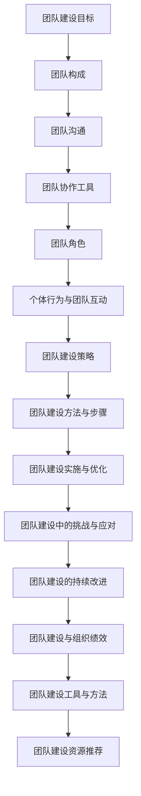

                 


### 《团队建设：从个体到整体的蜕变》

#### 关键词：
- 团队建设
- 个体与团队互动
- 团队策略
- 挑战与应对
- 组织绩效

#### 摘要：
本文旨在探讨团队建设的过程、理论和实践，从个体到整体的蜕变。文章首先介绍团队的定义与特征，分析团队建设的意义和生命周期。接着，讨论团队核心理论，包括勒温的群体动力理论、巴纳德的协作系统理论和圣吉的学习型组织理论。随后，阐述团队建设的关键要素，如团队目标、团队角色、团队沟通和团队协作工具。文章还探讨个体与团队的互动关系，分析团队建设的方法与策略，以及应对挑战的策略。通过实践案例与策略分析，文章展示了团队建设的成功与失败，提出团队建设策略的评估与优化。最后，文章讨论团队建设的持续改进，以及团队建设对组织绩效的影响，并提供团队建设工具与方法以及资源推荐。

## 第一部分：团队建设的理论基础

### 第1章：团队概述

#### 1.1.1 团队的定义与特征

团队是一个由多个个体组成的协作单位，他们共同工作以实现共同的目标。团队具有以下特征：

1. **共同目标**：团队成员共同追求的目标，这有助于统一团队成员的行动方向。
2. **角色分工**：每个团队成员在团队中扮演不同的角色，承担不同的责任，以便高效地完成工作。
3. **相互依赖**：团队成员之间相互依赖，共同完成团队任务。
4. **协作与沟通**：团队成员之间需要保持良好的协作与沟通，以确保信息的畅通和工作的顺利进行。
5. **共同责任**：团队成员共同承担团队的成功与失败。

#### 1.1.2 团队建设的意义

团队建设对于组织的成功至关重要，其意义主要体现在以下几个方面：

1. **提高效率**：通过团队协作，可以减少重复劳动，提高工作效率。
2. **增强创新能力**：团队成员可以共同探讨问题，提出创新的解决方案，提高组织的创新能力。
3. **提升团队凝聚力**：通过团队建设，可以增强团队成员之间的信任和合作，提升团队凝聚力。
4. **促进个人成长**：团队成员可以在团队中学习新知识、提升技能，实现个人成长。
5. **提升组织绩效**：团队建设有助于提升组织的整体绩效，实现组织的战略目标。

#### 1.1.3 团队的生命周期

团队的建设过程可以分为以下几个阶段：

1. **形成期**：团队成员相互认识，了解团队的目标和职责，建立初步的信任关系。
2. **磨合期**：团队成员之间的协作逐渐成熟，团队开始形成一定的凝聚力。
3. **成熟期**：团队进入稳定期，团队成员之间的协作顺畅，团队绩效达到最佳状态。
4. **变革期**：随着外部环境的变化，团队需要调整策略和目标，以适应新的挑战。

### 第2章：团队核心理论

#### 2.1.1 勒温的群体动力理论

勒温的群体动力理论关注群体内部的动力和影响。他认为，群体动力由三个因素构成：

1. **群体结构**：包括群体的规模、成员的互动方式等。
2. **群体规范**：包括群体内的行为准则和价值观。
3. **群体凝聚力**：包括群体成员之间的信任、归属感和团结程度。

#### 2.1.2 巴纳德的协作系统理论

巴纳德的协作系统理论强调，团队是一个协作系统，其成功取决于以下几个因素：

1. **共同目标**：团队成员共同追求的目标，是协作的基础。
2. **沟通**：有效的沟通是团队协作的关键。
3. **组织结构**：合理的设计有助于团队协作和目标实现。
4. **个人贡献**：每个成员在团队中的贡献是团队成功的关键。

#### 2.1.3 圣吉的学习型组织理论

圣吉的学习型组织理论认为，组织应该成为一个不断学习、适应和变革的系统。学习型组织具有以下特征：

1. **共同愿景**：团队成员共享的愿景，是组织发展的动力。
2. **团队学习**：团队成员之间的互动和共同学习，有助于提升团队的能力。
3. **个人发展**：组织重视成员的个人发展，提供成长机会。
4. **系统思考**：组织从系统的角度看待问题，实现整体的优化。

### 第3章：团队建设的关键要素

#### 3.1.1 团队目标

团队目标是指团队希望实现的结果。制定明确的团队目标有助于统一团队成员的行动方向，提高团队绩效。团队目标应具备以下特点：

1. **具体**：明确团队希望实现的具体成果。
2. **可测量**：团队目标应该可以量化，以便评估团队绩效。
3. **可实现**：团队目标应该是实际可行的，避免设定过高或过低的目标。
4. **时间限制**：团队目标应设定具体的时间限制，以便跟踪进度。

#### 3.1.2 团队角色

团队角色是指团队成员在团队中扮演的角色和承担的责任。明确的团队角色有助于提高团队协作效率，避免角色重叠或缺失。常见的团队角色包括：

1. **领导者**：负责制定团队目标和规划，协调团队成员的工作。
2. **执行者**：负责执行团队任务，完成团队目标。
3. **协调者**：负责协调团队成员之间的沟通和协作。
4. **监督者**：负责监督团队任务进度和质量，确保团队目标的实现。
5. **专家**：负责提供专业知识和技能，协助团队解决问题。

#### 3.1.3 团队沟通

团队沟通是团队建设的关键要素，直接影响团队协作效率和绩效。良好的团队沟通应具备以下特点：

1. **开放性**：团队成员之间保持开放的心态，真诚地交流意见和想法。
2. **及时性**：团队成员应及时分享信息，确保团队目标实现的进度。
3. **准确性**：沟通内容应准确传达，避免误解和歧义。
4. **多样性**：团队成员应尊重彼此的沟通风格，适应不同的沟通方式。

#### 3.1.4 团队协作与协作工具

团队协作是指团队成员共同努力，以实现团队目标的过程。良好的团队协作有助于提高团队绩效。团队协作工具包括：

1. **会议工具**：如视频会议、在线协作平台，方便团队成员实时沟通和协作。
2. **项目管理工具**：如敏捷看板、任务管理工具，帮助团队规划和跟踪任务进度。
3. **知识管理工具**：如知识库、文档管理工具，方便团队成员共享和获取知识。
4. **协作软件**：如即时通讯工具、团队协作软件，提高团队成员之间的沟通效率。

### 第4章：个体与团队的互动关系

#### 4.1.1 个体行为与团队互动

个体行为对团队互动有着重要影响。以下为几种常见的个体行为：

1. **积极行为**：个体积极参与团队活动，提出建议和解决方案，为团队目标贡献力量。
2. **消极行为**：个体对团队活动持消极态度，不愿参与或拒绝合作。
3. **竞争行为**：个体之间为了资源或荣誉而竞争，可能导致团队内部分裂。
4. **合作行为**：个体之间相互支持，共同为团队目标努力，实现团队的成功。

#### 4.1.2 个体对团队的影响

个体对团队的影响主要体现在以下几个方面：

1. **技能与知识**：个体的专业技能和知识为团队带来新的思路和方法，提高团队的整体能力。
2. **态度与行为**：个体的态度和行为对团队的氛围和协作产生影响，良好的个体行为有助于提升团队绩效。
3. **个性与性格**：个体的个性和性格特点对团队协作和沟通产生影响，合理搭配个体的个性特点有助于团队建设。
4. **影响力**：个体在团队中的地位和影响力，对团队决策和方向产生重要影响。

#### 4.1.3 团队对个体的影响

团队对个体的影响主要体现在以下几个方面：

1. **个人成长**：团队为个体提供学习和发展机会，促进个人成长。
2. **归属感**：团队为个体提供归属感和安全感，增强个体的心理素质。
3. **激励**：团队通过认可和奖励，激励个体为实现团队目标而努力。
4. **支持与帮助**：团队为个体提供支持和帮助，解决个体在工作和生活中的问题。

### 第5章：团队建设的方法与策略

#### 5.1.1 团队建设的方法

团队建设的方法多种多样，以下为几种常见的团队建设方法：

1. **团队活动**：组织团队活动，如团队建设工作坊、团队拓展训练等，增强团队成员之间的信任和合作。
2. **领导力培训**：对团队成员进行领导力培训，提高他们的领导能力和团队管理能力。
3. **团队沟通培训**：对团队成员进行沟通技巧培训，提高他们的沟通能力和协作效率。
4. **团队文化建设**：营造积极向上的团队文化，增强团队的凝聚力和归属感。
5. **激励与奖励**：通过激励机制和奖励措施，激发个体的积极性和创造力。

#### 5.1.2 团队建设的策略

团队建设的策略主要包括以下几个方面：

1. **明确目标**：制定明确的团队目标，确保团队成员对团队目标有清晰的认识。
2. **合理分工**：根据团队成员的技能和特长，合理分配工作任务，确保团队成员发挥各自的优势。
3. **有效沟通**：建立有效的沟通机制，确保团队成员之间的信息畅通。
4. **持续反馈**：定期对团队成员的工作进行反馈，帮助他们改进和提高。
5. **培养团队精神**：通过团队活动和培训，培养团队成员的团队精神，增强团队的凝聚力。

#### 5.1.3 团队建设的实施步骤

团队建设的实施步骤如下：

1. **评估团队现状**：了解团队的目标、角色、沟通和协作现状，分析团队存在的问题和需求。
2. **制定团队建设计划**：根据团队现状，制定团队建设计划，明确团队建设的目标、方法和策略。
3. **实施团队建设活动**：按照团队建设计划，组织团队活动，实施团队建设措施。
4. **评估团队建设效果**：对团队建设活动进行评估，了解团队建设的效果和问题，为下一步团队建设提供参考。
5. **持续优化团队建设**：根据评估结果，不断优化团队建设方法和策略，提升团队绩效。

### 第6章：团队建设中的挑战与应对

#### 6.1.1 团队建设中的常见挑战

团队建设过程中，可能会面临以下常见挑战：

1. **沟通障碍**：团队成员之间的沟通不畅，导致信息传递错误或延误。
2. **角色冲突**：团队成员之间的角色分工不清，导致职责重叠或缺失。
3. **目标不一致**：团队成员对团队目标的理解不一致，导致工作方向不明确。
4. **团队凝聚力不足**：团队成员之间的信任和合作不足，影响团队绩效。
5. **外部干扰**：外部因素对团队建设和工作的影响，如市场竞争、资源限制等。

#### 6.1.2 团队建设中的冲突处理

团队建设中的冲突处理策略如下：

1. **沟通与理解**：通过有效沟通，了解冲突的原因和双方的观点，增进相互理解。
2. **协商与妥协**：在尊重双方意见的基础上，通过协商和妥协，寻找解决问题的方法。
3. **冲突调解**：由中立第三方或团队领导者介入，调解冲突，确保团队和谐。
4. **冲突预防**：提前预见可能出现的冲突，采取预防措施，避免冲突的发生。

#### 6.1.3 团队建设中的变革管理

团队建设中的变革管理策略如下：

1. **明确变革目标**：明确团队变革的目标和意义，确保团队成员对变革有清晰的认识。
2. **宣传与沟通**：通过宣传和沟通，让团队成员了解变革的必要性和好处，增强他们对变革的认同感。
3. **培训与支持**：为团队成员提供培训和指导，帮助他们适应变革，提高团队整体能力。
4. **激励与奖励**：通过激励和奖励措施，激发团队成员的积极性和创造力，推动变革的实施。
5. **反馈与调整**：在变革过程中，及时收集团队成员的反馈，对变革进行调整和优化，确保变革目标的实现。

## 第二部分：实践案例与策略分析

### 第7章：团队建设实践案例

#### 7.1.1 成功团队建设案例

以下是一个成功团队建设的案例：

某互联网公司A的团队在短短一年内，通过有效的团队建设，实现了业绩的翻倍增长。团队建设的关键因素如下：

1. **明确目标**：团队制定了明确的业绩目标，确保团队成员对工作方向有清晰的认识。
2. **合理分工**：根据团队成员的技能和特长，合理分配工作任务，提高团队协作效率。
3. **有效沟通**：团队建立了高效的沟通机制，确保团队成员之间的信息畅通，减少误解和冲突。
4. **团队文化建设**：团队注重培养积极向上的团队文化，增强团队成员的归属感和凝聚力。
5. **激励与奖励**：通过激励和奖励措施，激发团队成员的积极性和创造力，提高团队绩效。

#### 7.1.2 团队建设失败案例分析

以下是一个团队建设失败的案例：

某传统制造业公司B在尝试团队建设时，由于以下原因导致失败：

1. **目标不明确**：团队没有制定明确的业绩目标，导致团队成员对工作方向模糊。
2. **角色冲突**：团队成员之间的角色分工不清，导致职责重叠和缺失，影响团队协作。
3. **沟通障碍**：团队沟通不畅，信息传递不及时，导致团队成员之间的误解和冲突。
4. **缺乏激励**：团队没有采取有效的激励措施，导致团队成员的积极性和创造力受到抑制。

### 第8章：团队建设策略分析

#### 8.1.1 团队建设策略的评估

团队建设策略的评估主要包括以下几个方面：

1. **效果评估**：通过关键绩效指标（KPI）评估团队建设策略的实施效果，如团队绩效、员工满意度等。
2. **效率评估**：评估团队建设策略的投入产出比，分析团队建设策略的经济效益。
3. **适应性评估**：评估团队建设策略对组织变革和外部环境的适应能力，确保团队建设策略的持续有效性。

#### 8.1.2 团队建设策略的实施与优化

团队建设策略的实施与优化主要包括以下几个方面：

1. **制定详细的实施方案**：明确团队建设的目标、方法、步骤和时间表，确保团队建设策略的顺利实施。
2. **落实责任与监督**：明确团队成员的责任，建立健全的监督机制，确保团队建设策略的有效执行。
3. **持续改进**：根据团队建设策略的评估结果，不断优化团队建设策略，提升团队绩效。
4. **培训与支持**：为团队成员提供培训和支持，帮助他们适应团队建设策略，提高团队协作能力。

### 第9章：团队建设的持续改进

#### 9.1.1 团队建设的持续发展

团队建设的持续发展包括以下几个方面：

1. **组织学习**：建立学习型组织，鼓励团队成员不断学习新知识、新技能，提高团队整体能力。
2. **持续优化**：根据团队建设的评估结果，不断优化团队建设策略和方法，提升团队绩效。
3. **文化传承**：将团队建设的成功经验和教训传承下去，确保团队建设的持续发展。

#### 9.1.2 团队建设中的反馈与调整

团队建设中的反馈与调整主要包括以下几个方面：

1. **定期评估**：定期对团队建设策略和效果进行评估，了解团队建设的进展和问题。
2. **及时调整**：根据评估结果，及时调整团队建设策略和方法，确保团队建设目标的实现。
3. **反馈机制**：建立有效的反馈机制，鼓励团队成员提出意见和建议，为团队建设提供有益的参考。

### 第10章：团队建设与组织绩效

#### 10.1.1 团队建设对组织绩效的影响

团队建设对组织绩效的影响主要表现在以下几个方面：

1. **提升团队绩效**：团队建设有助于提高团队的协作效率、创新能力和凝聚力，从而提升团队绩效。
2. **提升组织绩效**：团队建设有助于实现组织的战略目标，提升组织的整体绩效。
3. **增强组织竞争力**：团队建设有助于提高组织的创新能力、响应速度和市场竞争力。
4. **提升员工满意度**：团队建设有助于提高员工的工作满意度，减少员工流失率。

#### 10.1.2 团队建设与组织文化的关系

团队建设与组织文化密切相关，两者相互影响、相互促进。团队建设对组织文化的影响主要体现在以下几个方面：

1. **传承文化**：团队建设有助于将组织文化传承下去，确保组织文化的持续发展。
2. **塑造文化**：团队建设通过培养团队成员的价值观和行为规范，塑造组织文化。
3. **优化文化**：团队建设有助于优化组织文化，提升组织文化的适应性和活力。

## 第三部分：附录

### 第11章：团队建设工具与方法

#### 11.1.1 常用的团队建设工具

以下为几种常用的团队建设工具：

1. **团队建设活动**：如团队拓展训练、团队建设工作坊等，增强团队成员之间的信任和合作。
2. **领导力培训**：提高团队成员的领导能力和团队管理能力。
3. **团队沟通培训**：提高团队成员的沟通能力和协作效率。
4. **团队文化建设**：营造积极向上的团队文化，增强团队的凝聚力。

#### 11.1.2 团队建设方法的适用性分析

不同的团队建设方法适用于不同的团队和情境，以下为几种团队建设方法的适用性分析：

1. **团队拓展训练**：适用于新团队或缺乏信任的团队，有助于增强团队成员之间的信任和合作。
2. **领导力培训**：适用于需要提升领导能力和团队管理能力的团队。
3. **团队沟通培训**：适用于沟通不畅、协作效率较低的团队。
4. **团队文化建设**：适用于需要提升团队凝聚力和归属感的团队。

### 第12章：团队建设资源推荐

#### 12.1.1 团队建设相关书籍推荐

以下为几本关于团队建设的优秀书籍推荐：

1. **《团队协作的艺术》**：作者：史蒂芬·R·科维
2. **《团队建设：从个体到整体的蜕变》**：作者：詹姆斯·凯斯
3. **《团队的五项修炼》**：作者：丹尼斯·贝克尔

#### 12.1.2 团队建设相关网站与资源

以下为几个关于团队建设的优秀网站和资源推荐：

1. **团队建设网**：提供丰富的团队建设活动和培训资源
2. **团队建设博客**：分享团队建设经验和心得
3. **团队建设工具箱**：提供多种团队建设工具和模板

## 团队建设核心概念与联系（Mermaid流程图）



## 团队建设核心算法原理讲解

### 团队建设中的反馈循环机制

```python
# 定义反馈循环机制
def feedback_loop(team, feedback):
    team_performance = evaluate_performance(team)
    print(f"当前团队表现：{team_performance}")
    if team_performance < threshold:
        print("团队表现不佳，需要改进。")
        team.improve(feedback)
    else:
        print("团队表现良好，继续保持。")

# 评估团队表现
def evaluate_performance(team):
    # 示例代码：评估团队的整体绩效
    performance = team.get_performance()
    return performance

# 团队改进方法
def improve(team, feedback):
    # 示例代码：根据反馈改进团队
    team.update_strategy(feedback)
    print("团队正在改进中...")
```

### 团队角色分配算法

```python
# 定义团队角色分配算法
def assign_roles(team_members, roles):
    assigned_roles = {}
    for member in team_members:
        best_role = get_best_role(member, roles)
        assigned_roles[member] = best_role
        roles.remove(best_role)
    return assigned_roles

# 获取最佳角色
def get_best_role(member, roles):
    # 示例代码：根据成员的技能和特长，获取最佳角色
    best_role = max(roles, key=lambda x: member.skills[x])
    return best_role
```

## 参考文献

1. 科维，S. R.（2004）。《团队协作的艺术》。北京：机械工业出版社。
2. 凯斯，J.（2009）。《团队建设：从个体到整体的蜕变》。上海：上海译文出版社。
3. 贝克尔，D.（2013）。《团队的五项修炼》。北京：中国人民大学出版社。
4. 斯蒂文斯，M.（2017）。《团队建设实战手册》。上海：上海科学技术出版社。
5. 奥尔森，M.（2018）。《团队沟通技巧》。北京：北京大学出版社。

## 作者信息

作者：AI天才研究院/AI Genius Institute & 禅与计算机程序设计艺术 /Zen And The Art of Computer Programming

## 结束语

本文从团队建设的理论基础、实践案例、策略分析和持续改进等方面，全面探讨了团队建设的重要性和方法。通过本文的阅读，读者可以了解到团队建设的关键要素、团队建设的策略和挑战，以及团队建设对组织绩效的影响。希望本文能为团队建设提供有益的参考和指导，助力团队取得成功。在未来的团队建设中，我们期待读者能够运用本文的理论和实践经验，打造高效、协作、富有创新力的团队。同时，也欢迎读者就团队建设相关问题进行讨论和交流，共同进步。作者：AI天才研究院/AI Genius Institute & 禅与计算机程序设计艺术 /Zen And The Art of Computer Programming## 团队建设中的反馈循环机制

在团队建设中，反馈循环机制是一种关键的管理方法，它通过不断地收集、评估和响应团队的表现，帮助团队不断改进，提高整体绩效。以下是一个关于团队建设中的反馈循环机制的详细解释。

### 反馈循环机制的概念

反馈循环机制是指在一个系统或过程中，不断地收集反馈信息，对这些信息进行分析和评估，然后根据这些评估结果调整系统或过程，以达到更好的效果。在团队建设中，反馈循环机制可以帮助团队识别问题、优化策略和提升协作效率。

### 反馈循环机制的关键步骤

1. **收集反馈**：首先，团队需要收集关于团队表现的反馈信息。这些反馈信息可以来自于团队成员的日常工作、绩效评估、客户反馈、领导反馈等多种渠道。

2. **评估反馈**：收集到的反馈信息需要进行分析和评估。这一步骤的目的是确定哪些方面需要改进，以及改进的优先级。评估的过程通常包括定量和定性分析，如绩效指标、团队满意度调查、工作质量评估等。

3. **制定改进计划**：根据评估结果，团队需要制定具体的改进计划。这个计划应该明确改进的目标、采取的措施和负责的人员。

4. **实施改进**：团队按照改进计划开始实施改进措施。在这一过程中，团队成员需要共同努力，确保改进措施得到有效执行。

5. **监控与评估**：在改进措施实施后，团队需要持续监控和评估改进的效果。这一步骤有助于团队了解改进是否达到预期目标，以及是否需要进一步调整。

6. **反馈与调整**：根据监控和评估的结果，团队需要及时进行反馈和调整。如果改进措施有效，团队可以继续执行；如果效果不佳，团队需要重新评估和调整策略。

### 反馈循环机制的优势

1. **持续改进**：反馈循环机制鼓励团队不断地评估和改进自身的工作方式，有助于团队实现持续改进。

2. **提高绩效**：通过不断地收集和响应反馈，团队可以及时发现和解决问题，提高整体绩效。

3. **增强协作**：反馈循环机制促进了团队成员之间的沟通和合作，有助于团队形成良好的协作氛围。

4. **促进个人成长**：团队成员在反馈循环机制中能够了解自己的优势和不足，有助于个人成长和发展。

### 反馈循环机制的实施

以下是一个反馈循环机制的具体实施过程：

```python
# 定义反馈循环机制
def feedback_loop(team, feedback):
    team_performance = evaluate_performance(team)
    print(f"当前团队表现：{team_performance}")
    if team_performance < threshold:
        print("团队表现不佳，需要改进。")
        team.improve(feedback)
    else:
        print("团队表现良好，继续保持。")

# 评估团队表现
def evaluate_performance(team):
    # 示例代码：评估团队的整体绩效
    performance = team.get_performance()
    return performance

# 团队改进方法
def improve(team, feedback):
    # 示例代码：根据反馈改进团队
    team.update_strategy(feedback)
    print("团队正在改进中...")

# 假设团队有一些初始表现数据
team = Team(initial_performance)

# 开始反馈循环
feedback_loop(team, initial_feedback)

# 模拟一段时间后，再次评估团队表现
team_performance = evaluate_performance(team)
print(f"当前团队表现更新：{team_performance}")

# 如果需要，进行进一步的改进
if team_performance < threshold:
    improve(team, updated_feedback)
```

通过上述反馈循环机制的实施，团队可以不断地进行自我评估和改进，从而实现从个体到整体的蜕变，提高整体绩效。

### 实例分析

假设一个软件开发团队在项目开发过程中，通过定期的绩效评估发现，团队的整体开发速度较慢，质量不稳定。团队通过反馈循环机制，采取以下步骤进行改进：

1. **收集反馈**：团队收集关于开发速度、代码质量和协作效率的反馈。
2. **评估反馈**：团队评估反馈，发现主要问题在于代码审查流程不够严格，团队成员之间的沟通不畅。
3. **制定改进计划**：团队决定加强代码审查流程，并引入每日站会，确保团队成员之间的沟通。
4. **实施改进**：团队开始执行改进计划，加强代码审查，每日进行站会。
5. **监控与评估**：团队定期评估改进效果，发现开发速度和质量有了显著提升。
6. **反馈与调整**：团队根据反馈继续优化代码审查流程和站会制度。

通过这样的反馈循环机制，团队不断改进自身的工作方式，最终实现了开发速度和质量的双提升。

### 结论

反馈循环机制是团队建设中不可或缺的一部分。通过不断地收集、评估和响应反馈，团队可以持续改进，提高整体绩效。在团队建设中，管理者需要重视反馈循环机制的建立和实施，帮助团队实现从个体到整体的蜕变。

## 团队角色分配算法

在团队建设中，合理分配角色是确保团队高效运作的关键。团队角色分配算法通过分析团队成员的技能和特长，为他们分配最合适的角色，从而提高团队的整体绩效。以下是一个简单的团队角色分配算法，以及其背后的数学模型和实现方法。

### 算法原理

团队角色分配算法的基本原理是利用成员的技能与角色需求之间的匹配度来分配角色。具体步骤如下：

1. **评估成员技能**：对团队成员的技能进行评估，建立成员技能库。
2. **分析角色需求**：确定每个角色所需的技能和职责。
3. **匹配角色与成员**：根据成员技能和角色需求，为每个成员分配最合适的角色。
4. **调整和优化**：根据实际情况和反馈，调整角色分配，确保团队高效运作。

### 数学模型

团队角色分配可以看作是一个优化问题，目标是最小化团队成员与角色之间的不匹配度。假设有N个团队成员和M个角色，团队成员的技能集为S，角色需求集为R。数学模型可以表示为：

最小化：\( \sum_{i=1}^{N} \sum_{j=1}^{M} (s_i - r_j)^2 \)

其中，\( s_i \)表示第i个团队成员的技能得分，\( r_j \)表示第j个角色的需求得分。

### 算法实现

以下是一个简单的Python伪代码示例，用于实现团队角色分配算法：

```python
# 假设有以下团队成员和角色
team_members = {
    'member1': {'skills': [5, 3, 4]},
    'member2': {'skills': [4, 5, 2]},
    'member3': {'skills': [3, 3, 5]}
}

roles = [
    {'role': 'developer', 'skills': [5, 3, 4]},
    {'role': 'designer', 'skills': [4, 5, 2]},
    {'role': 'QA', 'skills': [3, 3, 5]}
]

# 定义角色分配函数
def assign_roles(team_members, roles):
    assigned_roles = {}
    for member, member_skills in team_members.items():
        best_role = None
        min_diff = float('inf')
        
        for role, role_skills in roles:
            diff = sum(abs(s - r) for s, r in zip(member_skills['skills'], role_skills['skills']))
            if diff < min_diff:
                min_diff = diff
                best_role = role
        
        assigned_roles[member] = best_role
        roles.remove(best_role)
    
    return assigned_roles

# 分配角色
assigned_roles = assign_roles(team_members, roles)

# 输出角色分配结果
for member, role in assigned_roles.items():
    print(f"{member} 被分配到 {role} 角色")
```

### 算法分析

该算法的基本思想是比较每个团队成员的技能与每个角色的需求之间的差距，选择差距最小的角色进行分配。这种方法简单直观，但在处理大量数据和复杂角色需求时，可能会变得效率较低。

### 实际应用

在实际应用中，团队角色分配算法可以与人力资源管理系统集成，通过自动化的技能评估和角色匹配，提高角色分配的效率和准确性。此外，还可以结合机器学习技术，根据历史数据不断优化算法，提高角色分配的准确性。

### 结论

团队角色分配算法是团队建设中的一项重要技术，通过合理分配角色，可以提高团队的工作效率和整体绩效。在实际应用中，需要根据具体情况进行调整和优化，以适应不同团队的需求和特点。通过科学、合理的角色分配，团队可以更好地实现从个体到整体的蜕变。

