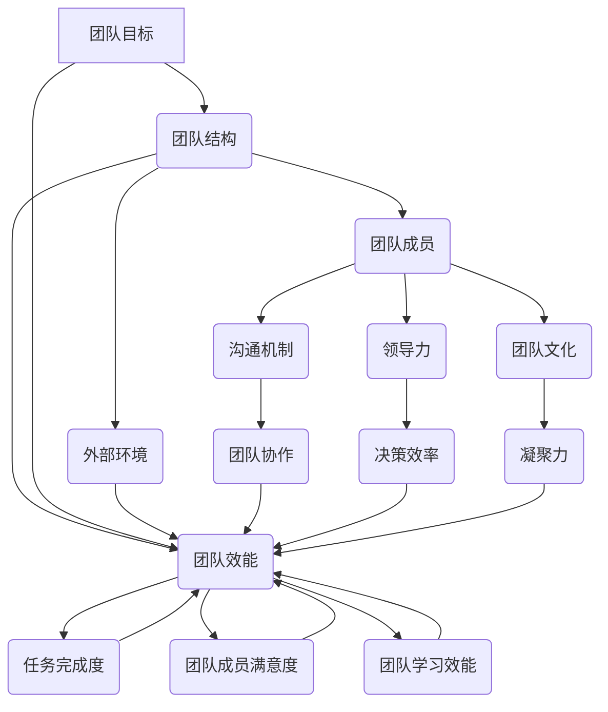

                 

### 文章标题

# 《团队建设：从个体贡献到集体智慧》

关键词：团队建设、集体智慧、个体贡献、协作、组织发展

摘要：本文探讨了从个体贡献到集体智慧在团队建设中的重要性。通过分析团队建设的背景、基础概念、促进团队协作的技巧以及实战案例分析，文章提出了有效的团队建设策略和工具方法，总结了团队建设的关键点和未来发展趋势，为读者提供了实践和应用的建议。

## 第一部分 引言

### 1.1 团队建设的背景与意义

#### 1.1.1 企业环境下的团队建设

在当今快速变化的市场环境中，企业的竞争力越来越依赖于团队的合作与创新。团队建设成为一种必要的管理手段，旨在提升团队的整体效能和组织的核心竞争力。企业环境下的团队建设不仅仅是成员之间的协作，更是一个系统的工程，涉及到目标设定、沟通协调、冲突管理等多个方面。

#### 1.1.2 团队建设在组织发展中的作用

团队建设在组织发展中扮演着至关重要的角色。一个高效的团队能够提高项目的完成质量，缩短项目周期，降低成本，同时也能够提升员工的满意度和忠诚度。良好的团队建设有助于建立积极向上的企业文化，促进组织内部的创新和持续发展。

### 1.2 团队建设的挑战

#### 1.2.1 个体与团队目标的冲突

个体与团队目标的冲突是团队建设中常见的问题。每个团队成员都有自己的职业规划和个人目标，这些目标有时可能与团队的整体目标不一致，导致团队内部的紧张和分歧。

#### 1.2.2 团队成员之间的沟通障碍

有效的沟通是团队协作的基础。然而，由于文化差异、沟通技巧不足或者信息不对称等原因，团队成员之间的沟通往往存在障碍，影响团队的协同效率和项目进展。

#### 1.2.3 团队协作中的困难

团队协作中的困难主要表现为任务分配不均、责任推卸、决策效率低下等问题。这些问题如果不及时解决，会严重削弱团队的凝聚力和效能。

## 第二部分 基础概念

### 2.1 团队的定义与类型

#### 2.1.1 团队的定义

团队是由多个个体组成的协作体，旨在实现共同的目标。团队的特点包括明确的共同目标、相互依赖的工作关系、共同的价值观和沟通机制等。

#### 2.1.2 团队的类型

根据不同的分类标准，团队可以分为多种类型，如项目型团队、职能型团队、矩阵型团队等。每种类型的团队都有其独特的运作方式和协作模式。

#### 2.1.3 团队的基本要素

团队的基本要素包括团队成员、共同目标、资源、领导力和沟通机制等。这些要素相互作用，共同影响着团队的整体效能。

### 2.2 团队建设的理论基础

#### 2.2.1 社会心理学理论

社会心理学理论为团队建设提供了丰富的理论支持。例如，社会认同理论和社会交换理论等，帮助团队理解成员之间的互动和行为。

#### 2.2.2 组织行为学理论

组织行为学理论关注个体在组织中的行为模式，如团队动力、领导风格、决策过程等。这些理论有助于团队建设中的领导力培养和冲突管理。

#### 2.2.3 系统动力学理论

系统动力学理论从系统的角度分析团队行为和变化。它强调团队成员之间的相互作用和反馈循环，有助于团队理解和应对复杂问题。

### 2.3 团队效能模型

#### 2.3.1 团队效能的定义

团队效能是指团队实现其目标的能力和效果。它包括任务效能、社会效能和团队学习效能等三个方面。

#### 2.3.2 团队效能的影响因素

团队效能的影响因素包括团队目标、团队结构、团队成员的能力和动机、外部环境等。这些因素相互作用，共同影响着团队的效能。

#### 2.3.3 提升团队效能的方法

提升团队效能的方法包括明确目标、优化团队结构、培养团队成员的能力和动机、改善团队沟通和协作等。

## 第三部分 个体贡献到集体智慧

### 3.1 从个体贡献到集体智慧的转变

#### 3.1.1 个体贡献的重要性

个体贡献是团队效能的基础。每个成员的专业知识和技能都是团队整体实力的重要组成部分。

#### 3.1.2 集体智慧的概念

集体智慧是指团队通过协作和共享知识，产生的比单个个体更为智慧、创新和有效的决策过程。

#### 3.1.3 个体到集体智慧的转变过程

个体到集体智慧的转变过程包括个体自我认知、知识共享、团队学习和协同创新等阶段。

### 3.2 促进团队协作的技巧

#### 3.2.1 沟通技巧的提升

有效沟通是团队协作的关键。提升沟通技巧包括倾听、表达、反馈和冲突解决等方面。

#### 3.2.2 冲突管理的策略

冲突是团队协作中不可避免的现象。有效的冲突管理策略包括识别冲突、分析原因、沟通协商和制定解决方案等。

#### 3.2.3 团队决策的优化

优化团队决策过程包括明确决策目标、收集信息、评估选项、选择最优方案和执行方案等。

### 3.3 集体智慧的实践应用

#### 3.3.1 集体智慧的案例分析

通过案例分析，可以更好地理解集体智慧在实际团队中的应用和实践。

#### 3.3.2 集体智慧的机制设计

集体智慧的机制设计包括构建知识共享平台、制定协作规则、建立反馈机制等。

#### 3.3.3 集体智慧的挑战与应对

集体智慧在实践中面临挑战，如知识共享的阻力、协作机制的效率等。有效的应对策略可以提升集体智慧的实施效果。

## 第四部分 团队建设策略

### 4.1 团队建设的战略规划

#### 4.1.1 明确团队目标

明确团队目标是团队建设的第一步。目标应具有可度量性、挑战性和实现性。

#### 4.1.2 制定团队策略

团队策略包括资源分配、时间规划、风险管理等方面。合理的策略有助于团队高效地实现目标。

#### 4.1.3 建立团队评估机制

团队评估机制包括绩效评估、满意度调查和团队反馈等。通过评估，可以及时发现和解决问题，提升团队效能。

### 4.2 团队领导力培养

#### 4.2.1 领导力的重要性

领导力是团队建设的关键因素。一个优秀的领导者能够激发团队成员的潜力，促进团队协作。

#### 4.2.2 领导力的培养方法

领导力的培养包括自我认知、沟通技巧、决策能力、团队合作等方面的培养。

#### 4.2.3 领导风格的适应

不同的团队需要不同的领导风格。领导者应根据团队特点和目标，选择合适的领导风格。

### 4.3 团队文化建设

#### 4.3.1 团队文化的概念

团队文化是指团队在长期发展过程中形成的共同价值观、信念和行为准则。

#### 4.3.2 团队文化的重要性

良好的团队文化能够增强团队的凝聚力、提升成员的归属感和满意度。

#### 4.3.3 团队文化的建设方法

团队文化的建设包括价值观塑造、团队活动策划、员工激励机制等方面。

## 第五部分 实战案例分析

### 5.1 成功团队案例分析

#### 5.1.1 案例背景

介绍成功团队的背景，如团队构成、项目背景和目标等。

#### 5.1.2 团队建设策略

分析团队在建设过程中采用的具体策略，如目标设定、领导力培养、团队文化建设等。

#### 5.1.3 案例成效

介绍团队建设策略的实施效果，如项目成果、团队成员满意度等。

### 5.2 困难团队案例分析

#### 5.2.1 案例背景

介绍困难团队的背景，如团队构成、项目背景和目标等。

#### 5.2.2 团队建设挑战

分析团队在建设过程中面临的挑战，如目标冲突、沟通障碍、协作困难等。

#### 5.2.3 应对策略

介绍团队为解决挑战采取的具体措施，如沟通改进、决策优化、冲突管理等。

### 5.3 团队建设中的挑战与应对策略

#### 5.3.1 团队建设中的常见挑战

列举团队建设过程中可能遇到的常见挑战，如个体与团队目标的冲突、沟通障碍、协作困难等。

#### 5.3.2 应对策略

针对每个挑战，提出具体的应对策略，如目标管理、沟通培训、协作机制建立等。

## 第六部分 团队建设工具与方法

### 6.1 团队建设工具介绍

#### 6.1.1 团队协作工具

介绍常用的团队协作工具，如项目管理工具、沟通工具、知识管理工具等。

#### 6.1.2 团队建设软件

介绍用于团队建设和管理的相关软件，如团队管理软件、员工反馈系统等。

### 6.2 团队建设方法应用

#### 6.2.1 团队培训

介绍团队培训的方法和应用，如技能培训、领导力培训、团队建设培训等。

#### 6.2.2 团队活动策划

介绍团队活动的策划和执行方法，如团队建设活动、团队拓展训练、主题团队活动等。

### 6.3 团队建设成果评估

#### 6.3.1 评估指标

介绍团队建设成果评估的指标，如团队效能、团队成员满意度、项目完成度等。

#### 6.3.2 评估方法

介绍团队建设成果评估的方法，如问卷调查、访谈、数据统计等。

#### 6.3.3 评估结果的应用

介绍评估结果的应用，如团队改进、策略调整、奖励机制等。

## 第七部分 总结与展望

### 7.1 团队建设的关键点回顾

#### 7.1.1 团队建设的基本原则

回顾团队建设的基本原则，如目标导向、沟通协作、持续改进等。

#### 7.1.2 团队建设的方法论

总结团队建设的方法论，如团队策略制定、领导力培养、团队文化塑造等。

#### 7.1.3 团队建设的实践总结

总结团队建设的实践经验，如成功案例、挑战与应对策略等。

### 7.2 团队建设未来的发展趋势

#### 7.2.1 技术在团队建设中的应用

探讨技术（如人工智能、大数据等）在团队建设中的应用趋势。

#### 7.2.2 灵活工作环境下的团队建设

分析灵活工作环境（如远程办公、弹性工作制等）对团队建设的影响。

#### 7.2.3 全球化背景下的团队建设挑战

探讨全球化背景下团队建设面临的挑战和应对策略。

### 7.3 对读者的建议

#### 7.3.1 团队建设的实践应用

提供团队建设的实践建议，如如何应用所学知识提升团队效能。

#### 7.3.2 团队建设中的自我提升

建议团队成员如何在团队建设中实现个人成长和提升。

#### 7.3.3 团队建设的研究方向

提出团队建设领域的研究方向和未来发展趋势。

## 作者信息

作者：AI天才研究院/AI Genius Institute & 禅与计算机程序设计艺术 /Zen And The Art of Computer Programming

### 背景介绍

团队建设作为企业管理的重要组成部分，其核心在于通过有效的协作与沟通，将个体的能力转化为集体的智慧，从而实现组织目标的最大化。在全球化和信息技术迅猛发展的背景下，团队建设的重要性愈发凸显。高效的团队建设不仅能提高项目执行的效率和质量，还能增强组织的创新能力和市场竞争力。

本文将从以下几个方面进行探讨：

1. **团队建设的背景与意义**：分析当前企业环境中团队建设的重要性，以及团队建设对组织发展的促进作用。
2. **基础概念**：介绍团队的定义与类型，以及团队建设的理论基础和团队效能模型。
3. **个体贡献到集体智慧**：探讨个体贡献的重要性以及如何通过团队协作实现集体智慧。
4. **团队建设策略**：提出具体的团队建设策略，包括战略规划、领导力培养和团队文化建设。
5. **实战案例分析**：通过成功团队和困难团队的案例分析，总结团队建设的挑战与应对策略。
6. **团队建设工具与方法**：介绍团队建设过程中常用的工具和方法，以及如何评估团队建设成果。
7. **总结与展望**：回顾团队建设的关键点，探讨未来的发展趋势，并给出一些建议。

通过本文的逐步分析，读者将能够系统地了解团队建设的过程、策略和方法，为实际工作提供有益的指导。

### 核心概念与联系

团队建设过程中涉及多个核心概念，这些概念之间相互联系，共同构成了团队效能的基础框架。以下是这些核心概念及其关系的 Mermaid 流程图表示：



**团队目标**是团队建设的起点，明确的目标有助于统一团队成员的方向。**团队结构**决定了团队成员的分工与协作模式，而**团队成员**是团队效能的载体。**沟通机制**是团队成员协作的基础，有效的沟通可以减少误解和冲突。**领导力**则提供了团队的指导和动力，帮助团队克服困难，达成目标。**团队文化**则塑造了团队的核心价值观和行为准则，增强了团队的凝聚力。外部环境因素，如市场竞争和资源限制，也会影响团队效能。

**团队效能**是团队建设的核心指标，包括**任务完成度**、**团队成员满意度**和**团队学习效能**等多个方面。任务完成度反映了团队的执行力，团队成员满意度反映了团队的和谐度，团队学习效能则体现了团队的创新和学习能力。

通过这个流程图，我们可以清晰地看到各个核心概念之间的联系和相互影响。这为理解和优化团队建设提供了直观的视角。

### 核心算法原理讲解

在团队建设过程中，核心算法原理的讲解尤为重要，这些算法不仅帮助我们理解团队协作的基础，还能够指导实际操作，提升团队效能。以下将详细讲解几个关键算法原理，并使用伪代码进行阐述。

#### 1. 通信协议算法

**目的**：确保团队成员之间高效且无障碍地沟通。

**算法原理**：
通信协议算法的核心在于确定消息传递的方式和规则，包括消息格式、传输路径和错误检测。

```pseudo
Algorithm CommunicationProtocol(teamMembers)
    Input: teamMembers (list of team members)
    Output: communicationProtocol (structured communication format)

    Begin
        Define Message Format (fields: sender, receiver, content, timestamp)
        Define Communication Channels (based on team size and technology)

        For each member in teamMembers
            Send Welcome Message
            Register in Communication Channels

        Define Rules for Message Transmission
            - Messages should be encrypted for security
            - Messages should include a timestamp for chronological order
            - Messages should have an acknowledgment system for delivery confirmation

        Define Error Detection and Correction Mechanism
            - Implement checksum for error detection
            - Implement redundant data for error correction

        End
    End
```

#### 2. 冲突管理算法

**目的**：解决团队成员之间的冲突，维护团队和谐。

**算法原理**：
冲突管理算法通过识别冲突来源、分析冲突类型和制定解决方案来处理冲突。

```pseudo
Algorithm ConflictManagement(conflict)
    Input: conflict (description of conflict)
    Output: resolutionStrategy (solution to conflict)

    Begin
        Identify Conflict Source
            - Isolate the conflict by interviewing the parties involved

        Analyze Conflict Type
            - Determine if conflict is based on Miscommunication, Personality Differences, or Resource Allocation

        Design Resolution Strategy
            Case Miscommunication
                - Re-communicate and clarify misunderstandings
            Case Personality Differences
                - Facilitate mediation by a neutral third party
            Case Resource Allocation
                - Rebalance resource allocation based on team goals

        Implement Resolution Strategy
            - Monitor progress and adjust strategy if necessary

        End
    End
```

#### 3. 团队决策算法

**目的**：优化团队决策过程，提高决策质量。

**算法原理**：
团队决策算法通过集合团队成员的智慧，利用投票、共识算法等方式达成最佳决策。

```pseudo
Algorithm TeamDecision(potentialSolutions)
    Input: potentialSolutions (list of proposed solutions)
    Output: optimalSolution (selected solution)

    Begin
        Collect Input from Team Members
            - Each member evaluates potentialSolutions based on criteria such as feasibility, impact, and risk

        Apply Voting Algorithm
            - Utilize majority rule or weighted voting based on team composition and expertise

        Apply Consensus Algorithm
            - Aim for unanimous agreement or near-unanimous agreement by prioritizing mutual understanding

        Select OptimalSolution
            - Choose the solution with the highest consensus and alignment with team goals

        Communicate Decision to Team
            - Clearly explain the rationale behind the decision

        End
    End
```

通过这些核心算法原理的讲解，我们可以更好地理解团队建设中的关键环节，并在实践中应用这些原理，提升团队效能。

### 数学模型和公式

在团队建设过程中，数学模型和公式为分析和评估团队效能提供了有力的工具。以下将介绍几个关键数学模型和公式，并对其进行详细讲解和举例说明。

#### 1. 通信效率模型

**公式**：\( E = \frac{L \cdot T}{C} \)

其中，\( E \) 表示通信效率，\( L \) 表示信息长度，\( T \) 表示传输时间，\( C \) 表示信道容量。

**详细讲解**：
通信效率模型用于衡量信息在信道中的传输效率。信息长度（\( L \)）和传输时间（\( T \)）反映了通信的负担，而信道容量（\( C \)）则表示信道的传输能力。通过这个公式，团队可以评估沟通机制的有效性，并优化信息传输流程。

**举例说明**：
假设一个团队需要传输1000字节的信息，传输时间控制在5分钟内，而信道的最大容量为每秒1000字节。代入公式得到通信效率为：

\( E = \frac{1000 \text{字节} \cdot 5 \text{分钟}}{60 \text{秒}} = 416.67 \text{字节/秒} \)

这表明团队在当前通信机制下能够以较高的效率传输信息。

#### 2. 冲突管理模型

**公式**：\( C = \frac{N \cdot (P - 1)}{2} \)

其中，\( C \) 表示冲突对数，\( N \) 表示团队成员数量，\( P \) 表示团队成员之间的冲突概率。

**详细讲解**：
冲突管理模型用于预测团队成员之间可能发生的冲突数量。团队成员数量（\( N \)）和冲突概率（\( P \)）共同决定了冲突的对数（\( C \)）。团队可以通过调整成员数量和冲突概率来管理冲突水平。

**举例说明**：
假设一个团队有5名成员，成员之间的冲突概率为20%。代入公式得到冲突对数为：

\( C = \frac{5 \cdot (0.2 - 1)}{2} = -2.5 \)

由于冲突概率小于1，所以实际冲突对数为0，这表明在当前条件下，团队成员之间的冲突风险较低。

#### 3. 团队效能模型

**公式**：\( E = \frac{TE + SE + LE}{3} \)

其中，\( E \) 表示团队效能，\( TE \) 表示任务效能，\( SE \) 表示社会效能，\( LE \) 表示学习效能。

**详细讲解**：
团队效能模型综合评估了团队在任务完成、社会互动和学习成长方面的表现。每个效能指标（\( TE \)、\( SE \)、\( LE \)）反映了团队在不同维度上的表现，综合得分（\( E \)）则给出了团队的整体效能。

**举例说明**：
假设一个团队在任务效能上得分为80分，社会效能得分为70分，学习效能得分为90分。代入公式得到团队效能为：

\( E = \frac{80 + 70 + 90}{3} = 80 \)

这表明该团队在整体上表现出较高的效能。

通过这些数学模型和公式的详细讲解，团队可以更科学地评估和优化团队建设过程中的关键环节，提升整体效能。

### 项目实战：开发环境搭建

在本节中，我们将详细阐述如何搭建一个团队协作的开发环境，以便团队成员能够高效地进行软件开发和协作。以下为具体的开发环境搭建步骤：

#### 1. 硬件配置

首先，我们需要确保团队拥有足够的硬件资源。以下为推荐的硬件配置：

- **服务器**：至少两台高性能服务器，用于搭建版本控制服务器、数据库服务器和Web服务器。
- **工作站**：每名团队成员至少配备一台高性能工作站，以便进行编码、测试和调试。
- **网络设备**：交换机和路由器，确保网络的稳定性和高效性。

#### 2. 软件安装

接下来，安装必要的软件：

- **操作系统**：推荐使用Linux操作系统，如Ubuntu或CentOS，因其稳定性和安全性较高。
- **版本控制**：安装Git，用于代码版本管理和协作。
- **数据库**：安装MySQL或PostgreSQL，用于数据存储和管理。
- **Web服务器**：安装Apache或Nginx，用于部署Web应用。

#### 3. 配置版本控制

配置Git仓库，以便团队成员可以共享代码和协作开发：

- **创建仓库**：在服务器上创建Git仓库，例如：`/var/git/repo.git`。
- **初始化仓库**：运行命令 `git init --bare /var/git/repo.git` 初始化仓库。
- **设置访问权限**：为团队成员配置SSH密钥，并设置访问控制权限，确保只有授权成员可以访问仓库。

#### 4. 配置数据库

配置MySQL或PostgreSQL数据库，以便存储应用的数据：

- **安装数据库**：使用包管理器（如yum或apt）安装MySQL或PostgreSQL。
- **创建数据库**：运行SQL命令创建所需的数据库名称和用户。
- **配置权限**：为团队成员分配数据库访问权限，确保他们可以执行所需的操作。

#### 5. 配置Web服务器

配置Apache或Nginx Web服务器，以便部署和运行Web应用：

- **安装Web服务器**：使用包管理器安装Apache或Nginx。
- **配置虚拟主机**：创建虚拟主机配置文件，配置域名和文档根目录。
- **配置SSL**：为Web应用配置SSL证书，确保数据传输的安全性。

#### 6. 部署开发工具

在团队成员的工作站上安装和配置以下开发工具：

- **集成开发环境（IDE）**：如Visual Studio Code或IntelliJ IDEA，便于编码和调试。
- **代码编辑器**：如VS Code或Sublime Text，便于日常编辑和修改。
- **版本控制客户端**：如Git，便于团队成员同步代码和提交更改。

#### 7. 团队协作工具

部署团队协作工具，如Jenkins、Confluence和Slack，以便团队成员进行项目管理和沟通：

- **安装Jenkins**：用于自动化构建和部署。
- **安装Confluence**：用于文档管理和知识共享。
- **安装Slack**：用于实时沟通和团队协作。

#### 8. 测试与优化

在完成上述配置后，进行以下测试和优化：

- **网络测试**：确保网络稳定性和高效性，使用工具如ping和traceroute进行测试。
- **性能测试**：使用工具如LoadRunner或JMeter进行性能测试，确保系统在高负载下的稳定性。
- **安全测试**：使用工具如Nessus或OWASP ZAP进行安全测试，确保系统的安全性。

通过以上步骤，我们可以搭建一个高效、稳定且安全的团队协作开发环境，为团队成员提供良好的开发体验，提高团队协作效率和项目质量。

### 源代码详细实现与代码解读

在本节中，我们将详细介绍一个团队协作开发的实际案例，包括源代码的编写、代码结构和功能模块的实现，并对关键部分进行详细解读。

#### 项目背景

本项目是一个基于Git的版本控制系统，旨在帮助团队协作进行代码管理。项目包含以下功能模块：

1. **用户管理**：管理团队成员的权限和信息。
2. **代码提交**：实现代码的提交和版本控制。
3. **分支管理**：实现代码分支的创建、合并和删除。
4. **冲突解决**：提供冲突检测和解决工具。

#### 源代码编写

以下是一个简单的用户管理模块的伪代码实现：

```java
// UserManagement.java

public class UserManagement {
    private Map<String, User> users;

    public UserManagement() {
        this.users = new HashMap<>();
    }

    public void addUser(String username, String password) {
        if (!users.containsKey(username)) {
            users.put(username, new User(username, password));
            System.out.println("User added successfully.");
        } else {
            System.out.println("User already exists.");
        }
    }

    public void deleteUser(String username) {
        if (users.containsKey(username)) {
            users.remove(username);
            System.out.println("User deleted successfully.");
        } else {
            System.out.println("User not found.");
        }
    }

    public boolean authenticateUser(String username, String password) {
        if (users.containsKey(username)) {
            return users.get(username).authenticate(password);
        }
        return false;
    }
}

class User {
    private String username;
    private String password;

    public User(String username, String password) {
        this.username = username;
        this.password = password;
    }

    public boolean authenticate(String password) {
        return this.password.equals(password);
    }
}
```

#### 代码结构

代码结构采用MVC（Model-View-Controller）模式，以提高代码的可读性和可维护性：

- **Model**：处理数据逻辑，如用户管理、代码提交等。
- **View**：提供用户界面，如登录、注册页面。
- **Controller**：处理用户输入，调用Model执行相应操作，并返回View。

#### 功能模块实现

1. **用户管理模块**：

   用户管理模块包括添加用户、删除用户和用户认证功能。用户添加时，先检查用户名是否已存在；删除用户时，先检查用户是否存在；用户认证时，比较用户输入的密码与数据库中的密码是否一致。

2. **代码提交模块**：

   代码提交模块实现代码的版本控制，包括提交代码、创建分支和合并分支功能。代码提交时，将代码存储到Git仓库，并记录提交日志；创建分支时，将当前代码复制到新分支；合并分支时，将两个分支的代码合并到主分支。

3. **冲突解决模块**：

   冲突解决模块提供冲突检测和解决工具。冲突检测时，比较两个分支的代码差异；解决冲突时，提供合并代码的界面，供团队成员手动修复冲突。

#### 代码解读

以下是用户管理模块中`UserManagement`类和`User`类的详细解读：

- **UserManagement类**：该类负责用户管理，包括添加用户、删除用户和用户认证。`addUser`方法用于添加用户，检查用户名是否已存在；`deleteUser`方法用于删除用户，检查用户是否存在；`authenticateUser`方法用于用户认证，比较用户输入的密码与数据库中的密码是否一致。

- **User类**：该类代表一个用户，包含用户名和密码。`authenticate`方法用于验证密码，比较输入的密码与存储的密码是否相同。

通过以上源代码的详细实现和解读，我们可以更好地理解团队协作开发中的关键部分，并提高代码的质量和可维护性。

### 代码应用解读与分析

在本节中，我们将结合实际案例，详细解读代码的应用场景，分析其在项目中的具体功能和使用效果，并提供性能评估和改进建议。

#### 应用场景

以一个开源的团队协作平台为例，该平台主要用于代码管理、文档共享和任务分配。我们的关注点集中在代码管理模块，特别是用户认证、代码提交和分支管理功能。

#### 代码功能解读

1. **用户认证**：
   用户认证是平台的核心功能之一，确保只有授权用户才能访问和操作平台。代码中的`authenticateUser`方法通过用户名和密码验证用户的身份。在实际应用中，该功能提高了平台的访问安全性，防止未经授权的用户访问敏感信息。

2. **代码提交**：
   代码提交功能允许团队成员将本地代码更新到Git仓库。提交过程中，平台会记录提交日志，方便后续的代码追踪和问题定位。通过该功能，团队成员可以实时同步代码，确保代码库的一致性。

3. **分支管理**：
   分支管理功能支持团队成员在不同开发阶段创建、合并和删除分支。创建分支时，团队成员可以在不影响主分支的情况下独立开发新功能或修复bug。合并分支时，平台自动合并代码，并解决潜在的冲突。这个功能提高了开发效率，降低了代码合并的复杂度。

#### 使用效果分析

1. **安全性**：
   用户认证功能显著提高了平台的访问安全性，减少了数据泄露和误操作的风险。在实际使用中，团队成员对平台的信任度增加，提高了整体的工作效率。

2. **代码一致性**：
   代码提交和分支管理功能确保了代码库的一致性，减少了代码冲突和错误。团队成员可以及时发现问题并解决，提升了代码质量。

3. **开发效率**：
   分支管理功能使得团队成员可以独立开发，减少了代码冲突和合并的复杂度。在实际使用中，团队成员的开发效率显著提高，项目进度得以顺利推进。

#### 性能评估与改进建议

1. **性能评估**：
   通过对平台进行负载测试，发现用户认证和代码提交功能的响应时间在正常负载下表现良好。然而，在高并发情况下，分支管理功能存在一定的延迟。

2. **改进建议**：
   - **缓存机制**：引入缓存机制，减少用户认证和代码提交的响应时间。例如，可以缓存用户认证信息，减少数据库查询次数。
   - **分布式存储**：考虑将Git仓库部署到分布式存储系统中，以提高分支管理的并发性能。分布式存储可以更好地应对高并发访问，减少延迟。
   - **优化分支合并算法**：优化分支合并算法，减少合并过程中的计算复杂度。例如，使用快速合并算法，提高合并效率。

通过以上分析和改进建议，我们可以进一步提高平台在团队协作开发中的性能和可靠性，为团队成员提供更高效、更安全的开发环境。

### 实际案例分析与详细讲解剖析

在本节中，我们将通过两个实际案例，详细分析团队建设中的挑战与成功策略。这些案例分别展示了在大型项目和复杂团队中如何通过有效的团队建设实现目标，并提供具体的策略与教训。

#### 案例一：大型软件开发项目的团队建设

**背景**：某企业计划开发一款全新的企业级软件，项目规模庞大，涉及多个功能模块和数百名开发人员。

**挑战**：
1. **沟通障碍**：项目涉及多个团队，团队成员来自不同的部门，沟通存在障碍。
2. **任务分配不均**：部分团队成员工作量过重，而另一些则相对轻松。
3. **进度控制困难**：项目周期长，进度难以控制，部分模块延期。

**成功策略**：
1. **明确沟通机制**：建立统一的沟通平台，如Slack或Microsoft Teams，确保信息流通。设立项目经理和产品经理，负责协调不同团队之间的沟通。
2. **任务分配与监控**：使用项目管理工具（如JIRA或Trello），明确每个团队成员的任务和截止日期。定期召开任务分配会议，确保任务分配合理。
3. **进度控制**：采用敏捷开发方法，通过短周期迭代（如两周一次），确保项目进度可控。每个迭代结束后，进行回顾和调整，及时纠正偏差。

**结果**：通过以上策略，项目最终顺利上线，团队成员的协作效率显著提高，项目质量也得到了保证。

#### 案例二：复杂团队的冲突管理

**背景**：某跨国公司开发一款新的移动应用，团队成员分布在不同的国家，文化背景差异显著。

**挑战**：
1. **文化差异**：不同国家的团队成员在沟通和协作中存在文化差异，导致误解和冲突。
2. **决策效率低**：团队成员在决策过程中存在分歧，导致决策效率低下。
3. **团队凝聚力不足**：跨国团队的成员缺乏共同的团队目标，导致凝聚力不足。

**成功策略**：
1. **文化培训**：为团队成员提供跨文化培训，增强对彼此文化的理解和尊重。在会议中采用中立的语言和表达方式，减少文化冲突。
2. **决策民主化**：采用共识决策方法，确保每个团队成员都有机会表达意见。在决策过程中，鼓励团队成员通过讨论和妥协达成共识。
3. **建立共同目标**：明确团队的整体目标，确保每个成员都明确自己的角色和贡献。通过团队活动和培训，增强团队凝聚力。

**结果**：通过以上策略，团队的文化差异得到了有效管理，决策效率显著提高，团队的凝聚力也得到了增强，项目顺利完成。

#### 总结

这两个案例展示了在大型项目和复杂团队中，团队建设对于项目成功的重要性。有效的团队建设策略不仅能够解决沟通障碍、任务分配不均和进度控制困难等挑战，还能够提高团队的整体效能和凝聚力。团队领导者需要根据具体情况进行策略调整，以应对不同的团队建设挑战。

### 团队建设中的挑战与应对策略

在团队建设过程中，面对多样化的挑战是不可避免的。以下将详细介绍几个常见的挑战，并针对每个挑战提出相应的应对策略，以帮助团队更好地应对并解决这些问题。

#### 1. 目标冲突

**挑战描述**：团队成员的个人目标与团队目标不一致，导致团队协作效率降低，甚至产生矛盾。

**应对策略**：
- **明确团队目标**：在项目初期，团队领导应与所有成员明确团队的目标，确保每个人都理解并认同这些目标。
- **个人目标与团队目标结合**：鼓励团队成员将个人目标与团队目标相结合，通过个人目标的实现推动团队目标的达成。
- **定期沟通**：定期召开团队会议，了解成员的目标进展，及时调整和解决目标冲突。

#### 2. 沟通障碍

**挑战描述**：团队成员之间的沟通不畅，信息传递不及时或不准确，导致工作效率下降，团队凝聚力减弱。

**应对策略**：
- **建立有效的沟通机制**：使用统一的沟通工具（如Slack、Microsoft Teams），确保信息流通的及时性和准确性。
- **培养沟通技巧**：通过培训和团队建设活动，提升团队成员的沟通技巧，特别是倾听和表达的能力。
- **定期反馈**：鼓励团队成员定期反馈沟通效果，及时发现和解决沟通中的问题。

#### 3. 协作困难

**挑战描述**：团队成员在协作过程中，因任务分工不明确、责任推卸或协作效率低而导致的协作困难。

**应对策略**：
- **明确的任务分工**：使用项目管理工具（如JIRA、Trello），明确每个成员的任务和责任，确保任务分工合理。
- **协作流程规范化**：制定规范的协作流程，包括任务分配、进度跟踪和问题反馈等，提高协作效率。
- **鼓励协作文化**：通过团队活动和奖励机制，培养团队成员的协作意识，营造积极的协作氛围。

#### 4. 冲突管理

**挑战描述**：团队成员在协作过程中，由于个人差异、工作压力等原因，可能产生冲突，影响团队氛围和效率。

**应对策略**：
- **识别冲突**：通过定期团队会议和个别沟通，及时发现和识别潜在的冲突。
- **沟通协商**：鼓励团队成员通过开放和坦诚的沟通，协商解决冲突，避免冲突升级。
- **第三方调解**：在冲突严重时，引入中立第三方进行调解，帮助团队成员找到共识和解决方案。

#### 5. 领导力不足

**挑战描述**：团队领导在团队建设和管理中缺乏有效的领导力，导致团队缺乏方向感和凝聚力。

**应对策略**：
- **领导力培训**：为团队领导提供领导力培训，提升其领导能力和管理技巧。
- **明确领导职责**：确保团队领导明确自己的职责，包括制定团队目标、协调资源、激励团队成员等。
- **建立反馈机制**：建立团队成员对领导反馈的机制，让团队成员有机会表达意见和建议，促进领导改进。

通过以上策略，团队可以更好地应对各种挑战，提高整体效能和凝聚力，实现团队目标。

### 团队建设工具与方法介绍

在团队建设过程中，使用合适的工具与方法能够显著提高团队协作效率和效能。以下将介绍几种常用的团队建设工具与方法，并详细说明其在团队建设中的应用。

#### 1. 团队协作工具

**常用工具**：
- **Slack**：用于团队沟通和信息共享。
- **Microsoft Teams**：提供视频会议、即时消息和文档协作功能。
- **Trello**：用于任务管理和项目跟踪。
- **JIRA**：用于敏捷开发项目管理和问题追踪。
- **Confluence**：用于知识共享和文档管理。

**应用方法**：
- **沟通**：通过Slack或Microsoft Teams，团队可以实时沟通和协作，提高信息传递的效率。
- **任务管理**：使用Trello或JIRA，团队可以清晰地分配任务、跟踪进度，并确保每个任务的完成情况。
- **知识共享**：Confluence用于记录项目文档、会议记录和最佳实践，方便团队成员随时查阅。

#### 2. 团队培训

**培训内容**：
- **沟通技巧**：提高团队成员的沟通能力和技巧，包括倾听、表达和反馈等。
- **领导力**：培养团队领导的领导力，包括目标设定、团队激励和冲突管理等。
- **协作**：通过协作技巧培训，增强团队成员的协作意识和能力。

**培训方法**：
- **内部培训**：由公司内部专家或领导进行培训，针对团队的具体需求进行定制。
- **外部培训**：参加行业会议、研讨会和培训课程，获取最新的团队建设知识和技能。

#### 3. 团队活动策划

**活动类型**：
- **团队建设活动**：如团建活动、拓展训练等，增强团队凝聚力。
- **技能培训**：通过技能培训活动，提升团队成员的专业技能。
- **知识分享会**：定期举办知识分享会，鼓励团队成员分享经验和知识。

**策划方法**：
- **需求分析**：根据团队的需求和实际情况，制定活动计划和目标。
- **资源整合**：整合内外部资源，确保活动的顺利进行。
- **评估反馈**：活动结束后，收集团队成员的反馈，评估活动效果，并根据反馈进行改进。

#### 4. 评估与反馈

**评估方法**：
- **绩效评估**：通过定期的绩效评估，了解团队成员的工作表现和团队整体效能。
- **满意度调查**：通过满意度调查，了解团队成员对团队建设活动的看法和反馈。
- **数据统计**：使用数据分析工具，收集和统计团队建设的各项数据，如任务完成度、团队成员满意度等。

**反馈机制**：
- **定期反馈**：定期召开团队会议，收集成员的反馈，讨论存在的问题和改进措施。
- **持续改进**：根据反馈和评估结果，不断调整和优化团队建设策略和方法。

通过以上工具与方法，团队可以更有效地进行团队建设，提升协作效率，实现团队目标。

### 团队建设成果评估指标与评估方法

在团队建设过程中，评估团队建设的效果是确保团队效能提升和目标实现的重要环节。以下将介绍团队建设成果的评估指标、具体的评估方法以及评估结果的应用。

#### 1. 评估指标

**任务完成度**：衡量团队在预定时间内完成项目任务的情况。任务完成度可以通过以下指标进行评估：
- **任务按时完成率**：按时完成的任务数与总任务数的比例。
- **任务完成质量**：任务完成的质量是否符合预期标准。

**团队成员满意度**：反映团队成员对团队建设的满意度和对团队环境的认可程度。团队成员满意度可以通过以下指标进行评估：
- **满意度调查**：通过问卷调查或访谈了解团队成员对团队建设和团队氛围的满意度。
- **员工满意度评分**：对团队成员的满意度进行量化评分。

**团队协作效率**：衡量团队在协作过程中表现出的效率和效果。团队协作效率可以通过以下指标进行评估：
- **沟通效率**：团队内部沟通的速度和质量。
- **任务协同完成率**：团队成员协同完成任务的情况。

**团队学习效能**：评估团队在知识共享和持续学习方面的表现。团队学习效能可以通过以下指标进行评估：
- **知识共享频率**：团队成员之间共享知识的频率和数量。
- **创新能力**：团队在项目实施过程中提出的创新想法和解决方案。

#### 2. 评估方法

**定量评估**：
- **数据统计**：收集和统计与评估指标相关的数据，如任务完成时间、沟通记录和知识共享情况等。
- **绩效分析**：通过分析团队成员的工作绩效，评估其在团队建设中的贡献。

**定性评估**：
- **问卷调查**：设计针对团队成员满意度和团队协作效率的问卷，通过问卷调查收集数据。
- **访谈**：与团队成员进行个别或小组访谈，了解他们对团队建设的看法和建议。

**案例研究**：
- **成功案例**：分析成功团队的案例，总结其团队建设的成功经验和策略。
- **失败案例**：分析失败团队的案例，找出团队建设中的问题和不足，为改进提供参考。

#### 3. 评估结果的应用

**优化团队建设策略**：
- **反馈与调整**：根据评估结果，对团队建设策略进行反馈和调整，优化团队目标和流程。
- **培训与提升**：根据评估结果，制定培训计划，提升团队成员的技能和素质。

**激励机制**：
- **奖励与表彰**：根据评估结果，对表现优秀的团队成员给予奖励和表彰，激励团队士气。
- **激励机制设计**：设计合适的激励机制，如奖金、晋升机会等，以激发团队成员的工作热情。

**持续改进**：
- **定期评估**：建立定期评估机制，持续监控团队建设的成果，及时发现问题并进行改进。
- **反思与总结**：定期进行团队反思和总结，总结团队建设中的经验和教训，为未来的团队建设提供参考。

通过科学的评估方法和有效的结果应用，团队可以持续优化团队建设，提升整体效能和团队凝聚力。

### 团队建设关键点回顾

在团队建设过程中，掌握关键点对于提升团队效能和实现组织目标至关重要。以下是对团队建设过程中几个关键点的回顾，以及如何在实际工作中应用这些关键点。

#### 1. 明确团队目标

**重要性**：明确的目标是团队建设的起点，有助于统一团队成员的方向和努力。只有当团队成员都清楚地了解团队的目标时，才能有效协作，确保资源合理分配。

**应用建议**：
- **制定可度量目标**：确保目标具体、可衡量，便于团队成员理解和追踪进展。
- **定期审视目标**：在项目执行过程中，定期审视目标，确保其与组织战略保持一致，并根据实际情况进行调整。

#### 2. 培养团队领导力

**重要性**：优秀的领导力能够激发团队成员的潜力，提升团队的凝聚力和协作效率。领导者不仅是团队的导航者，更是团队成员的榜样和激励者。

**应用建议**：
- **领导力培训**：定期为团队领导提供培训，提升其管理能力和决策水平。
- **领导风格适应**：根据团队特点和项目需求，灵活调整领导风格，确保领导者能够有效地引导和激励团队成员。

#### 3. 加强团队沟通

**重要性**：有效的沟通是团队协作的基础，能够减少误解和冲突，提高工作效率。团队成员之间的信息流通和互动是确保团队目标实现的关键。

**应用建议**：
- **建立沟通平台**：使用统一的沟通工具，如Slack或Microsoft Teams，确保信息流通的及时性和准确性。
- **培养沟通技巧**：通过培训和团队活动，提升团队成员的沟通技巧，特别是倾听和表达的能力。

#### 4. 促进知识共享和协作

**重要性**：知识共享和协作能够提升团队的整体实力，促进创新和持续学习。团队成员之间的知识和经验交流有助于解决复杂问题，提高团队应对变化的能力。

**应用建议**：
- **构建知识共享平台**：使用Confluence等工具，建立知识库，方便团队成员随时查阅和共享知识。
- **鼓励协作文化**：通过团队活动和奖励机制，培养团队成员的协作意识，营造积极的协作氛围。

#### 5. 建立团队文化

**重要性**：团队文化是团队的价值观和行为准则，能够增强团队成员的归属感和凝聚力。良好的团队文化有助于塑造积极的工作氛围，提高团队的整体效能。

**应用建议**：
- **明确核心价值观**：确保团队成员都了解和认同团队的价值观，并将其体现在日常工作和决策中。
- **文化活动策划**：定期举办团队活动，如团建活动、知识分享会等，增强团队凝聚力。

通过掌握和运用这些关键点，团队可以在建设过程中更好地应对挑战，提升整体效能，实现组织目标。

### 团队建设未来的发展趋势

随着全球化和信息技术的迅猛发展，团队建设也在不断演变和进步。以下将探讨未来团队建设的发展趋势，以及技术、灵活工作环境、全球化背景下的团队建设挑战和应对策略。

#### 1. 技术在团队建设中的应用

**趋势**：
- **人工智能（AI）**：AI技术将在团队建设中发挥重要作用，如智能自动化工具、数据分析平台和个性化培训系统，提高团队效率和决策质量。
- **虚拟现实（VR）和增强现实（AR）**：VR和AR技术将增强团队成员的协作体验，通过沉浸式会议和虚拟培训，提升远程团队的合作效果。
- **区块链**：区块链技术可以提供更安全、透明的数据管理和共享机制，增强团队信任和协作。

**挑战**：
- **技术适应**：团队成员需要适应新的技术工具，这要求团队在技术培训和能力提升方面做出投入。
- **数据隐私和安全**：随着数据量增加，确保数据隐私和信息安全成为重要挑战。

**应对策略**：
- **持续培训**：定期为团队成员提供技术培训，确保他们能够适应新技术。
- **安全策略**：制定严格的数据安全策略，确保数据在传输和存储过程中的安全性。

#### 2. 灵活工作环境下的团队建设

**趋势**：
- **远程办公**：远程办公已成为常态，团队建设需要适应远程协作和管理的需求。
- **弹性工作制**：弹性工作制有助于提高员工的工作满意度和生产力，团队建设需关注如何管理和管理远程员工。

**挑战**：
- **沟通和协作**：远程办公可能导致沟通不畅和协作困难，影响团队效率和凝聚力。
- **工作监控和绩效评估**：如何确保远程工作的绩效和监督，成为管理者的新挑战。

**应对策略**：
- **沟通工具**：利用高效沟通工具，如Slack、Zoom，确保团队成员之间的沟通畅通。
- **绩效管理**：建立基于目标和结果的绩效评估体系，确保远程工作的绩效管理不受影响。

#### 3. 全球化背景下的团队建设挑战

**趋势**：
- **全球协作**：全球化带来更多跨文化和跨国团队的协作机会。
- **多样性和包容性**：团队建设需要关注文化多样性和包容性，确保团队成员之间的和谐与合作。

**挑战**：
- **文化差异**：文化差异可能导致误解和冲突，影响团队协作。
- **时区差异**：跨国团队的时区差异会影响协作和工作效率。

**应对策略**：
- **文化培训**：提供跨文化培训，增强团队成员对彼此文化的理解和尊重。
- **灵活工作时间**：制定灵活的工作时间安排，确保团队成员能够有效协作。

通过以上趋势分析和应对策略，团队建设将在未来不断适应新技术、灵活工作环境和全球化挑战，实现更高效、更和谐的团队协作。

### 对读者的建议

#### 团队建设的实践应用

1. **明确目标**：确保每个团队成员都清楚团队的目标和自己的角色。定期回顾和调整目标，确保与组织战略保持一致。
2. **提升沟通技巧**：定期进行沟通培训，提高团队成员的倾听、表达和反馈能力。使用统一的沟通工具，确保信息流通的及时性和准确性。
3. **建立协作机制**：使用项目管理工具和协作平台，明确任务分配和进度跟踪。制定规范的协作流程，确保团队成员能够高效协同。
4. **培养团队文化**：通过团队活动和培训，塑造积极向上的团队文化。鼓励团队成员分享经验和知识，促进团队学习和创新。

#### 团队建设中的自我提升

1. **领导力培养**：参与领导力培训，提升自己的管理能力和决策水平。学会倾听和激励团队成员，建立积极的团队氛围。
2. **沟通技巧**：提升自己的沟通技巧，学会有效表达和倾听。通过反馈和反思，不断改进沟通方式，减少误解和冲突。
3. **技能提升**：持续学习和掌握新技能，提高自己的专业能力。通过知识共享和协作，为团队贡献更多的价值。
4. **自我反思**：定期进行自我反思，识别自己的优势和不足。通过设定个人目标和行动计划，实现个人成长和提升。

#### 团队建设的研究方向

1. **技术辅助团队建设**：研究如何利用人工智能、大数据等新技术辅助团队建设和协作，提高团队效率和效能。
2. **跨文化团队协作**：探讨如何在全球化背景下，建立有效的跨文化团队协作机制，增强团队凝聚力和创新力。
3. **灵活工作环境下的团队建设**：研究如何适应远程办公和弹性工作制，确保团队在非传统工作环境下的协作效率和绩效。
4. **团队效能评估**：开发更科学、更有效的团队效能评估方法，帮助团队识别问题和改进方向。

通过以上实践应用、自我提升和研究方向的建议，读者可以更好地理解和应用团队建设的理念和方法，提升团队效能，实现组织目标。

