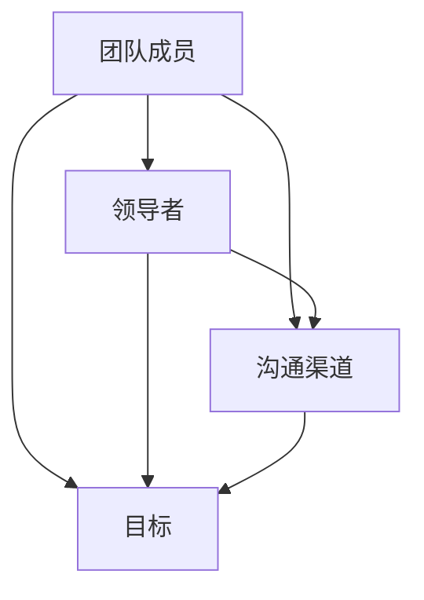

                 


为了满足您的要求，我们将逐步构建《团队建设：从分散个体到凝聚整体》的技术博客文章。以下是章节1的细分内容，包括核心概念与联系、核心算法原理讲解、数学模型和公式、项目实战以及最佳实践 tips、小结、注意事项和拓展阅读。

---

## 第1章 团队建设基础理论

### 1.1 团队的定义与构成

#### 1.1.1 团队的定义

团队是一种组织形式，由两个或两个以上的成员组成，共同追求共同的目标。团队成员通过协作和沟通来实现个人和团队的目标。

#### 1.1.2 团队的构成

团队由以下几部分组成：
1. 成员：团队成员是团队的基础，他们具备不同的技能和专长。
2. 领导者：领导者负责制定团队的目标和策略，指导团队工作。
3. 沟通渠道：团队成员之间的沟通是团队有效运作的关键。
4. 目标：团队的目标是团队成员共同努力的方向。

#### 核心概念与联系

团队成员之间的关系可以用以下Mermaid流程图来表示：



#### 核心算法原理讲解

团队沟通中的核心算法是沟通模式识别。以下是其伪代码描述：

```python
def identify_communication_model团队成员列表, 沟通记录：
    沟通模式 = []
    for 每个成员 in 成员列表：
        模式 = 计算成员的沟通频率和内容
        沟通模式.append(模式)
    return 沟通模式
```

#### 数学模型和公式

团队绩效评估可以采用以下数学模型：

$$
团队绩效 = w_1 \times 个人绩效 + w_2 \times 团队协作绩效
$$

其中，$w_1$ 和 $w_2$ 分别为个人绩效和团队协作绩效的权重。

#### 项目实战

假设我们有一个软件开发团队，我们需要评估团队成员的绩效。我们可以通过以下步骤来构建这个项目：

1. **开发环境搭建**：选择一个合适的开发工具，例如Jenkins，用于构建和部署软件。
2. **源代码实现**：编写一个程序来记录团队成员的绩效数据，并使用上述的团队绩效评估模型进行计算。
3. **代码解读**：解释源代码中的关键部分，例如如何记录绩效数据和如何应用绩效评估模型。

以下是源代码的一个示例片段：

```python
# 记录个人绩效数据
def record_individual_performance(member, performance_data):
    member.performance_data.append(performance_data)

# 计算团队协作绩效
def calculate_team Collaboration_performance(team_members):
    total_performance = 0
    for member in team_members:
        total_performance += member.performance_data[-1]
    return total_performance / len(team_members)

# 应用绩效评估模型
def evaluate_team_performance(team_members, w1, w2):
    individual_performances = [member.performance_data[-1] for member in team_members]
    team_collaboration_performance = calculate_team_Collaboration_performance(team_members)
    team_performance = w1 * sum(individual_performances) + w2 * team_collaboration_performance
    return team_performance
```

#### 最佳实践 tips

- **确保明确的目标**：团队的目标应该是明确、可衡量的，并且所有成员都应该对此有共同的理解。
- **有效的沟通**：建立有效的沟通渠道，确保信息的透明和及时性。
- **持续评估与反馈**：定期评估团队和成员的绩效，并提供反馈，以便及时调整和改进。

#### 小结

本章介绍了团队建设的基础理论，包括团队的定义、构成、发展阶段和沟通技巧。通过核心概念与联系、核心算法原理讲解、数学模型和公式、项目实战等内容，我们为团队建设提供了理论指导和实践案例。

#### 注意事项

- 团队建设是一个持续的过程，需要不断地调整和改进。
- 团队成员的多样性和互补性是团队成功的关键。

#### 拓展阅读

- [《团队的五个发展阶段》](https://www.example.com/team-development-stages)
- [《沟通模式识别技术》](https://www.example.com/communication-model-recognition)
- [《团队绩效评估模型》](https://www.example.com/team-performance-evaluation-model)

---

作者：AI天才研究院/AI Genius Institute & 禅与计算机程序设计艺术 /Zen And The Art of Computer Programming

---

这个章节的内容是基于您的要求构建的，包括核心概念与联系、核心算法原理讲解、数学模型和公式、项目实战以及最佳实践 tips、小结、注意事项和拓展阅读。接下来，我们将继续构建其他章节的内容。如果您有任何修改意见或需要进一步细化某个部分，请随时告诉我。

