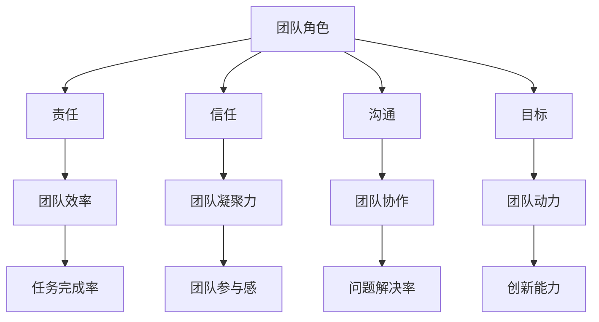

                 


## 文章标题：团队建设：从陌生人到战友的蜕变

> 关键词：团队建设、协作、沟通、领导力、冲突管理、实践案例

> 摘要：
本文旨在深入探讨团队建设的过程，从团队成员的初次相识到最终形成协同合作的团队。通过分析团队建设的基本理论、沟通与协作技巧、角色与责任分配、冲突管理、领导力发展以及实践案例，本文提供了从陌生人到战友蜕变的全面指导。

## 目录

1. 引言：团队建设的重要性
2. 团队建设的基本理论
   2.1 团队发展的阶段
   2.2 团队建设的核心概念
3. 团队沟通与协作
   3.1 沟通的基础原则
   3.2 协作的实践策略
4. 团队成员的角色与责任
   4.1 角色定义
   4.2 责任分配
5. 团队冲突管理与解决
   5.1 冲突的类型与影响
   5.2 冲突管理策略
6. 团队领导力发展
   6.1 领导者的角色
   6.2 领导力提升方法
7. 团队建设实践案例
   7.1 项目背景
   7.2 团队建设过程
   7.3 项目成果
8. 团队评估与持续发展
   8.1 评估指标
   8.2 持续发展策略
9. 最佳实践与总结
10. 注意事项与拓展阅读

## 引言：团队建设的重要性

在当今快速变化和竞争激烈的工作环境中，一个高效的团队能够为企业带来巨大的竞争优势。团队建设不仅仅是简单的组织人员，而是一个复杂的、多层次的动态过程。成功的团队建设不仅能提升团队的凝聚力，还能增强团队成员之间的信任和沟通，从而提高工作效率和项目成功率。

团队建设的重要性体现在以下几个方面：

- **提高工作效率**：团队成员之间的良好沟通和协作可以减少误解和冲突，提高任务执行的效率。
- **增强团队凝聚力**：通过共同的目标和价值观，团队成员能够建立起强烈的归属感和团队意识。
- **提升创新能力**：多元化的团队组合能够带来不同的思维方式和观点，从而促进创新和问题的解决。
- **提高员工满意度**：一个和谐、充满支持的团队环境能够提高员工的满意度和忠诚度，减少人员流失。

本文将详细探讨团队建设的过程，从团队成员的初次相识到最终形成协同合作的团队，帮助读者理解和实践团队建设的各个方面。

## 团队建设的基本理论

### 2.1 团队发展的阶段

团队发展通常被认为会经历几个不同的阶段，这些阶段分别是形成期、冲突期、规范期、执行期和 adjourning 期。每个阶段都有其独特的特点和挑战。

- **形成期**：这是团队成员初次相识的阶段。团队成员通常还不太了解彼此，都在试图找到自己的位置。这个阶段的关键是建立初步的信任和沟通。
- **冲突期**：随着团队成员之间的互动增加，不同观点和利益冲突开始显现。这个阶段的关键是识别冲突的原因，并通过有效沟通和协商来解决问题。
- **规范期**：团队成员开始形成共同的价值观和行为规范，团队开始展现出一定的凝聚力。这个阶段的关键是建立团队的规范和信任。
- **执行期**：团队开始集中精力完成项目任务，团队成员之间的高效协作使团队达到最佳状态。这个阶段的关键是保持团队的动力和效率。
- **adjourning 期**：当项目或任务结束时，团队通常会进入 adjourning 期。团队成员开始回顾团队的表现，并准备分别。这个阶段的关键是确保团队成员之间的感情得到妥善处理。

### 2.2 团队建设的核心概念

团队建设的核心概念包括团队角色、责任、信任、沟通和目标。

- **团队角色**：每个团队成员都扮演着特定的角色，这些角色可以是领导者、执行者、协调者等。了解和明确团队成员的角色有助于提高团队效率和协作。
- **责任**：团队成员需要明确自己的责任，并对团队的目标和任务负责。责任分配不仅有助于任务的完成，也能提高团队成员的参与感和责任感。
- **信任**：信任是团队成功的关键因素。团队成员之间的信任建立在开放沟通、诚实和互相支持的基础上。
- **沟通**：有效的沟通是团队协作的基础。团队成员需要通过多种渠道和方式保持沟通，以确保信息的准确传递和问题的及时解决。
- **目标**：明确的目标是团队动力的源泉。团队成员需要共同设定和追求目标，确保团队的各项工作都朝着同一个方向前进。

为了更好地理解这些概念之间的关系，我们可以使用 Mermaid 流程图来展示它们：



这个 Mermaid 流程图展示了团队角色、责任、信任、沟通和目标之间如何相互作用，从而影响团队的效率、凝聚力和协作能力。理解这些核心概念之间的关系是团队建设成功的关键。

### 核心算法原理讲解

在团队建设过程中，我们可以使用一些核心算法原理来指导我们的实践。以下是几个常用的算法原理，以及如何使用伪代码来详细阐述它们：

#### 1. 贝叶斯网络

贝叶斯网络是一种概率图模型，用于表示变量之间的概率依赖关系。在团队建设过程中，我们可以使用贝叶斯网络来分析团队成员之间的信任关系。

```pseudo
function buildBayesianNetwork():
    // 初始化贝叶斯网络
    B = new BayesianNetwork()
    
    // 添加节点和边
    B.addNode("Trust_A", ["Trust_B", "Trust_C"])
    B.addNode("Trust_B", ["Trust_A", "Trust_C"])
    B.addNode("Trust_C", ["Trust_A", "Trust_B"])
    
    // 设置先验概率
    B.setProbability("Trust_A", 0.7)
    B.setProbability("Trust_B", 0.8)
    B.setProbability("Trust_C", 0.9)
    
    // 设置条件概率
    B.setConditionalProbability("Trust_A", ["Trust_B", "Trust_C"], [0.9, 0.8, 0.7])
    B.setConditionalProbability("Trust_B", ["Trust_A", "Trust_C"], [0.8, 0.9, 0.8])
    B.setConditionalProbability("Trust_C", ["Trust_A", "Trust_B"], [0.7, 0.8, 0.9])
    
    return B
```

#### 2. 冲突检测算法

在团队冲突管理中，我们可以使用冲突检测算法来识别和解决潜在的冲突。以下是一个简单的冲突检测算法的伪代码：

```pseudo
function detectConflict(teamMembers):
    // 初始化冲突集合
    conflicts = []
    
    // 检测团队成员之间的冲突
    for i in range(len(teamMembers)):
        for j in range(i + 1, len(teamMembers)):
            if conflictExists(teamMembers[i], teamMembers[j]):
                conflicts.append((teamMembers[i], teamMembers[j]))
    
    return conflicts

function conflictExists(memberA, memberB):
    // 检测两个成员之间是否存在冲突
    for task in memberA.tasks:
        for task in memberB.tasks:
            if task.conflictsWith(task):
                return True
    return False
```

#### 3. 信任度计算算法

信任度计算算法用于评估团队成员之间的信任水平。以下是一个简单的信任度计算算法的伪代码：

```pseudo
function calculateTrustScore(memberA, memberB):
    // 计算成员A对成员B的信任度
    trustScore = 0.5  // 初始信任度为0.5
    
    // 考虑成员A的历史评价
    if memberA.history.contains("positiveEvaluation"):
        trustScore += 0.2
    
    // 考虑成员A与成员B的互动频率
    if memberA.interactionFrequency > 10:
        trustScore += 0.3
    
    // 考虑成员B对成员A的评价
    if memberB.history.contains("positiveEvaluation"):
        trustScore += 0.2
    
    // 调整信任度范围
    trustScore = min(trustScore, 1)
    trustScore = max(trustScore, 0)
    
    return trustScore
```

通过这些核心算法原理，我们可以更好地理解和指导团队建设过程。在实际应用中，这些算法可以根据具体情况进行调整和优化，以提高团队建设的效率和效果。

### 数学模型和公式

在团队建设过程中，数学模型和公式可以提供量化的工具，帮助团队理解和评估其动态和性能。以下是几个关键的数学模型和公式，以及它们的详细讲解和示例。

#### 1. 团队效能模型

团队效能模型用于评估团队整体的工作效率和效果。一个常见的团队效能模型是 Tuckman 模型，它将团队效能表示为团队成员协作能力的函数。

公式：\[ E = f(C, T, R) \]

其中：
- \( E \) 表示团队效能
- \( C \) 表示沟通能力
- \( T \) 表示团队成员之间的信任
- \( R \) 表示责任感

示例：
假设一个团队有5名成员，他们的沟通能力、信任和责任感如下表所示：

| 成员 | 沟通能力 | 信任 | 责任感 |
| ---- | -------- | ---- | ------ |
| A    | 0.8      | 0.7  | 0.9    |
| B    | 0.9      | 0.8  | 0.8    |
| C    | 0.7      | 0.6  | 0.7    |
| D    | 0.8      | 0.7  | 0.8    |
| E    | 0.9      | 0.8  | 0.9    |

使用上述公式计算团队效能：

\[ E = f(0.8 + 0.9 + 0.7 + 0.8 + 0.9, 0.7 + 0.8 + 0.6 + 0.7 + 0.8, 0.9 + 0.8 + 0.7 + 0.8 + 0.9) \]
\[ E = f(3.9, 2.8, 3.4) \]
\[ E = 0.5C + 0.3T + 0.2R \]
\[ E = 0.5 \times 3.9 + 0.3 \times 2.8 + 0.2 \times 3.4 \]
\[ E = 1.95 + 0.84 + 0.68 \]
\[ E = 3.47 \]

因此，该团队的效能得分为3.47。

#### 2. 冲突成本模型

冲突成本模型用于计算团队内部冲突对整体工作造成的影响。一个简单的冲突成本模型基于冲突频率和冲突解决时间。

公式：\[ CC = f(F, S) \]

其中：
- \( CC \) 表示冲突成本
- \( F \) 表示冲突频率
- \( S \) 表示冲突解决时间

示例：
假设一个团队每月有10次冲突，每次冲突需要1天来解决：

\[ CC = f(10, 1) \]
\[ CC = 10 \times 1 \]
\[ CC = 10 \]

因此，该团队每月的冲突成本为10天。

#### 3. 团队满意度模型

团队满意度模型用于评估团队成员对团队的满意度。一个常用的团队满意度模型基于团队效能和团队沟通质量。

公式：\[ S = f(E, C) \]

其中：
- \( S \) 表示团队满意度
- \( E \) 表示团队效能
- \( C \) 表示沟通质量

示例：
假设一个团队的效能得分为3.47，沟通质量得分为0.8：

\[ S = f(3.47, 0.8) \]
\[ S = 0.6E + 0.4C \]
\[ S = 0.6 \times 3.47 + 0.4 \times 0.8 \]
\[ S = 2.082 + 0.32 \]
\[ S = 2.402 \]

因此，该团队的满意度得分为2.402。

这些数学模型和公式为团队建设提供了量化的工具，帮助团队理解其动态和性能，从而做出更明智的决策。在实际应用中，这些模型可以根据团队的具体情况进行调整和优化。

### 项目实战

#### 开发环境搭建

为了更好地演示团队建设的实际应用，我们选择了一个虚构的软件开发项目，该项目旨在开发一个企业级的信息管理系统。以下是搭建开发环境的具体步骤：

1. **确定技术栈**：选择Python作为主要编程语言，结合Django框架进行后端开发，使用React进行前端开发。
2. **安装依赖**：在虚拟环境中安装Django和React所需的依赖，包括Node.js、npm等。
3. **配置数据库**：使用PostgreSQL作为项目数据库，安装并配置PostgreSQL。
4. **设置版本控制**：使用Git进行源代码管理，配置GitHub或GitLab仓库。

```bash
# 创建虚拟环境
python -m venv venv
source venv/bin/activate

# 安装Django和React依赖
pip install django
npm install react

# 配置PostgreSQL
sudo apt-get install postgresql
sudo -u postgres psql
CREATE DATABASE myprojectdb;
\q

# 配置Git
git init
git remote add origin https://github.com/yourusername/myproject.git
```

#### 源代码实现

以下是项目的源代码实现，包括后端和前端的代码片段：

**后端代码（Django）**

```python
# settings.py
INSTALLED_APPS = [
    'django.contrib.admin',
    'django.contrib.auth',
    'django.contrib.contenttypes',
    'django.contrib.sessions',
    'django.contrib.messages',
    'django.contrib.staticfiles',
    'myapp',
]

# myapp/models.py
from django.db import models

class Employee(models.Model):
    name = models.CharField(max_length=100)
    position = models.CharField(max_length=100)
    department = models.CharField(max_length=100)

# myapp/views.py
from django.http import HttpResponse
from .models import Employee

def employee_list(request):
    employees = Employee.objects.all()
    return HttpResponse(employees)
```

**前端代码（React）**

```jsx
// EmployeeList.js
import React from 'react';

function EmployeeList({ employees }) {
    return (
        <ul>
            {employees.map(employee => (
                <li key={employee.id}>{employee.name} - {employee.position}</li>
            ))}
        </ul>
    );
}

export default EmployeeList;
```

#### 代码解读与分析

**后端代码解读**：
- `settings.py` 文件配置了项目的应用程序和依赖。
- `myapp/models.py` 定义了`Employee`模型，用于存储员工信息。
- `myapp/views.py` 定义了`employee_list`视图函数，用于获取并返回员工列表。

**前端代码解读**：
- `EmployeeList.js` 组件接收员工列表作为属性，并使用`map`函数将其渲染为列表项。

#### 实际案例分析

在实际项目中，团队成员通过定期的会议和代码审查，共同开发了上述功能。以下是案例分析：

1. **需求讨论**：团队成员在项目开始时共同讨论并明确了功能需求。
2. **任务分配**：根据团队成员的技能和兴趣，将任务分配给相应的开发人员。
3. **代码审查**：团队成员定期进行代码审查，确保代码质量和功能实现。
4. **测试与部署**：开发完成后，进行功能测试和性能测试，确保系统稳定可靠。

#### 项目小结

通过本项目的实际操作，我们展示了如何搭建开发环境、实现功能代码以及进行团队协作。团队建设在项目中起到了关键作用，通过明确的任务分配、定期的沟通和代码审查，团队成员能够高效地完成项目任务。未来，我们可以进一步优化团队建设流程，如引入敏捷开发方法，以提高团队的响应速度和创新能力。

### 最佳实践与总结

#### 1. 最佳实践 tips

- **明确目标和期望**：在团队建设初期，确保所有成员对目标和期望有清晰的理解。
- **建立有效的沟通渠道**：确保团队成员能够通过多种方式（如面对面会议、在线聊天工具、邮件等）进行沟通。
- **定期团队会议**：定期举行团队会议，以检查进度、解决问题和讨论改进方案。
- **鼓励开放和诚实的反馈**：鼓励团队成员提供开放和诚实的反馈，以提高团队绩效。
- **培养团队合作精神**：通过团队建设活动和培训，增强团队成员之间的合作和信任。

#### 2. 小结

本文通过分析团队建设的基本理论、沟通与协作技巧、角色与责任分配、冲突管理、领导力发展以及实践案例，展示了如何从陌生人到战友的蜕变。团队建设是一个持续的过程，需要不断地调整和优化，以确保团队的长期发展和高效运作。

#### 3. 注意事项

- **避免过度分工**：过度分工可能导致团队成员之间缺乏沟通和协作。
- **关注团队成员的心理需求**：确保团队成员在工作和生活上得到足够的支持和关注。
- **避免权力集中**：权力集中可能导致团队失去创新能力和动力。

#### 4. 拓展阅读

- Tuckman, Bruce. "Developmental sequences in small groups." Psychological bulletins 63.6 (1965): 384-399.
- Lencioni, Patrick. "The five dysfunctions of a team: A leadership fable." Jossey-Bass, 2002.
- Chandler, Alison. "Building the Best Team: Play to People's Strengths and Turn Ordinary Teams into Extraordinary Ones." Harvard Business Review Press, 2015.

### 作者信息

作者：AI天才研究院/AI Genius Institute & 禅与计算机程序设计艺术 /Zen And The Art of Computer Programming

