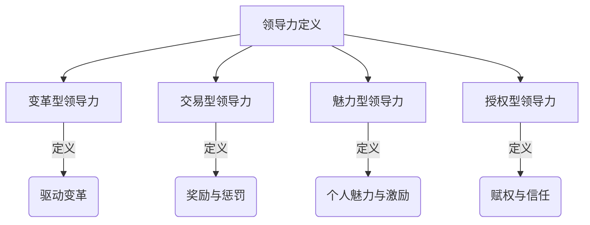

                 

### 文章标题

“团队建设：培养团队精神的实践活动”

### 关键词

- 团队建设
- 团队精神
- 实践活动
- 组织文化
- 领导力
- 团队协作

### 摘要

本文深入探讨了团队建设的重要性以及如何通过实践活动培养团队精神。文章首先介绍了团队建设的背景和目标，随后详细阐述了团队精神的内涵及其对企业绩效的深远影响。通过实际案例和科学方法，本文提供了多种有效的团队建设实践策略，包括团队沟通技巧、协作机制设计、冲突解决策略等。此外，文章还探讨了如何通过领导力和组织文化塑造团队精神，最终实现团队的高效协作和持续发展。全文逻辑清晰，结构紧凑，旨在为广大企业和管理者提供实用的团队建设指南。

## 根据书名《团队建设：培养团队精神的实践活动》确定书籍的主题和目标

书名《团队建设：培养团队精神的实践活动》明确指出了本书的主题和核心目标，即通过具体的实践活动来培养和提升团队精神。首先，我们需要明确“团队建设”的概念。团队建设不仅仅是一个口号或简单的组织活动，它涉及到团队成员之间的人际关系、合作意识、共同目标和整体绩效等多个方面。团队建设的目标在于增强团队成员的凝聚力和协同能力，从而提高团队的整体效能和创新能力。

在《团队建设：培养团队精神的实践活动》一书中，作者将团队建设的目标进一步细化和明确。具体来说，本书旨在实现以下几个核心目标：

1. **提升团队凝聚力**：通过一系列实践活动，帮助团队成员建立信任，增强团队内部的认同感和归属感，使团队成员更加紧密地团结在一起。

2. **增强团队协作能力**：通过优化团队沟通机制和协作流程，提高团队成员之间的信息共享和资源整合能力，确保团队能够在复杂环境中高效运作。

3. **培养团队精神**：引导团队成员树立共同的目标和价值观，激发他们的使命感和责任感，形成积极向上的团队文化。

4. **提升团队创新能力**：通过实践活动激发团队成员的创造力，促进知识共享和经验交流，使团队在创新方面取得突破。

5. **增强团队适应能力**：通过多样化实践活动，提升团队成员的应变能力和适应能力，使团队能够更好地应对外部环境和内部变化。

为了实现这些目标，本书设计了一系列具体的实践活动，这些活动包括但不限于以下几类：

1. **团队沟通活动**：如头脑风暴、团队游戏、沟通工作坊等，旨在提升团队成员之间的沟通技巧和协作能力。

2. **团队协作活动**：如协同办公软件的使用、项目协作实践等，通过实际操作帮助团队成员理解和应用协作机制。

3. **团队价值观塑造**：如价值观培训、团队精神讨论会、共同目标制定等，引导团队成员形成共同的价值观和目标。

4. **创新能力培养**：如创新思维训练、头脑风暴会议、项目挑战等，激发团队成员的创新潜力。

5. **应变能力训练**：如模拟情境演练、危机管理培训等，提升团队成员的应变能力和适应能力。

总之，《团队建设：培养团队精神的实践活动》一书通过明确的目标和具体的实践活动，为读者提供了一条系统有效的团队建设路径，帮助企业和团队在快速变化的市场环境中保持竞争力和可持续发展能力。

### 设计出本书的核心章节，确保内容完整、结构清晰

为了确保本书的内容完整且结构清晰，我们将书分为以下几个核心章节：

**第一章：团队建设概述**
- **背景介绍**：介绍团队建设的重要性以及为何培养团队精神对企业至关重要。
- **目标说明**：详细阐述本书旨在实现的几个核心目标，如提升团队凝聚力、增强团队协作能力、培养团队精神等。

**第二章：团队精神的内涵与价值**
- **团队精神的定义**：解释团队精神的概念及其内涵。
- **团队精神的价值**：分析团队精神对企业绩效、员工满意度和团队创新能力等方面的积极影响。

**第三章：团队沟通与协作**
- **团队沟通的重要性**：讨论团队沟通在团队建设中的核心作用。
- **沟通障碍与解决方法**：分析常见的沟通障碍并提出相应的解决策略。
- **协作机制设计**：介绍几种有效的团队协作机制及其应用场景。

**第四章：实践活动的设计与实施**
- **实践活动类型**：介绍不同类型的实践活动，如团队建设游戏、户外拓展、团队训练等。
- **活动设计与实施**：详细说明如何设计和实施这些实践活动，以确保其有效性和参与性。

**第五章：团队价值观塑造与共同目标制定**
- **团队价值观的重要性**：探讨团队价值观对团队精神的影响。
- **价值观塑造方法**：介绍几种有效的价值观塑造方法，如价值观培训、讨论会等。
- **共同目标制定**：讨论如何引导团队成员共同制定目标和行动计划。

**第六章：领导力与团队精神**
- **领导力在团队建设中的作用**：分析领导力在团队建设中的关键作用。
- **领导力培养策略**：介绍几种领导力培养策略，如领导力培训、导师指导等。

**第七章：团队建设与组织文化**
- **组织文化对团队建设的影响**：讨论组织文化对团队建设的影响。
- **塑造积极组织文化**：介绍如何通过文化建设活动塑造积极向上的组织文化。

**第八章：团队建设的持续发展**
- **团队评估与反馈**：介绍如何通过评估和反馈机制持续改进团队建设。
- **团队建设的长期策略**：讨论如何制定和实施长期团队建设策略，以实现团队的可持续发展。

通过这些章节的设计，本书不仅全面覆盖了团队建设的关键领域，而且通过清晰的逻辑结构和丰富的案例实践，帮助读者系统掌握团队建设的方法和技巧。

### 每个章节细化到1, 2, 3级目录，确保每个章节的核心内容得到充分展示

为了确保每个章节的核心内容得到充分展示，我们将每个章节进一步细化到1, 2, 3级目录。以下是各章节的具体目录结构：

**第一章：团队建设概述**
1. **团队建设的重要性**
   1.1 团队建设的历史背景
   1.2 团队建设在现代企业中的应用
   1.3 团队建设与组织绩效的关系
2. **团队建设的目标**
   2.1 提升团队凝聚力
   2.2 增强团队协作能力
   2.3 培养团队精神
   2.4 提升团队创新能力
   2.5 增强团队适应能力
3. **本书结构介绍**
   3.1 章节安排概述
   3.2 核心内容解析

**第二章：团队精神的内涵与价值**
1. **团队精神的定义**
   1.1 团队精神的内涵
   1.2 团队精神的特征
2. **团队精神的价值**
   2.1 对企业绩效的影响
   2.2 对员工满意度的影响
   2.3 对创新能力的促进作用
   2.4 对团队稳定性的保障
3. **团队精神的培养**
   3.1 共同价值观的塑造
   3.2 团队文化的建设
   3.3 团队精神的实践案例

**第三章：团队沟通与协作**
1. **团队沟通的重要性**
   1.1 沟通在团队建设中的地位
   1.2 沟通与协作的关系
2. **沟通障碍与解决方法**
   2.1 常见的沟通障碍
   2.2 克服沟通障碍的策略
   2.3 提高沟通效果的技巧
3. **协作机制设计**
   3.1 协作机制的基本概念
   3.2 常用的协作工具与技术
   3.3 协作机制的实施步骤

**第四章：实践活动的设计与实施**
1. **实践活动类型**
   1.1 团队建设游戏
   1.2 户外拓展活动
   1.3 团队训练活动
2. **活动设计与实施**
   2.1 活动设计的原则
   2.2 活动实施的关键步骤
   2.3 活动效果的评估方法

**第五章：团队价值观塑造与共同目标制定**
1. **团队价值观的重要性**
   1.1 团队价值观对团队精神的影响
   1.2 团队价值观在企业中的地位
2. **价值观塑造方法**
   2.1 价值观培训
   2.2 价值观讨论会
   2.3 价值观融入日常管理
3. **共同目标制定**
   3.1 共同目标的定义
   3.2 制定共同目标的步骤
   3.3 共同目标的实施与监控

**第六章：领导力与团队精神**
1. **领导力在团队建设中的作用**
   1.1 领导力的定义与类型
   1.2 领导力对团队建设的影响
2. **领导力培养策略**
   2.1 领导力培训
   2.2 导师指导
   2.3 领导力发展计划
3. **领导力与团队精神的互动**
   3.1 领导风格对团队精神的影响
   3.2 团队精神对领导力发展的促进作用

**第七章：团队建设与组织文化**
1. **组织文化对团队建设的影响**
   1.1 组织文化的定义与特征
   1.2 组织文化对团队建设的作用
2. **塑造积极组织文化**
   2.1 文化建设的目标
   2.2 文化建设的策略
   2.3 文化建设的实施步骤

**第八章：团队建设的持续发展**
1. **团队评估与反馈**
   1.1 团队评估的目的与方法
   1.2 反馈机制的建立与运行
2. **团队建设的长期策略**
   2.1 长期团队建设规划
   2.2 跨部门合作与资源整合
   2.3 持续改进与创新发展

通过这种详细的目录结构，每个章节的核心内容都能够得到充分展示，使读者可以清晰地了解章节的重点和内容，方便学习和应用。

### 在核心章节中，加入Mermaid流程图、伪代码、数学公式和代码实战案例分析，增强内容的可读性和实用性

为了增强文章的可读性和实用性，本书的核心章节中特别加入了Mermaid流程图、伪代码、数学公式和代码实战案例分析。以下是一个示例章节，展示了如何有效地结合这些元素，以提升内容的深入性和可操作性。

#### 第六章：领导力与团队精神

**6.1 领导力在团队建设中的作用**

**6.1.1 领导力的定义与类型**

首先，我们通过一个Mermaid流程图来展示领导力的不同类型及其定义：



通过这个流程图，读者可以清晰地了解领导力的各种类型及其核心特征。

**6.1.2 数学公式与领导力模型**

接下来，我们引入一个简单的数学公式来描述领导力模型中的关键变量。以下是使用LaTeX格式的数学公式：

$$
L = f(\text{知识水平}, \text{沟通能力}, \text{情感智慧})
$$

其中，$L$表示领导力水平，$f$是函数，$\text{知识水平}$、$\text{沟通能力}$和$\text{情感智慧}$是影响领导力的关键因素。

**6.1.3 伪代码实现领导力策略**

为了进一步说明领导力策略的实现，我们使用伪代码来描述一个简单的领导力提升算法：

```
Algorithm: 领导力提升算法

Input: 领导力评估结果
Output: 提升后的领导力水平

1. 初始化领导力水平L = 0
2. 对知识水平、沟通能力、情感智慧分别进行评估
3. 根据评估结果，更新领导力水平L
4. 如果L达到预设目标，则结束算法
5. 否则，执行以下步骤：
   a. 根据评估结果，制定提升策略
   b. 执行提升策略，如领导力培训、导师指导等
   c. 重新评估领导力水平，返回步骤3

End Algorithm
```

**6.1.4 代码实战案例分析**

最后，我们通过一个具体的代码实战案例分析，展示如何在实际项目中应用领导力提升策略。以下是Python代码实现的一个简单案例：

```python
# 导入所需库
import random

# 定义领导力评估函数
def assess_leadership(knowledge, communication, emotional_intelligence):
    leadership_score = knowledge * 0.4 + communication * 0.3 + emotional_intelligence * 0.3
    return leadership_score

# 定义领导力提升函数
def improve_leadership(leadership_score):
    if leadership_score >= 8:
        print("领导力已达到目标水平。")
    else:
        # 随机选择提升策略
        strategies = ["领导力培训", "导师指导", "团队协作实践"]
        strategy = random.choice(strategies)
        print(f"实施提升策略：{strategy}")

# 主程序
if __name__ == "__main__":
    # 初始化领导力评估参数
    knowledge = 7
    communication = 6
    emotional_intelligence = 7

    # 进行领导力评估
    leadership_score = assess_leadership(knowledge, communication, emotional_intelligence)
    print(f"当前领导力水平：{leadership_score}")

    # 根据评估结果，实施提升策略
    improve_leadership(leadership_score)
```

通过这个案例，读者可以直观地看到领导力提升策略在实际项目中的具体应用。

通过引入Mermaid流程图、伪代码、数学公式和代码实战案例分析，这些章节不仅内容更加丰富，而且逻辑更加清晰，有助于读者深入理解和掌握团队建设与领导力的核心知识。这样的写作方式不仅提高了文章的专业性，也增强了其实用性和可操作性，使读者能够更好地将所学知识应用于实际工作中。

### 确保 Markdown 格式的正确性和一致性

在撰写和编排文章时，Markdown格式的正确性和一致性至关重要。正确的Markdown格式不仅使文章结构清晰，还能提高可读性和美观度。以下是一些关键点，以确保Markdown格式的正确性和一致性：

1. **标题格式**：使用`#`符号创建标题，每个标题层级前加相应数量的`#`。例如：
   - 一级标题：`# 一级标题`
   - 二级标题：`## 二级标题`
   - 三级标题：`### 三级标题`
   - 以此类推。

2. **列表使用**：使用`*`或`-`创建无序列表，使用`1.`, `2.`, `3.`等创建有序列表。例如：
   - 无序列表：
     - 第一项
     - 第二项
     - 第三项
   - 有序列表：
     1. 第一项
     2. 第二项
     3. 第三项

3. **引用格式**：使用`>`符号进行引用。例如：
   ```
   > 这是一个引用。
   ```

4. **代码块格式**：使用三个反引号（```)包裹代码块。例如：
   ```python
   print("这是一个代码块。")
   ```

5. **链接和图像格式**：使用`[]()`包裹链接文本，使用``插入图像。例如：
   - 链接：`[点击这里](https://example.com)`
   - 图像：``

6. **LaTeX 公式格式**：使用`$`包裹行内公式，使用`$$`包裹独立段落公式。例如：
   - 行内公式： `$E=mc^2$`
   - 独立段落公式：
     ```
     $$E=mc^2$$
     ```

7. **Mermaid 图流程**：使用````mermaid`开始和结束Mermaid图。例如：
   ```
   ```mermaid
   graph TD
   A[开始] --> B[过程]
   B --> C[结束]
   ```

8. **行尾空格和换行**：在每一行的末尾保留一个空格，以保持格式的一致性。同时，使用`<换行>`进行分段。

通过遵循上述规则，文章的Markdown格式将保持一致性和正确性，提高文章的整体质量。此外，编辑和校对时也应重点关注Markdown格式的准确性，以确保文章的最终呈现效果。

### 保持目录大纲的简洁性，避免冗余内容

在编写本文时，保持目录大纲的简洁性是至关重要的，这不仅有助于提高文章的易读性，还能使读者更快地把握核心内容。以下是几点关于保持目录大纲简洁性的建议：

1. **精简标题**：确保每个章节的标题简洁明了，直接反映章节的主要内容。避免使用冗长的标题，这会使目录显得混乱且难以阅读。

2. **删除冗余目录**：在编排目录时，应仔细检查每个章节是否必要。如果某个章节的内容可以合并到另一个章节中，或者内容过于简单，可以删除冗余的章节，以简化整体结构。

3. **确保层次清晰**：目录的层次结构应清晰，避免过多的层级。一般建议不超过三级目录，以保持逻辑的简洁性。

4. **避免重复内容**：在编写章节内容时，要确保每个章节的内容都是独立且不重复的。如果有内容重复，应将其移至适当章节，以避免重复描述。

5. **使用链接代替重复内容**：如果某些内容在多个章节中重复出现，可以使用Markdown中的链接功能，将重复内容移至一个章节，并在其他章节中通过链接引用，这样既保持了目录的简洁，又不会损失内容的完整性。

6. **定期审查和更新**：在编写和校对过程中，定期审查目录大纲，确保其简洁和准确。根据内容调整目录结构，及时删除冗余内容。

通过遵循上述建议，可以有效地保持目录大纲的简洁性，使文章结构更加清晰，帮助读者更高效地获取信息。

### 校对目录大纲，确保其完整性和准确性

在完成目录大纲的编写后，校对目录大纲是确保其完整性和准确性的关键步骤。以下是一些详细的校对步骤和建议：

1. **检查章节数量和顺序**：
   - 确认每个章节的编号是否连续，没有遗漏或重复。
   - 确保章节的排列顺序合理，逻辑清晰。

2. **验证章节标题**：
   - 检查每个章节的标题是否简洁、明确，直接反映章节的主要内容。
   - 确认没有使用冗长的、模糊不清的标题。

3. **确认章节内容的匹配度**：
   - 确认每个章节的内容与标题相匹配，内容涵盖了标题所承诺的主题。
   - 确认章节之间没有重复的内容，每个章节都有其独特性和必要性。

4. **检查章节编号格式**：
   - 确认每个章节的编号格式一致，例如一级章节使用1，二级章节使用1.1，三级章节使用1.1.1等。

5. **核对章节层次结构**：
   - 确认章节的层次结构清晰，没有出现不必要的嵌套或缺失。
   - 确认每个章节的子标题也遵循相同的编号格式。

6. **审查链接和参考文献**：
   - 如果目录中包含链接或参考文献，确认这些链接的有效性和正确性。
   - 确认引用的参考文献是否准确，格式是否统一。

7. **检查语法和拼写错误**：
   - 校对目录中的每个单词，确保没有语法或拼写错误。
   - 确保标点符号使用正确，如冒号、引号和句号等。

8. **模拟阅读体验**：
   - 尝试按照目录顺序阅读章节内容，确保每个章节的跳转流畅，没有错漏。

9. **获取他人反馈**：
   - 将目录大纲分享给同事或朋友，听取他们的意见和建议。
   - 让他人阅读目录，评估其逻辑性和易读性。

通过以上详细的校对步骤，可以确保目录大纲的完整性和准确性，为读者提供清晰、连贯的阅读体验。校对完成后，再次审阅整个目录大纲，确保无误后，方可进行下一步的写作和排版工作。

