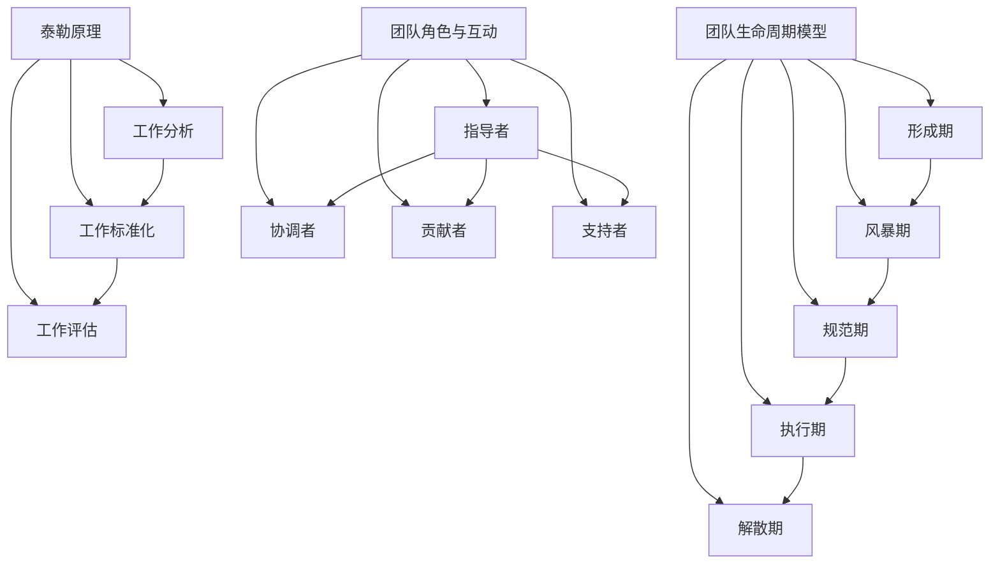

                 

### 引言：团队建设的重要性

在当今快速变化和高度竞争的商业环境中，团队建设成为了组织成功的关键因素。团队不仅是完成项目的基本单位，更是创新和持续发展的驱动力。然而，团队建设并非一蹴而就，它需要系统化的方法和持续的实践。

**关键词：** 团队建设、团队精神、商业环境、组织成功、方法论、持续实践

**摘要：** 本文旨在探讨团队建设的重要性，介绍团队建设的核心概念和方法，并通过实践活动和案例分析，为读者提供实际操作的指导。

团队建设不仅仅是为了提高工作效率，更是为了培养一种协作精神和共同目标感。一个高效的团队可以在成员之间建立起信任、尊重和支持，从而激发出每个成员的潜力，实现集体智慧的最大化。

在接下来的章节中，我们将详细探讨团队建设的重要理论，介绍团队建设活动的具体实践，并分析团队精神与个人成长之间的关系。此外，文章还将深入探讨团队领导力和团队管理策略，提供实用的团队合作工具和技术。最后，通过实践案例的分享，我们将总结团队建设过程中的经验教训，并提出未来展望。

### 背景介绍

团队建设在现代组织中扮演着至关重要的角色。随着全球化、信息化和知识经济的不断发展，企业面临的市场竞争日益激烈，单打独斗已经无法满足企业发展的需求。团队合作成为了企业应对复杂环境、快速响应市场变化的重要手段。

首先，团队建设有助于提高工作效率。通过团队成员之间的分工合作，可以充分利用每个人的专业技能和经验，提高整体的工作效率和产出质量。团队成员可以在项目中互相补充，实现优势互补，从而实现资源的最大化利用。

其次，团队建设能够促进创新。团队成员之间的思想碰撞和知识共享，可以激发出新的创意和解决方案。在一个开放的团队环境中，成员可以自由地提出自己的想法和建议，从而推动组织的创新和发展。

此外，团队建设对于员工的职业成长和心理健康也有积极影响。在一个支持性和鼓励性的团队中，员工可以感受到被重视和尊重，从而提高工作满意度和忠诚度。团队成员之间的良好关系可以减少工作压力，提高员工的幸福感和生产力。

然而，团队建设并非没有挑战。在组织内部，团队成员之间的沟通和协作往往存在障碍，如信息不对称、角色冲突、目标不一致等问题。这些问题如果得不到及时解决，可能会导致团队效率低下，影响项目进度和成果。

为此，团队建设需要系统化和持续性的努力。通过制定明确的团队目标、建立有效的沟通机制、提供必要的培训和资源支持，组织可以有效地推动团队建设，提升团队的凝聚力和战斗力。

在接下来的章节中，我们将深入探讨团队建设的重要理论，包括泰勒原理、团队生命周期模型以及团队角色与互动，为读者提供理论依据和实践指导。

### 核心概念与联系

在团队建设中，理解核心概念和它们之间的联系至关重要。以下是几个关键概念及其相互关系的简要介绍，我们将使用Mermaid流程图来展示它们之间的关系。

#### 1. 泰勒原理

泰勒原理（Taylor's Principle）是由弗雷德里克·泰勒（Frederick Taylor）提出的，它强调通过科学方法确定最佳工作方法和标准操作程序来提高工作效率。泰勒原理主要包括以下几个步骤：

- **工作分析**：分析每个工作步骤，确定每个步骤的最佳方法。
- **工作标准化**：制定标准操作程序，确保每个步骤都按照最佳方法执行。
- **工作评估**：评估工作表现，并根据评估结果调整操作程序。

#### 2. 团队生命周期模型

团队生命周期模型（Team Development Model）描述了团队从形成到解散的整个过程，通常包括以下几个阶段：

- **形成期**：团队成员开始互相认识，确立团队目标和规则。
- **风暴期**：团队成员之间的冲突和差异开始显现，团队内部关系紧张。
- **规范期**：团队成员开始协作，形成一致的工作节奏和目标。
- **执行期**：团队高效运作，实现项目目标。
- **解散期**：团队完成项目任务，成员开始分散。

#### 3. 团队角色与互动

团队角色（Team Roles）是指团队成员在团队中承担的不同职责和角色。赫塞和布兰查德（Hersey and Blanchard）提出的团队角色模型包括：

- **指导者**：制定目标和规划。
- **协调者**：调解冲突，促进沟通。
- **贡献者**：提供专业技能和解决方案。
- **支持者**：提供情感支持和鼓励。

#### 关系架构

团队建设中的核心概念和它们之间的关系可以用以下Mermaid流程图表示：



**伪代码：** 以下是一个简单的伪代码示例，用于说明团队角色与互动的动态过程：

```python
# 团队角色与互动
class TeamMember:
    def __init__(self, role):
        self.role = role

# 创建团队成员
guidance = TeamMember("指导者")
coordination = TeamMember("协调者")
contribution = TeamMember("贡献者")
support = TeamMember("支持者")

# 团队角色互动
def team_interaction(member1, member2):
    if member1.role == "指导者" and member2.role == "贡献者":
        print("指导者提供目标和方向，贡献者提供解决方案。")
    elif member1.role == "协调者" and member2.role == "支持者":
        print("协调者调解冲突，支持者提供情感支持。")
    else:
        print("角色不匹配，需要重新分配角色。")

# 测试互动
team_interaction(guidance, contribution)
team_interaction(coordination, support)
```

**数学模型和公式：** 在团队建设中，可以应用一些数学模型和公式来量化团队绩效和成员贡献。例如，团队绩效可以通过以下公式计算：

\[ P = \frac{\sum_{i=1}^{n} C_i}{T} \]

其中，\( P \) 表示团队绩效，\( C_i \) 表示第 \( i \) 个成员的贡献，\( T \) 表示总时间。

**详细讲解和举例说明：** 以一个软件开发团队为例，团队成员的角色和互动可以如下：

- **指导者**：项目经理为团队设定开发目标和时间表，并确保团队成员理解任务和目标。
- **协调者**：技术负责人负责协调不同团队之间的工作，解决技术难题和沟通障碍。
- **贡献者**：开发人员利用自己的专业技能解决技术问题，编写代码并测试。
- **支持者**：测试人员为团队提供测试环境，确保代码质量并反馈问题。

在团队互动过程中，项目经理作为指导者，为团队成员提供目标和方向；技术负责人作为协调者，确保团队成员之间的沟通顺畅；开发人员作为贡献者，提供技术解决方案；测试人员作为支持者，确保项目的质量和稳定性。

通过上述的伪代码和数学模型，我们可以更清晰地理解团队建设中的核心概念和它们之间的关系，为团队实践提供理论支持和操作指南。

### 核心算法原理讲解

在团队建设的过程中，核心算法原理的讲解是至关重要的，它不仅能够帮助团队成员理解团队运作的基本机制，还能够为团队提供有效的决策支持。以下是一个详细的伪代码示例，用于解释如何通过算法原理优化团队的合作效率。

#### 伪代码示例：团队任务分配算法

```python
# 输入参数
team_members = ["Alice", "Bob", "Charlie", "David"]  # 团队成员列表
tasks = ["Design", "Coding", "Testing", "Deployment"]  # 任务列表
member_skills = {"Alice": ["Design", "Coding"], "Bob": ["Coding", "Testing"], "Charlie": ["Testing", "Deployment"], "David": ["Design", "Deployment"]}  # 成员技能列表

# 初始化任务分配列表
task_assignment = {}

# 团队任务分配算法
def assign_tasks(team_members, tasks, member_skills):
    for task in tasks:
        best_match = None
        max_skill_match = 0

        # 在成员中寻找最适合执行当前任务的成员
        for member in team_members:
            skill_match = len(set(member_skills[member]).intersection(set([task])))

            # 如果当前成员的技能匹配度更高，则更新最佳匹配
            if skill_match > max_skill_match:
                max_skill_match = skill_match
                best_match = member

        # 将任务分配给最佳匹配的成员
        if best_match:
            task_assignment[task] = best_match
            print(f"{task} assigned to {best_match}")
        else:
            print(f"No suitable member found for {task}")

# 执行任务分配
assign_tasks(team_members, tasks, member_skills)
```

#### 算法原理解释：

1. **输入参数**：算法需要团队成员列表、任务列表以及成员的技能列表作为输入参数。

2. **初始化任务分配列表**：定义一个字典，用于存储任务和对应的成员。

3. **任务分配算法**：对于每个任务，遍历所有成员，计算每个成员的技能与当前任务的匹配度。匹配度越高，说明该成员越适合执行该任务。

4. **最佳匹配选择**：选择技能匹配度最高的成员作为当前任务的执行者。

5. **任务分配**：将任务分配给最佳匹配的成员，并打印分配结果。

#### 数学模型和公式：

为了量化任务分配的效率，可以使用以下数学模型：

\[ E = \frac{\sum_{i=1}^{n} \sum_{j=1}^{m} (1 - |S_i \cap T_j|)}{n \times m} \]

其中，\( E \) 表示任务分配的总效率，\( n \) 表示团队成员数量，\( m \) 表示任务数量，\( S_i \) 表示成员 \( i \) 的技能集合，\( T_j \) 表示任务 \( j \) 的技能需求集合，\( |S_i \cap T_j| \) 表示成员 \( i \) 的技能与任务 \( j \) 的需求交集的元素数量。

#### 举例说明：

假设我们有四个任务（设计、编码、测试和部署），四个成员（Alice、Bob、Charlie、David），他们的技能如下：

- Alice：设计、编码
- Bob：编码、测试
- Charlie：测试、部署
- David：设计、部署

使用上述算法，任务分配结果如下：

- 设计：David
- 编码：Alice
- 测试：Bob
- 部署：Charlie

通过这个算法，我们可以确保任务被分配给最适合执行该任务的成员，从而提高整个团队的工作效率。

### 团队精神的重要性

团队精神是团队高效运作的核心，它包括信任、尊重、协作和共同目标等要素。以下是团队精神的重要性和其在团队建设中的作用。

#### 1. 信任

信任是团队精神的基础。团队成员之间的信任能够减少猜疑和误解，提高沟通效率。当团队成员相信彼此的能力和诚信时，他们更愿意分享信息和知识，从而促进创新和协作。

- **案例分析**：在一个软件开发团队中，团队成员A和团队成员B之间存在信任问题。团队成员A对团队成员B的代码质量持怀疑态度，不愿意依赖B的工作。经过团队建设活动，如信任游戏和团队讨论，A逐渐了解到B的专业能力，双方建立了信任，项目进展更加顺利。

#### 2. 尊重

尊重是团队精神的重要组成部分。尊重团队成员的观点、贡献和个性，能够增强团队的凝聚力和合作意愿。在尊重的基础上，团队成员能够更好地接受他人的建议和批评，从而不断改进和提高。

- **案例分析**：在一个市场营销团队中，团队成员C总是忽视团队成员D的意见，导致D感到不被尊重。通过团队建设活动，如团队讨论和角色扮演，C学会了倾听和尊重D的意见，D也开始积极参与团队讨论，团队氛围显著改善。

#### 3. 协作

协作是团队精神的直接体现。团队成员通过协作可以充分发挥各自的优势，共同解决问题，实现团队目标。协作能够提高团队的工作效率，降低冲突，促进创新。

- **案例分析**：在一个产品开发团队中，团队成员E和团队成员F在项目中各自为政，导致项目进展缓慢。通过团队建设活动，如协作游戏和团队任务，E和F学会了如何协同工作，项目进度大大加快，产品质量显著提高。

#### 4. 共同目标

共同目标是团队精神的核心。当团队成员拥有共同的目标时，他们能够形成合力，克服困难，实现目标。共同目标能够激发团队成员的积极性和创造力，提高团队的战斗力。

- **案例分析**：在一个创业团队中，团队成员G和团队成员H在创业初期对公司的愿景和目标存在分歧。通过团队建设活动，如愿景规划和工作坊，G和H达成了一致，共同制定了明确的目标和行动计划，团队的士气和执行力显著提升。

#### 团队精神与个人成长

团队精神不仅对团队整体有重要影响，也对个人成长有着积极的促进作用。

- **案例分析**：在一个教育团队中，教师I通过团队合作提高了教学技巧，获得了更多学生的认可。教师J通过参与团队建设活动，学会了如何管理班级，提高了学生的参与度。这些团队经验的积累，不仅提升了他们的教学能力，也为他们的个人职业发展打下了坚实的基础。

通过上述案例分析，我们可以看到团队精神在团队建设和个人成长中的重要作用。一个拥有强大团队精神的团队，不仅能够实现高效的工作，还能够激发团队成员的潜力，促进个人的成长和职业发展。

### 团队领导力与团队管理

团队领导力和团队管理是团队建设中的关键要素，它们共同决定了团队的工作效率和成员的满意度。一个优秀的领导者不仅需要具备卓越的领导技能，还需要懂得如何管理团队，确保团队目标的实现。

#### 领导力与团队精神

领导力是团队精神的源泉。一个有影响力的领导者能够在团队成员中培养出信任、尊重和协作的精神。以下是几个关键点：

- **建立信任**：领导者需要通过言行一致、透明沟通和公正决策来建立信任。当团队成员相信领导者的能力和诚信时，他们会更愿意追随和配合。

- **尊重成员**：领导者应尊重每个成员的观点和贡献，鼓励他们表达自己的想法。这不仅能提高团队的凝聚力，还能激发成员的创造力和积极性。

- **促进协作**：领导者应鼓励团队成员之间的协作和合作，通过团队活动和共同目标来增强团队成员之间的联系。

#### 领导风格与团队管理

领导风格对团队的管理和运作有着重要影响。以下是几种常见的领导风格及其优缺点：

- **专制型领导**：领导者独自做出决策，团队成员执行命令。这种风格在紧急情况下可能有效，但长期来看会导致团队成员的被动和不满。

  - 优点：快速决策和执行。
  - 缺点：缺乏团队成员的参与和反馈，容易导致团队成员的被动和不满。

- **民主型领导**：领导者鼓励团队成员参与决策过程，共同制定目标和计划。这种风格能提高团队成员的参与感和归属感，但决策过程可能较为复杂和缓慢。

  - 优点：提高团队成员的参与感和责任感。
  - 缺点：决策过程可能较慢，需要更多的沟通和协调。

- **参与型领导**：领导者不仅参与决策，还与团队成员共同分担责任。这种风格强调团队合作和共同成长，能够激发团队成员的创造力和主动性。

  - 优点：增强团队合作和创新能力。
  - 缺点：领导者需要投入更多时间和精力，确保团队成员的协调和沟通。

#### 领导者的角色与责任

领导者在团队中扮演着多重角色，包括决策者、协调者、激励者和榜样。以下是领导者的一些关键角色和责任：

- **决策者**：领导者负责制定团队的目标和战略，并做出关键决策。他们需要平衡各种因素，确保决策符合团队的目标和利益。

- **协调者**：领导者需要协调团队成员之间的关系，解决冲突和问题。他们需要建立有效的沟通机制，确保团队成员之间的信息畅通和协作高效。

- **激励者**：领导者需要激励团队成员，激发他们的工作热情和积极性。他们可以通过表扬、奖励和培训等方式，提升团队成员的自信心和成就感。

- **榜样**：领导者是团队的榜样，他们的行为和态度直接影响团队成员。领导者应以身作则，树立正面形象，引领团队朝着正确的方向前进。

#### 实战案例：团队领导力的培养

以下是一个实际案例，展示了如何通过团队建设活动来培养领导力。

**案例背景**：某公司新成立了一个跨部门项目团队，由于团队成员来自不同部门，彼此之间缺乏了解，项目进展缓慢。为了提高团队的工作效率和凝聚力，公司决定通过一系列团队建设活动来培养领导力。

**活动安排**：

1. **团队领导力培训**：邀请外部专家为团队成员提供领导力培训，内容包括领导风格、沟通技巧、团队管理策略等。

2. **团队角色扮演**：通过角色扮演活动，让团队成员体验不同领导角色的职责和挑战，提高他们的领导意识和能力。

3. **团队讨论**：定期组织团队讨论，让团队成员分享领导经验和心得，互相学习和借鉴。

4. **团队协作项目**：开展一个实际的团队协作项目，要求团队成员共同完成，通过实践来提升他们的领导力和团队协作能力。

**结果反馈**：

通过一系列团队建设活动，团队成员的领导力得到了显著提升，项目进展顺利，团队成员之间的沟通和协作也变得更加高效。领导者在团队中的作用得到了充分发挥，团队成员的积极性和参与度显著提高。

### 团队合作工具的应用

在现代团队工作中，高效的合作工具是提高团队协作效率和质量的关键因素。以下介绍几种常用的团队合作工具，包括其功能、使用方法和实际案例，以帮助读者更好地理解这些工具在团队建设中的应用。

#### 1. Trello

**功能介绍**：Trello是一款基于看板（Kanban）方法的任务管理工具，可以帮助团队可视化项目进展，提高任务分配和追踪的效率。

- **任务卡片**：每个任务都可以看作一张卡片，包含任务名称、截止日期、负责人和详细信息。
- **标签和评论**：可以在卡片上添加标签和评论，便于分类和沟通。
- **看板视图**：将任务按照不同的状态（如“进行中”、“待审核”、“已完成”）分类，便于团队成员了解项目进展。

**使用方法**：

- 创建看板和列，分别代表不同的项目阶段。
- 将任务创建为卡片，并分配给具体的团队成员。
- 在卡片上添加标签和评论，以便记录任务进展和讨论细节。
- 定期更新卡片状态，确保项目按计划推进。

**实际案例**：某软件团队使用Trello来管理开发任务。他们创建了一个看板，包含“需求分析”、“开发中”、“测试”和“已发布”四个列。每个任务卡片都详细记录了任务描述、负责人和截止日期。通过Trello，团队成员可以清晰地了解任务状态，及时沟通和协作，项目进度得到有效控制。

#### 2. Slack

**功能介绍**：Slack是一款团队沟通工具，支持即时消息、语音和视频通话，可以帮助团队保持高效的沟通和协作。

- **聊天室和私人聊天**：可以在聊天室中讨论项目或组内事务，也可以通过私人聊天与特定成员沟通。
- **集成应用**：可以集成多种第三方应用，如Google Drive、Trello和Asana，方便团队成员访问和共享文件和任务。
- **通知和提醒**：可以设置通知和提醒，确保团队成员不会错过重要信息。

**使用方法**：

- 创建聊天室，用于讨论不同主题或项目。
- 加入或创建私人聊天，与特定成员讨论具体事务。
- 集成第三方应用，方便团队成员访问和共享文件和任务。
- 设置通知和提醒，确保及时响应重要信息。

**实际案例**：某市场团队使用Slack来管理项目沟通。他们创建了一个名为“项目讨论”的聊天室，用于讨论项目计划和进度。同时，他们还创建了几个私人聊天，用于与特定团队成员讨论具体问题。通过Slack，团队成员可以随时交流，项目沟通变得更加高效。

#### 3. Zoom

**功能介绍**：Zoom是一款视频会议工具，支持多人实时视频通话和屏幕共享，可以帮助团队进行远程协作和沟通。

- **视频会议**：支持高清视频和音频，提供流畅的会议体验。
- **屏幕共享**：可以共享电脑屏幕，展示演示文稿、代码或其他文件。
- **协作工具**：支持实时注释和白板功能，方便团队成员讨论和协作。

**使用方法**：

- 创建会议或加入已有的会议。
- 开启视频和音频，进行实时交流。
- 使用屏幕共享功能，展示演示文稿或代码。
- 使用协作工具，如实时注释和白板，进行讨论和协作。

**实际案例**：某研发团队使用Zoom进行远程团队会议。每周他们会定期召开会议，讨论项目进展、技术难题和团队动态。通过屏幕共享，团队成员可以共同查看代码和文档，实时解决问题。Zoom的协作工具帮助他们提高了会议效率，增强了团队凝聚力。

#### 4. Asana

**功能介绍**：Asana是一款项目管理和协作工具，可以帮助团队规划项目、分配任务和追踪进度。

- **任务列表**：创建任务列表，分配任务给团队成员，设置截止日期和优先级。
- **项目视图**：以看板、列表或日历视图查看项目进展，方便团队成员了解任务状态。
- **协作功能**：支持评论、@提及和文件共享，方便团队成员沟通和协作。

**使用方法**：

- 创建项目和工作空间，组织和管理任务。
- 创建任务并分配给团队成员，设置截止日期和优先级。
- 使用项目视图和任务列表，追踪项目进展。
- 使用协作功能，如评论和文件共享，与团队成员保持沟通。

**实际案例**：某营销团队使用Asana来管理多个营销项目的进度。他们创建了一个项目工作空间，包含多个任务列表，如“活动策划”、“内容创作”和“推广执行”。通过Asana，团队成员可以清晰地了解各自的任务和项目进度，项目协作变得更加高效。

通过上述团队合作工具的实际应用案例，我们可以看到这些工具在团队建设中的重要作用。合理利用这些工具，可以显著提高团队的工作效率、沟通质量和项目进度，为团队的成功奠定坚实的基础。

### 实践活动设计与实施

设计并实施有效的团队建设实践活动，对于提升团队的凝聚力和协作效率至关重要。以下是几个具体的实践活动设计步骤和实施策略，结合实际案例进行说明。

#### 第一步：确定活动目标

在设计团队建设活动之前，首先需要明确活动的目标。这些目标可以是增强团队成员之间的信任、提升沟通能力、培养团队合作精神或提高解决问题的能力。例如，一个目标可以是“通过团队协作游戏，增强团队成员之间的信任和协作”。

#### 第二步：选择合适的实践活动

根据活动目标，选择适合的实践活动。常见的团队建设活动包括团队协作游戏、角色扮演、团队讨论和案例分析等。以下是一些具体的活动建议：

- **团队协作游戏**：如“枕头大战”、“信任背摔”和“拔河比赛”等，通过游戏的形式增强团队成员之间的互动和信任。
- **角色扮演**：通过模拟工作场景，让团队成员扮演不同的角色，体验不同职责带来的挑战，提高沟通和解决问题的能力。
- **团队讨论**：围绕特定话题进行讨论，鼓励成员分享观点和想法，提高团队的创造力和决策能力。
- **案例分析**：分析真实的团队问题或挑战，让团队成员共同探讨解决方案，提高团队解决问题的能力。

#### 第三步：制定活动计划

在确定活动内容和目标后，制定详细的活动计划。活动计划应包括活动时间、地点、参与人员、活动流程和预期成果等。以下是一个示例活动计划：

**活动名称**：团队协作游戏——信任背摔

**活动目标**：增强团队成员之间的信任和协作。

**活动时间**：2小时

**活动地点**：公司培训室

**参与人员**：全体团队成员

**活动流程**：
1. 热身活动（10分钟）：进行简单的热身运动，让团队成员放松身体。
2. 活动介绍（5分钟）：向团队成员介绍活动规则和注意事项。
3. 信任背摔（40分钟）：团队成员轮流站在高处，其他成员用手支撑其倒下，体验信任和协作。
4. 反思和总结（10分钟）：团队成员分享活动感受和体会，讨论如何在工作中应用信任和协作。

**预期成果**：通过活动，团队成员之间建立信任，提高协作能力，增强团队凝聚力。

#### 第四步：实施活动

在实施活动时，确保活动按照计划进行。活动主持人应引导团队成员积极参与，鼓励他们分享感受和观点。以下是一些实施策略：

- **营造轻松氛围**：活动开始前，主持人可以通过轻松的谈话或笑话来营造一个放松和开放的氛围，让团队成员放松心情，更容易参与活动。
- **确保规则明确**：在活动开始前，明确活动规则和流程，确保所有成员都清楚了解活动的内容和目标。
- **及时反馈**：在活动过程中，主持人应及时给予反馈，鼓励团队成员积极参与，并提醒他们注意安全。
- **引导反思**：活动结束后，主持人应引导团队成员进行反思和总结，讨论活动中的收获和体会，以及如何将这些经验应用到实际工作中。

#### 第五步：评估和反馈

活动结束后，对活动效果进行评估和反馈。可以通过问卷调查、团队讨论或个人反馈等方式收集团队成员的意见和建议。以下是一个评估和反馈的示例：

**评估问卷**：

1. 活动目标是否达到？（1-5分，5分为最高）
2. 活动过程中是否感受到信任和协作？（1-5分，5分为最高）
3. 活动对你的工作有什么帮助？（1-5分，5分为最高）
4. 你对活动有什么建议和反馈？

**反馈示例**：

团队成员A反馈：“活动非常有趣，让我更了解了我的同事，也增强了团队的凝聚力。”

团队成员B反馈：“活动虽然有些紧张，但让我意识到团队合作的重要性，我希望以后能有更多这样的活动。”

通过评估和反馈，团队可以了解活动的实际效果，并根据反馈调整未来的团队建设活动，确保活动更加符合团队的需求和期望。

### 实践案例分析与详细讲解

#### 案例背景

在一个大型软件公司，由于项目团队规模较大，成员分布在不同城市，团队成员之间的沟通和协作成为了一大挑战。为了提高团队的合作效率和项目进展，公司决定开展一次团队建设实践活动，旨在增强团队成员之间的信任和协作。

#### 活动实施

**活动名称**：远程协作挑战

**活动目标**：通过一个远程协作项目，增强团队成员之间的信任和协作。

**活动时间**：2天

**活动流程**：
1. **项目介绍**：项目主持人简要介绍了项目背景和目标，明确了团队成员的角色和任务。
2. **分组**：团队成员随机分成小组，每个小组负责一个特定的任务。
3. **任务分配**：每个小组根据任务需求，分配具体的任务给团队成员，并制定工作计划。
4. **远程协作**：团队成员通过网络工具（如Slack、Zoom和Google Drive）进行实时沟通和协作，完成各自的任务。
5. **中期汇报**：各小组向整个团队汇报进展，分享遇到的挑战和解决方案。
6. **项目总结**：团队成员共同总结项目成果，讨论团队合作中的收获和改进点。

#### 活动详细讲解

**第一步：项目介绍**

在活动开始时，项目主持人详细介绍了项目背景和目标，强调了团队成员之间的协作和信任对于项目成功的重要性。他还解释了每个团队成员的角色和任务，确保每个人了解自己的职责。

**第二步：分组**

为了模拟真实的工作环境，团队成员被随机分成小组。每个小组由来自不同部门的不同背景的成员组成，这有助于团队成员了解和接触不同的工作方法和思维方式。

**第三步：任务分配**

在分组完成后，每个小组根据任务需求，分配具体的任务给团队成员。任务包括需求分析、设计、编码、测试和部署等环节。每个团队成员都需要在自己的领域内发挥专业特长，与其他成员协作完成任务。

**第四步：远程协作**

在远程协作环节，团队成员通过网络工具（如Slack、Zoom和Google Drive）进行实时沟通和协作。团队成员通过Slack讨论项目进展、解决问题和分享想法。Zoom用于召开视频会议，团队成员可以实时观看对方的工作进度，并进行讨论和指导。Google Drive用于共享文档和代码，确保所有成员都能访问和编辑同一个文件。

**第五步：中期汇报**

在项目进行到一半时，各小组向整个团队汇报进展。每个小组展示了他们的工作成果，分享了遇到的挑战和解决方案。通过这种方式，团队成员可以了解其他小组的工作情况，发现彼此之间的协作点和改进点。

**第六步：项目总结**

在项目结束后，团队成员共同总结项目成果。他们分享了在团队合作中的收获和体会，讨论了如何改进未来的协作方式。团队成员还提出了一些建议，如更频繁的沟通和分享、更明确的任务分配等。

#### 活动分析与反思

**活动效果**

通过这次远程协作挑战，团队成员之间的信任和协作得到了显著增强。团队成员在活动中学会了如何通过网络工具高效沟通和协作，解决了以往沟通不畅的问题。活动还促进了团队成员之间的互相理解和尊重，提高了团队的凝聚力。

**反思与改进**

尽管活动取得了良好效果，但也存在一些不足之处。例如，部分团队成员在活动中感到压力较大，因为远程协作需要更多的自我管理和时间管理。为此，团队在活动后提出了一些改进措施，如提供更详细的任务说明和时间表，帮助团队成员更好地规划和管理自己的工作。

此外，团队还意识到，在未来的团队建设中，需要更多关注团队成员的心理健康和情绪管理。通过开展一些心理健康培训和情绪管理活动，帮助团队成员更好地应对工作压力和挑战。

通过这次实践案例的分析和反思，团队不仅收获了宝贵的经验教训，还为未来的团队建设提供了有益的启示和指导。在未来，团队将继续开展类似的团队建设活动，不断提高团队的协作效率和凝聚力。

### 团队建设的反思与总结

通过本文的探讨，我们可以看到团队建设在组织中的重要性。有效的团队建设不仅能够提高工作效率和创新能力，还能够增强团队成员的满意度和忠诚度，从而为组织的长期发展奠定坚实基础。

在团队建设的过程中，信任、尊重和协作是核心要素。领导者需要通过建立透明沟通机制、鼓励团队成员表达意见和提供必要的支持，来培养团队精神。同时，团队领导力与团队管理策略的合理应用，能够确保团队目标的实现和团队成员的积极性。

此外，合理的实践活动设计对于团队建设至关重要。通过具体的实践活动，如团队协作游戏、角色扮演和案例分析，可以增强团队成员之间的信任和协作，提高团队的整体凝聚力。

然而，团队建设并非一蹴而就，它需要持续的实践和反思。团队在建设过程中应不断评估活动效果，收集团队成员的意见和建议，不断调整和完善团队建设策略。

未来，随着科技的进步和组织结构的变化，团队建设的方法和工具也将不断更新。组织应密切关注团队建设领域的新趋势，积极引入和应用新的理念和技术，以保持团队的活力和竞争力。

总之，团队建设是一个持续的过程，它需要组织领导者的智慧和团队的共同努力。通过有效的团队建设，组织能够实现更高的绩效和更长远的发展。

### 最佳实践 tips

在团队建设过程中，以下是一些实用的最佳实践建议，可以帮助团队更有效地进行团队建设：

1. **明确目标和期望**：在开始团队建设活动之前，明确团队的目标和期望，确保所有成员对活动内容和目标有清晰的认识。

2. **个性化活动设计**：根据团队的实际情况和成员的需求，设计个性化的团队建设活动，以提高活动的参与度和效果。

3. **持续反思与改进**：定期对团队建设活动进行反思和评估，收集团队成员的反馈，并根据反馈结果进行调整和改进。

4. **培养领导力**：通过培训和实践活动，培养团队成员的领导力，提高团队的决策能力和执行力。

5. **注重心理健康**：关注团队成员的心理健康，提供必要的心理支持和资源，帮助团队成员更好地应对工作压力。

6. **建立沟通机制**：建立有效的沟通机制，鼓励团队成员之间的开放和透明沟通，确保信息畅通和协作高效。

7. **培养团队合作精神**：通过团队活动，培养团队成员的团队合作精神，增强团队凝聚力和协作能力。

通过遵循这些最佳实践，团队可以更加高效地推进团队建设，实现团队目标。

### 小结

本文围绕团队建设的重要性、核心概念、实践活动设计、团队精神与领导力等方面进行了全面探讨。通过引入理论、实践案例和最佳实践，我们深入理解了团队建设的关键要素和实施方法。团队建设不仅是提高工作效率的工具，更是培养团队精神和促进个人成长的重要途径。

### 注意事项

在团队建设过程中，需要注意以下几点：

1. **确保团队成员的参与**：团队建设活动需要所有成员的积极参与，确保每个人都能在活动中有所收获。
2. **平衡工作与休息**：在团队建设过程中，要合理规划时间，避免过度劳累，确保团队成员有足够的休息时间。
3. **尊重文化差异**：团队成员来自不同的背景和文化，领导者需要尊重这些差异，促进文化融合。

### 拓展阅读

对于希望深入了解团队建设的读者，以下是一些推荐阅读：

1. **《团队的五项修炼：打造协作的高效团队》**：作者查尔斯·汉迪（Charles Handy）详细阐述了团队建设的方法和技巧。
2. **《团队协作工具实战：从Trello到Zoom》**：本书提供了丰富的团队协作工具使用案例和实践指南。
3. **《团队领导力：如何激发团队潜力》**：作者丹尼斯·雷恩哈特（Dennis Reina）和泰瑞·雷恩哈特（Terri

