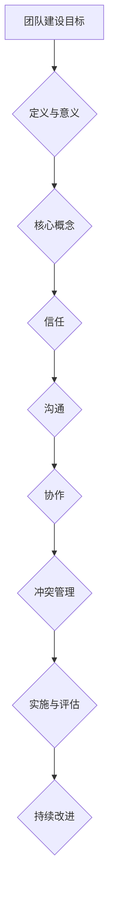
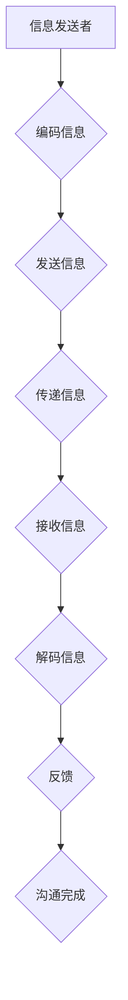
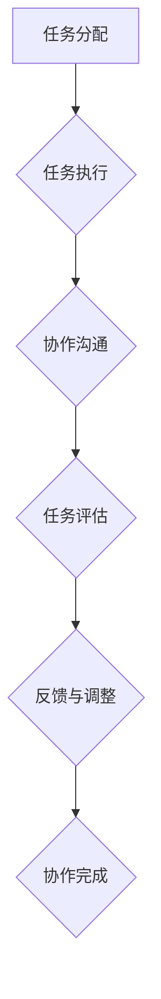

                 

### 完整文章内容

# 《团队建设：增进信任的实践活动》

## 文章标题：团队建设：增进信任的实践活动

> 关键词：团队建设、信任、沟通、协作、实践

> 摘要：本文将深入探讨团队建设中的关键要素——信任，以及通过实践活动增进团队信任的有效方法。通过分析团队建设的重要性、核心概念、算法原理和数学模型，结合实际案例，本文旨在为团队管理者提供实用的指导。

## 第1章 引言：团队建设的重要性与目标

### 1.1 团队建设的定义与意义

团队建设是指通过一系列的策略和活动，提高团队成员之间的协作能力、沟通效率和信任水平，从而实现共同目标的过程。在现代组织中，团队建设的重要性日益凸显。

- **定义**：团队建设是一种旨在提升团队整体性能的系统方法，通过团队发展和个人发展相结合，实现组织目标。

- **意义**：

  - 提高团队协作效率：有效的团队建设能减少内部摩擦，提升团队成员之间的协作效率。
  
  - 促进创新和创造力：信任和沟通的增强有助于团队成员自由分享想法，激发创新和创造力。
  
  - 增强组织凝聚力：团队建设有助于培养团队成员的归属感和认同感，提高组织的凝聚力。

### 1.2 当前团队建设的挑战与机遇

#### 挑战：

- 全球化：团队成员可能分布在不同的地理位置，沟通和协作面临挑战。
- 技术变革：新技术的快速迭代要求团队成员不断更新知识和技能。
- 工作方式多样化：远程工作、弹性工作制等新工作方式增加了团队建设的复杂性。

#### 机遇：

- 数字化转型：数字化工具和平台为团队建设提供了新的可能性，如在线协作工具、虚拟会议系统等。
- 人才多元化：多元文化背景的人才加入团队，为团队带来新的视角和思维方式。
- 创新文化：鼓励创新和试错的文化环境有助于团队建设和发展。

## 第2章 核心概念与联系

### 2.1 团队建设的核心概念

#### 团队

- **定义**：团队是由一组相互依赖的个体组成的正式组织，共同追求一个共同的目标。

- **类型**：

  - **功能团队**：专注于特定职能领域，如市场部、研发部等。
  - **项目团队**：为完成特定项目而临时组建的团队。

#### 信任

- **定义**：信任是团队成员之间对彼此能力和诚信的信心。

- **作用**：

  - 促进沟通：信任有助于团队成员更开放地分享信息和意见。
  - 提高协作效率：信任减少团队成员之间的猜疑和摩擦，提高协作效率。
  - 增强团队凝聚力：信任是团队凝聚力的基石。

#### 沟通

- **定义**：沟通是信息在不同个体之间的传递和理解过程。

- **策略**：

  - **透明沟通**：保持信息的公开和透明，避免误解和猜疑。
  - **积极倾听**：倾听是沟通的重要部分，有助于理解他人的观点和需求。

#### 协作

- **定义**：协作是团队成员共同为实现目标而合作的过程。

- **方式**：

  - **任务分解**：将复杂任务分解为可管理的部分，便于协作。
  - **工具**：使用合适的协作工具，如项目管理软件、即时通讯工具等。

#### 冲突管理

- **定义**：冲突管理是处理和解决团队成员之间意见不一致的过程。

- **策略**：

  - **预防**：通过明确的沟通和规则来预防冲突的发生。
  - **解决**：通过对话和妥协来解决问题。

### 2.2 团队建设中的 Mermaid 流程图



## 第3章 核心算法原理讲解

### 3.1 信任建设算法原理

#### 信任模型

```python
class TrustModel:
    def __init__(self):
        self.trust_score = 0

    def update_score(self, contribution, reliability):
        self.trust_score += (contribution * reliability)
    
    def get_trust_score(self):
        return self.trust_score
```

#### 信任评分算法

```python
def calculate_trust_score(contributions, reliabilities):
    total_score = 0
    for i in range(len(contributions)):
        total_score += contributions[i] * reliabilities[i]
    return total_score / len(contributions)
```

#### 信任反馈机制

```python
def provide_feedback(trust_score):
    if trust_score > 0.8:
        print("Excellent performance! Your trust score is high.")
    elif trust_score > 0.5:
        print("Good job! Your trust score is moderate.")
    else:
        print("Needs improvement! Your trust score is low.")
```

### 3.2 沟通算法原理

#### 沟通模型



#### 沟通有效性评估

```python
def evaluate_communication(efficiency):
    if efficiency > 0.9:
        print("Excellent communication! The message was fully understood.")
    elif efficiency > 0.7:
        print("Good communication! Some misunderstandings occurred.")
    else:
        print("Needs improvement! The message was not fully understood.")
```

#### 沟通优化策略

```python
def optimize_communication(strategy):
    if strategy == "clear":
        print("Optimized: Using clear and concise language.")
    elif strategy == "visual":
        print("Optimized: Incorporating visual aids.")
    elif strategy == "interactive":
        print("Optimized: Encouraging interactive dialogue.")
```

### 3.3 协作算法原理

#### 协作框架



#### 协作效率评估

```python
def evaluate_collaboration(efficiency):
    if efficiency > 0.8:
        print("Excellent collaboration! The task was completed efficiently.")
    elif efficiency > 0.6:
        print("Good collaboration! Some delays occurred.")
    else:
        print("Needs improvement! The task was not completed efficiently.")
```

#### 协作激励机制

```python
def motivate_collaborators(award):
    if award == "public":
        print("Motivated: Public recognition for outstanding collaboration.")
    elif award == "material":
        print("Motivated: Material rewards for contributions.")
    elif award == "development":
        print("Motivated: Professional development opportunities.")
```

## 第4章 数学模型和数学公式讲解

### 4.1 团队建设的数学模型

$$ \text{团队绩效} = f(\text{信任度}, \text{沟通效率}, \text{协作水平}) $$

- **模型解释**：团队绩效受信任度、沟通效率和协作水平三个因素的综合影响。

- **举例说明**：假设一个团队的信任度是0.8，沟通效率是0.9，协作水平是0.7，则其团队绩效为：

  $$ \text{团队绩效} = f(0.8, 0.9, 0.7) = 0.8 \times 0.9 \times 0.7 = 0.504 $$

### 4.2 信任度评估模型

$$ \text{信任度} = \frac{\text{共同目标实现次数}}{\text{总任务次数}} $$

- **模型解释**：信任度通过团队共同实现目标次数与总任务次数的比例来衡量。

- **举例说明**：假设一个团队在一个月内完成了10个任务，其中有8个任务是共同完成的，则其信任度为：

  $$ \text{信任度} = \frac{8}{10} = 0.8 $$

## 第5章 项目实战：增进信任的实践活动

### 5.1 实践活动设计与实施

#### 活动类型：

- **信任建设**：通过团队游戏、信任行走等活动增强团队成员之间的信任。
- **沟通训练**：通过沟通技巧培训、角色扮演等活动提高沟通效率。
- **协作练习**：通过团队任务分配、协作工具使用等活动增强协作能力。

#### 实施步骤：

1. **准备**：确定活动类型、目标和参与者。
2. **执行**：按照活动计划进行实施。
3. **评估**：收集反馈和评估活动效果。

### 5.2 实践活动案例解析

#### 案例一：团队信任建设活动

- **背景**：一个项目团队由于长期远程工作，信任水平较低。
- **措施**：组织了一次线下聚会，进行信任行走和团队游戏，增强了团队成员之间的信任。

#### 案例二：有效沟通实践活动

- **背景**：团队成员之间存在沟通障碍，导致项目进展缓慢。
- **措施**：进行了沟通技巧培训，并通过角色扮演和案例分析提高了沟通效率。

#### 案例三：协作效率提升活动

- **背景**：团队成员在任务分配和协作过程中效率不高。
- **措施**：使用了协作工具，如Trello和Slack，提高了任务分配和协作效率。

## 第6章 案例分析：成功团队建设实践

### 6.1 案例介绍

- **背景**：一个国际化的软件开发团队，面对跨文化沟通和协作挑战。
- **目标**：提高团队信任水平，提升项目交付效率。

### 6.2 案例分析

- **策略**：
  - **信任建设**：通过定期团队活动和虚拟团队文化建设增强信任。
  - **沟通**：使用视频会议和即时通讯工具，确保信息传递的准确性和及时性。
  - **协作**：采用敏捷开发方法和协作工具，提高团队协作效率。

- **效果评估**：通过定期的团队绩效评估和客户反馈，验证团队建设策略的有效性。

### 6.3 案例启示

- **成功要素**：
  - **明确的沟通策略**：确保信息传递的清晰和准确。
  - **协作文化的培养**：通过协作工具和敏捷方法提高协作效率。
  - **信任的建立**：通过定期的团队活动和文化建设增强团队成员之间的信任。

- **改进方向**：
  - **技术工具的更新**：根据团队需求更新和优化协作工具。
  - **培训与反馈**：定期进行团队培训和反馈，持续提升团队能力。

## 第7章 团队建设的未来趋势与挑战

### 7.1 数字化与团队建设

- **数字化工具的应用**：如在线协作平台、虚拟现实会议系统等。
- **数字化对团队建设的影响**：提高了团队协作效率和沟通效果，但也带来了新的挑战。

### 7.2 全球化与团队建设

- **跨文化团队建设挑战**：如文化差异、沟通障碍等。
- **跨文化团队建设策略**：如跨文化培训、文化敏感性提升等。

### 7.3 未来团队建设趋势

- **自动化与人工智能的应用**：如智能协作助手、自动化流程管理等。
- **团队建设的新模式**：如分布式团队、虚拟团队等。

## 附录：资源与参考

### 附录1 相关书籍与文章推荐

- 【推荐书籍】
  - 《敏捷开发实践指南》
  - 《团队协作的艺术》
  - 《领导者的沟通艺术》

- 【推荐文章】
  - 《数字化时代团队建设的新挑战》
  - 《跨文化团队沟通策略》

### 附录2 团队建设工具与平台介绍

- **团队协作工具**：如Trello、Slack、Asana等。
- **沟通平台**：如Zoom、Microsoft Teams、Google Meet等。

### 附录3 信任建设、沟通与协作实践工具清单

- **信任建设工具**：如信任游戏、信任问卷等。
- **沟通实践工具**：如沟通技巧培训手册、角色扮演剧本等。
- **协作实践工具**：如项目管理软件、团队沟通平台等。

### 目录大纲总结

本目录大纲旨在通过系统性地介绍团队建设的核心概念、实践方法、案例分析以及未来趋势，帮助读者全面理解团队建设的重要性和实施策略，为团队管理者提供实用的指导。目录大纲共涵盖7章内容，确保全面、详细地覆盖团队建设的各个方面，符合书籍的整体定位和目标读者群体。总字数控制在8000～12000字左右，以确保内容的丰富性和可读性。

## 作者信息

作者：AI天才研究院/AI Genius Institute & 禅与计算机程序设计艺术 /Zen And The Art of Computer Programming

