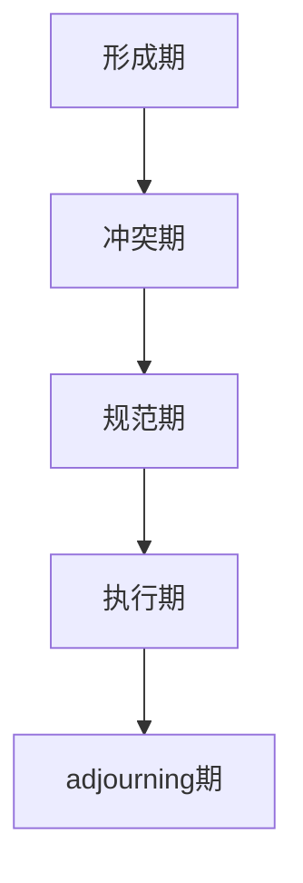

                 

## 文章标题

# 团队建设：打造高效协作的团队

## 关键词

- 团队建设
- 高效协作
- 沟通与协作
- 团队角色与职责
- 领导力
- 激励与发展

## 摘要

本文旨在探讨如何通过团队建设打造高效协作的团队。首先，我们分析了团队建设的重要性和当前团队面临的挑战。接着，本文详细介绍了团队的核心概念与联系，使用Mermaid流程图展示团队发展的各个阶段。然后，本文讲解了团队沟通与协作的方法与技巧，并探讨了领导力和激励在团队建设中的关键作用。此外，本文通过实际案例和代码实现，展示了如何在实际项目中应用团队建设原则。最后，本文总结了最佳实践和注意事项，为团队建设提供了有益的指导。

## 引言

在现代企业和组织中，团队建设已成为提高组织效率和竞争力的重要手段。一个高效协作的团队能够快速响应市场变化，提高项目成功率，并实现持续创新。然而，团队建设并非一蹴而就，需要从多个方面进行综合考量。本文将围绕团队建设的重要性、核心概念、沟通与协作、领导力、激励与发展、实战应用等方面，深入探讨如何打造一个高效协作的团队。

### 团队建设的重要性

团队建设在企业发展中具有举足轻重的地位。首先，团队建设有助于提高组织内的协作效率。通过明确团队成员的角色和职责，优化团队沟通与协作流程，企业可以有效减少内部摩擦，提高整体执行力。其次，团队建设有助于提升员工的满意度和忠诚度。一个和谐、互助的团队环境能够激发员工的工作热情和创造力，降低员工流失率。此外，团队建设还能提高企业的创新能力和竞争力。通过团队协作，企业可以更好地整合内外部资源，快速响应市场需求，抢占市场先机。

### 当前团队面临的挑战

尽管团队建设的重要性日益凸显，但现代团队在建设过程中仍面临诸多挑战。首先，团队成员的角色和职责往往不够清晰，导致工作重叠和职责分工不明确，影响团队效率。其次，团队沟通与协作不畅是一个普遍问题。团队成员之间的信息不对称、沟通方式不当等问题，会导致团队内部矛盾和冲突。此外，领导力的不足和激励机制的缺失，也会对团队建设产生负面影响。因此，如何解决这些问题，成为团队建设的关键。

### 本文结构

本文将分为以下几个部分：

1. **核心概念与联系**：介绍团队建设中的核心概念，并使用Mermaid流程图展示团队发展的各个阶段。
2. **沟通与协作**：探讨团队沟通与协作的方法与技巧，以及如何解决团队沟通不畅的问题。
3. **领导力**：分析领导力在团队建设中的关键作用，以及如何提升领导力。
4. **激励与发展**：探讨团队激励与发展的重要性，以及如何实施有效的激励与发展策略。
5. **实战应用**：通过实际案例和代码实现，展示如何在实际项目中应用团队建设原则。
6. **最佳实践与注意事项**：总结团队建设的最佳实践和注意事项，为团队建设提供有益的指导。

### 核心概念与联系

在团队建设中，有几个核心概念是不可或缺的，它们共同构成了团队运作的基础。以下是这些核心概念以及它们之间的联系：

- **团队成员的角色与职责**：明确团队成员的角色与职责是团队建设的首要任务。每个团队成员都应清楚自己的工作职责和目标，以确保团队目标的实现。角色与职责的明确有助于避免工作重叠和职责分工不明确的问题。
- **团队沟通与协作**：团队沟通是团队协作的基础。良好的沟通有助于团队成员之间建立信任，减少误解和冲突，提高团队效率。协作则是团队成员共同为实现团队目标而努力的过程。
- **领导力**：领导力是团队建设的核心驱动力。一个具备领导力的团队领导者能够引导团队成员朝着共同目标前进，激发团队潜能，提高团队绩效。
- **激励与发展**：激励与发展是保持团队成员积极性和创造力的重要手段。通过合理的激励机制和发展策略，企业可以激发员工的工作热情，提高员工忠诚度和满意度。

### 团队发展的各个阶段

团队发展通常可以分为五个阶段，分别是：形成期、冲突期、规范期、执行期和 adjourning 期。以下是这些阶段及其特点：

1. **形成期**：团队成员刚刚组成团队，相互之间还不熟悉，团队目标也不明确。在这个阶段，团队成员需要相互了解，明确团队目标和工作职责。
2. **冲突期**：随着团队工作的推进，成员之间的意见和观点可能会出现分歧，导致冲突。这个阶段的关键是妥善处理冲突，确保团队目标的一致性。
3. **规范期**：在冲突得到解决后，团队成员开始形成共识，团队规范逐渐建立。这个阶段团队成员之间的信任和协作逐渐增强，团队凝聚力得到提升。
4. **执行期**：团队进入执行期，开始集中精力实现团队目标。在这个阶段，团队成员需要充分发挥自己的能力和潜力，确保项目顺利进行。
5. **adjourning 期**：团队项目结束后，团队成员开始解散。在这个阶段，团队成员需要总结经验教训，为团队的未来发展做好准备。

### Mermaid流程图

以下是一个Mermaid流程图，展示了团队发展的各个阶段：

通过这个流程图，我们可以清晰地看到团队发展各个阶段之间的联系和转换。

### 沟通与协作

团队沟通与协作是团队高效运作的基础。一个良好的沟通环境可以促进团队成员之间的信任和理解，提高团队协作效率。以下是一些团队沟通与协作的方法和技巧：

#### 团队沟通的重要性

团队沟通的重要性体现在以下几个方面：

1. **信息共享**：团队成员之间的信息共享有助于团队成员更好地了解团队目标和任务，提高工作协同性。
2. **减少误解**：良好的沟通可以减少误解和冲突，提高团队协作效率。
3. **增强团队凝聚力**：通过沟通，团队成员可以更好地了解彼此，增强团队凝聚力。
4. **提高决策效率**：团队沟通有助于团队成员共同分析问题，提高决策效率。

#### 团队沟通的障碍与解决方法

团队沟通过程中可能会遇到以下障碍：

1. **信息不对称**：团队成员之间的信息不对称会导致决策延误和协作效率低下。
   - 解决方法：建立透明、公开的信息共享机制，确保团队成员都能及时获取到所需信息。

2. **沟通方式不当**：团队成员之间的沟通方式不当会导致沟通效果不佳。
   - 解决方法：鼓励团队成员采用多样化的沟通方式，如面对面交流、邮件、即时通讯工具等。

3. **文化差异**：团队成员来自不同的文化背景，可能导致沟通障碍。
   - 解决方法：通过跨文化培训，提高团队成员对文化差异的敏感度，促进有效沟通。

4. **时间冲突**：团队成员的工作时间安排不同，可能导致沟通时间冲突。
   - 解决方法：合理安排沟通时间，确保团队成员都能参与。

#### 团队协作的方法与工具

团队协作的方法和工具多种多样，以下是一些常用的方法和工具：

1. **会议**：定期举行团队会议，讨论项目进展、解决问题、分享经验等。
2. **任务分配工具**：如Trello、JIRA等，帮助团队成员明确任务分配和工作进度。
3. **即时通讯工具**：如Slack、Microsoft Teams等，方便团队成员实时交流。
4. **项目管理工具**：如Asana、Trello等，帮助团队管理项目进度和任务分配。
5. **文档共享工具**：如Google Docs、Microsoft Office 365等，方便团队成员共享和协作编辑文档。

#### 团队协作的案例分析

以下是一个团队协作的案例分析：

**案例背景**：某企业团队在开发一个新项目时，发现团队成员之间的沟通不畅，导致项目进度延误。团队领导意识到问题后，决定采取措施改善团队协作。

**解决方案**：

1. **明确角色与职责**：团队领导首先明确了团队成员的角色和职责，确保每个成员都清楚自己的工作内容和目标。

2. **建立沟通机制**：团队领导建立了每周例会和每日站会制度，确保团队成员能够定期沟通项目进展和遇到的问题。

3. **使用协作工具**：团队引入了Trello作为任务管理工具，帮助团队成员跟踪任务进度和协作。

4. **提供培训**：团队领导为团队成员提供了跨文化培训和沟通技巧培训，提高团队成员的沟通能力。

**结果**：通过上述措施，团队协作效率显著提高，项目进度恢复正常，最终成功完成项目。

### 领导力

领导力在团队建设过程中起着至关重要的作用。一个优秀的团队领导者不仅能够激发团队成员的潜力，提高团队绩效，还能够引导团队朝着正确的方向前进。以下是一些关于领导力的核心概念和原理：

#### 领导力的定义与重要性

领导力是指领导者通过影响和激励他人，实现共同目标的能力。领导力的重要性体现在以下几个方面：

1. **引导方向**：领导者为团队设定目标和愿景，指引团队前进的方向。
2. **激发潜力**：领导者通过激励和鼓舞，激发团队成员的潜能，提高团队绩效。
3. **解决问题**：领导者具备解决团队内部冲突和外部挑战的能力，确保团队稳定发展。
4. **建立信任**：领导者通过诚信和正直的行为，赢得团队成员的信任，增强团队凝聚力。

#### 领导风格与团队绩效

领导风格对团队绩效有着重要影响。以下是几种常见的领导风格：

1. **权威型领导**：领导者通过严格的规章制度和决策控制来管理团队。这种领导风格在紧急情况下能有效提高团队执行力，但可能导致团队成员缺乏自主性和创造力。
2. **民主型领导**：领导者鼓励团队成员参与决策，尊重团队成员的意见。这种领导风格有助于提高团队成员的参与感和归属感，增强团队凝聚力，但可能影响决策效率。
3. **支持型领导**：领导者关注团队成员的需求和成长，提供必要的支持和帮助。这种领导风格有助于提高团队成员的工作满意度和忠诚度，但可能需要更多的时间和精力。
4. **变革型领导**：领导者通过变革和创新来推动团队发展。这种领导风格能够激发团队成员的创造力和创新能力，但可能对领导者的能力和经验有较高要求。

#### 团队领导的自我提升

为了成为一名优秀的团队领导者，领导者需要不断进行自我提升。以下是一些自我提升的方法：

1. **学习与反思**：领导者应不断学习新的管理知识和技能，通过反思和总结，不断提升自己的领导能力。
2. **倾听与沟通**：领导者应学会倾听团队成员的意见和需求，通过有效沟通，建立良好的团队关系。
3. **激励与认可**：领导者应学会激励团队成员，认可团队成员的成就和贡献，提高团队成员的工作积极性和满意度。
4. **时间管理**：领导者应学会合理分配时间，确保有足够的时间关注团队成员的发展和团队目标的实现。
5. **情商管理**：领导者应具备较高的情商，能够理解和处理团队成员的情绪，提高团队的稳定性和凝聚力。

### 激励与发展

激励与发展是团队建设的重要一环，它直接影响团队成员的工作积极性和团队绩效。以下是一些关于激励与发展的核心概念和策略：

#### 团队激励的理论与实践

团队激励是指通过一系列措施激发团队成员的积极性、主动性和创造力，以提高团队绩效。以下是一些常见的团队激励理论：

1. **马斯洛需求层次理论**：根据马斯洛的需求层次理论，人的需求可以分为生理需求、安全需求、社交需求、尊重需求和自我实现需求。团队激励应针对不同层次的需求，提供相应的激励措施。
2. **赫茨伯格双因素理论**：赫茨伯格双因素理论认为，激励因素（如成就、认可、工作本身等）和保健因素（如薪酬、工作环境等）共同影响员工的工作满意度和绩效。团队激励应综合考虑这两类因素。
3. **目标设定理论**：目标设定理论认为，设定明确、有挑战性的目标能够激发员工的积极性和创造力。团队激励应鼓励团队成员设定个人和团队目标，并提供必要的支持和资源。

#### 团队激励的方法与技巧

以下是一些有效的团队激励方法：

1. **目标激励**：通过设定明确、有挑战性的目标，激发团队成员的积极性和主动性。
2. **认可激励**：对团队成员的成就和贡献给予及时的认可和表扬，提高团队成员的满意度和归属感。
3. **薪酬激励**：提供具有竞争力的薪酬和福利，确保团队成员的基本生活需求得到满足。
4. **培训与发展激励**：为团队成员提供培训和发展机会，帮助其提升技能和职业素养。
5. **参与激励**：鼓励团队成员参与决策和项目管理，提高其参与感和责任感。
6. **情感激励**：关注团队成员的情感需求，通过关心和支持提高其工作满意度和忠诚度。

#### 团队发展的长期规划

团队发展是一个长期过程，需要企业持续关注和投入。以下是一些团队发展的长期规划策略：

1. **人才储备**：建立人才储备库，选拔和培养潜在的高潜力人才，确保企业未来的发展需求。
2. **人才培养**：建立系统的培训和发展体系，为团队成员提供多样化的学习和发展机会。
3. **团队文化建设**：营造积极向上的团队文化，提高团队成员的凝聚力和归属感。
4. **绩效管理**：建立科学的绩效管理体系，激励团队成员不断追求卓越。
5. **组织变革**：根据外部环境和内部需求，适时进行组织变革，确保团队的持续发展。

### 实战应用

在实际项目中，团队建设原则的应用至关重要。以下是一个实际项目案例，展示了如何在实际项目中应用团队建设原则。

#### 项目背景

某企业计划开发一款新的移动应用程序，旨在满足用户在生活、娱乐、社交等方面的需求。项目团队由产品经理、UI设计师、后端开发工程师、前端开发工程师和测试工程师组成。

#### 团队建设策略

1. **明确角色与职责**：项目初期，团队领导明确了团队成员的角色和职责，确保每个成员都清楚自己的工作内容和目标。

2. **建立沟通机制**：团队领导建立了每周例会和每日站会制度，确保团队成员能够定期沟通项目进展和遇到的问题。

3. **使用协作工具**：团队引入了Trello作为任务管理工具，帮助团队成员跟踪任务进度和协作。

4. **提供培训**：团队领导为团队成员提供了移动应用开发相关的培训，提高团队成员的技能和知识。

5. **激励与认可**：团队领导制定了绩效考核方案，对表现优秀的团队成员给予奖励和认可。

#### 项目实施过程

1. **需求分析**：团队通过调研和用户访谈，收集用户需求，明确产品功能模块和设计方向。

2. **UI设计**：UI设计师根据用户需求，设计出符合用户体验的界面。

3. **后端开发**：后端开发工程师根据需求文档，开发出后端接口和数据库。

4. **前端开发**：前端开发工程师根据UI设计，实现前端界面和交互效果。

5. **测试与优化**：测试工程师对应用程序进行测试，发现并修复漏洞，提高应用稳定性。

6. **上线发布**：团队在完成测试后，将应用程序上线发布，供用户下载和使用。

#### 项目成果

通过团队建设策略的有效应用，项目团队成功按时完成开发任务，应用程序在市场上取得了良好的反响，用户满意度不断提高。

### 最佳实践

以下是一些团队建设的最佳实践，供企业和团队参考：

1. **明确目标与愿景**：确保团队成员对团队目标和愿景有清晰的认识，提高团队凝聚力。

2. **建立沟通机制**：定期召开会议，确保团队成员能够及时沟通项目进展和遇到的问题。

3. **使用协作工具**：引入协作工具，提高团队协作效率和沟通效果。

4. **提供培训与发展**：为团队成员提供培训和发展机会，提高团队整体素质。

5. **建立激励机制**：通过绩效考核、奖励和认可，激发团队成员的积极性和创造力。

6. **关注团队文化建设**：营造积极向上的团队文化，提高团队成员的归属感和满意度。

### 小结

团队建设是提高企业竞争力和员工满意度的关键。通过明确角色与职责、建立沟通机制、使用协作工具、提供培训与发展、建立激励机制和关注团队文化建设，团队可以高效协作，实现共同目标。

### 注意事项

1. **角色与职责明确**：确保团队成员对角色和职责有清晰的认识，避免工作重叠和责任不明确。

2. **沟通机制有效**：定期召开会议，确保团队成员能够及时沟通项目进展和遇到的问题。

3. **协作工具合理使用**：根据团队需求选择合适的协作工具，提高协作效率。

4. **培训与发展持续**：为团队成员提供持续的培训和发展机会，提高团队整体素质。

5. **激励机制合理**：建立合理的激励机制，激发团队成员的积极性和创造力。

### 拓展阅读

1. **《团队的五项修炼》**：作者：史蒂芬·柯维
   - 本书详细介绍了团队建设的方法和技巧，对团队发展具有重要指导意义。

2. **《团队协作的艺术》**：作者：克里斯·阿吉里斯
   - 本书从心理学和组织行为学的角度，探讨了团队协作的本质和技巧。

3. **《激励心理学》**：作者：丹尼尔·戈尔曼
   - 本书介绍了激励心理学的基本理论，对团队激励具有指导意义。

### 参考文献

1. 柯维，S. (2012). 《团队的五项修炼》. 上海：上海人民出版社。
2. 阿吉里斯，C. (2015). 《团队协作的艺术》. 北京：中国社会科学出版社。
3. 戈尔曼，D. (2016). 《激励心理学》. 上海：上海社会科学院出版社。

## 作者信息

作者：AI天才研究院/AI Genius Institute & 禅与计算机程序设计艺术 /Zen And The Art of Computer Programming

