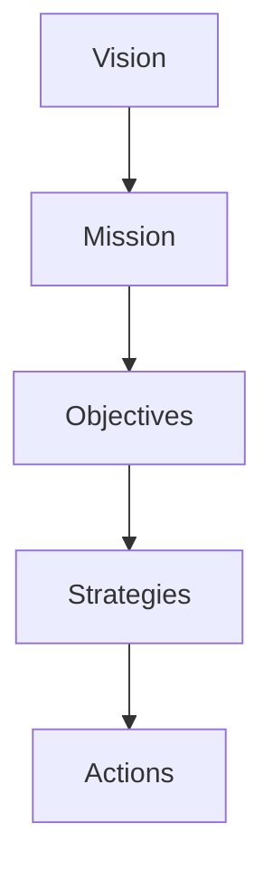

                 


### 第1章 引言

#### 1.1 为什么团队愿景至关重要

团队愿景是组织成功的关键因素之一。它不仅为团队提供了一个明确的指导方向，还能激发成员的热情和动力，从而推动团队实现更高层次的成就。以下是一些关键点，阐述团队愿景的重要性：

**1. 指引方向**

团队愿景为团队提供了一个明确的目标和方向。这个目标可以是短期目标，也可以是长期愿景。它为团队成员提供了一个共同的方向，使每个人的努力都能朝着同一个目标前进。

**2. 激发动力**

愿景能够激发团队成员的热情和动力。当团队成员了解到他们的工作对于实现团队愿景有多么重要时，他们就会更加投入工作，努力实现愿景。

**3. 提高生产力**

拥有共同愿景的团队往往能够更加高效地工作。因为团队成员都知道他们的工作如何与其他人的工作相协调，从而减少了不必要的内部摩擦和资源浪费。

**4. 增强团队凝聚力**

共同愿景有助于增强团队成员之间的凝聚力。当团队成员都为了同一个目标而努力时，他们之间的联系就会变得更加紧密，从而形成一个更加团结的团队。

**5. 实现组织目标**

团队愿景不仅对团队内部有影响，还能帮助团队实现组织整体的目标。通过将团队愿景与组织目标相结合，团队可以确保他们的努力与组织的整体战略相一致。

**1.2 本书的目的和结构**

本书的目的是帮助读者了解团队愿景的重要性，并提供实用的方法和策略来建立和实现团队愿景。本书结构如下：

- **第1章 引言**：介绍团队愿景的重要性，本书的目的和结构。
- **第2章 团队愿景的概念与定义**：解释团队愿景的概念、定义和重要性。
- **第3章 共同目标和价值观**：详细讨论如何建立共同目标和价值观，以及它们如何影响团队愿景。
- **第4章 愿景、目标、价值观之间的联系**：描述愿景、目标和价值观之间的相互作用和关系。
- **第5章 愿景设定的过程**：揭示设定团队愿景的步骤。
- **第6章 实现团队愿景的策略**：探讨如何制定和实施策略来实现团队愿景。
- **第7章 愿景跟踪与评估**：介绍如何跟踪和评估团队愿景的进展。
- **第8章 成功案例研究**：分享成功团队的案例研究。
- **第9章 障碍与解决方案**：讨论建立团队愿景过程中可能遇到的障碍，并提供解决方案。
- **第10章 结论与展望**：总结本书的主要观点，并展望未来团队愿景的发展趋势。

通过本书，读者将了解如何建立和实现团队愿景，从而提高团队绩效，实现组织目标。让我们一步步深入探讨这一主题，确保读者能够从中获得实用的知识和技能。

---

### 第2章 团队愿景的概念与定义

#### 2.1 愿景的概念

**核心概念与联系**

愿景（Vision）是指一个组织或团队在未来的某个时刻希望达到的状态或目标。它是未来导向的，具有指导性，能够为团队成员提供明确的指引和方向。


- **Mermaid流程图**：展示愿景与使命、目标、策略等核心概念之间的联系。



**核心算法原理讲解**

- **伪代码**：说明愿景是如何指导团队行动的。

```plaintext
function VisionGuidedAction(teamVision):
    for each member in team:
        member.actionPlan = GenerateActionPlan(teamVision, member.role)
    return team
```

**数学模型和数学公式**

- **公式**：描述愿景对团队绩效的影响。

$$ \text{Performance} = \text{f}( \text{Vision Clarity}, \text{Team Alignment}, \text{Resource Allocation}) $$

- **详细讲解**：愿景的清晰度、团队的一致性和资源分配是影响团队绩效的关键因素。

**举例说明**

- **案例**：一家科技公司希望通过技术创新成为全球领先的科技公司。这个愿景为团队提供了一个明确的指引，使团队成员都致力于研发和推广新技术，从而提高了团队的绩效。

---

#### 2.2 愿景的重要性

愿景的重要性体现在以下几个方面：

**1. 提供方向**

愿景为团队提供了一个明确的未来方向，使团队成员能够清晰地了解他们的工作目标和发展路径。

**2. 激发动力**

愿景能够激发团队成员的热情和动力，使他们对工作更加投入，从而提高团队的整体绩效。

**3. 增强凝聚力**

共同的愿景有助于增强团队成员之间的凝聚力，使他们更加团结协作，共同为实现愿景而努力。

**4. 引导决策**

愿景可以作为团队决策的指导原则，帮助团队成员在面对挑战和选择时，始终朝着实现愿景的方向前进。

**5. 提高适应性**

愿景使团队更具适应性，能够更好地应对外部环境的变化，从而保持竞争优势。

---

#### 2.3 团队愿景的实例

以下是几个团队愿景的实例：

**1. 一家初创公司：**

愿景：成为全球领先的智能家居解决方案提供商。

这个愿景为团队提供了一个明确的未来方向，使团队成员都致力于研发和推广智能家居技术，从而提高了团队的整体绩效。

**2. 一家跨国公司：**

愿景：通过技术创新，推动世界更美好。

这个愿景不仅为团队提供了一个明确的未来方向，还激发了团队成员的热情和动力，使他们更加投入工作，共同为实现愿景而努力。

**3. 一家非营利组织：**

愿景：消除全球贫困，为所有人创造公平的机会。

这个愿景为团队提供了一个崇高的目标，使团队成员都致力于为这个目标而努力，从而增强了团队的凝聚力。

通过这些实例，我们可以看到愿景对于团队的重要性。一个清晰的愿景不仅能够为团队提供方向，还能激发团队成员的热情和动力，从而推动团队实现更高层次的成就。在接下来的章节中，我们将进一步探讨如何建立和实现团队愿景。

---

### 第3章 共同目标和价值观

#### 3.1 共同目标的重要性

共同目标（Common Goals）是团队成员共同努力的方向和目标，它们对于团队的协调和合作至关重要。以下是一些关键点，阐述共同目标的重要性：

**1. 促进协调与合作**

共同目标能够促进团队成员之间的协调与合作。当每个人都清楚自己的目标是什么，以及如何与其他人协作时，团队的工作效率将大幅提升。

**2. 提高团队凝聚力**

共同目标有助于提高团队凝聚力。当团队成员都为了同一个目标而努力时，他们之间的联系将更加紧密，从而形成一个更加团结的团队。

**3. 增强责任感**

共同目标使团队成员更加有责任感。当每个人都知道自己的工作对于实现共同目标有多么重要时，他们就会更加投入工作，努力实现目标。

**4. 提高团队绩效**

共同目标有助于提高团队的整体绩效。当团队成员都为了同一个目标而努力时，团队的工作效率将大幅提升，从而实现更高的绩效。

**3.2 价值观的定义与类型**

价值观（Values）是指组织或团队所崇尚和追求的核心信念和行为准则。它们是团队文化的基石，能够指导团队成员的行为和决策。以下是几种常见的价值观类型：

**1. 客户至上**

客户至上是一种以客户为中心的价值观，强调为客户提供优质服务和满意体验。

**2. 创新与创造力**

创新与创造力是一种鼓励创新和尝试新事物的价值观，强调不断改进和创造新的解决方案。

**3. 诚信与正直**

诚信与正直是一种强调诚实和正直行为的价值观，强调遵守道德规范和法律法规。

**4. 团队合作**

团队合作是一种鼓励团队合作和协作的价值观，强调共同承担责任和分享成功。

**3.3 建立共同目标和价值观的步骤**

要建立有效的共同目标和价值观，需要以下步骤：

**1. 定义共同目标**

首先，团队需要明确共同的目标和愿景。这可以通过讨论、头脑风暴和共识达成来实现。

**2. 确定价值观**

在明确共同目标后，团队需要确定哪些价值观将指导他们的行为和决策。这可以通过问卷调查、访谈和团队讨论来实现。

**3. 沟通与宣传**

一旦共同目标和价值观确定，团队需要通过有效的沟通和宣传来确保每个成员都了解并认同这些目标和价值观。

**4. 培训与激励**

为了确保共同目标和价值观得到贯彻执行，团队需要进行相关培训，并提供激励措施，以鼓励成员积极践行这些目标和价值观。

**5. 跟踪与评估**

最后，团队需要定期跟踪和评估共同目标和价值观的实施情况，并根据需要进行调整和改进。

通过以上步骤，团队可以建立有效的共同目标和价值观，从而提高团队绩效，实现组织目标。

---

### 第4章 愿景、目标、价值观之间的联系

愿景、目标和价值观是团队成功的关键要素，它们之间存在着密切的联系。以下将详细描述这些概念之间的相互作用和关系。

#### 4.1 愿景、目标、价值观之间的相互作用

愿景、目标和价值观之间的相互作用是构建成功团队的基础。愿景提供了一个长远的目标和方向，而目标是实现愿景的具体步骤和里程碑。价值观则是团队行为和决策的指导原则，确保团队成员在追求目标的过程中始终保持一致。

**1. 愿景与目标**

愿景和目标之间存在一种层级关系。愿景是团队的长远目标和理想状态，而目标是实现愿景的具体步骤和里程碑。例如，一家科技公司的愿景可能是“通过技术创新改变世界”，而实现这一愿景的具体目标可能是“在五年内成为该领域的领先者”。

**2. 目标与价值观**

目标与价值观之间的联系在于，价值观指导着团队在实现目标过程中的行为和决策。例如，如果团队价值观强调“客户至上”，那么在制定和实现目标时，团队会优先考虑客户的满意度和需求。

**3. 价值观与愿景**

价值观与愿景之间的联系在于，价值观是团队在追求愿景过程中坚持的原则。这些原则确保团队在实现愿景的过程中不会偏离正道。例如，一家公司如果愿景是“成为行业领导者”，那么其价值观可能包括“诚信经营”和“持续创新”，这些价值观将帮助团队在追求愿景的过程中保持一致。

#### 4.2 如何通过联系构建强大的团队

通过理解和应用愿景、目标和价值观之间的联系，团队可以构建一个强大的团队，实现更高的绩效和成功。

**1. 确立共同愿景**

首先，团队需要确立一个共同的愿景，这将为团队提供一个明确的方向和目标。通过讨论、头脑风暴和共识达成，确保所有成员都认同并支持这个愿景。

**2. 制定可衡量的目标**

在确立愿景后，团队需要制定一系列可衡量的目标，这些目标应该是具体、可行和有时限的。这些目标将帮助团队逐步实现愿景。

**3. 确定核心价值观**

接下来，团队需要明确自己的核心价值观，这些价值观将指导团队在实现目标过程中的行为和决策。通过问卷调查、访谈和团队讨论，确保所有成员都了解并认同这些价值观。

**4. 保持一致**

一旦愿景、目标和价值观确定，团队需要保持一致。这包括定期沟通、培训和激励成员，以确保他们始终遵循这些原则。

**5. 定期评估与调整**

最后，团队需要定期评估愿景、目标和价值观的实施情况，并根据需要进行调整。这可以帮助团队保持活力和适应性，确保他们始终保持朝着愿景前进。

通过以上步骤，团队可以构建一个强大的团队，实现更高的绩效和成功。愿景、目标和价值观之间的紧密联系是实现这一目标的关键。

---

### 第5章 愿景设定的过程

愿景设定的过程是建立团队愿景的关键步骤。一个明确且具有吸引力的愿景能够激发团队成员的热情和动力，从而推动团队实现更高层次的成就。以下是愿景设定的详细过程：

#### 5.1 市场分析

市场分析是愿景设定的第一步，它帮助团队了解当前市场环境、竞争态势和潜在机会。以下是一些关键步骤：

**1. 了解市场需求**

通过市场调研、客户反馈和竞争对手分析，团队可以了解市场需求和趋势。这有助于团队确定愿景是否与市场需求相符。

**2. 评估竞争环境**

分析竞争对手的产品、服务和策略，可以帮助团队了解市场定位和竞争优势。这有助于团队在设定愿景时考虑如何差异化自己。

**3. 探索潜在机会**

通过市场分析，团队可以发现新的市场机会，如未满足的需求、新兴技术或市场缺口。这些机会可以为团队愿景提供新的方向。

#### 5.2 员工参与

员工参与是愿景设定的关键因素，它确保团队成员都认同并支持愿景。以下是一些员工参与的步骤：

**1. 组织研讨会**

通过组织研讨会、头脑风暴会议和小组讨论，团队可以收集成员的意见和建议。这有助于团队成员共同参与愿景的设定。

**2. 汇总意见**

收集到的意见和建议需要被汇总和分析，以便团队可以从中提取出共同的观点和目标。这有助于确保愿景具有广泛的支持基础。

**3. 达成共识**

通过讨论和协商，团队需要达成关于愿景的共识。这包括确定愿景的表述、目标和核心价值观。共识的达成有助于确保团队成员在追求愿景时保持一致。

#### 5.3 愿景表述

愿景表述是愿景设定的最后一步，它需要清晰、简洁地传达团队的未来愿景。以下是一些关键点：

**1. 清晰明了**

愿景表述需要清晰明了，使团队成员能够轻松理解愿景的核心内容和目标。这有助于确保团队成员对愿景有一致的理解。

**2. 具有吸引力**

愿景表述需要具有吸引力，能够激发团队成员的热情和动力。这可以通过使用积极、激励性的语言来实现。

**3. 灵活调整**

愿景表述需要具有一定的灵活性，以便团队可以根据外部环境的变化和内部需求进行调整。这有助于团队保持愿景的持续性和适应性。

通过以上步骤，团队可以设定一个明确、具有吸引力且具有广泛支持基础的愿景。一个有效的愿景将指导团队前进，激发团队成员的潜力，实现更高的成就。

---

### 第6章 实现团队愿景的策略

实现团队愿景需要制定和实施一系列策略。这些策略将确保团队在追求愿景的过程中始终保持方向，并有效地利用资源。以下是一些关键步骤和策略：

#### 6.1 制定策略

**1. 确定关键指标**

首先，团队需要确定关键指标（KPIs），这些指标将用于衡量团队在实现愿景方面的进展。例如，如果团队愿景是“在三年内成为行业领导者”，那么关键指标可能包括市场份额、收入增长率和客户满意度。

**2. 制定行动计划**

在确定关键指标后，团队需要制定具体的行动计划。这些行动计划应该包括具体的任务、责任人和完成时间。例如，如果关键指标之一是提高客户满意度，那么行动计划可能包括改进客户服务流程、增加客户互动渠道和培训客服团队。

**3. 制定预算**

制定策略时，团队需要考虑预算分配。这包括确定每个行动计划的预算，并确保总预算与团队的资源相匹配。合理的预算分配有助于确保团队在实施策略时不会遇到资源短缺的问题。

**4. 制定时间表**

制定策略时，团队需要制定一个详细的时间表，明确每个行动计划的开始和结束时间。这有助于团队在追求愿景的过程中保持进度，并及时调整计划。

#### 6.2 实施策略

**1. 建立执行团队**

在实施策略时，团队需要建立一支执行团队，负责监督和推动每个行动计划的执行。执行团队应该包括关键利益相关者，如项目负责人、项目经理和相关部门的负责人。

**2. 激励和培训**

为了确保策略的有效实施，团队需要激励和培训成员。激励措施可以包括奖金、晋升机会和认可表彰。培训则有助于提高成员的技能和知识，确保他们能够胜任自己的工作。

**3. 监督和反馈**

在策略实施过程中，团队需要定期监督和评估进展，并根据反馈进行调整。这可以通过定期会议、报告和数据分析来实现。有效的监督和反馈有助于团队及时发现和解决问题，确保策略的有效实施。

#### 6.3 关键绩效指标（KPIs）

**1. 制定KPIs**

制定KPIs是衡量团队在实现愿景方面的进展的关键步骤。KPIs应该与团队的愿景和目标密切相关，并能够反映团队在各个方面的绩效。

**2. 选择合适的KPIs**

选择合适的KPIs是确保策略有效性的关键。例如，如果团队愿景是提高客户满意度，那么KPIs可能包括客户满意度调查得分、投诉率和服务响应时间。

**3. 监测和评估**

在制定KPIs后，团队需要定期监测和评估这些指标，以了解自己在实现愿景方面的进展。这可以通过自动化工具、定期报告和数据分析来实现。

**4. 调整和改进**

根据监测和评估结果，团队需要及时调整和改进策略。这可以包括修改行动计划、重新分配资源或引入新的方法和技术。

通过以上步骤，团队可以制定和实施有效的策略，实现团队愿景。一个成功的策略将确保团队在追求愿景的过程中始终保持方向，并有效地利用资源。

---

### 第7章 愿景跟踪与评估

#### 7.1 跟踪进展

跟踪团队愿景的进展是确保团队按照既定方向前进的重要环节。以下是一些关键步骤：

**1. 制定跟踪计划**

首先，团队需要制定一个详细的跟踪计划，包括跟踪的频率、方法和责任分配。例如，团队可以每周或每月进行一次进度评估，由项目经理或执行团队负责收集和整理相关数据。

**2. 收集数据**

在跟踪计划执行过程中，团队需要收集与愿景相关的一系列数据。这些数据可以包括关键绩效指标（KPIs）、财务数据、客户反馈和员工满意度调查结果。

**3. 分析数据**

收集到的数据需要进行分析，以便团队可以了解自己在实现愿景方面的进展。分析结果可以帮助团队发现潜在的问题和机会，并指导后续的行动。

#### 7.2 评估效果

评估团队愿景的效果是确保团队目标实现的重要环节。以下是一些关键步骤：

**1. 确定评估指标**

首先，团队需要确定评估指标，这些指标应该与团队愿景和目标密切相关。例如，如果团队愿景是提高市场份额，评估指标可能包括市场份额增长率、收入和利润。

**2. 收集评估数据**

在确定评估指标后，团队需要收集相关数据，以便进行评估。这些数据可以来自内部报告、市场调研和客户反馈等。

**3. 分析评估结果**

收集到的评估数据需要进行分析，以便团队可以了解愿景的实现程度。分析结果可以帮助团队确定是否需要调整策略或重新设定目标。

#### 7.3 工具和指标

**1. 选择合适的工具**

为了有效地跟踪和评估团队愿景的进展，团队需要选择合适的工具。这些工具可以包括项目管理软件、数据分析工具和协作平台。

**2. 确定关键指标**

团队需要确定与愿景相关的关键指标，这些指标将用于衡量团队的进展。例如，如果团队愿景是提高客户满意度，关键指标可能包括客户满意度得分、投诉率和客户保留率。

**3. 定期更新和反馈**

团队需要定期更新跟踪和评估数据，并根据反馈进行调整。这可以确保团队始终朝着愿景前进，并及时发现和解决问题。

通过以上步骤，团队可以有效地跟踪和评估愿景的进展，确保团队目标得以实现。一个成功的愿景跟踪和评估体系将帮助团队保持方向，提高绩效，实现长期成功。

---

### 第8章 成功案例研究

#### 8.1 案例一：如何建立愿景

**案例背景**

这是一家全球领先的科技公司，其愿景是“通过技术创新，改变世界”。为了实现这一愿景，公司采取了以下措施：

**1. 市场分析**

公司首先进行了详细的市场分析，了解行业趋势、竞争对手和潜在机会。通过市场分析，公司确定了以下几个关键点：

- **技术趋势**：云计算、人工智能和物联网是未来技术发展的主要方向。
- **市场需求**：客户对于高效、安全和便捷的技术解决方案有强烈需求。
- **竞争态势**：虽然市场上已有一些领先公司，但仍有大量未满足的市场需求。

**2. 员工参与**

公司在设定愿景时，广泛征求员工意见和建议。通过组织研讨会和头脑风暴会议，员工提出了许多有价值的观点和建议。这些意见被整理和分析，最终形成了公司的愿景。

**3. 愿景表述**

公司愿景被表述为：“通过技术创新，成为全球领先的科技公司，为客户提供高效、安全、便捷的技术解决方案，改变世界。”

**4. 确定核心价值观**

公司确定了以下核心价值观：

- **创新**：鼓励创新思维和尝试新事物。
- **客户至上**：始终关注客户需求，提供优质服务。
- **诚信**：遵守法律法规，诚信经营。
- **团队合作**：鼓励团队合作和分享。

#### 8.2 案例二：如何实现愿景

**案例背景**

这家科技公司通过以下策略和措施，逐步实现其愿景：

**1. 制定策略**

公司制定了以下策略：

- **技术创新**：持续投资研发，跟踪最新技术趋势，确保公司技术领先。
- **市场营销**：加强市场营销，提高品牌知名度，吸引更多客户。
- **客户服务**：提供优质的客户服务，确保客户满意度。
- **人才培养**：培养和引进高素质人才，提升公司整体能力。

**2. 实施策略**

公司采取了一系列措施来实施这些策略：

- **研发投入**：每年将收入的10%用于研发，确保技术保持领先。
- **市场营销**：通过线上线下渠道，提高品牌知名度和市场占有率。
- **客户服务**：建立多渠道客户支持体系，确保客户问题得到及时解决。
- **人才培养**：提供培训机会，鼓励员工发展个人技能和职业成长。

**3. 跟踪和评估**

公司定期跟踪和评估策略的实施效果，根据评估结果进行调整和改进。关键绩效指标（KPIs）包括：

- **研发产出**：新产品的数量和质量。
- **市场占有率**：公司在市场中的占有率。
- **客户满意度**：客户满意度调查结果。
- **员工满意度**：员工满意度调查结果。

通过以上措施，这家科技公司成功地实现了其愿景，成为了全球领先的科技公司。

通过这两个案例，我们可以看到建立和实现团队愿景的关键要素：明确的市场分析、广泛的员工参与、清晰的愿景表述、确定的核心价值观、有效的策略实施、定期的跟踪和评估。这些要素为团队提供了明确的指导方向，确保团队朝着共同的目标前进，实现长期成功。

---

### 第9章 障碍与解决方案

在建立团队愿景的过程中，团队可能会遇到各种障碍。以下是一些常见的障碍以及相应的解决方案：

#### 9.1 障碍

**1. 缺乏共识**

团队成员对于愿景和目标的认同程度不一致，导致在执行过程中出现分歧和矛盾。

**2. 资源限制**

团队在实现愿景过程中可能面临资源限制，包括资金、人力资源和技术资源等。

**3. 外部环境变化**

外部环境的变化可能会对团队的愿景实现产生不利影响，如市场竞争加剧、政策法规变动等。

**4. 组织结构问题**

组织结构不合理或过于复杂可能会影响团队愿景的实现，导致沟通不畅和协作困难。

#### 9.2 解决方案

**1. 增强共识**

- **建立沟通机制**：定期组织团队会议和讨论，确保团队成员对于愿景和目标有一致的理解和认同。
- **征求意见**：在制定愿景和目标时，广泛征求团队成员的意见，确保他们参与其中，从而提高共识度。

**2. 灵活调配资源**

- **优化预算分配**：根据实际情况调整预算分配，确保关键领域得到充分资源支持。
- **合理利用外部资源**：与合作伙伴、供应商和专家合作，利用外部资源弥补自身不足。

**3. 应对环境变化**

- **定期评估和调整**：定期评估外部环境变化，根据评估结果调整愿景和目标，确保团队始终适应外部环境。
- **建立应急响应机制**：制定应急预案，以应对可能的外部环境变化。

**4. 优化组织结构**

- **简化组织结构**：优化组织结构，减少层级和中间环节，提高沟通效率和协作能力。
- **加强跨部门协作**：建立跨部门协作机制，促进不同部门之间的沟通和合作，共同为实现愿景而努力。

通过以上解决方案，团队可以克服在建立和实现愿景过程中遇到的障碍，确保团队愿景的实现。

---

### 第10章 结论与展望

通过本书，我们详细探讨了团队愿景的重要性、概念、设定过程、实现策略以及跟踪与评估。以下是对本书主要观点的总结，并对未来团队愿景的发展趋势进行展望。

#### 主要观点总结

1. **团队愿景的重要性**：团队愿景为团队提供了明确的指导方向，激发了团队成员的热情和动力，增强了团队的凝聚力，提高了团队绩效。
2. **共同目标和价值观**：共同目标和价值观是团队愿景实现的基础，它们为团队成员提供了共同的目标和行为准则，确保团队在追求愿景的过程中保持一致。
3. **愿景、目标和价值观之间的联系**：愿景、目标和价值观之间相互依存，共同构成了团队成功的基石。通过建立和维护这些联系，团队可以更好地实现愿景。
4. **愿景设定的过程**：愿景设定的过程包括市场分析、员工参与、愿景表述和确定核心价值观，这些步骤有助于确保团队愿景具有广泛的支持基础。
5. **实现团队愿景的策略**：制定和实施有效的策略是实现团队愿景的关键，这些策略包括制定关键指标、制定行动计划、激励和培训团队、监督和反馈等。
6. **愿景跟踪与评估**：定期跟踪和评估愿景的进展是确保团队愿景实现的重要环节，通过监测关键绩效指标和及时调整策略，团队可以保持愿景的持续性和适应性。
7. **成功案例研究**：通过成功团队的案例研究，我们看到了建立和实现团队愿景的具体方法和实践经验。

#### 未来展望

1. **数字化转型的加速**：随着数字化技术的不断进步，团队愿景的实现将更加依赖于数字化转型。团队需要不断创新，利用数字化工具和平台来提升效率和竞争力。
2. **全球化趋势**：全球化将进一步加深，团队需要适应多元化的市场和客户需求，建立全球视野，实现跨文化协作。
3. **可持续发展和社会责任**：随着社会责任和可持续发展的重要性日益凸显，团队愿景将更加关注环境保护、社会责任和伦理道德。
4. **人工智能和自动化**：人工智能和自动化将在团队愿景的实现中发挥更大作用，团队需要积极拥抱这些技术，提升自身的技术能力和创新能力。
5. **灵活性和敏捷性**：面对不断变化的外部环境，团队需要更加灵活和敏捷，以快速适应市场变化和客户需求。

总之，团队愿景是实现团队长期成功的关键。通过深入理解和应用本书的内容，团队可以更好地建立和实现自己的愿景，迎接未来的挑战和机遇。

---

## 附录

### A. 模板与工具

为了帮助团队建立和实现愿景，以下提供了一些模板和工具：

1. **愿景陈述模板**：
   ```
   我们的目标是（愿景描述）。
   我们将实现这一愿景，通过以下方式：
   1. （具体行动一）
   2. （具体行动二）
   3. （具体行动三）
   ```
2. **价值观列表模板**：
   ```
   我们的价值观包括：
   1. （价值观一）
   2. （价值观二）
   3. （价值观三）
   ```
3. **关键绩效指标（KPIs）模板**：
   ```
   我们的KPIs包括：
   1. （KPI一）：（衡量方法）
   2. （KPI二）：（衡量方法）
   3. （KPI三）：（衡量方法）
   ```

### B. 参考文献

1. Collins, J. (2001). **Good to Great: Why Some Companies Make the Leap...And Others Don't**. HarperCollins.
2. Kotter, J. P. (1996). **Leading Change**. Harvard Business Press.
3. Locke, E. A., & Saurman, L. A. (1990). **Why Are Some Teams More Efficient Than Others?**. Journal of Management, 16(2), 247-262.
4. Pettigrew, A. M. (1990). **Sustainable Competitive Advantage: Strategic Complementary Assets and Fit over Time**. Strategic Management Journal, 11(S1), 7-28.
5. Senge, P. M. (1990). **The Fifth Discipline: The Art & Practice of The Learning Organization**. Doubleday.

这些参考文献提供了关于团队愿景、目标、价值观和策略的深入分析和实践经验，有助于读者进一步了解和掌握相关理论和实践方法。

---

作者：AI天才研究院/AI Genius Institute & 禅与计算机程序设计艺术 /Zen And The Art of Computer Programming

---

文章标题：《团队愿景：建立共同目标和价值观》

关键词：团队愿景、共同目标、价值观、策略、跟踪与评估

摘要：本文探讨了团队愿景的重要性，详细阐述了建立和实现团队愿景的过程，包括市场分析、员工参与、愿景表述、核心价值观的确定、策略制定和实施、跟踪与评估等步骤。通过成功案例研究和障碍解决方案的讨论，本文提供了实用的方法和策略，帮助团队建立和实现共同目标和价值观，从而提高团队绩效，实现组织目标。文章旨在为读者提供全面的指南，帮助他们在团队管理中有效地应用团队愿景和策略。

