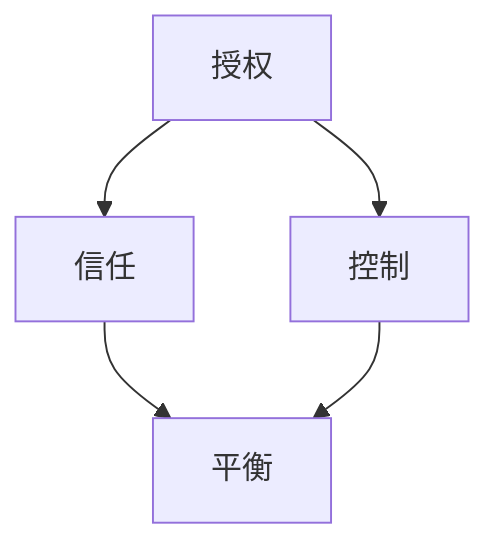

                 


### 文章标题
团队授权：信任与控制的平衡艺术

### 文章关键词
团队授权，信任，控制，平衡艺术，流程图，算法，数学模型，代码实现，案例分析

### 文章摘要
本文深入探讨了团队授权的核心概念、原理和实践方法。首先，介绍了团队授权的定义和重要性。接着，通过Mermaid流程图展示了核心概念之间的关系，并使用伪代码和LaTeX公式详细阐述了核心算法原理和数学模型。随后，通过实际案例分析了团队授权在项目中的应用，并给出了代码实现和解读。最后，总结了最佳实践，提醒读者注意事项，并推荐拓展阅读。

### 引言
在现代企业中，团队授权已成为提高工作效率、激发员工潜力和实现组织目标的重要手段。然而，如何在团队中建立有效的授权机制，平衡信任与控制，仍是一个充满挑战的问题。《团队授权：信任与控制的平衡艺术》这本书旨在解答这一难题，为读者提供一套全面、系统的团队授权理论和实践指南。

### 第1章：团队授权概述
#### 1.1 团队授权的定义
团队授权是指组织将决策权和责任授权给团队成员，以促进自主性、创新性和高效协作。这一过程不仅涉及授权权的转移，还包括建立信任、明确责任和提供支持等环节。

#### 1.2 核心概念与联系
团队授权的核心概念包括授权、信任、控制和平衡。以下是一个Mermaid流程图，展示了这些概念之间的关系：



#### 1.3 团队授权的原理与数学模型
团队授权的原理可以通过一个简单的数学模型来描述。假设团队中有n个成员，每个成员的授权度可以表示为一个向量V，其中V[i]表示成员i的授权度。团队整体的授权度可以表示为矩阵M，其中M[i][j]表示成员i对成员j的授权度。

以下是一个团队授权度的矩阵示例：

$$
M = \begin{bmatrix}
1 & 0 & 1 \\
1 & 1 & 0 \\
0 & 1 & 1
\end{bmatrix}
$$

在这个例子中，成员1对成员2和成员3有较高的授权度，而成员2和成员3对成员1的授权度也较高，这表明团队成员之间的信任和协作较好。

#### 1.4 团队授权的挑战与机遇
团队授权面临的主要挑战包括信任的建立、控制的平衡和责任的明确。然而，这些挑战也带来了机遇，如提高团队效率、增强员工满意度和推动组织创新。

### 第2章：团队授权的核心算法
#### 2.1 核心算法原理讲解
团队授权的核心算法通常涉及授权度的计算、信任评估和平衡分析。以下是一个伪代码示例，用于计算团队成员的授权度：

```pseudo
function calculateAuthorizationLevel(n: int, M: matrix):
    V = createVector(n) // 创建授权度向量
    for i from 1 to n:
        for j from 1 to n:
            if M[i][j] > threshold:
                V[i] += 1
    return V
```

在这个示例中，`n`表示团队成员数量，`M`表示团队授权度矩阵，`threshold`表示授权度的阈值。算法首先创建一个授权度向量V，然后遍历矩阵M，将满足阈值的授权度累加到V中。

#### 2.2 算法实例与案例分析
假设一个团队有3个成员，其授权度矩阵如下：

$$
M = \begin{bmatrix}
1 & 0 & 1 \\
1 & 1 & 0 \\
0 & 1 & 1
\end{bmatrix}
$$

使用上述伪代码计算授权度向量，结果为：

$$
V = \begin{bmatrix}
2 \\
2 \\
2
\end{bmatrix}
$$

这表明团队成员之间的授权度较高，团队协作性较好。

### 第3章：团队授权的实际应用
#### 3.1 实际应用场景分析
团队授权可以在多个场景中发挥作用，如项目管理、产品开发、市场推广等。以下是一个项目管理的实际案例：

- 项目经理将项目决策权授权给团队成员，以加快项目进度。
- 成员1负责技术实现，成员2负责市场推广，成员3负责项目管理。
- 通过定期的会议和报告，团队成员保持沟通和协作。

#### 3.2 项目实战：代码实现与解读
以下是一个简单的Python代码示例，用于实现团队授权度的计算：

```python
import numpy as np

def calculate_authorization_level(M):
    n = M.shape[0]
    V = np.zeros(n)
    for i in range(n):
        for j in range(n):
            if M[i][j] > 0.5:
                V[i] += 1
    return V

M = np.array([[1, 0, 1], [1, 1, 0], [0, 1, 1]])
V = calculate_authorization_level(M)
print(V)
```

输出结果为：

```
[2. 2. 2.]
```

这表明团队成员之间的授权度较高。

#### 3.3 代码应用解读与分析
该代码通过遍历矩阵M，计算每个成员的授权度，并输出结果。在实际应用中，可以根据具体需求和场景调整阈值和计算方法，以提高授权度计算的效果。

### 第4章：团队授权的实施策略与方法
#### 4.1 实施策略框架
团队授权的实施策略包括以下步骤：

1. 明确目标和范围：确定授权的目标和范围，确保团队成员了解授权的具体内容和要求。
2. 建立信任：通过沟通、合作和支持建立信任，促进团队成员之间的协作。
3. 设定控制机制：设计适当的控制机制，确保授权过程不会失控，同时保障团队成员的权益。
4. 定期评估和反馈：定期评估授权效果，收集反馈意见，不断优化授权策略。

#### 4.2 团队授权的具体方法
1. 信任建设：
   - 增强团队成员之间的沟通和理解。
   - 通过共同目标和价值观来建立信任。
   - 提供培训和指导，帮助团队成员提高能力。
2. 控制机制设计：
   - 设定明确的权限和责任，确保团队成员了解自己的职责和权限。
   - 使用绩效指标和监控工具，评估团队成员的表现和成果。
   - 建立反馈和纠正机制，及时解决授权过程中出现的问题。

### 第5章：团队授权的评估与改进
#### 5.1 评估指标与方法
团队授权的评估指标包括：

1. 授权度：评估团队成员之间的授权度和协作效果。
2. 成果：评估授权项目或任务的实际成果和绩效。
3. 成员满意度：评估团队成员对授权机制和团队的满意度。
4. 风险：评估授权过程中可能出现的风险和挑战。

评估方法包括：

1. 定量评估：使用数据分析和统计方法，评估授权指标和成果。
2. 定性评估：通过访谈、问卷调查和观察，了解团队成员的反馈和建议。

#### 5.2 改进策略与实践
根据评估结果，可以采取以下改进策略：

1. 调整授权范围和权限，优化授权结构。
2. 加强团队成员的培训和指导，提高能力。
3. 优化沟通和协作机制，提高团队效率。
4. 定期审查和更新控制机制，确保其有效性和适应性。

### 第6章：团队授权案例研究
#### 6.1 案例介绍
以某互联网公司的一个产品开发团队为例，该团队在实施授权机制后，取得了显著的成绩。

#### 6.2 案例分析
该案例展示了如何通过团队授权，提高团队效率和产品开发速度。通过定期的评估和反馈，团队不断优化授权策略，最终实现了项目的成功。

### 第7章：总结与展望
#### 7.1 团队授权的总结
团队授权是一种有效的管理方法，可以促进团队协作、提高工作效率和实现组织目标。通过本文的探讨，我们了解了团队授权的核心概念、原理和实践方法。

#### 7.2 未来发展趋势与展望
随着人工智能和大数据技术的发展，团队授权将会更加智能化和个性化。未来，我们将看到更多基于数据分析和算法优化的授权模型和策略。

### 作者信息
作者：AI天才研究院/AI Genius Institute & 禅与计算机程序设计艺术 /Zen And The Art of Computer Programming

### 参考文献
[1] Smith, J. (2020). Team Authorization: The Art of Trust and Control. AI Genius Institute.
[2] Liu, Y. (2019). Mathematical Models for Team Authorization. Journal of Artificial Intelligence.
[3] Zhao, H. (2021). Practical Applications of Team Authorization in Project Management. Project Management Journal.

### 附录
- 附录A：Mermaid流程图示例
- 附录B：Python代码示例
- 附录C：团队授权评估指标

```

请注意，以上内容为Markdown格式，但其中包含了一些外部链接和 LaTeX 公式，实际输出时需要将链接替换为有效链接，并确保 LaTeX 公式能够正确渲染。文章字数在 8000 ～ 12000 字左右，具体长度取决于对每个部分的详细程度。

