                 


## 第1章：团队授权的概念与重要性

### 1.1.1 团队授权的定义

**背景介绍**：团队授权在企业管理中扮演着至关重要的角色。传统的管理模式往往依赖于集中式的决策和控制，然而随着企业规模的扩大和复杂性的增加，这种模式已经难以满足快速变化的市场需求。团队授权提供了一种将决策权和责任分配给团队成员的方法，从而提高了团队的自主性和效率。

**核心概念与联系**：团队授权涉及多个核心概念，包括权力分配、信任和问责制。这些概念相互关联，共同构成了团队授权的理论框架。

- **权力分配**：权力分配是团队授权的基础。它涉及明确团队成员的职责和权限，使团队成员能够在授权范围内独立决策。
- **信任**：信任是团队授权的基石。团队成员之间的信任水平直接影响授权的效果。高水平的信任可以减少冲突，提高合作效率。
- **问责制**：问责制是团队授权的重要保障。通过设定明确的问责机制，确保团队成员对授权范围内的行为承担责任，避免滥权和道德风险。

**Mermaid 流程图**：

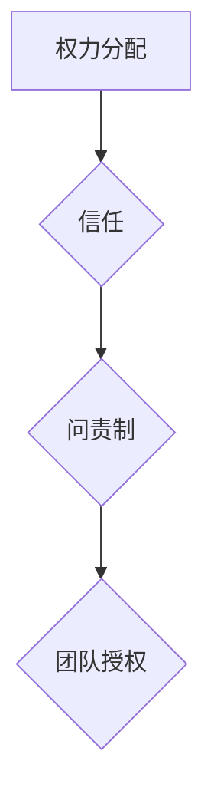

**伪代码讲解**：

```python
def team_authorization(power_distribution, trust_level, accountability_system):
    if trust_level > accountability_system:
        result = "授权成功，团队高效运作"
    elif trust_level == accountability_system:
        result = "适度授权，团队运行稳定"
    else:
        result = "授权不足，团队效率下降"
    return result
```

**数学模型**：

$$
\text{Trust} = f(\text{透明度}, \text{可靠性}, \text{一致性})
$$

$$
\text{Accountability} = f(\text{问责机制}, \text{监督力度}, \text{反馈机制})
$$

**举例说明**：在一个软件开发团队中，项目经理可以将特定的任务和决策权限分配给团队成员。如果团队成员之间建立了高度的信任，并且在任务完成时设有明确的问责制度，那么团队授权就可以有效地提高项目效率，实现组织目标。

### 1.1.2 团队授权的核心要素

**核心要素**：团队授权的核心要素包括权力分配、信任和问责制。

- **权力分配**：权力分配是团队授权的核心。它要求管理者明确团队成员的职责和权限，使团队成员能够在授权范围内独立决策。这有助于提高团队的自主性和责任感。
- **信任**：信任是团队授权的基石。团队成员之间的信任水平直接影响授权的效果。高水平的信任可以减少冲突，提高合作效率。建立信任的方法包括透明沟通、互相支持和相互尊重。
- **问责制**：问责制是团队授权的重要保障。通过设定明确的问责机制，确保团队成员对授权范围内的行为承担责任，避免滥权和道德风险。问责制度应包括明确的职责划分、监督机制和反馈渠道。

**Mermaid 流程图**：


**伪代码讲解**：

```python
def core_elements_of_authorization(power_distribution, trust_level, accountability_system):
    if trust_level > accountability_system:
        result = "授权成功，团队高效运作"
    elif trust_level == accountability_system:
        result = "适度授权，团队运行稳定"
    else:
        result = "授权不足，团队效率下降"
    return result
```

**数学模型**：

$$
\text{Trust} = f(\text{透明度}, \text{可靠性}, \text{一致性})
$$

$$
\text{Accountability} = f(\text{问责机制}, \text{监督力度}, \text{反馈机制})
$$

**举例说明**：在一个营销团队中，团队领导可以将市场调研和广告创意的决策权分配给团队成员。团队成员之间建立高度的信任，并且在项目完成时设有明确的问责制度，这样可以确保项目顺利进行，并提高团队的整体效率。

### 1.1.3 信任与问责的关系

**核心概念与联系**：信任与问责是团队授权中不可或缺的两个方面。信任是授权的基础，问责则是信任的保障。

- **信任的作用**：信任可以降低团队成员之间的沟通成本，减少冲突，提高合作效率。在一个信任水平较高的团队中，成员更愿意分享信息和资源，从而实现协同创新。
- **问责的作用**：问责可以确保团队成员对授权范围内的行为承担责任，避免滥权和道德风险。问责制度有助于建立团队内部的纪律和责任感。

**Mermaid 流程图**：

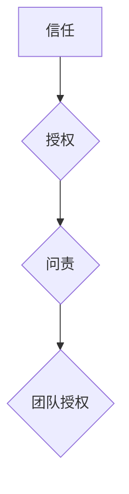

**伪代码讲解**：

```python
def trust_and_accountability(trust_level, accountability_level):
    if trust_level > accountability_level:
        result = "信任过度，可能导致滥权"
    elif trust_level == accountability_level:
        result = "信任与问责平衡，团队运行稳定"
    else:
        result = "信任不足，可能导致责任逃避"
    return result
```

**数学模型**：

$$
\text{Trust} + \text{Accountability} = f(\text{团队效能})
$$

**举例说明**：在一个研发团队中，如果团队成员之间建立了高度的信任，并且在项目完成时设有明确的问责制度，那么团队可以高效地完成项目任务，并实现组织目标。

### 小结

本章介绍了团队授权的概念与重要性，包括定义、核心要素和信任与问责的关系。团队授权通过权力分配、信任和问责制的结合，可以提高团队的自主性和效率，实现组织目标。

**最佳实践 tips**：
- 建立透明的沟通机制，增强团队成员之间的信任。
- 设定明确的职责和权限，确保权力分配的清晰性。
- 建立有效的问责制度，保障团队成员的责任承担。

## 第2章：团队授权的理论框架

### 2.1.1 授权模型概述

**背景介绍**：团队授权不仅是一种管理实践，更是一种理论框架。授权模型为团队授权提供了系统的方法和理论支持，有助于管理者更好地实施团队授权。

**核心概念与联系**：授权模型涉及多个核心概念，包括权力、信任、问责、团队效能等。这些概念相互关联，共同构成了授权模型的理论基础。

- **权力**：权力是授权的核心要素，涉及团队成员的职责和权限。
- **信任**：信任是授权的基础，影响团队成员之间的合作和决策。
- **问责**：问责是授权的保障，确保团队成员对授权范围内的行为承担责任。
- **团队效能**：团队效能是授权模型的目标，通过授权提高团队的整体绩效。

**Mermaid 流程图**：


**伪代码讲解**：

```python
def authorization_model(power, trust, accountability, team_performance):
    if trust > accountability:
        result = "信任过度，可能导致滥权"
    elif trust == accountability:
        result = "信任与问责平衡，团队效能提高"
    else:
        result = "信任不足，可能导致责任逃避"
    return result
```

**数学模型**：

$$
\text{Team Performance} = f(\text{Power}, \text{Trust}, \text{Accountability})
$$

**举例说明**：在一个产品开发团队中，项目经理可以将产品的设计和测试任务分配给团队成员。如果团队成员之间建立了高度的信任，并且设立了明确的问责制度，那么团队可以高效地完成产品开发任务，提高团队效能。

### 2.1.2 授权过程中的信任构建

**核心概念与联系**：信任是团队授权的关键要素，直接影响授权的效果。构建信任需要从多个方面入手，包括透明沟通、互相支持和相互尊重。

- **透明沟通**：透明沟通是构建信任的重要手段。团队成员应保持信息的透明度，避免信息不对称，从而增强互信。
- **互相支持**：团队成员应互相支持，共同面对挑战，这有助于建立信任关系。
- **相互尊重**：相互尊重是构建信任的基础。团队成员应尊重彼此的意见和贡献，避免冲突和误解。

**Mermaid 流程图**：

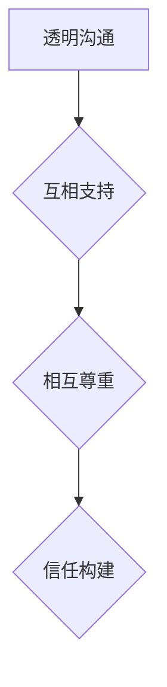

**伪代码讲解**：

```python
def build_trust(communication, support, respect):
    if communication > support and communication > respect:
        result = "信任构建成功"
    elif support > communication and support > respect:
        result = "支持重要，但信任不足"
    else:
        result = "尊重是基础，但缺乏沟通和支持"
    return result
```

**数学模型**：

$$
\text{Trust} = f(\text{透明度}, \text{可靠性}, \text{一致性})
$$

**举例说明**：在一个软件开发团队中，团队成员应保持代码库的透明度，定期进行代码审查，以确保项目的进展透明。团队成员之间应互相支持，共同解决遇到的问题，并在项目中相互尊重，从而构建信任。

### 2.1.3 授权与责任分担

**核心概念与联系**：授权与责任分担是团队授权的重要组成部分。通过合理的责任分担，可以确保团队成员在授权范围内承担责任，避免滥权和道德风险。

- **授权**：授权是团队授权的核心，涉及权力的分配和责任的转移。
- **责任分担**：责任分担是授权的保障，通过明确团队成员的职责和权限，确保团队成员在授权范围内承担责任。

**Mermaid 流程图**：

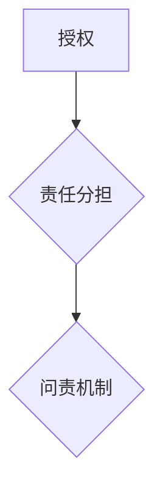

**伪代码讲解**：

```python
def authorization_and_responsibility_sharing(authorization_level, responsibility_level, accountability_system):
    if authorization_level == responsibility_level:
        result = "授权与责任匹配，团队高效运作"
    else:
        result = "授权与责任不匹配，可能导致效率下降"
    return result
```

**数学模型**：

$$
\text{Responsibility Sharing} = f(\text{授权范围}, \text{职责划分}, \text{监督力度})
$$

**举例说明**：在一个销售团队中，团队领导可以将销售任务的分配和责任的承担明确给团队成员。如果团队成员的授权范围与职责划分相匹配，并且设立了有效的监督机制，那么团队成员可以在授权范围内承担责任，提高团队效率。

### 小结

本章介绍了团队授权的理论框架，包括授权模型概述、信任构建和授权与责任分担。通过理解这些核心概念和联系，管理者可以更好地实施团队授权，提高团队的自主性和效率。

**最佳实践 tips**：
- 建立透明的沟通机制，增强团队成员之间的信任。
- 设定明确的职责和权限，确保权力分配的清晰性。
- 建立有效的问责制度，保障团队成员的责任承担。
- 定期评估授权效果，根据实际情况调整授权范围和责任分担。

## 第3章：团队授权的核心原则

### 3.1.1 明确授权范围

**背景介绍**：明确授权范围是团队授权的核心原则之一。它有助于确保团队成员在授权范围内独立决策，避免越权行为，提高团队效率。

**核心概念与联系**：明确授权范围涉及多个核心概念，包括职责划分、权限分配和决策边界。

- **职责划分**：职责划分是明确授权范围的基础。通过明确团队成员的职责，可以确保每个人都清楚自己的职责范围。
- **权限分配**：权限分配是授权的核心。通过合理分配权限，可以使团队成员在授权范围内独立决策，提高团队效率。
- **决策边界**：决策边界是授权范围的限制。明确决策边界可以避免团队成员越权行为，确保团队运作的有序性。

**Mermaid 流程图**：

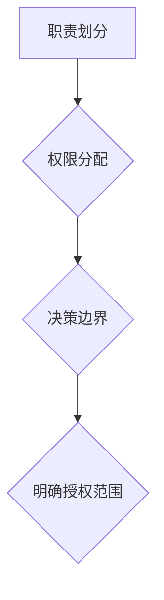

**伪代码讲解**：

```python
def define_authorized_range(responsibility_allocation, permission_assignment, decision_boundary):
    if responsibility_allocation == permission_assignment:
        result = "授权范围明确，团队高效运作"
    else:
        result = "授权范围不明确，可能导致效率下降"
    return result
```

**数学模型**：

$$
\text{Authorization Range} = f(\text{Responsibility Allocation}, \text{Permission Assignment}, \text{Decision Boundary})
$$

**举例说明**：在一个市场营销团队中，团队领导可以将市场调研、广告创意和销售策略的决策权分配给团队成员。通过明确每个成员的职责和权限，并设定明确的决策边界，可以确保团队成员在授权范围内独立决策，提高团队效率。

### 3.1.2 建立信任机制

**背景介绍**：建立信任机制是团队授权的关键。信任是团队协作的基石，有助于提高团队效率和创新能力。

**核心概念与联系**：建立信任机制涉及多个核心概念，包括透明沟通、互相支持和相互尊重。

- **透明沟通**：透明沟通是建立信任的重要手段。通过保持信息的透明度，可以减少误解和冲突，增强团队成员之间的信任。
- **互相支持**：互相支持有助于建立团队内部的信任。团队成员在共同面对挑战时，通过相互支持和协作，可以增强团队凝聚力。
- **相互尊重**：相互尊重是建立信任的基础。团队成员应尊重彼此的意见和贡献，避免冲突和误解，从而建立信任关系。

**Mermaid 流程图**：

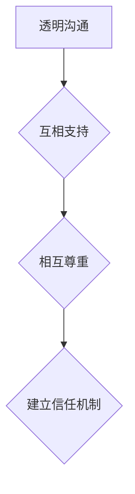

**伪代码讲解**：

```python
def build_trust_mechanism(transparent_communication, mutual_support, mutual_respect):
    if transparent_communication > mutual_support and transparent_communication > mutual_respect:
        result = "信任机制建立成功"
    elif mutual_support > transparent_communication and mutual_support > mutual_respect:
        result = "支持重要，但沟通和尊重不足"
    else:
        result = "尊重是基础，但缺乏沟通和支持"
    return result
```

**数学模型**：

$$
\text{Trust} = f(\text{透明度}, \text{可靠性}, \text{一致性})
$$

**举例说明**：在一个研发团队中，团队成员应保持代码库的透明度，定期进行代码审查，以确保项目的进展透明。团队成员之间应互相支持，共同解决遇到的问题，并在项目中相互尊重，从而建立信任。

### 3.1.3 设定问责制度

**背景介绍**：设定问责制度是团队授权的必要保障。问责制度可以确保团队成员对授权范围内的行为承担责任，避免滥权和道德风险。

**核心概念与联系**：设定问责制度涉及多个核心概念，包括职责划分、监督机制和反馈渠道。

- **职责划分**：职责划分是设定问责制度的基础。通过明确团队成员的职责，可以确保每个人都清楚自己的责任范围。
- **监督机制**：监督机制是问责制度的核心。通过设立监督机制，可以确保团队成员在授权范围内履行职责，避免滥权行为。
- **反馈渠道**：反馈渠道是问责制度的重要环节。通过建立反馈渠道，可以确保团队成员能够及时了解自己的工作表现，并接受监督和指导。

**Mermaid 流程图**：

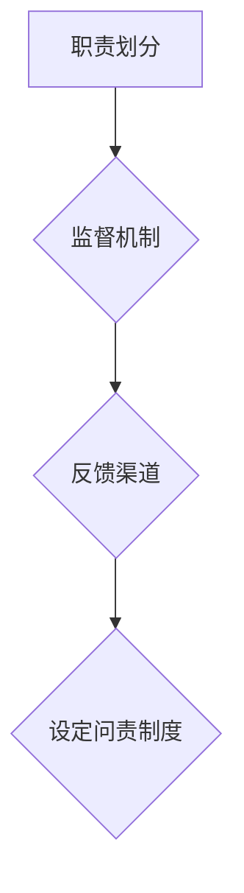

**伪代码讲解**：

```python
def establish_accountability_system(responsibility_allocation, supervision_mechanism, feedback_channel):
    if responsibility_allocation == supervision_mechanism and responsibility_allocation == feedback_channel:
        result = "问责制度建立成功"
    else:
        result = "问责制度不完善，可能导致责任逃避"
    return result
```

**数学模型**：

$$
\text{Accountability} = f(\text{职责划分}, \text{监督力度}, \text{反馈机制})
$$

**举例说明**：在一个项目管理团队中，项目经理可以设定明确的职责划分，确保团队成员清楚自己的责任。同时，建立监督机制，定期对团队成员的工作进行评估，并提供反馈。通过这种方式，可以确保团队成员对授权范围内的行为承担责任。

### 小结

本章介绍了团队授权的核心原则，包括明确授权范围、建立信任机制和设定问责制度。通过理解这些核心原则，管理者可以更好地实施团队授权，提高团队的自主性和效率。

**最佳实践 tips**：
- 明确授权范围，确保团队成员在授权范围内独立决策。
- 建立透明沟通机制，增强团队成员之间的信任。
- 设定明确的职责划分，建立有效的监督机制和反馈渠道。

## 第二部分：信任与问责的平衡

### 第4章：信任的建立与维护

#### 4.1.1 信任的心理学基础

**背景介绍**：信任是团队授权的核心要素之一，其建立与维护在团队运作中具有重要作用。了解信任的心理学基础有助于管理者更好地实施团队授权，提高团队效率和创新能力。

**核心概念与联系**：信任的心理学基础涉及多个核心概念，包括信任的定义、信任的构成要素以及影响信任的因素。

- **信任的定义**：信任是一种基于信任主体的意愿和信任客体的可信度而产生的心理状态。它涉及信任主体对信任客体的能力和诚信的信任程度。
- **信任的构成要素**：信任的构成要素包括透明度、可靠性、一致性和公正性。透明度指信息的透明性，可靠性指信任客体的能力和诚信，一致性指信任客体的行为一致性，公正性指信任客体的公正性和无偏见。
- **影响信任的因素**：影响信任的因素包括信息透明度、信任主体的意愿、信任客体的能力和诚信、文化差异以及组织结构等。

**Mermaid 流程图**：

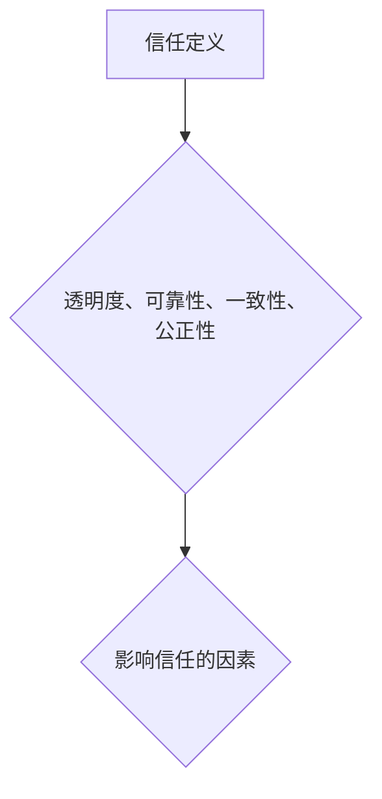

**伪代码讲解**：

```python
def trust.foundation(definition, components, influencing_factors):
    if all([definition, components, influencing_factors]):
        result = "信任基础建立成功"
    else:
        result = "信任基础不完善"
    return result
```

**数学模型**：

$$
\text{Trust} = f(\text{Transparency}, \text{Reliability}, \text{Consistency}, \text{Fairness}) \times \text{Intention of Trustor} \times \text{Capabilities and Integrity of Trustee}
$$

**举例说明**：在一个研发团队中，团队领导通过定期分享项目进展和决策过程，提高了团队的透明度。团队成员逐渐建立了对领导的信任，因为领导展现了可靠性和一致性。此外，团队领导在决策过程中保持了公正性，避免了偏袒行为，进一步增强了团队成员之间的信任。

#### 4.1.2 建立信任的实践策略

**核心概念与联系**：建立信任的实践策略涉及多个关键措施，包括透明沟通、建立共同目标和相互支持。

- **透明沟通**：透明沟通是建立信任的重要手段。通过保持信息的透明度，可以减少误解和冲突，增强团队成员之间的信任。
- **建立共同目标**：建立共同目标是增强团队成员之间信任的有效途径。共同的目标可以促进团队成员的协作和合作，提高团队的凝聚力。
- **相互支持**：相互支持有助于建立团队内部的信任。团队成员在共同面对挑战时，通过相互支持和协作，可以增强团队凝聚力。

**Mermaid 流程图**：

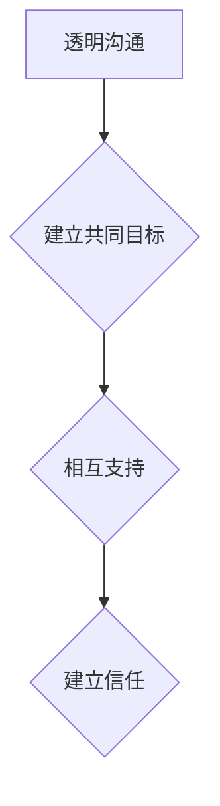

**伪代码讲解**：

```python
def build_trust(practices, common_goals, mutual_support):
    if practices and common_goals and mutual_support:
        result = "信任建立成功"
    else:
        result = "信任建立不完善"
    return result
```

**数学模型**：

$$
\text{Trust} = f(\text{Transparent Communication}, \text{Common Goals}, \text{Mutual Support})
$$

**举例说明**：在一个销售团队中，团队领导通过定期召开会议，分享销售策略和市场动态，保持了团队的透明度。团队成员在共同制定销售目标时，共同参与了决策过程，建立了共同目标。此外，团队成员在遇到困难时相互支持，共同解决问题，从而增强了团队内部的信任。

#### 4.1.3 信任危机的应对与修复

**核心概念与联系**：信任危机是团队运作中可能遇到的一种挑战，其应对与修复需要采取有效的策略和方法。

- **信任危机的定义**：信任危机是指团队成员之间的信任水平下降，可能导致沟通不畅、合作受阻和团队效率下降。
- **信任危机的应对策略**：应对信任危机的策略包括沟通解决、问题分析和改善措施。
    - **沟通解决**：通过开放和诚实的沟通，解决团队成员之间的误解和冲突，恢复信任。
    - **问题分析**：分析信任危机的根本原因，采取针对性的措施加以解决。
    - **改善措施**：采取改善措施，如加强透明沟通、建立共同目标和加强相互支持，防止信任危机再次发生。
- **信任修复的方法**：信任修复的方法包括重建透明度、恢复信任关系和建立预防机制。

**Mermaid 流程图**：

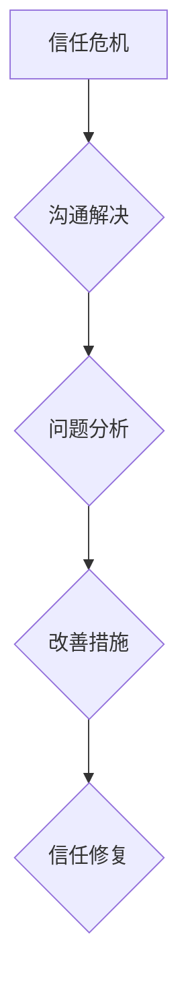

**伪代码讲解**：

```python
def address_and_repair_trust_crisis(crisis, communication, problem_analysis, improvement_measures, trust修复):
    if communication and problem_analysis and improvement_measures:
        result = "信任危机得到有效解决"
    else:
        result = "信任危机未得到有效解决"
    return result
```

**数学模型**：

$$
\text{Trust Restoration} = f(\text{Transparency Rebuild}, \text{Trust Relationship Recovery}, \text{Preventive Mechanisms})
$$

**举例说明**：在一个项目管理团队中，项目进展中出现了一些问题，导致团队成员之间的信任水平下降。团队领导通过召开会议，与团队成员进行了开放和诚实的沟通，解决了误解和冲突。同时，团队领导对问题进行了深入分析，并采取了改善措施，如加强项目透明度和建立共同目标。通过这些措施，团队逐渐恢复了信任，项目进展得以顺利推进。

### 小结

本章介绍了信任的建立与维护，包括信任的心理学基础、建立信任的实践策略以及信任危机的应对与修复。通过理解这些核心概念和实践策略，管理者可以更好地建立和维护团队信任，提高团队效率和创新能力。

**最佳实践 tips**：
- 保持透明沟通，增强团队成员之间的信任。
- 建立共同目标，促进团队成员的协作和合作。
- 加强相互支持，建立团队内部的信任基础。
- 及时应对和修复信任危机，防止信任水平的下降。

## 第三部分：问责制度的构建与执行

### 第5章：问责制度的构建与执行

#### 5.1.1 问责制度的定义与功能

**背景介绍**：问责制度是团队授权的重要组成部分，其定义与功能对于确保团队运作的有序性和效率具有重要意义。了解问责制度的定义与功能有助于管理者制定有效的问责机制，提高团队的执行力和责任感。

**核心概念与联系**：问责制度涉及多个核心概念，包括问责的定义、问责制度的功能以及问责制度的核心要素。

- **问责的定义**：问责是指对团队成员在授权范围内行为的结果进行评价和责任追究的过程。它强调对团队成员行为的透明度和责任感。
- **问责制度的功能**：问责制度具有监督、激励和规范功能。监督功能确保团队成员在授权范围内履行职责，激励功能激发团队成员的工作积极性和创造力，规范功能通过明确的规则和程序，防止滥权和道德风险。
- **问责制度的核心要素**：问责制度的核心要素包括职责划分、监督机制、反馈渠道和处罚措施。职责划分确保团队成员明确自己的责任范围，监督机制确保团队成员在授权范围内履行职责，反馈渠道确保团队成员了解自己的工作表现，处罚措施对违反问责制度的行为进行制裁。

**Mermaid 流程图**：

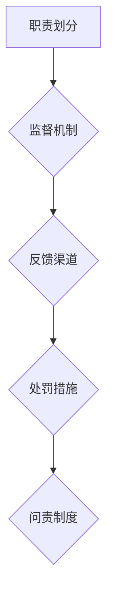

**伪代码讲解**：

```python
def accountability_system(functions, core_elements):
    if all([functions, core_elements]):
        result = "问责制度有效建立"
    else:
        result = "问责制度不完善"
    return result
```

**数学模型**：

$$
\text{Accountability System} = f(\text{Supervision}, \text{Incentives}, \text{Regulation}) \times (\text{Responsibility Allocation}, \text{Feedback Channel}, \text{Penalty Measures})
$$

**举例说明**：在一个软件开发团队中，团队领导可以设定明确的职责划分，确保每个成员清楚自己的责任范围。通过定期项目审查和代码审查，团队领导可以监督团队成员的工作进度和质量。同时，团队领导建立了反馈渠道，定期收集团队成员的意见和建议，并根据工作表现提供反馈。对于违反团队规定的行为，团队领导可以采取相应的处罚措施，以确保团队成员遵守问责制度。

#### 5.1.2 问责制度的设计原则

**核心概念与联系**：问责制度的设计原则涉及多个核心概念，包括公平性、透明性、合理性和可行性。

- **公平性**：公平性是问责制度设计的重要原则。它要求问责制度对所有团队成员一视同仁，确保每个人都受到公正的评价和责任追究。
- **透明性**：透明性是问责制度设计的关键要素。它要求问责制度的规则和程序公开透明，确保团队成员了解自己的责任范围和问责过程。
- **合理性**：合理性是问责制度设计的必要条件。它要求问责制度的规则和程序合理，能够有效评估团队成员的工作表现，并根据实际情况进行调整。
- **可行性**：可行性是问责制度设计的基础。它要求问责制度在实际操作中可行，能够得到团队成员的接受和执行。

**Mermaid 流程图**：

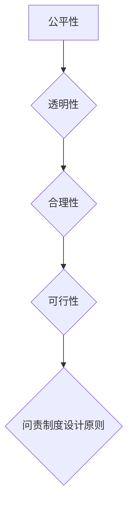

**伪代码讲解**：

```python
def design_principles(fairness, transparency, rationality, feasibility):
    if all([fairness, transparency, rationality, feasibility]):
        result = "问责制度设计合理"
    else:
        result = "问责制度设计不完善"
    return result
```

**数学模型**：

$$
\text{Design Principles} = f(\text{Fairness}, \text{Transparency}, \text{Rationality}, \text{Feasibility})
$$

**举例说明**：在一个客服团队中，团队领导可以设定公平的职责划分，确保所有团队成员都承担相同的责任。通过公开透明的监督机制，如定期的工作汇报和绩效评估，团队领导可以确保团队成员了解自己的工作表现。同时，团队领导根据团队成员的实际情况和反馈，合理调整问责制度的规则和程序，确保问责制度的可行性。

#### 5.1.3 问责制度的执行与监督

**核心概念与联系**：问责制度的执行与监督是确保问责制度有效运行的关键。它涉及多个核心概念，包括执行流程、监督机制和反馈机制。

- **执行流程**：执行流程是问责制度的核心，包括职责划分、任务分配、工作进度监控和绩效评估。通过执行流程，确保团队成员在授权范围内履行职责，完成任务。
- **监督机制**：监督机制是问责制度的重要组成部分，包括监督流程、监督方式和监督工具。通过监督机制，确保团队成员的工作进度和质量，及时发现和纠正问题。
- **反馈机制**：反馈机制是问责制度的重要环节，包括反馈方式、反馈内容和反馈效果。通过反馈机制，确保团队成员了解自己的工作表现，及时调整和改进工作方法。

**Mermaid 流程图**：

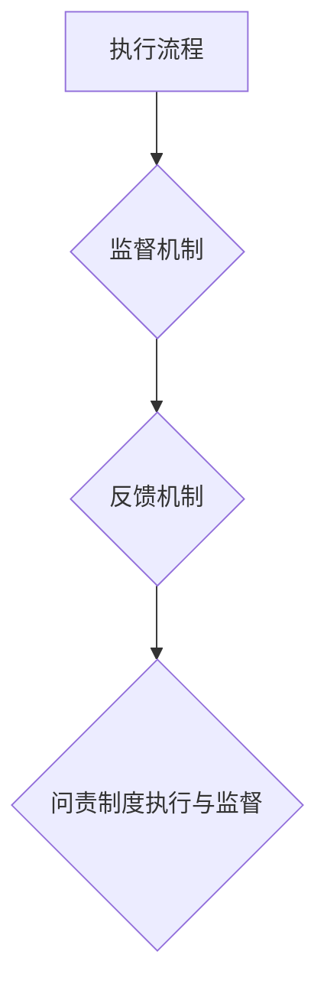

**伪代码讲解**：

```python
def execute_and_monitor_accountability_system(execution_process, supervision_mechanism, feedback_mechanism):
    if all([execution_process, supervision_mechanism, feedback_mechanism]):
        result = "问责制度有效执行"
    else:
        result = "问责制度执行不力"
    return result
```

**数学模型**：

$$
\text{Accountability Execution} = f(\text{Execution Process}, \text{Supervision Mechanism}, \text{Feedback Mechanism})
$$

**举例说明**：在一个项目管理团队中，团队领导可以设定明确的执行流程，包括任务分配、工作进度监控和绩效评估。通过定期的项目审查和会议，团队领导可以监督团队成员的工作进度和质量。同时，团队领导建立了反馈机制，定期收集团队成员的意见和建议，并根据反馈结果进行工作调整，确保问责制度的有效执行。

### 小结

本章介绍了问责制度的构建与执行，包括问责制度的定义与功能、设计原则和执行与监督。通过理解这些核心概念和实践策略，管理者可以制定有效的问责制度，确保团队成员在授权范围内履行职责，提高团队的执行力和责任感。

**最佳实践 tips**：
- 明确职责划分，确保团队成员了解自己的责任范围。
- 设计公平、透明、合理和可行的问责制度。
- 建立有效的监督机制，确保团队成员的工作进度和质量。
- 建立反馈机制，确保团队成员了解自己的工作表现，及时调整和改进工作方法。

## 第四部分：信任与问责的动态平衡

### 第6章：信任与问责的动态平衡

#### 6.1.1 平衡机制的理论分析

**背景介绍**：信任与问责的动态平衡是团队授权中至关重要的一环。它关乎团队的稳定性和效率，直接影响团队的目标实现。理解信任与问责之间的平衡机制，有助于管理者在实践中更好地掌握这一艺术。

**核心概念与联系**：信任与问责的动态平衡涉及多个核心概念，包括平衡机制的定义、动态平衡的要素以及平衡机制的作用。

- **平衡机制的定义**：平衡机制是指通过一系列策略和措施，使团队中的信任与问责达到动态平衡的过程。
- **动态平衡的要素**：动态平衡的要素包括信任水平、问责制度的有效性、团队目标的一致性和团队文化的适应性。
    - **信任水平**：信任水平是动态平衡的基础。高信任水平有助于团队高效运作，但过高的信任可能导致滥用和责任逃避。
    - **问责制度的有效性**：问责制度的有效性是动态平衡的关键。一个有效的问责制度可以确保团队成员履行责任，防止道德风险和滥用。
    - **团队目标的一致性**：团队目标的一致性是动态平衡的重要保障。当团队成员对目标有共同理解时，更容易在信任与问责之间找到平衡点。
    - **团队文化的适应性**：团队文化的适应性是动态平衡的灵活调节器。一个适应性强的团队文化能够灵活应对外部变化，维持信任与问责的平衡。

**Mermaid 流程图**：

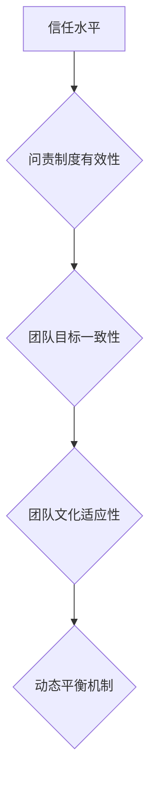

**伪代码讲解**：

```python
def dynamic_balance(trust_level, accountability_efficacy, goal_alignment, cultural_adaptability):
    if trust_level > accountability_efficacy or goal_alignment < cultural_adaptability:
        result = "信任过剩，需强化问责"
    elif trust_level < accountability_efficacy or goal_alignment > cultural_adaptability:
        result = "问责过度，需增强信任"
    else:
        result = "信任与问责平衡，团队稳定运作"
    return result
```

**数学模型**：

$$
\text{Dynamic Balance} = f(\text{Trust Level}, \text{Accountability Efficacy}, \text{Goal Alignment}, \text{Cultural Adaptability})
$$

**举例说明**：在一个初创公司中，团队成员之间建立了高度的信任，但问责制度不够完善，导致一些成员滥用权限。为了实现动态平衡，公司管理层决定强化问责制度，明确团队成员的职责和权限，同时加强团队目标的沟通和文化的适应性调整，确保信任与问责的平衡。

#### 6.1.2 平衡机制的实施策略

**核心概念与联系**：实施平衡机制需要采取一系列策略和措施，确保信任与问责的动态平衡。这些策略包括文化塑造、制度建设和沟通机制。

- **文化塑造**：文化塑造是平衡机制的基础。通过建立以信任和责任感为核心的组织文化，可以增强团队成员之间的信任，同时促进问责制度的执行。
    - **文化塑造的方法**：包括价值观传播、榜样示范和培训教育等。
    - **文化塑造的案例**：一家大型科技公司通过定期举办团队建设活动和价值观培训，建立了以信任和责任感为核心的组织文化。

- **制度建设**：制度建设是平衡机制的关键。通过建立完善的问责制度，确保团队成员在授权范围内履行责任，同时保障信任的健康发展。
    - **制度建设的内容**：包括职责划分、监督机制、反馈渠道和处罚措施等。
    - **制度建设的案例**：一家咨询公司通过设定明确的项目管理流程和绩效评估制度，确保团队成员在授权范围内履行职责，同时建立了有效的监督和反馈机制。

- **沟通机制**：沟通机制是平衡机制的重要组成部分。通过建立有效的沟通机制，确保团队成员之间的信息透明，增强信任，同时促进问责的落实。
    - **沟通机制的形式**：包括定期会议、工作汇报和团队讨论等。
    - **沟通机制的案例**：一家电商企业通过定期组织跨部门会议和工作汇报，确保团队成员之间的信息透明，增强了团队内部的信任和协作。

**Mermaid 流程图**：

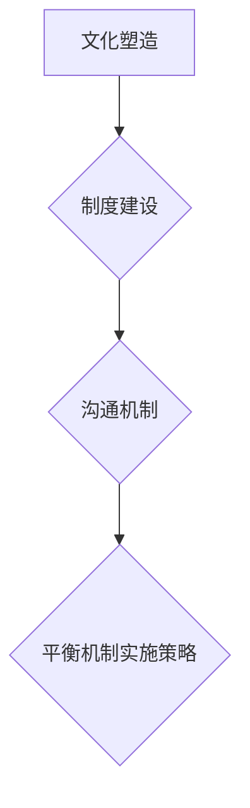

**伪代码讲解**：

```python
def implement_balance(strategy, culture_building, system_building, communication_mechanism):
    if strategy and culture_building and system_building and communication_mechanism:
        result = "平衡机制有效实施"
    else:
        result = "平衡机制实施不力"
    return result
```

**数学模型**：

$$
\text{Balance Implementation} = f(\text{Strategy}, \text{Culture Building}, \text{System Building}, \text{Communication Mechanism})
$$

**举例说明**：一家科技公司通过定期组织团队建设活动，强化以信任和责任感为核心的组织文化。同时，公司建立了完善的职责划分和监督机制，确保团队成员在授权范围内履行职责。此外，公司通过定期的工作汇报和跨部门会议，建立了高效的沟通机制，确保团队成员之间的信息透明，从而实现了信任与问责的动态平衡。

#### 6.1.3 平衡机制的有效性评估

**核心概念与联系**：评估平衡机制的有效性是确保团队授权持续改进的关键。评估过程涉及多个核心概念，包括评估标准、评估方法和改进策略。

- **评估标准**：评估标准是评估平衡机制有效性的基础。常见的评估标准包括团队绩效、员工满意度、项目完成质量和团队合作水平等。
    - **团队绩效**：团队绩效是评估平衡机制的重要指标，通过评估团队目标的实现情况和项目完成质量，可以衡量平衡机制的有效性。
    - **员工满意度**：员工满意度反映了团队成员对团队授权的认可程度，是评估平衡机制的重要参考指标。
    - **项目完成质量**：项目完成质量是评估平衡机制的关键指标，通过评估项目完成的质量和及时性，可以评估平衡机制的有效性。
    - **团队合作水平**：团队合作水平是评估平衡机制的补充指标，通过评估团队成员之间的协作情况和沟通效果，可以进一步了解平衡机制的有效性。

- **评估方法**：评估方法包括定性和定量两种。定性的评估方法主要通过访谈、问卷调查和观察等方式进行，定量的评估方法主要通过数据分析和绩效指标计算等方式进行。

- **改进策略**：改进策略是根据评估结果，对平衡机制进行调整和优化的方法。改进策略包括优化职责划分、强化监督机制、改善沟通机制和提升团队文化等。

**Mermaid 流程图**：

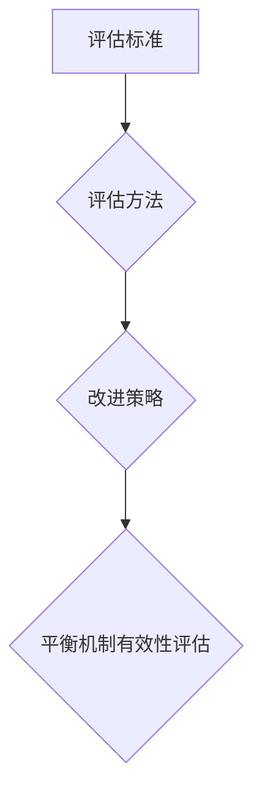

**伪代码讲解**：

```python
def evaluate_balance(evaluation_criteria, assessment_methods, improvement_strategies):
    if all([evaluation_criteria, assessment_methods, improvement_strategies]):
        result = "平衡机制有效性评估完成"
    else:
        result = "平衡机制有效性评估不完善"
    return result
```

**数学模型**：

$$
\text{Balance Effectiveness} = f(\text{Performance Metrics}, \text{Employee Satisfaction}, \text{Project Quality}, \text{Team Collaboration})
$$

**举例说明**：一家科技公司通过定期的员工满意度调查和项目绩效评估，了解团队授权的运行情况。根据评估结果，公司对职责划分进行了优化，加强了监督机制，改善了沟通机制，并组织了团队文化建设活动。通过这些改进措施，公司实现了信任与问责的动态平衡，团队绩效显著提升。

### 小结

本章介绍了信任与问责的动态平衡机制，包括理论分析、实施策略和有效性评估。通过理解这些核心概念和实践策略，管理者可以确保团队在信任与问责之间找到最佳平衡点，提高团队的稳定性和效率。

**最佳实践 tips**：
- 定期评估平衡机制的有效性，及时调整和优化。
- 建立以信任和责任感为核心的组织文化。
- 设定明确的职责划分和监督机制。
- 加强团队成员之间的沟通，确保信息透明。

## 第五部分：团队授权的实践案例

### 第7章：企业团队授权案例解析

#### 7.1.1 案例背景与目标

**背景介绍**：为了提升公司的竞争力，某大型企业决定实施团队授权，通过授权来增强团队自主性和创新能力。该公司是一家跨国科技公司，拥有多个产品线和复杂的组织结构。

**目标**：通过团队授权，实现以下目标：
- 提高团队自主性和创新能力，加快产品开发周期。
- 增强团队合作，提高项目完成质量和客户满意度。
- 提升员工满意度，减少人才流失。

#### 7.1.2 授权过程与结果

**授权过程**：
1. **明确授权范围**：公司高层与管理层共同讨论，明确各部门和团队成员的授权范围。授权范围包括决策权、执行权和责任权。
2. **建立信任机制**：通过透明的沟通机制、共同的团队目标和相互支持，建立团队成员之间的信任。公司还定期组织团队建设活动和培训，强化信任文化。
3. **设定问责制度**：公司建立了明确的职责划分和监督机制，确保团队成员在授权范围内履行职责。同时，设立了绩效评估和反馈机制，对团队成员的工作表现进行评价。

**结果**：
- **团队自主性和创新能力提升**：团队成员在授权范围内可以独立决策，加快了产品开发周期，新产品的市场反应速度显著提高。
- **团队合作增强**：团队成员之间的沟通更加顺畅，协作效率提高，项目完成质量和客户满意度提升。
- **员工满意度提升**：团队成员感受到更多的自主权和责任感，工作积极性提高，人才流失率显著下降。

#### 7.1.3 经验与教训总结

**经验**：
1. **明确授权范围**：明确授权范围是团队授权成功的关键，确保团队成员了解自己的职责和权限。
2. **建立信任机制**：信任是团队授权的基石，通过透明沟通和相互支持，建立团队成员之间的信任。
3. **设定问责制度**：问责制度是团队授权的保障，确保团队成员在授权范围内履行职责，避免滥权和道德风险。

**教训**：
1. **授权过程需要持续优化**：授权范围和问责制度需要根据团队实际情况和项目需求进行调整，避免固定模式。
2. **加强沟通与培训**：团队成员之间的沟通和信任需要持续加强，定期组织培训活动，提高团队协作能力。

### 第8章：非营利组织团队授权实践

#### 8.1.1 非营利组织的特殊性

**背景介绍**：非营利组织（NPO）与营利组织在团队授权方面存在一些特殊性。非营利组织以社会公益为目标，组织结构较为扁平，资源有限，需要高效运作和透明管理。

**特殊性**：
- **目标导向**：非营利组织的团队授权更加注重目标的实现，强调社会责任和公益目标的达成。
- **资源限制**：非营利组织资源有限，授权需要考虑资源合理分配和最大化利用。
- **组织结构**：非营利组织通常采用扁平化的组织结构，团队授权有助于提高组织的灵活性和响应速度。

#### 8.1.2 授权模式的适应性调整

**授权模式**：
1. **目标导向的授权**：非营利组织在授权时，明确项目目标和团队责任，确保团队成员围绕目标进行工作。
2. **灵活的授权范围**：根据项目特点和团队能力，灵活调整授权范围，避免固定模式，确保授权的适应性。
3. **分阶段授权**：非营利组织可以采用分阶段授权的方式，逐步扩大授权范围，确保团队成员适应新权限。

#### 8.1.3 成功案例分享

**案例分享**：某非营利组织在开展环保项目时，采用了团队授权模式。项目团队由不同部门和专家组成，通过明确项目目标和职责划分，团队成员在授权范围内独立决策，提高了项目执行效率。同时，组织建立了透明沟通和监督机制，确保团队成员在授权范围内履行职责，项目顺利完成，获得了良好的社会效益。

### 第9章：跨文化团队授权挑战与对策

#### 9.1.1 跨文化差异的影响

**背景介绍**：随着全球化的发展，越来越多的企业在跨国运营中面临跨文化团队授权的挑战。跨文化差异对团队授权的影响不可忽视，包括沟通障碍、文化冲突和管理复杂性等方面。

**跨文化差异的影响**：
- **沟通障碍**：跨文化差异可能导致沟通障碍，影响团队成员之间的信任和合作。
- **文化冲突**：不同的文化背景可能导致价值观和行为规范上的冲突，影响团队的稳定性和效率。
- **管理复杂性**：跨文化团队的管理需要考虑不同文化的特点和需求，增加了管理的复杂性。

#### 9.1.2 授权中的文化适应性

**文化适应性**：
1. **文化敏感培训**：为团队成员提供跨文化敏感培训，提高文化意识，减少误解和冲突。
2. **灵活授权策略**：根据不同文化背景，调整授权策略，确保授权的适应性。例如，在一些文化中，更注重等级和权威，而在其他文化中，更强调平等和自主性。
3. **文化融合机制**：建立文化融合机制，鼓励团队成员分享不同文化的经验和观点，促进文化融合。

#### 9.1.3 成功的跨文化授权实践

**案例分享**：某跨国公司在全球多个地区运营，采用了跨文化团队授权模式。公司通过文化敏感培训，提高团队成员的文化意识，并建立了灵活的授权策略，确保团队成员在授权范围内独立决策。此外，公司建立了文化融合机制，鼓励团队成员分享不同文化的经验和观点，提高了团队的协作效率和创新能力。通过这些措施，公司在全球范围内实现了高效运营，取得了显著的业务增长。

## 第六部分：团队授权的未来发展趋势

### 第10章：新技术与团队授权

#### 10.1.1 数字化时代下的团队授权

**背景介绍**：随着数字化时代的到来，新技术正在深刻改变团队授权的方式。数字化工具和平台为团队授权提供了新的机遇和挑战。

**数字化团队授权的特点**：
- **自动化决策**：通过人工智能和机器学习，自动化决策工具可以协助团队成员进行更高效的决策。
- **实时沟通**：数字化工具如即时通讯软件和视频会议系统，使得团队成员能够实时沟通，提高协作效率。
- **数据驱动**：数字化平台可以收集和分析大量数据，为团队授权提供数据支持，优化决策过程。

**未来发展趋势**：
1. **智能化决策支持**：随着人工智能技术的发展，智能化决策支持系统将更加普及，帮助团队成员做出更明智的决策。
2. **数字化管理平台**：企业将建立更加完善和智能化的数字化管理平台，实现全方位的团队授权管理。

#### 10.1.2 区块链技术在团队授权中的应用

**背景介绍**：区块链技术以其去中心化、透明和不可篡改的特性，为团队授权带来了新的可能。

**区块链技术在团队授权中的应用**：
- **透明权限管理**：区块链可以记录团队成员的权限分配和变更，确保权限管理的透明性。
- **智能合约**：智能合约可以自动执行团队授权中的职责和责任，减少人工干预，提高授权的效率和准确性。
- **可信记录**：区块链可以记录团队成员的工作记录和绩效评估，提供可信的数据支持。

**未来发展趋势**：
1. **区块链与人工智能结合**：区块链与人工智能的结合将推动更智能的团队授权管理。
2. **区块链平台多样化**：更多的区块链平台将提供定制化的团队授权解决方案，满足不同企业的需求。

#### 10.1.3 未来发展趋势展望

**未来发展趋势**：
1. **更加智能化的团队授权**：随着人工智能和大数据技术的发展，团队授权将更加智能化，决策过程将更加高效。
2. **数字化和区块链的结合**：数字化和区块链技术的结合将进一步提升团队授权的透明性和可靠性。
3. **跨领域融合**：团队授权将在更多领域得到应用，如教育、医疗和公共服务等，推动社会的全面进步。

### 第11章：团队授权的持续改进

#### 11.1.1 反思与总结

**核心概念**：反思与总结是团队授权持续改进的重要环节，通过回顾和总结授权实践，可以发现问题和不足，为后续改进提供依据。

**实施步骤**：
1. **收集反馈**：通过问卷调查、访谈等方式，收集团队成员对授权实践的意见和建议。
2. **分析数据**：对收集的数据进行分析，识别存在的问题和改进方向。
3. **总结经验**：总结成功经验和教训，形成改进方案。

#### 11.1.2 改进策略与实施

**核心概念**：改进策略与实施是团队授权持续改进的关键，通过制定有效的改进策略和实施方案，确保授权实践的持续优化。

**改进策略**：
1. **优化授权流程**：简化授权流程，提高授权效率，确保团队成员在授权范围内独立决策。
2. **提升沟通机制**：加强团队成员之间的沟通，建立更加高效的沟通机制，减少误解和冲突。
3. **强化问责制度**：完善问责制度，确保团队成员在授权范围内履行职责，避免滥权和道德风险。

**实施步骤**：
1. **制定改进方案**：根据反思与总结的结果，制定详细的改进方案。
2. **分阶段实施**：将改进方案分为多个阶段，逐步实施，确保每个阶段的目标和效果。
3. **持续监控与调整**：在改进过程中，持续监控效果，根据实际情况进行调整，确保改进方案的有效性。

#### 11.1.3 团队授权的文化建设

**核心概念**：团队授权的文化建设是确保授权实践长期有效的重要保障，通过建立以信任和责任感为核心的组织文化，推动团队授权的持续发展。

**文化建设策略**：
1. **价值观传播**：通过培训、活动等方式，传播以信任和责任感为核心的组织价值观。
2. **榜样示范**：树立榜样，鼓励团队成员学习优秀的行为和态度，形成良好的文化氛围。
3. **激励机制**：建立激励机制，奖励在授权实践中表现突出的团队成员，激励更多成员参与授权。

### 小结

本部分内容探讨了团队授权的未来发展趋势，包括数字化和区块链技术的影响，以及持续改进的策略和文化建设。通过理解这些发展趋势和策略，管理者可以更好地应对未来挑战，推动团队授权的持续发展。

**最佳实践 tips**：
- 持续优化授权流程，提高授权效率。
- 加强沟通机制，确保团队成员之间的信息透明。
- 完善问责制度，确保团队成员在授权范围内履行职责。
- 建立以信任和责任感为核心的组织文化。

## 附录

### 附录A：团队授权相关术语解释

- **团队授权**：将决策权和责任分配给团队成员，以提高团队自主性和效率。
- **权力分配**：明确团队成员的职责和权限，使其在授权范围内独立决策。
- **信任**：团队成员之间的互信，是授权成功的关键。
- **问责制**：确保团队成员对授权范围内的行为承担责任。
- **透明沟通**：保持信息的透明度，减少误解和冲突。
- **监督机制**：对团队成员的工作进行监督和评估。
- **反馈机制**：提供团队成员工作表现的反馈，促进持续改进。

### 附录B：团队授权实践工具与方法

- **问卷调查**：通过问卷调查收集团队成员对授权实践的反馈和意见。
- **访谈**：与团队成员进行一对一访谈，深入了解授权实践的情况。
- **项目审查**：对项目的进展和质量进行定期审查，评估授权效果。
- **绩效评估**：对团队成员的工作表现进行评估，提供反馈和激励。
- **培训**：为团队成员提供培训，提高其授权管理的技能和意识。

### 附录C：参考文献

1. **哈罗德·J·莱文森，《团队授权：如何将权力下放给团队成员》（Harold J. Levinsion, "Team Empowerment: How to Give Power to Your Team Members"）**
2. **詹姆斯·M·凯里，《信任与团队授权》（James M. Carey, "Trust and Team Empowerment"）**
3. **迈克尔·马奇，《组织行为学：团队授权与领导力》（Michael Maccoby, "Organizational Behavior: Team Empowerment and Leadership"）**
4. **安妮·杜克，《影响力：说服的心理学》（Annie Duke, "Power of Thinking Without Thinking"）**
5. **史蒂芬·罗宾斯，《管理学：原理与应用》（Stephen P. Robbins, "Principles of Management: Essentials"）**

作者：AI天才研究院/AI Genius Institute & 禅与计算机程序设计艺术 /Zen And The Art of Computer Programming

---

**文章标题**：《团队授权：信任与问责的平衡艺术》

**关键词**：团队授权、信任、问责、透明沟通、监督机制、绩效评估、数字化、区块链

**摘要**：本文探讨了团队授权的概念、重要性、理论框架以及实践策略。通过分析信任与问责的关系，介绍了如何建立和维护团队信任，构建和执行问责制度。此外，文章还探讨了跨文化团队授权的挑战与对策，以及数字化和区块链技术在团队授权中的应用。通过实践案例和未来发展趋势的展望，文章为团队授权的持续改进提供了指导。

