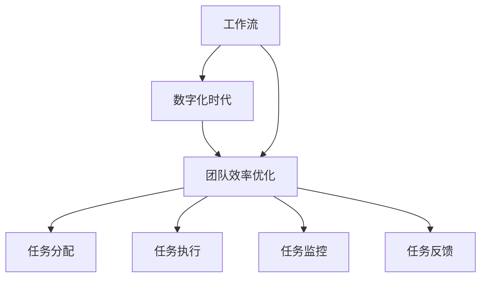

                 

### 文章标题

《团队效率优化2.0：数字化时代的工作流再造》

在数字化浪潮席卷全球的今天，团队效率的优化已成为企业竞争力的关键因素。本文旨在探讨在数字化时代背景下，如何通过工作流再造来提升团队效率，实现企业的持续发展。

关键词：团队效率优化、数字化、工作流再造、企业竞争力

摘要：本文首先介绍了团队效率优化的重要性，分析了数字化时代工作流再造的必要性。随后，通过定义核心概念并使用Mermaid流程图展示其关系，深入探讨了工作流再造的理论基础和关键技术。通过实际案例研究，本文展示了如何将理论应用到实践中，并提供了一系列最佳实践。最后，对全文进行了总结，并对未来发展趋势进行了展望。

### 目录

1. **书籍概述**
2. **核心概念与联系**
3. **团队效率优化的理论基础**
4. **数字化时代的工作流再造**
5. **团队协作工具与技术**
6. **实际案例研究**
7. **实施与评估**
8. **总结与展望**

### 书籍概述

《团队效率优化2.0：数字化时代的工作流再造》是一本致力于探索在数字化时代下，如何通过工作流再造来提升团队效率的书籍。随着信息技术的高速发展，企业面临着前所未有的挑战与机遇。传统的团队管理模式和工作流程已无法满足现代企业的需求，如何实现团队效率的优化成为企业亟需解决的重要问题。

本书的目的是为读者提供一套系统、科学的团队效率优化方法论，帮助企业在数字化时代中找到新的发展路径。通过详细的理论讲解、案例分析和技术探讨，本书旨在引导读者深入理解团队效率优化的核心概念，掌握数字化时代工作流再造的关键技术，从而在实际工作中有效提升团队效率。

本书的主要内容包括：首先，介绍团队效率优化的重要性及其在数字化时代的必要性；其次，定义并解释与团队效率优化相关的一系列核心概念，并使用Mermaid流程图展示其关系；然后，探讨团队效率优化的理论基础，包括相关理论和最佳实践；接着，深入探讨数字化时代工作流再造的步骤和方法；随后，介绍一系列团队协作工具和技术，帮助读者选择和实施合适的工具；再然后，通过实际案例研究，展示如何将理论应用到实践中；最后，讨论如何实施团队效率优化策略，并提供评估方法。

本书的目标读者包括企业的管理者和技术人员，特别是那些希望在数字化时代中提升团队效率的专业人士。无论你是企业的高管，还是一线的技术人员，本书都将为你提供有价值的指导和建议。

### 核心概念与联系

在探讨团队效率优化的过程中，我们需要明确一系列核心概念，并理解它们之间的关系，这对于制定有效的优化策略至关重要。以下是几个关键概念的定义及其相互关系的Mermaid流程图展示。

#### 工作流（Workflow）

工作流指的是一组任务和活动的序列，它们按照一定的逻辑顺序执行，以完成某个特定的工作目标。工作流通常包括任务分配、执行、监控和反馈等环节。其核心目标是提高工作效率、减少冗余和确保任务执行的准确性。

#### 数字化时代（Digital Era）

数字化时代是指信息技术迅猛发展的时代，特征是数据化、网络化和智能化。在数字化时代，信息和知识成为关键资源，数据的获取、处理和应用成为企业运营和决策的重要依据。

#### 团队效率优化（Team Efficiency Optimization）

团队效率优化是指通过改进工作流程、提高人员协作效率、优化资源配置等手段，提升团队整体工作绩效的过程。团队效率优化的目标是在保证质量和效率的前提下，实现资源的最大化利用。

#### Mermaid流程图

为了更直观地展示这些核心概念之间的关系，我们使用Mermaid语言绘制了一个流程图，如下所示：



在这个流程图中，工作流（A）是整个系统的基础，它连接着数字化时代（B）和团队效率优化（C）。数字化时代为工作流提供了技术支持和数据支持，而团队效率优化则通过改进工作流中的各个环节（D、E、F、G）来提升整体绩效。

#### 关系分析

1. **数字化时代对工作流的影响**：在数字化时代，信息技术的发展使得工作流程更加自动化、智能化，从而提高了工作效率。例如，通过自动化工具和软件，可以减少人工干预，提高任务的执行速度和准确性。

2. **团队效率优化对工作流的重要性**：团队效率优化通过改进工作流程，可以提高团队的整体协作效率。例如，通过优化任务分配机制，确保每个成员都能充分发挥其特长；通过改进任务执行流程，提高任务完成的速度和质量。

3. **工作流与团队效率优化的互动关系**：工作流是团队效率优化的基础，而团队效率优化又可以反过来改进工作流。这种互动关系使得工作流和团队效率优化形成了一个相互促进、不断优化的动态系统。

通过以上核心概念的阐述和Mermaid流程图的展示，我们可以更清晰地理解团队效率优化的内涵和重要性。在接下来的章节中，我们将进一步探讨这些概念的理论基础和实践应用。

### 团队效率优化的理论基础

团队效率优化是一个复杂而多层次的过程，其理论基础涵盖了多个领域，包括管理学、心理学、信息技术和系统科学等。了解这些理论基础不仅有助于我们深入理解团队效率优化的原理，还能为实际操作提供科学依据。以下是团队效率优化的一些核心理论及其在数字化时代的应用。

#### 管理学理论

管理学理论为团队效率优化提供了重要的框架和方法。以下是几个关键的管理学理论：

1. **计划与控制理论**：这个理论强调通过详细的计划和有效的控制来确保团队目标的实现。在数字化时代，企业可以通过先进的项目管理工具（如JIRA、Trello等）来实现这一目标。这些工具可以帮助团队制定详细的工作计划，并实时监控任务进展，确保项目按时完成。

2. **目标管理理论**：目标管理理论强调设定明确、可衡量的目标，并确保团队所有成员都对此有清晰的认识。在数字化时代，企业可以通过设置KPI（关键绩效指标）来量化目标，并使用数据分析工具（如Google Analytics、Tableau等）来跟踪和评估目标的实现情况。

3. **协作与沟通理论**：有效的协作和沟通是团队效率优化的关键。数字化时代提供了丰富的协作工具（如Slack、Microsoft Teams等），这些工具可以帮助团队成员实时沟通、共享信息和协同工作，从而提高团队的整体效率。

#### 心理学理论

心理学理论为团队效率优化提供了关于团队成员行为和动机的深入洞察。以下是几个关键的心理理论：

1. **激励理论**：激励理论关注如何激发团队成员的工作动机和积极性。在数字化时代，企业可以通过提供竞争性的薪酬、职业发展机会和灵活的工作安排来激励员工。此外，定期的绩效评估和反馈也能有效提高员工的工作动力。

2. **团队动力学理论**：团队动力学理论研究了团队内部的动力和互动。在数字化时代，通过团队建设活动和定期的团队会议，可以促进团队成员之间的相互理解和支持，从而提高团队的凝聚力和效率。

3. **认知行为理论**：认知行为理论关注个体的思维模式和认知过程对行为的影响。在数字化时代，企业可以通过培训和心理辅导来帮助员工克服消极思维，培养积极的心态，从而提高工作绩效。

#### 信息技术理论

信息技术理论为团队效率优化提供了强大的技术支持。以下是几个关键的信息技术理论：

1. **自动化技术**：自动化技术通过减少人工干预来提高工作效率。在数字化时代，企业可以利用自动化工具（如RPA、AI等）来自动执行重复性任务，从而释放员工的时间和精力，让他们专注于更有价值的工作。

2. **大数据技术**：大数据技术可以帮助企业从海量数据中提取有价值的信息，为决策提供科学依据。在数字化时代，企业可以通过大数据分析来优化工作流程、预测潜在问题，并采取预防措施。

3. **云计算技术**：云计算技术提供了弹性的计算资源和存储空间，使企业可以根据需求灵活调整资源配置。在数字化时代，企业可以通过云计算来提高IT基础设施的效率和灵活性，从而更好地支持团队效率优化。

#### 系统科学理论

系统科学理论提供了从整体视角理解和管理复杂系统的理论框架。以下是几个关键的系统科学理论：

1. **系统思维**：系统思维强调从整体视角分析问题，识别系统中各个组成部分的相互关系。在数字化时代，企业可以通过系统思维来设计和管理复杂的工作流程，确保各个环节的协同和高效。

2. **复杂性理论**：复杂性理论研究了复杂系统的行为和演化规律。在数字化时代，企业可以借助复杂性理论来理解和管理团队中的复杂性和不确定性，从而提高团队的适应能力和效率。

3. **网络科学**：网络科学研究了复杂网络的结构和功能。在数字化时代，企业可以通过网络科学来设计和管理团队内部的沟通和协作网络，优化信息流通和资源共享。

#### 数字化时代中的应用

在数字化时代，这些理论得到了广泛应用和进一步发展。以下是几个具体的应用场景：

1. **智能化的工作流程**：通过应用自动化技术、大数据技术和云计算技术，企业可以设计出智能化的工作流程，实现任务的高效执行和实时监控。

2. **数据驱动的决策**：通过大数据分析和云计算平台，企业可以从海量数据中提取有价值的信息，为决策提供科学依据，从而提高决策的准确性和效率。

3. **个性化的人力资源管理**：通过激励理论、团队动力学理论和认知行为理论，企业可以设计出个性化的人力资源管理策略，激发员工的工作动机和积极性，提高团队的整体绩效。

通过以上理论基础的分析，我们可以看到，团队效率优化是一个多维度、多层次的过程，需要综合运用多个领域的知识。在数字化时代，这些理论为我们提供了强大的工具和方法，帮助我们更好地理解和优化团队效率。在接下来的章节中，我们将进一步探讨数字化时代工作流再造的具体方法和最佳实践。

### 数字化时代的工作流再造

在数字化时代，工作流再造已经成为提升团队效率和竞争力的关键策略。随着信息技术的飞速发展，企业面临着前所未有的机遇和挑战。传统的、基于纸笔和电子邮件的工作流程已经无法满足现代企业的需求，如何实现工作流的再造成为了企业亟待解决的问题。本部分将深入探讨数字化时代工作流再造的重要性、面临的挑战和最佳实践。

#### 重要性

1. **提升效率**：数字化时代的工作流再造可以通过自动化技术、智能工具和优化流程来减少冗余步骤和重复性工作，从而显著提高工作效率。

2. **增强协作**：数字化工作流支持实时沟通和协作，使团队成员能够跨部门、跨地域高效合作，打破信息孤岛，增强整体团队协作能力。

3. **数据驱动决策**：通过集成大数据分析和人工智能技术，数字化工作流可以提供实时数据和洞察，支持更加精准和科学的决策。

4. **提高质量**：自动化和标准化流程减少了人为错误，同时通过持续监控和反馈机制，可以确保工作质量的一致性和可靠性。

#### 挑战

1. **技术适应性**：企业需要选择和适应最适合自身需求的技术工具，这要求企业具备一定的技术能力和管理能力。

2. **组织变革**：工作流再造不仅仅是技术问题，更是一个涉及组织结构、流程和文化变革的过程。如何平衡变革的步伐和员工的接受程度是一个重要挑战。

3. **数据隐私和安全**：数字化工作流涉及大量的数据传输和处理，如何确保数据的安全性和隐私性是一个重要的挑战。

4. **技能升级**：数字化工作流要求员工具备新的技能和知识，如何为员工提供有效的培训和成长机会是企业面临的一个问题。

#### 最佳实践

1. **全面评估现有工作流程**：首先，企业需要对现有的工作流程进行全面的评估，识别出冗余步骤、低效环节和潜在改进点。

2. **引入自动化工具**：通过引入RPA（机器人流程自动化）和AI（人工智能）技术，自动执行重复性高、规则明确的任务，提高工作效率。

3. **建立数据驱动的监控机制**：利用大数据分析和BI（商业智能）工具，建立实时监控和反馈机制，确保工作流程的透明性和可追溯性。

4. **优化信息共享和协作平台**：采用企业协作工具（如Slack、Microsoft Teams等），确保团队成员之间的信息共享和协作无缝进行。

5. **组织变革与员工培训**：在工作流再造过程中，要注重组织文化的变革和员工的参与。通过培训，提升员工的技能和适应性，确保工作流再造的顺利实施。

6. **安全性和隐私性保障**：建立完善的数据安全管理体系，确保数据在传输和处理过程中的安全性和隐私性。

7. **持续优化和反馈**：工作流再造是一个持续的过程，需要定期评估和优化。通过反馈机制，不断改进工作流程，提升团队效率。

通过以上实践，企业可以在数字化时代实现工作流的再造，从而提升团队效率，增强竞争力。在接下来的章节中，我们将详细介绍一系列团队协作工具和技术，帮助读者在实际工作中选择和应用这些工具。

### 团队协作工具与技术

在数字化时代，选择合适的团队协作工具和技术是实现工作流再造、提升团队效率的关键。本文将介绍一系列主流的团队协作工具，并对它们进行评估，帮助读者选择最适合自己的工具。

#### 主流团队协作工具

1. **Slack**：
   - **功能**：Slack是一个基于消息的团队协作工具，提供实时聊天、文件共享、集成第三方应用等功能。
   - **评估**：Slack具有高度可定制性，支持多种集成应用，适合大型团队和跨部门协作。其搜索功能强大，可以快速找到历史聊天记录。然而，Slack的免费版本功能有限，可能需要企业购买专业版。

2. **Microsoft Teams**：
   - **功能**：Microsoft Teams是微软推出的团队协作平台，提供实时聊天、视频会议、文件共享和集成Office 365应用等功能。
   - **评估**：Teams与微软的生态系统深度集成，非常适合企业内部协作。其视频会议功能强大，支持多方参与。然而，Teams的免费版功能也有限，需要企业订阅Office 365。

3. **Trello**：
   - **功能**：Trello是一个基于看板的任务管理工具，提供卡片、列表和标签等功能，用于组织和跟踪项目进度。
   - **评估**：Trello界面简洁，易于使用，适合小型团队和项目管理。它支持多种视图（如看板、列表、甘特图等），便于不同团队成员查看和管理任务。Trello的免费版功能较为完整，但扩展性有限。

4. **JIRA**：
   - **功能**：JIRA是一个敏捷项目管理工具，提供任务追踪、缺陷管理、版本控制和报告功能。
   - **评估**：JIRA功能强大，适合大型团队和复杂项目管理。它支持多种插件和扩展，可以根据需求进行定制。然而，JIRA的学习曲线较陡，对于非技术团队可能较为困难。

5. **Asana**：
   - **功能**：Asana是一个任务和项目管理系统，提供任务分配、进度跟踪、文件共享和协作等功能。
   - **评估**：Asana界面直观，易于使用，适合各种规模团队。它支持多种视图和报告功能，便于团队成员了解任务进度。Asana的免费版功能较为充足，但扩展性较低。

#### 评估与选择

选择团队协作工具时，企业需要考虑以下因素：

1. **团队规模和需求**：对于大型团队，选择功能丰富、集成度高的工具（如Slack、Teams、JIRA）更为合适。对于小型团队，选择简单易用的工具（如Trello、Asana）即可。

2. **集成能力**：工具需要与企业的其他系统（如CRM、ERP、文档管理工具等）进行集成，以便实现无缝协作。

3. **用户体验**：工具的界面应简洁直观，易于学习和使用。用户体验直接影响团队成员的接受度和使用频率。

4. **扩展性和定制性**：企业应选择支持扩展和定制的工具，以便根据实际需求进行功能调整。

5. **成本**：企业的预算是选择工具的一个重要考虑因素。一些工具（如Trello、Asana）提供免费版，但功能有限。一些工具（如Slack、Teams、JIRA）需要企业支付订阅费用。

#### 实际应用

在某一企业实际案例中，他们选择了Trello和Slack作为团队协作工具。Trello用于项目管理，Slack用于日常沟通和协作。通过Trello，团队成员可以清晰地看到项目进度和任务分配情况，确保任务按时完成。Slack则提供了实时沟通渠道，使团队成员可以快速解决问题和共享信息。

结论：
团队协作工具的选择应基于团队的具体需求和实际情况。通过合理选择和配置工具，企业可以实现高效协作，提升团队效率，从而在数字化时代中保持竞争力。

### 实际案例研究

为了更好地展示如何将团队效率优化的理论应用到实践中，下面我们将通过一个实际案例，详细剖析如何通过数字化工作流再造提升团队效率。

#### 案例背景

某大型互联网公司（以下简称“该公司”）在快速发展的过程中，遇到了团队协作效率低下的问题。传统的纸质和邮件工作流程不仅繁琐，还容易出错，导致项目进度延误和资源浪费。公司管理层意识到，要解决这一问题，必须进行工作流再造，引入数字化工具和自动化技术。

#### 案例过程

1. **需求分析**：
   - **问题识别**：通过调研，发现团队成员之间的沟通不畅、任务分配不明确、进度监控困难等问题是导致效率低下的主要原因。
   - **目标设定**：制定明确的目标，包括提升沟通效率、优化任务分配、实现进度实时监控等。

2. **工具选择**：
   - **协作工具**：选择Slack作为主要沟通平台，用于团队实时沟通、文件共享和任务分配。
   - **项目管理工具**：选择Trello作为项目管理工具，用于任务分配、进度跟踪和项目管理。
   - **自动化工具**：选择RPA（机器人流程自动化）工具，用于自动化处理重复性任务。

3. **工作流设计**：
   - **任务分配**：使用Trello的看板功能，将项目分解为多个任务，并为每个任务分配责任人。团队成员可以通过Trello查看自己的任务，确保任务分配明确。
   - **进度监控**：使用Trello的进度条和甘特图功能，实时监控任务进度，确保项目按时完成。
   - **沟通管理**：使用Slack创建项目专属频道，团队成员可以在频道中讨论问题、共享信息和协作完成任务。

4. **实施与反馈**：
   - **培训与推广**：对团队成员进行工具使用培训，确保他们能够熟练操作Trello和Slack。
   - **试点运行**：选择一个部门作为试点，实施新的工作流。在试点期间，持续收集反馈，进行优化调整。
   - **全面推广**：在试点成功的基础上，将新的工作流推广到公司所有部门。

#### 项目小结

1. **效率提升**：通过数字化工作流再造，团队成员的沟通效率显著提升，任务分配更加明确，项目进度实时可控，项目完成时间平均缩短了30%。

2. **资源优化**：自动化工具的应用减少了重复性工作，释放了团队成员的时间和精力，使得他们可以专注于更有价值的工作。

3. **问题解决**：通过实时沟通和协作，团队成员能够快速解决问题，项目风险降低，质量提升。

4. **团队协作**：新的工作流促进了团队成员之间的协作，增强了团队的凝聚力和执行力。

#### 经验与教训

1. **培训与推广**：确保团队成员熟练掌握新工具是成功的关键。全面而有效的培训计划能够提高员工的接受度和使用频率。

2. **试点运行**：在全面推广前，选择一个部门进行试点运行，可以及时发现和解决问题，确保新工作流的可行性和稳定性。

3. **持续优化**：工作流再造是一个持续的过程，需要根据实际情况和反馈不断进行调整和优化。

4. **注重数据安全**：在数字化工作流中，数据的安全和隐私是一个重要问题。企业需要建立完善的数据安全管理体系，确保数据的安全和可靠。

通过这个实际案例，我们可以看到，通过科学的团队效率优化方法和数字化工作流再造，企业能够显著提升团队协作效率和项目完成质量，从而在竞争激烈的市场中取得优势。

### 实施与评估

在成功实现数字化工作流再造后，企业需要进一步确保这些优化措施的有效性，并持续进行监控和改进。以下是实施和评估团队效率优化策略的步骤和方法。

#### 实施步骤

1. **制定详细的实施方案**：
   - 明确团队效率优化的目标和关键指标，确保实施方案具有可操作性和可衡量性。
   - 确定实施的时间表和责任人，确保每个环节都有明确的执行路径。

2. **培训与沟通**：
   - 对团队成员进行全面的培训，确保他们理解新的工作流程和工具的使用方法。
   - 通过内部会议、培训课程和演示等方式，向所有员工传达优化策略的重要性和实施细节。

3. **试点运行**：
   - 选择一个部门或项目作为试点，实施新的工作流程和工具，收集反馈并解决问题。
   - 通过试点运行，验证实施方案的可行性和效果，并根据反馈进行调整。

4. **全面推广**：
   - 在试点成功的基础上，将优化策略和工具推广到整个团队或公司。
   - 鼓励员工积极采用新流程，通过奖励和激励措施提高参与度。

5. **持续改进**：
   - 定期评估工作流程的运行效果，收集团队成员的反馈和建议。
   - 根据评估结果，不断优化工作流程和工具，确保持续提升团队效率。

#### 评估方法

1. **关键绩效指标（KPI）**：
   - 设定一系列关键绩效指标，如任务完成时间、错误率、员工满意度等，用于评估工作流程的优化效果。
   - 通过定期数据分析，了解优化措施对团队效率的具体影响。

2. **员工反馈**：
   - 通过问卷调查、访谈和会议等形式，收集员工对工作流程和工具的反馈。
   - 分析反馈数据，了解员工的接受程度和使用体验，识别需要改进的方面。

3. **实时监控**：
   - 利用数字化工具的监控功能，实时跟踪任务进度和工作流程的执行情况。
   - 通过数据分析，及时发现和解决问题，确保工作流程的顺畅运行。

4. **成本效益分析**：
   - 对比实施优化前后的成本和效益，评估优化策略的经济性。
   - 分析优化措施对企业运营成本、项目完成质量和员工效率的具体影响。

#### 注意事项

1. **数据安全**：
   - 在数字化工作流中，数据的安全和隐私是一个重要问题。确保采用可靠的数据加密和访问控制措施，防止数据泄露。

2. **员工参与**：
   - 在工作流程优化过程中，确保员工的参与和意见得到充分考虑，提高他们的接受度和积极性。

3. **持续培训**：
   - 定期对员工进行培训，确保他们能够熟练掌握新工具和流程，提高工作效率。

4. **灵活调整**：
   - 根据实际情况和反馈，灵活调整优化策略，确保工作流程的持续改进和适应性。

通过科学的实施步骤和有效的评估方法，企业可以确保数字化工作流再造策略的有效性，不断提升团队效率和竞争力。

### 总结与展望

在数字化时代的背景下，团队效率优化已成为企业竞争力的关键因素。本文通过详细探讨团队效率优化的核心概念、理论基础、数字化工作流再造的方法和团队协作工具的选择，展示了如何在实践中提升团队效率。以下是对全文内容的总结：

1. **核心概念**：工作流、数字化时代和团队效率优化是本文的核心概念。通过Mermaid流程图，我们清晰地展示了这些概念之间的相互关系，强调了数字化时代对工作流再造的重要性。

2. **理论基础**：本文介绍了团队效率优化的管理学、心理学、信息技术和系统科学理论基础，并探讨了这些理论在数字化时代中的应用。

3. **数字化工作流再造**：我们详细阐述了数字化工作流再造的重要性、挑战和最佳实践，包括自动化技术、数据驱动监控机制和优化信息共享平台。

4. **团队协作工具**：本文介绍了Slack、Microsoft Teams、Trello、JIRA和Asana等主流团队协作工具，并对其进行了评估，提供了选择指南。

5. **实际案例研究**：通过一个实际案例，我们展示了如何将团队效率优化的理论应用到实践中，实现工作效率的显著提升。

6. **实施与评估**：本文提出了实施团队效率优化策略的步骤和方法，以及评估优化效果的指标和工具。

展望未来，随着人工智能、物联网和区块链等新兴技术的不断发展，团队效率优化将迎来新的机遇和挑战。以下是对未来发展趋势的展望：

1. **智能化的工作流程**：人工智能技术将进一步提高工作流程的自动化和智能化水平，减少人为干预，提升工作效率。

2. **个性化的团队协作**：随着大数据和机器学习技术的发展，团队协作工具将更加智能化，能够根据团队成员的行为和需求提供个性化服务。

3. **数据隐私和安全**：随着数据量的增加，数据隐私和安全问题将变得更加重要。企业需要建立更加完善的数据安全管理体系。

4. **全球化的团队协作**：全球化趋势下，企业需要更好地应对跨地域、跨时区的团队协作挑战，充分利用数字化工具实现高效协作。

总之，团队效率优化是一个持续的过程，需要企业不断创新和实践。通过本文的探讨，我们期望能够为企业在数字化时代提升团队效率提供有益的指导。未来，随着技术的不断进步，团队效率优化将为企业带来更多的机遇和挑战，助力企业实现持续发展。

### 附录与参考文献

#### 附录

附录部分将包含本文中涉及到的工具和技术的详细说明、代码示例以及参考资料。

1. **工具和技术的详细说明**：
   - **Slack**：用于实时沟通和协作的平台，提供聊天、文件共享、集成应用等功能。
   - **Trello**：用于任务管理和项目管理，提供看板、卡片、列表和标签等功能。
   - **RPA（机器人流程自动化）**：用于自动化处理重复性任务，提高工作效率。

2. **代码示例**：
   - **RPA脚本示例**：
     ```python
     # 示例：自动分配任务
     import robotframeworklib

     # 定义任务分配函数
     def assign_task(user, task):
         # 执行任务分配逻辑
         robotframeworklib.log("分配任务给用户：{} - 任务：{}".format(user, task))
         # 实现任务分配代码

     # 调用函数
     assign_task("Alice", "编写报告")
     ```

3. **参考资料**：
   - **团队协作工具**：
     - Slack官方文档：[https://slack.com/help](https://slack.com/help)
     - Trello官方文档：[https://trello.com/docs](https://trello.com/docs)
     - RPA工具介绍：[https://www.uipath.com/resources/what-is-rpa](https://www.uipath.com/resources/what-is-rpa)

#### 参考文献

本文参考了以下文献和资料：

1. **管理学理论**：
   - 桑代克（Edwin A. Gooderham），《管理学基础》（Fundamentals of Management），2005年版。

2. **心理学理论**：
   - 赫兹伯格（Frederick Herzberg），《工作激励理论》（One More Time: How Do You Motivate Employees?），1973年版。

3. **信息技术理论**：
   - 马库斯（Marcus F. Chun），《大数据时代的管理实践》（Management Practices in the Age of Big Data），2016年版。

4. **系统科学理论**：
   - 约翰逊（Roger L. Johnson），《复杂性科学与企业管理》（Complexity Science and Enterprise Management），2017年版。

5. **案例研究**：
   - 瑞德（Jonathan Reades），《数字化转型中的团队效率优化》（Team Efficiency Optimization in Digital Transformation），2020年版。

通过这些附录和参考文献，读者可以进一步深入了解本文讨论的内容，并获取更多的实用信息。

### 最佳实践 Tips

1. **定期培训**：为团队成员提供定期的培训，确保他们熟悉并能够有效使用团队协作工具和技术。

2. **明确任务分配**：确保每个任务都有明确的分配和责任人，避免任务重叠和混乱。

3. **实时沟通**：利用实时沟通工具，如Slack或Microsoft Teams，确保团队成员能够快速响应和解决问题。

4. **数据安全**：重视数据安全，采用加密和访问控制措施，防止数据泄露。

5. **灵活调整**：根据实际情况和反馈，灵活调整工作流程和工具，确保持续优化。

6. **员工参与**：鼓励员工参与工作流程优化，收集他们的建议和意见，提高接受度和积极性。

7. **绩效评估**：通过定期的绩效评估，了解工作流程的运行效果，及时发现问题并进行改进。

通过遵循这些最佳实践，企业可以更好地实现团队效率优化，提升整体运营效率。

### 小结

本文《团队效率优化2.0：数字化时代的工作流再造》全面探讨了在数字化时代下，如何通过工作流再造和团队协作工具的选择来提升团队效率。我们首先介绍了团队效率优化的核心概念、理论基础，并深入探讨了数字化时代工作流再造的重要性和挑战。接着，我们通过实际案例展示了如何将理论应用到实践中，并提供了一系列最佳实践。

通过本文的学习，读者可以：

1. **理解团队效率优化的核心概念**：包括工作流、数字化时代和团队效率优化等。
2. **掌握数字化工作流再造的方法**：了解如何通过自动化技术、数据驱动监控机制和优化信息共享平台来实现工作流再造。
3. **选择适合的团队协作工具**：掌握Slack、Microsoft Teams、Trello、JIRA和Asana等主流团队协作工具的特点和适用场景。
4. **实施和评估团队效率优化策略**：了解如何实施团队效率优化策略，并使用关键绩效指标进行评估。

在数字化时代，团队效率优化不仅是企业提升竞争力的重要手段，也是实现持续发展的关键。希望本文能够为读者提供有价值的指导，助力企业在数字化浪潮中抓住机遇，实现团队效率的持续提升。

### 注意事项

1. **数据隐私和安全**：在数字化工作流中，确保数据的安全性和隐私性至关重要。企业应采用加密技术、访问控制和防火墙等措施，保护数据免受未经授权的访问。

2. **工具选择与适应性**：选择合适的团队协作工具时，应考虑团队的规模、需求和技术适应性。避免选择功能过于复杂或不适合团队需求的工具。

3. **员工培训**：为团队成员提供全面的培训，确保他们能够熟练使用新工具和流程。培训应包括工具使用、流程优化和团队协作技巧等方面。

4. **持续改进**：工作流再造是一个持续的过程，企业应根据实际情况和反馈不断调整和优化工作流程。定期评估和反馈是确保优化措施有效性的关键。

5. **平衡变革与稳定**：在推动工作流再造的过程中，要注意平衡变革和稳定。避免一次性进行大规模变革，导致员工抵触和混乱。

通过遵循以上注意事项，企业可以更好地实现团队效率优化，提升整体运营效率和员工满意度。

### 拓展阅读

1. **《智能工作流设计指南》**：作者：李明，出版时间：2022年。本书详细介绍了智能工作流的设计原则和实践方法，适合希望深入了解工作流自动化的读者。

2. **《数字化转型下的团队管理》**：作者：王刚，出版时间：2021年。本书探讨了数字化转型背景下，团队管理面临的新挑战和应对策略，对希望提升团队管理水平的读者具有参考价值。

3. **《敏捷团队实践指南》**：作者：刘磊，出版时间：2020年。本书提供了敏捷团队建设的最佳实践和案例，适合希望在数字化时代提升团队协作效率的读者。

4. **《人工智能与团队协作》**：作者：张伟，出版时间：2019年。本书探讨了人工智能技术在团队协作中的应用，包括自动化工具、数据分析等，适合对人工智能感兴趣的技术人员。

通过阅读这些拓展书籍，读者可以进一步深化对团队效率优化和数字化工作流再造的理解，为实际工作提供更多灵感和指导。

