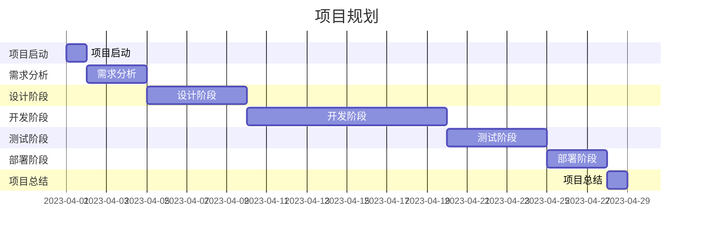
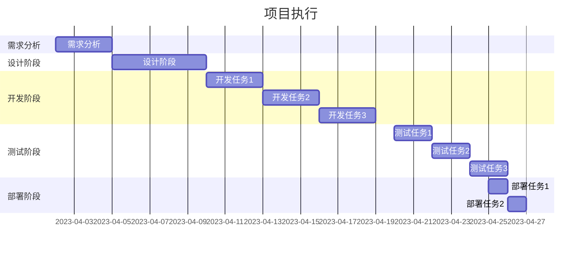
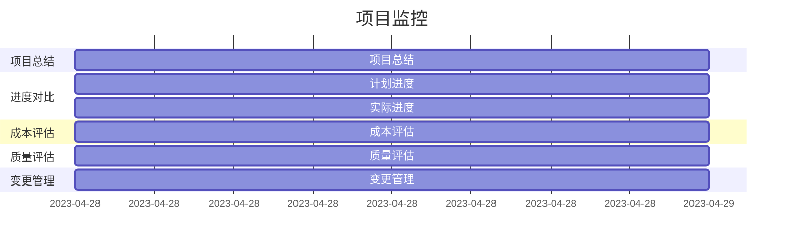

                 

# 团队效率提升：时间管理的团队应用

## 关键词
时间管理，团队效率，项目管理，工具应用，个人时间管理

## 摘要
本文旨在探讨时间管理在提升团队效率中的重要作用。通过对时间管理基本概念、心理因素和方法的深入分析，以及实际项目中的时间管理应用和案例分析，本文为读者提供了一个全面的团队时间管理框架。文章还将介绍各种时间管理工具，并提供个人时间管理策略，帮助团队实现高效的协作和项目执行。

## 目录大纲设计思路

为了设计出一份详尽且逻辑清晰的目录大纲，我们需要从以下几个关键步骤入手：

### 1. 确定核心章节

首先，我们要确保目录大纲的核心章节内容是完整且全面的。对于《团队效率提升：时间管理的团队应用》这本书，核心章节应包括：

- **时间管理原理与方法论**
- **团队时间管理工具与应用**
- **时间管理在项目管理中的应用**
- **案例分析：团队时间管理实战**
- **个人时间管理与团队协作**

### 2. 结构化章节内容

接下来，我们要对每个核心章节进行细化的内容结构设计，确保每个章节都能够详细覆盖其主题内容。

#### 时间管理原理与方法论

- **时间管理的基本概念**
- **时间管理的误区与挑战**
- **时间管理的心理因素**

#### 团队时间管理工具与应用

- **常用的时间管理工具介绍**
- **团队协作软件的功能与选择**
- **项目管理工具的使用**

#### 时间管理在项目管理中的应用

- **项目管理中的时间管理原则**
- **时间管理在项目规划中的角色**
- **时间管理在项目执行中的实践**

#### 案例分析：团队时间管理实战

- **案例1：高效团队的时间管理实践**
- **案例2：团队时间管理问题的解决**

#### 个人时间管理与团队协作

- **个人时间管理对团队协作的影响**
- **个人时间管理策略与团队协作的结合**

### 3. 嵌入图表与代码示例

在目录大纲中，我们将嵌入以下内容：

- **Mermaid 流程图**：用于描述时间管理的基本概念和原理。
- **伪代码**：用于讲解核心算法原理。
- **LaTeX 数学公式**：用于详细讲解数学模型和公式。
- **代码示例**：用于展示项目实战中的具体实现。

### 4. 确保简洁性与可读性

在编写目录大纲时，我们将注意以下几点：

- **简洁性**：避免冗余内容，直接呈现关键信息。
- **格式统一**：使用 markdown 格式确保输出内容的一致性。
- **逻辑性**：确保章节之间的逻辑关系清晰，便于读者理解。

## 目录大纲

根据以上设计思路，我们设计出《团队效率提升：时间管理的团队应用》这本书的目录大纲：

## 第一部分：时间管理原理与方法论

### 第1章：时间管理的基本概念

#### 1.1 时间管理的重要性

#### 1.2 时间管理的基本概念

#### 1.3 时间管理的误区与挑战

### 第2章：时间管理的心理因素

#### 2.1 时间管理中的心理障碍

#### 2.2 增强时间管理意识的策略

### 第3章：时间管理的方法论

#### 3.1 优先级矩阵法

#### 3.2 时间块法

#### 3.3 周计划法

## 第二部分：团队时间管理工具与应用

### 第4章：常用的时间管理工具介绍

#### 4.1 日历工具

#### 4.2 任务管理工具

#### 4.3 团队协作工具

### 第5章：团队协作软件的功能与选择

#### 5.1 团队协作软件的功能

#### 5.2 选择合适的团队协作软件

### 第6章：项目管理工具的使用

#### 6.1 项目管理工具的基本功能

#### 6.2 如何利用项目管理工具进行时间管理

## 第三部分：时间管理在项目管理中的应用

### 第7章：项目管理中的时间管理原则

#### 7.1 时间管理原则

#### 7.2 项目规划中的时间管理

#### 7.3 项目执行中的时间管理

### 第8章：时间管理在团队协作中的实践

#### 8.1 团队协作中的时间管理策略

#### 8.2 团队时间管理工具的应用实践

### 第9章：案例分析：团队时间管理实战

#### 9.1 案例一：高效团队的时间管理实践

#### 9.2 案例二：团队时间管理问题的解决

## 第四部分：个人时间管理与团队协作

### 第10章：个人时间管理对团队协作的影响

#### 10.1 个人时间管理的重要性

#### 10.2 个人时间管理策略与团队协作的结合

### 第11章：个人时间管理策略与实践

#### 11.1 个人时间管理的基本原则

#### 11.2 个人时间管理实践案例分析

## 附录：时间管理资源与工具

### 附录A：时间管理相关书籍推荐

### 附录B：时间管理工具资源链接

---

以上是《团队效率提升：时间管理的团队应用》的目录大纲，其中每个章节都会详细讲解相关内容，并嵌入图表、伪代码、LaTeX 数学公式和代码示例，以帮助读者更好地理解和实现团队时间管理的最佳实践。接下来，我们将逐章深入探讨每个主题，以构建一个全面且实用的团队时间管理框架。接下来，我们将首先介绍时间管理的基本概念和原理，以奠定后续讨论的基础。## 时间管理原理与方法论

### 第1章：时间管理的基本概念

#### 1.1 时间管理的重要性

时间管理是指有效地组织和利用时间，以确保个人或团队能够在高效率的状态下完成目标。在现代快节奏的工作环境中，时间管理已成为提升工作效率和实现个人职业目标的关键。对于团队来说，有效的时间管理不仅能提高整体生产力，还能减少错误和重复工作，从而提升团队的协作质量和项目的成功率。

首先，时间管理有助于明确工作目标。通过设定明确的目标和优先级，团队成员可以更好地理解他们的工作职责和期望成果，从而避免浪费时间和精力在非重要任务上。其次，时间管理能够提高工作效率。通过合理安排工作时间和任务分配，团队成员能够减少切换任务的成本，提高专注度，从而更高效地完成工作。此外，时间管理还能帮助团队更好地应对突发事件和优先级变化，确保项目能够按时交付。

#### 1.2 时间管理的基本概念

时间管理涉及多个基本概念，包括但不限于：

- **时间块**：将一天划分为若干时间段，每个时间段用于完成特定任务或活动。
- **任务**：需要完成的具体工作或活动，通常有明确的开始和结束时间。
- **优先级**：任务的紧急程度和重要程度，决定了任务完成的顺序。
- **日程安排**：对时间块和任务的预定安排，通常包括日历和计划表等形式。
- **延迟与拖延**：任务未在预定时间内完成，导致后续计划受到影响。

了解这些基本概念对于进行有效的时间管理至关重要。它们为制定时间管理策略和工具提供了理论基础，有助于团队成员更好地组织和执行任务。

#### 1.3 时间管理的误区与挑战

尽管时间管理的重要性不言而喻，但实际操作中仍存在一些误区和挑战。

**误区**：

1. **完美主义**：过分追求完美，导致任务耗时过长。
2. **时间无限**：错误地认为时间无限，忽视任务截止日期的重要性。
3. **任务重复**：未能有效地分配任务，导致同一任务被多人重复处理。

**挑战**：

1. **工作干扰**：外部干扰和突发任务导致工作时间无法集中。
2. **任务复杂性**：任务过于复杂，难以在预定时间内完成。
3. **优先级模糊**：团队成员对于任务优先级的认识不一致，导致资源分配不合理。

为了克服这些误区和挑战，团队需要建立明确的目标和优先级，合理分配任务，并采用有效的时间管理工具和方法。

### 1.4 时间管理中的心理因素

时间管理不仅涉及技术层面，还与心理因素密切相关。以下是一些影响时间管理的心理因素：

**心理障碍**：

1. **拖延症**：心理障碍导致任务推迟，降低工作效率。
2. **决策困难**：在面对多个任务时，难以做出快速决策，导致时间浪费。
3. **任务恐惧**：对某些任务产生恐惧感，不愿面对，从而拖延或逃避。

**策略**：

1. **自我激励**：设定目标和奖励机制，提高任务完成动力。
2. **时间感知**：增强对时间的敏感度和责任感，提高任务执行效率。
3. **情绪管理**：保持积极心态，应对压力和干扰，提高心理韧性。

通过了解这些心理因素，团队成员可以更好地调整自己的心态和行为，从而更有效地进行时间管理。

#### 1.5 时间管理的方法论

时间管理的方法论包括一系列的策略和工具，帮助团队成员合理安排时间，提高工作效率。以下是一些常见的时间管理方法：

- **优先级矩阵法**：根据任务的紧急程度和重要程度，将任务分为四个象限，优先处理重要且紧急的任务。
- **时间块法**：将一天划分为若干固定时间段，每个时间段专注于一项任务，提高专注度和效率。
- **周计划法**：每周制定计划，明确目标和任务，确保各项工作有序进行。

通过结合这些方法论，团队可以更好地实现时间管理，提高整体效率。

### 结论

时间管理在提升团队效率中起着至关重要的作用。通过理解时间管理的基本概念、误区和挑战，以及应用心理因素和方法论，团队可以更有效地组织和利用时间，实现高效协作和项目成功。在下一章中，我们将探讨团队时间管理工具和应用，进一步深化对时间管理的认识。## 团队时间管理工具与应用

### 第4章：常用的时间管理工具介绍

在团队时间管理中，工具的选择和应用至关重要。以下是一些常用的时间管理工具的介绍，包括日历工具、任务管理工具和团队协作工具。

#### 4.1 日历工具

日历工具是时间管理的基础，可以帮助团队追踪和安排日程。常见的日历工具有：

- **Google Calendar**：提供了丰富的日历功能，支持多设备同步，适合个人和团队使用。
- **Microsoft Outlook**：集成了日历和邮件功能，适用于企业用户，提供了详细的日程安排和任务管理。
- **iCalendar**：开放标准化的日历格式，支持跨平台日历应用之间的数据交换。

这些工具提供了日历视图、事件提醒、时间跟踪等功能，帮助团队成员更好地安排和跟踪时间。

#### 4.2 任务管理工具

任务管理工具是团队协作的关键，用于分配任务、跟踪进度和确保任务按时完成。以下是一些常见的任务管理工具：

- **Trello**：基于看板（Kanban）方法，提供了简单直观的任务卡片和拖拽功能，适合小型团队使用。
- **Asana**：功能丰富的任务管理工具，支持项目管理、任务分配、进度跟踪和协作功能，适用于各种规模团队。
- **JIRA**：面向软件开发团队的敏捷项目管理工具，提供了任务跟踪、缺陷管理、版本控制和集成功能。

这些工具提供了任务创建、分配、状态更新、时间跟踪和协作功能，有助于团队高效地完成任务。

#### 4.3 团队协作工具

团队协作工具不仅支持任务管理，还提供了沟通、文档共享和协作功能，提升团队协作效率。以下是一些常见的团队协作工具：

- **Slack**：即时通讯工具，支持群组聊天、文件共享和集成其他应用程序，适用于团队内部沟通。
- **Microsoft Teams**：集成了聊天、视频会议、文档共享和第三方应用，适合企业级团队协作。
- **Zoom**：提供了高质量的在线视频会议和协作功能，适用于远程团队会议和培训。

这些工具提供了实时沟通、文档共享、协作空间和任务跟踪等功能，有助于团队成员实时协作和高效沟通。

### 4.4 团队协作软件的功能与选择

选择合适的团队协作软件对于团队时间管理至关重要。以下是一些团队协作软件的功能和选择标准：

**功能**：

1. **任务管理**：支持任务创建、分配、状态更新和进度跟踪。
2. **日程安排**：提供日历视图、事件提醒和日程同步功能。
3. **沟通协作**：支持即时聊天、视频会议、邮件和电话通信。
4. **文档共享**：提供文档编辑、版本控制和共享功能。
5. **集成应用**：支持与第三方应用的集成，如GitHub、JIRA、Slack等。

**选择标准**：

1. **团队规模**：根据团队规模选择适合的软件，小型团队可以选择轻量级工具，大型团队则需要功能更全面的应用。
2. **预算**：考虑团队的预算，选择性价比高的软件。
3. **易用性**：选择界面友好、易于操作的软件，确保团队成员能够快速上手。
4. **集成能力**：选择支持与现有工具和系统集成的软件，以实现更好的协同效应。

常见的团队协作软件如Trello、Asana、JIRA、Slack、Microsoft Teams等，均具备上述功能和选择标准，可以根据团队需求进行选择。

### 4.5 项目管理工具的使用

项目管理工具不仅用于任务管理，还涉及项目规划、资源分配、风险管理和进度控制等多个方面。以下是一些常见项目管理工具的使用方法：

- **Gantt图**：使用Gantt图规划项目进度，展示任务之间的关系和依赖。
- **资源管理**：通过资源管理功能，合理分配团队成员的工作量和资源，避免过度劳累。
- **风险管理**：识别和评估项目风险，制定应对措施，确保项目顺利进行。
- **进度跟踪**：实时跟踪项目进度，及时调整计划，确保项目按时交付。

常见的项目管理工具有Microsoft Project、JIRA、Trello、Asana等，根据项目需求进行选择和配置。

### 结论

团队时间管理工具在提升团队效率中发挥着重要作用。通过合理选择和使用日历工具、任务管理工具和团队协作软件，团队可以更好地安排和执行任务，提高协作效率和项目成功率。在下一章中，我们将探讨时间管理在项目管理中的应用，深入理解时间管理原则在项目规划、执行和监控中的实践。## 时间管理在项目管理中的应用

### 第7章：项目管理中的时间管理原则

时间管理在项目管理中至关重要，它不仅关系到项目的按时交付，还直接影响到项目的成本和质量。以下是一些时间管理的核心原则，以及它们在项目中的具体应用。

#### 7.1 时间管理原则

1. **优先级排序**：根据任务的紧急程度和重要程度对任务进行排序，确保优先完成重要且紧急的任务。
2. **任务分解**：将大任务分解为小任务，明确每个任务的开始和结束时间，便于管理和跟踪。
3. **进度监控**：实时监控项目进度，及时发现和解决问题，确保项目按计划进行。
4. **资源优化**：合理分配和利用资源，避免资源浪费和过度劳累。
5. **风险管理**：识别潜在风险，制定应对策略，降低风险对项目的影响。

#### 7.2 时间管理原则在项目规划中的角色

在项目规划阶段，时间管理原则起到了关键作用。首先，通过优先级排序，项目团队可以确定项目的关键任务和里程碑，确保项目目标得以实现。其次，任务分解有助于明确每个任务的具体内容和责任分配，为后续的任务管理奠定基础。此外，进度监控和资源优化原则在项目规划阶段就需要考虑，以确保项目资源的合理分配和项目进度的可控。

以下是一个项目规划中的时间管理示例：

在这个示例中，项目从启动到总结分为多个阶段，每个阶段都有明确的时间安排和任务分配，确保项目按计划进行。

#### 7.3 时间管理原则在项目执行中的实践

在项目执行阶段，时间管理原则需要持续应用，以确保项目按计划推进。以下是一些具体的实践方法：

1. **任务跟踪**：使用任务管理工具，如Trello或Asana，跟踪任务的完成情况，确保任务按时完成。
2. **进度更新**：定期更新项目进度，识别和解决潜在的问题，确保项目按计划进行。
3. **团队协作**：利用团队协作工具，如Slack或Microsoft Teams，促进团队成员之间的沟通和协作。
4. **风险管理**：定期评估项目风险，制定并执行风险应对策略，降低风险对项目的影响。

以下是一个项目执行中的时间管理实践示例：

在这个示例中，项目从需求分析到部署分为多个任务，每个任务都有明确的时间安排和责任分配，通过任务管理和进度更新，确保项目按计划进行。

#### 7.4 时间管理原则在项目监控中的应用

在项目监控阶段，时间管理原则同样重要。以下是一些监控实践：

1. **进度对比**：将实际进度与计划进度进行对比，识别偏差和问题。
2. **成本控制**：监控项目成本，确保项目在预算范围内进行。
3. **质量评估**：评估项目质量，确保项目符合预期标准。
4. **变更管理**：管理项目变更，确保变更不影响项目进度和目标。

以下是一个项目监控中的时间管理实践示例：

在这个示例中，项目总结和各项监控活动在项目结束前进行，确保项目在各个方面都符合预期。

### 结论

时间管理在项目管理中发挥着重要作用。通过应用时间管理原则，项目团队可以更好地规划、执行和监控项目，确保项目按时交付、成本可控和质量达标。在下一章中，我们将通过案例分析，深入探讨团队时间管理在实际项目中的应用和实践。## 案例分析：团队时间管理实战

### 第9章：团队时间管理实战

为了更好地理解团队时间管理在实际项目中的应用，我们将通过两个具体案例来分析团队如何在项目中实施时间管理策略，以及如何应对和解决遇到的问题。

#### 案例一：高效团队的时间管理实践

**项目背景**：
某科技公司接受了一项开发任务，为客户定制一个基于云计算的物流管理系统。项目团队成员包括项目经理、开发人员、测试人员、UI/UX设计师和客户支持代表。

**时间管理策略**：

1. **优先级排序**：
   - **高优先级**：关键功能开发和客户需求讨论。
   - **中优先级**：系统测试和UI/UX设计。
   - **低优先级**：文档编写和客户培训。

2. **任务分解**：
   - 项目经理将大任务分解为多个子任务，每个子任务明确负责人和时间节点。
   - 使用Trello创建任务卡片，每个卡片包括任务描述、负责人、截止日期和任务状态。

3. **进度监控**：
   - 定期使用Trello的看板视图更新任务状态，确保每个任务按时完成。
   - 项目经理每周召开进度会议，讨论项目进展和潜在问题。

4. **资源优化**：
   - 根据任务需求合理分配团队成员，避免资源浪费。
   - 使用JIRA进行资源管理，监控团队成员的工作量和进度。

5. **风险管理**：
   - 识别潜在风险，如技术难题和客户需求变更，制定应对策略。
   - 定期评估项目风险，确保风险得到及时处理。

**问题解决**：

1. **技术难题**：
   - 项目开发过程中遇到了云计算平台的一些技术难题，影响到了项目进度。
   - 项目团队通过内部讨论和外部技术支持，共同解决了这些问题，并调整了项目计划。

2. **客户需求变更**：
   - 在项目进行过程中，客户提出了新的需求，导致原有计划需要调整。
   - 项目团队与客户进行了深入讨论，明确了变更的影响和优先级，重新规划了项目进度。

**项目成果**：
项目最终按时完成，客户对系统非常满意，项目团队也通过这次实践提高了时间管理能力。

#### 案例二：团队时间管理问题的解决

**项目背景**：
另一家科技公司接到了一个开发电商网站的任务，团队成员包括前端开发、后端开发、UI/UX设计师和市场推广团队。

**遇到的问题**：

1. **任务重叠**：
   - 由于任务分配不当，多个团队在同一时间处理多个任务，导致工作效率降低。
   - 项目经理发现团队成员在任务间频繁切换，影响了工作效率。

2. **沟通不畅**：
   - 团队成员之间的沟通不畅，导致信息传递不及时，影响了任务的执行和进度。
   - 使用Slack进行沟通，但信息量较大，重要信息容易被忽略。

3. **时间管理工具使用不当**：
   - 团队使用Trello进行任务管理，但由于缺乏统一的任务分配和进度监控标准，导致任务进展不透明。

**解决方案**：

1. **任务重分配**：
   - 项目经理重新评估任务分配，确保每个团队成员只负责一个主要任务，减少任务切换。
   - 使用Asana进行任务分配和进度跟踪，确保任务透明和可追溯。

2. **改善沟通**：
   - 项目经理建立了固定的每日站会，团队成员可以汇报工作进展和遇到的问题。
   - 在Slack中创建专门的工作频道，用于任务讨论和即时沟通。

3. **优化时间管理工具**：
   - 项目经理制定了统一的任务分配和进度监控标准，确保所有团队成员遵循同一标准。
   - 在Asana中设置任务提醒和截止日期，确保任务按时完成。

**项目成果**：
通过调整任务分配、改善沟通和优化时间管理工具，项目团队的效率显著提高，项目最终按时交付，客户对项目的满意度也有所提升。

### 结论

通过上述案例分析，我们可以看到，团队时间管理在实际项目中起着至关重要的作用。通过有效的任务分配、进度监控、资源优化和风险管理，团队能够更好地应对各种挑战，提高工作效率，确保项目按时交付。同时，合理利用时间管理工具和改善沟通机制也是实现高效团队时间管理的关键。在下一部分，我们将探讨个人时间管理对团队协作的影响，帮助团队和个人在时间管理方面实现更好的结合。## 个人时间管理与团队协作

### 第10章：个人时间管理对团队协作的影响

在团队协作中，个人时间管理不仅影响个人的工作效率，也对整个团队的协作质量和项目成功率产生深远影响。有效的个人时间管理策略能够提高团队成员的工作效率，减少因个人原因导致的团队冲突，从而提升整体团队的协作能力和项目执行效率。

#### 10.1 个人时间管理的重要性

个人时间管理对团队协作的重要性主要体现在以下几个方面：

1. **提升个人工作效率**：
   - 通过合理安排个人时间，团队成员可以更好地集中精力完成工作任务，减少因时间管理不当导致的分心和拖延。
   - 个人工作效率的提升直接影响到团队的整体工作效率，从而提高项目的进度和质量。

2. **减少沟通成本**：
   - 个人时间管理得当，可以减少因个人任务延误或拖延而导致的沟通需求，降低团队内部的沟通成本。
   - 确保个人任务按时完成，可以避免因任务积压而需要额外沟通协调，提高沟通效率。

3. **增强团队凝聚力**：
   - 个人时间管理的有效性有助于提升团队成员的责任感和团队意识，增强团队凝聚力。
   - 个人高效完成任务，可以为团队树立榜样，激励其他成员也提高时间管理能力。

4. **降低团队冲突**：
   - 合理的个人时间管理策略有助于减少因个人任务拖延或任务冲突导致的团队内部摩擦，提高团队协作的和谐度。

#### 10.2 个人时间管理策略与团队协作的结合

为了实现个人时间管理与团队协作的有机结合，团队成员可以采取以下策略：

1. **目标一致性**：
   - 明确个人目标和团队目标的一致性，确保个人时间管理策略与团队目标相匹配。
   - 通过定期的团队会议和目标设定，确保团队成员了解并认同个人目标与团队目标的关联性。

2. **任务协调**：
   - 个人在制定时间管理计划时，需要考虑与团队任务的协调，避免任务冲突和资源浪费。
   - 通过任务分配工具（如Trello、Asana等），明确个人任务与团队任务的依赖关系，确保任务执行的一致性。

3. **沟通机制**：
   - 建立有效的沟通机制，确保个人与团队成员之间的信息传递畅通。
   - 通过日常站会、即时通讯工具（如Slack、Microsoft Teams等），及时沟通任务进展和遇到的困难，提高协作效率。

4. **灵活调整**：
   - 在执行个人时间管理计划时，保持灵活性，根据实际情况和团队需求进行适时调整。
   - 对突发任务和紧急事件，及时调整个人任务计划，确保不影响团队整体进度。

#### 10.3 个人时间管理实践案例分析

以下是一个个人时间管理实践案例分析，展示了个人时间管理策略与团队协作的有机结合：

**案例背景**：
某科技公司的一名前端开发工程师，负责一个电子商务网站的前端开发任务。由于项目进度紧张，工程师需要高效地管理个人时间，同时确保与团队成员的协作顺畅。

**个人时间管理策略**：

1. **任务分解**：
   - 将前端开发任务分解为多个子任务，如页面布局、功能模块开发、代码优化等。
   - 为每个子任务设定明确的截止日期，确保任务按时完成。

2. **时间块安排**：
   - 使用时间块法，将一天划分为固定的工作时间段，每个时间段专注于完成特定的任务。
   - 在工作时间段内，避免干扰，集中精力完成任务。

3. **优先级排序**：
   - 根据任务的紧急程度和重要程度对任务进行排序，优先完成关键任务。
   - 使用优先级矩阵法，确保重要且紧急的任务优先处理。

4. **沟通协调**：
   - 每周与项目经理和团队成员召开一次会议，汇报任务进展和遇到的问题。
   - 通过Slack建立项目讨论频道，及时沟通任务细节和协作需求。

**团队协作效果**：

1. **任务按时完成**：
   - 通过有效的时间管理，工程师能够按时完成前端开发任务，确保项目按计划推进。

2. **沟通顺畅**：
   - 定期的沟通协调，确保了团队成员之间的信息传递畅通，减少了沟通成本。

3. **团队凝聚力增强**：
   - 工程师通过高效的个人时间管理，树立了良好的工作榜样，增强了团队凝聚力。

### 结论

个人时间管理对团队协作具有深远的影响。通过有效的个人时间管理策略，团队成员可以提升个人工作效率，减少沟通成本，增强团队凝聚力，降低团队冲突。同时，个人时间管理策略与团队协作的有机结合，有助于实现团队整体效率的提升，确保项目按时交付。在下一章中，我们将提供个人时间管理的具体实践方法，帮助团队成员更好地实施时间管理策略。## 个人时间管理策略与实践

### 第11章：个人时间管理策略与实践

为了在团队协作中实现高效的个人时间管理，以下提供了一系列策略与实践方法，帮助团队成员更好地规划和执行任务。

#### 11.1 个人时间管理的基本原则

良好的个人时间管理需要遵循一些基本原则，包括：

1. **明确目标**：
   - 设定清晰的个人和职业目标，明确知道自己要实现什么。
   - 将目标分解为具体的小目标和里程碑，便于跟踪和实现。

2. **优先级排序**：
   - 根据任务的紧急程度和重要程度进行排序，确保优先处理重要且紧急的任务。
   - 使用优先级矩阵法，将任务分为四个象限，优先处理位于第一象限的任务。

3. **时间块安排**：
   - 将一天划分为固定的时间块，每个时间块专注于一项任务，提高专注度和效率。
   - 在每个时间块开始前，制定具体的目标和计划，确保时间块内高效工作。

4. **避免拖延**：
   - 识别拖延的原因，如任务恐惧、拖延症等，采取相应措施克服拖延。
   - 使用番茄工作法（Pomodoro Technique），将工作时间划分为25分钟的工作块，每个工作块后休息5分钟，提高工作效率。

5. **定期回顾**：
   - 每周或每月进行一次时间管理回顾，评估时间管理策略的有效性，根据实际情况进行调整。
   - 记录时间使用情况，分析时间浪费的原因，优化时间管理方法。

#### 11.2 个人时间管理实践案例分析

以下是一个个人时间管理实践案例分析，展示了如何将时间管理原则应用于实际工作：

**案例背景**：
一名软件工程师负责一个复杂的软件开发项目，项目周期为6个月。为了确保项目按时交付，工程师需要高效地管理个人时间。

**时间管理实践**：

1. **明确目标和优先级**：
   - 将项目目标分解为多个子任务，如需求分析、系统设计、编码、测试等。
   - 根据任务的重要性和紧急程度，为每个任务设定优先级，确保优先完成关键任务。

2. **时间块安排**：
   - 将一天划分为多个时间块，如早晨用于需求分析，下午用于编码，晚上用于学习和研究新技术。
   - 每个时间块开始前，制定具体的目标和计划，确保时间块内专注工作。

3. **避免拖延**：
   - 使用番茄工作法，将工作时间划分为25分钟的工作块，每个工作块后休息5分钟。
   - 设置提醒和截止日期，确保任务按时完成。

4. **定期回顾**：
   - 每周进行一次时间管理回顾，记录时间使用情况，分析时间浪费的原因。
   - 根据实际情况调整时间管理计划，优化工作流程。

**实践效果**：
通过以上时间管理实践，工程师能够高效地完成项目任务，项目按时交付，且工作效率显著提高。

#### 11.3 个人时间管理策略与团队协作的结合

个人时间管理策略与团队协作的有效结合，可以提升整个团队的协作效率和项目成功率。以下是一些建议：

1. **目标一致性**：
   - 确保个人目标和团队目标的一致性，通过定期的团队会议和目标设定，确保团队成员了解并认同个人目标与团队目标的关联性。

2. **任务协调**：
   - 在个人时间管理计划中考虑与团队任务的协调，避免任务冲突和资源浪费。
   - 使用任务管理工具（如Trello、Asana等），明确个人任务与团队任务的依赖关系，确保任务执行的一致性。

3. **沟通机制**：
   - 建立有效的沟通机制，确保个人与团队成员之间的信息传递畅通。
   - 通过日常站会、即时通讯工具（如Slack、Microsoft Teams等），及时沟通任务进展和遇到的困难，提高协作效率。

4. **灵活调整**：
   - 在执行个人时间管理计划时，保持灵活性，根据实际情况和团队需求进行适时调整。
   - 对突发任务和紧急事件，及时调整个人任务计划，确保不影响团队整体进度。

#### 11.4 最佳实践 tips

以下是一些最佳实践时间管理技巧，帮助团队成员提高个人时间管理能力：

1. **设定明确的时间目标**：
   - 为每个任务设定明确的时间目标，确保在预定时间内完成任务。
   - 避免过分乐观的时间估计，确保时间目标的可实现性。

2. **避免多任务处理**：
   - 集中精力完成一项任务，避免同时处理多个任务，提高专注度和效率。

3. **使用工具辅助**：
   - 使用时间管理工具（如Google Calendar、Trello、Asana等）规划时间和任务，提高时间管理效率。

4. **定期休息**：
   - 每隔一段时间进行短暂的休息，避免过度疲劳，提高工作效率。

5. **反思与调整**：
   - 定期反思时间管理策略的有效性，根据实际情况进行调整。

### 结论

个人时间管理对团队协作和项目成功率具有重要影响。通过遵循基本原则、制定明确的目标、合理安排时间块、避免拖延和定期回顾，团队成员可以提升个人工作效率，减少沟通成本，增强团队凝聚力。同时，个人时间管理策略与团队协作的有效结合，有助于实现团队整体效率的提升。在附录中，我们将推荐一些时间管理相关书籍和工具资源，帮助读者进一步学习和实践时间管理。## 附录：时间管理资源与工具

### 附录A：时间管理相关书籍推荐

为了帮助读者进一步学习和实践时间管理，以下推荐几本经典的时间管理书籍：

1. **《时间管理：如何充分利用你的24小时》**
   - 作者：彼得·德鲁克（Peter Drucker）
   - 简介：这是一本经典的时间管理指南，介绍了如何通过有效的计划和组织提高工作效率。

2. **《奇特的一生：如何高效利用每一分钟》**
   - 作者：戴维·巴赫（David Bach）
   - 简介：本书通过实际案例和实用技巧，帮助读者掌握高效时间管理的方法，实现个人和时间的目标。

3. **《深度工作：如何有效利用每一点脑力》**
   - 作者：卡尔·纽波特（Cal Newport）
   - 简介：本书提出了深度工作的概念，并提供了实用的策略，帮助读者在碎片化的工作环境中保持专注和高效。

4. **《如何战胜拖延症》**
   - 作者：斯蒂芬·盖斯（Stephen Guise）
   - 简介：本书深入分析了拖延的心理机制，并提供了实用的技巧和方法，帮助读者克服拖延症，提高执行力。

### 附录B：时间管理工具资源链接

为了方便读者选择和试用时间管理工具，以下提供了一些流行的在线时间管理工具和资源的链接：

1. **Google Calendar**
   - 链接：[https://calendar.google.com/](https://calendar.google.com/)
   - 简介：Google Calendar 是一款功能强大的日历工具，支持多设备同步和事件提醒。

2. **Trello**
   - 链接：[https://trello.com/](https://trello.com/)
   - 简介：Trello 是一款基于看板（Kanban）方法的任务管理工具，简单直观，适合团队协作。

3. **Asana**
   - 链接：[https://asana.com/](https://asana.com/)
   - 简介：Asana 是一款功能丰富的任务管理工具，提供项目管理、任务分配和进度跟踪等功能。

4. **JIRA**
   - 链接：[https://www.atlassian.com/software/jira](https://www.atlassian.com/software/jira)
   - 简介：JIRA 是一款面向软件开发团队的敏捷项目管理工具，支持任务跟踪、缺陷管理和版本控制。

5. **Microsoft Teams**
   - 链接：[https://www.microsoft.com/zh-cn/microsoft-365/teams/video-conferencing](https://www.microsoft.com/zh-cn/microsoft-365/teams/video-conferencing)
   - 简介：Microsoft Teams 是一款集成了聊天、视频会议和协作功能的团队协作工具。

6. **Slack**
   - 链接：[https://slack.com/](https://slack.com/)
   - 简介：Slack 是一款即时通讯工具，支持群组聊天、文件共享和第三方应用集成。

通过以上书籍和工具资源，读者可以进一步深入了解时间管理的方法和技巧，并在实际工作中加以应用。希望这些资源和工具能够帮助读者提高时间管理能力，实现个人和职业目标。## 结束语

本文通过详细探讨时间管理的基本概念、方法论、工具应用以及在团队协作和项目管理中的实践，为读者提供了一套全面且实用的团队时间管理框架。时间管理不仅关乎个人工作效率，更是团队协作和项目成功的关键因素。通过合理的时间管理，团队能够更好地协调任务、优化资源、提高执行力，从而实现高效的项目交付。

希望读者能够将本文中的时间管理策略和方法应用到实际工作中，不断优化个人和团队的时间管理实践。同时，建议读者结合自身情况，灵活调整和改进时间管理策略，以适应不断变化的工作环境。

最后，感谢读者对本文的关注，希望本文能为您提供有益的启示，助力您在时间管理方面取得更好的成绩。祝您工作愉快，时间管理得心应手！作者：AI天才研究院/AI Genius Institute & 禅与计算机程序设计艺术 /Zen And The Art of Computer Programming。

