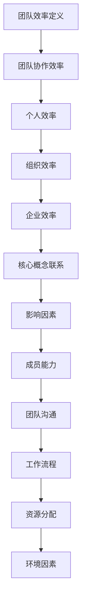
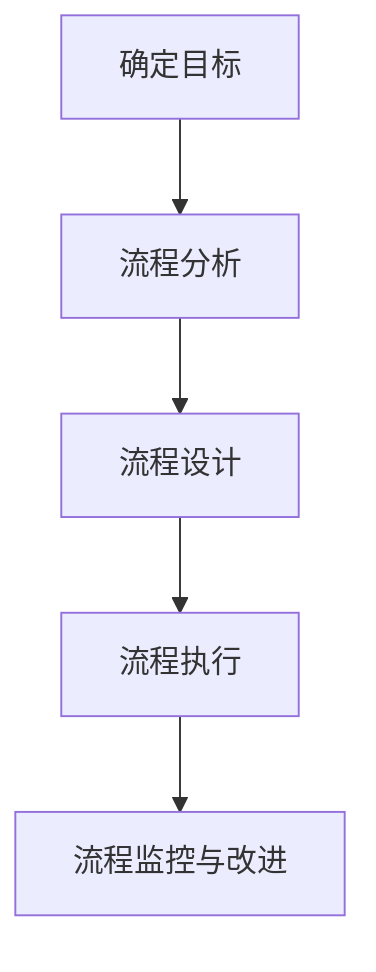
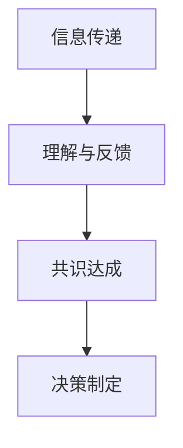

                 

### 文章标题：团队效率：优化工作流程的创新方法

#### 关键词：团队效率，工作流程优化，项目管理，数据分析，沟通协作

> 摘要：本文旨在探讨团队效率的提升方法，重点关注工作流程的优化。通过分析核心概念、介绍工作流程优化方法、沟通与协作技术，本文提出了一套系统化的团队效率优化方案。此外，文章还将介绍项目管理算法、数据分析与优化方法，并通过实际项目案例展示如何将理论应用于实践。

### 引言

在现代企业中，团队效率是决定企业竞争力的关键因素。随着全球化进程的加速和市场竞争的加剧，企业对团队效率的要求越来越高。团队效率不仅关系到项目的成功与否，更影响到企业的整体运营和长期发展。然而，提升团队效率并非易事，需要从多个方面进行系统化的优化。

本文将从以下几个方面展开讨论：

1. 核心概念与联系
2. 工作流程优化
3. 沟通与协作
4. 项目管理算法
5. 数据分析与优化
6. 项目实战

通过以上六个方面的探讨，本文旨在为读者提供一套全面的团队效率优化方案，帮助企业在激烈的市场竞争中脱颖而出。

### 第一部分：核心概念与联系

#### 第1章：团队效率概述

**1.1 团队效率的定义与重要性**

团队效率是指在既定资源和时间约束下，团队完成任务的能力。它不仅包括团队成员个人效率的叠加，还涉及团队协作的效果和整体组织的工作流程。团队效率的重要性体现在以下几个方面：

- 提高项目成功率：高效的团队能够更快地完成项目，降低项目失败的风险。
- 增强企业竞争力：高效的团队有助于企业在市场中占据有利地位，提升整体竞争力。
- 提高员工满意度：高效的工作流程能够减少不必要的重复劳动，提高员工的工作满意度和忠诚度。

**1.2 团队效率的影响因素**

团队效率受多种因素影响，以下是一些关键因素：

- **成员能力**：团队成员的专业技能和知识水平直接影响团队效率。
- **团队沟通**：有效的沟通是团队协作的基础，良好的沟通能够减少误解和冲突，提高工作效率。
- **工作流程**：合理的工作流程能够确保任务的高效执行，减少资源的浪费。
- **资源分配**：资源的合理分配能够确保每个成员都能发挥最大的作用，提高团队整体效率。
- **环境因素**：包括企业文化、管理风格、技术支持等，都会对团队效率产生重要影响。

**Mermaid 流程图：**



#### 第2章：工作流程优化

**2.1 工作流程概述**

工作流程是指完成任务的一系列步骤和方法，它决定了任务从开始到完成的整个过程。一个良好的工作流程能够确保任务的有序进行，减少不必要的重复劳动，提高工作效率。

**2.1.1 确定目标**

确定目标是工作流程优化的第一步，它为整个流程提供了明确的指导。目标应当具体、可行，并与团队和组织的战略目标相一致。

**2.1.2 流程分析**

流程分析是对现有工作流程的评估，旨在识别存在的问题和瓶颈。分析流程可以采用流程图、鱼骨图等工具，帮助团队理解任务的执行过程。

**2.1.3 流程设计**

流程设计是在分析结果的基础上，对现有流程进行改进和优化。设计流程应考虑以下几个方面：

- 简化流程：去除不必要的步骤，减少重复劳动。
- 流程标准化：制定标准操作流程（SOP），确保团队成员按统一的方法工作。
- 流程自动化：利用技术手段（如自动化工具）减少手动操作，提高效率。

**2.1.4 流程执行**

流程执行是工作流程的核心环节，它涉及任务的实际执行和监控。在执行过程中，应确保团队成员按照流程进行工作，并及时反馈问题和改进建议。

**2.1.5 流程监控与改进**

流程监控与改进是确保工作流程持续优化的重要措施。通过监控流程的执行情况，团队可以及时发现和解决问题，不断优化工作流程。

**Mermaid 流程图：**



#### 第3章：沟通与协作

**3.1 沟通的重要性**

沟通是团队协作的基础，有效的沟通能够确保团队成员之间的信息传递和理解，减少误解和冲突。沟通的重要性体现在以下几个方面：

- **信息传递**：沟通是信息在团队成员之间传递的重要渠道。
- **理解与反馈**：通过沟通，团队成员能够理解任务要求和目标，并提供反馈。
- **共识达成**：有效的沟通有助于团队成员达成共识，共同推进项目。
- **决策制定**：沟通在决策过程中起到关键作用，有助于形成科学、合理的决策。

**3.1.1 沟通障碍**

沟通障碍是影响团队效率的重要因素，以下是一些常见的沟通障碍：

- **语言障碍**：团队成员可能来自不同的文化背景，语言上的差异可能导致沟通障碍。
- **信息过载**：过多的信息可能导致团队成员无法有效处理，影响工作效率。
- **误解与偏见**：沟通中的误解和偏见可能导致团队成员之间的冲突。
- **缺乏反馈**：缺乏及时的反馈可能导致沟通的效果大打折扣。

**Mermaid 流程图：**



**3.1.2 协作工具与技术**

为了提高沟通和协作效率，团队可以采用以下工具和技术：

- **面对面协作**：面对面的交流能够快速解决沟通中的问题，增强团队的凝聚力。
- **远程协作工具**：如Slack、Microsoft Teams等，提供实时沟通和协作平台。
- **敏捷开发方法**：如Scrum、Kanban等，通过迭代和增量开发，提高团队协作效率。

### 第二部分：核心算法原理讲解

#### 第4章：项目管理算法

**4.1 项目管理的基本概念**

项目管理是指通过规划、执行、监控和控制项目过程，以实现项目目标的一系列管理活动。项目管理的基本概念包括：

- **项目目标**：项目的最终目标，包括质量、时间、成本等。
- **项目计划**：项目执行的详细步骤和时间表。
- **项目监控**：对项目执行过程的监控和评估，确保项目按计划进行。

**伪代码：**

```python
def projectManagement(target, plan, monitoring):
    setProjectGoal(target)
    createProjectPlan(plan)
    executeProjectPlan()
    monitorProjectProgress(monitoring)
```

**4.1.1 项目管理算法**

- **Critical Path Method (CPM)**：通过计算项目的关键路径，确定项目最长的执行时间，并识别关键任务。
- **Program Evaluation and Review Technique (PERT)**：通过概率分析，评估项目任务完成时间的不确定性，并制定相应的风险应对策略。
- **Agile Project Management**：通过迭代和增量开发，快速响应变化，提高项目交付质量。

#### 第5章：数据分析与优化

**5.1 数据分析概述**

数据分析是指通过对数据进行分析和挖掘，提取有价值的信息和知识，以支持决策制定。数据分析的基本步骤包括：

- **数据收集**：收集相关数据，包括内部数据和外部数据。
- **数据预处理**：清洗和整理数据，使其适合进行分析。
- **数据分析**：利用统计方法和算法，对数据进行深入分析和挖掘。

**伪代码：**

```python
def dataAnalysis(data):
    collectData(data)
    preprocessData(data)
    analyzeData(data)
```

**5.1.1 数据优化方法**

- **统计学方法**：通过统计学方法，对数据进行描述、推断和预测。
- **机器学习方法**：利用机器学习算法，对数据进行自动分析和模式识别。
- **数据挖掘**：通过数据挖掘技术，发现数据中的隐藏模式和关联关系。

### 第三部分：数学模型和数学公式

#### 第6章：工作负荷分配模型

**6.1 工作负荷分配问题**

工作负荷分配问题是指如何将任务合理地分配给团队成员，以实现资源的最优利用和项目目标的最大化。工作负荷分配问题可以描述为以下数学模型：

$$
\begin{aligned}
\text{Minimize} \quad & C(x) \\
\text{Subject to} \quad & A_{ij}x_j \leq b_i, \quad i=1,2,...,m \\
& x_j \geq 0, \quad j=1,2,...,n
\end{aligned}
$$`

其中，$C(x)$ 是目标函数，表示资源消耗；$A_{ij}$ 是任务 $j$ 对资源 $i$ 的需求；$b_i$ 是资源 $i$ 的可用量；$x_j$ 是任务 $j$ 的分配量。

**6.1.2 模型求解方法**

- **线性规划**：适用于目标函数和约束条件都是线性的情况。
- **非线性规划**：适用于目标函数和约束条件包含非线性情况。
- **整数规划**：适用于目标函数和约束条件中包含整数变量的情况。

### 第四部分：项目实战

#### 第7章：团队效率优化实战

**7.1 项目背景**

本项目旨在优化一个软件开发团队的效率，该团队负责开发和维护一款企业级应用。项目目标是通过工作流程优化、沟通协作提升，实现项目交付周期缩短、质量提升。

**7.1.1 团队现状分析**

在项目启动阶段，团队面临以下问题：

- 工作流程不清晰，任务执行过程中经常出现重复劳动和遗漏。
- 沟通不畅，信息传递不及时，导致项目进度延迟和决策失误。
- 资源分配不合理，部分成员工作负荷过重，而另一些成员则相对闲散。

**7.1.2 优化方案设计**

针对以上问题，团队制定了以下优化方案：

- **工作流程优化**：通过工作流程图和标准操作流程（SOP），明确任务执行步骤，减少重复劳动和遗漏。
- **沟通协作提升**：采用敏捷开发方法，通过每日站会、迭代回顾等机制，增强团队成员之间的沟通和协作。
- **资源分配优化**：通过数据分析，合理分配任务和资源，确保每个成员都能充分利用。

**7.1.3 项目执行与监控**

在项目执行过程中，团队严格按照优化方案进行操作，并进行了以下监控：

- **工作流程监控**：定期检查工作流程执行情况，发现问题及时调整。
- **沟通协作监控**：通过工具记录沟通日志，分析沟通效率，并提出改进建议。
- **资源分配监控**：定期分析资源使用情况，确保资源分配合理。

**7.1.4 项目成果评估**

在项目结束后，团队对优化效果进行了评估：

- **项目交付周期**：从原来的60天缩短至45天，提高了25%的效率。
- **项目质量**：通过代码审查和测试，发现和修复了更多的缺陷，提高了产品的稳定性。
- **团队满意度**：团队成员对工作流程优化和沟通协作提升表示满意，工作效率显著提高。

**7.1.5 项目小结**

本项目通过工作流程优化、沟通协作提升，实现了项目交付周期缩短、质量提升的目标。经验表明，团队效率优化需要从多个方面进行系统化推进，包括工作流程、沟通协作、资源分配等。在实际操作中，团队需要不断调整和优化方案，以适应不断变化的需求和环境。

### 最佳实践 tips

- **定期回顾和优化工作流程**：工作流程不是一成不变的，团队应定期回顾和优化工作流程，以适应不断变化的需求。
- **提高沟通效率**：采用高效的沟通工具和技巧，如即时通讯工具、邮件提醒等，确保信息传递及时、准确。
- **合理分配资源**：根据项目需求和团队实际情况，合理分配资源，避免资源浪费和超负荷工作。

### 小结

本文从团队效率的核心概念、工作流程优化、沟通与协作、项目管理算法、数据分析和优化方法等多个方面，提出了一套系统化的团队效率优化方案。通过实际项目案例的展示，本文验证了这些优化方法的有效性。在未来的工作中，团队应继续探索和优化，不断提高团队效率，为企业的发展贡献力量。

### 注意事项

- **重视团队建设**：团队效率的提升不仅取决于个人能力和工作流程，更取决于团队的整体协作和氛围。
- **持续改进**：团队效率优化是一个持续的过程，需要团队不断调整和优化，以适应变化的需求和环境。

### 拓展阅读

- 《敏捷开发实践指南》
- 《项目管理知识体系指南（PMBOK指南）》
- 《数据科学实战》

### 作者信息

作者：AI天才研究院/AI Genius Institute & 禅与计算机程序设计艺术 /Zen And The Art of Computer Programming

