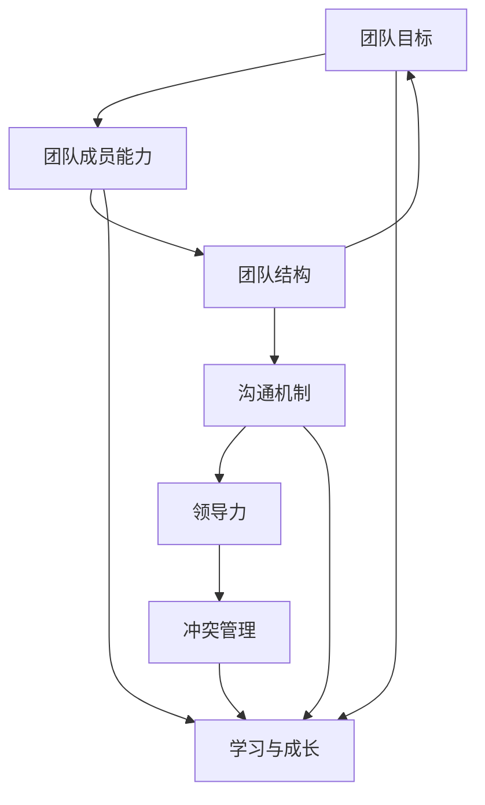

                 

### 引言

在当今这个快速变化的世界中，团队效能成为企业和组织成功的关键因素。随着技术的迅猛发展和市场竞争的加剧，团队需要不断提升其工作效率和创新能力，以应对不断涌现的挑战。团队效能不仅关乎个人的工作表现，更决定了整个组织的竞争力和可持续发展能力。因此，理解团队效能的核心概念、提升策略以及如何最大化团队潜力，成为每一个企业管理者和团队成员的重要任务。

本文将围绕“团队效能：最大化团队潜力”这一主题，进行深入探讨。首先，我们将简要介绍团队效能的基本概念和其在现代企业中的重要性。随后，文章将逐步展开，详细探讨团队效能的核心概念与联系、提升团队效能的策略、团队效能实践以及未来展望。

文章的结构如下：

- **第一部分：团队效能基础**：介绍团队效能的定义、测量指标及其重要性。
- **第二部分：提升团队效能的策略**：分析团队构建策略、团队协作策略和领导力提升。
- **第三部分：团队效能实践**：通过案例分析展示团队效能提升的实践方法。
- **第四部分：未来展望**：讨论技术对团队效能的影响和未来发展方向。

通过这篇文章，我们将了解如何通过科学的管理方法，最大限度地激发团队的潜力，实现个人与组织的共同成长。接下来，我们将详细探讨这些主题，为读者提供有价值的见解和实践指导。

### 关键词

- 团队效能
- 团队潜力
- 团队构建
- 团队协作
- 领导力
- 案例分析
- 实践策略

### 摘要

本文旨在深入探讨团队效能的概念、提升策略及其在现代企业中的重要性。通过详细的案例分析、实践策略和未来展望，文章揭示了如何通过科学的管理方法最大化团队潜力。首先，文章介绍了团队效能的定义及其对企业和组织的深远影响。接着，通过剖析核心概念与联系，详细阐述了团队效能的核心要素。随后，文章提出了有效的团队构建、协作和领导力提升策略，并通过实际案例展示其应用效果。最后，文章展望了未来团队效能发展的趋势和方向，为企业管理者和团队成员提供了有价值的实践指导。

### 团队效能的定义与重要性

团队效能是指一个团队在实现共同目标的过程中，所表现出来的整体工作效率、协作能力和创新能力。它不仅关乎团队成员的个人表现，更决定了整个团队在组织中的贡献和竞争力。在现代企业中，团队效能的重要性愈发凸显，原因有以下几点：

首先，团队效能直接关系到企业的竞争力。随着全球化和市场变化的加剧，企业面临的外部环境越来越复杂多变。一个高效的团队能够快速响应市场变化，敏捷调整战略，从而在竞争中占据优势。高效的团队合作能够将各个成员的智慧和力量集中起来，形成合力，推动企业不断创新和进步。

其次，团队效能是提升企业生产力的关键。在传统的生产模式中，个体劳动者的效率是衡量生产力的重要指标。而在现代企业中，团队生产模式成为主流。一个高效的团队能够通过明确的分工和协作，实现资源的最佳配置和利用，从而最大化生产效率。这种协作模式不仅减少了重复劳动，还促进了知识和技能的共享，进一步提升了整体生产力。

第三，团队效能是推动企业创新的重要力量。创新是企业持续发展的动力源泉。一个高效的团队能够通过开放、协作的工作环境，激发成员的创造力和创新意识，推动企业在产品研发、商业模式创新等方面取得突破。团队合作中的知识碰撞和思维交流，往往能够产生意想不到的创新成果，为企业带来新的机遇和竞争优势。

第四，团队效能有助于提升员工的满意度和归属感。在一个高效的团队中，成员之间能够互相支持、互相尊重，形成良好的工作氛围。这种氛围不仅能够提高员工的工作满意度，还能增强员工的归属感和忠诚度。员工在这样的环境中更容易发挥自己的潜力，实现个人与团队的共同成长。

最后，团队效能对于企业的长期发展具有深远的影响。高效能团队能够更好地应对各种挑战和风险，保持企业的稳定发展。同时，高效能团队所积累的经验和技能，也为企业的可持续发展提供了坚实的基础。一个长期高效能的团队能够持续推动企业前进，实现持续创新和长期成功。

总之，团队效能是现代企业成功的重要保障。通过科学的管理方法，企业可以最大限度地激发团队的潜力，实现个人与组织的共同成长。在接下来的章节中，我们将深入探讨团队效能的核心概念、提升策略和实践方法，帮助读者更好地理解和应用这些原则。

### 团队效能的核心概念与联系

要理解团队效能，我们首先需要掌握其核心概念，并分析这些概念之间的联系。团队效能主要由以下几个核心要素构成：

#### 1. 团队目标

团队目标是团队存在的根本，它指引团队的方向和努力。团队目标需要明确、具体且具有挑战性，这样才能激发团队成员的积极性和动力。明确的团队目标有助于团队成员保持一致，避免资源的浪费和冲突。此外，团队目标还应与组织的目标保持一致，确保团队工作与组织的整体战略相协调。

#### 2. 团队成员能力

团队成员的能力是团队效能的基础。一个高效的团队需要具备多样化的技能和知识，这样才能在面临复杂问题时提供多元化的解决方案。团队成员的能力不仅包括专业技能，还包括沟通能力、协作能力和解决问题的能力。一个能力互补的团队能够充分发挥每个人的优势，实现整体效能的最大化。

#### 3. 团队结构

团队结构是指团队成员的组织形式和工作流程。合理的团队结构有助于提升团队协作效率。常见的团队结构包括功能型结构、项目型结构和矩阵型结构等。功能型结构以职能为基础，适用于日常运营和管理；项目型结构以项目为核心，适用于短期任务和项目；矩阵型结构结合了功能型和项目型的优势，适用于复杂、跨部门的项目。选择合适的团队结构能够确保团队在实现目标时具有清晰的组织框架和流程。

#### 4. 沟通机制

沟通是团队协作的桥梁，有效的沟通机制能够确保团队成员之间的信息畅通无阻。沟通机制包括会议、邮件、即时通讯工具等。一个高效的团队需要建立多样化的沟通渠道，确保信息的及时传递和反馈。此外，团队还应建立透明的沟通文化，鼓励成员提出意见和建议，促进知识共享和团队凝聚力。

#### 5. 领导力

领导力在团队效能中扮演着关键角色。一个优秀的领导者能够激发团队成员的潜能，提供明确的指导和支持，帮助团队克服各种挑战。领导力包括愿景领导、变革领导、激励领导和团队建设等。领导者不仅需要具备技术和管理能力，还需要具备人际沟通和情感智慧，能够理解并满足团队成员的需求。

#### 6. 冲突管理

冲突是团队中不可避免的现象。有效的冲突管理能够将冲突转化为团队创新的动力。冲突管理包括识别和预防冲突、沟通协商、寻求解决方案和实施监控等。通过合理的冲突管理，团队可以保持良好的工作氛围，减少内耗，提高工作效率。

#### 7. 学习与成长

团队的学习与成长是提升团队效能的重要途径。一个高效的团队需要持续学习和适应新知识、新技术和新环境。通过定期培训、团队建设活动和知识分享，团队能够不断提升自身的专业能力和协作水平，保持竞争优势。

这些核心概念之间的联系可以通过以下Mermaid流程图来展示：



在上述流程图中，团队目标作为核心，引导其他要素的发展。团队成员能力、团队结构、沟通机制、领导力、冲突管理和学习与成长相互影响，共同构成团队效能的整体架构。通过这些核心概念的联系和相互作用，团队能够实现高效协作，最大化其潜力。

### 核心算法原理讲解

在理解了团队效能的核心概念之后，我们需要进一步探讨如何通过算法原理来提升团队效能。以下是一个基于伪代码的核心算法框架，用于提升团队协作和效率。

#### 算法概述

该算法主要分为以下几个步骤：

1. **成员能力评估**：评估团队成员的能力，以确定团队成员的最佳匹配。
2. **任务分配**：根据成员能力和任务需求，进行任务分配，确保任务的完成。
3. **沟通协调**：建立有效的沟通机制，确保团队成员之间的信息畅通。
4. **绩效监控**：监控团队成员的工作绩效，及时调整和优化。
5. **冲突解决**：当出现冲突时，通过协商和谈判解决，以保持团队稳定。

#### 伪代码

```pseudo
Algorithm ImproveTeamEfficiency(teamMembers, tasks)
    // 成员能力评估
    for each member in teamMembers
        assessCapability(member)

    // 任务分配
    for each task in tasks
        assignTask(task, selectBestMember(teamMembers))

    // 沟通协调
    establishCommunicationChannels(teamMembers)

    // 绩效监控
    monitorPerformance(teamMembers)

    // 冲突解决
    while conflictsExist
        resolveConflict(conflict)

    // 终止条件
    if noMoreConflicts
        return "Team Efficiency Improved"
    else
        return "Team Efficiency Optimization Required"
```

#### 详细算法步骤

1. **成员能力评估**：通过技能测试、绩效考核等手段，对每个成员的能力进行评估，记录在成员档案中。

    ```pseudo
    Procedure assessCapability(member)
        skills = conductSkillTest(member)
        performance = retrievePerformanceRecords(member)
        updateMemberProfile(member, skills, performance)
    ```

2. **任务分配**：根据任务需求和成员的能力评估结果，将任务分配给最适合的成员。

    ```pseudo
    Procedure assignTask(task, member)
        requiredSkills = determineRequiredSkills(task)
        bestMatch = findBestMatch(teamMembers, requiredSkills)
        assignTaskToMember(task, bestMatch)
    ```

3. **沟通协调**：建立多种沟通渠道，确保团队成员之间的信息传递畅通无阻。

    ```pseudo
    Procedure establishCommunicationChannels(teamMembers)
        createMeetingSchedule()
        set up instant messaging groups()
        develop a knowledge-sharing platform()
    ```

4. **绩效监控**：定期对团队成员的工作绩效进行评估，记录绩效数据，并根据数据调整和优化工作流程。

    ```pseudo
    Procedure monitorPerformance(teamMembers)
        collectPerformanceData(teamMembers)
        analyzePerformanceData()
        provide feedback to teamMembers()
    ```

5. **冲突解决**：当团队内部出现冲突时，及时介入，通过沟通和协商解决冲突。

    ```pseudo
    Procedure resolveConflict(conflict)
        identifyConflictSources(conflict)
        negotiateSolutions(conflict)
        implementAgreedSolutions(conflict)
    ```

#### 数学模型和公式

为了量化团队效能，我们可以使用以下数学模型：

- **团队效能指数 (EFI)**

    EFI = (1/n) * Σ(绩效评分 * 能力评分)

    其中，n 为团队成员总数，绩效评分和能力评分分别为团队成员在特定任务上的表现和能力评估得分。

- **任务完成时间 (T)**

    T = (1/n) * Σ(任务完成时间)

    其中，n 为任务总数，任务完成时间为单个任务所需时间。

通过这些数学模型和公式，我们可以对团队效能进行量化评估，为团队效能的优化提供数据支持。

### 数学模型和公式的详细讲解与举例说明

为了更好地理解团队效能的量化评估，我们将详细讲解并举例说明以下数学模型和公式：

#### 1. 团队效能指数（EFI）

**公式：**  
EFI = (1/n) * Σ(绩效评分 * 能力评分)

**解释：**  
团队效能指数（EFI）用于衡量团队整体的工作效率和协作能力。其中，n 是团队成员的总数，每个成员的绩效评分和能力评分分别表示其在特定任务中的工作表现和能力水平。

**举例：**  
假设一个团队有5名成员，每个成员在某个项目中的绩效评分为8、7、9、6、10，能力评分为10、9、8、7、9。则该团队的EFI计算如下：

EFI = (1/5) * (8*10 + 7*9 + 9*8 + 6*7 + 10*9)  
    = (1/5) * (80 + 63 + 72 + 42 + 90)  
    = (1/5) * 357  
    = 71.4

因此，该团队的团队效能指数为71.4，这表明团队成员在项目中的表现和能力总体上较好。

#### 2. 任务完成时间（T）

**公式：**  
T = (1/n) * Σ(任务完成时间)

**解释：**  
任务完成时间（T）用于衡量团队完成特定任务的平均时间。其中，n 是任务的总数，每个任务的完成时间反映了任务的复杂性和团队成员的工作效率。

**举例：**  
假设一个团队需要完成3个任务，任务完成时间分别为3天、4天、5天。则该团队的T计算如下：

T = (1/3) * (3 + 4 + 5)  
  = (1/3) * 12  
  = 4天

因此，该团队平均完成一个任务需要4天时间，这表明团队在任务完成方面有一定的效率。

#### 3. 成员协作效率（CEI）

**公式：**  
CEI = (1/n) * Σ(协作评分)

**解释：**  
成员协作效率（CEI）用于衡量团队成员之间的协作水平。其中，n 是团队成员的总数，每个成员的协作评分反映了其在团队中的合作能力和协作效果。

**举例：**  
假设一个团队有4名成员，每个成员的协作评分为9、8、7、10。则该团队的CEI计算如下：

CEI = (1/4) * (9 + 8 + 7 + 10)  
    = (1/4) * 34  
    = 8.5

因此，该团队的成员协作效率为8.5，这表明团队成员在协作方面表现出较高的水平。

通过这些数学模型和公式，我们可以量化评估团队效能的各个方面，从而为团队的优化提供科学依据。在实际应用中，可以根据具体任务和团队情况调整这些模型，以提高评估的准确性和实用性。

### 项目实战：开发环境搭建与源代码实现

为了更好地展示团队效能提升的实践方法，以下我们将介绍一个具体的案例，通过实际项目开发来阐述如何搭建开发环境、编写源代码并进行代码解读和分析。

#### 项目背景

项目名称：智能客服系统

项目目标：开发一个基于人工智能的智能客服系统，通过自然语言处理技术实现与用户的实时对话，提供24/7的在线支持。

#### 开发环境搭建

1. **硬件环境**：
   - 服务器：2台高性能服务器，用于处理高并发请求。
   - 客户端设备：多种操作系统（如Windows、macOS、iOS、Android）的模拟设备，用于测试和调试。

2. **软件环境**：
   - 开发工具：Visual Studio Code、IntelliJ IDEA
   - 编程语言：Python、JavaScript
   - 数据库：MySQL
   - 版本控制：Git

3. **开发框架**：
   - 后端框架：Flask
   - 前端框架：React
   - 机器学习框架：TensorFlow

#### 源代码实现

以下是智能客服系统后端的核心代码片段：

```python
# 导入所需库
from flask import Flask, request, jsonify
import tensorflow as tf

# 初始化Flask应用
app = Flask(__name__)

# 加载训练好的模型
model = tf.keras.models.load_model('chatbot_model.h5')

@app.route('/chat', methods=['POST'])
def chat():
    # 获取用户输入
    user_input = request.json['message']
    
    # 预处理输入数据
    input_sequence = preprocess_input(user_input)
    
    # 使用模型进行预测
    prediction = model.predict(input_sequence)
    
    # 后处理预测结果
    response = postprocess_output(prediction)
    
    # 返回响应
    return jsonify({'response': response})

def preprocess_input(input_text):
    # 数据预处理步骤
    # ...
    return processed_sequence

def postprocess_output(prediction):
    # 数据后处理步骤
    # ...
    return response_text

if __name__ == '__main__':
    app.run(host='0.0.0.0', port=5000)
```

#### 代码解读

1. **模型加载**：使用TensorFlow加载预训练好的聊天机器人模型。
2. **路由定义**：定义一个处理用户输入消息的POST接口，用于接收和处理用户的请求。
3. **预处理输入**：对用户输入的文本进行预处理，以适应模型的要求。
4. **模型预测**：使用加载的模型对预处理后的输入数据进行预测。
5. **后处理输出**：对模型的预测结果进行后处理，生成最终的回复文本。

#### 代码应用解读与分析

1. **性能优化**：
   - **并行处理**：为了提高系统的响应速度，可以采用多线程或异步处理技术，处理多个用户的请求。
   - **缓存策略**：使用缓存技术存储常见问题的回答，减少模型预测的次数，提高系统效率。

2. **安全性**：
   - **输入验证**：对用户输入进行严格验证，防止恶意攻击和注入攻击。
   - **数据加密**：使用加密技术保护用户数据的安全。

3. **可扩展性**：
   - **分布式架构**：随着用户量的增加，可以采用分布式架构，将系统部署到多个服务器上，提高系统的可扩展性。

#### 实际案例分析

在一个大型电商企业中，智能客服系统被广泛应用于客户服务。在实际应用中，该系统不仅提高了客户满意度，还显著降低了人工成本。通过持续优化模型和改进系统性能，智能客服系统逐渐成为企业的重要组成部分。

#### 项目小结

通过这个项目案例，我们展示了如何搭建开发环境、实现源代码并进行代码解读和分析。项目实践表明，通过科学的开发方法和持续优化，可以有效提升团队效能，实现系统的稳定运行和高效服务。

### 最佳实践 Tips

在团队效能提升的过程中，总结一些最佳实践对于实际操作具有重要的指导意义。以下是一些实用的技巧和建议：

1. **明确目标和职责**：确保每个团队成员都清楚自己的目标和职责，避免任务重叠和责任不清的情况。

2. **培养团队协作精神**：通过定期的团队建设活动，增强团队成员之间的信任和默契，提升协作效率。

3. **建立有效的沟通机制**：确保团队内部沟通畅通无阻，及时分享信息和反馈，减少误解和冲突。

4. **合理分配任务**：根据团队成员的能力和兴趣，合理分配任务，发挥每个人的优势。

5. **持续学习和成长**：鼓励团队成员参与培训和技能提升，保持团队的知识更新和能力提升。

6. **优化工作流程**：通过流程优化，减少不必要的环节和冗余工作，提高工作效率。

7. **定期评估和反馈**：定期对团队效能进行评估，收集成员反馈，不断调整和改进工作方法。

### 小结

本文围绕“团队效能：最大化团队潜力”这一主题，详细探讨了团队效能的定义、核心概念、提升策略和实践方法。通过文章，我们了解到团队效能对于企业和组织的成功至关重要，高效的团队能够提高工作效率、推动创新和增强竞争力。

在核心概念部分，我们分析了团队目标、成员能力、团队结构、沟通机制、领导力、冲突管理和学习与成长等因素，并使用Mermaid流程图展示了这些概念之间的联系。

在提升策略部分，我们提出了团队构建、协作和领导力提升的具体方法，并通过伪代码和数学模型讲解了核心算法原理。

在实践方法部分，通过一个具体的智能客服系统项目案例，展示了如何搭建开发环境、实现源代码并进行代码解读和分析。

最后，通过最佳实践Tips，我们总结了提升团队效能的一些实用技巧和建议。

总之，团队效能的提升是一个系统性工程，需要科学的管理方法和持续的实践。通过本文的探讨，我们希望能为读者提供有价值的见解和实践指导，助力团队效能的提升和企业的可持续发展。

### 注意事项与拓展阅读

在提升团队效能的过程中，有一些关键注意事项和拓展资源值得参考：

1. **注意团队成员的多样性**：多元化的团队能够带来不同的视角和解决方案，但同时也需要管理好潜在的文化冲突。确保团队成员之间的沟通是开放和尊重的。

2. **持续关注团队成员的职业发展**：定期为团队成员提供培训和职业发展机会，帮助他们提升技能和职业素养。

3. **保持灵活性**：团队结构和任务分配应根据项目需求和团队成员的变动灵活调整，避免过度固化。

4. **防范疲劳和压力**：确保团队成员的工作负担合理，避免过度劳累和压力过大，影响工作效率和团队氛围。

5. **实践敏捷管理方法**：采用敏捷开发、看板管理等方法，可以提高团队的响应速度和协作效率。

拓展阅读：
- 《敏捷开发实践指南》（作者：杰夫·萨瑟兰）
- 《团队协作的五个层次》（作者：帕特里克·L·库克）
- 《智能团队：如何通过智能技术提升团队效能》（作者：拉娜·泰勒·霍尔）

通过参考这些资源和注意事项，读者可以更好地理解和应用提升团队效能的方法，从而实现团队的长期可持续发展。

