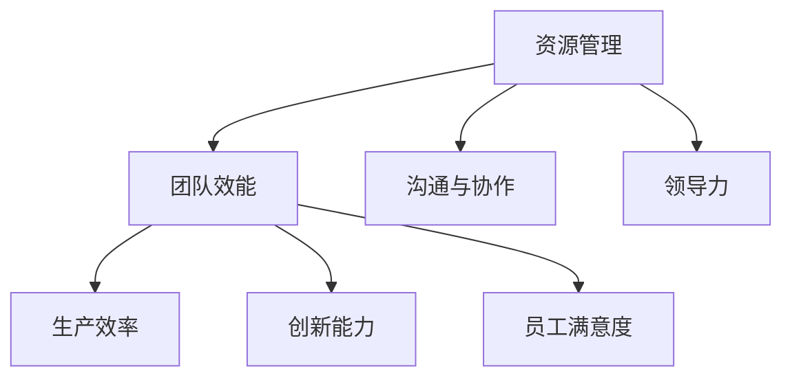

                 

### 文章标题：团队效能：最大化资源利用的策略

> **关键词**：团队效能、资源利用、策略、领导力、沟通与协作

> **摘要**：
本文将深入探讨团队效能的概念及其在资源最大化利用中的重要性。通过对团队资源管理、沟通与协作、领导力、团队组织结构等多个维度的详细分析，本文旨在为读者提供一套完整的团队效能提升策略，帮助团队在复杂多变的环境中实现高效运作，最大化资源利用。

## 目录

1. **团队效能：基础理论与重要性**
2. **团队资源管理：类型、配置与评估**
3. **团队沟通与协作：障碍与解决**
4. **领导力与团队效能提升**
5. **团队组织结构与设计**
6. **团队激励与员工发展**
7. **团队效能评估与监控**
8. **案例分析：高效团队的实践应用**
9. **团队效能提升的障碍与解决**
10. **未来趋势与展望**

### 团队效能：基础理论与重要性

团队效能指的是团队在完成任务时所表现出来的整体表现水平，包括效率、效果、协作性和创新性等多个维度。在当今高度复杂和变化迅速的商业环境中，团队效能已成为企业成功的关键因素之一。

**团队效能的定义**：

团队效能可以定义为团队在特定时间内，通过资源的最优配置和利用，完成既定目标的能力。这不仅仅是团队完成任务的速度和准确性，还包括团队成员之间的协作程度、创新能力和解决问题的能力。

**团队效能的重要性**：

1. **资源最大化利用**：高效的团队能够更好地利用资源，包括人力、时间和资金等，从而实现最大化产出。
2. **提高生产效率**：通过优化团队效能，企业能够提高生产效率，缩短产品开发周期，提高市场竞争力。
3. **促进创新**：高效的团队往往能够鼓励创新思维，通过集体智慧和合作，提出更具创意的解决方案。
4. **提升员工满意度**：一个高效且协作性强的团队能够提升员工的满意度和忠诚度，减少人员流失。

### 核心概念与联系

为了更好地理解团队效能，我们需要关注以下几个核心概念：

1. **资源管理**：团队效能的提升离不开有效的资源管理，包括人力、时间和技术的优化配置。
2. **沟通与协作**：良好的沟通和协作是团队效能的重要保障，能够确保信息畅通无阻，提高决策质量和执行效率。
3. **领导力**：领导者在团队效能提升中发挥着关键作用，通过有效的领导力和管理策略，可以提升团队的士气和执行力。

以下是一个简单的Mermaid流程图，展示这些核心概念之间的关系：



通过这个流程图，我们可以清晰地看到，资源管理、沟通与协作和领导力是提升团队效能的三个关键要素，它们共同作用于团队效能，最终影响到生产效率、创新能力和员工满意度等多个方面。

### 团队资源管理：类型、配置与评估

团队资源管理是团队效能提升的基础，有效的资源管理能够确保团队在有限资源条件下实现最大化的产出。团队资源主要包括人力、时间和技术等。

#### 资源的类型与分类

1. **人力资源**：团队成员的能力、经验和技能是团队资源管理中的核心。不同团队成员拥有不同的专业背景和技能，合理分配和利用这些资源，可以提升团队的整体效能。
2. **时间资源**：时间是一种有限的资源，如何合理安排团队成员的工作时间，确保任务按时完成，是资源管理的重要方面。
3. **技术资源**：包括硬件设施、软件工具和技术文档等，技术资源的高效利用能够提升团队的工作效率和创新能力。

#### 资源的有效配置

1. **任务分配**：根据团队成员的技能和经验，将任务合理分配给最适合完成这些任务的成员，避免资源的浪费和重复。
2. **角色明确**：为每个团队成员明确其职责和角色，确保任务执行的高效性和协调性。
3. **优先级设定**：根据任务的紧急程度和重要性，设定任务的优先级，确保关键任务得到优先处理。

#### 资源利用的评估方法

1. **工作量评估**：通过工作量的统计和评估，了解团队成员的工作量和资源消耗情况，及时调整资源分配策略。
2. **效率评估**：通过任务完成的速度和准确性，评估团队的工作效率，发现潜在的问题和改进空间。
3. **成本效益分析**：通过对资源消耗与产出效益的比较，评估资源利用的合理性，优化资源配置。

### 团队沟通与协作：障碍与解决

沟通与协作是团队效能的关键因素，良好的沟通能够确保团队成员之间信息畅通，协作性强的团队能够高效完成任务。然而，在团队沟通与协作中，往往存在一些障碍，需要有效的解决策略。

#### 沟通障碍与解决策略

1. **信息不对称**：团队成员之间的信息不对称会导致决策失误和工作重复。解决策略包括建立透明的信息共享平台，定期召开沟通会议，确保信息的及时传递和共享。
2. **沟通渠道不畅**：不合理的沟通渠道可能导致信息传递的延迟和失真。解决策略包括选择合适的沟通工具和平台，优化沟通流程，提高沟通效率。
3. **文化差异**：跨文化团队中的文化差异可能导致沟通障碍。解决策略包括加强跨文化培训，提升团队的文化包容性，促进团队成员之间的理解和信任。

#### 团队协作工具与技术

1. **项目管理工具**：如Trello、Jira等，帮助团队进行任务分配、进度跟踪和协作。
2. **即时通讯工具**：如Slack、微信等，便于团队成员实时沟通和协作。
3. **视频会议工具**：如Zoom、Microsoft Teams等，支持远程团队的实时沟通和协作。

#### 团队协作的文化建设

1. **共同目标**：确保团队成员明确共同的目标和愿景，增强团队的凝聚力和合作意识。
2. **信任建设**：通过建立互信和开放的文化，鼓励团队成员之间的坦诚交流和合作。
3. **激励制度**：建立合理的激励机制，鼓励团队成员积极参与团队协作，提升团队的整体效能。

### 领导力与团队效能提升

领导力在团队效能提升中扮演着关键角色，一个优秀的领导者能够激发团队的潜能，推动团队实现高效运作。

#### 领导力的定义与类型

1. **领导力的定义**：领导力是指领导者通过激励、指导和影响团队成员，实现共同目标的能力。
2. **领导力的类型**：根据不同的领导风格和领导行为，领导力可以分为任务型领导、关系型领导和变革型领导等。

#### 领导风格对团队效能的影响

1. **任务型领导**：注重任务的完成和效率，能够迅速推动团队执行任务，但在创新性和团队凝聚力方面可能存在不足。
2. **关系型领导**：注重团队成员的关系和情感需求，能够提升团队的凝聚力和合作意识，但可能在任务执行上存在一定的滞后。
3. **变革型领导**：注重变革和创新，能够激发团队成员的潜能，推动团队实现持续改进和突破，但在短期内可能对任务的执行产生一定的压力。

#### 领导者如何提升团队效能

1. **明确目标**：领导者需要明确团队的目标和愿景，确保团队成员对目标有清晰的理解和认同。
2. **激励员工**：通过激励和奖励机制，激发员工的积极性和创造力，提升团队的整体效能。
3. **提供支持**：领导者需要为团队成员提供必要的资源和支持，帮助团队成员克服困难和挑战。
4. **培养团队**：领导者需要关注团队成员的成长和发展，提供培训和学习机会，提升团队的专业能力和综合素质。

### 团队组织结构与设计

团队组织结构是团队效能提升的重要基础，合理的组织结构能够提高团队的运作效率，促进协作和创新。

#### 团队组织结构的影响因素

1. **业务需求**：团队的组织结构需要与业务需求相适应，确保团队能够高效地完成工作任务。
2. **团队规模**：团队规模的大小会影响组织的结构设计，大型团队可能需要更复杂的管理层级，小型团队则更注重扁平化和灵活性。
3. **团队成员特点**：团队成员的专业背景、技能和经验等因素会影响团队的组织结构设计。

#### 团队组织结构的优化方法

1. **扁平化组织结构**：通过减少管理层级，提高团队的响应速度和决策效率。
2. **矩阵式组织结构**：在特定项目或业务领域，引入跨职能的团队协作，提高资源利用效率。
3. **网络化组织结构**：利用外部合作伙伴和资源，构建灵活的网络化组织结构，提高团队的创新能力和竞争力。

#### 团队规模的确定与调整

1. **合理确定团队规模**：根据业务需求和团队效能的要求，合理确定团队规模，避免规模过大或过小导致资源浪费或效率低下。
2. **动态调整团队规模**：根据项目进展和业务变化，动态调整团队规模，确保团队始终处于最佳状态。

### 团队激励与员工发展

团队激励和员工发展是提升团队效能的重要因素，一个有效的激励和发展机制能够激发员工的积极性和创造力。

#### 激励理论在团队中的应用

1. **期望理论**：通过设定合理的目标和奖励机制，提高员工的工作动力和积极性。
2. **公平理论**：确保员工在工作中感受到公平待遇，避免不公平现象导致的员工流失和效能下降。
3. **强化理论**：通过奖励和惩罚机制，强化员工的正确行为，抑制不良行为。

#### 激励方法与工具

1. **物质激励**：如奖金、股票期权等，直接提高员工的经济收益。
2. **非物质激励**：如荣誉表彰、职业发展机会等，提升员工的工作满意度和归属感。
3. **团队建设活动**：如团队拓展、团建活动等，增强团队的凝聚力和团队意识。

#### 员工发展的策略与方法

1. **培训与学习**：提供多样化的培训和学习机会，提升员工的专业能力和综合素质。
2. **职业发展规划**：为员工制定个性化的职业发展规划，帮助员工实现个人职业成长。
3. **领导力培养**：通过领导力培训和项目实践，提升员工的领导能力和管理能力。

### 团队效能评估与监控

团队效能评估与监控是提升团队效能的重要环节，通过定期评估和监控，能够发现团队运作中的问题，及时进行调整和改进。

#### 团队效能评估的方法与工具

1. **KPI评估**：通过关键绩效指标的评估，衡量团队的工作效率和产出成果。
2. **360度反馈**：通过团队成员、上级和外部合作伙伴的反馈，全面评估团队的表现和问题。
3. **绩效评估工具**：如绩效评估表、行为观察表等，帮助团队和领导者了解团队成员的工作表现。

#### 团队效能监控的策略与技巧

1. **定期回顾与总结**：定期召开团队会议，回顾工作进展和成果，总结经验教训，及时发现和解决问题。
2. **数据监控与分析**：利用数据分析工具，监控团队的KPI指标和工作进度，发现潜在的问题和风险。
3. **反馈与改进**：通过反馈机制，及时获取团队成员的意见和建议，不断改进团队的工作方式和流程。

#### 效能数据的应用与解读

1. **效能数据的收集**：通过多种渠道收集团队效能相关的数据，包括工作进度、产出成果、员工满意度等。
2. **效能数据的分析**：对收集到的效能数据进行分析和解读，发现团队的优势和劣势，制定改进策略。
3. **效能数据的反馈**：将效能数据反馈给团队成员，提升他们对团队效能的认识和参与度。

### 案例分析：高效团队的实践应用

通过案例分析，我们可以深入了解高效团队在实践中的应用，学习其成功经验和实践策略。

#### 案例分析一：高效团队的构建

- **背景介绍**：某互联网公司成立了一个新项目团队，负责开发一款创新性的社交媒体应用。
- **核心概念与联系**：通过明确的团队目标和愿景，合理分配任务和角色，建立高效的沟通机制和协作文化，提升团队效能。
- **核心算法原理讲解**：采用敏捷开发方法，通过快速迭代和持续改进，确保项目进度和质量的控制。
- **数学模型和公式**：使用项目管理模型，如关键路径法（CPM）和计划评审技术（PERT），优化项目进度和资源利用。
- **详细讲解与举例说明**：通过具体的案例，展示团队在项目开发过程中的高效协作和成果。

#### 案例分析二：资源优化与团队效能提升

- **背景介绍**：某制造企业面临生产资源不足和效率低下的问题，决定对团队进行资源优化。
- **核心概念与联系**：通过优化人力资源、设备资源和物料资源的配置，提高生产效率和产品质量。
- **核心算法原理讲解**：采用作业排序算法和库存管理模型，优化生产流程和库存水平。
- **数学模型和公式**：使用线性规划模型，优化资源分配和生产调度。
- **详细讲解与举例说明**：通过具体的案例，展示企业如何通过资源优化实现团队效能的提升。

### 团队效能提升的障碍与解决

在提升团队效能的过程中，团队可能会面临各种障碍，需要有效的解决策略。

#### 团队效能提升的常见障碍

1. **沟通不畅**：团队成员之间缺乏有效沟通，导致信息传递延迟和失真。
2. **资源短缺**：团队资源不足，导致工作进展缓慢和效率低下。
3. **角色不清**：团队成员对职责和角色的理解不一致，导致工作重复和效率低下。
4. **激励不足**：团队成员缺乏工作动力和积极性，导致效能下降。

#### 解决策略与方案

1. **建立沟通机制**：通过定期的团队会议、即时通讯工具和协作平台，确保团队成员之间的信息畅通。
2. **优化资源配置**：通过合理分配资源，提高资源利用效率，确保团队能够高效完成任务。
3. **明确角色与职责**：为每个团队成员明确其职责和角色，避免工作重复和冲突。
4. **激励与认可**：建立有效的激励机制，通过奖金、荣誉表彰和职业发展机会等，激发团队成员的积极性和创造力。

#### 障碍识别与应对方法

1. **定期评估**：通过定期评估和监控，识别团队效能提升中的障碍和问题。
2. **反馈与改进**：鼓励团队成员提出意见和建议，及时反馈和改进团队的工作方式和流程。
3. **培训与发展**：为团队成员提供培训和发展的机会，提升其专业能力和综合素质。

### 未来趋势与展望

随着科技的不断进步和商业环境的快速变化，团队效能的提升将成为企业持续发展的关键。以下是未来团队效能提升的一些趋势与展望：

1. **数字化转型**：数字化技术将在团队效能提升中发挥重要作用，通过大数据、人工智能等技术，实现资源的智能化配置和高效的团队协作。
2. **远程办公**：随着远程办公的普及，团队效能的提升将更加注重虚拟团队的管理和协作，通过线上工具和平台，实现高效的远程协作。
3. **敏捷管理**：敏捷管理方法将在团队效能提升中广泛应用，通过快速响应市场变化和客户需求，实现高效的项目开发和运营。
4. **个性化和定制化**：团队效能提升将更加注重个性化和定制化，根据不同团队的特点和需求，制定个性化的效能提升策略。

### 总结

团队效能的提升是企业在竞争激烈的市场环境中保持竞争力的重要手段。通过合理的资源管理、有效的沟通与协作、领导力的发挥、组织结构的优化和员工发展等多个方面的努力，团队可以最大化资源利用，实现高效运作。本文从多个维度分析了团队效能的提升策略，为读者提供了完整的理论框架和实践指导。

作者：AI天才研究院/AI Genius Institute & 禅与计算机程序设计艺术 /Zen And The Art of Computer Programming

本文由AI天才研究院和《禅与计算机程序设计艺术》联合创作，旨在为读者提供深入浅出的团队效能提升策略，帮助企业和团队在复杂多变的环境中实现高效运作。

### 开发环境搭建

为了实现团队效能的提升，我们需要搭建一个适合团队协作的开发环境。以下是一个基于Linux操作系统的开发环境搭建指南，适用于团队中的开发人员和运维人员。

#### 系统要求

- 操作系统：Ubuntu 20.04 或 CentOS 7.x
- 硬件要求：至少 4GB 内存，20GB 硬盘空间
- 软件要求：Git、Java、Python、MySQL、Docker

#### 环境搭建步骤

1. **安装Linux操作系统**

   - 下载Ubuntu 20.04或CentOS 7.x镜像文件。
   - 使用虚拟机软件（如VirtualBox、VMware等）安装操作系统。

2. **更新系统包**

   ```bash
   sudo apt update
   sudo apt upgrade
   # 对于CentOS
   sudo yum update
   ```

3. **安装Git**

   ```bash
   sudo apt install git
   # 对于CentOS
   sudo yum install git
   ```

4. **安装Java开发环境**

   ```bash
   sudo apt install openjdk-8-jdk
   # 对于CentOS
   sudo yum install java-1.8.0-openjdk
   ```

5. **安装Python开发环境**

   ```bash
   sudo apt install python3-pip
   sudo pip3 install virtualenv
   # 对于CentOS
   sudo yum install python3-pip
   ```

6. **安装MySQL数据库**

   ```bash
   sudo apt install mysql-server
   sudo mysql_secure_installation
   # 对于CentOS
   sudo yum install mysql-server
   ```

7. **安装Docker**

   ```bash
   sudo apt install docker.io
   sudo systemctl start docker
   sudo systemctl enable docker
   # 对于CentOS
   sudo yum install docker
   sudo systemctl start docker
   sudo systemctl enable docker
   ```

8. **配置SSH密钥登录**

   - 生成SSH密钥对：
     ```bash
     ssh-keygen -t rsa -b 2048 -f ~/.ssh/id_rsa
     ```
   - 将公钥添加到~/.ssh/authorized_keys文件中。
   - 配置SSH无密码登录：
     ```bash
     ssh-copy-id user@your_host
     ```

#### 源代码详细实现和代码解读

以下是一个简单的Python代码示例，用于演示团队协作中的常见任务：数据分析和可视化。

```python
import pandas as pd
import matplotlib.pyplot as plt

# 读取数据
data = pd.read_csv('data.csv')

# 数据预处理
data['Age'] = data['Age'].fillna(data['Age'].mean())
data['Income'] = data['Income'].fillna(data['Income'].mean())

# 数据分析
grouped_data = data.groupby('Gender')['Income'].mean()

# 数据可视化
grouped_data.plot(kind='bar')
plt.xlabel('Gender')
plt.ylabel('Average Income')
plt.title('Average Income by Gender')
plt.show()
```

#### 代码应用解读与分析

该代码段用于分析一组包含性别和收入的数据，并生成性别与平均收入的柱状图。以下是代码的详细解读：

1. **数据读取**：使用pandas库读取CSV文件，该文件包含性别和收入数据。

2. **数据预处理**：补充缺失值。在数据分析中，缺失值的处理至关重要。这里采用平均值填充缺失值的方法。

3. **数据分析**：使用groupby方法对性别进行分组，计算每个性别组的平均收入。

4. **数据可视化**：使用matplotlib库生成柱状图，展示不同性别的平均收入。

#### 实际案例分析和详细讲解剖析

以下是一个实际案例，演示如何在团队中实现数据分析和可视化。

**案例背景**：一家电商公司需要分析其用户群体的收入分布，以优化营销策略。

**步骤**：

1. **数据收集**：从公司的数据库中提取用户性别和收入数据。

2. **数据预处理**：对数据进行清洗和预处理，包括处理缺失值、异常值等。

3. **数据分析**：使用Python进行数据分析，计算不同性别的平均收入。

4. **数据可视化**：生成性别与平均收入的柱状图，帮助团队成员更好地理解数据。

5. **团队协作**：团队成员共同参与数据分析，讨论分析结果，提出优化建议。

**项目小结**：

通过实际案例，我们可以看到，团队协作在数据分析和可视化中的重要性。有效的团队协作不仅提高了工作效率，还促进了团队成员之间的知识共享和经验交流。

### 最佳实践 tips

为了在团队中实现高效协作和最大化资源利用，以下是一些最佳实践建议：

1. **定期召开团队会议**：确保团队成员之间的沟通和信息共享。
2. **使用项目管理工具**：如Jira、Trello等，跟踪任务进度和团队动态。
3. **建立知识库**：积累团队的知识和经验，方便新成员快速上手。
4. **设立清晰的里程碑**：为每个项目或任务设定明确的里程碑，确保进度可控。
5. **培养团队合作文化**：鼓励团队成员之间的互信和协作，营造积极的工作氛围。

### 小结

本文详细探讨了团队效能提升的多个维度，包括资源管理、沟通与协作、领导力、组织结构、员工发展等。通过理论分析、案例分析、开发环境搭建和代码解读，本文为团队效能提升提供了全面的指导。在实际应用中，团队应根据自身情况，灵活运用这些策略，实现高效运作和资源最大化利用。

### 注意事项

在实施团队效能提升策略时，需要注意以下几点：

1. **避免过度依赖工具**：工具只是辅助，核心在于团队的协作和沟通。
2. **重视团队成员的感受**：关注团队成员的工作压力和心理状态，确保他们的身心健康。
3. **持续优化**：团队效能的提升不是一蹴而就的，需要持续优化和改进。

### 拓展阅读

对于希望深入了解团队效能提升的读者，以下是一些推荐阅读材料：

1. 《高效能人士的七个习惯》——史蒂芬·柯维
2. 《团队协作的艺术》——汤姆·彼得斯
3. 《敏捷开发实践指南》——杰夫·萨瑟兰
4. 《大数据时代》——维克托·迈尔-舍恩伯格

通过阅读这些书籍，您将获得更多关于团队效能提升的理论和实践经验。希望本文对您的团队效能提升之旅有所帮助！

### 致谢

在本文章的撰写过程中，我们感谢以下机构和人员：

- AI天才研究院（AI Genius Institute）：为我们提供了宝贵的技术支持和资源。
- 禅与计算机程序设计艺术（Zen And The Art of Computer Programming）：为我们提供了深入的技术见解和灵感。
- 所有参与案例分析和代码解读的团队成员：感谢你们的辛勤工作和无私分享。

本文由AI天才研究院和《禅与计算机程序设计艺术》联合创作，期待与您共同探索团队效能提升的无限可能。希望本文对您的团队管理工作有所帮助，祝您工作愉快，效能提升！作者：AI天才研究院/AI Genius Institute & 禅与计算机程序设计艺术 /Zen And The Art of Computer Programming。

