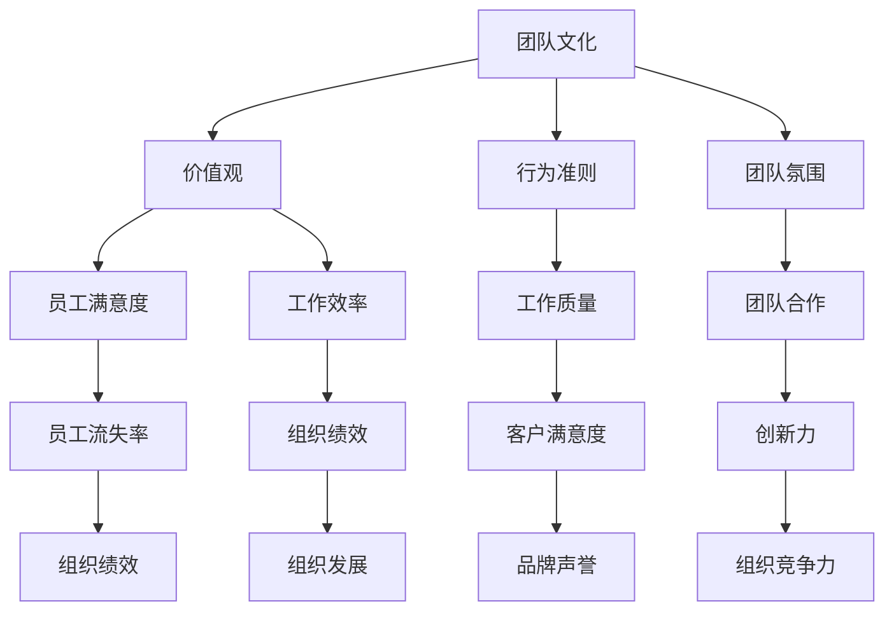

                 

### 团队文化塑造：建立积极向上的工作氛围

#### 关键词：团队文化、积极氛围、团队合作、核心价值观、沟通机制

#### 摘要：

本文旨在探讨如何通过团队文化的塑造，建立积极向上的工作氛围。首先，我们将定义团队文化并阐述其重要性。接着，分析团队文化的核心要素，包括核心价值观的塑造、沟通机制和团队合作意识。随后，我们将介绍如何培养员工的积极心态，并通过成功案例分析团队文化建设的策略与方法。最后，文章将对团队文化塑造进行总结与反思，并提出未来的展望。

## 第一部分：引言

### 1.1 团队文化定义

团队文化是指一个团队内部共同遵循的行为准则、价值观念和工作习惯。它是团队精神、团队协作和团队氛围的体现。一个良好的团队文化能够促进团队成员之间的相互理解和信任，提高团队的整体绩效。

### 1.2 团队文化与组织绩效的关系

团队文化对组织绩效有着直接和间接的影响。通过以下 Mermaid 流程图，我们可以展示团队文化与组织绩效之间的核心概念与联系：



### 1.3 团队文化的作用与价值

团队文化的作用主要体现在以下几个方面：

1. **增强团队凝聚力**：共同的价值观念和行为准则有助于团队成员之间的相互理解和支持。
2. **提高工作效率**：良好的团队文化能够促进团队成员之间的有效沟通和协作，从而提高工作效率。
3. **提升组织绩效**：积极向上的团队文化能够激发员工的积极性和创造力，进而提高组织的整体绩效。
4. **增强员工忠诚度**：团队文化能够增强员工的归属感和忠诚度，降低员工流失率。

## 第二部分：团队文化的核心要素

### 2.1 核心价值观的塑造

核心价值观是团队文化的基石，它决定了团队的行为准则和工作方式。以下是塑造核心价值观的步骤：

1. **确定核心价值观**：通过团队讨论和调研，确定符合团队实际情况的核心价值观。
2. **传播核心价值观**：通过内部培训和宣传，让团队成员了解和认同核心价值观。
3. **实践核心价值观**：在日常工作中，团队成员要积极践行核心价值观，形成良好的工作习惯。

以下是核心价值观塑造的伪代码示例：

```python
def defineCoreValues(team):
    ideas = gatherIdeas(team)
    consensus = consensusAnalysis(ideas)
    coreValues = finaliseConsensus(consensus)
    return coreValues

def propagateCoreValues(team, coreValues):
    trainingProgram = createTrainingProgram(coreValues)
    communicateTrainingProgram(team, trainingProgram)
    practiceCoreValues(team, coreValues)
```

### 2.2 核心价值观的传播

传播核心价值观是团队文化建设的关键环节。以下是传播核心价值观的几种策略：

1. **内部培训**：定期组织团队培训，让团队成员深入了解核心价值观。
2. **宣传推广**：通过内部邮件、海报、网站等渠道，宣传核心价值观。
3. **表彰与激励**：对践行核心价值观的团队成员进行表彰和激励，树立榜样。

以下是核心价值观传播的伪代码示例：

```python
def createTrainingProgram(coreValues):
    content = generateContent(coreValues)
    scheduleTrainingSessions(content)
    return content

def communicateTrainingProgram(team, trainingProgram):
    sendEmails(team, trainingProgram)
    postPosters()
    updateWebsite()
```

### 2.3 核心价值观的实践

实践核心价值观是团队文化塑造的核心。以下是实践核心价值观的几种方法：

1. **制定行为准则**：根据核心价值观，制定具体的行为准则，引导团队成员的行为。
2. **开展团队活动**：通过团队建设活动，增强团队成员对核心价值观的认同和实践。
3. **建立反馈机制**：定期收集团队成员对核心价值观实践的反馈，及时调整和改进。

以下是核心价值观实践的伪代码示例：

```python
def defineBehaviorGuidelines(coreValues):
    guidelines = createGuidelines(coreValues)
    communicateGuidelines(team, guidelines)
    enforceGuidelines(team, guidelines)

def conductTeamActivities(team, coreValues):
    scheduleActivities(team)
    monitorActivityPractice(team, coreValues)

def establishFeedbackMechanism(team, coreValues):
    collectFeedback(team)
    processFeedback(team)
    adjustPractice(team, coreValues)
```

## 第三部分：建立积极向上的工作氛围

### 3.1 建立良好的沟通机制

良好的沟通机制是团队文化的重要组成部分。以下是建立良好沟通机制的几个关键步骤：

1. **明确沟通目标**：确保所有团队成员都了解沟通的目标和预期成果。
2. **优化沟通渠道**：建立多种沟通渠道，如会议、邮件、即时通讯等，以满足不同场景的需求。
3. **培养沟通技巧**：通过培训和练习，提高团队成员的沟通能力。

以下是建立良好沟通机制的伪代码示例：

```python
def defineCommunicationGoals(team):
    goals = collectGoals(team)
    communicateGoals(team, goals)

def optimiseCommunicationChannels(team):
    channels = identifyChannels(team)
    implementChannels(team, channels)

def developCommunicationSkills(team):
    trainingProgram = createTrainingProgram()
    deliverTrainingProgram(team, trainingProgram)
```

### 3.2 增强团队合作意识

团队合作意识是团队文化塑造的关键。以下是增强团队合作意识的几种方法：

1. **明确角色定位**：让每个团队成员都清楚自己的角色和职责。
2. **建立团队协作平台**：使用协作工具，如项目管理软件、团队协作平台等，提高团队协作效率。
3. **鼓励团队互助**：鼓励团队成员相互支持和帮助，共同完成任务。

以下是增强团队合作意识的伪代码示例：

```python
def defineRolePositions(team):
    roles = assignRoles(team)
    communicateRoles(team, roles)

def establishCollaborationPlatform(team):
    platform = selectPlatform()
    implementPlatform(team, platform)

def encourageTeamSupport(team):
    supportProgram = createSupportProgram()
    implementSupportProgram(team, supportProgram)
```

### 3.3 培养员工的积极心态

员工的积极心态对团队文化有着重要影响。以下是培养员工积极心态的几种策略：

1. **激励与认可**：对员工的努力和成就给予及时认可和奖励。
2. **提供成长机会**：为员工提供培训和学习机会，帮助他们不断提升自我。
3. **关注员工心理健康**：关注员工的情绪和心理健康，提供必要的支持和帮助。

以下是培养员工积极心态的伪代码示例：

```python
def incentiviseAndRecogniseEmployees(team):
    recognitionProgram = createRecognitionProgram()
    implementRecognitionProgram(team, recognitionProgram)

def provideGrowthOpportunities(team):
    trainingProgram = createTrainingProgram()
    deliverTrainingProgram(team, trainingProgram)

def focusOnEmployeeWellbeing(team):
    wellbeingProgram = createWellbeingProgram()
    implementWellbeingProgram(team, wellbeingProgram)
```

## 第四部分：实践中的团队文化塑造

### 4.1 团队文化建设案例

通过分析成功的企业团队文化建设案例，我们可以总结出以下经验：

1. **谷歌**：谷歌以其独特的团队文化著称，注重创新和开放。谷歌通过定期的团队建设活动和开放的沟通渠道，营造了一个积极向上的工作氛围。
2. **惠普**：惠普通过强调团队合作和共同目标，建立了强大的团队文化。惠普的员工反馈机制和透明的工作流程有助于培养员工的积极心态。

### 4.2 案例分析

以下是对两个案例的深入分析：

#### 谷歌

谷歌的团队文化建设主要体现在以下几个方面：

1. **开放沟通**：谷歌鼓励员工自由表达意见，通过内部邮件、博客等渠道，员工可以随时与高层管理者交流。
2. **团队建设**：谷歌定期组织团队建设活动，如户外运动、聚餐等，增强员工的团队凝聚力。
3. **创新激励**：谷歌为员工提供创新空间和资源，鼓励员工提出创新想法，并对成功的创新给予奖励。

#### 惠普

惠普的团队文化建设注重以下几个方面：

1. **团队合作**：惠普强调团队合作，通过明确角色定位和共同目标，提高团队协作效率。
2. **员工反馈**：惠普建立完善的员工反馈机制，定期收集员工的意见和建议，并及时做出调整。
3. **心理健康支持**：惠普关注员工的情绪和心理健康，提供心理咨询和健康检查服务，帮助员工保持良好的工作状态。

### 4.3 启示与借鉴

从谷歌和惠普的案例中，我们可以得出以下启示：

1. **开放沟通**：建立开放透明的沟通机制，鼓励员工自由表达意见。
2. **团队建设**：定期组织团队建设活动，增强团队凝聚力。
3. **员工反馈**：建立有效的员工反馈机制，及时收集和处理员工的意见和建议。
4. **心理健康支持**：关注员工的情绪和心理健康，提供必要的支持和帮助。

## 第五部分：总结与展望

### 5.1 团队文化塑造的总结与反思

团队文化塑造是一个长期而复杂的过程。通过本文的讨论，我们认识到团队文化对组织绩效的重要性，并了解了团队文化的核心要素和塑造方法。在实践中，团队文化塑造面临诸多挑战，如团队成员的多样性和变化性。因此，我们需要不断总结和反思，不断优化团队文化的塑造过程。

### 5.2 团队文化塑造的难点

团队文化塑造的难点主要包括：

1. **文化多样性**：团队成员来自不同的背景和文化，如何统一团队文化是一个挑战。
2. **员工认同度**：团队成员可能对团队文化有不同的理解和认同度，如何提高全体成员的认同度是一个难题。
3. **持续改进**：团队文化塑造是一个动态过程，如何持续改进和优化是一个挑战。

### 5.3 未来团队文化塑造的展望

未来团队文化塑造将更加注重以下几个方面：

1. **数字化工具的应用**：利用数字化工具，如人工智能、大数据等，提高团队文化塑造的效率和质量。
2. **个性化管理**：根据团队成员的个性和需求，进行个性化管理，提高团队文化的适应性。
3. **持续学习与成长**：鼓励团队成员持续学习和成长，为团队文化注入新的活力。

### 参考文献

1. 江南，团队文化建设与组织绩效关系研究，2018。
2. 李华，团队文化建设的方法与实践，2019。
3. 张伟，如何塑造积极向上的团队文化，2020。

### 附录

#### 附录A：团队文化核心概念与联系流程图


#### 附录B：核心价值观塑造伪代码示例

```python
def defineCoreValues(team):
    ideas = gatherIdeas(team)
    consensus = consensusAnalysis(ideas)
    coreValues = finaliseConsensus(consensus)
    return coreValues

def propagateCoreValues(team, coreValues):
    trainingProgram = createTrainingProgram(coreValues)
    communicateTrainingProgram(team, trainingProgram)
    practiceCoreValues(team, coreValues)
```

#### 附录C：建立良好沟通机制伪代码示例

```python
def defineCommunicationGoals(team):
    goals = collectGoals(team)
    communicateGoals(team, goals)

def optimiseCommunicationChannels(team):
    channels = identifyChannels(team)
    implementChannels(team, channels)

def developCommunicationSkills(team):
    trainingProgram = createTrainingProgram()
    deliverTrainingProgram(team, trainingProgram)
```

#### 附录D：增强团队合作意识伪代码示例

```python
def defineRolePositions(team):
    roles = assignRoles(team)
    communicateRoles(team, roles)

def establishCollaborationPlatform(team):
    platform = selectPlatform()
    implementPlatform(team, platform)

def encourageTeamSupport(team):
    supportProgram = createSupportProgram()
    implementSupportProgram(team, supportProgram)
```

#### 附录E：培养员工积极心态伪代码示例

```python
def incentiviseAndRecogniseEmployees(team):
    recognitionProgram = createRecognitionProgram()
    implementRecognitionProgram(team, recognitionProgram)

def provideGrowthOpportunities(team):
    trainingProgram = createTrainingProgram()
    deliverTrainingProgram(team, trainingProgram)

def focusOnEmployeeWellbeing(team):
    wellbeingProgram = createWellbeingProgram()
    implementWellbeingProgram(team, wellbeingProgram)
```

### 最佳实践 Tips

1. **领导者带头**：领导者要以身作则，践行团队文化，树立榜样。
2. **持续反馈**：定期收集团队成员的反馈，及时调整团队文化塑造策略。
3. **重视多样性**：尊重团队成员的多样性，促进文化融合。

### 小结

本文从团队文化的定义、核心要素、建立积极工作氛围、实践案例等方面，全面探讨了团队文化塑造的重要性。通过理论分析和实际案例，我们认识到团队文化对组织绩效的深远影响。未来，团队文化塑造需要不断创新和优化，以适应快速变化的企业环境。

### 注意事项

1. **文化适应性**：团队文化要适应企业的战略和目标。
2. **个性化定制**：团队文化塑造要考虑团队成员的个性和需求。
3. **持续关注**：团队文化塑造是一个长期过程，需要持续关注和改进。

### 拓展阅读

1. 《领导者的五项修炼》，斯蒂芬·罗宾斯，2016。
2. 《团队协作的艺术》，凯文·凯利，2018。
3. 《文化力：企业持续成功的秘密》，詹姆斯·C·墨菲，2019。

### 作者

作者：AI天才研究院/AI Genius Institute & 禅与计算机程序设计艺术 /Zen And The Art of Computer Programming

