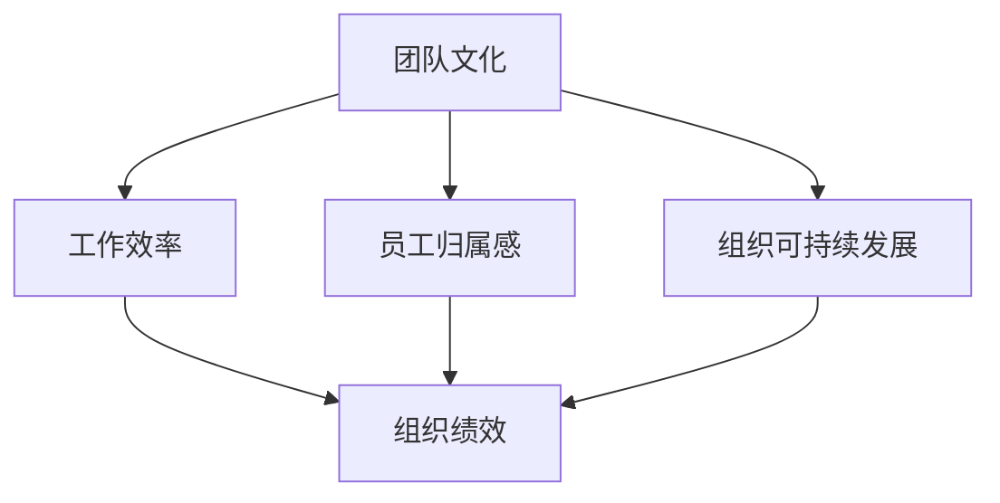
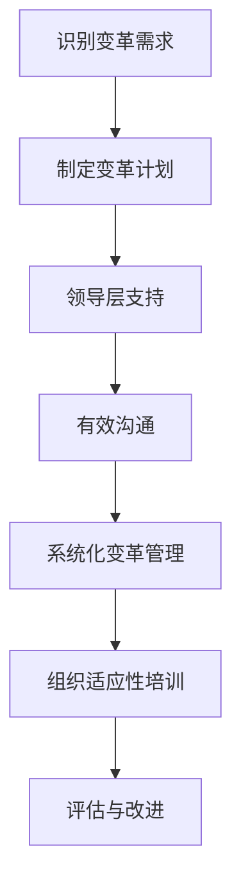
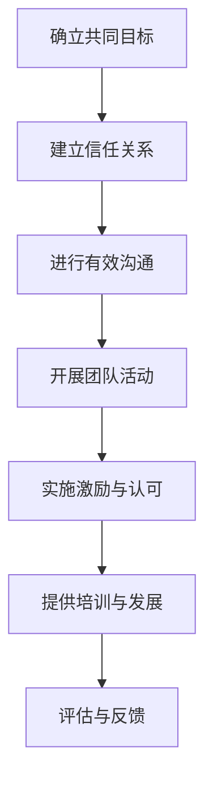

                 

### 《团队文化建设深化：塑造持久团队精神》

#### 关键词：
团队文化、团队精神、文化建设策略、持久性、IT团队管理

#### 摘要：
本文深入探讨了团队文化建设的重要性和方法，通过分析团队文化的核心概念与联系，提出了深化团队文化建设的策略与方法。文章结合实际案例，详细阐述了团队精神的培养方法和实践指导，旨在为IT团队管理者提供实用的文化建设方案，以塑造持久团队精神。

## 引言

在当今快速发展的IT行业，团队文化建设已成为组织成功的关键因素之一。一个具有强大团队文化的团队，不仅能够提高工作效率，还能够增强员工的归属感和凝聚力，从而实现长期的可持续发展。本文将从以下三个方面展开讨论：

1. **团队文化的核心概念与联系**：介绍团队文化的定义、构成及其对组织绩效的影响。
2. **深化团队文化建设的策略与方法**：探讨如何通过关键步骤和实际案例，深化团队文化建设。
3. **塑造持久团队精神的实践指导**：提供团队精神培养的方法与技巧，结合实际案例进行详细讲解。

通过本文的讨论，旨在为IT团队管理者提供实用的团队文化建设方案，以塑造持久团队精神。

### 团队文化的核心概念与联系

#### 1.1 团队文化的定义与构成

团队文化是指团队在长期发展过程中形成的共同价值观、行为规范和工作方式。它不仅仅是一种意识形态，更是团队内在动力和外在表现的综合体现。团队文化的构成主要包括以下三个方面：

1. **价值观**：团队的价值观是团队成员共同认可并遵循的基本信念和原则。它决定了团队的使命、愿景和目标，是团队文化的核心。
2. **行为规范**：行为规范是团队成员在互动过程中需要遵守的行为准则。它包括团队内部沟通、协作和决策等方面，是团队文化的外在表现。
3. **工作方式**：工作方式是团队成员在工作中采用的具体方法和技术。它包括团队的工作流程、工具选择和项目管理等方面，是团队文化的具体应用。

#### 1.2 团队文化的重要作用

团队文化对组织绩效具有显著的影响。首先，团队文化能够提高团队的工作效率。在一个具有良好团队文化的团队中，成员之间的沟通更加顺畅，协作更加紧密，从而减少了工作中的摩擦和冲突，提高了工作效率。其次，团队文化能够增强员工的归属感。一个具有强大团队文化的团队，能够让员工感受到自己的价值和重要性，从而增强员工的归属感和忠诚度。最后，团队文化能够促进组织的可持续发展。一个具有强大团队文化的组织，能够适应市场的变化和挑战，实现长期的稳定发展。

#### 1.3 团队文化与组织绩效的关系

团队文化与组织绩效之间存在密切的关系。一方面，团队文化对组织绩效具有直接的影响。研究表明，具有良好团队文化的团队，其绩效普遍高于具有较差团队文化的团队。另一方面，团队文化对组织绩效具有间接的影响。团队文化能够提升团队的整体能力，从而提高组织的整体绩效。

为了更好地理解团队文化与组织绩效的关系，我们可以通过以下Mermaid流程图来展示：

在这个流程图中，团队文化通过提高工作效率、增强员工归属感和促进组织可持续发展，最终影响组织绩效。

### 深化团队文化建设的策略与方法

#### 2.1 建立明确的文化愿景

建立明确的文化愿景是深化团队文化建设的第一步。文化愿景是指团队希望实现的未来状态和价值追求。一个明确的文化愿景能够为团队提供明确的方向和目标，引导团队成员共同奋斗。

为了建立明确的文化愿景，团队需要通过以下步骤：

1. **确定团队的核心价值观**：团队的核心价值观是文化愿景的基础。团队需要通过讨论和共识，确定符合团队特点和目标的核心价值观。
2. **明确团队的文化愿景**：在确定核心价值观的基础上，团队需要明确文化愿景，描述团队希望实现的未来状态和价值追求。
3. **制定文化愿景的执行计划**：文化愿景需要通过具体的执行计划来实现。团队需要制定详细的执行计划，确保文化愿景能够得到有效落实。

#### 2.2 设计符合团队特点的文化体系

设计符合团队特点的文化体系是深化团队文化建设的第二步。文化体系是指团队在价值观指导下形成的一套系统化的行为规范和工作方式。一个符合团队特点的文化体系能够更好地激发团队成员的积极性和创造力。

为了设计符合团队特点的文化体系，团队需要通过以下步骤：

1. **分析团队的特点和需求**：团队需要分析自身的特点和需求，确定需要改进的方面和优先级。
2. **制定文化体系的具体内容**：在分析团队的特点和需求的基础上，团队需要制定具体的文化体系内容，包括行为规范、工作方式和团队协作等方面。
3. **宣传和推广文化体系**：文化体系需要得到团队成员的认可和遵守。团队需要通过宣传和推广，让团队成员深入了解文化体系的内容和重要性。

#### 2.3 融入日常管理与实践

融入日常管理与实践是深化团队文化建设的第三步。文化体系需要通过日常的管理和实践来不断巩固和深化。

为了融入日常管理与实践，团队需要通过以下步骤：

1. **将文化体系纳入管理制度**：团队需要将文化体系纳入管理制度，确保文化体系能够在管理制度中得到有效落实。
2. **开展文化教育培训**：团队需要定期开展文化教育培训，提高团队成员对文化体系的认知和理解。
3. **建立文化评价机制**：团队需要建立文化评价机制，对团队成员的文化素养和行为进行评价和反馈，从而不断优化和改进文化体系。

通过以上三个步骤，团队可以深化团队文化建设，塑造持久团队精神。

### 团队文化建设的关键步骤

#### 3.1 建立明确的文化愿景

建立明确的文化愿景是深化团队文化建设的首要步骤。一个明确的文化愿景能够为团队提供清晰的方向和目标，引导团队成员共同努力。

为了建立明确的文化愿景，团队需要遵循以下步骤：

1. **识别团队的核心价值观**：团队需要通过讨论和共识，识别团队的核心价值观。这些核心价值观应该是团队共同认可并愿意遵循的基本信念和原则。
2. **制定文化愿景**：在确定核心价值观的基础上，团队需要制定文化愿景。文化愿景应该描述团队希望实现的未来状态和价值追求，具有明确的目标和意义。
3. **宣传和推广文化愿景**：文化愿景需要得到团队成员的认可和遵守。团队需要通过宣传和推广，让团队成员深入了解文化愿景的内容和重要性。

#### 3.2 设计符合团队特点的文化体系

设计符合团队特点的文化体系是深化团队文化建设的第二步。一个符合团队特点的文化体系能够更好地激发团队成员的积极性和创造力。

为了设计符合团队特点的文化体系，团队需要遵循以下步骤：

1. **分析团队的特点和需求**：团队需要分析自身的特点和需求，确定需要改进的方面和优先级。这包括团队的工作流程、沟通方式、协作机制等方面。
2. **制定文化体系的具体内容**：在分析团队的特点和需求的基础上，团队需要制定具体的文化体系内容。这包括行为规范、工作方式、团队协作等方面。
3. **宣传和推广文化体系**：文化体系需要得到团队成员的认可和遵守。团队需要通过宣传和推广，让团队成员深入了解文化体系的内容和重要性。

#### 3.3 融入日常管理与实践

融入日常管理与实践是深化团队文化建设的第三步。文化体系需要通过日常的管理和实践来不断巩固和深化。

为了融入日常管理与实践，团队需要遵循以下步骤：

1. **将文化体系纳入管理制度**：团队需要将文化体系纳入管理制度，确保文化体系能够在管理制度中得到有效落实。这包括制定文化相关的规章制度、奖惩机制等。
2. **开展文化教育培训**：团队需要定期开展文化教育培训，提高团队成员对文化体系的认知和理解。这包括组织文化培训课程、开展文化讨论等。
3. **建立文化评价机制**：团队需要建立文化评价机制，对团队成员的文化素养和行为进行评价和反馈，从而不断优化和改进文化体系。

通过以上三个步骤，团队可以深化团队文化建设，塑造持久团队精神。

### 团队文化变革的必要性

#### 4.1 团队文化变革的背景和原因

在快速变化的IT行业中，团队文化变革的必要性日益凸显。首先，市场的快速变化和技术的不断进步，要求团队具备更高的灵活性和创新能力。传统僵化的团队文化往往难以适应这些变化，导致团队绩效下降。其次，员工期望的变化也促使团队文化变革。现代员工更加注重工作与生活的平衡、职业成长和自我实现，传统以工作为中心的文化难以满足这些需求。最后，组织规模和结构的调整也需要团队文化变革来适应新的组织形态。

#### 4.2 团队文化变革的挑战与应对策略

团队文化变革面临着诸多挑战，主要包括：

1. **变革阻力**：团队成员可能对变革持怀疑态度或抵触情绪，这需要通过有效的沟通和培训来化解。
2. **变革管理**：文化变革需要系统的管理和实施，包括制定变革计划、分配资源和管理变革过程。
3. **组织适应性**：文化变革需要团队具备较强的适应能力，以适应新的工作模式和文化环境。

为了应对这些挑战，团队可以采取以下策略：

1. **领导层的支持**：领导层对文化变革的支持至关重要。领导层需要明确变革的目标和意义，并提供必要的资源和指导。
2. **有效的沟通**：团队需要通过有效的沟通机制，确保团队成员了解变革的必要性和目标，减少变革阻力。
3. **系统化的变革管理**：团队需要制定详细的变革计划，包括变革的目标、步骤、资源和时间表，并确保变革过程的有序进行。
4. **组织适应性培训**：团队需要为成员提供适应新文化的培训，提高团队的适应能力和协作效率。

为了更好地理解团队文化变革的过程，我们可以通过以下Mermaid流程图来展示：

在这个流程图中，团队首先识别变革需求，然后制定变革计划，并得到领导层的支持。通过有效的沟通和系统化的变革管理，团队逐步适应新文化，并不断评估和改进变革效果。

### 团队文化深化策略案例分析

#### 6.1 案例一：企业A的文化变革之路

企业A是一家拥有多年历史的IT企业，随着市场的变化和内部管理问题，企业意识到需要深化团队文化建设。以下是企业A的文化变革过程：

1. **背景分析**：企业A分析了当前团队文化存在的问题，包括沟通不畅、协作不紧密和员工积极性不足等。
2. **制定文化愿景**：企业A确定了“开放、创新、共赢”的核心价值观，并制定了“打造高效协同团队”的文化愿景。
3. **设计文化体系**：企业A制定了详细的文化体系，包括沟通机制、协作流程和员工激励制度等。
4. **实施文化变革**：企业A通过培训、宣传和制度落实，逐步推进文化变革。在变革过程中，领导层积极支持，并通过有效沟通化解了变革阻力。
5. **评估与改进**：企业A定期评估文化变革的效果，并根据反馈不断改进文化体系。

通过文化变革，企业A的团队协作效率显著提高，员工积极性明显增强，企业整体绩效也得到了提升。

#### 6.2 案例二：团队B的文化建设实践

团队B是某知名IT企业的一个开发团队，团队B在文化建设方面采取了以下措施：

1. **明确文化愿景**：团队B明确了“专注、高效、创新”的文化愿景，并制定了相应的价值观和行为规范。
2. **建立沟通机制**：团队B建立了定期会议和交流平台，确保团队成员之间的信息共享和协作。
3. **开展文化培训**：团队B定期开展文化培训，提高团队成员对文化体系的理解和认同。
4. **实施员工激励**：团队B制定了员工激励制度，包括绩效奖金、晋升机会和职业规划等，激励员工积极投入工作。
5. **持续改进**：团队B通过定期评估和反馈，不断优化文化体系，以适应团队的发展和变化。

通过这些措施，团队B的内部协作效率大幅提升，员工满意度显著提高，团队整体绩效也得到了明显改善。

#### 6.3 案例分析与启示

通过以上两个案例，我们可以得出以下启示：

1. **明确文化愿景**：明确的文化愿景是深化团队文化建设的基础。只有明确了文化愿景，团队才能有明确的方向和目标。
2. **建立有效的沟通机制**：良好的沟通机制是团队协作的保障。通过有效的沟通，团队成员能够更好地理解文化愿景和文化体系，减少误解和冲突。
3. **持续的文化培训**：定期开展文化培训，能够提高团队成员对文化体系的理解和认同，增强团队凝聚力。
4. **实施员工激励**：合理的员工激励制度能够激发员工的积极性和创造力，提高团队整体绩效。
5. **持续改进**：团队文化建设是一个持续的过程。只有不断评估和改进，才能确保文化体系适应团队的发展和变化。

### 团队精神培养的方法与技巧

#### 7.1 团队精神培养的核心原则

培养团队精神是深化团队文化建设的重要任务。以下是一些核心原则：

1. **共同目标**：明确共同的目标是培养团队精神的基础。团队成员需要共同认可并追求这一目标，从而增强团队凝聚力。
2. **相互信任**：信任是团队精神的核心。团队成员之间需要建立相互信任的关系，通过开放、坦诚的沟通来解决问题。
3. **有效沟通**：沟通是团队精神培养的关键。通过有效的沟通，团队成员能够更好地理解彼此的想法和需求，提高协作效率。
4. **共同成长**：共同成长是培养团队精神的动力。团队需要为成员提供成长机会，帮助成员实现个人和团队目标。
5. **激励与认可**：激励与认可能够增强团队成员的积极性和归属感，是培养团队精神的重要手段。

#### 7.2 培养团队精神的实践方法

为了培养团队精神，团队可以采取以下实践方法：

1. **团队建设活动**：定期组织团队建设活动，如团队拓展训练、团队旅游等，增强团队成员之间的交流和互动。
2. **共同项目**：通过共同项目，团队成员可以共同面对挑战，提高协作能力和解决问题的能力。
3. **开放沟通**：建立开放沟通的平台，如定期的团队会议、邮件列表等，鼓励团队成员表达自己的想法和意见。
4. **反馈与激励**：定期对团队成员的工作进行反馈和激励，认可成员的贡献和进步。
5. **培训与发展**：为团队成员提供培训和发展机会，帮助成员提升技能和知识，增强团队整体实力。

#### 7.3 常见问题与解决方案

在培养团队精神的过程中，团队可能会遇到以下问题：

1. **沟通障碍**：团队成员之间的沟通不畅可能导致误解和冲突。解决方案是建立有效的沟通机制，如定期的沟通会议、开放的工作环境等。
2. **缺乏共同目标**：团队成员缺乏共同的目标可能导致团队成员之间的疏离。解决方案是明确共同的目标，并通过团队活动来增强团队成员的归属感。
3. **激励不足**：团队成员的积极性不足可能导致团队精神的减弱。解决方案是建立合理的激励制度，如绩效奖金、晋升机会等。
4. **信任问题**：团队成员之间的信任缺失可能导致协作效率降低。解决方案是通过培训、沟通和共同项目来建立信任。

通过以上方法，团队可以有效地培养团队精神，提高团队的整体绩效。

### 团队精神培养的Mermaid流程图

为了更好地理解团队精神培养的过程，我们可以通过以下Mermaid流程图来展示：

在这个流程图中，团队首先确立共同的目标，然后建立信任关系，进行有效沟通，开展团队活动，实施激励与认可，并提供培训与发展。最后，团队通过评估与反馈来不断优化团队精神培养的过程。

### 团队精神培养案例与实践

#### 9.1 案例一：企业C的团队精神塑造

企业C是一家领先的软件开发企业，通过以下措施成功塑造了团队精神：

1. **共同目标确立**：企业C通过定期的团队会议和讨论，明确了公司的长期目标和短期目标，并确保每个团队成员都理解并认同这些目标。
2. **信任关系建立**：企业C鼓励团队成员之间的开放沟通和坦诚反馈，建立了基于信任的工作环境。此外，公司还通过团队建设活动，如户外拓展训练，增强了团队成员之间的信任。
3. **有效沟通**：企业C建立了多个沟通平台，包括日常站会、周例会和邮件列表，确保团队成员能够及时分享信息、讨论问题和解决问题。
4. **激励与认可**：企业C设立了绩效奖金制度，根据团队成员的贡献和工作表现进行奖励。此外，公司还定期组织表彰大会，对表现突出的团队和个人进行表彰和奖励。
5. **培训与发展**：企业C为团队成员提供了多种培训和发展机会，包括内部技术分享会、外部培训课程和职业规划指导，帮助团队成员提升技能和知识，实现个人和团队目标。

通过以上措施，企业C的团队精神得到了显著提升，团队成员的协作效率和工作满意度也得到了提高。

#### 9.2 案例二：团队D的团队精神培养实践

团队D是一个由多部门组成的跨职能团队，他们在团队精神培养方面取得了以下成果：

1. **共同目标确立**：团队D明确了项目的目标和每个团队成员的角色与责任，确保每个成员都了解项目的整体方向和自己的任务。
2. **信任关系建立**：团队D通过定期的团队建设活动和团队合作项目，增强了团队成员之间的信任。他们还鼓励团队成员在项目中互相支持和帮助，共同解决难题。
3. **有效沟通**：团队D建立了高效的沟通机制，包括每日站会、项目进度报告和定期的团队会议，确保团队成员能够及时沟通进展、问题和解决方案。
4. **激励与认可**：团队D通过设立项目奖励和团队奖励，激励团队成员积极工作。同时，他们还通过团队庆功活动和团队聚餐等方式，增进团队成员之间的友谊和团结。
5. **培训与发展**：团队D定期组织技能培训和工作坊，帮助团队成员提升技能和知识。他们还鼓励团队成员参加外部培训和行业会议，扩展视野和技能。

通过这些实践，团队D的团队精神得到了显著提升，项目的成功率也大幅增加。

#### 9.3 案例总结与反思

通过企业C和团队D的案例，我们可以总结出以下几点关于团队精神培养的实践启示：

1. **共同目标的重要性**：共同的目标是团队精神的基础，能够统一团队成员的行动方向。
2. **信任关系的建立**：信任是团队精神的核心，需要通过开放沟通和团队合作来培养。
3. **有效沟通**：沟通是团队协作的关键，需要建立高效的沟通机制来确保信息流通。
4. **激励与认可**：合理的激励和认可能够激发团队成员的积极性和创造力。
5. **培训与发展**：持续的培训和发展能够提升团队成员的技能和知识，增强团队的整体实力。

同时，我们还需要反思如何在实践中进一步深化团队精神培养，例如通过更灵活的团队结构、更开放的沟通环境、更有效的激励机制等，以应对不断变化的工作环境和团队需求。

### 附录A：团队文化建设的工具与资源

#### A.1 团队文化建设工具推荐

1. **SavvyTeam**：一个功能强大的团队协作工具，提供实时沟通、任务管理和团队日历等功能，有助于团队文化建设。
2. **Asana**：一个用于项目管理的工作平台，可以帮助团队更好地规划任务、跟踪进度和协作。
3. **Slack**：一个流行的实时沟通工具，支持多种集成服务，有助于加强团队成员之间的沟通和协作。

#### A.2 团队文化建设相关资源

1. **《团队协作的艺术》**：作者：罗伯特·舒勒，这本书详细介绍了团队协作的原则和技巧，对团队文化建设具有指导意义。
2. **《五项管理》**：作者：彼得·德鲁克，这本书提出了有效管理的五项核心原则，对团队文化建设有重要启示。
3. **《团队建设》**：作者：唐纳德·O·克拉克，这本书提供了丰富的团队建设实践案例，有助于团队管理者在实践中深化团队文化建设。

### 结语

团队文化建设是组织成功的关键因素之一。通过明确团队文化的核心概念与联系、深化团队文化建设的策略与方法，以及培养持久团队精神的实践指导，团队管理者可以有效地塑造团队精神，提高团队绩效。本文通过案例分析和实践总结，为团队文化建设提供了实用的指导和建议。希望读者能够从中获得启示，并将其应用于实际工作中，以实现团队的可持续发展。

#### 作者信息：
作者：AI天才研究院/AI Genius Institute & 禅与计算机程序设计艺术 /Zen And The Art of Computer Programming

