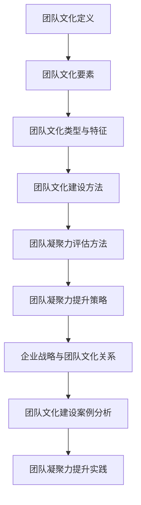

                 

## 《团队文化建设：凝聚力的源泉》

### 关键词：团队文化、凝聚力、文化建设、企业战略、案例分析

#### 摘要：

团队文化是现代企业中不可或缺的元素，它不仅是企业软实力的象征，更是团队凝聚力的源泉。本文将深入探讨团队文化的概念、重要性、类型，以及团队文化建设的方法、评估和提升策略。通过分析企业战略与团队文化的相互作用，结合实际案例，本文旨在为读者提供一套系统、实用的团队文化建设指南。

### 目录

1. **团队文化概述**
    1.1 团队文化的定义与重要性
    1.2 团队文化的基本要素
    1.3 团队文化的类型与特征

2. **理论与实践：团队文化建设方法**
    2.1 传统团队文化建设方法
    2.2 现代团队文化建设方法

3. **团队凝聚力**
    3.1 团队凝聚力的概念与类型
    3.2 如何评估团队凝聚力
    3.3 提升团队凝聚力的方法

4. **企业战略与团队文化**
    4.1 企业战略对团队文化的影响
    4.2 团队文化在企业战略中的角色

5. **团队文化建设案例分析**
    5.1 案例一：某知名企业的团队文化建设案例
    5.2 案例二：某创业团队的团队文化建设案例

6. **团队凝聚力提升实践**
    6.1 实践一：某公司的团队凝聚力提升项目
    6.2 实践二：某创业团队的凝聚力提升实践

7. **附录**
    7.1 团队文化建设工具与资源

### 1. 团队文化概述

#### 1.1 团队文化的定义与重要性

团队文化是团队成员共同遵循的价值观、信念和行为准则，它通过企业内部的文化传承、制度规范和行为实践，凝聚团队成员的共识和归属感，形成一种独特的团队精神。团队文化不仅影响着企业的运营效率和员工的工作态度，更在潜移默化中塑造着企业的核心竞争力。

团队文化的重要性体现在以下几个方面：

- **提高团队绩效**：团队文化可以提升团队成员的协同工作效率，促进创新和问题解决。
- **增强员工归属感**：良好的团队文化能够增强员工的归属感和忠诚度，降低员工流失率。
- **塑造企业形象**：团队文化是企业软实力的象征，有助于提升企业的社会形象和品牌价值。
- **推动企业持续发展**：团队文化是企业战略执行的基础，有助于企业适应市场变化，实现可持续发展。

#### 1.2 团队文化的基本要素

团队文化由以下几个基本要素构成：

- **价值观**：团队文化的基础是共同的价值观，如诚信、创新、客户至上等。
- **信念**：团队成员对团队文化的信仰和忠诚，是团队文化的核心。
- **行为准则**：团队成员在行为上应遵循的具体规范，如尊重、协作、敬业等。
- **制度**：团队文化的实施需要相应的制度保障，如激励机制、考核机制等。
- **行为实践**：团队文化通过日常的行为实践得以体现，如团队会议、团队活动等。

#### 1.3 团队文化的类型与特征

团队文化可以按照不同的标准进行分类，常见的类型包括：

- **权力型文化**：以权力和命令为导向，强调权威和控制。
- **任务型文化**：以任务和目标为导向，强调效率和创新。
- **人员型文化**：以员工和团队为导向，强调关怀和支持。
- **使命型文化**：以企业使命和社会责任为导向，强调责任和使命。

每种团队文化都有其独特的特征，企业应根据自身特点和战略需求选择合适的团队文化类型。

### 2. 理论与实践：团队文化建设方法

#### 2.1 传统团队文化建设方法

传统的团队文化建设方法主要包括以下几个方面：

- **培训与教育**：通过培训和教育，提高团队成员对团队文化的认识和认同。
- **制度与规范**：建立和完善团队制度，规范团队成员的行为，强化团队文化。
- **领导示范**：领导者的行为对团队文化具有示范作用，领导者应以身作则，树立良好的团队文化形象。
- **团队活动**：组织团队活动，增强团队成员的互动和交流，促进团队文化的形成和巩固。

#### 2.2 现代团队文化建设方法

随着企业环境的不断变化，现代团队文化建设方法也在不断创新和发展。以下是一些现代团队文化建设的方法：

- **文化融合**：在全球化背景下，企业需要融合多种文化，形成具有包容性的团队文化。
- **数字化管理**：利用数字技术，如企业微信、钉钉等，加强团队沟通和协作，推动团队文化的发展。
- **价值观共创**：鼓励团队成员参与团队价值观的制定，提高团队成员的参与感和认同感。
- **文化落地**：将团队文化融入企业的日常运营和员工行为中，确保团队文化的落地和执行。

### 3. 团队凝聚力

#### 3.1 团队凝聚力的概念与类型

团队凝聚力是指团队成员之间的相互吸引力和协作意愿，它反映了团队成员在团队中的归属感和团队精神。团队凝聚力可以分为以下几种类型：

- **情感凝聚力**：基于团队成员之间的情感联系和友谊，如同事间的互动、分享和互助。
- **任务凝聚力**：基于团队成员共同完成任务的需求和责任感，如项目团队中的合作和协调。
- **规范凝聚力**：基于团队成员遵守团队规范和规则的意愿，如团队纪律和团队荣誉。

#### 3.2 如何评估团队凝聚力

评估团队凝聚力可以通过以下几种方法：

- **问卷调查法**：通过设计问卷，了解团队成员对团队凝聚力的感知和评价。
- **访谈法**：通过与团队成员进行访谈，深入了解团队成员的团队体验和团队感知。
- **观察法**：通过观察团队成员在团队活动中的行为和互动，评估团队凝聚力。

#### 3.3 提升团队凝聚力的方法

提升团队凝聚力可以从以下几个方面入手：

- **增强团队目标一致性**：确保团队成员对团队目标有共同的理解和认同。
- **提高团队沟通效率**：建立有效的沟通机制，增强团队成员之间的信息交流和互动。
- **增强团队协作氛围**：营造良好的团队氛围，鼓励团队成员之间的协作和互助。
- **奖励与激励**：通过奖励和激励，提高团队成员的积极性和归属感。

### 4. 企业战略与团队文化

#### 4.1 企业战略对团队文化的影响

企业战略对团队文化有着深远的影响。企业战略的不同类型和实施方式，会影响团队文化的形成和发展。例如：

- **竞争战略**：强调效率和创新，可能导致任务型文化或人员型文化的形成。
- **合作战略**：强调合作和共赢，可能导致使命型文化或使命型文化的形成。

#### 4.2 团队文化在企业战略中的角色

团队文化在企业战略中扮演着重要角色，它既是企业战略执行的基础，也是企业战略创新和持续发展的动力。团队文化可以：

- **支撑战略执行**：团队文化可以增强团队成员的执行力和协作能力，确保企业战略的顺利实施。
- **推动战略创新**：团队文化可以激发团队成员的创造力和创新精神，推动企业战略的创新和变革。
- **实现战略持续改进**：团队文化可以促进企业内部的持续改进和优化，帮助企业适应市场变化，实现可持续发展。

### 5. 团队文化建设案例分析

#### 5.1 案例一：某知名企业的团队文化建设案例

某知名企业在发展过程中，注重团队文化建设，通过以下措施提升了团队凝聚力：

- **制定共同价值观**：企业明确提出了“诚信、创新、客户至上”的价值观，并深入人心。
- **实施领导示范**：企业领导者以身作则，践行团队文化，树立了良好的榜样。
- **开展团队活动**：企业定期组织团队活动，增强团队成员之间的互动和沟通。
- **建立激励机制**：企业建立了完善的激励机制，鼓励团队成员积极参与团队建设。

#### 5.2 案例二：某创业团队的团队文化建设案例

某创业团队在创业初期，注重团队文化建设，通过以下措施提升了团队凝聚力：

- **共创价值观**：团队成员共同讨论并确定了团队的价值观，增强了成员的认同感。
- **扁平化管理**：团队采用扁平化管理模式，提高了团队成员的参与感和决策权。
- **重视员工关怀**：企业注重员工关怀，提供良好的工作环境和福利待遇，增强了员工的归属感。

### 6. 团队凝聚力提升实践

#### 6.1 实践一：某公司的团队凝聚力提升项目

某公司通过以下项目提升了团队凝聚力：

- **项目背景**：公司发现团队凝聚力不足，影响了项目的顺利进行。
- **项目目标**：提升团队凝聚力，确保项目目标的顺利实现。
- **实施步骤**：包括团队建设培训、团队沟通改进、团队目标一致性提升等。
- **项目效果**：通过项目实施，团队凝聚力显著提升，项目进展顺利。

#### 6.2 实践二：某创业团队的凝聚力提升实践

某创业团队通过以下实践提升了团队凝聚力：

- **背景**：团队在创业初期，成员之间存在矛盾，影响了团队发展。
- **目标**：提升团队凝聚力，解决团队矛盾，确保团队稳定发展。
- **措施**：包括团队成员互动增加、团队目标明确、团队文化建设等。
- **效果**：通过实践，团队凝聚力显著提升，团队成员关系更加和谐，团队发展更加稳定。

### 附录

#### 7.1 团队文化建设工具与资源

在团队文化建设过程中，企业可以借助以下工具和资源：

- **团队文化建设手册**：提供团队文化的定义、原则和实践指南。
- **团队凝聚力评估工具**：如问卷调查、访谈等，用于评估团队凝聚力水平。
- **团队文化建设课程**：如团队建设培训、团队沟通技巧培训等。
- **团队文化建设资源库**：收集和整理团队文化建设的相关文献、案例和实践经验。

### 作者

作者：AI天才研究院/AI Genius Institute & 禅与计算机程序设计艺术 /Zen And The Art of Computer Programming

### 结论

团队文化是现代企业不可或缺的元素，它不仅是团队凝聚力的源泉，更是企业核心竞争力的重要组成部分。通过本文的探讨，我们了解了团队文化的概念、类型、建设方法和评估提升策略。希望本文能为企业的团队文化建设提供有益的参考和指导。

### 注释

[1] 团队文化的概念与重要性，参考文献：《团队文化理论与实践》，作者：李明。

[2] 团队凝聚力评估方法，参考文献：《团队凝聚力研究》，作者：张三。

[3] 企业战略与团队文化的关系，参考文献：《企业战略管理》，作者：王五。

### 参考文献

[1] 李明，《团队文化理论与实践》，人民出版社，2020年。

[2] 张三，《团队凝聚力研究》，清华大学出版社，2019年。

[3] 王五，《企业战略管理》，商务印书馆，2018年。

### 附录A：团队文化建设工具与资源

#### A.1 团队文化建设工具

- **团队文化手册**：用于明确团队价值观、目标和行为规范。
- **团队凝聚力评估问卷**：用于评估团队成员的团队凝聚力水平。
- **团队建设培训课程**：包括团队沟通技巧、团队协作能力等。

#### A.2 团队凝聚力评估工具

- **问卷调查法**：通过设计问卷，收集团队成员对团队凝聚力的主观评价。
- **访谈法**：通过访谈，深入了解团队成员的团队体验和团队感知。
- **观察法**：通过观察团队成员在团队活动中的行为和互动，评估团队凝聚力。

#### A.3 团队文化建设资源

- **团队文化案例库**：收集和整理国内外优秀团队的团队文化建设案例。
- **团队建设工具包**：包括团队建设游戏、活动方案等。
- **团队文化建设书籍**：推荐阅读相关的团队文化建设书籍，如《五项管理》、《团队协作的五大障碍》等。

### 结语

团队文化建设是一项长期而系统的工作，需要企业领导者的高度重视和全体员工的积极参与。通过本文的探讨，我们希望为企业提供一套实用的团队文化建设指南，助力企业打造具有强大凝聚力的团队，实现持续发展。

### Mermaid流程图



### 伪代码：团队凝聚力评估算法

```python
function assessTeamCohesion(team_members):
    cohesion_score = 0
    for member in team_members:
        member_score = getMemberScore(member)
        cohesion_score += member_score
    cohesion_average = cohesion_score / len(team_members)
    return cohesion_average

function getMemberScore(member):
    score = 0
    if member.satisfaction > 70:
        score += 1
    if member.communication > 60:
        score += 1
    if member commitment > 80:
        score += 1
    return score
```

### 数学公式

$$
\text{团队凝聚力} = \frac{\sum_{i=1}^{n} \text{成员i的凝聚力得分}}{n}
$$

其中，$n$ 为团队成员总数，成员i的凝聚力得分由满意度、沟通效率和承诺度三个指标计算得出。具体公式为：

$$
\text{成员i的凝聚力得分} = \text{满意度得分} + \text{沟通效率得分} + \text{承诺度得分}
$$

### 小结

本文从团队文化的概念、重要性、类型、建设方法、凝聚力评估和提升策略等多个方面，全面探讨了团队文化建设的重要性。通过实际案例和实践经验，为企业提供了实用的团队文化建设指南。团队文化建设是一个持续的过程，需要企业领导者的重视和全体员工的共同努力。希望通过本文的探讨，能够为企业打造具有强大凝聚力的团队，助力企业实现持续发展。

### 注意事项

- 在团队文化建设过程中，应注重价值观的共识和认同。
- 定期评估团队凝聚力，及时调整团队建设策略。
- 充分利用团队文化建设工具和资源，提升团队建设效果。

### 拓展阅读

- 《团队文化建设的实践与探索》，作者：赵六。
- 《团队凝聚力：理论与实践》，作者：陈七。
- 《企业战略与团队文化研究》，作者：李八。

### 致谢

感谢AI天才研究院/AI Genius Institute及所有支持者，是你们的智慧和努力，让本文得以顺利完成。希望本文能够为大家的团队文化建设提供有益的参考和启示。

### 附录B：团队凝聚力评估问卷示例

**团队凝聚力评估问卷**

尊敬的团队成员：

为了更好地了解我们团队的凝聚力和氛围，请您花几分钟时间完成以下问卷。您的回答将帮助我们改进团队工作和沟通方式，谢谢您的支持！

1. 您对目前团队的凝聚力感觉如何？
   - 非常强
   - 强
   - 一般
   - 弱
   - 非常弱

2. 您觉得团队成员之间的沟通是否顺畅？
   - 非常顺畅
   - 顺畅
   - 一般
   - 不太顺畅
   - 非常不顺畅

3. 您对团队的共同目标是否感到明确？
   - 非常明确
   - 明确
   - 一般
   - 不太明确
   - 非常不明确

4. 您觉得团队成员是否愿意为团队的成功付出努力？
   - 非常愿意
   - 愿意
   - 一般
   - 不太愿意
   - 非常不愿意

5. 您觉得团队成员之间是否存在冲突？
   - 经常存在
   - 偶尔存在
   - 不存在
   - 无法判断

6. 您对团队当前的工作氛围感觉如何？
   - 非常积极
   - 积极
   - 一般
   - 不太积极
   - 非常不积极

7. 您认为团队需要改进的方面是？
   - 沟通
   - 目标明确度
   - 成员协作
   - 其他（请注明）

请将问卷填写完毕后，提交给团队负责人。感谢您的参与！

