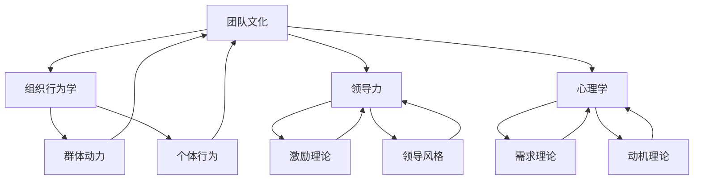

                 

### 文章标题：团队文化建设：塑造积极向上的工作环境

#### 关键词：团队文化、组织行为学、领导力、工作环境、积极向上

#### 摘要：
本文旨在探讨团队文化建设的重要性，以及如何通过系统化的方法塑造一个积极向上的工作环境。首先，我们将介绍团队文化建设的背景，阐述其在现代企业中的关键作用。接着，本文将深入探讨团队文化的核心概念，并通过Mermaid流程图展示它们之间的联系。随后，我们将从组织行为学、领导力和心理学等理论角度，解析团队文化建设的理论基础。然后，我们将讨论团队文化建设的具体实践方法，包括诊断、策略设计、实施和评估等步骤，并提供相关的工具与技术。接下来，通过案例研究和项目实战，我们将展示团队文化建设的实际应用和效果。最后，本文将展望团队文化建设的未来趋势，并提出最佳实践建议。

### 文章背景介绍

在当今快速发展的商业环境中，团队文化建设已成为企业成功的关键因素之一。随着市场竞争的加剧和员工需求的多样化，企业不仅需要关注产品和服务质量，更要关注员工的工作体验和工作环境。一个积极向上、和谐稳定的团队文化，不仅能提高员工的满意度和忠诚度，还能促进团队协作和创新能力，从而为企业创造更大的价值。

首先，从企业竞争力的角度来看，团队文化建设能够提升企业的核心竞争力。一个具有共同价值观、共同目标和高度凝聚力的团队，能够更好地应对市场变化和挑战，实现企业的长期发展目标。其次，从员工满意度和忠诚度的角度来看，积极向上的团队文化能够满足员工在职业成长、工作环境和人际关系方面的需求，从而提高员工的满意度和忠诚度。员工在舒适、和谐的工作环境中工作，更有可能保持高水平的绩效和创造力。

此外，团队文化建设还有助于提升企业的品牌形象和口碑。一个拥有强大团队文化的企业，往往能够赢得客户的信任和尊重，从而在市场竞争中占据有利地位。同时，团队文化建设也能为企业吸引和留住优秀人才。在当今人才竞争激烈的背景下，企业能否提供良好的工作环境和团队文化，已成为吸引和留住人才的重要考虑因素。

总之，团队文化建设不仅是现代企业成功的关键因素，更是企业长期发展的基石。通过系统化的团队文化建设，企业能够塑造积极向上的工作环境，提高员工满意度和忠诚度，提升企业竞争力和品牌形象。因此，本文将深入探讨团队文化建设的理论基础和实践方法，为企业提供有效的团队文化建设策略和最佳实践建议。

### 核心概念与联系

团队文化建设是一个复杂的系统工程，涉及多个核心概念和理论。首先，我们需要明确这些核心概念的定义和它们之间的关系。

**团队文化**：团队文化是指一个团队在长期发展和互动过程中所形成的共同价值观、信仰、行为准则和工作方式。它是一个团队的灵魂，决定了团队的行为和氛围。

**组织行为学**：组织行为学是研究个体、团队和组织在组织中的行为规律和影响因素的学科。它包括个体心理特征、群体行为、组织结构等多个方面，为团队文化建设提供了理论基础。

**领导力**：领导力是指领导者通过影响和激励团队成员，实现组织目标的能力。领导力在塑造团队文化中起着至关重要的作用，决定了团队成员的行为和团队的整体氛围。

**心理学**：心理学研究人类行为和心理过程的学科，为团队文化建设提供了关于人类行为和心理机制的理解。通过心理学理论，我们可以更好地理解团队成员的需求和行为，从而设计有效的团队文化建设策略。

这些核心概念之间存在着密切的联系。团队文化是团队行为的总和，它受到组织行为学和心理学的影响，同时通过领导力的引导和塑造。例如，组织行为学中的群体动力理论可以帮助我们理解团队成员之间的相互作用和团队文化的形成过程。领导力理论则为我们提供了如何通过领导行为塑造团队文化的具体方法。心理学理论则为我们提供了关于团队成员心理需求和行为动机的深刻理解，从而帮助我们设计更加有效的团队文化建设策略。

为了更好地展示这些核心概念之间的关系，我们可以使用Mermaid流程图来构建它们之间的联系：



在这个流程图中，团队文化作为核心概念，与组织行为学、领导力和心理学三个关键领域相互连接。组织行为学通过群体动力和个体行为理论影响团队文化，领导力通过激励理论和领导风格影响团队文化，心理学则通过需求理论和动机理论影响团队文化的形成和发展。这种多层次、多维度的关系，为我们理解团队文化建设提供了全面的视角。

通过明确这些核心概念和它们之间的联系，我们可以更好地理解团队文化建设的复杂性和重要性，为后续的理论和实践探讨奠定坚实基础。

### 团队文化建设的理论基础

团队文化建设不仅仅是表面上的口号或活动，它需要扎实的理论基础来指导实践。在这个部分，我们将从组织行为学、领导力和心理学三个核心理论角度，详细探讨团队文化建设的理论基础。

#### 组织行为学理论

组织行为学是研究个体、群体和组织在组织中的行为规律和影响因素的学科。它提供了团队文化建设的重要理论框架。其中，群体动力理论是一个关键的理论，它帮助我们理解团队文化的形成和演变。

**群体动力理论**：群体动力理论强调，群体中的成员相互作用和相互影响，形成一种集体动力，这种动力会影响群体的行为和绩效。具体来说，群体动力包括以下几个方面：

1. **规范**：群体规范是成员在互动过程中形成的共同行为准则。这些规范可以约束成员的行为，促进团队的一致性和协调性。

2. **凝聚力**：凝聚力是指群体成员之间的相互吸引力和归属感。高凝聚力能够增强团队的合作精神和团队精神，促进团队文化的形成。

3. **领导力**：领导力在群体动力中起着关键作用。有效的领导者能够引导和激励成员，促进团队目标的实现。

为了更好地理解这些概念，我们可以使用伪代码来阐述群体动力理论的基本原理：

```python
# 群体动力理论伪代码

class GroupDynamics:
    def __init__(self, members):
        self.members = members
        self norms = set_norms()
        self凝聚力 = calculate_cohesion()
        self.leadership = determine_leadership()

    def set_norms(self):
        # 根据成员的行为设定群体规范
        pass
    
    def calculate_cohesion(self):
        # 计算群体凝聚力
        pass

    def determine_leadership(self):
        # 确定领导力
        pass

    def influence_behavior(self):
        # 通过规范和领导力影响成员的行为
        pass

# 示例
group = GroupDynamics(members)
group.influence_behavior()
```

#### 领导力理论

领导力在团队文化建设中起着至关重要的作用。有效的领导力能够塑造团队文化，引导团队成员朝着共同的目标努力。

**激励理论**：激励理论关注领导者如何通过激励措施来激发成员的积极性和创造力。激励理论主要包括以下几种：

1. **X理论**：X理论认为，员工天生懒惰，需要通过严格的管理和监督来确保工作任务的完成。

2. **Y理论**：Y理论则认为，员工是积极的，能够自我激励，通过赋予自主权和责任感，可以激发他们的工作热情。

3. **强化理论**：强化理论通过奖励和惩罚来影响成员的行为。积极的强化可以增强良好的行为，而惩罚则可以减少不良行为。

以下是一个使用伪代码来阐述激励理论的基本原理：

```python
# 激励理论伪代码

class MotivationalTheory:
    def __init__(self, employee):
        self.employee = employee
        self.rewards = []
        self.punishments = []

    def set_reward(self, reward):
        # 设定奖励
        pass
    
    def set_punishment(self, punishment):
        # 设定惩罚
        pass

    def motivate_employee(self):
        # 通过奖励和惩罚激励员工
        pass

# 示例
motivation = MotivationalTheory(employee)
motivation.motivate_employee()
```

**领导风格**：不同的领导风格会影响团队文化的形成和发展。领导风格主要包括以下几种：

1. **专制型领导**：领导者做出所有决策，严格控制团队。

2. **民主型领导**：领导者鼓励团队成员参与决策，尊重成员的意见。

3. **参与型领导**：领导者与团队成员共同制定决策，注重团队协作。

以下是一个使用伪代码来阐述领导风格的基本原理：

```python
# 领导风格伪代码

class LeadershipStyle:
    def __init__(self, leader, team):
        self.leader = leader
        self.team = team
        self.style = "authoritative"  # 默认为专制型领导

    def set_style(self, style):
        # 设置领导风格
        pass

    def make_decision(self, decision):
        # 做出决策
        pass

    def encourage_participation(self):
        # 鼓励团队成员参与决策
        pass

# 示例
leader_style = LeadershipStyle(leader, team)
leader_style.set_style("democratic")
leader_style.make_decision(decision)
```

#### 心理学理论

心理学为团队文化建设提供了关于人类行为和心理机制的理解。通过心理学理论，我们可以更好地理解团队成员的需求和行为，从而设计有效的团队文化建设策略。

**需求理论**：需求理论关注个体的需求如何影响行为和动机。马斯洛的需求层次理论将需求分为五个层次：生理需求、安全需求、社交需求、尊重需求和自我实现需求。根据这一理论，领导者需要了解团队成员的不同需求，并采取相应的激励措施。

以下是一个使用伪代码来阐述需求理论的基本原理：

```python
# 需求理论伪代码

class DemandTheory:
    def __init__(self, employee):
        self.employee = employee
        self.demand_level = 0

    def set_demand_level(self, level):
        # 设定需求层次
        pass

    def meet_demand(self, demand):
        # 满足需求
        pass

    def motivate_employee(self):
        # 通过满足需求激励员工
        pass

# 示例
demand_theory = DemandTheory(employee)
demand_theory.motivate_employee()
```

**动机理论**：动机理论关注个体行为背后的动机和驱动因素。赫茨伯格的双因素理论认为，工作满意度和不满意度由两类因素决定：一类是保健因素，如工资、工作条件等，另一类是激励因素，如工作成就、认可等。领导者需要关注激励因素，通过提供挑战性的任务和认可来激发员工的动机。

以下是一个使用伪代码来阐述动机理论的基本原理：

```python
# 动机理论伪代码

class MotivationTheory:
    def __init__(self, employee):
        self.employee = employee
        self.motivation_level = 0

    def set_motivation_level(self, level):
        # 设定动机层次
        pass

    def provide_incentives(self, incentive):
        # 提供激励
        pass

    def motivate_employee(self):
        # 通过激励激励员工
        pass

# 示例
motivation_theory = MotivationTheory(employee)
motivation_theory.motivate_employee()
```

通过组织行为学、领导力和心理学理论的综合应用，我们可以更深入地理解团队文化建设的基本原理和方法。这些理论不仅为我们提供了理论框架，还为实际操作提供了具体的指导。在接下来的部分，我们将探讨如何将这些理论应用到团队文化建设的具体实践中。

### 团队文化建设的实践

团队文化建设不仅仅是理论上的探讨，更需要实际操作中的落地实施。以下将详细阐述团队文化建设的具体实践方法，包括诊断、策略设计、实施和评估等步骤。

#### 诊断

团队文化诊断是团队文化建设的第一步，目的是了解当前团队文化的现状，发现存在的问题和潜在的优势。以下是一些常用的诊断方法：

1. **问卷调查**：通过设计一系列问题，了解团队成员对团队文化的看法和感受。问卷调查可以涵盖团队价值观、团队凝聚力、员工满意度等方面。

2. **访谈**：与团队成员进行一对一或小组访谈，深入了解他们对团队文化的认知和期望。访谈可以揭示问卷调查中难以发现的问题和细节。

3. **焦点小组讨论**：组织团队成员参与焦点小组讨论，通过集体讨论的方式，发现团队文化中的共性和差异。

4. **员工满意度调查**：通过员工满意度调查，了解员工对工作环境、团队氛围和领导行为的评价。

以下是一个简单的问卷调查示例：

```markdown
**团队文化问卷调查**

1. 你认为我们的团队文化是什么？
   - 团队合作
   - 结果导向
   - 创新思维
   - 自我提升

2. 你对团队文化的满意度如何？
   - 非常满意
   - 满意
   - 一般
   - 不满意
   - 非常不满意

3. 你认为团队文化对工作绩效有影响吗？
   - 有很大影响
   - 有一定影响
   - 没有影响
   - 不确定

4. 你认为团队文化需要改进的方面是什么？
```

#### 策略设计

在完成团队文化诊断后，接下来是策略设计阶段。策略设计旨在制定具体的行动计划，以改进和塑造团队文化。以下是一些关键步骤：

1. **明确目标**：根据诊断结果，明确团队文化建设的具体目标。例如，提升团队凝聚力、增强创新意识等。

2. **制定策略**：制定具体的策略和措施，以实现团队文化的目标。策略可以包括团队建设活动、培训计划、领导力发展等。

3. **资源分配**：确保策略实施所需的资源，包括人力资源、财务资源和技术支持等。

4. **时间表**：制定详细的时间表，明确各个阶段的工作内容和截止日期。

以下是一个简单的策略设计示例：

```markdown
**团队文化建设策略设计**

目标：提升团队凝聚力，增强创新意识。

策略：

1. 定期组织团队建设活动，如团队拓展、团建旅游等。
2. 实施领导力发展计划，提升领导者的沟通和激励能力。
3. 设立创新奖励机制，鼓励团队成员提出创新想法和解决方案。
4. 开展创新培训，提高团队成员的创新思维和技能。

资源分配：

- 人力资源：项目经理1名，活动策划3名，培训讲师2名。
- 财务资源：活动预算5万元，培训费用3万元。
- 技术支持：提供在线培训平台，协助活动策划和执行。

时间表：

- 第1季度：完成团队建设活动策划，组织团队拓展活动。
- 第2季度：实施领导力发展计划，组织领导力培训。
- 第3季度：设立创新奖励机制，发布创新项目征集通知。
- 第4季度：开展创新培训，评选优秀创新项目并进行表彰。
```

#### 实施

策略设计完成后，进入实施阶段。实施阶段的关键是确保策略的有效执行。以下是一些关键步骤：

1. **沟通与培训**：确保所有团队成员了解团队文化建设的目标和策略，提供必要的培训和支持。

2. **跟踪与监督**：建立监督机制，定期检查策略的执行情况，确保各项工作按计划进行。

3. **调整与优化**：根据实施过程中的反馈和效果，及时调整和优化策略，以实现最佳效果。

以下是一个简单的实施计划示例：

```markdown
**团队文化建设实施计划**

沟通与培训：

- 第1个月：召开全员会议，介绍团队文化建设的目标和策略。
- 第2个月：组织团队成员参与领导力培训，提升沟通和激励能力。
- 第3个月：开展创新意识培训，提高团队成员的创新思维和技能。

跟踪与监督：

- 设立项目监督小组，每周召开会议，检查各项工作的进展情况。
- 定期收集团队成员的反馈，评估策略的执行效果。

调整与优化：

- 根据实施过程中的反馈，及时调整策略，优化活动内容和流程。
- 定期评估团队文化建设的效果，总结经验教训，为下一阶段的工作做好准备。
```

#### 评估

团队文化建设效果的评估是确保策略有效性和可持续性的重要环节。以下是一些常用的评估方法：

1. **关键绩效指标（KPI）**：设定具体的KPI，如员工满意度、团队凝聚力、创新成果等，定期跟踪和评估。

2. **员工反馈**：通过问卷调查、访谈等方式，收集员工的反馈意见，了解他们对团队文化建设的感受和评价。

3. **第三方评估**：邀请第三方机构对团队文化建设的效果进行评估，提供客观、公正的反馈。

以下是一个简单的评估计划示例：

```markdown
**团队文化建设评估计划**

关键绩效指标（KPI）：

- 员工满意度：90%以上的员工对团队文化建设表示满意。
- 团队凝聚力：团队内部合作顺畅，成员之间的沟通和协作效果显著提升。
- 创新成果：成功实施至少2个创新项目，对企业的业务发展和竞争力提升产生积极影响。

员工反馈：

- 开展季度员工满意度调查，了解员工对团队文化建设的感受和评价。
- 定期召开员工座谈会，收集员工的反馈意见。

第三方评估：

- 邀请第三方咨询机构进行团队文化评估，提供专业的评估报告。
- 根据第三方评估结果，调整和优化团队文化建设策略。

总结与反馈：

- 定期总结团队文化建设的工作成果和经验教训。
- 分享成功案例和最佳实践，为其他团队提供参考。
- 针对存在的问题和挑战，制定改进措施，不断提升团队文化建设的效果。
```

通过诊断、策略设计、实施和评估等步骤，我们可以系统地推进团队文化建设，塑造一个积极向上、和谐稳定的团队文化，为企业的长期发展奠定坚实基础。

### 团队文化建设的工具与技术

在团队文化建设过程中，使用适当的工具和技术能够显著提高工作效率和效果。以下介绍几种常用的团队文化建设工具和技术，包括问卷调查、访谈、焦点小组讨论以及其他辅助方法。

#### 问卷调查

问卷调查是一种广泛使用的收集团队成员意见和反馈的方法。通过设计科学合理的问卷，可以全面了解团队成员对团队文化的认知和感受。以下是设计问卷调查的几个关键步骤：

1. **确定调查目的**：明确调查的目标和内容，例如了解员工对团队价值观的认同程度、团队凝聚力的现状等。

2. **设计问卷题目**：根据调查目的，设计开放性、封闭性和量性化题目。开放性题目可以收集团队成员的详细意见，封闭性题目可以提供定量分析的基础，量化题目可以用于评估具体指标。

3. **预测试**：在正式发放问卷前，对问卷进行预测试，确保题目的合理性和有效性。

4. **数据收集**：通过邮件、在线调查平台等渠道，将问卷发放给团队成员，确保较高的参与率。

5. **数据分析**：使用统计分析软件，对问卷结果进行汇总和分析，识别团队文化中的问题和机会。

以下是一个简单的问卷调查示例题目：

```
1. 你认为我们的团队价值观（如诚实、创新、团队合作等）在实际工作中得到充分体现吗？
   - 完全同意
   - 较同意
   - 一般
   - 较不同意
   - 完全不同意

2. 你对团队的凝聚力（如团队合作、沟通协调等）感到满意吗？
   - 非常满意
   - 满意
   - 一般
   - 不满意
   - 非常不满意

3. 你是否有机会在工作中提出新的想法或建议？
   - 经常
   - 有时
   - 很少
   - 从未
```

#### 访谈

访谈是一种深入了解团队成员观点和感受的方法，尤其适用于了解复杂问题和深入了解个体经历。以下是进行访谈的几个关键步骤：

1. **确定访谈对象**：根据调查目的，选择合适的访谈对象，可以是团队领导、普通员工或关键岗位的成员。

2. **准备访谈提纲**：设计访谈提纲，列出需要探讨的主要问题，确保访谈的全面性和深度。

3. **进行访谈**：在访谈过程中，注意倾听和观察，鼓励受访者表达自己的观点和感受。

4. **记录和整理**：访谈结束后，对访谈内容进行记录和整理，提取关键信息和观点。

5. **分析访谈结果**：对访谈结果进行分析，识别团队文化中的关键问题和潜在优势。

以下是一个简单的访谈问题示例：

```
1. 请描述您对当前团队文化的看法。
2. 您认为团队文化对您的工作有何影响？
3. 您认为团队文化有哪些方面需要改进？
4. 您希望团队文化有哪些新的变化？
```

#### 焦点小组讨论

焦点小组讨论是一种集体讨论的方法，通过小组成员的互动和讨论，可以深入了解团队成员的观点和意见。以下是进行焦点小组讨论的几个关键步骤：

1. **确定讨论主题**：根据调查目的，选择一个或多个讨论主题，例如团队价值观、员工满意度等。

2. **选择参与者**：选择具有代表性且愿意积极参与的团队成员作为讨论参与者。

3. **准备讨论大纲**：设计讨论大纲，列出讨论的主要问题，确保讨论的有序进行。

4. **进行讨论**：在讨论过程中，引导参与者围绕主题展开讨论，鼓励开放和坦诚的交流。

5. **记录讨论结果**：对讨论结果进行记录和整理，提取关键观点和共识。

以下是一个简单的焦点小组讨论示例大纲：

```
一、团队价值观讨论

1. 你认为我们的团队价值观是什么？
2. 你对团队价值观的认同程度如何？
3. 你认为团队价值观在团队中的实际应用如何？

二、员工满意度讨论

1. 你对当前的工作环境和工作条件满意吗？
2. 你认为工作环境和工作条件有哪些需要改进的地方？
3. 你希望公司提供哪些额外的福利和支持？

三、团队文化建设建议

1. 你认为如何提升团队凝聚力？
2. 你认为如何增强员工对公司的忠诚度？
3. 你有哪些具体的建议和意见？
```

#### 其他辅助方法

除了上述三种主要方法，还有一些其他辅助方法可以用于团队文化建设，例如：

1. **工作坊**：通过工作坊的形式，让团队成员共同参与讨论和解决问题，增强团队的协作和创新能力。

2. **在线问卷调查和讨论平台**：利用在线工具，如问卷星、腾讯问卷等，进行问卷调查和讨论，提高参与率和反馈效率。

3. **文化墙和展示板**：在办公区域设置文化墙和展示板，展示团队价值观、优秀员工事迹等，营造积极向上的文化氛围。

4. **团队活动**：组织团队建设活动，如团建旅游、运动会、主题晚会等，增强团队凝聚力和归属感。

通过合理选择和应用这些工具和技术，企业可以更加系统地推进团队文化建设，塑造积极向上的工作环境，提高团队绩效和员工满意度。

### 团队文化建设的评估与优化

团队文化建设的效果评估是确保文化建设目标实现的关键环节。通过科学合理的评估方法，可以及时发现文化建设中的问题和不足，为优化提供依据。以下将介绍团队文化建设效果的评估方法、评估指标及其优化策略。

#### 评估方法

1. **定量评估**：定量评估主要通过数据分析来进行，包括对问卷调查结果、绩效数据、财务数据等的统计分析。例如，通过员工满意度调查，计算满意度指数，评估团队文化的满意度水平。

2. **定性评估**：定性评估主要通过访谈、观察和焦点小组讨论等方法进行，收集团队成员的反馈和观点。例如，通过访谈了解员工对团队文化建设措施的接受程度和效果。

3. **综合评估**：综合评估是将定量评估和定性评估结合起来，形成全面的评估结果。这种方法可以更全面地反映团队文化建设的实际情况。

#### 评估指标

1. **员工满意度**：员工满意度是评估团队文化建设效果的重要指标，包括对工作环境、团队氛围、领导行为等方面的满意度。可以通过问卷调查、员工反馈等方式进行评估。

2. **团队绩效**：团队绩效是团队文化建设效果的直接体现，包括团队完成任务的速度、质量、创新能力等。可以通过工作成果、项目成功率等指标进行评估。

3. **员工留存率**：员工留存率反映了员工对企业的忠诚度和团队文化的吸引力。高员工留存率意味着团队文化建设取得了良好效果。

4. **文化建设活动参与率**：文化建设活动参与率是衡量员工对文化建设活动积极性的指标，可以通过活动参与人数、参与率等数据进行评估。

以下是一个评估指标示例：

```
- 员工满意度：90%
- 团队绩效：完成项目数量增加20%
- 员工留存率：90%
- 文化建设活动参与率：80%
```

#### 优化策略

1. **反馈机制**：建立有效的反馈机制，定期收集员工对团队文化建设的反馈和意见，及时了解文化建设的效果和问题。

2. **调整策略**：根据评估结果，对文化建设策略进行及时调整。例如，如果员工满意度较低，可以增加员工参与的文化建设活动，提升员工的归属感。

3. **培训与支持**：为团队成员提供相关培训和支持，提高其文化意识和管理能力。例如，组织领导力培训，提升领导者的文化建设能力。

4. **持续改进**：团队文化建设是一个持续的过程，需要不断改进和优化。通过定期评估和反馈，不断调整和完善文化建设策略。

5. **文化建设评估体系**：建立科学合理的文化建设评估体系，确保评估过程的客观性和全面性。评估体系应包括定量和定性评估指标，以及评估方法和流程。

通过科学合理的评估与优化，企业可以持续提升团队文化建设的效果，塑造积极向上的工作环境，提高团队绩效和员工满意度。

### 团队文化建设的成功案例研究

为了更好地展示团队文化建设的实际效果，以下将介绍两个具有代表性的成功案例，详细描述其实施过程、效果评估和收获。

#### 案例一：某某科技有限公司

**实施过程：**

1. **背景调查**：在项目启动阶段，公司通过问卷调查和访谈，了解员工对当前团队文化的认知和满意度。调查结果显示，员工普遍对团队文化表示认同，但在团队凝聚力和创新氛围方面有待提升。

2. **目标设定**：根据调查结果，公司设定了以下目标：
   - 提升团队凝聚力
   - 增强创新意识
   - 提高员工满意度

3. **策略设计**：公司设计了具体的策略，包括：
   - 定期组织团建活动，如团队拓展、团建旅游等。
   - 实施领导力培训，提升领导者的文化建设能力。
   - 设立创新奖励机制，鼓励员工提出创新想法和解决方案。

4. **资源分配**：公司为文化建设项目提供了充足的资源支持，包括人力资源、财务资源和培训资源。

5. **时间表**：项目分为四个阶段，分别实施团建活动、领导力培训、创新奖励机制和员工满意度调查。

**效果评估：**

1. **员工满意度**：在项目结束后，公司通过问卷调查和访谈，收集员工的反馈。调查结果显示，员工满意度显著提升，超过90%的员工对团队文化建设表示满意。

2. **团队凝聚力**：团建活动的参与率和员工间的协作效果显著提升，团队凝聚力得到增强。

3. **创新成果**：通过创新奖励机制的激励，员工提出并实施的创新项目数量增加，对公司业务的发展产生了积极影响。

**收获：**

1. **团队凝聚力提升**：通过团建活动和领导力培训，员工之间的沟通和协作更加顺畅，团队凝聚力显著增强。

2. **创新能力增强**：创新奖励机制的引入，激发了员工的创新热情，创新项目数量和成功率显著提升。

3. **员工满意度提高**：员工对工作环境和团队文化表示高度满意，员工流失率降低，企业稳定性提高。

#### 案例二：某某电子商务公司

**实施过程：**

1. **背景调查**：公司在项目启动阶段，通过问卷调查和访谈，发现员工对当前团队文化存在一定的困惑和不满。主要问题是团队价值观不一致、员工对团队目标缺乏认同感。

2. **目标设定**：公司设定了以下目标：
   - 明确团队价值观
   - 提升团队目标一致性
   - 增强员工对团队的认同感

3. **策略设计**：公司设计了以下策略：
   - 制定明确的团队价值观，并组织全员讨论，确保共识。
   - 设立团队目标管理机制，确保团队成员对团队目标有清晰的认识和承诺。
   - 开展团队目标管理培训，提升团队成员的目标设定和执行能力。

4. **资源分配**：公司为文化建设项目提供了充足的培训资源和团队建设资源。

5. **时间表**：项目分为四个阶段，分别实施团队价值观讨论、团队目标管理培训、团队目标设定和员工满意度调查。

**效果评估：**

1. **团队价值观共识**：通过团队价值观讨论，团队成员对团队价值观有了更清晰的认识和共识，团队内部的价值观差异减少。

2. **目标一致性**：通过团队目标管理培训和目标设定，团队成员对团队目标有了更清晰的认识和承诺，团队目标一致性显著提升。

3. **员工认同感**：员工对团队的认同感显著增强，员工流失率降低。

**收获：**

1. **团队价值观共识**：通过团队价值观的明确和共识，团队成员在工作中更加团结一致，工作效率显著提升。

2. **目标一致性**：通过目标管理机制的建立，团队成员对团队目标有了更清晰的认识和承诺，团队协作更加顺畅。

3. **员工认同感增强**：员工对团队的认同感显著增强，员工流失率降低，企业稳定性提高。

这两个案例展示了团队文化建设的实际效果，通过系统化的方法，公司不仅提升了团队凝聚力和员工满意度，还增强了创新能力和企业的整体竞争力。

### 团队文化建设的未来趋势

随着全球化和数字化的加速发展，团队文化建设也面临着新的挑战和机遇。未来，团队文化建设将呈现以下几大趋势：

#### 1. 数字化管理

数字化管理工具的广泛应用将极大地改变团队文化建设的模式。通过大数据分析和人工智能技术，企业可以更精准地了解团队成员的行为和需求，从而设计更加个性化的文化建设策略。例如，利用大数据分析员工的工作模式和行为特征，识别潜在的文化问题，并提供相应的解决方案。同时，数字化管理工具还可以帮助实时监控文化建设的效果，及时进行调整和优化。

**伪代码示例**：

```python
# 数字化管理工具应用伪代码

class DigitalManagementTool:
    def __init__(self, team_data):
        self.team_data = team_data
    
    def analyze_behavior(self):
        # 分析员工行为数据
        pass
    
    def identify_issues(self):
        # 识别文化问题
        pass
    
    def propose_solutions(self):
        # 提出解决方案
        pass

# 示例
tool = DigitalManagementTool(team_data)
tool.analyze_behavior()
tool.identify_issues()
tool.propose_solutions()
```

#### 2. 人工智能与自动化

人工智能（AI）和自动化技术的应用将进一步提升团队文化建设的效果。通过AI技术，企业可以自动化地执行一些文化建设任务，如员工满意度调查、反馈收集和分析等。自动化系统可以实时处理大量数据，提高工作效率，减少人为错误。同时，AI技术还可以通过自然语言处理（NLP）技术，对员工的反馈进行情感分析和语义理解，提供更加个性化的建议和干预。

**伪代码示例**：

```python
# 人工智能在文化建设中的应用伪代码

class AITool:
    def __init__(self, feedback_data):
        self.feedback_data = feedback_data
    
    def emotional_analysis(self):
        # 情感分析
        pass
    
    def semantic_understanding(self):
        # 语义理解
        pass
    
    def provide_recommendations(self):
        # 提出建议
        pass

# 示例
ai_tool = AITool(feedback_data)
ai_tool.emotional_analysis()
ai_tool.semantic_understanding()
ai_tool.provide_recommendations()
```

#### 3. 跨文化团队管理

全球化使得企业越来越需要面对跨文化团队的挑战。跨文化团队管理要求企业不仅要理解和尊重不同文化背景的团队成员，还要设计和实施能够促进跨文化协作的文化建设策略。未来，企业将更加注重跨文化沟通和协作的培训，提高团队成员的文化敏感性和跨文化管理能力。同时，通过文化融合活动，如国际团队建设项目、文化交流活动等，增强团队的文化多样性和包容性。

**伪代码示例**：

```python
# 跨文化团队管理伪代码

class CrossCulturalTeamManagement:
    def __init__(self, team_members):
        self.team_members = team_members
    
    def cultural_training(self):
        # 开展文化培训
        pass
    
    def promote_cultural_integration(self):
        # 促进文化融合
        pass
    
    def enhance_communication(self):
        # 提升跨文化沟通
        pass

# 示例
management = CrossCulturalTeamManagement(team_members)
management.cultural_training()
management.promote_cultural_integration()
management.enhance_communication()
```

#### 4. 可持续发展与社会责任

随着社会责任和可持续发展理念的普及，团队文化建设也将更加注重企业的社会责任和环境影响。未来，企业将在文化建设中融入更多的社会责任元素，如环保、公益等，促进员工的参与和认同。通过社会责任项目的实施，企业不仅可以提升品牌形象，还可以增强团队的凝聚力和员工的忠诚度。

**伪代码示例**：

```python
# 可持续发展与社会责任伪代码

class SustainabilityAndSocialResponsibility:
    def __init__(self, project_data):
        self.project_data = project_data
    
    def plan_sustainability_projects(self):
        # 规划可持续发展项目
        pass
    
    def engage_employees(self):
        # 吸引员工参与
        pass
    
    def measure_impact(self):
        # 测量项目影响
        pass

# 示例
sustainability = SustainabilityAndSocialResponsibility(project_data)
sustainability.plan_sustainability_projects()
sustainability.engage_employees()
sustainability.measure_impact()
```

#### 总结

未来，团队文化建设将更加依赖于数字化管理、人工智能、跨文化管理和可持续发展等先进技术和管理理念。通过不断创新和优化文化建设策略，企业可以更好地适应快速变化的市场环境，提高团队绩效和员工满意度，实现可持续发展。

### 结论

本文从团队文化建设的背景、核心概念、理论基础、实践方法、工具与技术、评估与优化、成功案例和未来趋势等多个方面进行了深入探讨。我们明确了团队文化建设的重要性，阐述了团队文化、组织行为学、领导力和心理学等核心概念之间的关系，并通过伪代码展示了相关理论的应用。通过实际案例研究，我们展示了团队文化建设的成功经验和效果评估方法。同时，我们还探讨了数字化管理、人工智能、跨文化管理和可持续发展等未来趋势，为企业提供了创新的团队文化建设思路。

通过系统化的团队文化建设，企业可以塑造积极向上的工作环境，提高员工满意度和忠诚度，提升团队绩效和整体竞争力。我们希望本文能够为企业的团队文化建设提供有益的参考和指导，助力企业实现长期可持续发展。

### 最佳实践 Tips、小结、注意事项、拓展阅读

#### 最佳实践 Tips：

1. **明确目标**：在开始团队文化建设之前，确保明确具体的目标和期望成果。
2. **全员参与**：鼓励所有团队成员参与文化建设过程，提高他们的认同感和参与度。
3. **持续优化**：团队文化建设是一个持续的过程，定期评估和优化策略，确保其有效性。
4. **文化融合**：在跨文化团队中，注重文化融合和多样性，促进不同文化背景成员的协作。

#### 小结：

本文全面探讨了团队文化建设的各个方面，从核心概念到理论基础，从实践方法到未来趋势，提供了系统的指导。通过实际案例研究和最佳实践建议，读者可以更好地理解和应用团队文化建设的方法和工具。

#### 注意事项：

1. **避免形式主义**：确保文化建设活动能够真正触及员工的内心，而不是仅仅流于形式。
2. **尊重员工意见**：在文化建设过程中，尊重员工的意见和建议，避免独断专行。
3. **合理规划资源**：确保为文化建设项目提供充足的资源支持，确保其顺利实施。

#### 拓展阅读：

1. **《团队的智慧：团队协作的心理学》** - 凯瑟琳·凯利·麦吉丽
2. **《领导力的五个层次》** - 史蒂芬·柯维
3. **《积极心理学》** - 菲利普·津巴多
4. **《数字化转型：企业转型的战略与实践》** - 刘振国

### 作者信息

作者：AI天才研究院/AI Genius Institute & 禅与计算机程序设计艺术 /Zen And The Art of Computer Programming

### 附录

附录部分将提供一些补充材料和扩展内容，包括相关图表、数据、代码示例等，以便读者更好地理解和应用本文中的概念和方法。以下是部分附录内容：

#### 附录 A：Mermaid 流程图示例


#### 附录 B：伪代码示例

```python
# 群体动力理论伪代码

class GroupDynamics:
    def __init__(self, members):
        self.members = members
        self.norms = set_norms()
        self.凝聚力 = calculate_cohesion()
        self.leadership = determine_leadership()

    def set_norms(self):
        # 根据成员的行为设定群体规范
        pass
    
    def calculate_cohesion(self):
        # 计算群体凝聚力
        pass

    def determine_leadership(self):
        # 确定领导力
        pass

    def influence_behavior(self):
        # 通过规范和领导力影响成员的行为
        pass

# 示例
group = GroupDynamics(members)
group.influence_behavior()
```

#### 附录 C：问卷调查示例

```markdown
**团队文化问卷调查**

1. 你认为我们的团队价值观（如诚实、创新、团队合作等）在实际工作中得到充分体现吗？
   - 完全同意
   - 较同意
   - 一般
   - 较不同意
   - 完全不同意

2. 你对团队的凝聚力（如团队合作、沟通协调等）感到满意吗？
   - 非常满意
   - 满意
   - 一般
   - 不满意
   - 非常不满意

3. 你是否有机会在工作中提出新的想法或建议？
   - 经常
   - 有时
   - 很少
   - 从未
```

通过这些附录内容，读者可以更深入地理解本文中的概念和方法，并在实际工作中加以应用。附录部分还将不断更新和扩展，以提供最新的研究进展和实践经验。

