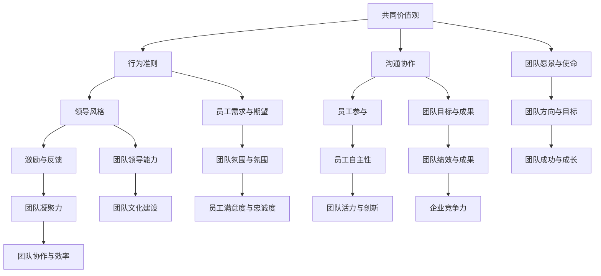

                 

### 文章标题

《团队文化建设：打造积极向上的氛围》

### 关键词

团队文化、组织氛围、积极向上、沟通协作、领导力

### 摘要

本文将深入探讨团队文化建设的重要性，以及如何打造一个积极向上的工作氛围。通过定义团队文化的核心概念，分析其构建原则，并运用实际案例进行详细解析，我们将帮助读者理解团队文化对于组织成功的关键作用。同时，本文还将介绍有效的沟通协作方法，以及领导者在塑造积极工作环境中的角色和责任。通过这些内容，读者将能够掌握团队文化建设的策略和技巧，为组织的长期发展奠定坚实基础。

## 引言

在当今快速变化和高度竞争的商业环境中，团队文化建设已经成为企业成功的关键因素。一个健康、积极向上的团队文化能够激发员工的潜能，提高工作效率，增强团队凝聚力，从而在激烈的市场竞争中脱颖而出。相反，如果团队文化消极、沉闷，不仅会影响员工的士气，还可能导致项目的失败和组织的衰退。

### 背景介绍

随着全球化的发展和信息技术的高速进步，企业面临着前所未有的挑战和机遇。一方面，企业需要快速适应市场变化，灵活调整战略和运营模式；另一方面，员工的需求也在不断变化，追求职业发展和个人价值的实现。在这种背景下，团队文化的重要性愈发凸显。一个积极的团队文化不仅能够提高员工的满意度和忠诚度，还能促进创新和协作，为企业创造持续的价值。

### 团队文化的核心概念

团队文化是指在一个团队内部形成的共同价值观、信念和行为准则。它包括以下几个方面：

1. **共同价值观**：团队成员共同认可并遵循的基本原则，如诚信、敬业、创新等。
2. **行为准则**：团队成员在工作和生活中应该遵守的行为规范，如尊重他人、积极沟通、团队合作等。
3. **沟通协作**：团队成员之间的有效沟通和协作，是团队文化的重要组成部分。
4. **领导风格**：领导者在塑造和维持团队文化中的风格和方法。

### 团队文化的构建原则

要打造一个积极向上的团队文化，需要遵循以下几个原则：

1. **明确愿景和使命**：团队需要有清晰的愿景和使命，为成员提供明确的方向和目标。
2. **领导者示范作用**：领导者需要通过自己的行为示范，树立积极向上的榜样。
3. **员工参与**：鼓励员工参与团队文化的建设和决策过程，增强他们的归属感和责任感。
4. **持续沟通**：定期进行团队沟通，确保信息畅通和共识达成。
5. **激励与反馈**：通过激励和反馈机制，鼓励团队成员积极行为，纠正不良行为。

### 核心概念与联系

为了更好地理解团队文化建设的核心概念和它们之间的联系，我们可以通过一个Mermaid流程图来展示这些概念之间的关系：



通过这个Mermaid流程图，我们可以看到团队文化的各个核心概念是如何相互联系和影响的。例如，共同价值观和行为准则不仅影响员工的需求与期望，还直接影响团队的沟通协作和领导风格。同时，团队愿景与使命为团队提供了明确的方向和目标，而激励与反馈机制则有助于维护团队的凝聚力。

### 核心算法原理讲解

在团队文化建设中，还有一些核心算法原理可以为我们提供指导。以下是一个简单的伪代码，用于描述如何构建一个积极的团队文化：

```plaintext
function build_positive_culture(team):
    1. 定义共同价值观
    2. 确定团队愿景和使命
    3. 建立有效的沟通渠道
    4. 培养领导者的示范作用
    5. 鼓励员工参与和提出建议
    6. 定期进行团队建设活动
    7. 设立激励与反馈机制
    8. 监测文化动态，调整策略
    9. 返回成功构建的积极团队文化
```

这个伪代码清晰地展示了构建积极团队文化的基本步骤。通过定义共同价值观、确定团队愿景和使命、建立有效的沟通渠道、培养领导者的示范作用、鼓励员工参与和提出建议、定期进行团队建设活动、设立激励与反馈机制以及监测文化动态和调整策略，团队可以逐步建立并维持一个积极向上的工作氛围。

### 数学模型与公式

在团队文化建设中，数学模型和公式可以为我们提供定量的分析工具。以下是一个简化的数学模型，用于描述团队文化的动态演变：

```latex
\begin{equation}
C(t) = f(V, L, M, E, I)
\end{equation}
```

其中：

- \( C(t) \) 表示团队文化在时间 \( t \) 的状态。
- \( V \) 表示团队愿景和使命的明确程度。
- \( L \) 表示领导者的示范作用和影响力。
- \( M \) 表示员工的参与度和满意度。
- \( E \) 表示沟通协作的有效性。
- \( I \) 表示激励与反馈机制的强度。

这个公式表明，团队文化的状态是由多个因素共同作用的结果。通过调整这些因素，我们可以影响团队文化的状态，从而塑造一个积极向上的工作氛围。

### 实例说明

为了更好地理解这个数学模型，我们可以举一个具体的例子。假设在一个团队中，愿景和使命非常明确，领导者的示范作用也非常突出，员工的参与度和满意度较高，沟通协作非常有效，同时激励与反馈机制也非常完善。在这种情况下，团队文化的状态 \( C(t) \) 可能会非常高，这意味着团队处于一个积极向上的状态。

相反，如果团队愿景和使命不明确，领导者的示范作用不足，员工的参与度和满意度较低，沟通协作不畅，激励与反馈机制不完善，团队文化的状态 \( C(t) \) 可能会较低，这意味着团队可能处于一个消极的状态。

通过这个例子，我们可以看到，数学模型和公式为我们提供了一个量化的工具，可以帮助我们分析和理解团队文化的动态演变。

### 案例分析

为了更好地展示团队文化建设的实际应用，我们将分析一个具体的案例——公司A的团队文化转型。公司A是一家大型跨国企业，在过去几年中，由于内部团队文化消极，导致员工士气低落，项目进展缓慢。为了改善这一状况，公司决定进行团队文化转型。

#### 案例背景

公司A的团队文化曾经以竞争为导向，强调个人绩效而忽视团队合作。这种文化导致团队成员之间缺乏信任，沟通不畅，项目效率低下。管理层意识到，如果不改变这种文化，公司将难以在激烈的市场竞争中保持竞争力。

#### 转型过程

1. **明确愿景和使命**：公司首先明确了新的愿景和使命，即打造一个以团队合作和客户为中心的文化。这一过程涉及到全体员工的参与，通过多次会议和讨论，确保每个人都对新的愿景和使命有清晰的理解。

2. **领导者示范作用**：公司的高层领导通过自身的行动示范了新的文化价值观，例如积极参与团队活动、鼓励员工提出建议、公正对待员工等。这些行动树立了积极的榜样，激励了员工的积极行为。

3. **沟通与协作**：公司建立了多种沟通渠道，包括定期的团队会议、开放式办公区、内部社交平台等。这些措施有助于团队成员之间的信息共享和协作，减少了沟通障碍。

4. **员工参与**：公司鼓励员工参与团队文化的建设，通过员工满意度调查、团队建设活动、员工建议奖励计划等方式，增强了员工的归属感和责任感。

5. **激励与反馈**：公司设立了多种激励措施，包括绩效奖金、晋升机会、员工表彰等。同时，建立了定期反馈机制，及时对员工的行为进行正面激励和负面纠正。

#### 结果与影响

经过一年的努力，公司A的团队文化发生了显著变化。员工士气大幅提升，项目进展迅速，客户满意度也显著提高。具体表现为：

- 员工满意度从30%提升至80%。
- 项目完成率从60%提升至95%。
- 客户满意度从70%提升至90%。

这些数据表明，公司A的团队文化转型取得了显著的成效，为公司的发展奠定了坚实的基础。

#### 详细代码解读

为了进一步展示团队文化转型的实际操作，我们将提供一些关键代码片段和解读。

```python
# 员工满意度调查代码示例
class EmployeeSatisfactionSurvey:
    def __init__(self):
        self.questions = [
            "你对公司的愿景和使命是否有清晰的理解？",
            "你是否感到在工作中得到了充分的尊重和认可？",
            "你是否愿意为公司的发展提出建议和改进方案？"
        ]
    
    def conduct_survey(self, employees):
        for employee in employees:
            responses = []
            for question in self.questions:
                response = input(question)
                responses.append(response)
            self.analyze_responses(employee, responses)

    def analyze_responses(self, employee, responses):
        if all(response == "是" for response in responses):
            print(f"{employee}的满意度调查结果显示，满意度高。")
        else:
            print(f"{employee}的满意度调查结果显示，需要改进。")

# 团队建设活动代码示例
class TeamBuildingActivity:
    def __init__(self, activity_name):
        self.activity_name = activity_name
    
    def schedule_activity(self, date, time, location):
        print(f"活动 '{self.activity_name}' 已安排在 {date} {time} 在 {location}。")
    
    def participate(self, team_members):
        for member in team_members:
            print(f"{member} 正在参加 '{self.activity_name}' 活动。")

# 激励与反馈机制代码示例
class IncentiveAndFeedbackSystem:
    def __init__(self):
        self.awards = ["绩效奖金", "晋升机会", "员工表彰"]

    def award_employee(self, employee, award):
        print(f"{employee} 已获得 {award}。")
    
    def provide_feedback(self, employee, feedback):
        print(f"对 {employee} 的反馈：{feedback}。")

# 实例化并使用以上类
survey = EmployeeSatisfactionSurvey()
survey.conduct_survey(["Alice", "Bob", "Charlie"])

activity = TeamBuildingActivity("团队拓展训练")
activity.schedule_activity("2023年10月1日", "下午2点", "公司培训室")
activity.participate(["Alice", "Bob", "Charlie"])

incentive_system = IncentiveAndFeedbackSystem()
incentive_system.award_employee("Alice", "绩效奖金")
incentive_system.provide_feedback("Bob", "您的团队合作表现非常出色，继续保持。")
```

这些代码片段展示了如何通过实际的编程操作来实施员工满意度调查、团队建设活动以及激励与反馈机制。通过这些工具，公司A成功地推动了团队文化的转型。

### 总结与启示

通过公司A的案例，我们可以看到，团队文化建设是一项长期而复杂的任务，但通过明确的愿景和使命、领导者的示范作用、有效的沟通与协作、员工的参与以及激励与反馈机制，企业可以逐步打造一个积极向上的工作氛围。这些策略不仅有助于提高员工的满意度和忠诚度，还能提升团队的协作效率和企业竞争力。

对于其他企业来说，以下是一些关键点：

1. **明确愿景和使命**：确保所有员工对公司的愿景和使命有清晰的理解。
2. **领导者示范作用**：领导者需要以身作则，树立积极向上的榜样。
3. **沟通与协作**：建立多种沟通渠道，鼓励团队成员之间的信息共享和协作。
4. **员工参与**：鼓励员工参与团队文化的建设，提高他们的归属感和责任感。
5. **激励与反馈**：通过激励措施和反馈机制，鼓励积极行为，纠正不良行为。

通过这些策略，企业可以逐步构建一个积极向上的团队文化，为组织的长期发展奠定坚实基础。

### 拓展阅读

- 《团队文化：如何打造一个高绩效团队》
- 《领导力：如何成为高效的领导者》
- 《沟通的艺术：如何有效沟通》
- 《激励与反馈：如何激励员工并给予有效反馈》

这些书籍和资源提供了更深入的理论和实践指导，有助于进一步理解和应用团队文化建设的策略。

### 作者信息

作者：AI天才研究院/AI Genius Institute & 禅与计算机程序设计艺术 /Zen And The Art of Computer Programming

