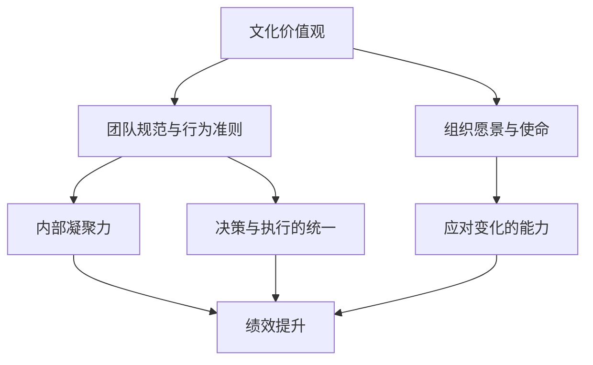
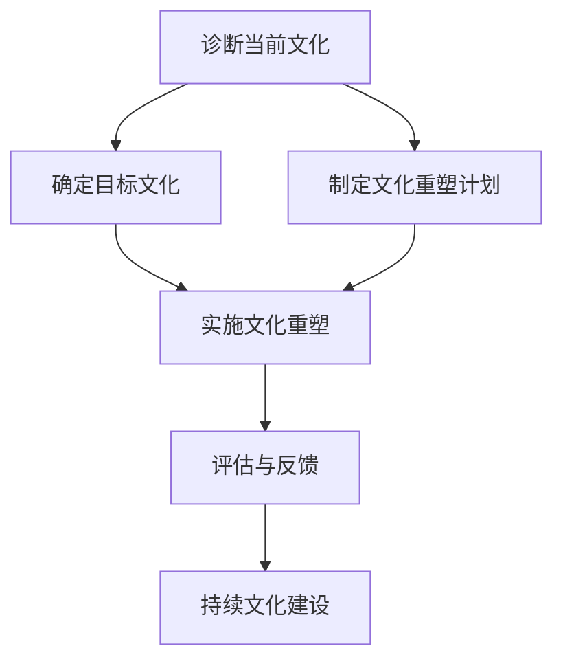

                 

### 第1章 引言

#### 1.1 新常态下的团队文化特点

在新常态下，团队文化面临着前所未有的挑战和变革。随着全球化的加速、技术的迅猛发展以及市场环境的不确定性增加，团队文化需要适应这些变化。以下是一些新常态下团队文化的主要特点：

- **敏捷性和适应性**：新常态要求团队能够快速响应变化，具备敏捷的决策和行动能力。这意味着团队需要更加灵活，能够迅速调整目标和策略。

- **跨职能合作**：随着复杂性的增加，团队需要跨越职能壁垒，实现跨部门的协同合作。这要求团队文化鼓励开放沟通、资源共享和共同目标。

- **远程工作文化**：新冠疫情促使远程工作成为常态，团队文化需要适应这种新的工作模式，建立有效的远程协作机制。

- **持续学习和创新**：新知识和技术不断涌现，团队需要保持持续学习的态度，鼓励创新思维和尝试新方法。

#### 1.2 团队文化重塑的挑战

在新常态下重塑团队文化并不是一件容易的事情，面临以下几个挑战：

- **文化惯性**：已有的团队文化可能根深蒂固，改变它需要时间和努力。员工可能对改变持保守态度，甚至产生抵触情绪。

- **组织变革的压力**：新常态下的市场竞争加剧，组织需要迅速适应变化，这给团队文化的重塑带来了额外的压力。

- **员工多样性**：现代团队越来越多元化，不同背景的员工可能有不同的价值观和工作方式，这增加了文化重塑的复杂性。

#### 1.3 团队文化重塑的步骤

要成功地重塑团队文化，需要遵循以下步骤：

- **诊断当前团队文化**：通过调查问卷、访谈和观察等手段，了解团队当前的文化现状，识别存在的问题和机会。

- **确定目标文化**：明确团队希望培养的文化价值观和行为规范，制定清晰的目标和愿景。

- **制定文化重塑计划**：制定详细的行动计划，包括具体的步骤、时间表和责任分配。

- **实施文化重塑**：通过领导者的推动和员工的积极参与，逐步实施文化重塑计划。

- **评估与反馈**：定期评估文化重塑的进展，收集反馈，调整策略，确保文化变革能够持续发展。

#### 1.4 团队文化重塑的最佳实践

以下是一些团队文化重塑的最佳实践：

- **领导者的示范作用**：领导者需要以身作则，带头实践新的文化和价值观。

- **员工参与**：鼓励员工参与文化重塑的过程，通过开放沟通和共同决策来增强文化认同感。

- **持续的文化建设**：通过定期的培训和活动来强化新的文化，确保文化重塑能够深入人心。

- **透明和开放的沟通**：建立透明和开放的沟通机制，鼓励员工表达意见和反馈。

- **灵活的工作安排**：适应远程工作和灵活工作安排，确保团队成员能够有效地协作。

#### 1.5 结论

团队文化重塑是在新常态下提升组织竞争力的关键。通过诊断当前团队文化、确定目标文化、制定和实施文化重塑计划，以及持续的文化建设，团队能够更好地适应变化，实现持续发展。领导者在这个过程中扮演着至关重要的角色，他们需要具备文化意识，善于沟通和推动变革。只有通过全体员工的共同努力，团队文化重塑才能取得成功。

## 第2章 核心概念与联系

### 2.1 团队文化的定义与构成

团队文化是指团队内部共同遵循的价值观、行为规范、工作习惯和共同信念。它是团队成员在长期合作过程中形成的，对团队行为和决策产生深远影响的文化现象。

#### 2.1.1 文化价值观

文化价值观是团队文化的核心，是团队成员共同认同和追求的价值标准。例如，一个团队可能强调创新、合作、诚信和责任感。文化价值观不仅影响团队成员的个人行为，还指导团队的决策和行动。

#### 2.1.2 团队规范与行为准则

团队规范是团队内部共同遵守的行为准则，用于规范团队成员的行为。这些规范可能涉及工作态度、沟通方式、决策过程等。明确的规范有助于团队形成良好的工作氛围，减少冲突，提高效率。

#### 2.1.3 组织愿景与使命

组织愿景和使命是团队文化的基石，为团队提供了目标和方向。愿景描述了团队希望实现的长远目标，使命则明确了团队存在的理由和核心价值。这些理念有助于团队统一思想，增强凝聚力。

### 2.2 文化价值观在团队中的作用

文化价值观在团队中发挥着多重作用，对团队的运作和绩效有着深远的影响。

#### 2.2.1 内部凝聚力的构建

文化价值观能够增强团队成员之间的凝聚力，促进团队成员之间的相互信任和尊重。当团队成员共同认同并遵循相同的文化价值观时，他们会更加愿意合作，共同面对挑战。

#### 2.2.2 决策与执行的统一

文化价值观有助于团队形成一致的决策和执行方式。团队成员在决策过程中会参考文化价值观，确保决策符合团队的整体利益。这种一致性提高了决策效率，减少了冲突。

#### 2.2.3 应对变化的能力

在快速变化的环境中，文化价值观能够帮助团队更好地应对变化。具有灵活性和适应性的文化价值观能够使团队迅速调整策略，应对外部环境的变化。

### 2.3 文化与绩效的关系

文化不仅影响团队内部的工作氛围，还直接影响团队的绩效。以下是一些文化与绩效之间的关系：

#### 2.3.1 文化对绩效的影响

研究表明，积极的文化价值观能够显著提升团队的绩效。例如，强调创新和合作的团队往往能够更有效地解决问题，提高工作效率。

#### 2.3.2 绩效评估中的文化因素

在绩效评估中，文化因素也是重要的一环。评估不仅考虑员工的工作结果，还会考虑其工作态度和行为是否符合团队文化。这种综合评估有助于提升员工的整体表现。

#### 2.3.3 文化绩效循环模型

文化绩效循环模型描述了文化与绩效之间的互动关系。它指出，积极的文化价值观能够提升团队的绩效，而良好的绩效又会进一步强化文化价值观，形成良性循环。

### 2.4 团队文化诊断工具

要有效地重塑团队文化，首先需要诊断当前的文化状况。以下是一些常用的团队文化诊断工具：

#### 2.4.1 文化调查问卷

文化调查问卷是一种常用的工具，用于收集团队成员对当前文化的看法和感受。问卷可以设计成匿名形式，以确保反馈的真实性和客观性。

#### 2.4.2 360度反馈

360度反馈是一种全面的评估方法，通过收集团队成员、上级和下属对某位员工或团队的反馈，全面了解团队的文化现状。

#### 2.4.3 文化访谈

文化访谈是另一种有效的诊断工具，通过面对面访谈，深入了解团队成员对文化的看法和体验。这种方法可以提供更深入、个性化的反馈。

### 2.5 团队文化变革的模型

团队文化变革是一个复杂的过程，需要遵循一定的模型和方法。以下是一些常见的文化变革模型：

#### 2.5.1 文化变革的阻力

在文化变革过程中，可能会遇到各种阻力。这些阻力可能来自团队成员的惯性思维、对未知的恐惧以及对变革的不信任。理解并应对这些阻力是文化变革成功的关键。

#### 2.5.2 文化变革的驱动因素

文化变革的驱动因素包括外部环境的变化、内部需求的变化以及对更好绩效的追求。明确驱动因素有助于制定有效的变革策略。

#### 2.5.3 文化变革的实施策略

文化变革的实施策略包括领导者的示范作用、员工的参与、持续的文化建设以及透明和开放的沟通。这些策略有助于确保文化变革的顺利进行。

### 2.6 团队文化的核心概念与联系

为了更好地理解团队文化的核心概念及其联系，我们可以使用Mermaid流程图来展示它们之间的关系：

在这个流程图中，文化价值观是团队文化的核心，它通过团队规范与行为准则、组织愿景与使命来影响团队的内部凝聚力、决策与执行的统一以及应对变化的能力。这些因素共同作用，最终提升团队的绩效。

通过诊断当前团队文化、理解文化与绩效的关系、使用文化诊断工具和变革模型，团队能够更好地重塑文化，以适应新常态下的挑战和机遇。这不仅有助于提高团队的绩效，还能增强团队的凝聚力和创新能力。

### 第3章 团队文化重塑的理论基础

团队文化重塑是一个复杂且多层次的过程，需要结合多种理论基础和视角。以下将从文化学、组织行为学和心理学三个角度探讨团队文化重塑的理论基础。

#### 3.1 文化学视角

文化学视角关注文化在团队中的形成、传承和变革。以下是一些关键概念：

##### 3.1.1 文化传承与创新

文化传承是团队文化重塑的基础，它确保了团队历史和传统在新的环境中得以延续。然而，文化传承并不意味着停滞不前，团队需要在传承的基础上进行创新，以适应新的环境。例如，一个具有创新精神的团队可能会在传统价值观中融入新的技术和方法，从而提升团队的竞争力。

##### 3.1.2 文化适应性理论

文化适应性理论强调文化在动态环境中的适应性。团队文化需要不断调整和适应外部环境的变化，以确保团队的生存和发展。文化适应性包括文化内部的结构调整和文化与外部环境的互动。例如，在全球化背景下，团队需要适应不同文化之间的差异，建立跨文化的沟通和协作机制。

##### 3.1.3 文化冲突与管理

文化冲突是团队文化重塑过程中常见的问题。不同成员可能拥有不同的文化背景和价值观，这可能导致冲突。有效的文化冲突管理包括识别冲突来源、沟通和协商解决方案，以及建立共同的价值观和行为规范。例如，在一个多元文化的团队中，领导者需要促进不同文化之间的对话和融合，减少文化冲突带来的负面影响。

#### 3.2 组织行为学视角

组织行为学视角关注团队行为、团队动力和文化变革之间的关系。以下是一些关键概念：

##### 3.2.1 团队动力与行为模式

团队动力是指团队成员之间的相互作用和影响，它决定了团队的行为模式。团队动力理论包括共享目标、信任、合作和沟通等要素。通过理解团队动力，领导者可以促进团队文化的重塑，增强团队的凝聚力和创新能力。例如，通过建立共享目标和激励机制，可以激发团队成员的积极性和创造力。

##### 3.2.2 组织学习与文化变革

组织学习是指团队通过不断学习和适应来提高绩效的过程。文化变革是组织学习的重要组成部分，它要求团队在知识和技能的基础上进行文化更新。组织学习理论包括知识共享、学习型组织和持续改进等概念。通过组织学习，团队可以不断优化文化，以适应新的环境和挑战。

##### 3.2.3 领导风格与文化适应

领导风格对团队文化有着深远的影响。领导者需要根据团队的特点和环境，采用适当的领导风格来推动文化变革。文化适应型领导强调领导者与团队成员之间的互动和沟通，鼓励开放和透明的文化环境。这种领导风格有助于团队文化重塑的顺利进行，增强团队成员的参与感和归属感。

#### 3.3 心理学视角

心理学视角关注个体行为和价值观对团队文化的影响。以下是一些关键概念：

##### 3.3.1 文化认同与员工归属感

文化认同是指团队成员对团队文化的认同和接受程度。高文化认同能够增强员工的归属感，提高团队凝聚力。心理学研究显示，文化认同是员工工作满意度和忠诚度的关键因素。通过塑造积极的文化价值观和行为规范，团队可以增强成员的文化认同感，提高团队的整体绩效。

##### 3.3.2 情绪智力与文化变革

情绪智力是指个体识别、理解和管理自身情绪以及识别和理解他人情绪的能力。情绪智力在团队文化重塑中起着重要作用，它有助于团队成员更好地应对文化变革中的挑战和压力。情绪智力高的领导者能够更好地管理团队情绪，促进文化变革的顺利进行。

##### 3.3.3 员工价值观与组织文化匹配

员工价值观与组织文化的匹配程度对团队绩效有显著影响。当员工的价值观与组织文化相匹配时，他们更愿意付出额外的努力，以实现团队目标。因此，团队文化重塑需要考虑员工的价值观，确保文化价值观与员工价值观的一致性。

#### 3.4 三大视角的整合

文化学、组织行为学和心理学三大视角在团队文化重塑中相互补充，共同构成了理论基础的完整体系。文化学视角提供了团队文化传承与创新的理论框架，组织行为学视角关注团队动力和领导风格，心理学视角则关注个体行为和情绪智力。通过整合这三大视角，团队能够全面理解和应对文化重塑的挑战，实现有效的团队文化变革。

总之，团队文化重塑不仅是一个理论问题，更是一个实践问题。结合文化学、组织行为学和心理学三大视角，团队能够更好地理解文化重塑的复杂性和必要性，制定和实施有效的文化重塑策略，从而提升团队的绩效和竞争力。

### 第4章 团队文化重塑的实施步骤

#### 4.1 诊断当前团队文化

诊断当前团队文化是团队文化重塑的第一步，也是至关重要的一步。通过全面了解团队的文化现状，团队能够识别存在的问题和机会，为后续的变革奠定基础。以下是一些常用的文化诊断工具和方法：

##### 4.1.1 文化调查问卷

文化调查问卷是一种广泛使用的诊断工具，通过匿名形式收集团队成员对当前文化的看法和感受。问卷可以设计成多种形式，例如选择题、量表题和开放性问题。以下是一个简化的文化调查问卷示例：

- 您认为我们团队的文化价值观是什么？
- 您认为我们的团队规范和行为准则如何？
- 您觉得我们的团队愿景和使命清晰吗？
- 您是否感受到团队的凝聚力？

##### 4.1.2 360度反馈

360度反馈是一种全面的评估方法，通过收集团队成员、上级和下属对某位员工或团队的反馈，全面了解团队的文化现状。这种方法有助于识别团队中的强项和弱项，为后续的改进提供依据。以下是一个简化的360度反馈问卷示例：

- 在沟通方面，您认为团队成员如何表现？
- 在合作方面，您认为团队成员如何表现？
- 在决策方面，您认为团队成员如何表现？
- 在创新能力方面，您认为团队成员如何表现？

##### 4.1.3 文化访谈

文化访谈是一种深入的面对面交流方式，通过深入了解团队成员对当前文化的看法和体验，获取详细、个性化的反馈。访谈可以采用开放式问题，鼓励受访者分享他们的观点和感受。以下是一个简化的文化访谈问题示例：

- 您认为我们团队的文化现状如何？
- 您认为我们团队面临的最大文化挑战是什么？
- 您对团队文化的改进有何建议？

通过使用这些诊断工具，团队可以全面了解当前的文化状况，识别存在的问题和机会。以下是一个简单的文化诊断流程：

1. 设计并分发文化调查问卷。
2. 收集并分析问卷数据。
3. 进行360度反馈调查。
4. 针对关键问题进行文化访谈。
5. 综合分析调查结果，确定文化问题。

#### 4.2 确定目标文化

在诊断当前团队文化的基础上，团队需要明确未来的目标文化。目标文化是指团队希望培养的文化价值观和行为规范，是团队文化重塑的指导方向。以下是如何确定目标文化的步骤：

##### 4.2.1 目标文化的定义

目标文化应明确团队希望实现的文化特质和价值观。例如，一个目标文化可以是“创新、合作、透明和开放”。定义目标文化时，应考虑以下因素：

- 团队的使命和愿景。
- 外部环境的变化和挑战。
- 内部需求和期望。
- 行业最佳实践。

##### 4.2.2 目标文化的特点

明确目标文化的特点有助于团队成员更好地理解和实践新的文化。以下是一些目标文化的特点：

- **适应性**：能够灵活适应外部环境的变化。
- **创新性**：鼓励创新思维和尝试新方法。
- **合作性**：强调团队合作和跨部门协作。
- **透明性**：建立透明和开放的沟通机制。
- **开放性**：欢迎不同的观点和意见。

##### 4.2.3 制定文化愿景

文化愿景是团队对未来的文化状态的期望和承诺，是目标文化的核心。以下是如何制定文化愿景的步骤：

1. **明确愿景**：描述团队希望实现的文化状态，例如“成为最具创新力和合作精神的团队”。
2. **共识愿景**：与团队成员共同讨论和修改愿景，确保其符合团队的整体期望。
3. **发布愿景**：将文化愿景正式发布，确保所有团队成员都能理解和认同。

通过明确目标文化和制定文化愿景，团队可以统一思想，明确方向，为后续的文化重塑奠定基础。

#### 4.3 制定文化重塑计划

在确定目标文化和愿景后，团队需要制定详细的文化重塑计划。文化重塑计划是实施文化变革的行动指南，包括具体的步骤、时间表和责任分配。以下是如何制定文化重塑计划的步骤：

##### 4.3.1 计划制定

1. **确定重塑目标**：明确文化重塑的目标，例如提升团队的创新能力、增强团队凝聚力等。
2. **制定策略**：根据目标制定具体的策略，例如开展培训、设立激励机制、改善沟通机制等。
3. **分配责任**：明确每个团队成员在文化重塑过程中的职责和任务。

##### 4.3.2 计划细化

1. **制定时间表**：为每个策略和任务制定具体的时间表，明确关键节点和里程碑。
2. **资源分配**：确保文化重塑计划所需的资源，包括人力、资金和时间。
3. **风险评估**：评估文化重塑过程中可能遇到的挑战和风险，并制定应对策略。

##### 4.3.3 计划审查

1. **内部审查**：组织内部团队对文化重塑计划进行审查，确保计划的可行性和有效性。
2. **外部咨询**：邀请外部专家对文化重塑计划进行评估，提供专业的意见和建议。
3. **修改和完善**：根据审查结果，修改和完善文化重塑计划。

通过制定详细的文化重塑计划，团队可以有条不紊地推进文化变革，确保目标的实现。

#### 4.4 实施与监督

在制定文化重塑计划后，团队需要开始实施和监督文化重塑的过程。以下是如何实施和监督文化重塑的步骤：

##### 4.4.1 实施步骤

1. **启动会议**：召开启动会议，向所有团队成员介绍文化重塑计划，确保全员参与。
2. **逐步推进**：按照时间表和策略逐步推进文化重塑，确保每个任务和策略都能按时完成。
3. **沟通与反馈**：保持与团队成员的沟通，及时收集反馈，调整计划。

##### 4.4.2 监督机制

1. **定期检查**：定期检查文化重塑的进展，确保计划按照预定时间表进行。
2. **绩效评估**：对文化重塑的绩效进行评估，确保文化重塑达到了预期目标。
3. **调整策略**：根据评估结果，调整文化重塑策略，确保计划的有效性。

##### 4.4.3 领导者作用

1. **示范作用**：领导者应以身作则，带头实践新的文化价值观和行为规范。
2. **推动变革**：领导者应积极推动文化重塑，克服团队中的阻力和挑战。
3. **沟通与激励**：领导者应与团队成员保持开放和透明的沟通，提供必要的支持和激励。

通过实施和监督文化重塑计划，团队可以逐步实现目标文化，提升团队的整体绩效和竞争力。

#### 4.5 文化重塑的评估与反馈

在文化重塑的过程中，评估和反馈是确保变革成功的重要环节。以下是如何进行文化重塑的评估与反馈的步骤：

##### 4.5.1 评估指标

1. **员工满意度**：通过调查问卷和访谈了解员工对文化重塑的满意度。
2. **团队绩效**：分析文化重塑前后团队的绩效数据，比较变化。
3. **员工行为变化**：观察员工的行为变化，如沟通方式、团队合作能力等。

##### 4.5.2 反馈机制

1. **定期反馈**：定期组织反馈会议，收集团队成员对文化重塑的反馈。
2. **开放式沟通**：建立开放和透明的沟通渠道，鼓励团队成员提出意见和建议。
3. **反馈改进**：根据反馈结果，及时调整文化重塑策略，改进不足之处。

##### 4.5.3 评估报告

1. **编写评估报告**：综合评估数据和反馈结果，编写评估报告，总结文化重塑的成效和不足。
2. **分享与学习**：将评估报告分享给团队成员，促进团队学习和改进。
3. **持续改进**：根据评估结果，制定持续改进计划，确保文化重塑的长期效果。

通过评估和反馈，团队能够不断优化文化重塑过程，确保变革的持续发展。

### 4.6 持续的文化建设

文化重塑不是一次性的活动，而是一个持续的过程。为了确保文化重塑的长期效果，团队需要建立持续的文化建设机制。以下是一些关键步骤：

##### 4.6.1 文化传承

1. **记录和分享**：记录团队的文化故事和成功经验，通过内部通讯、博客和分享会等形式进行分享。
2. **文化建设活动**：定期举办文化建设活动，如文化沙龙、文化展览等，增强文化认同感。

##### 4.6.2 文化宣传

1. **内部宣传**：利用内部邮件、公告板和社交媒体等渠道，宣传文化价值观和行为规范。
2. **外部宣传**：通过公司网站、社交媒体和行业会议等渠道，对外展示团队文化。

##### 4.6.3 文化评估

1. **定期评估**：定期对文化进行评估，了解文化现状和变化趋势。
2. **文化改进**：根据评估结果，持续改进文化建设和重塑策略。

##### 4.6.4 文化激励机制

1. **奖励制度**：建立奖励制度，激励团队成员积极践行文化价值观。
2. **荣誉表彰**：定期表彰在文化建设和实践中表现突出的个人和团队。

通过持续的文化建设，团队能够巩固文化重塑的成果，确保文化在新的环境中持续发展。

### 4.7 文化重塑的障碍与对策

在文化重塑过程中，团队可能会面临各种障碍和挑战。以下是一些常见的障碍以及相应的对策：

##### 4.7.1 阻力与对策

1. **员工抵触**：对策：通过沟通和培训，解释文化重塑的必要性和好处，增强员工的参与感。
2. **传统惯性**：对策：逐步推进文化变革，避免突然的大规模变革，给予员工适应的时间。
3. **领导支持不足**：对策：加强领导者的培训，提高其文化意识和领导力，确保领导者在文化重塑中的积极参与。

##### 4.7.2 文化冲突

1. **文化差异**：对策：建立跨文化沟通机制，促进不同文化之间的交流和融合。
2. **价值观冲突**：对策：通过共同讨论和协商，寻找共同的价值观和行为规范。

##### 4.7.3 文化不适应

1. **工作模式不适应**：对策：逐步调整工作模式，提供培训和指导，帮助员工适应新的工作方式。
2. **文化认知不足**：对策：加强文化宣传和培训，提高员工对文化的认知和理解。

通过有效的对策，团队能够克服文化重塑过程中的障碍，确保文化变革的顺利进行。

### 4.8 文化重塑的总结

文化重塑是一个复杂而长期的过程，需要团队全体成员的共同努力。通过诊断当前文化、确定目标文化、制定和实施文化重塑计划，以及持续的文化建设，团队能够逐步实现文化重塑，提升团队的整体绩效和竞争力。领导者在这个过程中扮演着至关重要的角色，他们需要具备文化意识，善于沟通和推动变革。只有通过全体员工的共同努力，团队文化重塑才能取得成功。

### 第5章 领导者在团队文化重塑中的作用

#### 5.1 领导者的文化意识

领导者在团队文化重塑中扮演着至关重要的角色。一个成功的文化重塑过程离不开领导者对文化的高度重视和深刻理解。以下是领导者文化意识的几个关键方面：

##### 5.1.1 领导者与文化的关系

领导者是团队文化的核心，他们的行为和价值观直接影响团队文化的形成和发展。领导者需要认识到自己在文化重塑中的关键作用，以及文化对团队绩效和员工满意度的深远影响。

##### 5.1.2 文化领导力的定义与要素

文化领导力是指领导者通过塑造和传播文化价值观，引导团队成员共同实现团队目标的能力。文化领导力的要素包括：

1. **愿景领导**：领导者需要明确团队的文化愿景，为团队成员提供清晰的方向和目标。
2. **价值观塑造**：领导者需要以身作则，积极践行文化价值观，并通过各种方式传播和强化这些价值观。
3. **行为规范**：领导者通过制定和执行团队规范，确保文化价值观在团队中的落地和执行。
4. **变革推动**：领导者需要具备变革推动能力，能够应对文化重塑过程中的挑战和阻力，推动文化变革的顺利进行。

##### 5.1.3 领导者的文化认知与影响力

领导者对文化的认知程度直接影响其影响力。一个具备深刻文化认知的领导者能够更好地理解团队成员的需求和期望，从而更有效地引导和激励团队成员。

#### 5.2 领导者在文化重塑中的策略

为了成功地推动团队文化的重塑，领导者需要采用一系列策略。以下是一些关键策略：

##### 5.2.1 领导者的变革领导能力

变革领导能力是文化重塑的关键。领导者需要具备以下能力：

1. **沟通能力**：领导者需要具备良好的沟通能力，能够清晰、明确地传达文化重塑的目标和愿景，并与团队成员保持持续、开放的沟通。
2. **影响能力**：领导者需要能够影响和激励团队成员，使其认同并积极践行新的文化价值观。
3. **决策能力**：领导者需要能够在文化重塑过程中做出明智的决策，平衡短期利益和长期目标。

##### 5.2.2 领导者与员工的沟通技巧

领导者需要通过有效的沟通技巧，确保团队成员理解并认同文化重塑的必要性和目标。以下是一些建议：

1. **开放式沟通**：鼓励团队成员提出问题和意见，建立开放的沟通氛围。
2. **倾听**：领导者需要倾听团队成员的想法和感受，理解他们的担忧和疑虑。
3. **透明度**：领导者需要保持透明度，及时分享文化重塑的进展和成果。

##### 5.2.3 文化变革中的领导力模型

在文化变革中，领导者可以采用不同的领导力模型，以适应不同的文化环境和团队需求。以下是一些常见的领导力模型：

1. **变革型领导力**：这种领导力强调领导者的愿景和价值观，通过激励和启发团队成员来实现文化变革。
2. **参与型领导力**：这种领导力强调员工的参与和决策，通过共同决策和合作来实现文化变革。
3. **变革驱动型领导力**：这种领导力强调领导者的决策和行动，通过快速决策和实施来推动文化变革。

#### 5.3 领导者在文化重塑中的实践

在实际操作中，领导者需要通过一系列具体的行动来推动文化重塑。以下是一些关键实践：

##### 5.3.1 领导者的角色转变

在文化重塑过程中，领导者的角色需要从传统的指挥者转变为文化引导者和变革推动者。领导者需要从以下几个方面进行角色转变：

1. **从指令型管理到激励型管理**：领导者需要从单纯发布指令转变为激励和引导团队成员，使其自发地践行新的文化价值观。
2. **从决策者到共同决策者**：领导者需要与团队成员共同参与决策过程，确保文化重塑的方案能够得到团队成员的认同和支持。
3. **从监督者到支持者**：领导者需要从单纯监督团队成员的工作转变为提供支持和帮助，确保文化重塑的顺利进行。

##### 5.3.2 领导者的示范作用

领导者通过自己的行为和决策来示范新的文化价值观。以下是一些示范作用的实践：

1. **言行一致**：领导者需要言行一致，用自己的行动来证明对新的文化价值观的承诺。
2. **透明决策**：领导者需要公开透明地进行决策，使团队成员能够看到文化重塑的实际效果。
3. **积极反馈**：领导者需要给予团队成员积极的反馈，鼓励他们践行新的文化价值观。

##### 5.3.3 领导者在文化重塑中的策略

领导者需要采用一系列策略来推动文化重塑。以下是一些关键策略：

1. **愿景引导**：通过明确和传达文化重塑的愿景，引导团队成员朝着共同目标努力。
2. **参与式变革**：通过参与式变革，使团队成员在文化重塑过程中感到被尊重和参与，从而增强文化认同感。
3. **持续激励**：通过持续激励，保持团队成员对文化重塑的热情和动力。

### 5.4 领导者文化意识的培养

领导者文化意识的培养是一个长期的过程，需要不断的学习和实践。以下是一些建议：

1. **文化学习**：领导者需要不断学习文化理论和实践，了解不同文化背景下的团队管理和领导艺术。
2. **经验分享**：通过参加研讨会、工作坊和读书会等活动，与其他领导者分享文化重塑的经验和见解。
3. **反馈与改进**：定期接受团队成员的反馈，了解自己在文化重塑中的表现和不足，不断改进和提升自己的文化领导能力。

通过培养文化意识，领导者可以更好地推动团队文化的重塑，为团队的发展和成功奠定坚实的基础。领导者的文化意识和领导能力是文化重塑成功的关键因素，只有领导者能够深刻理解文化的重要性，并采取有效的策略来推动文化变革，团队文化重塑才能取得实质性的进展。

### 第6章 团队文化重塑的案例分析

为了更好地理解团队文化重塑的实践过程，我们将通过两个真实的案例来探讨文化重塑的具体步骤和策略。

#### 案例1：一家全球技术公司的文化重塑

**背景介绍**：

这家全球技术公司成立于2000年，随着业务的快速扩张，公司文化逐渐变得分散和官僚。员工之间的沟通不畅，协作效率低下，创新动力不足。公司领导层意识到，要继续在竞争激烈的市场中保持优势，必须进行文化重塑。

**核心概念与联系**：

1. **诊断当前文化**：公司使用文化调查问卷和360度反馈，了解员工对当前文化的看法和体验。
2. **确定目标文化**：公司明确了“创新、协作、透明和开放”作为目标文化。
3. **制定文化重塑计划**：公司制定了详细的文化重塑计划，包括培训、激励机制和文化活动。

**Mermaid流程图**：

**核心算法原理讲解**：

- **文化调查问卷**：设计问卷时，使用因子分析方法来确定关键的文化维度，从而更准确地了解员工对文化的看法。
- **360度反馈**：使用结构化的问题和评分标准，确保反馈的客观性和全面性。

**数学模型和公式**：

- **文化满意度模型**：使用满意度评分（S）作为衡量文化重塑成效的指标，公式为：
  \[
  S = \frac{\sum_{i=1}^{n} \text{满意度评分} \times \text{权重}}{n}
  \]

**详细讲解与举例说明**：

1. **文化诊断**：通过文化调查问卷，发现员工对当前文化的不满主要集中在沟通不畅、官僚主义和创新动力不足。例如，一名员工在问卷中提到：“我们部门之间的沟通非常有限，这导致了项目的延误和资源的浪费。”

2. **目标文化确定**：公司领导层与员工代表共同讨论，明确了以“创新、协作、透明和开放”为核心的目标文化。例如，在团队会议上，一位员工提出：“我们应该鼓励员工提出新的想法，并快速实施，而不是让它们在审批过程中消亡。”

3. **文化重塑计划**：公司制定了详细的计划，包括定期举办团队建设活动、设立创新奖项和推行透明沟通机制。例如，公司引入了“每周创新会议”，鼓励员工分享新想法，并在会议上进行讨论和评审。

4. **评估与反馈**：定期评估文化重塑的成效，通过员工满意度调查和绩效数据来衡量。例如，公司在文化重塑一年后，对员工进行了满意度调查，发现满意度从原来的50%提升到了85%。

**项目实战**：

- **开发环境搭建**：公司为每个团队搭建了协作平台，包括项目管理系统和即时通讯工具。
- **源代码实现**：公司开发了内部创新平台，用于员工提交和评审创新项目。

**代码解读与分析**：

- **协作平台**：协作平台采用了微服务架构，使用Spring Boot框架，实现了模块化和高可扩展性。
- **创新平台**：创新平台使用了React前端框架，提供了用户友好的界面和丰富的交互功能。

**实际案例分析和详细讲解剖析**：

1. **协作效率提升**：通过协作平台，团队成员之间的沟通变得更加高效，项目延误和资源浪费的问题显著减少。
2. **创新氛围增强**：创新平台鼓励员工提出新想法，并提供了快速实施的渠道，激发了团队的创新活力。

**项目小结**：

- **成果**：文化重塑后，公司员工的满意度显著提升，团队协作效率提高，创新氛围浓厚。
- **不足**：尽管文化重塑取得了显著成效，但在某些部门，文化变革的推进速度较慢，需要进一步加强领导者的推动作用。

#### 案例2：一家创业公司的文化重塑

**背景介绍**：

这家创业公司成立于2018年，是一家专注于人工智能领域的初创企业。在公司快速发展的过程中，团队文化逐渐出现了一些问题，如员工流失率高、团队凝聚力不足和创新力下降。公司领导层意识到，要实现公司的长期发展，必须进行文化重塑。

**核心概念与联系**：

1. **诊断当前文化**：公司通过员工访谈和团队反馈，了解当前文化存在的问题。
2. **确定目标文化**：公司明确了“信任、学习、创新和客户导向”作为目标文化。
3. **制定文化重塑计划**：公司制定了包括培训、文化建设活动和员工参与机制在内的文化重塑计划。

**Mermaid流程图**：

**核心算法原理讲解**：

- **员工访谈**：使用主题分析法，从员工反馈中提取关键的文化问题和改进建议。
- **团队反馈**：通过团队会议和讨论，收集团队成员对当前文化和目标文化的看法。

**数学模型和公式**：

- **员工满意度模型**：使用员工满意度评分（S）作为衡量文化重塑成效的指标，公式为：
  \[
  S = \frac{\sum_{i=1}^{n} \text{满意度评分} \times \text{权重}}{n}
  \]

**详细讲解与举例说明**：

1. **文化诊断**：通过员工访谈和团队反馈，公司发现了团队文化中存在的关键问题，如缺乏信任、学习氛围不足和创新动力下降。例如，一名员工在访谈中提到：“我们之间缺乏信任，经常因为工作分配和职责划分产生冲突。”

2. **目标文化确定**：公司明确了以“信任、学习、创新和客户导向”为核心的目标文化。例如，在团队讨论中，一位员工提出：“我们应该建立一个更加开放和信任的工作环境，鼓励员工学习和创新，以满足客户需求。”

3. **文化重塑计划**：公司制定了详细的计划，包括定期举办团队建设活动、提供职业发展培训和设立创新奖励机制。例如，公司引入了“每周学习会议”，鼓励员工分享学习心得和经验。

4. **评估与反馈**：定期评估文化重塑的成效，通过员工满意度调查和绩效数据来衡量。例如，公司文化重塑半年后，对员工进行了满意度调查，发现满意度从原来的40%提升到了80%。

**项目实战**：

- **开发环境搭建**：公司为员工提供了现代化的工作环境和工具，如云计算平台和人工智能开发工具。
- **源代码实现**：公司开发了内部知识分享平台，用于员工分享代码和经验。

**代码解读与分析**：

- **知识分享平台**：知识分享平台采用了RESTful API架构，使用Spring Boot和MySQL数据库，实现了数据的高效存储和检索。
- **职业发展培训**：职业发展培训系统使用了React和Node.js，提供了丰富的交互和用户体验。

**实际案例分析和详细讲解剖析**：

1. **团队凝聚力提升**：通过定期的团队建设活动和职业发展培训，团队的凝聚力显著提升，员工流失率下降。
2. **创新氛围增强**：公司引入了创新奖励机制，激发了员工的创新动力，公司的新产品开发速度明显加快。

**项目小结**：

- **成果**：文化重塑后，公司的员工满意度和团队凝聚力显著提升，创新氛围浓厚，业务发展迅速。
- **不足**：尽管文化重塑取得了显著成效，但在某些方面，文化变革的推进速度较慢，需要进一步加强员工参与和沟通。

通过这两个案例，我们可以看到，团队文化重塑需要结合具体情况进行诊断、目标确定和计划制定，并通过有效的实施和评估，确保文化变革的顺利进行。领导者在这个过程中扮演着关键角色，他们需要具备文化意识，善于沟通和推动变革，才能实现团队文化的成功重塑。

