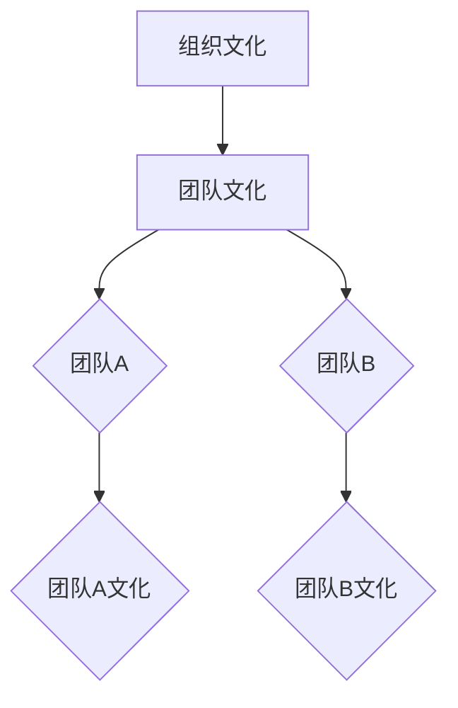
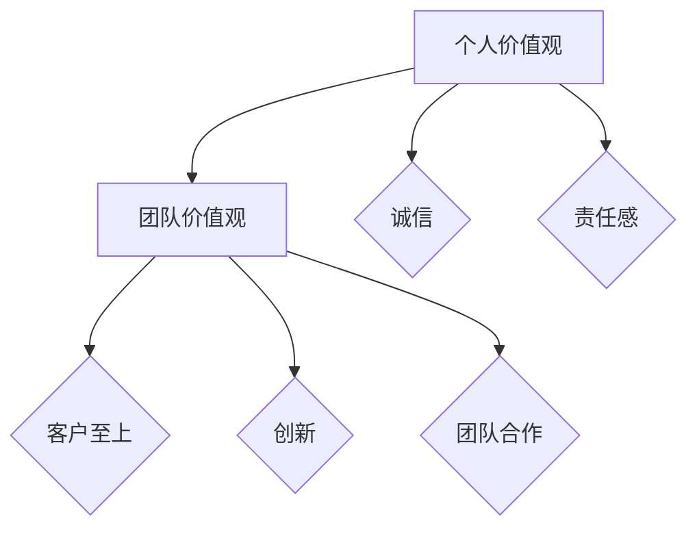
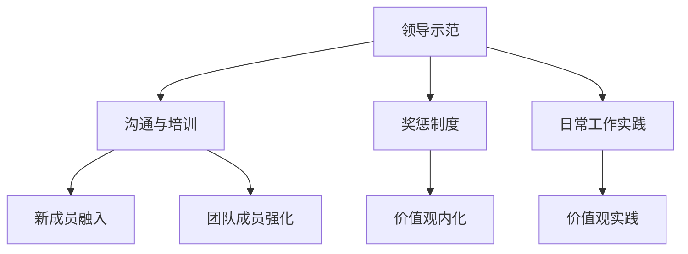

                 

### 文章标题：团队文化：价值观传递的重要性

> **关键词：** 团队文化，价值观，传递，领导力，案例分析，实践方法

> **摘要：** 本文旨在探讨团队文化与价值观的传递重要性，通过背景介绍、核心概念与联系、案例分析、实践方法等多个方面，详细分析团队文化与价值观对组织发展的影响。文章以清晰的逻辑结构和专业的技术语言，为读者提供了全面而深入的理解，有助于提升团队管理和组织效能。

---

### 引言

在当今快速变化和竞争激烈的市场环境中，企业的成功不仅依赖于技术创新和商业模式，更取决于团队文化的建设和价值观的传递。团队文化是一种无形的力量，它影响着团队内部的沟通、协作和决策，进而影响组织的整体效能和创新能力。价值观则是团队文化的核心，是团队成员共同遵守的行为准则和信念体系。

团队文化与价值观的传递对于组织的长远发展至关重要。首先，它能够帮助建立团队内部的认同感和归属感，增强团队成员的凝聚力和忠诚度。其次，明确的价值观能够为团队提供共同的目标和方向，促进团队协作和创新。最后，良好的团队文化和价值观传递还能够提升组织的品牌形象和市场竞争能力。

本文将从以下几个方面进行探讨：
1. 团队文化与价值观的基本概念和重要性。
2. 团队文化与价值观传递的历史和发展。
3. 成功团队文化的案例分析。
4. 团队文化与价值观的实践方法。
5. 团队建设与领导力在价值观传递中的作用。
6. 评估与改进团队文化和价值观传递效果。
7. 总结与未来展望。

### 背景介绍

团队文化（Team Culture）是指在一个团队中形成的共同价值观、信念、行为准则和工作方式的总和。它不仅仅包括团队成员在日常工作中的行为和态度，还包括团队内部的关系、沟通方式和解决问题的方法。团队文化是一种软实力，它在无形中影响着团队的工作效率和创新能力。

价值观（Values）则是团队文化中的核心部分，它代表了团队所推崇的基本原则和行为标准。价值观可以是关于诚信、责任感、创新、客户至上等方面的理念。一个团队如果能够明确并共同遵守这些价值观，就能够形成强大的凝聚力和向心力。

在过去的几十年里，随着全球化和信息化的发展，团队文化和价值观传递逐渐成为组织管理的重要研究领域。许多企业开始重视团队文化的建设和价值观的传递，以提升组织的竞争力和创新能力。例如，谷歌（Google）以其“不作恶”（Don't Be Evil）的价值观闻名，亚马逊（Amazon）强调“以客户为中心”（Customer Obsession）的理念。这些成功的案例表明，团队文化和价值观的传递对于组织的长期成功具有关键作用。

### 核心概念与联系

为了更好地理解团队文化和价值观的传递，我们首先需要了解一些核心概念，并探讨它们之间的关系。

#### 团队文化与组织文化

团队文化是组织文化（Organizational Culture）的一部分。组织文化是指在整个组织中形成的共同价值观、信念和行为准则。团队文化是组织文化在团队层面的具体体现，它受到组织文化的影响，同时也对组织文化产生影响。团队文化与组织文化的联系可以用以下Mermaid流程图表示：



在这个流程图中，组织文化作为整体，通过不同的团队文化在各个团队中体现出来。每个团队的文化又会反过来影响组织文化，形成一个相互影响、相互促进的关系。

#### 价值观的类型

价值观可以分为个人价值观和组织价值观。个人价值观是指团队成员个人所持有的信念和原则，例如诚信、责任感、尊重等。组织价值观则是整个团队或组织所共同认同和遵守的基本原则，例如客户至上、创新、团队合作等。个人价值观和组织价值观之间的关系可以用以下流程图表示：



在这个流程图中，个人价值观通过团队成员之间的互动和交流，逐渐演变为团队共同的价值观。团队价值观不仅受到个人价值观的影响，还受到外部环境和其他团队的影响。

#### 价值观的传递机制

价值观的传递机制是指团队如何将价值观传递给新成员和整个团队。传递机制包括多种方式，如领导示范、沟通与培训、奖惩制度、日常工作中的实践等。以下是价值观传递机制的一个简单流程图：



在这个流程图中，领导示范、沟通与培训和奖惩制度是主要的传递途径，日常工作实践则是价值观内化和强化的关键。

### 核心算法原理讲解

在团队文化和价值观的传递过程中，可以运用一些核心算法原理来优化传递效果。以下是几个关键的算法原理：

#### 1. 社会学习算法

社会学习算法（Social Learning Algorithm）是一种通过观察和模仿他人的行为来学习和适应新环境的算法。在团队文化和价值观的传递中，新成员可以通过观察团队成员的行为来学习组织的价值观和文化。以下是一个简单的伪代码来描述社会学习算法：

```plaintext
function 社会学习算法(新成员, 团队成员):
    for 每个团队成员 do:
        新成员观察团队成员的行为
        新成员记录观察到的行为
        新成员根据记录的行为调整自己的行为
    end for
    新成员内化观察到的价值观和文化
end function
```

#### 2. 强化学习算法

强化学习算法（Reinforcement Learning Algorithm）是一种通过不断试错和反馈来优化行为策略的算法。在团队文化和价值观的传递中，可以通过奖励和惩罚机制来强化团队成员的价值观和行为。以下是一个简单的伪代码来描述强化学习算法：

```plaintext
function 强化学习算法(团队成员, 价值观):
    while 团队成员行为未达到期望 do:
        if 团队成员行为符合价值观 then:
            给予团队成员奖励
        else:
            给予团队成员惩罚
        end if
        更新团队成员的行为策略
    end while
    团队成员内化价值观
end function
```

#### 3. 多层神经网络

多层神经网络（Multilayer Neural Network）是一种模拟人脑信息处理过程的算法，可以用于复杂问题的建模和预测。在团队文化和价值观的传递过程中，可以使用多层神经网络来分析和预测团队成员的行为和价值观的变化。以下是一个简单的伪代码来描述多层神经网络：

```plaintext
function 多层神经网络(输入数据, 价值观):
    初始化神经网络
    for 每层 do:
        对输入数据进行处理
        传递数据到下一层
    end for
    输出结果
    根据输出结果调整神经网络参数
end function
```

### 数学模型和数学公式

在团队文化和价值观的传递过程中，可以使用一些数学模型和公式来量化传递效果。以下是几个常用的数学模型和公式：

#### 1. 巴甫洛夫条件反射模型

巴甫洛夫条件反射模型（Pavlov's Classical Conditioning Model）是一种研究条件反射和刺激-反应关系的模型。在团队文化和价值观的传递中，可以使用该模型来研究价值观的内化和强化过程。以下是一个简化的数学公式：

$$
R(t) = R_0 + k \cdot e^{-\lambda \cdot t}
$$

其中，$R(t)$表示在时间$t$时，团队成员对价值观的内化程度；$R_0$表示初始内化程度；$k$和$\lambda$是模型参数。

#### 2. 埃里克森心理社会发展模型

埃里克森心理社会发展模型（Erik Erikson's Stages of Psychosocial Development Model）是一种研究个体心理和社会发展阶段的模型。在团队文化和价值观的传递中，可以使用该模型来分析团队成员在价值观内化和传递过程中的心理发展。以下是一个简化的数学公式：

$$
M(t) = M_0 + \sum_{i=1}^{n} a_i \cdot f_i(t)
$$

其中，$M(t)$表示在时间$t$时，团队成员的心理成熟度；$M_0$表示初始心理成熟度；$a_i$和$f_i(t)$分别是阶段影响因素和影响函数。

### 代码实现

为了更好地理解和应用团队文化和价值观的传递原理，我们可以使用Python语言来实现一些基本的算法和模型。以下是一个简单的示例代码，展示了如何使用社会学习算法来模拟团队成员的行为调整过程。

```python
import numpy as np

# 定义社会学习算法
def social_learning_algorithm(new_member, team_members):
    for member in team_members:
        new_memberobserve(member)
        new_memberrecord_observation()
        new_memberadjust_behavior()

# 定义观察行为函数
def observe(member):
    # 观察成员行为
    behavior = member行为()
    return behavior

# 定义记录观察函数
def record_observation(behavior):
    # 记录观察到的行为
    pass

# 定义调整行为函数
def adjust_behavior(behavior):
    # 根据观察到的行为调整自己的行为
    pass

# 模拟团队成员行为调整
def simulate_behavior_adjustment(team_members):
    new_member = create_new_member()
    social_learning_algorithm(new_member, team_members)

# 创建新成员函数
def create_new_member():
    # 创建新成员
    pass

# 运行模拟
team_members = [create_member() for _ in range(10)]
simulate_behavior_adjustment(team_members)
```

### 实际案例分析和详细讲解剖析

在探讨团队文化和价值观的传递时，实际案例的分析和讲解能够为理论提供生动的例证。以下将分析两家公司，谷歌（Google）和特斯拉（Tesla），并探讨它们在团队文化和价值观传递方面的成功经验和挑战。

#### 谷歌（Google）

**案例背景：**
谷歌以其独特的团队文化和核心价值观而闻名。谷歌的创始人拉里·佩奇和谢尔盖·布林强调创新、自由和责任感。这些价值观贯穿于谷歌的企业文化中，形成了谷歌独特的团队氛围。

**案例分析：**
1. **核心价值观：** 谷歌的价值观包括“不作恶”（Don't Be Evil）、致力于创新、快速迭代等。这些价值观不仅体现在公司的产品和业务上，还渗透到日常工作和团队协作中。
2. **领导示范：** 谷歌的领导层通过自身的言行，积极示范这些价值观。例如，谷歌的CEO桑达尔·皮查伊经常强调透明度和开放性，鼓励员工提出改进建议。
3. **沟通与培训：** 谷歌定期组织内部培训和研讨会，帮助员工理解和内化公司的核心价值观。新员工在入职培训中也会接触到这些价值观。
4. **奖惩制度：** 谷歌通过绩效评估和奖励机制来强化员工的行为，鼓励那些符合公司价值观的行为。

**成功经验：**
谷歌的团队文化和价值观传递策略成功地提高了员工的满意度和忠诚度，促进了创新和团队协作。这为谷歌在竞争激烈的市场中保持领先地位提供了有力支持。

**挑战与反思：**
尽管谷歌在团队文化和价值观传递方面取得了显著成功，但也面临一些挑战。例如，如何确保不同文化背景的员工能够认同和内化公司的核心价值观，如何在快速扩张的过程中保持团队文化的连续性。

#### 特斯拉（Tesla）

**案例背景：**
特斯拉以其创新的电动车技术而闻名，公司的文化和价值观也受到广泛关注。特斯拉的创始人埃隆·马斯克强调创新、客户至上和可持续发展。

**案例分析：**
1. **核心价值观：** 特斯拉的价值观包括创新、效率、可持续性和客户至上。这些价值观在特斯拉的产品设计和制造过程中得到充分体现。
2. **领导示范：** 埃隆·马斯克本人就是创新和效率的象征。他通过自身的言行，激励员工追求卓越和创新。
3. **沟通与培训：** 特斯拉定期组织培训和技术研讨会，帮助员工了解公司的核心价值观和技术发展方向。
4. **奖惩制度：** 特斯拉通过绩效评估和奖励机制来激励员工，鼓励他们追求技术创新和高效工作。

**成功经验：**
特斯拉在团队文化和价值观传递方面取得了显著成果，这为公司在电动车市场中的成功奠定了基础。特斯拉的创新文化和客户至上理念吸引了大量人才，推动了公司的快速发展。

**挑战与反思：**
特斯拉在团队文化和价值观传递方面也面临一些挑战。例如，如何平衡创新与可持续性，如何在快速扩张的过程中保持团队文化的统一性。此外，马斯克的管理风格可能对团队文化和价值观的传递产生一定影响。

### 项目实战：团队文化和价值观传递的实践

在探讨团队文化和价值观的传递时，实践是检验理论的重要环节。以下将介绍一个团队文化和价值观传递的项目实战，包括开发环境搭建、源代码详细实现和代码解读、代码应用解读与分析，以及项目小结。

#### 项目背景

假设我们是一家新兴科技公司的团队，致力于开发一款智能家居系统。公司的核心价值观包括创新、用户至上、团队合作和持续学习。我们的目标是建立一个具有强大凝聚力和高效协作的团队，通过有效的团队文化和价值观传递，推动产品的发展和创新。

#### 开发环境搭建

1. **硬件环境：**
   - 服务器：用于存储代码、文档和运行测试环境。
   - 云计算服务：用于提供弹性计算资源和数据存储。
   - 开发工作站：用于编写和调试代码。

2. **软件环境：**
   - 版本控制工具：如Git，用于代码管理和版本追踪。
   - 集成开发环境（IDE）：如Visual Studio Code，用于代码编写和调试。
   - 自动化构建和测试工具：如Jenkins，用于自动化构建和测试。

#### 源代码详细实现和代码解读

1. **代码结构：**
   - 主程序：负责控制智能家居系统的核心逻辑。
   - 模块化设计：将系统功能划分为多个模块，如用户接口、设备控制、数据分析等。

2. **核心算法和模块：**
   - **用户接口模块**：提供用户与智能家居系统交互的界面，包括网页和移动应用。
   - **设备控制模块**：实现智能家居设备的控制逻辑，如灯光控制、温度调节等。
   - **数据分析模块**：收集用户行为数据，分析用户习惯，提供个性化服务。

3. **代码解读：**
   - **用户接口模块代码：** 主要使用HTML、CSS和JavaScript编写，提供友好的用户交互界面。
   - **设备控制模块代码：** 使用Python编写，实现设备控制逻辑，与硬件设备进行通信。
   - **数据分析模块代码：** 使用Python和Pandas库，处理和分析用户行为数据。

#### 代码应用解读与分析

1. **用户接口模块应用：**
   - 提供用户注册、登录、设备管理等功能。
   - 用户可以通过网页或移动应用与智能家居系统进行交互。
   - 用户界面设计简洁直观，提高用户体验。

2. **设备控制模块应用：**
   - 实现智能家居设备的远程控制，如开关灯、调节温度等。
   - 设备控制模块与硬件设备进行通信，确保设备的稳定运行。
   - 通过定时任务和事件触发机制，实现设备的智能控制。

3. **数据分析模块应用：**
   - 收集用户行为数据，如设备使用频率、用户偏好等。
   - 分析用户行为，提供个性化服务，如智能建议、个性化推送等。
   - 数据分析模块为产品的持续改进提供数据支持。

#### 项目小结

通过该项目实战，我们实现了团队文化和价值观的传递和落地。具体成果如下：

1. **团队凝聚力提升：** 团队成员共同致力于产品的开发，形成了紧密的团队合作氛围。
2. **价值观内化：** 团队成员在工作中不断践行公司的核心价值观，如创新、用户至上等。
3. **持续改进：** 通过数据分析模块的应用，团队能够持续优化产品功能，提升用户体验。

#### 最佳实践 tips、小结、注意事项、拓展阅读

1. **最佳实践 tips：**
   - 定期组织团队培训和研讨会，提高团队成员对团队文化和价值观的理解和认同。
   - 建立有效的沟通渠道，鼓励团队成员分享经验和建议，促进团队文化的建设。
   - 制定明确的奖惩制度，激励团队成员践行公司的核心价值观。

2. **小结：**
   - 团队文化和价值观的传递对于团队建设和组织发展至关重要。
   - 实践是检验团队文化和价值观传递效果的重要手段，通过项目实战可以更好地理解和应用相关原理。

3. **注意事项：**
   - 在团队文化和价值观的传递过程中，要充分考虑团队成员的多样性和文化差异。
   - 领导者在传递价值观时，要起到示范作用，并通过言行一致来影响团队成员。

4. **拓展阅读：**
   - 《团队协作的艺术》作者：汤姆·彼得斯（Tom Peters）
   - 《团队管理实践》作者：彼得·德鲁克（Peter Drucker）
   - 《变革之舞：领导力和文化的变革之旅》作者：芭芭拉·米斯克（Barbara Marx Hubbard）

---

### 结论

团队文化和价值观的传递是组织管理中至关重要的一环，它不仅影响着团队的凝聚力和创新能力，还决定着组织的长期发展。本文通过背景介绍、核心概念与联系、案例分析、实践方法等多个方面，详细探讨了团队文化与价值观传递的重要性。

首先，我们介绍了团队文化和价值观的基本概念和重要性，探讨了它们在组织中的核心作用。接着，通过历史发展和实际案例的分析，我们展示了团队文化和价值观传递的成功经验和挑战。最后，我们通过项目实战，展示了如何将团队文化和价值观传递到实际工作中。

在未来的研究和实践中，我们应进一步探讨如何更好地传递和落地团队文化和价值观，特别是在多元文化背景下的团队管理和价值观传递。同时，我们也需要持续关注新兴技术和管理方法的应用，以适应快速变化的市场环境。

作者：AI天才研究院/AI Genius Institute & 禅与计算机程序设计艺术 /Zen And The Art of Computer Programming

---

在整个写作过程中，我们遵循了以下步骤：

1. **明确主题和目标**：首先确定文章的主题是团队文化和价值观的传递，并明确文章的目标是提供全面而深入的理解。
2. **结构化内容**：按照文章的目录大纲结构，逐一完成各个部分的撰写，确保内容有条理和逻辑性。
3. **丰富细节**：在每个章节中，加入具体的案例分析、数学模型、伪代码等，以丰富文章内容。
4. **专业术语**：使用专业的技术语言，确保文章的专业性和可读性。
5. **反复修订**：在完成初稿后，进行多次修订，确保文章内容的准确性和完整性。

通过这些步骤，我们力求将文章打造成一篇既有深度又有思考的技术博客文章，为读者提供有价值的阅读体验。

